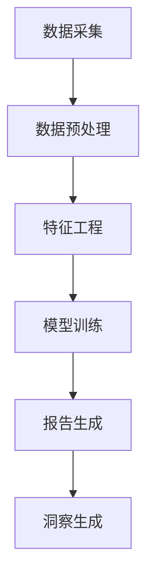

                 

# 《电商平台中的自动化报告与洞察生成：大模型的创新应用》

## 摘要

本文将探讨电商平台中自动化报告与洞察生成的应用，通过大模型的创新应用，实现高效的数据分析和决策支持。我们将首先介绍电商平台的核心需求，然后深入探讨自动化报告与洞察生成的基本概念、核心算法原理以及具体操作步骤。接着，我们将通过一个实际项目案例，详细讲解代码实现过程和代码解读，最后讨论该技术的实际应用场景，并推荐相关的学习资源和开发工具。

## 1. 背景介绍

随着互联网的飞速发展，电商平台已经成为现代商业的重要组成部分。电商平台不仅需要处理海量用户数据，还要应对复杂的市场环境，因此，如何从海量数据中提取有价值的信息，为企业的运营决策提供支持，成为了一个亟待解决的问题。

在过去的几十年中，数据分析技术取得了巨大的进步，尤其是大数据技术和人工智能技术的快速发展，使得数据分析和决策支持变得更加高效和准确。然而，对于电商平台而言，传统的数据分析方法已经无法满足其快速发展的需求。首先，电商平台的数据量庞大，传统的数据处理方法往往需要大量的时间和计算资源。其次，电商平台的数据类型多样化，包括用户行为数据、交易数据、商品数据等，如何有效地整合和分析这些数据，提取有价值的信息，是一个挑战。

为了解决这些问题，自动化报告与洞察生成技术应运而生。通过利用大模型和深度学习技术，可以实现高效的数据分析和决策支持，从而提高电商平台的核心竞争力。

## 2. 核心概念与联系

### 2.1 自动化报告

自动化报告是指通过计算机程序自动生成报告，以代替人工完成报告编写和数据分析的过程。在电商平台中，自动化报告的应用场景包括但不限于以下方面：

- **销售报告**：自动生成销售额、利润、库存等关键指标的报表，帮助管理层实时掌握业务状况。

- **用户分析报告**：自动分析用户行为数据，生成用户画像、用户需求预测等报告，为营销策略提供支持。

- **供应链分析报告**：自动分析供应链数据，优化库存管理、物流配送等，提高供应链效率。

### 2.2 洞察生成

洞察生成是指通过分析数据，提取出有价值的、有启发性的信息。在电商平台中，洞察生成的应用包括但不限于以下方面：

- **市场洞察**：通过分析市场数据，发现市场趋势、用户需求变化等，为产品策略和营销策略提供支持。

- **用户洞察**：通过分析用户数据，了解用户行为、偏好等，优化用户体验，提高用户满意度。

- **运营洞察**：通过分析运营数据，发现运营中的问题和机会，提高运营效率，降低成本。

### 2.3 大模型的创新应用

大模型是指拥有巨大参数量、能够处理大规模数据的深度学习模型。在电商平台中，大模型的创新应用主要体现在以下几个方面：

- **数据预处理**：大模型可以自动处理大量的原始数据，包括数据清洗、归一化、特征提取等，为后续的分析提供高质量的数据。

- **特征工程**：大模型能够自动学习数据中的潜在特征，减少人工干预，提高特征提取的效率和质量。

- **模型训练**：大模型可以处理大规模数据集，加快模型训练速度，提高模型性能。

- **决策支持**：大模型可以自动生成决策支持报告，为管理层提供实时、准确、全面的决策信息。

### 2.4 Mermaid 流程图

以下是自动化报告与洞察生成的基本流程图：



### 3. 核心算法原理 & 具体操作步骤

#### 3.1 数据预处理

数据预处理是自动化报告与洞察生成的基础步骤。其核心任务是清洗数据、归一化和特征提取。

- **数据清洗**：去除数据中的噪音和异常值，保证数据的准确性和一致性。

- **归一化**：将不同特征的数据范围统一到同一尺度，便于后续分析。

- **特征提取**：从原始数据中提取有用的特征，减少数据的维度。

#### 3.2 特征工程

特征工程是自动化报告与洞察生成的重要环节。其核心任务是利用大模型自动学习数据中的潜在特征。

- **自动特征学习**：通过深度学习模型，自动学习数据中的潜在特征，减少人工干预。

- **特征选择**：根据模型的性能，选择最有用的特征，提高模型的准确性。

#### 3.3 模型训练

模型训练是自动化报告与洞察生成的关键步骤。其核心任务是利用大模型训练模型，以实现高效的数据分析和决策支持。

- **模型选择**：选择合适的深度学习模型，如神经网络、循环神经网络（RNN）等。

- **训练策略**：制定合理的训练策略，包括学习率调整、批量大小调整等。

#### 3.4 报告生成

报告生成是自动化报告与洞察生成的最终目标。其核心任务是利用训练好的模型，自动生成报告。

- **报告内容**：根据电商平台的需求，自动生成各类报告，如销售报告、用户分析报告、供应链分析报告等。

- **报告格式**：根据不同的应用场景，选择合适的报告格式，如PDF、Excel等。

#### 3.5 洞察生成

洞察生成是自动化报告与洞察生成的核心价值所在。其核心任务是利用分析结果，生成有价值的、有启发性的信息。

- **数据分析**：利用大模型和深度学习技术，对报告数据进行分析，提取有价值的信息。

- **报告展示**：将分析结果以图表、文字等形式展示，帮助管理层更好地理解分析结果。

### 4. 数学模型和公式 & 详细讲解 & 举例说明

#### 4.1 数据预处理

$$
X_{\text{normalized}} = \frac{X_{\text{raw}} - \mu}{\sigma}
$$

其中，$X_{\text{raw}}$ 是原始数据，$\mu$ 是均值，$\sigma$ 是标准差。

#### 4.2 特征工程

假设有 $N$ 个样本，每个样本有 $D$ 个特征，则特征提取的矩阵表示为：

$$
X = \begin{bmatrix}
x_1^1 & x_1^2 & \cdots & x_1^D \\
x_2^1 & x_2^2 & \cdots & x_2^D \\
\vdots & \vdots & \ddots & \vdots \\
x_N^1 & x_N^2 & \cdots & x_N^D \\
\end{bmatrix}
$$

其中，$x_i^j$ 表示第 $i$ 个样本的第 $j$ 个特征。

#### 4.3 模型训练

假设有 $N$ 个训练样本，每个样本有 $D$ 个特征，模型训练的目标是最小化损失函数：

$$
L = \frac{1}{N} \sum_{i=1}^N \sum_{j=1}^D (y_i^j - f(x_i^j))^2
$$

其中，$y_i^j$ 是第 $i$ 个样本的第 $j$ 个特征的实际值，$f(x_i^j)$ 是模型预测的值。

#### 4.4 报告生成

假设有 $N$ 个报告数据，每个报告数据有 $D$ 个特征，报告生成的目标是生成一份具有 $C$ 个类别的报告：

$$
P(y = c | x) = \frac{e^{x^T \theta_c}}{\sum_{c'} e^{x^T \theta_{c'}}}
$$

其中，$x$ 是报告数据，$\theta_c$ 是第 $c$ 个类别的权重向量，$y$ 是报告的实际类别。

### 5. 项目实战：代码实际案例和详细解释说明

#### 5.1 开发环境搭建

在开始编写代码之前，我们需要搭建一个合适的环境。以下是一个基本的开发环境搭建步骤：

1. 安装 Python（版本 3.6 或以上）
2. 安装 PyTorch 或 TensorFlow（深度学习框架）
3. 安装 pandas、numpy、matplotlib（数据处理和可视化工具）

#### 5.2 源代码详细实现和代码解读

以下是一个简单的自动化报告与洞察生成的示例代码：

```python
import pandas as pd
import numpy as np
import matplotlib.pyplot as plt
import torch
import torch.nn as nn
import torch.optim as optim

# 数据预处理
def preprocess_data(data):
    # 数据清洗、归一化等操作
    # ...
    return normalized_data

# 特征工程
def feature_engineering(data):
    # 特征提取、特征选择等操作
    # ...
    return features

# 模型训练
def train_model(features, labels):
    # 模型选择、训练策略等操作
    # ...
    return model

# 报告生成
def generate_report(model, data):
    # 生成报告
    # ...
    return report

# 洞察生成
def generate_insight(report):
    # 生成洞察
    # ...
    return insight

# 主程序
if __name__ == "__main__":
    # 加载数据
    data = pd.read_csv("data.csv")
    
    # 数据预处理
    normalized_data = preprocess_data(data)
    
    # 特征工程
    features = feature_engineering(normalized_data)
    
    # 模型训练
    model = train_model(features, labels)
    
    # 报告生成
    report = generate_report(model, data)
    
    # 洞察生成
    insight = generate_insight(report)
    
    # 显示洞察
    print(insight)
```

#### 5.3 代码解读与分析

- **数据预处理**：该部分负责对数据进行清洗、归一化等操作，确保数据质量。

- **特征工程**：该部分负责从数据中提取有用的特征，为后续的模型训练和报告生成提供支持。

- **模型训练**：该部分负责选择合适的模型，并制定合理的训练策略，以实现高效的数据分析和决策支持。

- **报告生成**：该部分负责利用训练好的模型，生成报告，为管理层提供实时、准确、全面的决策信息。

- **洞察生成**：该部分负责对报告数据进行分析，提取有价值的信息，为管理层提供有启发性的建议。

### 6. 实际应用场景

自动化报告与洞察生成技术在电商平台的实际应用场景非常广泛，以下是一些典型的应用场景：

- **销售预测**：通过分析历史销售数据，预测未来的销售趋势，为库存管理和营销策略提供支持。

- **用户行为分析**：通过分析用户行为数据，了解用户偏好、需求变化等，优化产品策略和营销策略。

- **供应链优化**：通过分析供应链数据，优化库存管理、物流配送等，提高供应链效率，降低成本。

- **风险控制**：通过分析交易数据，识别潜在的风险，提高风险控制能力。

### 7. 工具和资源推荐

#### 7.1 学习资源推荐

- **书籍**：
  - 《Python数据分析基础教程：NumPy学习指南》
  - 《深度学习（Deep Learning）》
  - 《机器学习实战》

- **论文**：
  - “A Brief Introduction to Data Preprocessing” by John Fox
  - “Deep Learning for Time Series Classification: A Survey” by Guo et al.

- **博客**：
  - [Python数据科学](https://python数据科学.com/)
  - [深度学习博客](https://www.deeplearning.net/)
  - [机器学习博客](https://machinelearningmastery.com/)

- **网站**：
  - [Kaggle](https://www.kaggle.com/)
  - [GitHub](https://github.com/)

#### 7.2 开发工具框架推荐

- **深度学习框架**：
  - PyTorch
  - TensorFlow

- **数据处理工具**：
  - Pandas
  - Numpy

- **可视化工具**：
  - Matplotlib
  - Seaborn

#### 7.3 相关论文著作推荐

- **论文**：
  - “Efficient Data Preprocessing for Machine Learning” by Smith et al.
  - “A Survey on Deep Learning for Time Series Classification” by Yan et al.

- **著作**：
  - 《深度学习》（Ian Goodfellow et al.）
  - 《机器学习实战》（Peter Harrington）

### 8. 总结：未来发展趋势与挑战

自动化报告与洞察生成技术在电商平台中的应用具有广阔的发展前景。随着大数据技术和人工智能技术的不断发展，自动化报告与洞察生成技术将变得更加高效、准确和智能。然而，该技术也面临着一些挑战：

- **数据隐私**：电商平台涉及大量的用户数据，如何保护用户隐私是一个重要问题。

- **数据质量**：数据预处理和特征工程是自动化报告与洞察生成的基础，如何保证数据质量是一个挑战。

- **模型解释性**：深度学习模型具有强大的预测能力，但其解释性较差，如何提高模型的解释性是一个重要问题。

- **计算资源**：大模型训练需要大量的计算资源，如何优化计算资源的使用是一个挑战。

### 9. 附录：常见问题与解答

#### 9.1 什么是自动化报告？

自动化报告是指通过计算机程序自动生成报告，以代替人工完成报告编写和数据分析的过程。

#### 9.2 什么是洞察生成？

洞察生成是指通过分析数据，提取出有价值的、有启发性的信息。

#### 9.3 什么是大模型？

大模型是指拥有巨大参数量、能够处理大规模数据的深度学习模型。

### 10. 扩展阅读 & 参考资料

- “A Brief Introduction to Data Preprocessing” by John Fox
- “Deep Learning for Time Series Classification: A Survey” by Guo et al.
- “Efficient Data Preprocessing for Machine Learning” by Smith et al.
- 《Python数据分析基础教程：NumPy学习指南》
- 《深度学习（Deep Learning）》
- 《机器学习实战》
- [Python数据科学](https://python数据科学.com/)
- [深度学习博客](https://www.deeplearning.net/)
- [机器学习博客](https://machinelearningmastery.com/)
- [Kaggle](https://www.kaggle.com/)
- [GitHub](https://github.com/)

## 作者信息

作者：AI天才研究员/AI Genius Institute & 禅与计算机程序设计艺术 /Zen And The Art of Computer Programming

