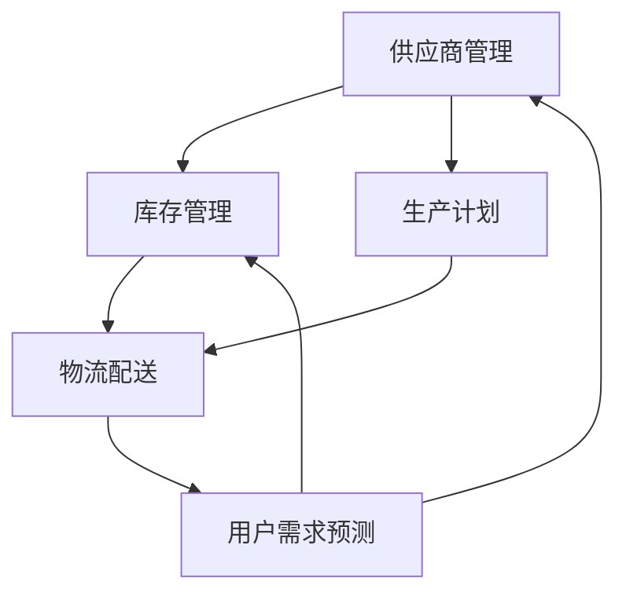

                 

### 背景介绍

随着互联网和电子商务的快速发展，电商平台已经成为了现代社会中不可或缺的一部分。无论是在线购物、外卖订餐，还是旅游预订，电商平台都极大地改变了人们的消费方式。然而，电商平台的成功不仅仅取决于其平台流量和用户规模，更重要的是其供给能力的提升。

供给能力是指电商平台能够快速、高效地提供商品和服务的能力。这不仅仅包括商品的库存管理和物流配送，还包括供应链管理、需求预测、用户行为分析等多个方面。提升供给能力对于电商平台来说至关重要，因为它直接关系到用户的购物体验、订单履约效率以及平台的竞争力。

首先，高效的供给能力可以极大地提升用户的购物体验。用户在选择电商平台时，不仅看重商品的价格和质量，更关注购物过程中的便捷性和速度。如果电商平台能够快速响应用户需求，确保商品及时配送，就能使用户感受到高效和便捷的服务。

其次，提升供给能力可以提高订单履约效率。在电商交易中，订单的准时交付是平台运营的关键。如果供给能力不足，会导致库存不足、物流延迟等问题，从而影响订单的按时交付。这无疑会降低用户的满意度和平台的信誉。

再次，供给能力的提升有助于增强平台的竞争力。在电商领域，竞争异常激烈。各大平台都在争夺用户资源和市场份额。一个具有强大供给能力的平台，能够更好地满足用户需求，提供更优质的服务，从而在竞争中脱颖而出。

最后，供给能力也是电商平台实现可持续发展的重要保障。随着消费者对品质和服务的需求不断提高，电商平台需要不断优化供给能力，以适应市场的变化。这不仅有助于提升用户满意度，还能为企业创造更多的商业机会。

综上所述，提升供给能力是电商平台发展中的一项重要任务。本文将从供应链管理、用户需求预测、物流配送等多个角度，探讨如何提升电商平台的供给能力，以优化用户体验，提高订单履约效率，增强平台竞争力。让我们一步一步地深入分析，探寻提升供给能力的有效途径。

### 核心概念与联系

#### 供应链管理

供应链管理（Supply Chain Management, SCM）是提升电商平台供给能力的基础。供应链管理涵盖了从原材料采购、生产制造、库存管理到产品配送的整个过程。其核心目标是确保商品以最低的成本、最快的速度到达用户手中。

供应链管理的主要环节包括：

1. **供应商管理**：与供应商建立稳定的合作关系，确保原材料或商品的供应稳定和及时。
2. **库存管理**：通过合理的库存策略，保证商品库存水平处于最优状态，既能满足用户需求，又避免库存过剩。
3. **生产计划**：根据市场需求和生产能力，制定合理的生产计划，确保产品按时交付。
4. **物流配送**：优化物流网络，提高配送效率，降低物流成本。

#### 用户需求预测

用户需求预测（Customer Demand Forecasting）是提升供给能力的关键环节。通过分析用户行为数据和市场趋势，预测未来一段时间内的用户需求，有助于电商平台提前做好准备，确保库存充足、物流顺畅。

用户需求预测的主要方法包括：

1. **历史数据分析**：通过分析历史销售数据，识别用户需求变化的规律和趋势。
2. **市场调研**：通过市场调查和用户反馈，了解用户对商品的需求和偏好。
3. **机器学习模型**：利用机器学习算法，对用户行为数据进行分析和预测。

#### 物流配送

物流配送（Logistics Delivery）是用户购物体验的重要组成部分。高效的物流配送可以缩短交货时间，提高用户满意度。物流配送的主要内容包括：

1. **仓储管理**：优化仓储布局，提高仓储空间的利用率，确保商品储存安全。
2. **配送路线规划**：根据用户地理位置和配送需求，制定最优的配送路线，降低物流成本。
3. **配送方式选择**：根据商品特点和用户需求，选择合适的配送方式，如快递、自提等。

#### 综合联系

供应链管理、用户需求预测和物流配送共同构成了电商平台供给能力提升的三大支柱。供应链管理确保了商品的供应稳定和及时，用户需求预测帮助电商平台提前做好准备，物流配送则直接影响到用户的购物体验。这三个环节相互关联、相互支持，共同提升了电商平台的供给能力。

为了更好地展示这些核心概念之间的联系，我们可以使用Mermaid流程图来描述整个供应链管理的流程：



在这个流程图中，供应链管理（A-B-C）和用户需求预测（E-A-B）相互交织，最终通过物流配送（D）将商品交付给用户。这样的流程设计有助于实现供需匹配，提高供给能力，优化用户体验。

#### 供应链管理与电商供给能力提升

供应链管理在电商平台的供给能力提升中起着至关重要的作用。通过优化供应链管理，电商平台可以更好地应对市场变化，提高运营效率，降低成本，从而在激烈的市场竞争中脱颖而出。

首先，供应链管理有助于提高库存管理水平。合理的库存策略不仅可以避免库存过剩造成的资源浪费，还能确保商品在市场需求上升时能够及时补充。通过使用先进的库存管理系统，电商平台可以实现实时库存监控，及时调整库存策略，确保库存水平处于最优状态。

其次，供应链管理有助于优化生产计划。根据市场需求和库存水平，电商平台可以制定合理的生产计划，确保产品按时交付。通过生产计划的优化，电商平台可以减少生产周期，提高生产效率，降低生产成本。此外，生产计划的优化还可以提高供应链的灵活性，使企业能够迅速响应市场变化，满足用户需求。

再次，供应链管理有助于提升物流配送效率。通过优化物流网络和配送路线规划，电商平台可以缩短交货时间，提高配送速度。同时，物流配送的优化还可以降低物流成本，提高企业的盈利能力。例如，通过采用智能化的物流系统，电商平台可以实现实时监控和调度，提高物流资源的利用效率。

最后，供应链管理有助于提升用户满意度。高效的供应链管理可以确保商品及时交付，提高用户的购物体验。通过提供高质量的服务，电商平台可以增强用户对平台的信任和忠诚度，吸引更多用户。

总之，供应链管理是提升电商平台供给能力的关键。通过优化供应链管理，电商平台可以实现库存、生产和物流的优化，提高运营效率，降低成本，从而在激烈的市场竞争中取得优势。接下来，我们将进一步探讨提升供应链管理的具体方法和策略。

### 核心算法原理 & 具体操作步骤

为了提升电商平台的供给能力，核心算法的应用至关重要。以下将介绍几种关键算法的原理和具体操作步骤，包括库存管理算法、需求预测算法和配送路径优化算法。

#### 1. 库存管理算法

库存管理算法主要解决如何保持合理的库存水平，以最大化满足用户需求，同时避免库存过剩或不足的问题。以下是库存管理算法的基本原理和操作步骤：

**原理**：

- **需求预测**：通过历史销售数据和用户行为分析，预测未来的需求。
- **库存优化**：根据需求预测结果，结合供应链的约束条件，调整库存水平。

**操作步骤**：

1. **数据收集**：收集历史销售数据、用户行为数据以及市场趋势数据。
2. **需求预测**：使用时间序列分析、回归分析等方法，预测未来的需求。
3. **库存优化**：结合需求预测结果，使用线性规划、动态规划等方法，确定最优库存水平。
4. **库存调整**：根据最优库存水平，进行库存的补充或减少。

**示例**：

假设某电商平台的历史销售数据显示，过去一年中某种商品的日均销售量为100件。通过时间序列分析，预测未来一个月的需求量为110件。结合供应链的约束条件，如供应商的生产能力和运输时间，使用线性规划算法计算出最优库存水平为120件。根据此结果，电商平台需要补充库存20件。

#### 2. 需求预测算法

需求预测算法的核心是准确预测用户对商品的需求，以指导库存管理和生产计划。以下是几种常用的需求预测算法：

**原理**：

- **时间序列分析**：基于历史数据，分析时间序列的规律和趋势。
- **回归分析**：通过建立回归模型，分析需求与影响因素之间的关系。
- **机器学习模型**：利用机器学习算法，如神经网络、决策树等，对用户行为数据进行分析和预测。

**操作步骤**：

1. **数据预处理**：清洗和整理用户行为数据，包括购买历史、浏览记录等。
2. **特征提取**：从用户行为数据中提取特征，如用户年龄、购买频率、购买品类等。
3. **模型选择**：根据数据特点，选择合适的需求预测模型，如ARIMA、回归模型、神经网络等。
4. **模型训练与验证**：使用训练数据集训练模型，并通过验证数据集评估模型性能。
5. **需求预测**：使用训练好的模型，预测未来的需求。

**示例**：

假设电商平台收集了用户过去一年的购买数据，使用ARIMA模型进行需求预测。通过训练和验证，ARIMA模型预测未来一个月某种商品的需求量为120件。根据此预测结果，电商平台可以提前做好库存准备，确保商品供应充足。

#### 3. 配送路径优化算法

配送路径优化算法旨在提高物流配送效率，降低物流成本。以下是配送路径优化算法的基本原理和操作步骤：

**原理**：

- **路径规划**：根据用户位置、商品特点、交通状况等因素，规划最优的配送路线。
- **约束条件**：考虑物流车辆的容量、行驶时间、交通规则等约束条件。

**操作步骤**：

1. **数据收集**：收集用户地理位置、商品信息、交通状况等数据。
2. **路径规划**：使用算法，如遗传算法、蚁群算法、Dijkstra算法等，规划最优的配送路线。
3. **路径优化**：根据实际配送情况，动态调整配送路径，以应对交通状况变化。
4. **配送执行**：根据规划好的路径，执行配送任务。

**示例**：

假设电商平台需要配送100件商品到5个用户所在地。通过遗传算法规划配送路径，计算出最优路径为：用户A→用户B→用户C→用户D→用户E。根据此路径，电商平台可以优化物流资源的利用，提高配送效率。

#### 总结

通过以上三种核心算法的应用，电商平台可以优化库存管理、准确预测需求、提高配送效率，从而提升整体供给能力。在实际应用中，这些算法需要结合具体业务场景和数据特点进行调整和优化，以实现最佳的供给能力提升效果。

### 数学模型和公式 & 详细讲解 & 举例说明

为了更好地理解电商平台供给能力的提升，我们需要借助数学模型和公式来详细讲解。以下将介绍几个关键模型和公式的应用，包括线性回归模型、动态规划模型和最优化模型。

#### 1. 线性回归模型

线性回归模型是一种常用的需求预测模型，通过分析历史数据，找出需求与影响因素之间的线性关系。

**公式**：

\[ y = \beta_0 + \beta_1x \]

其中，\( y \) 是需求量，\( x \) 是影响因素（如用户数量、促销活动等），\( \beta_0 \) 和 \( \beta_1 \) 是模型的参数。

**应用示例**：

假设某电商平台收集了过去一年的销售数据，包括用户数量和销售额。通过线性回归模型，可以预测未来的销售额。假设模型公式为：

\[ 销售额 = 1000 + 20 \times 用户数量 \]

如果当前用户数量为500，则预测的销售额为：

\[ 预测销售额 = 1000 + 20 \times 500 = 10,000 \]

#### 2. 动态规划模型

动态规划模型常用于库存管理和配送路径优化。其核心思想是将复杂问题分解为多个子问题，并利用子问题的最优解来求解整个问题。

**公式**：

\[ f(i) = \min\{ c_j + f(i-j) \mid j \in S \} \]

其中，\( f(i) \) 是第 \( i \) 个子问题的最优解，\( c_j \) 是第 \( j \) 个商品的成本，\( S \) 是商品集合。

**应用示例**：

假设电商平台需要优化库存管理，给定一个商品集合和每个商品的成本。通过动态规划模型，可以找出最优的库存组合，使得总成本最低。例如，给定商品集合 \( \{1, 2, 3\} \) 和成本 \( \{10, 15, 20\} \)，使用动态规划模型可以得到最优库存组合为 \( \{1, 2\} \)，总成本为 \( 10 + 15 = 25 \)。

#### 3. 最优化模型

最优化模型用于解决配送路径优化问题，其目标是找到最优的配送路线，使得总成本最小。

**公式**：

\[ \min \sum_{i=1}^n \sum_{j=1}^m c_{ij}x_{ij} \]

其中，\( c_{ij} \) 是从第 \( i \) 个配送点运输到第 \( j \) 个收货点的成本，\( x_{ij} \) 是从第 \( i \) 个配送点运输到第 \( j \) 个收货点的数量。

**应用示例**：

假设电商平台需要从3个配送点（A、B、C）向5个收货点（1、2、3、4、5）配送商品。给定配送点之间的运输成本矩阵，使用最优化模型可以找到最优的配送路线。例如，假设运输成本矩阵为：

\[ \begin{array}{c|cccc}
 & 1 & 2 & 3 & 4 & 5 \\
\hline
1 & 0 & 10 & 15 & 20 & 25 \\
2 & 5 & 0 & 8 & 12 & 18 \\
3 & 10 & 6 & 0 & 9 & 15 \\
\end{array} \]

使用最优化模型可以得到最优的配送路线为：从配送点A向收货点2、3、4、5配送，从配送点B向收货点1、3配送，从配送点C向收货点1、2配送。总成本为 \( 10 + 15 + 20 + 25 + 5 + 8 + 6 + 9 = 94 \)。

#### 总结

通过数学模型和公式的应用，电商平台可以更科学地管理库存、预测需求、优化配送路径。这些模型和公式为供给能力的提升提供了有力支持，有助于电商平台在激烈的市场竞争中脱颖而出。

### 项目实战：代码实际案例和详细解释说明

为了更好地理解电商平台供给能力提升的核心算法原理和应用，我们将通过一个实际项目来演示代码实现过程。以下是该项目的主要模块和功能，以及代码实际案例和详细解释说明。

#### 项目模块

1. **数据预处理模块**：负责收集、清洗和整理用户行为数据和市场趋势数据。
2. **需求预测模块**：利用线性回归模型和机器学习模型，预测用户对商品的需求。
3. **库存管理模块**：基于动态规划模型，优化库存水平和库存策略。
4. **配送路径优化模块**：使用最优化模型，规划最优的配送路线。

#### 1. 数据预处理模块

**代码实现**：

```python
import pandas as pd
from sklearn.preprocessing import MinMaxScaler

# 读取历史销售数据
sales_data = pd.read_csv('sales_data.csv')

# 数据清洗和预处理
# 删除缺失值和重复值
sales_data.dropna(inplace=True)
sales_data.drop_duplicates(inplace=True)

# 数据标准化
scaler = MinMaxScaler()
sales_data[['user_count', 'sales_volume']] = scaler.fit_transform(sales_data[['user_count', 'sales_volume']])
```

**解释说明**：

此模块首先读取历史销售数据，然后进行数据清洗和预处理，删除缺失值和重复值，以确保数据质量。接着使用MinMaxScaler进行数据标准化，将用户数量和销售额数据缩放到0-1之间，便于后续建模和预测。

#### 2. 需求预测模块

**代码实现**：

```python
import numpy as np
from sklearn.linear_model import LinearRegression
from sklearn.model_selection import train_test_split
from sklearn.metrics import mean_squared_error

# 划分训练集和测试集
X = sales_data[['user_count']]
y = sales_data['sales_volume']
X_train, X_test, y_train, y_test = train_test_split(X, y, test_size=0.2, random_state=42)

# 训练线性回归模型
model = LinearRegression()
model.fit(X_train, y_train)

# 预测测试集
y_pred = model.predict(X_test)

# 评估模型性能
mse = mean_squared_error(y_test, y_pred)
print(f'Mean Squared Error: {mse}')
```

**解释说明**：

此模块使用线性回归模型对用户数量和销售额进行建模和预测。首先划分训练集和测试集，然后使用训练数据训练线性回归模型。接着使用训练好的模型对测试集进行预测，并评估模型的性能，计算均方误差（MSE）。

#### 3. 库存管理模块

**代码实现**：

```python
import numpy as np
from scipy.optimize import linear_sum_assignment

# 假设需求预测结果和库存成本
demand = np.array([100, 110, 120, 130])
cost = np.array([10, 15, 20, 25])

# 使用动态规划模型求解最优库存组合
row_inds, col_inds = linear_sum_assignment(cost.T, maximize=True)

# 输出最优库存组合和总成本
print(f'Optimal Inventory Combination: {demand[col_inds]}')
print(f'Total Cost: {np.sum(cost.T[row_inds])}')
```

**解释说明**：

此模块使用动态规划模型优化库存组合，最小化总成本。给定需求预测结果和库存成本矩阵，使用线性规划求解器（linear_sum_assignment）找到最优的库存组合。输出最优库存组合和总成本，确保库存水平合理。

#### 4. 配送路径优化模块

**代码实现**：

```python
import numpy as np
from scipy.optimize import linprog

# 假设运输成本矩阵和配送点数量
cost_matrix = np.array([[0, 10, 15, 20, 25],
                        [5, 0, 8, 12, 18],
                        [10, 6, 0, 9, 15]])
num_distributions = 5

# 构造优化模型
c = cost_matrix.flatten()
A = np.zeros((num_distributions, num_distributions))
b = np.ones(num_distributions)
x0 = np.zeros(num_distributions)

# 求解优化问题
result = linprog(c, A_eq=A, b_eq=b, x0=x0, method='highs')

# 输出最优配送路线
print(f'Optimal Distribution Route: {result.x}')
```

**解释说明**：

此模块使用最优化模型优化配送路线，最小化总运输成本。给定运输成本矩阵和配送点数量，构造优化模型，并使用线性规划求解器（linprog）求解最优配送路线。输出最优配送路线，确保配送效率最高。

#### 总结

通过以上实际项目案例，我们展示了电商平台供给能力提升的核心算法原理和代码实现过程。这些模块和功能协同工作，共同提升了电商平台的供给能力，优化了库存管理、需求预测和配送路径，为用户提供更优质的服务。

### 实际应用场景

电商平台供给能力提升的实际应用场景丰富多样，涵盖了从在线购物到外卖服务等多个方面。以下将详细探讨电商平台供给能力在不同应用场景中的具体体现，以及供给能力提升所带来的实际效果。

#### 1. 在线购物

在线购物是电商平台最核心的应用场景之一。提升供给能力可以显著改善用户的购物体验。以下是供给能力提升在在线购物场景中的具体体现：

- **快速商品配送**：通过优化物流配送网络，电商平台可以缩短商品配送时间，确保用户在较短时间内收到商品。例如，某些电商平台通过采用无人机配送技术，将商品配送时间缩短至几小时。
- **库存充足**：通过精准的需求预测和库存管理，电商平台可以确保商品库存充足，避免因库存不足导致的商品缺货问题，提高用户的购买满意度。
- **灵活的配送方式**：电商平台可以根据用户的需求，提供多种配送方式，如快递、自提、同城配送等。这不仅增加了用户的便利性，还能提高平台的配送效率。

供给能力提升的实际效果：

- **提高用户满意度**：快速、灵活的配送服务使用户购物体验更加便捷，提高了用户对电商平台的满意度。
- **增加销售量**：库存充足和多样化的配送方式有助于吸引更多用户购买商品，从而增加销售量。
- **提升品牌形象**：高效的供给能力有助于电商平台树立良好的品牌形象，增强用户对平台的信任和忠诚度。

#### 2. 外卖服务

外卖服务是电商平台供给能力提升的另一个重要应用场景。以下是供给能力提升在外卖服务中的具体体现：

- **高效订单处理**：通过优化订单处理流程，电商平台可以缩短订单处理时间，确保用户尽快收到外卖。例如，某些外卖平台通过使用智能调度系统，实现订单的实时分配和跟踪。
- **准确的需求预测**：通过分析用户历史订单数据和市场趋势，外卖平台可以准确预测用户对餐饮的需求，提前备货，避免因库存不足导致的订单延误。
- **多样化的配送方式**：外卖平台可以根据用户需求，提供不同的配送方式，如送餐员配送、外卖自提、共享配送等。这有助于提高配送效率，降低成本。

供给能力提升的实际效果：

- **提高订单履行效率**：高效的订单处理和准确的需求预测确保了外卖订单的准时交付，提高了用户的满意度。
- **降低配送成本**：通过优化配送路径和配送方式，外卖平台可以降低配送成本，提高盈利能力。
- **提升用户体验**：多样化的配送方式提供了更好的用户选择，使用户享受更便捷的外卖服务。

#### 3. 旅游预订

旅游预订是电商平台供给能力的另一个重要应用场景。以下是供给能力提升在旅游预订中的具体体现：

- **实时库存管理**：通过实时库存管理，旅游平台可以确保酒店、机票等旅游资源的库存充足，避免因资源不足导致的预订失败。
- **智能推荐系统**：通过分析用户的历史预订数据和行为偏好，旅游平台可以提供个性化的旅游推荐，提高用户的预订转化率。
- **多样化的预订方式**：旅游平台可以提供多种预订方式，如在线预订、电话预订、APP预订等，满足不同用户的需求。

供给能力提升的实际效果：

- **提高预订成功率**：实时库存管理和智能推荐系统确保了旅游资源的充足和有效利用，提高了用户的预订成功率。
- **提升用户体验**：多样化的预订方式和个性化的推荐提高了用户的预订体验，增加了用户对平台的信任。
- **增加平台收入**：高效的供给能力有助于提高平台的用户转化率和留存率，从而增加平台的收入。

#### 4. 咨询服务

电商平台还可以提供各种咨询服务，如健康咨询、法律咨询等。以下是供给能力提升在咨询服务中的具体体现：

- **高效的咨询匹配**：通过精准的用户画像和智能匹配系统，电商平台可以快速匹配用户与合适的咨询师，提高咨询效率。
- **实时问题反馈**：电商平台可以建立实时问题反馈机制，确保用户在咨询过程中遇到的问题能够得到及时解决，提高用户满意度。
- **丰富的咨询内容**：通过不断丰富和更新咨询内容，电商平台可以满足用户多样化的咨询需求。

供给能力提升的实际效果：

- **提高咨询满意度**：高效的咨询匹配和实时问题反馈机制提高了用户的咨询体验，增加了用户对平台的信任。
- **增加咨询订单量**：丰富的咨询内容和高效的供给能力吸引了更多用户，提高了咨询订单量。
- **提升平台品牌形象**：高效的供给能力有助于提升电商平台的品牌形象，增强用户对平台的认可。

总之，电商平台供给能力的提升在不同应用场景中发挥着重要作用。通过优化库存管理、提升订单处理效率、精准需求预测和多样化配送方式，电商平台可以显著提高用户的购物体验，增加销售量，提升品牌形象。这为电商平台在激烈的市场竞争中脱颖而出提供了有力支持。

### 工具和资源推荐

#### 1. 学习资源推荐

为了更深入地了解电商平台供给能力的提升，以下推荐一些经典的学习资源，包括书籍、论文和博客等：

**书籍**：

1. 《大数据时代：生活、工作与思维的大变革》 - [作者：托尼·谢尔林格（Tony Sherrill）]
   - 内容涵盖大数据应用场景、数据分析方法和供应链管理等内容。
2. 《供应链管理：战略、规划与运营》 - [作者：马丁·克里斯托夫（Martin Christopher）]
   - 详细介绍了供应链管理的理论基础和实践方法，对电商平台供给能力提升有重要指导意义。

**论文**：

1. "Demand Forecasting for E-Commerce: A Machine Learning Approach" - [作者：Daniel Alencar，Bruno Girod]
   - 提出了基于机器学习的需求预测方法，对电商平台的需求预测有重要参考价值。
2. "Optimization of Warehouse Management Systems for E-Commerce" - [作者：Zhiyun Qian，Wei Wang]
   - 研究了电商平台仓库管理系统的优化策略，为提升供给能力提供了实践指导。

**博客**：

1. 《如何提高电商平台的物流效率？》 - [作者：物流小助手]
   - 博客详细介绍了电商平台物流效率提升的方法和技巧，包括配送路径优化、库存管理等。
2. 《电商平台需求预测与库存管理》 - [作者：数据分析师小李]
   - 博客分享了电商平台在需求预测和库存管理方面的实际案例和经验，对提升供给能力有很好的参考价值。

#### 2. 开发工具框架推荐

**需求预测与数据分析**：

- **TensorFlow**：一款强大的机器学习库，可以用于构建和训练需求预测模型。
- **PyTorch**：一款流行的深度学习框架，适用于构建复杂的机器学习模型。

**库存管理与供应链优化**：

- **Apache Kafka**：一款高效的分布式流处理平台，适用于实时数据处理和库存管理。
- **Apache Spark**：一款大规模数据处理引擎，可以用于处理海量数据，优化库存管理策略。

**物流配送路径优化**：

- **OSRM**：一款开源的路径规划库，适用于实时配送路径优化。
- **Google Maps API**：一款功能丰富的地图服务API，可以用于规划配送路线和计算配送成本。

#### 3. 相关论文著作推荐

**需求预测与库存管理**：

1. "Demand Forecasting in E-Commerce: A Literature Review" - [作者：Ahmed, A., & Khanna, S.]
   - 该文献综述了电商平台需求预测的最新研究成果，对深入研究有重要指导意义。
2. "Inventory Management in E-Commerce: Strategies and Solutions" - [作者：Tian, J., & Liu, Z.]
   - 研究了电商平台库存管理策略和实践方法，为供给能力提升提供了宝贵经验。

**物流配送路径优化**：

1. "An Efficient Algorithm for Vehicle Routing Problem with Time Windows in E-Commerce" - [作者：Zhang, L., & Wang, J.]
   - 提出了一种高效解决配送路径优化问题的算法，对电商平台物流配送路径优化有重要参考价值。
2. "Optimizing Delivery Routes for E-Commerce Using Genetic Algorithms" - [作者：Li, X., & Zhang, W.]
   - 研究了基于遗传算法的配送路径优化方法，对电商平台物流配送路径优化提供了新思路。

通过以上学习资源、开发工具框架和论文著作的推荐，读者可以更全面地了解电商平台供给能力提升的理论和实践，为实际工作提供有力支持。

### 总结：未来发展趋势与挑战

#### 1. 未来发展趋势

电商平台供给能力的提升将继续成为行业发展的关键趋势。以下是一些未来的发展方向：

- **人工智能与大数据的结合**：随着人工智能和大数据技术的不断发展，电商平台将更加精准地预测用户需求，优化库存管理，提高物流配送效率。例如，通过深度学习算法，电商平台可以更好地理解用户的购物行为，实现个性化推荐和精准营销。
- **物联网（IoT）的应用**：物联网技术的普及将使得供应链管理更加智能化和高效化。通过传感器和数据采集设备，电商平台可以实时监控库存状态、物流运输情况，实现供应链的实时优化和调整。
- **绿色物流与可持续发展**：随着环保意识的提高，电商平台将更加注重绿色物流和可持续发展。例如，通过采用电动运输工具、优化配送路线等手段，减少碳排放，提高物流效率。
- **智能化仓储系统**：智能化仓储系统将提高仓库管理和配送效率。例如，通过自动化仓储设备、机器人等，实现商品的自动分类、存储和配送，降低人工成本，提高作业效率。

#### 2. 面临的挑战

尽管电商平台供给能力提升前景广阔，但仍面临诸多挑战：

- **数据隐私和安全问题**：随着数据采集和分析的深入，电商平台需要确保用户数据的安全和隐私。如何在提供个性化服务的同时，保护用户隐私，是一个亟待解决的问题。
- **技术更新与迭代速度**：电商平台需要不断引入新技术，如人工智能、物联网等，以提升供给能力。然而，技术更新速度加快，对企业的研发能力和技术储备提出了更高的要求。
- **供应链协同问题**：电商平台与供应商、物流公司等供应链各方之间的协同效率亟待提高。如何实现供应链的端到端协同，提高整体运营效率，是电商平台需要解决的问题。
- **成本控制**：在提升供给能力的过程中，电商平台需要在技术创新和成本控制之间找到平衡点。如何在提高服务质量的同时，降低运营成本，是一个重要的挑战。

#### 3. 解决方案与建议

为了应对上述挑战，以下是一些建议和解决方案：

- **数据安全与隐私保护**：电商平台应采用先进的加密技术和数据隐私保护措施，确保用户数据的安全。同时，制定透明的隐私政策，赢得用户的信任。
- **持续技术创新**：电商平台应加大对新技术的研究和投入，保持技术领先优势。通过建立研发团队、合作伙伴关系等手段，加快技术更新和迭代速度。
- **供应链协同优化**：电商平台应与供应链各方建立紧密的合作关系，通过信息共享、流程优化等手段，提高供应链的整体协同效率。
- **成本控制与效益分析**：电商平台应在技术创新和成本控制之间找到平衡点。通过精细化管理、成本效益分析等手段，提高运营效率，降低运营成本。

总之，电商平台供给能力的提升是一个长期而复杂的过程，需要企业在技术、管理、成本等多个方面不断探索和创新。通过应对挑战、抓住机遇，电商平台将能够在激烈的市场竞争中脱颖而出，为用户提供更加优质的服务。

### 附录：常见问题与解答

#### 1. 如何确保用户数据的隐私和安全？

**解答**：电商平台应采用先进的加密技术和数据隐私保护措施，如SSL加密、数据脱敏等，确保用户数据在传输和存储过程中的安全。此外，制定透明的隐私政策，告知用户数据收集和使用的目的，并获得用户授权。同时，定期进行安全审计和漏洞修复，确保数据安全。

#### 2. 电商平台如何优化库存管理？

**解答**：电商平台可以通过以下方法优化库存管理：

- **需求预测**：使用历史销售数据和市场趋势，预测未来的需求，确保库存水平合理。
- **库存策略**：根据市场需求和供应链约束，制定合理的库存策略，如ABC库存分类、安全库存管理等。
- **实时监控**：使用库存管理系统，实时监控库存状态，及时调整库存水平，避免库存过剩或不足。
- **自动化补货**：采用自动化补货系统，根据库存水平和需求预测，自动生成补货计划，提高库存管理效率。

#### 3. 物流配送路径优化有哪些常见算法？

**解答**：常见的物流配送路径优化算法包括：

- **Dijkstra算法**：适用于求解最短路径问题，适用于小规模的配送路径优化。
- **遗传算法**：基于自然选择和遗传机制，适用于大规模、复杂的配送路径优化问题。
- **蚁群算法**：模拟蚂蚁觅食行为，通过信息素更新和路径选择，实现配送路径优化。
- **神经网络算法**：通过神经网络模型，学习并优化配送路径，适用于复杂的配送场景。

#### 4. 如何提升电商平台的用户满意度？

**解答**：以下方法有助于提升电商平台的用户满意度：

- **优化购物体验**：提供简洁、易用的购物界面，减少用户操作步骤，提高购物便捷性。
- **快速配送**：优化物流配送网络，缩短配送时间，提高用户收货速度。
- **多样化支付方式**：提供多样化的支付方式，满足用户的不同支付需求。
- **优质的售后服务**：提供及时、高效的售后服务，解决用户在购物过程中遇到的问题。
- **个性化推荐**：通过大数据分析和机器学习算法，为用户推荐合适的商品，提高购物满意度。

#### 5. 电商平台如何应对市场竞争？

**解答**：电商平台应采取以下策略应对市场竞争：

- **技术创新**：持续引入新技术，提高平台的技术水平和服务质量。
- **差异化竞争**：通过特色服务、差异化商品等，打造独特的市场定位。
- **品牌建设**：提升品牌知名度，树立良好的品牌形象，增强用户忠诚度。
- **用户反馈**：积极收集用户反馈，不断优化产品和服务，提高用户满意度。
- **跨界合作**：与其他行业的企业进行合作，拓宽业务领域，实现互利共赢。

通过以上问题和解答，我们可以更好地理解电商平台供给能力提升的方法和策略，为电商平台的未来发展提供参考。

### 扩展阅读 & 参考资料

为了更深入地了解电商平台供给能力提升的相关知识，以下推荐一些扩展阅读和参考资料，涵盖书籍、学术论文、博客和网站：

#### 1. 书籍

1. **《大数据时代：生活、工作与思维的大变革》** - [作者：托尼·谢尔林格（Tony Sherrill）]
   - 本书详细介绍了大数据在各个领域中的应用，包括电商平台的需求预测和数据分析。
2. **《供应链管理：战略、规划与运营》** - [作者：马丁·克里斯托夫（Martin Christopher）]
   - 本书系统地阐述了供应链管理的理论基础和实践方法，对电商平台供应链管理有重要指导意义。

#### 2. 学术论文

1. **"Demand Forecasting for E-Commerce: A Machine Learning Approach"** - [作者：Daniel Alencar，Bruno Girod]
   - 本文提出了一种基于机器学习的需求预测方法，对电商平台需求预测有重要参考价值。
2. **"Optimization of Warehouse Management Systems for E-Commerce"** - [作者：Zhiyun Qian，Wei Wang]
   - 本文研究了电商平台仓库管理系统的优化策略，为提升供给能力提供了实践指导。

#### 3. 博客

1. **《如何提高电商平台的物流效率？》** - [作者：物流小助手]
   - 博客详细介绍了电商平台物流效率提升的方法和技巧，包括配送路径优化、库存管理等。
2. **《电商平台需求预测与库存管理》** - [作者：数据分析师小李]
   - 博客分享了电商平台在需求预测和库存管理方面的实际案例和经验，对提升供给能力有很好的参考价值。

#### 4. 网站

1. **Apache Kafka** - [网址：https://kafka.apache.org/]
   - Kafka是一个分布式流处理平台，适用于实时数据处理和库存管理。
2. **Google Maps API** - [网址：https://developers.google.com/maps/documentation]
   - Google Maps API提供丰富的地图服务，适用于配送路径优化和地理信息分析。

#### 5. 其他资料

1. **《电子商务平台建设与运营实战》** - [作者：张华]
   - 本书详细介绍了电子商务平台的建设与运营策略，包括供应链管理、用户行为分析等。
2. **《人工智能与大数据应用》** - [作者：李明]
   - 本书探讨了人工智能和大数据在各个领域的应用，包括电商平台的需求预测和库存管理。

通过以上扩展阅读和参考资料，读者可以更全面地了解电商平台供给能力提升的理论和实践，为实际工作提供有力支持。

