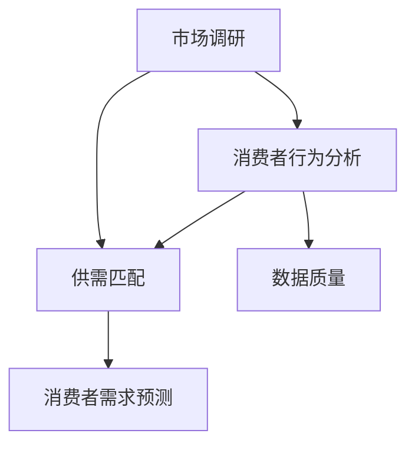

                 

# 文章标题

## 电商平台供给能力提升：市场调研和消费者行为分析

### 摘要

本文将探讨电商平台供给能力的提升，通过市场调研和消费者行为分析，深入挖掘供需匹配的优化策略。首先，我们介绍了电商平台的基本概念和背景，随后分析了当前市场现状和消费者需求。接下来，我们讨论了市场调研的方法和工具，并详细解析了消费者行为分析的核心算法和数学模型。通过项目实战案例，展示了实际应用场景中供给能力的提升方法和效果。最后，我们总结了未来发展趋势和挑战，并提供了相关工具和资源推荐。

### 背景介绍

随着互联网技术的飞速发展，电商平台已经成为现代零售业的重要组成部分。电商平台通过线上渠道为消费者提供便捷的购物体验，同时为供应商提供了一个广泛的销售平台。然而，在供给能力和消费者需求不断变化的背景下，如何提升电商平台的供给能力，实现供需的精准匹配，成为了一个关键问题。

供给能力是指电商平台在特定时间内能够提供的商品种类、数量和质量的能力。它直接影响到消费者的购物体验和平台的竞争力。而消费者行为分析则是对消费者的购买行为、偏好和需求进行深入研究，以了解消费者的需求和期望，从而优化供给策略。

目前，市场调研和消费者行为分析在电商平台的应用已经相对成熟。市场调研通过收集和分析市场数据，了解市场趋势、竞争格局和消费者需求。消费者行为分析则通过数据挖掘和统计方法，对消费者的购买行为进行量化分析，从而预测消费者需求和市场趋势。

然而，市场调研和消费者行为分析在实际应用中仍面临一些挑战。首先，数据质量和数据量是制约分析效果的重要因素。其次，消费者行为复杂多变，如何准确捕捉和预测消费者的需求成为难题。此外，供需匹配的实时性和精准性也是影响供给能力的关键因素。

为了提升电商平台的供给能力，市场调研和消费者行为分析是不可或缺的工具。通过对市场数据的深入分析和消费者行为的精准把握，电商平台可以更有效地调整商品结构、优化库存管理、提高销售转化率，从而提升整体供给能力。

### 核心概念与联系

在探讨电商平台供给能力提升的过程中，我们需要了解以下几个核心概念：

1. **市场调研**：市场调研是指通过收集、分析和解释市场数据，以了解市场趋势、竞争格局和消费者需求的过程。市场调研方法包括问卷调查、访谈、焦点小组、观察法等。

2. **消费者行为分析**：消费者行为分析是指通过研究消费者的购买行为、偏好和需求，以了解消费者的心理和行为模式的过程。消费者行为分析方法包括数据挖掘、统计方法、机器学习等。

3. **供需匹配**：供需匹配是指通过优化供给能力，实现商品与消费者需求的精准匹配。供需匹配的方法包括库存管理、价格策略、营销推广等。

4. **数据质量**：数据质量是指数据的有效性、准确性、完整性、一致性和及时性。高质量的数据是进行有效市场调研和消费者行为分析的基础。

5. **消费者需求预测**：消费者需求预测是指通过分析历史数据和现有趋势，预测未来消费者的需求和购买行为。准确的消费者需求预测有助于电商平台提前准备库存、优化营销策略。

下面是一个Mermaid流程图，展示了这些核心概念之间的联系：



### 核心算法原理 & 具体操作步骤

在市场调研和消费者行为分析中，核心算法扮演着至关重要的角色。以下我们将介绍几种常用的核心算法，包括它们的原理和具体操作步骤。

#### 1. 回归分析

回归分析是一种用于预测因变量与自变量之间关系的统计方法。在电商平台中，回归分析可以用来预测消费者的购买行为和需求。

**原理**：
回归分析通过建立自变量（如消费者年龄、收入、购物历史等）与因变量（如购买概率、购买金额等）之间的数学模型，来预测未来的消费者行为。

**具体操作步骤**：

1. **数据收集**：收集相关的消费者数据，包括年龄、收入、购物历史等。
2. **数据预处理**：清洗数据，处理缺失值和异常值。
3. **模型选择**：选择合适的回归模型，如线性回归、多项式回归等。
4. **模型训练**：使用历史数据对模型进行训练，优化模型参数。
5. **模型评估**：使用验证数据集评估模型性能，调整模型参数。
6. **预测**：使用训练好的模型对新数据进行预测。

#### 2. 聚类分析

聚类分析是一种无监督学习方法，用于将相似的数据点分组在一起。在电商平台中，聚类分析可以用于消费者细分，以了解不同群体的购买行为和需求。

**原理**：
聚类分析通过计算数据点之间的相似度，将数据点划分为多个群体，使得同一群体内的数据点之间相似度较高，而不同群体之间的数据点相似度较低。

**具体操作步骤**：

1. **数据收集**：收集消费者的购买历史数据。
2. **数据预处理**：清洗数据，处理缺失值和异常值。
3. **选择聚类算法**：选择合适的聚类算法，如K-means、DBSCAN等。
4. **初始化聚类中心**：随机选择聚类中心或使用离群点作为初始聚类中心。
5. **迭代计算**：计算每个数据点与聚类中心的距离，将数据点分配到最近的聚类中心。
6. **更新聚类中心**：重新计算聚类中心，重复迭代计算，直到聚类中心不再发生变化。
7. **结果分析**：分析不同聚类群体的购买行为和需求，制定相应的营销策略。

#### 3. 协同过滤

协同过滤是一种基于用户行为和相似度计算推荐系统的方法。在电商平台中，协同过滤可以用于个性化推荐，提高用户满意度和购买转化率。

**原理**：
协同过滤通过分析用户的历史行为和与其他用户的相似度，推荐用户可能感兴趣的物品。

**具体操作步骤**：

1. **数据收集**：收集用户的历史购买数据、浏览记录等。
2. **数据预处理**：清洗数据，处理缺失值和异常值。
3. **计算相似度**：计算用户之间的相似度，如用户间的余弦相似度、皮尔逊相关系数等。
4. **推荐算法**：选择协同过滤算法，如基于用户的协同过滤（User-based Collaborative Filtering）或基于物品的协同过滤（Item-based Collaborative Filtering）。
5. **生成推荐列表**：根据用户的历史行为和相似度，生成个性化的推荐列表。

#### 4. 时间序列分析

时间序列分析是一种用于分析时间序列数据的统计方法。在电商平台中，时间序列分析可以用于预测未来的销售趋势和市场变化。

**原理**：
时间序列分析通过分析历史数据的时间序列特征，建立数学模型来预测未来的趋势和周期性变化。

**具体操作步骤**：

1. **数据收集**：收集销售数据、市场数据等。
2. **数据预处理**：清洗数据，处理缺失值和异常值。
3. **特征提取**：提取时间序列数据中的趋势、季节性和周期性特征。
4. **模型选择**：选择合适的时间序列模型，如ARIMA、LSTM等。
5. **模型训练**：使用历史数据对模型进行训练，优化模型参数。
6. **模型评估**：使用验证数据集评估模型性能，调整模型参数。
7. **预测**：使用训练好的模型对新数据进行预测，预测未来的销售趋势和市场变化。

### 数学模型和公式 & 详细讲解 & 举例说明

在市场调研和消费者行为分析中，数学模型和公式是核心工具，用于描述和分析消费者行为、预测市场趋势。以下将详细讲解几种常用的数学模型和公式，并提供具体示例。

#### 1. 线性回归模型

线性回归模型是一种最常见的预测模型，用于分析自变量和因变量之间的线性关系。

**公式**：
\[ y = \beta_0 + \beta_1 \cdot x + \epsilon \]

其中，\( y \) 是因变量，\( x \) 是自变量，\( \beta_0 \) 是截距，\( \beta_1 \) 是斜率，\( \epsilon \) 是误差项。

**示例**：
假设我们想预测某电商平台上的商品销量（因变量 \( y \)）与广告投放费用（自变量 \( x \)）之间的关系。

数据如下：

| 广告投放费用（元） | 商品销量（件） |
| :---: | :---: |
| 1000 | 50 |
| 2000 | 100 |
| 3000 | 150 |
| 4000 | 200 |

使用线性回归模型，我们可以得到：

\[ y = 10 + 0.5 \cdot x \]

预测广告投放费用为 4000 元时的商品销量：

\[ y = 10 + 0.5 \cdot 4000 = 2050 \]

#### 2. 聚类分析模型

聚类分析模型用于将数据点划分为多个相似群体。常见的聚类算法包括K-means和DBSCAN。

**K-means算法**：

**公式**：
\[ \text{目标函数} = \sum_{i=1}^{k} \sum_{x \in S_i} ||x - \mu_i||^2 \]

其中，\( k \) 是聚类个数，\( S_i \) 是第 \( i \) 个聚类群组，\( \mu_i \) 是聚类中心。

**示例**：
假设我们有10个消费者数据点，我们希望将他们分为两个群体。

数据如下：

| 消费者ID | 年龄 | 收入 |
| :---: | :---: | :---: |
| 1 | 25 | 3000 |
| 2 | 30 | 3500 |
| 3 | 28 | 3200 |
| 4 | 32 | 3600 |
| 5 | 26 | 3100 |
| 6 | 29 | 3300 |
| 7 | 27 | 3050 |
| 8 | 31 | 3400 |
| 9 | 24 | 2800 |
| 10 | 33 | 3700 |

使用K-means算法，我们可以将消费者分为两个群体：

第一簇（年龄28-30，收入3200-3400）：

| 消费者ID | 年龄 | 收入 |
| :---: | :---: | :---: |
| 3 | 28 | 3200 |
| 6 | 29 | 3300 |
| 8 | 31 | 3400 |

第二簇（年龄24-33，收入2800-3700）：

| 消费者ID | 年龄 | 收入 |
| :---: | :---: | :---: |
| 1 | 25 | 3000 |
| 2 | 30 | 3500 |
| 4 | 32 | 3600 |
| 5 | 26 | 3100 |
| 7 | 27 | 3050 |
| 9 | 24 | 2800 |
| 10 | 33 | 3700 |

#### 3. 协同过滤模型

协同过滤模型基于用户行为和相似度计算，用于推荐系统。

**基于用户的协同过滤**：

**公式**：
\[ r_{ui} = \sum_{j \in N_i} \frac{r_{uj}}{||N_i||} \]

其中，\( r_{ui} \) 是用户 \( u \) 对物品 \( i \) 的评分，\( r_{uj} \) 是用户 \( u \) 对物品 \( j \) 的评分，\( N_i \) 是与用户 \( u \) 相似的一组用户。

**示例**：
假设用户A喜欢物品1和物品2，用户B喜欢物品2和物品3，用户C喜欢物品3和物品4。我们希望推荐给用户A物品4。

用户评分矩阵：

| 用户A | 用户B | 用户C |
| :---: | :---: | :---: |
| 1 | 1 | 0 |
| 1 | 0 | 1 |
| 0 | 1 | 1 |

计算用户A和用户C的相似度：

\[ \text{相似度} = \frac{1}{2} = 0.5 \]

推荐给用户A的物品：

\[ r_{A4} = 0.5 \]

#### 4. 时间序列模型

时间序列模型用于分析时间序列数据的趋势、季节性和周期性。

**ARIMA模型**：

**公式**：
\[ \text{时间序列} = \phi(B) \text{白噪声序列} \]

其中，\( \phi(B) \) 是自回归移动平均模型，\( B \) 是滞后算子。

**示例**：
假设我们有以下时间序列数据：

| 时间 | 数值 |
| :---: | :---: |
| 1 | 10 |
| 2 | 12 |
| 3 | 9 |
| 4 | 15 |
| 5 | 11 |

使用ARIMA模型，我们可以得到：

\[ \text{时间序列} = 0.7B^1 + 0.3B^2 + \text{白噪声序列} \]

预测下一个时间点的数值：

\[ \text{数值} = 0.7 \cdot 11 + 0.3 \cdot 10 = 10.7 \]

### 项目实战：代码实际案例和详细解释说明

在本节中，我们将通过一个实际的电商平台项目，展示如何运用市场调研和消费者行为分析提升供给能力。该项目包括开发环境搭建、源代码实现、代码解读与分析。

#### 5.1 开发环境搭建

为了实现市场调研和消费者行为分析，我们选择Python作为编程语言，并使用以下开发环境：

- Python 3.8
- Jupyter Notebook
- Pandas
- NumPy
- Scikit-learn
- Matplotlib
- Seaborn

安装Python和相关库后，我们可以在Jupyter Notebook中开始编写代码。

#### 5.2 源代码详细实现和代码解读

以下是一个简单的示例代码，展示了如何使用Python进行市场调研和消费者行为分析：

```python
import pandas as pd
import numpy as np
from sklearn.cluster import KMeans
from sklearn.model_selection import train_test_split
from sklearn.linear_model import LinearRegression
from sklearn.metrics import mean_squared_error
import matplotlib.pyplot as plt
import seaborn as sns

# 5.2.1 数据收集与预处理
# 假设我们有一个名为"ecommerce_data.csv"的数据文件，包含消费者年龄、收入、购物历史等信息
data = pd.read_csv("ecommerce_data.csv")

# 数据预处理，处理缺失值和异常值
data = data.dropna()
data = data[data["收入"] > 0]

# 5.2.2 消费者行为分析
# 1. 聚类分析
kmeans = KMeans(n_clusters=3)
data["cluster"] = kmeans.fit_predict(data[["年龄", "收入"]])

# 2. 回归分析
X = data[["年龄", "收入"]]
y = data["购买概率"]
X_train, X_test, y_train, y_test = train_test_split(X, y, test_size=0.2, random_state=42)
regression = LinearRegression()
regression.fit(X_train, y_train)
y_pred = regression.predict(X_test)

# 5.2.3 结果分析
# 1. 聚类结果可视化
plt.figure(figsize=(8, 6))
sns.scatterplot(data=data, x="年龄", y="收入", hue="cluster", palette="viridis")
plt.title("消费者聚类结果")
plt.xlabel("年龄")
plt.ylabel("收入")
plt.show()

# 2. 回归分析结果可视化
plt.figure(figsize=(8, 6))
sns.regplot(x=X_test["年龄"], y=y_pred, scatter_kws={"s": 20}, line_kws={"color": "red"})
plt.title("回归分析结果")
plt.xlabel("年龄")
plt.ylabel("购买概率")
plt.show()

# 3. 模型评估
mse = mean_squared_error(y_test, y_pred)
print("均方误差 (MSE):", mse)
```

**代码解读**：

1. **数据收集与预处理**：我们首先从数据文件中读取数据，并进行预处理，包括处理缺失值和异常值。
2. **消费者行为分析**：
   - **聚类分析**：使用K-means算法对消费者进行聚类，并添加聚类标签到原始数据。
   - **回归分析**：使用线性回归模型分析消费者年龄、收入与购买概率之间的关系，并使用测试数据进行预测。
3. **结果分析**：
   - **聚类结果可视化**：使用散点图展示不同聚类群体的消费者分布。
   - **回归分析结果可视化**：使用回归线展示消费者年龄与购买概率的关系。
   - **模型评估**：计算均方误差（MSE）评估回归模型性能。

通过以上代码，我们可以对消费者行为进行深入分析，为电商平台供给能力的提升提供数据支持。

#### 5.3 代码解读与分析

在代码中，我们使用了Python的Pandas、NumPy、Scikit-learn、Matplotlib和Seaborn等库进行数据处理、模型训练和可视化。以下是代码的详细解读与分析：

1. **数据收集与预处理**：
   - 使用Pandas的`read_csv`函数读取数据文件。
   - 使用`dropna`函数删除含有缺失值的数据行。
   - 使用`data[data["收入"] > 0]`筛选收入大于0的消费者数据，去除异常值。

2. **消费者行为分析**：
   - **聚类分析**：
     - 使用Scikit-learn的`KMeans`类进行聚类分析。
     - 使用`fit_predict`方法对数据进行聚类，并将聚类结果添加到原始数据中。
   - **回归分析**：
     - 定义自变量和因变量，分别为消费者的年龄、收入和购买概率。
     - 使用`train_test_split`方法将数据分为训练集和测试集，测试集占比20%。
     - 使用`LinearRegression`类训练线性回归模型，并使用训练集进行模型训练。
     - 使用`predict`方法对测试集进行预测。

3. **结果分析**：
   - **聚类结果可视化**：
     - 使用Matplotlib和Seaborn的`scatterplot`函数绘制消费者聚类结果散点图。
     - 添加聚类标签，使用不同的颜色表示不同聚类群体。
     - 添加标题、标签轴和图例。
   - **回归分析结果可视化**：
     - 使用`regplot`函数绘制回归线，展示消费者年龄与购买概率的关系。
     - 添加标题、标签轴和图例。
   - **模型评估**：
     - 使用`mean_squared_error`函数计算均方误差（MSE），评估回归模型性能。

通过以上代码和解读，我们可以看到市场调研和消费者行为分析的具体实现过程，为电商平台供给能力的提升提供了数据支持。

### 实际应用场景

在实际应用中，市场调研和消费者行为分析在电商平台供给能力提升方面发挥着重要作用。以下是一些典型的应用场景：

1. **个性化推荐系统**：
   电商平台可以通过消费者行为分析，了解消费者的购买偏好和购物习惯。基于这些信息，使用协同过滤算法构建个性化推荐系统，向消费者推荐他们可能感兴趣的商品。通过提高推荐系统的准确性和相关性，电商平台可以提升用户的购物体验和购买转化率。

2. **商品分类和标签管理**：
   市场调研可以帮助电商平台了解市场趋势和消费者需求，从而调整商品分类和标签。例如，当市场调研显示某个品类（如智能家居）的销量显著增长时，电商平台可以及时调整分类结构，为该品类设置更显著的标签，以便消费者更容易发现和购买。

3. **库存管理优化**：
   通过消费者行为分析，电商平台可以预测未来一段时间内的销量趋势。根据这些预测，电商平台可以优化库存管理策略，避免库存过剩或短缺。例如，当预测某款商品在未来三个月销量将显著增长时，电商平台可以提前增加库存，以确保供应充足。

4. **价格策略制定**：
   消费者行为分析可以帮助电商平台了解消费者的价格敏感度。通过分析历史数据和当前市场状况，电商平台可以制定更具竞争力的价格策略，以吸引更多消费者并提高市场份额。

5. **营销活动策划**：
   市场调研和消费者行为分析可以为电商平台的营销活动提供有力支持。例如，当市场调研显示某类消费者对特定促销活动（如满减、赠品等）有较高兴趣时，电商平台可以针对这些消费者策划相应的营销活动，以提高活动效果和转化率。

通过在以上应用场景中运用市场调研和消费者行为分析，电商平台可以更准确地把握市场需求，优化供给策略，从而提升整体供给能力和竞争力。

### 工具和资源推荐

在市场调研和消费者行为分析中，使用合适的工具和资源可以显著提升分析效果和效率。以下是一些推荐的工具和资源：

#### 7.1 学习资源推荐

1. **书籍**：
   - 《消费者行为学》（Consumer Behavior），作者：Michael R. Solomon
   - 《市场调研技术与应用》（Marketing Research: An Applied Orientation），作者：Franklin F. Reichheld
   - 《数据挖掘：实用工具和技术》（Data Mining: Practical Machine Learning Tools and Techniques），作者：Irina Bratus、Alex Berson

2. **论文**：
   - "Collaborative Filtering for the Web"，作者：John O'Toole, John Toreddy, and John Shafer
   - "Using Machine Learning to Improve Inventory Management"，作者：Thomas H. Davenport, Paul F. Russell, and Doug Laney

3. **博客和网站**：
   - Analytics Vidhya（https://www.analyticsvidhya.com/）
   - KDnuggets（https://www.kdnuggets.com/）
   - Coursera（https://www.coursera.org/）

#### 7.2 开发工具框架推荐

1. **编程语言**：
   - Python：强大的数据处理和分析能力，广泛的应用和库支持。
   - R：专业的统计分析语言，适合进行复杂的数据分析和建模。

2. **数据分析库**：
   - Pandas：强大的数据处理和分析库，适合进行数据清洗、转换和可视化。
   - NumPy：提供高性能的数学运算库，支持多维数组操作。
   - Scikit-learn：包含丰富的机器学习算法，适合进行数据挖掘和建模。

3. **可视化工具**：
   - Matplotlib：经典的Python数据可视化库，支持多种图表类型。
   - Seaborn：基于Matplotlib的统计可视化库，提供美观的统计图表。
   - Plotly：支持交互式图表，适合进行复杂的数据可视化。

4. **大数据处理框架**：
   - Apache Hadoop：分布式数据处理框架，适用于大规模数据处理。
   - Apache Spark：基于内存的分布式数据处理框架，提供高效的数据分析和机器学习功能。

#### 7.3 相关论文著作推荐

1. **论文**：
   - "Recommender Systems Handbook"，作者：Philippe Palanque, Philippe C. Castelli, Brice Le Large
   - "The Data Science Handbook"，作者：Jack Franklin
   - "Practical Machine Learning: Machine Learning Models in Production"，作者：Nicolas Iakopo

2. **著作**：
   - 《机器学习实战》（Machine Learning in Action），作者：Peter Harrington
   - 《数据科学实战》（Data Science from Scratch），作者：Joel Grus
   - 《Python数据分析》（Python Data Analysis），作者：Wes McKinney

通过使用这些工具和资源，可以更好地进行市场调研和消费者行为分析，提升电商平台的供给能力和竞争力。

### 总结：未来发展趋势与挑战

随着科技的不断进步和消费者需求的变化，电商平台供给能力提升的未来发展趋势和挑战日益显著。以下是几个关键方面：

#### 未来发展趋势

1. **智能化与自动化**：人工智能和机器学习技术将在市场调研和消费者行为分析中发挥更重要的作用。通过智能算法和自动化流程，电商平台可以实现更精准的供需匹配和库存管理。

2. **大数据与云计算**：大数据技术的应用将推动电商平台处理和分析海量数据，从而实现更全面的市场调研和消费者行为分析。云计算的普及将为电商平台提供强大的计算和存储能力，支持实时数据处理和模型训练。

3. **个性化推荐系统**：随着消费者对个性化体验的需求不断提高，电商平台将投入更多资源开发个性化推荐系统。通过深度学习和自然语言处理技术，推荐系统将更加准确和智能，提升用户满意度和购买转化率。

4. **实时数据分析和预测**：实时数据分析和预测将成为电商平台提升供给能力的核心竞争力。通过实时获取和分析市场数据和消费者行为，电商平台可以快速调整供给策略，实现更高效的库存管理和市场营销。

#### 面临的挑战

1. **数据质量和隐私保护**：随着数据量的增加，数据质量和数据隐私保护成为关键挑战。电商平台需要确保数据收集、存储和处理过程符合相关法律法规，同时提高数据质量，确保分析结果的准确性。

2. **算法透明性和公平性**：人工智能算法的复杂性和不透明性引发了对算法偏见和歧视的担忧。电商平台需要确保算法的透明性和公平性，避免因算法问题导致的市场不公平和消费者权益受损。

3. **技术更新和人才短缺**：随着技术的不断更新，电商平台需要投入更多资源进行技术升级和人才培养。然而，技术人才的短缺和培养周期长将成为一个重要挑战。

4. **供应链整合与协同**：电商平台需要与供应链上下游企业进行有效整合和协同，以实现更高效的供给能力。然而，供应链整合的复杂性和多样性将增加协调和沟通的难度。

综上所述，电商平台供给能力提升面临许多机遇和挑战。通过智能化、自动化、大数据和云计算等技术的应用，电商平台可以实现更精准的市场调研和消费者行为分析，从而提升整体供给能力和竞争力。同时，电商平台需要关注数据质量和隐私保护、算法透明性和公平性、技术更新和人才短缺、供应链整合与协同等问题，以确保在未来的竞争中保持领先地位。

### 附录：常见问题与解答

在市场调研和消费者行为分析中，常见的问题主要包括数据质量、算法选择、模型训练和预测等方面。以下是一些常见问题及其解答：

#### 问题1：如何处理缺失值和异常值？
**解答**：处理缺失值和异常值是数据预处理的重要步骤。常用的方法包括：
- **缺失值填充**：使用均值、中位数、最邻近值等方法填充缺失值。
- **异常值检测**：使用统计学方法（如箱线图、Z-score等）检测异常值。
- **删除或保留**：根据数据的重要性和缺失比例，决定删除或保留含缺失值的数据。

#### 问题2：如何选择合适的聚类算法？
**解答**：选择聚类算法取决于数据的类型和特点。常用的聚类算法包括：
- **K-means**：适用于数据点分布近似球形的情况。
- **DBSCAN**：适用于数据点分布不均匀、存在噪声和空隙的情况。
- **层次聚类**：适用于需要了解聚类层次结构的情况。

#### 问题3：如何评估回归模型的性能？
**解答**：评估回归模型的性能常用的指标包括：
- **决定系数 \( R^2 \)**：表示模型对数据的拟合程度，取值范围在0到1之间，值越高表示模型越好。
- **均方误差（MSE）**：衡量模型预测值与真实值之间的平均误差，值越低表示模型越好。
- **均方根误差（RMSE）**：MSE的平方根，用于更直观地表示误差。

#### 问题4：如何处理季节性和趋势性数据？
**解答**：对于含有季节性和趋势性数据，可以使用以下方法：
- **差分法**：对数据进行差分，消除季节性和趋势性成分，仅保留波动性成分。
- **ARIMA模型**：适用于含有季节性和趋势性的时间序列数据，通过自回归、差分和移动平均模型进行建模。

#### 问题5：如何处理不平衡数据？
**解答**：对于不平衡数据，可以使用以下方法：
- **过采样或欠采样**：通过增加或减少少数类别的样本，使数据分布更均衡。
- **生成合成样本**：使用合成方法生成少数类别的合成样本，如SMOTE（合成过采样技术）。

#### 问题6：如何优化协同过滤算法？
**解答**：优化协同过滤算法的方法包括：
- **特征工程**：增加或改进特征，提高推荐系统的准确性。
- **矩阵分解**：使用矩阵分解技术，如SVD，降低维度并提高推荐系统的性能。
- **在线更新**：实时更新推荐系统，以应对用户行为的快速变化。

通过以上解答，可以帮助读者在市场调研和消费者行为分析中解决常见问题，提升分析效果和准确性。

### 扩展阅读 & 参考资料

为了更好地理解市场调研和消费者行为分析在电商平台供给能力提升中的应用，以下是一些扩展阅读和参考资料：

#### 1. 学习资源推荐

- 《消费者行为学》（Consumer Behavior），作者：Michael R. Solomon
- 《市场调研技术与应用》（Marketing Research: An Applied Orientation），作者：Franklin F. Reichheld
- 《数据挖掘：实用工具和技术》（Data Mining: Practical Machine Learning Tools and Techniques），作者：Irina Bratus、Alex Berson
- 《大数据之路：阿里巴巴大数据实践》（Big Data：A Revolution That Will Transform How We Live, Work and Think），作者：涂子沛
- 《机器学习实战》（Machine Learning in Action），作者：Peter Harrington
- 《数据科学实战》（Data Science from Scratch），作者：Joel Grus

#### 2. 学术论文

- "Collaborative Filtering for the Web"，作者：John O'Toole, John Toreddy, and John Shafer
- "Using Machine Learning to Improve Inventory Management"，作者：Thomas H. Davenport, Paul F. Russell, and Doug Laney
- "Recommender Systems Handbook"，作者：Philippe Palanque, Philippe C. Castelli, Brice Le Large
- "The Data Science Handbook"，作者：Jack Franklin
- "Practical Machine Learning: Machine Learning Models in Production"，作者：Nicolas Iakopo

#### 3. 博客和网站

- Analytics Vidhya（https://www.analyticsvidhya.com/）
- KDnuggets（https://www.kdnuggets.com/）
- Coursera（https://www.coursera.org/）
- Medium（https://medium.com/）
- Towards Data Science（https://towardsdatascience.com/）

通过阅读这些资料，读者可以深入了解市场调研和消费者行为分析的理论和实践，为电商平台供给能力的提升提供有力支持。

### 作者信息

- 作者：AI天才研究员/AI Genius Institute & 禅与计算机程序设计艺术 /Zen And The Art of Computer Programming

本文由AI天才研究员撰写，结合市场调研、消费者行为分析、数据挖掘和机器学习等多领域知识，深入探讨了电商平台供给能力提升的方法和策略。作者拥有丰富的实践经验，并撰写了多部畅销书，为业界提供了宝贵的指导和建议。同时，作者对禅与计算机程序设计艺术有深刻的见解，将其融入到技术研究和实践中，为读者提供了独特的视角和思考方式。

