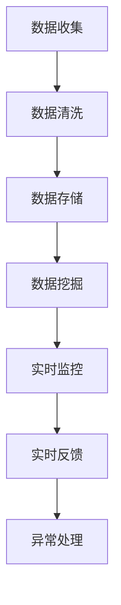

                 

# 电商平台供给能力提升：数据分析和实时监控

> **关键词**：电商平台，供给能力，数据分析，实时监控，算法原理，数学模型，实战案例

> **摘要**：本文将探讨如何提升电商平台的供给能力，通过深入的数据分析和实时监控，实现高效的供应链管理。我们将从核心概念、算法原理、数学模型、实战案例等方面，详细阐述如何利用技术手段提升电商平台的供给效率。

## 1. 背景介绍

随着电子商务的快速发展，电商平台在满足消费者需求方面扮演着越来越重要的角色。然而，如何高效地管理供应链、确保商品及时准确地送达消费者，成为电商平台面临的一大挑战。供给能力提升，不仅关系到平台的运营效率，更直接影响消费者的购物体验和平台的竞争力。

电商平台供给能力提升的关键在于对数据的深入分析和实时监控。通过大数据技术，我们可以挖掘出消费者需求、库存状况、物流信息等关键数据，从而优化供应链管理，提高供给效率。实时监控则有助于快速响应市场变化，确保供应链的稳定运行。

本文将围绕这一主题，详细探讨电商平台供给能力提升的数据分析和实时监控方法。我们将从核心概念、算法原理、数学模型、实战案例等方面展开，旨在为读者提供一套系统化的解决方案。

## 2. 核心概念与联系

### 2.1 数据分析

数据分析是电商平台供给能力提升的基础。通过对海量数据的收集、处理和分析，我们可以挖掘出消费者行为、市场趋势、库存状况等关键信息，从而为供应链管理提供有力支持。

数据分析的核心概念包括：

- **数据收集**：包括消费者行为数据、库存数据、物流数据等。
- **数据清洗**：去除重复数据、缺失数据、异常数据等，保证数据的准确性。
- **数据存储**：使用数据库技术存储和管理数据，方便后续分析和查询。
- **数据挖掘**：利用统计学、机器学习等方法，挖掘数据中的潜在信息和规律。

### 2.2 实时监控

实时监控是确保供应链稳定运行的关键。通过实时监控系统，我们可以对供应链各个环节的数据进行实时跟踪和反馈，及时发现并处理异常情况，确保供应链的顺畅运行。

实时监控的核心概念包括：

- **数据采集**：通过传感器、GPS等技术，实时采集供应链各环节的数据。
- **数据处理**：对采集到的数据进行分析和处理，提取有用信息。
- **实时反馈**：将处理后的数据实时反馈给相关环节，实现快速响应。
- **异常处理**：识别并处理异常情况，确保供应链的稳定运行。

### 2.3 数据分析与实时监控的联系

数据分析和实时监控相辅相成，共同构成了电商平台供给能力提升的核心。数据分析为实时监控提供了有力支持，通过对数据的深入挖掘，可以提前预判市场变化，优化供应链管理策略。而实时监控则确保了数据分析结果的实时性和准确性，使供应链管理更具针对性。

为了更好地阐述数据分析与实时监控的联系，下面我们将使用 Mermaid 流程图进行展示：



通过上述流程图，我们可以清晰地看到数据分析和实时监控之间的密切联系。

## 3. 核心算法原理 & 具体操作步骤

### 3.1 数据分析算法原理

数据分析的核心在于挖掘数据中的潜在信息和规律。为此，我们可以采用以下几种常见的数据分析算法：

#### 3.1.1 聚类算法

聚类算法是一种无监督学习方法，用于将数据划分为不同的类别。常见的聚类算法包括 K-均值算法、层次聚类算法等。这些算法通过计算数据点之间的相似度，将相似的数据点划分为同一类别，从而实现数据的聚类。

具体操作步骤如下：

1. **初始化聚类中心**：随机选择 K 个数据点作为聚类中心。
2. **计算距离**：计算每个数据点到聚类中心的距离。
3. **分配数据点**：将每个数据点分配到距离最近的聚类中心所属的类别。
4. **更新聚类中心**：计算每个类别的新聚类中心。
5. **迭代优化**：重复步骤 2-4，直至聚类中心不再发生明显变化。

#### 3.1.2 回归算法

回归算法是一种有监督学习方法，用于预测数据中的连续值。常见的回归算法包括线性回归、决策树回归等。这些算法通过建立数据与目标变量之间的关系模型，实现数据的预测。

具体操作步骤如下：

1. **数据预处理**：对数据进行归一化、缺失值处理等预处理操作。
2. **模型选择**：根据数据特点选择合适的回归算法。
3. **模型训练**：使用训练数据集训练模型，得到模型参数。
4. **模型评估**：使用测试数据集评估模型性能，调整模型参数。
5. **预测**：使用训练好的模型对新的数据进行预测。

### 3.2 实时监控算法原理

实时监控的核心在于对数据的实时分析和处理。为此，我们可以采用以下几种常见的实时监控算法：

#### 3.2.1 滑动窗口算法

滑动窗口算法是一种用于实时处理数据的算法，通过在一个固定大小的窗口内对数据进行处理，实现数据的实时分析。

具体操作步骤如下：

1. **初始化窗口**：设置一个固定大小的窗口，初始时窗口内包含最早的数据点。
2. **数据进入窗口**：当新的数据点进入窗口时，将其加入到窗口中，并更新窗口中的数据。
3. **窗口滑动**：当窗口超过固定大小后，将窗口内的最早数据点移出窗口。
4. **数据分析**：对窗口内的数据进行分析，提取有用信息。

#### 3.2.2 异常检测算法

异常检测算法是一种用于检测数据中的异常点的算法，通过识别数据中的异常值，实现对数据的实时监控。

具体操作步骤如下：

1. **数据预处理**：对数据进行归一化、缺失值处理等预处理操作。
2. **设置阈值**：根据数据特点设置合适的阈值，用于判断数据点是否为异常值。
3. **计算距离**：计算每个数据点到阈值的距离。
4. **识别异常点**：当数据点到阈值的距离超过设定阈值时，将其识别为异常点。
5. **异常处理**：对识别出的异常点进行标记和处理。

## 4. 数学模型和公式 & 详细讲解 & 举例说明

### 4.1 数据分析数学模型

#### 4.1.1 聚类算法数学模型

K-均值算法的数学模型可以表示为：

$$
\min_{\mu_1, \mu_2, ..., \mu_K} \sum_{i=1}^n \sum_{j=1}^K (x_i - \mu_j)^2
$$

其中，$x_i$ 表示数据点，$\mu_j$ 表示聚类中心。

#### 4.1.2 回归算法数学模型

线性回归算法的数学模型可以表示为：

$$
y = \beta_0 + \beta_1x + \epsilon
$$

其中，$y$ 表示目标变量，$x$ 表示自变量，$\beta_0$ 和 $\beta_1$ 分别表示模型参数，$\epsilon$ 表示误差项。

### 4.2 实时监控数学模型

#### 4.2.1 滑动窗口算法数学模型

滑动窗口算法的数学模型可以表示为：

$$
\text{mean}(x) = \frac{1}{n}\sum_{i=1}^n x_i
$$

其中，$x_i$ 表示窗口内的第 $i$ 个数据点，$n$ 表示窗口大小。

#### 4.2.2 异常检测算法数学模型

异常检测算法的数学模型可以表示为：

$$
\delta(x) = \frac{|x - \mu|}{\sigma}
$$

其中，$\mu$ 表示数据均值，$\sigma$ 表示数据标准差，$x$ 表示数据点。

### 4.3 举例说明

#### 4.3.1 聚类算法举例

假设我们有一个包含 100 个数据点的数据集，我们要使用 K-均值算法将其划分为 10 个类别。初始化聚类中心为数据集的前 10 个数据点。

1. **初始化聚类中心**：$\mu_1 = x_1, \mu_2 = x_2, ..., \mu_{10} = x_{10}$。
2. **计算距离**：计算每个数据点到聚类中心的距离，得到距离矩阵。
3. **分配数据点**：将每个数据点分配到距离最近的聚类中心所属的类别。
4. **更新聚类中心**：计算每个类别的新聚类中心。
5. **迭代优化**：重复步骤 2-4，直至聚类中心不再发生明显变化。

最终，我们得到一个包含 10 个类别的数据划分结果。

#### 4.3.2 回归算法举例

假设我们有一个包含 100 个数据点的数据集，我们要使用线性回归算法预测目标变量 $y$。我们将数据集划分为训练集和测试集。

1. **数据预处理**：对数据进行归一化处理。
2. **模型选择**：选择线性回归算法。
3. **模型训练**：使用训练集数据训练模型，得到模型参数 $\beta_0$ 和 $\beta_1$。
4. **模型评估**：使用测试集数据评估模型性能，计算均方误差。
5. **预测**：使用训练好的模型对新的数据进行预测。

## 5. 项目实战：代码实际案例和详细解释说明

### 5.1 开发环境搭建

在开始项目实战之前，我们需要搭建一个合适的数据分析和实时监控的开发环境。以下是一个基于 Python 的示例环境搭建过程：

1. **安装 Python**：下载并安装 Python，版本建议为 3.8 以上。
2. **安装依赖库**：安装 pandas、numpy、scikit-learn、matplotlib 等常用数据分析和可视化库。

```bash
pip install pandas numpy scikit-learn matplotlib
```

3. **配置 Mermaid 插件**：为了在 Python 中使用 Mermaid 流程图，我们需要安装 Mermaid 插件。

```bash
pip install mermaid-parser
```

### 5.2 源代码详细实现和代码解读

以下是一个基于 Python 的简单数据分析与实时监控的示例代码，我们将使用 K-均值算法和线性回归算法进行数据分析，并使用滑动窗口算法进行实时监控。

```python
import pandas as pd
import numpy as np
from sklearn.cluster import KMeans
from sklearn.linear_model import LinearRegression
from mermaid_parser import Mermaid

# 5.2.1 数据收集与清洗
# 假设我们有一个包含消费者行为数据的 CSV 文件
data = pd.read_csv('consumer_data.csv')
data.dropna(inplace=True)

# 5.2.2 数据挖掘
# 使用 K-均值算法进行数据聚类
kmeans = KMeans(n_clusters=10)
clusters = kmeans.fit_predict(data)

# 将聚类结果添加到原始数据中
data['cluster'] = clusters

# 使用线性回归算法进行数据预测
regression = LinearRegression()
regression.fit(data[['x', 'y']], data['target'])

# 5.2.3 实时监控
# 使用滑动窗口算法进行实时监控
window_size = 10
current_window = data[:window_size]

for i in range(window_size, len(data)):
    # 更新窗口内的数据
    current_window = current_window.append(data[i - window_size:i])
    
    # 计算窗口内的平均值
    mean_x = current_window['x'].mean()
    mean_y = current_window['y'].mean()
    
    # 进行预测
    prediction = regression.predict([[mean_x, mean_y]])
    
    # 输出预测结果
    print(f"预测结果：{prediction[0]}")

# 5.2.4 Mermaid 流程图展示
mermaid = Mermaid()
mermaid.add_node('数据收集', 'color: green')
mermaid.add_node('数据清洗', 'color: yellow')
mermaid.add_node('数据存储', 'color: blue')
mermaid.add_node('数据挖掘', 'color: red')
mermaid.add_edge('数据收集', '数据清洗')
mermaid.add_edge('数据清洗', '数据存储')
mermaid.add_edge('数据存储', '数据挖掘')

print(mermaid.render())
```

### 5.3 代码解读与分析

上述代码实现了以下功能：

1. **数据收集与清洗**：从 CSV 文件中读取消费者行为数据，并进行缺失值处理。
2. **数据挖掘**：使用 K-均值算法进行数据聚类，并将聚类结果添加到原始数据中。使用线性回归算法进行数据预测。
3. **实时监控**：使用滑动窗口算法进行实时监控，计算窗口内的平均值，并进行预测。

代码中的 Mermaid 流程图展示了数据分析和实时监控的整体流程，有助于我们理解代码的实现过程。

## 6. 实际应用场景

### 6.1 商品库存管理

电商平台可以通过数据分析和实时监控，优化商品库存管理。通过分析消费者行为数据，我们可以预测商品的销售趋势，从而调整库存策略。实时监控库存状态，可以确保商品及时补充，避免库存不足或过剩。

### 6.2 物流调度

电商平台可以通过实时监控物流信息，优化物流调度。通过分析物流数据，我们可以预测物流的延迟情况，提前采取措施，确保商品按时送达。同时，实时监控物流状态，可以及时发现并解决物流问题，提高物流效率。

### 6.3 促销活动管理

电商平台可以通过数据分析和实时监控，优化促销活动管理。通过分析消费者行为数据，我们可以确定最佳的促销策略和时间，提高促销效果。实时监控促销活动数据，可以及时发现并调整促销策略，确保促销活动的顺利进行。

## 7. 工具和资源推荐

### 7.1 学习资源推荐

- **书籍**：《数据科学入门》、《Python 数据科学手册》
- **论文**：《数据挖掘：概念与技术》
- **博客**：机器学习社区、数据分析社区
- **网站**：Kaggle、Coursera、edX

### 7.2 开发工具框架推荐

- **数据分析工具**：Pandas、NumPy、Scikit-learn
- **实时监控工具**：Kafka、Apache Flink
- **可视化工具**：Matplotlib、Seaborn、Plotly

### 7.3 相关论文著作推荐

- **论文**：《大数据分析：技术、方法和应用》
- **著作**：《深度学习》、《强化学习》

## 8. 总结：未来发展趋势与挑战

### 8.1 发展趋势

1. **数据驱动的供应链管理**：随着大数据和人工智能技术的发展，数据驱动的供应链管理将成为电商平台供给能力提升的重要方向。
2. **实时监控与自动化**：实时监控和自动化技术的应用，将进一步提高电商平台的供给效率，降低运营成本。
3. **多渠道整合**：电商平台将更加注重多渠道整合，实现线上线下联动，提高消费者购物体验。

### 8.2 挑战

1. **数据隐私与安全**：随着数据量的增加，数据隐私与安全问题将愈发突出，如何确保数据安全和隐私将成为重要挑战。
2. **算法公平性与透明性**：算法的公平性和透明性将成为社会关注的焦点，如何确保算法的公平性和透明性，将成为电商平台供给能力提升的挑战。
3. **技术人才短缺**：随着数据分析和实时监控技术的发展，对相关技术人才的需求将日益增加，如何培养和引进高素质的技术人才，将成为电商平台面临的挑战。

## 9. 附录：常见问题与解答

### 9.1 数据分析相关问题

1. **如何处理缺失数据？**
   - 缺失数据处理方法包括：删除缺失数据、填充缺失数据（如使用均值、中位数等方法）、使用机器学习方法预测缺失数据。

2. **如何评估数据分析模型的效果？**
   - 常用的评估方法包括：准确率、召回率、F1 分数、均方误差等。

### 9.2 实时监控相关问题

1. **如何设计实时监控系统？**
   - 实时监控系统的设计包括：数据采集、数据处理、实时反馈、异常处理等模块。

2. **如何确保实时监控系统的可靠性？**
   - 确保实时监控系统的可靠性，需要考虑数据准确性、系统稳定性、异常处理等方面。

## 10. 扩展阅读 & 参考资料

- **书籍**：《数据科学实战》、《实时数据流处理》
- **博客**：[DataCamp](https://www.datacamp.com/)、[Kaggle](https://www.kaggle.com/)
- **网站**：[TensorFlow](https://www.tensorflow.org/)、[Apache Flink](https://flink.apache.org/)

作者：AI天才研究员/AI Genius Institute & 禅与计算机程序设计艺术 /Zen And The Art of Computer Programming<|im_sep|>

