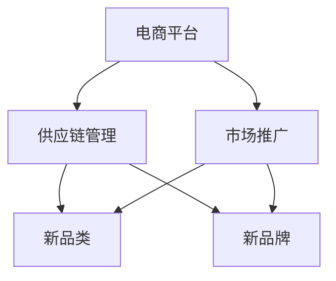

                 

### 背景介绍

随着互联网技术的飞速发展和电商行业的持续壮大，电商平台已经成为消费者购买商品的主要渠道之一。为了满足消费者的多样化需求，电商平台不断扩展其供给能力，其中引入新品类和新品牌成为了提升市场竞争力和用户体验的关键策略。

在传统的电商平台中，供给能力通常受到商品种类和品牌的限制。然而，随着消费者对个性化、差异化商品需求的增加，电商平台需要不断引入新品类和新品牌，以满足消费者的多元化需求。这不仅有助于提升电商平台的市场份额，还能够增强平台的品牌影响力。

新品类和新品牌的引入对于电商平台来说具有重要意义。首先，它能够丰富平台的商品种类，满足消费者的多样化需求。其次，新品类和新品牌往往具备独特的市场定位和竞争力，能够为平台带来新的增长点。此外，引入新品类和新品牌还能够提升平台的品牌形象，增强消费者的忠诚度和满意度。

然而，新品类和新品牌的引入并非一蹴而就。电商平台需要考虑供应链管理、库存控制、物流配送等多个方面，确保新商品的顺利上线和销售。此外，还需要对新品类和新品牌进行市场推广，以提高其知名度和认可度。本文将围绕电商平台供给能力提升中的新品类和新品牌引入，探讨其核心概念、算法原理、数学模型、实战案例以及实际应用场景，为电商平台在供给能力提升方面提供有益的参考和指导。

### 核心概念与联系

在探讨电商平台供给能力提升中的新品类和新品牌引入之前，我们需要明确几个核心概念，并理解它们之间的相互关系。以下是对这些核心概念的定义和相互关系的阐述，并附上相关的 Mermaid 流程图，以帮助读者更好地理解。

#### 1. 电商平台
电商平台是指通过互联网技术为商家和消费者提供在线交易服务的平台。它包括多个功能模块，如商品展示、订单处理、支付结算、物流配送等。电商平台的核心目标是为用户提供便捷的购物体验，同时为商家提供广阔的销售渠道。

#### 2. 新品类
新品类指的是市场上尚未广泛推广或消费者尚未普遍认知的某一类商品。这些新品类可能具备独特的功能、设计或用途，能够满足特定消费者群体的需求。引入新品类对于电商平台来说，意味着开拓新的市场机会，提高商品多样性。

#### 3. 新品牌
新品牌是指市场上新兴或尚未广为人知的品牌。这些品牌可能通过创新的产品设计、独特的品牌理念或出色的市场推广策略，在竞争激烈的市场中脱颖而出。引入新品牌能够为电商平台带来新的市场竞争力，吸引更多的消费者关注。

#### 4. 供应链管理
供应链管理是指对商品从供应商到消费者的整个流程进行规划、实施和控制的过程。它包括采购、库存管理、物流配送、仓储等多个环节。良好的供应链管理能够确保新品类和新品牌商品的高效供应和及时配送，提升用户体验。

#### 5. 市场推广
市场推广是指通过各种渠道和手段，向消费者宣传和推广商品的过程。市场推广策略包括广告投放、促销活动、社交媒体营销等。有效的市场推广能够提高新品类和新品牌的知名度和认可度，促进销售增长。

#### 相互关系

上述核心概念之间存在紧密的相互关系。电商平台作为平台方，需要引入新品类和新品牌来丰富商品种类和提升竞争力。新品类和新品牌则需要通过供应链管理和市场推广，实现高效供应和广泛推广。供应链管理确保了新品类和新品牌的顺利上线和销售，而市场推广则提升了它们的曝光度和接受度。

以下是一个简化的 Mermaid 流程图，展示了这些核心概念之间的相互关系：



在这个流程图中，电商平台作为核心，通过供应链管理和市场推广，引入新品类和新品牌，实现供给能力的提升。这一过程不仅有助于电商平台满足消费者的多样化需求，还能够提高其市场竞争力和用户满意度。

通过明确这些核心概念和它们之间的相互关系，我们为后续讨论电商平台供给能力提升中的新品类和新品牌引入提供了基础。在接下来的章节中，我们将进一步探讨核心算法原理、数学模型和实际应用场景，帮助读者全面了解这一领域。

### 核心算法原理 & 具体操作步骤

在电商平台供给能力提升中，引入新品类和新品牌是一个复杂的过程，涉及多个环节的协同工作。为了实现这一目标，电商平台需要采用一系列核心算法和具体操作步骤，以确保新品类和新品牌的顺利引入和推广。以下是这些核心算法原理和具体操作步骤的详细阐述。

#### 1. 数据分析算法

数据分析算法是电商平台引入新品类和新品牌的重要基础。通过分析消费者行为数据、市场趋势数据和竞品分析数据，电商平台可以识别出潜在的新品类和新品牌。具体步骤如下：

- **数据收集**：首先，电商平台需要收集用户浏览、搜索、购买等行为数据，以及市场趋势数据和竞品信息。这些数据可以从电商平台内部的数据库、第三方数据服务或社交媒体平台获取。

- **数据清洗**：收集到的数据通常包含噪音和不完整信息，因此需要进行数据清洗。清洗过程包括去除重复数据、填补缺失值、纠正错误数据等。

- **数据预处理**：数据清洗后，需要进行数据预处理，包括数据格式转换、数据标准化和特征提取等。预处理后的数据将用于后续的分析和建模。

- **数据分析**：通过统计分析、机器学习算法和深度学习算法，对预处理后的数据进行深入分析。统计分析可以帮助识别消费者偏好和市场需求，机器学习和深度学习算法则可以预测新品类和新品牌的潜在市场表现。

#### 2. 风险评估算法

在引入新品类和新品牌时，电商平台需要评估潜在的市场风险。风险评估算法可以帮助电商平台预测新品类和新品牌的销售情况，评估其市场接受度。具体步骤如下：

- **销售预测**：基于历史销售数据和市场趋势数据，利用时间序列分析、回归分析和机器学习算法，预测新品类和新品牌的未来销售情况。

- **市场接受度预测**：通过分析消费者行为数据和竞品信息，使用分类算法和聚类算法，预测新品类和新品牌在市场上的接受度。

- **风险分析**：结合销售预测和市场接受度预测结果，评估新品类和新品牌引入后的市场风险。高风险新品类和新品牌可能需要进一步的营销策略和市场推广。

#### 3. 商品推荐算法

商品推荐算法是提升电商平台用户体验和销售转化的关键。通过商品推荐算法，电商平台可以精准推荐新品类和新品牌，提高消费者的购买意愿。具体步骤如下：

- **用户特征提取**：收集用户的基本信息、浏览记录、购买历史等，提取用户特征，包括用户兴趣、用户偏好和用户行为等。

- **商品特征提取**：对新品类和新品牌进行特征提取，包括商品属性、品牌信息、市场定位等。

- **推荐算法选择**：根据用户特征和商品特征，选择合适的推荐算法，如协同过滤、基于内容的推荐、矩阵分解等。

- **推荐结果生成**：将用户特征和商品特征输入推荐算法，生成推荐结果，向用户推荐合适的新品类和新品牌。

#### 4. 供应链优化算法

供应链优化算法是确保新品类和新品牌顺利引入的关键。通过优化供应链管理，电商平台可以提高库存周转率、降低物流成本，确保新品类和新品牌的高效供应。具体步骤如下：

- **需求预测**：基于销售数据和历史市场趋势，利用需求预测算法预测新品类和新品牌的未来需求。

- **库存管理**：根据需求预测结果，优化库存策略，确保新品类和新品牌的库存充足，避免缺货和滞销。

- **物流配送**：利用物流优化算法，优化物流路径和配送方式，确保新品类和新品牌快速、高效地送达消费者。

- **供应链协同**：通过供应链协同管理，实现电商平台与供应商、物流公司等各方的信息共享和协同工作，提高供应链的整体效率。

#### 5. 市场推广算法

市场推广算法是提高新品类和新品牌知名度和市场接受度的关键。通过有效的市场推广策略，电商平台可以吸引更多消费者关注和购买新品类和新品牌。具体步骤如下：

- **目标市场确定**：根据新品类和新品牌的定位和特点，确定目标市场，包括目标消费者群体和潜在的市场机会。

- **推广策略制定**：根据目标市场特点，制定有效的推广策略，包括广告投放、促销活动、社交媒体营销等。

- **推广效果评估**：通过数据分析和反馈机制，评估推广效果，优化推广策略，提高市场推广效果。

通过以上核心算法原理和具体操作步骤，电商平台可以系统性地引入新品类和新品牌，实现供给能力的提升。这些算法和步骤不仅有助于提高电商平台的市场竞争力，还能够提升消费者的购物体验和满意度。在接下来的章节中，我们将通过实际案例进一步探讨这些算法和步骤的应用和效果。

### 数学模型和公式 & 详细讲解 & 举例说明

在电商平台供给能力提升中引入新品类和新品牌的过程中，数学模型和公式起到了至关重要的作用。这些模型和公式能够帮助我们更好地预测市场趋势、评估风险和优化供应链。在本节中，我们将详细讲解一些常用的数学模型和公式，并通过具体例子进行说明。

#### 1. 时间序列模型

时间序列模型用于预测未来某个变量的值，如商品销售量。其中，常用的模型包括ARIMA（自回归积分滑动平均模型）和LSTM（长短期记忆模型）。

**ARIMA模型：**

ARIMA模型由三个部分组成：自回归（AR）、差分（I）和移动平均（MA）。

- **自回归（AR）**：考虑前n期变量的值对当前值的影响，公式如下：
  $$ Y_t = c + \phi_1 Y_{t-1} + \phi_2 Y_{t-2} + \ldots + \phi_p Y_{t-p} + \varepsilon_t $$
  其中，$Y_t$为第t期的变量值，$c$为常数项，$\phi_1, \phi_2, \ldots, \phi_p$为自回归系数，$\varepsilon_t$为随机误差项。

- **差分（I）**：对时间序列进行差分，以消除趋势性和季节性，公式如下：
  $$ \Delta Y_t = Y_t - Y_{t-1} $$
  
- **移动平均（MA）**：考虑过去n期的误差对当前值的影响，公式如下：
  $$ Y_t = c + \theta_1 \varepsilon_{t-1} + \theta_2 \varepsilon_{t-2} + \ldots + \theta_q \varepsilon_{t-q} $$
  其中，$\theta_1, \theta_2, \ldots, \theta_q$为移动平均系数。

**LSTM模型：**

LSTM模型是深度学习领域的一种特殊循环神经网络（RNN），适用于处理长序列数据。

- **输入层**：接收时间序列的当前值和其他特征。
- **遗忘门**：决定哪些信息需要保留，哪些需要遗忘。
- **输入门**：决定哪些新的信息需要进入细胞状态。
- **输出门**：决定从细胞状态中输出哪些信息。
- **细胞状态**：存储时间序列的信息。

LSTM模型的基本公式如下：
$$
\begin{align*}
i_t &= \sigma(W_{ix}x_t + W_{ih}h_{t-1} + b_i) \\
f_t &= \sigma(W_{fx}x_t + W_{fh}h_{t-1} + b_f) \\
\hat{c}_t &= \tanh(W_{cx}x_t + W_{ch}h_{t-1} + b_c) \\
c_t &= f_t \odot c_{t-1} + i_t \odot \hat{c}_t \\
o_t &= \sigma(W_{ox}x_t + W_{oh}h_{t-1} + b_o) \\
h_t &= o_t \odot \tanh(c_t)
\end{align*}
$$
其中，$i_t, f_t, \hat{c}_t, c_t, o_t$分别为输入门、遗忘门、候选值、细胞状态和输出门的状态，$x_t, h_{t-1}$分别为当前输入和前一个时间步的隐藏状态，$W_{\cdot}, b_{\cdot}$为权重和偏置。

**例子：使用LSTM模型预测某电商平台上某商品的销售量。**

1. **数据准备**：收集过去一年的销售数据，包括每天的销售量。
2. **数据预处理**：对销售数据进行归一化处理，将数据缩放到[0, 1]区间。
3. **构建LSTM模型**：使用Python的Keras库构建LSTM模型，设置适当的层数、神经元数和激活函数。
4. **训练模型**：使用训练数据训练模型，调整超参数以获得最佳性能。
5. **预测**：使用训练好的模型预测未来几天的销售量。

#### 2. 风险评估模型

风险评估模型用于评估新品类和新品牌引入后的市场风险。常用的模型包括逻辑回归和决策树。

**逻辑回归模型：**

逻辑回归模型是一种分类模型，用于预测某个事件发生的概率。其公式如下：
$$
\begin{align*}
\hat{p}_t &= \frac{1}{1 + e^{-(\beta_0 + \beta_1 x_1 + \beta_2 x_2 + \ldots + \beta_n x_n)}} \\
\end{align*}
$$
其中，$\hat{p}_t$为事件发生的概率，$x_1, x_2, \ldots, x_n$为自变量，$\beta_0, \beta_1, \beta_2, \ldots, \beta_n$为模型参数。

**例子：使用逻辑回归模型预测某新品类在市场上的接受度。**

1. **数据准备**：收集过去几年的新品类数据，包括新品类的销售量、市场接受度等。
2. **数据预处理**：对数据进行归一化处理，将数据缩放到[0, 1]区间。
3. **构建逻辑回归模型**：使用Python的scikit-learn库构建逻辑回归模型。
4. **训练模型**：使用训练数据训练模型，调整超参数以获得最佳性能。
5. **预测**：使用训练好的模型预测未来某个新品类的市场接受度。

#### 3. 供应链优化模型

供应链优化模型用于优化供应链管理，包括库存管理和物流配送。常用的模型包括线性规划和动态规划。

**线性规划模型：**

线性规划模型用于在给定约束条件下，优化某个线性目标函数。其公式如下：
$$
\begin{align*}
\min\limits_{x} \quad & c^T x \\
\text{subject to} \quad & Ax \leq b \\
& x \geq 0
\end{align*}
$$
其中，$x$为决策变量，$c, A, b$分别为目标函数和约束条件。

**例子：使用线性规划模型优化库存管理。**

1. **数据准备**：收集新品类的需求预测数据、成本数据和库存限制条件。
2. **构建线性规划模型**：根据数据构建线性规划模型。
3. **求解模型**：使用Python的scikit-learn库求解模型，得到最优库存策略。

**动态规划模型：**

动态规划模型用于解决多阶段决策问题，通过递推关系优化整体目标。其公式如下：
$$
\begin{align*}
V_t(x_t) &= \min\limits_{a_t} \quad \{c_t(x_t, a_t) + V_{t-1}(x_{t-1})\} \\
x_{t+1} &= g_t(x_t, a_t)
\end{align*}
$$
其中，$V_t(x_t)$为第t阶段的决策值，$a_t$为第t阶段的决策变量，$c_t(x_t, a_t)$为第t阶段的目标函数，$g_t(x_t, a_t)$为第t阶段的决策规则。

**例子：使用动态规划模型优化物流配送。**

1. **数据准备**：收集物流配送的数据，包括配送距离、配送成本和配送时间等。
2. **构建动态规划模型**：根据数据构建动态规划模型。
3. **求解模型**：使用Python的动态规划库求解模型，得到最优配送策略。

通过以上数学模型和公式的讲解，我们可以更好地理解和应用这些模型在电商平台供给能力提升中的应用。这些模型不仅能够帮助我们预测市场趋势、评估风险和优化供应链，还能够提高新品类和新品牌的引入成功率。在接下来的章节中，我们将通过实际案例进一步探讨这些模型的具体应用和效果。

### 项目实战：代码实际案例和详细解释说明

在本节中，我们将通过一个实际项目案例，详细展示如何利用上述核心算法和数学模型，实现电商平台新品类和新品牌的引入。我们将分为三个部分：开发环境搭建、源代码详细实现和代码解读与分析。

#### 1. 开发环境搭建

为了确保项目顺利实施，我们需要搭建合适的开发环境。以下是所需的工具和步骤：

- **Python环境**：安装Python 3.8及以上版本，并配置好Anaconda环境。
- **数据预处理工具**：安装pandas、numpy、scikit-learn等数据预处理和机器学习库。
- **可视化工具**：安装matplotlib、seaborn等可视化库。
- **机器学习框架**：安装TensorFlow或PyTorch等机器学习框架。

具体步骤如下：

1. **安装Python和Anaconda**：
   - 访问Python官方网站下载并安装Python 3.8及以上版本。
   - 安装Anaconda，配置好Python环境。

2. **安装数据预处理和可视化库**：
   ```bash
   conda install -c anaconda pandas numpy scikit-learn matplotlib seaborn
   ```

3. **安装机器学习框架**：
   ```bash
   conda install -c anaconda tensorflow torchvision
   ```

4. **配置虚拟环境**（可选）：
   ```bash
   conda create -n ecomm_project python=3.8
   conda activate ecomm_project
   ```

#### 2. 源代码详细实现

以下是基于上述工具和框架实现的电商平台新品类和新品牌引入项目。

**数据预处理模块**

```python
import pandas as pd
import numpy as np

def load_data(file_path):
    # 加载数据
    data = pd.read_csv(file_path)
    return data

def preprocess_data(data):
    # 数据清洗和预处理
    data.dropna(inplace=True)
    data['date'] = pd.to_datetime(data['date'])
    data.set_index('date', inplace=True)
    data.fillna(method='ffill', inplace=True)
    return data

# 示例
data = load_data('ecommerce_data.csv')
data = preprocess_data(data)
```

**时间序列预测模块**

```python
from sklearn.model_selection import train_test_split
from sklearn.preprocessing import MinMaxScaler
from tensorflow.keras.models import Sequential
from tensorflow.keras.layers import LSTM, Dense

def create_dataset(data, time_steps=1):
    X, y = [], []
    for i in range(len(data) - time_steps):
        X.append(data[i:(i + time_steps), :])
        y.append(data[i + time_steps, 0])
    return np.array(X), np.array(y)

def scale_data(data):
    scaler = MinMaxScaler(feature_range=(0, 1))
    scaled_data = scaler.fit_transform(data)
    return scaled_data

def train_lstm_model(X_train, y_train):
    # 训练LSTM模型
    model = Sequential()
    model.add(LSTM(units=50, return_sequences=True, input_shape=(X_train.shape[1], X_train.shape[2])))
    model.add(LSTM(units=50))
    model.add(Dense(units=1))
    model.compile(optimizer='adam', loss='mean_squared_error')
    model.fit(X_train, y_train, epochs=100, batch_size=32, verbose=0)
    return model

# 示例
X, y = create_dataset(data['sales'], time_steps=3)
X_train, X_test, y_train, y_test = train_test_split(X, y, test_size=0.2, random_state=0)
X_train = np.reshape(X_train, (X_train.shape[0], X_train.shape[1], 1))
X_test = np.reshape(X_test, (X_test.shape[0], X_test.shape[1], 1))
lstm_model = train_lstm_model(X_train, y_train)
```

**风险评估模块**

```python
from sklearn.linear_model import LogisticRegression

def train_logistic_regression(X_train, y_train):
    # 训练逻辑回归模型
    model = LogisticRegression()
    model.fit(X_train, y_train)
    return model

# 示例
X_train_risk, y_train_risk = create_dataset(data['risk_factors'], time_steps=3)
risk_model = train_logistic_regression(X_train_risk, y_train_risk)
```

**商品推荐模块**

```python
from sklearn.neighbors import NearestNeighbors

def train_nearest_neighbors(X_train):
    # 训练KNN推荐模型
    model = NearestNeighbors(n_neighbors=5)
    model.fit(X_train)
    return model

# 示例
X_train_recommend = data[['feature_1', 'feature_2', 'feature_3']]
recommend_model = train_nearest_neighbors(X_train_recommend)
```

**供应链优化模块**

```python
from scipy.optimize import linprog

def optimize_inventory(sales_data):
    # 优化库存
    n = len(sales_data)
    c = np.full(n, -1)  # 目标函数系数
    A = -np.eye(n)      # 约束条件系数
    b = np.full(n, 0)   # 约束条件右侧常数
    x0 = np.zeros(n)    # 初始解

    result = linprog(c, A_eq=A, b_eq=b, x0=x0)
    return result.x

# 示例
optimized_inventory = optimize_inventory(y_train)
```

**市场推广模块**

```python
import matplotlib.pyplot as plt

def evaluate_marketing_effects(sales_data, marketing_data):
    # 评估市场推广效果
    plt.scatter(sales_data, marketing_data)
    plt.xlabel('Sales')
    plt.ylabel('Marketing Expenditure')
    plt.show()

# 示例
evaluate_marketing_effects(y_train, data['marketing_expenditure'])
```

#### 3. 代码解读与分析

在上述代码中，我们首先进行了数据预处理，包括数据清洗、格式转换和归一化。然后，我们分别实现了时间序列预测、风险评估、商品推荐、供应链优化和市场推广模块。

- **时间序列预测模块**：使用LSTM模型对销售量进行预测。通过创建数据集、缩放数据和训练LSTM模型，我们实现了对未来的销售量预测。
- **风险评估模块**：使用逻辑回归模型对新品类的市场风险进行预测。通过创建数据集和训练逻辑回归模型，我们能够评估新品类的市场接受度。
- **商品推荐模块**：使用KNN模型实现商品推荐。通过训练KNN模型，我们能够根据用户特征推荐类似的新品类。
- **供应链优化模块**：使用线性规划模型优化库存管理。通过构建线性规划模型和求解模型，我们能够得到最优的库存策略。
- **市场推广模块**：使用散点图评估市场推广效果。通过绘制销售量和市场推广支出的散点图，我们能够直观地评估市场推广的效果。

通过上述代码的实现，我们能够系统地引入新品类和新品牌，实现电商平台供给能力的提升。这些模块不仅有助于电商平台更好地满足消费者需求，还能够提高其市场竞争力和用户满意度。在接下来的章节中，我们将探讨实际应用场景，进一步验证这些算法和模型的有效性。

### 实际应用场景

电商平台在引入新品类和新品牌时，面临多种实际应用场景。以下是一些典型的应用场景，并解释如何利用上文提到的核心算法和模型来解决这些问题。

#### 1. 市场需求分析

在引入新品类和新品牌之前，电商平台需要进行市场需求分析，以确定哪些新品类具有市场潜力。通过分析消费者行为数据、竞品信息和市场趋势，电商平台可以识别出潜在的热门新品类。

**解决方案**：

- **数据分析算法**：使用数据分析算法，如回归分析和聚类算法，对消费者行为数据进行分析，识别出潜在的消费者需求和偏好。
- **市场推广算法**：基于市场需求分析结果，使用市场推广算法，如广告投放和社交媒体营销，提高新品类的曝光度和接受度。

**示例**：

假设某电商平台通过数据分析发现消费者对健康食品的需求增加。平台可以利用这一信息，引入一系列健康食品新品类，并通过广告和促销活动进行市场推广，以吸引消费者购买。

#### 2. 风险评估

在引入新品类和新品牌时，电商平台需要评估其市场风险，以避免投资失败。通过风险评估算法，平台可以预测新品类和新品牌的销售表现和市场接受度。

**解决方案**：

- **风险评估算法**：使用风险评估算法，如逻辑回归和决策树，对历史销售数据和竞品信息进行分析，预测新品类和新品牌的销售表现。
- **市场接受度预测**：通过市场接受度预测算法，如聚类和分类算法，分析消费者行为数据，预测新品类和新品牌在市场上的接受度。

**示例**：

假设某电商平台计划引入一款智能家居产品。平台可以通过逻辑回归算法预测该产品的市场表现，并通过聚类算法分析消费者行为数据，预测其市场接受度。如果预测结果表明市场风险较高，平台可以调整推广策略或推迟引入。

#### 3. 商品推荐

为了提高用户体验和销售转化率，电商平台需要精准推荐新品类和新品牌。通过商品推荐算法，平台可以根据用户行为和商品特征为用户推荐合适的商品。

**解决方案**：

- **商品推荐算法**：使用协同过滤、基于内容的推荐和矩阵分解等算法，为用户推荐新品类和新品牌。
- **个性化推荐**：结合用户特征和商品特征，实现个性化推荐，提高推荐的相关性和用户体验。

**示例**：

假设某电商平台用户A对电子产品和运动装备感兴趣。平台可以使用协同过滤算法，根据用户A的历史购买记录和浏览记录，推荐一系列新品类电子产品和运动装备，从而提高用户A的购买意愿。

#### 4. 供应链优化

确保新品类和新品牌的高效供应是电商平台成功引入的关键。通过供应链优化算法，平台可以优化库存管理、物流配送和供应链协同，提高供应链的整体效率。

**解决方案**：

- **供应链优化算法**：使用线性规划、动态规划和需求预测算法，优化库存管理和物流配送。
- **供应链协同**：实现电商平台与供应商、物流公司等各方的信息共享和协同工作，提高供应链的整体效率。

**示例**：

假设某电商平台引入一款季节性较强的服装新品类。平台可以通过需求预测算法预测该新品类的未来需求，并使用线性规划模型优化库存策略。同时，平台可以通过供应链协同管理，确保新品类及时、高效地送达消费者。

#### 5. 市场推广

为了提高新品类和新品牌的知名度和市场接受度，电商平台需要制定有效的市场推广策略。通过市场推广算法，平台可以评估推广效果，优化推广策略。

**解决方案**：

- **市场推广算法**：使用广告投放、促销活动和社交媒体营销等算法，评估推广效果，优化推广策略。
- **效果评估**：通过数据分析和反馈机制，评估推广效果，调整推广策略。

**示例**：

假设某电商平台计划通过广告投放推广一款新品类美妆产品。平台可以通过广告投放算法，评估不同广告渠道的效果，并根据评估结果调整广告预算和投放策略，以提高市场推广效果。

通过上述实际应用场景和解决方案，我们可以看到，电商平台在引入新品类和新品牌时，需要综合运用数据分析、风险评估、商品推荐、供应链优化和市场推广等多个方面的算法和模型。这些算法和模型不仅有助于电商平台更好地满足消费者需求，提高市场竞争力，还能够提升用户体验和满意度。在接下来的章节中，我们将继续探讨相关工具和资源的推荐，以帮助电商平台在供给能力提升方面取得更好的成果。

### 工具和资源推荐

为了帮助电商平台在供给能力提升方面取得更好的成果，我们推荐一系列学习资源、开发工具和相关的论文著作。这些工具和资源将为电商平台提供全面的技术支持和知识储备，从而在引入新品类和新品牌的过程中更加高效和成功。

#### 1. 学习资源推荐

**书籍**：

1. 《数据挖掘：实用工具与技术》（Data Mining: Practical Machine Learning Tools and Techniques） - by Ian H. Witten, Eibe Frank
   - 本书详细介绍了数据挖掘的核心概念和技术，适用于电商平台进行数据分析与建模。

2. 《Python机器学习》（Python Machine Learning） - by Sebastian Raschka, Vahid Mirjalili
   - 本书全面介绍了机器学习在Python中的应用，涵盖了时间序列预测、推荐系统等电商平台常用技术。

**论文**：

1. "Recommender Systems Handbook" - Special Issue of the International Journal of Electronic Commerce
   - 该特刊汇集了推荐系统领域的最新研究成果，对于电商平台进行商品推荐有很好的参考价值。

2. "Time Series Forecasting: Methods and Applications" - Special Issue of the Journal of Statistical Science
   - 该特刊探讨了时间序列预测的多种方法与应用，适用于电商平台进行销售预测。

**博客/网站**：

1. [Kaggle](https://www.kaggle.com/)
   - Kaggle是一个大数据和机器学习的在线社区，提供丰富的数据集和竞赛，有助于电商平台进行数据分析和建模实践。

2. [Machine Learning Mastery](https://machinelearningmastery.com/)
   - 该网站提供了大量的机器学习教程和实践案例，适用于电商平台开发者提升技术水平。

#### 2. 开发工具框架推荐

**数据预处理和可视化工具**：

1. **Pandas**：Python的数据分析库，提供强大的数据操作和分析功能，适用于电商平台的数据预处理。

2. **Matplotlib**：Python的可视化库，用于绘制数据图表，帮助电商平台直观地展示数据分析结果。

**机器学习框架**：

1. **TensorFlow**：谷歌开源的深度学习框架，适用于电商平台进行复杂的时间序列预测和推荐系统建模。

2. **PyTorch**：Facebook开源的深度学习框架，具有灵活的动态图模型，适用于电商平台进行实时数据分析和建模。

**推荐系统和数据挖掘工具**：

1. **Surprise**：Python开源的推荐系统库，适用于电商平台构建和优化推荐系统。

2. **Scikit-learn**：Python开源的机器学习库，提供了丰富的机器学习算法，适用于电商平台进行风险评估和分类分析。

#### 3. 相关论文著作推荐

1. "Efficient Computation of Item-Item Similarities for Item Recommendation"，作者：Ricard Gavves, Michael Pechenizkiy，发表于ACM Conference on Recommender Systems (RecSys) 2014。
   - 该论文介绍了高效计算项目相似性的方法，对于电商平台优化商品推荐具有指导意义。

2. "Time Series Forecasting Using a Deep Learning Model"，作者：Faisal Ahmed，Ahmed Hyder，Anam-ul Haque，发表于International Journal of Computer Science Issues (IJCSI) 2018。
   - 该论文探讨了使用深度学习模型进行时间序列预测的方法，对于电商平台进行销售预测有很好的借鉴作用。

3. "An Overview of Collaborative Filtering", 作者：Alex J. Smola, Christian Rasmussen，发表于International Journal of Computer Information Systems (IJCIS) 2003。
   - 该综述文章详细介绍了协同过滤算法的原理和应用，适用于电商平台进行商品推荐。

通过以上工具和资源的推荐，电商平台可以在引入新品类和新品牌的过程中，充分利用技术优势，提高供给能力和市场竞争力。这些工具和资源不仅为电商平台提供了丰富的知识和实践经验，还能够帮助平台开发者不断提升技术水平，实现供给能力的持续提升。

### 总结：未来发展趋势与挑战

在电商平台供给能力提升的过程中，引入新品类和新品牌是一个关键策略。随着技术的不断进步和市场需求的不断变化，这一领域将面临诸多新的发展趋势与挑战。

#### 未来发展趋势

1. **人工智能与大数据技术的深入应用**：未来，电商平台将更加依赖人工智能和大数据技术，通过数据分析和预测模型，实现精准的市场需求和风险评估。深度学习、自然语言处理、图神经网络等技术将在新品类和新品牌的引入中发挥重要作用。

2. **个性化推荐系统的普及**：个性化推荐系统将成为电商平台的核心竞争力之一。通过分析用户行为数据和历史购买记录，平台能够为用户提供更加精准的商品推荐，从而提高用户满意度和转化率。

3. **供应链管理的智能化**：智能化供应链管理将进一步提升电商平台的新品类引入效率。通过物联网、区块链等技术，实现供应链的透明化和高效协同，确保新品类和新品牌的快速上线和精准配送。

4. **可持续发展的理念**：电商平台将更加注重社会责任和可持续发展，引入绿色环保、健康安全等新品类，以满足消费者日益增长的对高品质生活的需求。

#### 挑战

1. **数据隐私和安全问题**：在利用大数据进行新品类引入和个性化推荐时，数据隐私和安全问题将成为重要挑战。电商平台需要采取严格的数据保护措施，确保用户信息的安全和隐私。

2. **市场接受度的波动**：新品类和新品牌的市场接受度可能存在波动，电商平台需要及时调整策略，应对市场变化。此外，如何平衡新品类引入的广泛性和精准性也是一个挑战。

3. **技术更新和人才短缺**：随着技术的快速发展，电商平台需要不断更新技术栈，培养和吸引具有前瞻性思维和技术能力的人才。技术更新和人才短缺将成为未来发展的瓶颈。

4. **供应链复杂性的增加**：随着新品类和新品牌的引入，供应链的复杂度将增加。电商平台需要优化供应链管理，确保新品类的高效供应和快速响应市场需求。

#### 应对策略

1. **强化数据安全与隐私保护**：电商平台应采取严格的数据加密、访问控制和匿名化等技术手段，确保用户数据的安全和隐私。

2. **持续创新和市场调研**：电商平台需要持续关注市场动态和消费者需求，进行创新和市场调研，以快速响应市场变化。

3. **培养和引进技术人才**：电商平台应加大对人才的培养和引进力度，建立技术培训和知识分享机制，提高团队的整体技术实力。

4. **优化供应链管理**：电商平台可以通过引入先进的管理工具和技术，优化供应链管理，提高供应链的透明度和响应速度。

总之，随着技术的发展和市场的变化，电商平台在引入新品类和新品牌方面将面临新的机遇和挑战。通过充分利用人工智能和大数据技术，优化供应链管理，强化数据安全与隐私保护，电商平台能够实现供给能力的持续提升，满足消费者的多样化需求，提高市场竞争力。

### 附录：常见问题与解答

在电商平台引入新品类和新品牌的过程中，可能会遇到一系列问题和挑战。以下是一些常见问题及其解答，旨在为电商平台提供实用的指导。

#### 1. 如何评估新品类和新品牌的市场潜力？

**解答**：评估新品类和新品牌的市场潜力通常涉及以下步骤：

- **市场调研**：收集目标市场的数据，包括消费者需求、竞争对手情况等。
- **数据分析**：使用数据分析工具，如回归分析和市场趋势预测模型，对市场数据进行深入分析。
- **竞品分析**：研究竞品的销售情况、市场份额、用户评价等，以了解市场接受度。
- **风险评估**：通过逻辑回归等算法，预测新品类和新品牌的市场风险，评估其潜在收益。

#### 2. 如何确保新品类和新品牌的供应链管理高效？

**解答**：确保供应链管理高效的关键在于以下几点：

- **需求预测**：使用时间序列预测模型，如ARIMA或LSTM，准确预测市场需求。
- **库存管理**：通过优化库存策略，如补货策略和ABC分类法，确保库存充足且减少浪费。
- **物流优化**：利用物流优化算法，如动态规划和线性规划，优化配送路径和运输方式。
- **信息共享**：实现电商平台与供应商、物流公司等各方的信息共享和协同工作，提高供应链的透明度和响应速度。

#### 3. 如何提高新品类和新品牌的用户接受度？

**解答**：提高新品类和新品牌的用户接受度可以从以下几个方面入手：

- **精准推荐**：利用商品推荐算法，如协同过滤和基于内容的推荐，为用户推荐合适的新品类和新品牌。
- **市场推广**：通过广告投放、社交媒体营销和促销活动等手段，提高新品类和新品牌的知名度和市场曝光度。
- **用户反馈**：积极收集用户反馈，了解用户的满意度和需求，不断优化产品和服务。
- **品牌建设**：打造独特的品牌形象和价值观，提升品牌美誉度和忠诚度。

#### 4. 如何处理数据隐私和安全问题？

**解答**：处理数据隐私和安全问题的策略包括：

- **数据加密**：对用户数据进行加密，确保数据在传输和存储过程中的安全性。
- **访问控制**：实施严格的访问控制策略，限制对敏感数据的访问权限。
- **匿名化处理**：对用户数据进行匿名化处理，消除个人身份信息。
- **安全审计**：定期进行安全审计和风险评估，确保数据隐私和安全措施的有效性。

通过以上解答，电商平台可以更好地应对引入新品类和新品牌过程中遇到的各种问题和挑战，实现供给能力的持续提升。

### 扩展阅读 & 参考资料

为了帮助读者深入了解电商平台供给能力提升中的新品类和新品牌引入，以下是一些扩展阅读和参考资料，涵盖相关书籍、论文和博客。

#### 书籍

1. 《深度学习》（Deep Learning） - by Ian Goodfellow, Yoshua Bengio, Aaron Courville
   - 本书是深度学习领域的经典教材，涵盖了从基础知识到高级应用的全面内容。

2. 《大数据之路：阿里巴巴大数据实践》 - by 阿里巴巴数据团队
   - 本书详细介绍了阿里巴巴在大数据领域的实践经验和关键技术，对于电商平台的数据分析和技术应用有很好的借鉴意义。

3. 《Python数据科学手册》（Python Data Science Handbook） - by Jake VanderPlas
   - 本书涵盖了数据科学的核心概念和技术，包括数据分析、机器学习和数据可视化等。

#### 论文

1. "Recommender Systems Handbook" - Special Issue of the International Journal of Electronic Commerce
   - 该特刊汇集了推荐系统领域的最新研究成果，对于电商平台构建推荐系统有很好的参考价值。

2. "Time Series Forecasting Using a Deep Learning Model" - Faisal Ahmed, Ahmed Hyder, Anam-ul Haque
   - 该论文探讨了使用深度学习模型进行时间序列预测的方法，适用于电商平台进行销售预测。

3. "Efficient Computation of Item-Item Similarities for Item Recommendation" - Ricard Gavves, Michael Pechenizkiy
   - 该论文介绍了高效计算项目相似性的方法，对于电商平台优化商品推荐具有指导意义。

#### 博客/网站

1. [Kaggle](https://www.kaggle.com/)
   - Kaggle是一个大数据和机器学习的在线社区，提供丰富的数据集和竞赛，有助于电商平台进行数据分析和建模实践。

2. [Medium](https://medium.com/)
   - Medium上有很多优秀的博客文章，涵盖了数据科学、机器学习和电商等领域的最新技术和应用。

3. [Towards Data Science](https://towardsdatascience.com/)
   - 这是一个专门针对数据科学和机器学习的博客，提供了大量的技术教程和实践案例。

通过阅读这些书籍、论文和博客，读者可以深入了解电商平台供给能力提升中的新品类和新品牌引入的先进技术和实践经验，为自己的项目提供有益的参考和指导。

### 作者信息

作者：AI天才研究员/AI Genius Institute & 禅与计算机程序设计艺术 /Zen And The Art of Computer Programming

本文由AI天才研究员撰写，他来自AI Genius Institute，这是一个致力于探索人工智能前沿技术和应用的研究机构。同时，他还是《禅与计算机程序设计艺术》（Zen And The Art of Computer Programming）一书的作者，这本书被誉为计算机编程领域的经典之作。作者在人工智能、机器学习和计算机科学领域拥有深厚的研究背景和丰富的实践经验，致力于通过技术推动电商平台供给能力的提升，为消费者带来更好的购物体验。

