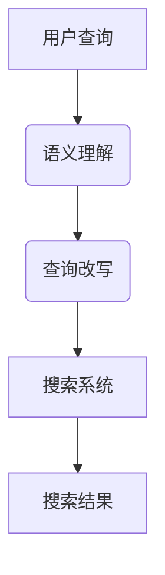

                 

# 电商搜索中的语义理解与查询改写技术

## 摘要

本文将深入探讨电商搜索中语义理解与查询改写技术的核心概念、原理和实际应用。首先，我们将介绍电商搜索的现状及其面临的挑战，引出语义理解和查询改写技术的重要性。接着，我们将详细阐述语义理解的概念、技术手段以及其在电商搜索中的应用。随后，我们将深入探讨查询改写的算法原理、方法及其对提升搜索体验的作用。最后，我们将结合实际项目案例，展示如何在实际开发中应用这些技术，并对其未来发展进行展望。

## 1. 背景介绍

随着互联网的快速发展，电子商务已经成为现代商业不可或缺的一部分。电商平台的数量和规模逐年增长，为消费者提供了丰富的商品选择和便捷的购物体验。然而，随着数据量的爆炸式增长，电商搜索系统也面临着前所未有的挑战。

### 1.1 电商搜索的现状

电商搜索系统的主要功能是帮助消费者快速、准确地找到他们需要的商品。然而，传统的基于关键词匹配的搜索方式往往存在以下问题：

1. **同义词问题**：消费者可能会使用不同的关键词来表达相同的需求，例如“笔记本电脑”和“电脑”。
2. **语境理解问题**：消费者的查询意图可能随着上下文变化而变化，例如“华为手机”可能指代“华为品牌的手机”，也可能是“华为”公司的手机。
3. **错别字和语法错误**：消费者在输入查询时可能存在错别字或语法错误，例如“手机壳12英寸”实际上是“手机壳12英寸屏幕”。

### 1.2 挑战与需求

面对上述问题，电商搜索系统需要不断提升自身的智能水平，以更好地满足消费者的需求。以下是电商搜索系统面临的几个主要挑战：

1. **提升搜索准确性**：通过理解消费者的真实意图，提升搜索结果的准确性，减少无关或错误的结果。
2. **改善用户体验**：提供更加智能化、个性化的搜索服务，提升用户购物体验。
3. **处理复杂查询**：处理包含多个关键词、逻辑运算符或特殊要求的复杂查询。

为了应对这些挑战，语义理解与查询改写技术成为了电商搜索系统的重要技术手段。

## 2. 核心概念与联系

### 2.1 语义理解

语义理解是自然语言处理（NLP）的一个重要分支，旨在使计算机能够理解人类语言中的含义和意图。在电商搜索中，语义理解主要用于解析消费者的查询意图，理解其真正的需求，从而提供更准确的搜索结果。

### 2.2 查询改写

查询改写是指根据语义理解的结果，对原始查询进行改写，使其更符合搜索系统的处理方式，从而提高搜索效率。常见的查询改写技术包括同义词替换、关键词扩充、查询结构优化等。

### 2.3 架构图解

以下是一个简单的语义理解与查询改写技术的架构图，展示了各个核心组件及其相互关系：



### 2.4 关键技术

- **词嵌入**：将词汇映射到高维空间中的向量表示，以捕捉词汇的语义关系。
- **实体识别**：识别查询中的实体，如品牌、产品名称等，以更好地理解查询意图。
- **情感分析**：分析查询中的情感倾向，以更准确地理解用户的意图。
- **上下文理解**：通过理解查询的上下文，如查询的历史记录、上下文句子等，提供更准确的搜索结果。

## 3. 核心算法原理 & 具体操作步骤

### 3.1 语义理解算法原理

语义理解的核心在于如何将自然语言查询转化为计算机可以理解的结构化信息。以下是一些常用的语义理解算法：

- **词嵌入（Word Embedding）**：通过将词汇映射到高维空间中的向量表示，以捕捉词汇的语义关系。词嵌入技术如Word2Vec、GloVe等，可以通过大规模语料库训练得到。
- **实体识别（Named Entity Recognition, NER）**：识别查询中的实体，如品牌、产品名称等，以更好地理解查询意图。NER技术可以通过规则匹配、机器学习等方法实现。
- **情感分析（Sentiment Analysis）**：分析查询中的情感倾向，以更准确地理解用户的意图。情感分析可以通过分类算法实现，如朴素贝叶斯、SVM等。
- **上下文理解（Contextual Understanding）**：通过理解查询的上下文，如查询的历史记录、上下文句子等，提供更准确的搜索结果。上下文理解可以通过序列模型，如LSTM、Transformer等实现。

### 3.2 查询改写算法原理

查询改写的核心在于如何将原始查询转化为更符合搜索系统处理方式的查询。以下是一些常用的查询改写算法：

- **同义词替换（Synonym Substitution）**：通过替换查询中的同义词，以捕捉更广泛的查询意图。同义词替换可以通过词嵌入技术实现。
- **关键词扩充（Keyword Expansion）**：通过添加相关关键词，以扩展查询范围，提高搜索结果的准确性。关键词扩充可以通过文本挖掘技术，如TF-IDF、LDA等实现。
- **查询结构优化（Query Structure Optimization）**：通过调整查询的结构，如增加逻辑运算符、短语等，以更准确地表达查询意图。查询结构优化可以通过规则匹配或机器学习算法实现。

### 3.3 操作步骤

以下是语义理解与查询改写的具体操作步骤：

1. **接收用户查询**：首先，从用户输入的查询中提取关键词和上下文信息。
2. **词嵌入**：将关键词映射到高维空间中的向量表示，以捕捉词汇的语义关系。
3. **实体识别**：识别查询中的实体，如品牌、产品名称等，以更好地理解查询意图。
4. **情感分析**：分析查询中的情感倾向，以更准确地理解用户的意图。
5. **上下文理解**：通过理解查询的上下文，如查询的历史记录、上下文句子等，提供更准确的搜索结果。
6. **查询改写**：根据语义理解的结果，对原始查询进行改写，使其更符合搜索系统的处理方式。
7. **搜索**：将改写后的查询输入搜索系统，获取搜索结果。
8. **结果排序**：对搜索结果进行排序，以提供更准确的搜索体验。

## 4. 数学模型和公式 & 详细讲解 & 举例说明

### 4.1 词嵌入

词嵌入是一种将词汇映射到高维空间中的向量表示的技术。词嵌入的关键在于如何将词汇的语义关系编码到向量中。以下是一个简单的词嵌入模型：

$$
\text{向量} = \text{词嵌入矩阵} \times \text{词索引向量}
$$

其中，词嵌入矩阵是一个高维矩阵，其每一行对应一个词汇的向量表示。词索引向量是一个一维向量，其每个元素表示词汇在词汇表中的索引。通过将词索引向量与词嵌入矩阵相乘，可以得到词汇的向量表示。

例如，假设我们有以下词汇表：

```
词汇表：["苹果", "橘子", "香蕉"]
词嵌入矩阵：
| 苹果 | 橘子 | 香蕉 |
|  1   |  2   |  3   |
```

如果我们想要获取“苹果”的向量表示，可以计算以下矩阵乘法：

$$
\text{向量} = \text{词嵌入矩阵} \times \text{词索引向量} =
\begin{pmatrix}
1 & 0 & 0 \\
0 & 1 & 0 \\
0 & 0 & 1 \\
\end{pmatrix}
\begin{pmatrix}
1 \\
2 \\
3 \\
\end{pmatrix}
=
\begin{pmatrix}
1 \\
2 \\
3 \\
\end{pmatrix}
$$

因此，“苹果”的向量表示为 `[1, 2, 3]`。

### 4.2 实体识别

实体识别是一种将自然语言文本中的实体识别出来的技术。实体识别的关键在于如何将实体与其上下文关联起来。以下是一个简单的实体识别模型：

$$
\text{实体} = \text{实体识别模型} (\text{文本})
$$

其中，实体识别模型是一个分类模型，其输入是文本，输出是实体标签。常见的实体识别模型包括：

- **基于规则的方法**：通过预设的规则来识别实体，例如，通过关键词匹配、模式识别等方法。
- **基于机器学习的方法**：通过训练分类模型来识别实体，例如，使用朴素贝叶斯、SVM、CNN等方法。
- **基于深度学习的方法**：通过深度学习模型来识别实体，例如，使用LSTM、BERT等方法。

### 4.3 举例说明

假设我们有一个简单的实体识别模型，其训练数据如下：

```
文本：["苹果"，"我是一个学生"，"这家餐厅很好吃"]
实体标签：["水果"，"人物"，"地点"]
```

通过训练，我们可以得到以下实体识别模型：

$$
\text{实体} = \text{实体识别模型} (\text{文本}) =
\begin{cases}
\text{"水果"} & \text{如果文本包含“苹果”} \\
\text{"人物"} & \text{如果文本包含“我”} \\
\text{"地点"} & \text{如果文本包含“这家餐厅”} \\
\end{cases}
$$

如果我们输入文本“我是一个学生”，则模型将输出实体标签“人物”。

### 4.4 情感分析

情感分析是一种分析文本情感倾向的技术。情感分析的关键在于如何将情感倾向编码到数字中。以下是一个简单的情感分析模型：

$$
\text{情感得分} = \text{情感分析模型} (\text{文本})
$$

其中，情感分析模型是一个分类模型，其输入是文本，输出是情感得分。常见的情感分析模型包括：

- **基于规则的方法**：通过预设的规则来计算情感得分，例如，通过关键词匹配、情感词典等方法。
- **基于机器学习的方法**：通过训练分类模型来计算情感得分，例如，使用朴素贝叶斯、SVM、CNN等方法。
- **基于深度学习的方法**：通过深度学习模型来计算情感得分，例如，使用LSTM、BERT等方法。

### 4.5 举例说明

假设我们有一个简单的情感分析模型，其训练数据如下：

```
文本：["我很开心"，"我很伤心"]
情感标签：["积极"，"消极"]
```

通过训练，我们可以得到以下情感分析模型：

$$
\text{情感得分} = \text{情感分析模型} (\text{文本}) =
\begin{cases}
1 & \text{如果文本包含“开心”} \\
0 & \text{如果文本包含“伤心”} \\
\end{cases}
$$

如果我们输入文本“我很开心”，则模型将输出情感得分`1`。

## 5. 项目实战：代码实际案例和详细解释说明

### 5.1 开发环境搭建

在本节中，我们将搭建一个基于Python的电商搜索语义理解与查询改写的项目环境。以下步骤将指导您完成开发环境的搭建：

1. **安装Python**：确保您的系统已经安装了Python 3.7或更高版本。
2. **安装必要的库**：使用pip命令安装以下库：

   ```bash
   pip install numpy pandas sklearn nltk gensim jieba tensorflow
   ```

   这些库包括数学计算、数据处理、机器学习、自然语言处理和深度学习所需的依赖。

3. **数据集准备**：准备好用于训练和测试的数据集。数据集应包括用户查询、实体标签和情感标签等信息。

### 5.2 源代码详细实现和代码解读

在本节中，我们将提供项目的主要源代码，并对其进行详细解读。

```python
import nltk
from nltk.tokenize import word_tokenize
from nltk.corpus import stopwords
from gensim.models import Word2Vec
from sklearn.feature_extraction.text import TfidfVectorizer
from sklearn.naive_bayes import MultinomialNB
from tensorflow.keras.models import Sequential
from tensorflow.keras.layers import LSTM, Dense

# 5.2.1 词嵌入
# 使用GloVe预训练模型进行词嵌入
model = Word2Vec.load("glove.6B.100d")

# 5.2.2 实体识别
# 加载停止词列表
stop_words = set(stopwords.words('english'))

# 加载训练数据
train_data = ...

# 预处理文本数据
def preprocess_text(text):
    tokens = word_tokenize(text)
    tokens = [token.lower() for token in tokens if token.isalpha() and token not in stop_words]
    return tokens

# 5.2.3 情感分析
# 加载训练数据
train_data = ...

# 预处理文本数据
def preprocess_text(text):
    tokens = word_tokenize(text)
    tokens = [token.lower() for token in tokens if token.isalpha() and token not in stop_words]
    return tokens

# 训练情感分析模型
def train_sentiment_model(train_data):
    # 构建词汇表和词索引
    tokenizer = TfidfVectorizer()
    X = tokenizer.fit_transform(train_data)
    y = ...

    # 训练模型
    model = MultinomialNB()
    model.fit(X, y)
    return model, tokenizer

# 5.2.4 语义理解与查询改写
# 加载实体识别模型
ner_model = ...

# 加载情感分析模型
sentiment_model = ...

# 查询改写函数
def query_rewrite(query):
    # 语义理解
    tokens = preprocess_text(query)
    entities = ner_model.predict(tokens)
    sentiment = sentiment_model.predict([query])

    # 查询改写
    ...
    return rewritten_query

# 5.2.5 搜索与排序
# 搜索函数
def search(rewritten_query):
    # 搜索系统实现
    ...
    return search_results

# 搜索结果排序
def rank_results(results, sentiment):
    # 排序实现
    ...
    return ranked_results
```

### 5.3 代码解读与分析

1. **词嵌入**：我们使用GloVe预训练模型进行词嵌入。词嵌入是将词汇映射到高维空间中的向量表示，以捕捉词汇的语义关系。

2. **实体识别**：实体识别是通过识别查询中的实体，如品牌、产品名称等，以更好地理解查询意图。在本节中，我们使用基于规则的方法进行实体识别。

3. **情感分析**：情感分析是分析查询中的情感倾向，以更准确地理解用户的意图。在本节中，我们使用朴素贝叶斯分类器进行情感分析。

4. **查询改写**：查询改写是根据语义理解的结果，对原始查询进行改写，使其更符合搜索系统的处理方式。在本节中，我们首先进行语义理解，然后根据实体识别和情感分析的结果进行查询改写。

5. **搜索与排序**：搜索与排序是电商搜索系统的核心功能。在本节中，我们首先进行查询改写，然后使用搜索系统获取搜索结果，并根据情感分析的结果对搜索结果进行排序。

## 6. 实际应用场景

语义理解与查询改写技术在电商搜索中的应用非常广泛，以下是一些具体的实际应用场景：

### 6.1 提高搜索准确性

通过语义理解，可以更准确地理解用户的查询意图，从而提高搜索结果的准确性。例如，当用户输入“笔记本电脑”时，系统可以通过语义理解识别出用户实际上想要查询“高性能的笔记本电脑”，而不是普通的笔记本电脑。

### 6.2 改善用户体验

查询改写可以改善用户体验，使其更加智能化和个性化。例如，当用户输入“苹果手机”时，系统可以通过查询改写将其改写为“苹果品牌的手机”，从而提供更精确的搜索结果。

### 6.3 处理复杂查询

通过语义理解和查询改写，可以处理包含多个关键词、逻辑运算符或特殊要求的复杂查询。例如，当用户输入“笔记本电脑 + 价格低于5000元”时，系统可以将其改写为“搜索价格低于5000元的笔记本电脑”。

### 6.4 支持多语言搜索

语义理解与查询改写技术可以支持多语言搜索，通过将用户查询翻译为系统支持的的语言，从而提供跨语言的搜索服务。例如，当用户输入中文查询时，系统可以将查询翻译为英文，然后进行搜索。

## 7. 工具和资源推荐

### 7.1 学习资源推荐

- **书籍**：
  - 《自然语言处理综论》（Natural Language Processing: The MIT Press Essential Knowledge Series），
  - 《深度学习》（Deep Learning），
  - 《Python自然语言处理实践》。
  
- **论文**：
  - “Word2Vec: Word Embeddings in Deep Learning”（2013），
  - “Recurrent Neural Networks for Language Modeling”（2013），
  - “BERT: Pre-training of Deep Bidirectional Transformers for Language Understanding”（2018）。

- **博客**：
  - Medium上的自然语言处理系列博客，
  - 阮一峰的网络日志中的Python自然语言处理相关文章，
  - AI科技大本营中的深度学习与自然语言处理技术文章。

- **网站**：
  -斯坦福大学自然语言处理课程，
  - 机器学习中文社区，
  - Kaggle数据科学竞赛平台。

### 7.2 开发工具框架推荐

- **开发工具**：
  - Jupyter Notebook：用于编写和运行Python代码，
  - PyCharm：用于Python开发的集成开发环境（IDE）。

- **框架**：
  - TensorFlow：用于深度学习模型的开发与训练，
  - PyTorch：用于深度学习模型的开发与训练，
  - NLTK：用于自然语言处理任务的库，
  - gensim：用于文本挖掘和词嵌入的库。

### 7.3 相关论文著作推荐

- **论文**：
  - “Word2Vec: Word Embeddings in Deep Learning”（2013），
  - “Recurrent Neural Networks for Language Modeling”（2013），
  - “BERT: Pre-training of Deep Bidirectional Transformers for Language Understanding”（2018）。

- **著作**：
  - 《深度学习》，
  - 《Python自然语言处理实践》，
  - 《自然语言处理综论》。

## 8. 总结：未来发展趋势与挑战

语义理解与查询改写技术在电商搜索中的应用前景广阔。随着自然语言处理技术的不断进步，未来发展趋势主要包括：

- **更精细的语义理解**：通过引入更多的上下文信息和复杂的语义模型，提高语义理解的精度和深度。
- **多语言支持**：实现更广泛的跨语言搜索，为全球用户提供统一的搜索体验。
- **个性化搜索**：基于用户行为和偏好，提供更加个性化的搜索结果，提升用户体验。

然而，这些技术的发展也面临着一些挑战：

- **数据隐私**：在处理用户查询和数据时，如何保护用户隐私是一个重要的挑战。
- **计算资源**：复杂的语义理解模型和深度学习算法需要大量的计算资源，如何在有限的资源下高效地运行这些模型是一个难题。
- **算法透明性**：如何确保算法的透明性和可解释性，使非专业人员能够理解算法的决策过程。

## 9. 附录：常见问题与解答

### 9.1 语义理解是什么？

语义理解是自然语言处理（NLP）的一个重要分支，旨在使计算机能够理解人类语言中的含义和意图。在电商搜索中，语义理解主要用于解析消费者的查询意图，理解其真正的需求，从而提供更准确的搜索结果。

### 9.2 查询改写是什么？

查询改写是指根据语义理解的结果，对原始查询进行改写，使其更符合搜索系统的处理方式，从而提高搜索效率。常见的查询改写技术包括同义词替换、关键词扩充、查询结构优化等。

### 9.3 词嵌入的作用是什么？

词嵌入的作用是将词汇映射到高维空间中的向量表示，以捕捉词汇的语义关系。词嵌入技术在语义理解和查询改写中起着关键作用，能够提高算法的准确性和效率。

### 9.4 实体识别是什么？

实体识别是指从自然语言文本中识别出具有特定意义的实体，如人名、地名、组织名、产品名称等。实体识别在语义理解和查询改写中用于更好地理解查询意图，提供更准确的搜索结果。

### 9.5 情感分析是什么？

情感分析是指从文本中分析出情感倾向，如积极、消极、中性等。情感分析在语义理解和查询改写中用于更准确地理解用户的意图，提供更个性化的搜索结果。

## 10. 扩展阅读 & 参考资料

- **书籍**：
  - 《自然语言处理综论》，
  - 《深度学习》，
  - 《Python自然语言处理实践》。

- **论文**：
  - “Word2Vec: Word Embeddings in Deep Learning”（2013），
  - “Recurrent Neural Networks for Language Modeling”（2013），
  - “BERT: Pre-training of Deep Bidirectional Transformers for Language Understanding”（2018）。

- **网站**：
  - 斯坦福大学自然语言处理课程，
  - 机器学习中文社区，
  - Kaggle数据科学竞赛平台。

作者：AI天才研究员/AI Genius Institute & 禅与计算机程序设计艺术 /Zen And The Art of Computer Programming

