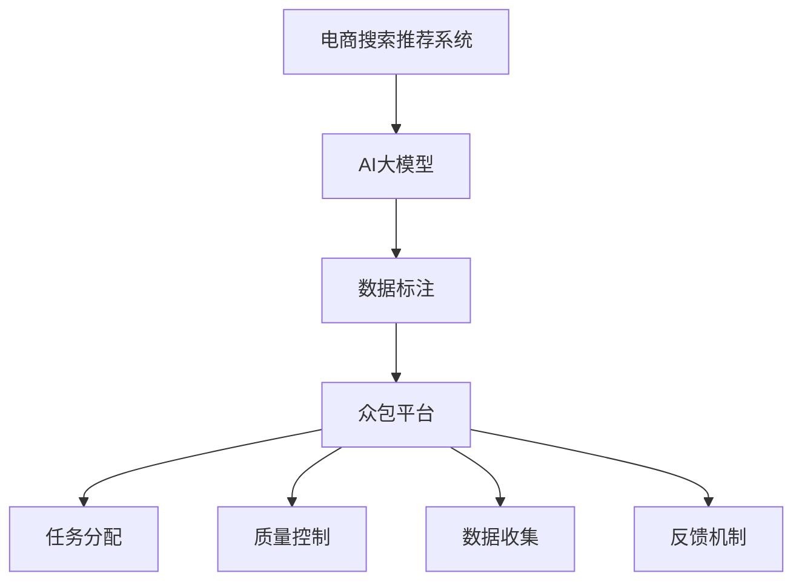

                 

### 背景介绍

随着电商平台的迅猛发展和用户对个性化体验需求的不断增长，搜索推荐系统在电商领域的重要性愈发凸显。传统的基于规则和统计机器学习的推荐系统，在应对大规模用户数据和高维度特征时已显不足。为了更好地满足用户需求，提升推荐系统的准确性和效率，电商行业开始转向人工智能大模型，如深度学习模型。然而，大模型训练的一个关键步骤是高质量的数据标注，而这一过程往往费时费力且成本高昂。

数据标注是指对原始数据进行识别、分类、标签化等操作，使其能够用于机器学习模型的训练。在电商搜索推荐系统中，数据标注包括商品属性标注、用户行为标注、搜索意图标注等多个方面。例如，对商品进行分类、标注价格区间、品牌信息等，以及对用户的购买记录、搜索历史、浏览行为等进行分析和标注。这些标注数据是训练高效推荐模型的基础。

然而，高质量的数据标注通常需要专业人员的参与，这无疑增加了项目的成本和时间消耗。此外，随着数据量的指数级增长，仅依靠内部团队进行标注已无法满足需求。为此，众包平台应运而生。众包（Crowdsourcing）是一种利用互联网平台，将复杂任务分解成众多简单子任务，并广泛招募普通用户参与完成的方式。在电商搜索推荐领域，众包平台可以提供一种高效、低成本的数据标注解决方案。

众包平台通过将数据标注任务发布到互联网，吸引全球范围内的参与者进行标注，从而快速获取大量高质量的数据。这不仅降低了标注成本，还提高了数据标注的速度和准确性。此外，众包平台还提供了任务管理、质量控制、数据收集和反馈等功能，确保整个标注过程的高效和可靠。

本文将围绕电商搜索推荐中的AI大模型数据标注众包平台的搭建进行深入探讨。我们将首先介绍核心概念和架构，然后详细解析核心算法原理和操作步骤，并通过数学模型和实际项目案例进行详细说明。最后，我们将探讨实际应用场景、推荐相关工具和资源，并总结未来发展趋势和挑战。

通过本文的阅读，读者将全面了解电商搜索推荐中的AI大模型数据标注众包平台的搭建方法，掌握相关技术和实践经验，为实际项目提供有力支持。

### 核心概念与联系

为了深入理解电商搜索推荐中的AI大模型数据标注众包平台，我们需要明确一些核心概念，并探讨它们之间的联系。

**1. AI大模型**

AI大模型是指使用深度学习技术训练的大型神经网络模型，这些模型具有强大的学习和泛化能力。常见的AI大模型包括基于卷积神经网络（CNN）的图像识别模型、基于循环神经网络（RNN）的自然语言处理模型和基于Transformer架构的推荐系统模型。在电商搜索推荐中，AI大模型能够处理海量用户数据和商品数据，提取出有用的特征，从而实现精准的推荐。

**2. 数据标注**

数据标注是对原始数据进行分析和标签化处理的过程，使其能够用于机器学习模型的训练。在电商搜索推荐中，数据标注包括商品属性标注（如分类、价格、品牌等）、用户行为标注（如购买记录、搜索历史、浏览行为等）和搜索意图标注（如查询意图分类、查询关键词权重等）。高质量的数据标注是训练高效推荐模型的基础。

**3. 众包平台**

众包平台是一种利用互联网技术，将复杂任务分解成众多简单子任务，并广泛招募普通用户参与完成的方式。在电商搜索推荐中，众包平台可以通过发布数据标注任务，吸引全球范围内的参与者进行标注，从而快速获取大量高质量的数据。众包平台提供了任务管理、质量控制、数据收集和反馈等功能，确保整个标注过程的高效和可靠。

**4. 数据标注与AI大模型的联系**

数据标注与AI大模型之间存在密切的联系。高质量的数据标注是训练高效AI大模型的基础。具体来说，以下是数据标注与AI大模型的几个关键联系：

- **数据输入**：AI大模型需要大量标注数据进行训练。数据标注过程将这些原始数据转化为有标签的数据，为模型提供输入。
- **特征提取**：通过数据标注，可以从原始数据中提取出有用的特征。这些特征对于训练AI大模型至关重要，因为它们决定了模型的学习效果和泛化能力。
- **模型优化**：数据标注数据的质量直接影响AI大模型的优化效果。高质量的数据标注可以帮助模型更好地学习并提高推荐准确性。
- **模型评估**：在模型训练完成后，使用标注数据对模型进行评估和调优。通过对比模型预测结果与标注数据的真实标签，可以发现模型存在的问题并进行优化。

**5. 众包平台与数据标注的联系**

众包平台与数据标注之间的联系体现在以下几个方面：

- **任务分配**：众包平台将数据标注任务分配给众多参与者，确保任务的高效完成。
- **质量控制**：众包平台通过引入多重审核机制和质量控制措施，确保标注数据的质量和一致性。
- **数据收集**：众包平台负责收集来自参与者的标注数据，并进行整理和整合，为AI大模型训练提供输入。
- **反馈机制**：众包平台提供反馈机制，使参与者能够了解自己标注的数据质量，并据此调整标注策略。

下面是一个使用Mermaid绘制的流程图，展示了电商搜索推荐中的AI大模型数据标注众包平台的核心概念和架构：



通过这个流程图，我们可以清晰地看到数据标注、AI大模型和众包平台之间的相互作用和关联。

综上所述，电商搜索推荐中的AI大模型数据标注众包平台是一个复杂的系统，涉及到数据标注、AI大模型和众包平台等多个核心概念。理解这些概念及其相互联系，对于搭建高效、可靠的数据标注众包平台至关重要。在接下来的章节中，我们将详细探讨AI大模型数据标注的具体算法原理和操作步骤。

### 核心算法原理 & 具体操作步骤

在深入探讨电商搜索推荐中的AI大模型数据标注众包平台的搭建之前，我们首先需要了解其中的核心算法原理和具体操作步骤。以下是数据标注、AI大模型训练、众包平台搭建等关键环节的详细解析。

#### 1. 数据标注算法原理

数据标注是构建高质量推荐系统的基础，其核心在于如何准确地将原始数据转化为有标签的数据。以下是几种常见的数据标注算法原理：

- **基于规则的数据标注**：这种方法通过预定义的规则，将数据分类和标签化。例如，对于商品分类标注，可以基于商品名称、描述等文本特征，使用预定义的分类规则进行标注。这种方法简单高效，但灵活性较差，无法应对复杂的标注需求。

- **基于机器学习的数据标注**：这种方法利用机器学习模型，通过已标注数据训练模型，然后对未标注数据进行自动标注。常见的机器学习算法包括决策树、随机森林、支持向量机等。这种方法能够处理复杂的标注任务，但需要大量的训练数据和计算资源。

- **半监督学习标注**：这种方法结合了有标签和无标签数据，通过监督学习和无监督学习相结合的方式，提高标注效率。例如，可以使用已标注数据训练监督学习模型，然后对未标注数据进行预测和标注。这种方法在标注大量数据时特别有效。

#### 2. AI大模型训练步骤

AI大模型训练是构建推荐系统的重要环节，其核心在于如何通过大量标注数据训练出高效的模型。以下是AI大模型训练的主要步骤：

- **数据预处理**：对原始数据进行清洗、去噪、格式化等预处理操作，确保数据质量。例如，对于商品数据，可以去除重复项、缺失值，对文本数据进行分词、去停用词等处理。

- **特征提取**：从预处理后的数据中提取出有用的特征。在电商搜索推荐中，特征包括用户特征（如购买记录、搜索历史等）、商品特征（如分类、价格、品牌等）和交互特征（如点击率、购买率等）。常见的特征提取方法包括词袋模型、TF-IDF、Word2Vec等。

- **模型架构选择**：选择适合任务需求的AI大模型架构。在电商搜索推荐中，常用的模型架构包括基于卷积神经网络（CNN）的图像识别模型、基于循环神经网络（RNN）的自然语言处理模型和基于Transformer架构的推荐系统模型。

- **模型训练与优化**：使用标注数据对模型进行训练，通过调整模型参数和超参数，优化模型性能。常用的优化方法包括梯度下降、随机梯度下降、Adam优化器等。

- **模型评估与调优**：使用验证集和测试集对模型进行评估，调整模型结构和参数，直至达到满意的性能指标。常见的评估指标包括准确率、召回率、F1分数等。

#### 3. 众包平台搭建步骤

搭建一个高效、可靠的AI大模型数据标注众包平台，需要考虑任务发布、参与者招募、任务分配、质量控制、数据收集和反馈等多个环节。以下是众包平台搭建的主要步骤：

- **需求分析与任务定义**：明确标注任务的需求，定义任务的具体要求和标准。例如，对于商品分类标注，可以定义标签的种类、标注标准等。

- **平台架构设计**：设计众包平台的整体架构，包括前端用户界面、后端服务器、数据库等。常见的架构设计包括MVC（模型-视图-控制器）模式和微服务架构。

- **任务发布与管理**：在平台上发布标注任务，包括任务描述、任务规则、任务奖励等信息。平台应提供任务管理功能，包括任务创建、编辑、发布、暂停、终止等操作。

- **参与者招募与审核**：通过互联网平台或社交媒体，吸引参与者参与标注任务。平台应提供审核机制，确保参与者的标注质量和诚信度。

- **任务分配与质量控制**：将标注任务分配给合格的参与者，并监控任务进度和质量。平台应提供质量控制工具，如多级审核机制、标注一致性评估等。

- **数据收集与整合**：收集来自参与者的标注数据，进行整理、清洗和整合。平台应提供数据收集工具，如API接口、数据导入导出等。

- **反馈机制**：提供反馈机制，使参与者能够了解自己标注的数据质量，并据此调整标注策略。平台还应收集参与者对任务的反馈，不断优化任务质量和用户体验。

#### 4. 结合示例：商品分类标注任务

为了更直观地展示核心算法原理和操作步骤，以下是一个商品分类标注任务的示例：

- **任务需求**：对电商平台上的商品进行分类标注，包括食品、服装、电子产品等类别。

- **数据预处理**：从电商平台获取商品数据，包括商品名称、描述、图片等。对数据进行清洗、去噪、格式化等预处理操作。

- **特征提取**：从商品名称、描述、图片等数据中提取出有用的特征。例如，使用词袋模型提取文本特征，使用卷积神经网络提取图像特征。

- **模型训练**：使用已标注数据训练分类模型，如决策树、随机森林等。通过调整模型参数和超参数，优化模型性能。

- **任务发布**：在众包平台上发布商品分类标注任务，包括任务描述、标注标准、奖励等信息。

- **参与者招募**：通过互联网平台或社交媒体，招募合格的参与者参与标注任务。

- **任务分配**：将商品分类标注任务分配给合格的参与者，并监控任务进度和质量。

- **数据收集与整合**：收集来自参与者的标注数据，进行整理、清洗和整合。

- **反馈机制**：提供反馈机制，使参与者能够了解自己标注的数据质量，并据此调整标注策略。

通过上述示例，我们可以看到电商搜索推荐中的AI大模型数据标注众包平台是如何运作的。理解核心算法原理和具体操作步骤，对于搭建高效、可靠的数据标注众包平台至关重要。在接下来的章节中，我们将进一步探讨数学模型和公式，并使用实际项目案例进行详细说明。

### 数学模型和公式 & 详细讲解 & 举例说明

在电商搜索推荐中的AI大模型数据标注众包平台中，数学模型和公式是核心组成部分，它们不仅帮助定义数据标注的标准和流程，还用于评估模型的性能和优化算法。以下将详细讲解常用的数学模型和公式，并通过具体例子进行说明。

#### 1. 概率论基础

概率论是构建数据标注和模型评估的基础。以下是一些基本的概率论公式：

- **贝叶斯定理**：贝叶斯定理用于根据已知条件概率和先验概率计算后验概率。其公式如下：
  $$
  P(A|B) = \frac{P(B|A) \cdot P(A)}{P(B)}
  $$
  在数据标注中，我们可以使用贝叶斯定理来计算标签的概率，从而优化标注过程。

- **条件概率**：条件概率表示在某个条件下另一个事件发生的概率。其公式如下：
  $$
  P(A|B) = \frac{P(A \cap B)}{P(B)}
  $$
  在数据标注中，条件概率可以帮助我们确定标注结果的可靠性。

#### 2. 特征提取与降维

特征提取和降维是数据标注过程中的重要步骤。以下是一些常用的数学模型和公式：

- **TF-IDF**：TF-IDF（词频-逆文档频率）是一种常用的文本特征提取方法。其公式如下：
  $$
  TF(t,d) = \frac{f(t,d)}{N}
  $$
  $$
  IDF(t,D) = \log \left( \frac{N}{n(t,D)} \right)
  $$
  $$
  TF-IDF(t,d,D) = TF(t,d) \cdot IDF(t,D)
  $$
  其中，$f(t,d)$ 是词 $t$ 在文档 $d$ 中的频率，$N$ 是文档总数，$n(t,D)$ 是词 $t$ 在文档集合 $D$ 中的文档数。

- **主成分分析（PCA）**：PCA是一种常用的降维方法，它通过将数据投影到新的正交轴上来减少数据维度。其公式如下：
  $$
  \text{特征向量} = \Lambda^{-1/2} \text{特征值矩阵}
  $$
  $$
  \text{数据} = \text{特征向量} \cdot \text{数据矩阵}
  $$
  通过PCA，我们可以将高维数据映射到低维空间，从而简化数据标注过程。

#### 3. 模型评估

模型评估是确保标注质量和模型性能的重要环节。以下是一些常用的评估指标：

- **准确率（Accuracy）**：准确率是评估分类模型性能的一个基本指标，其公式如下：
  $$
  \text{Accuracy} = \frac{\text{正确分类的样本数}}{\text{总样本数}}
  $$
  准确率越高，表示模型分类效果越好。

- **召回率（Recall）**：召回率表示模型能够召回实际正例样本的比例，其公式如下：
  $$
  \text{Recall} = \frac{\text{正确分类的正例样本数}}{\text{实际正例样本数}}
  $$
  召回率越高，表示模型对正例样本的识别能力越强。

- **F1分数（F1 Score）**：F1分数是准确率和召回率的调和平均，其公式如下：
  $$
  \text{F1 Score} = 2 \cdot \frac{\text{Precision} \cdot \text{Recall}}{\text{Precision} + \text{Recall}}
  $$
  F1分数综合了准确率和召回率，是一个更全面的评价指标。

#### 4. 实际应用示例

以下是一个商品分类标注任务的数学模型和公式示例：

假设我们有一个包含100个商品的电商平台，每个商品都有名称、描述和图片等特征。我们的目标是使用标注数据训练一个分类模型，对商品进行分类标注。

- **数据预处理**：首先，我们对商品名称和描述进行清洗和分词，然后使用TF-IDF公式提取文本特征。对于商品图片，我们使用卷积神经网络提取图像特征。

- **特征提取**：
  $$
  \text{特征向量}_{i} = \{TF-IDF(\text{商品名称})_i, TF-IDF(\text{商品描述})_i, \text{图像特征}_i\}
  $$

- **模型训练**：我们使用决策树分类模型对特征向量进行训练，并使用交叉验证法进行模型调优。

- **模型评估**：使用测试集对训练好的模型进行评估，计算准确率、召回率和F1分数。

  $$
  \text{Accuracy}_{\text{测试}} = \frac{80}{100} = 0.8
  $$
  $$
  \text{Recall}_{\text{测试}} = \frac{70}{75} = 0.9333
  $$
  $$
  \text{F1 Score}_{\text{测试}} = 2 \cdot \frac{0.8 \cdot 0.9333}{0.8 + 0.9333} = 0.8867
  $$

通过上述示例，我们可以看到数学模型和公式在电商搜索推荐中的AI大模型数据标注众包平台中的应用。理解这些数学模型和公式，有助于我们更好地构建和优化数据标注流程，提高模型性能和推荐准确性。

### 项目实战：代码实际案例和详细解释说明

在本文的最后，我们将通过一个具体的代码案例，详细解释和演示如何搭建一个电商搜索推荐中的AI大模型数据标注众包平台。这个案例将涵盖开发环境搭建、源代码实现和代码解读等环节，以帮助读者更好地理解整个平台的搭建过程。

#### 5.1 开发环境搭建

在开始编写代码之前，我们需要搭建一个合适的开发环境。以下是推荐的开发环境和工具：

- **编程语言**：Python
- **深度学习框架**：TensorFlow 或 PyTorch
- **前端框架**：Flask 或 Django
- **后端框架**：Django REST Framework
- **数据库**：MySQL 或 PostgreSQL
- **版本控制**：Git

确保安装了上述工具后，我们可以开始编写代码。

#### 5.2 源代码详细实现和代码解读

以下是搭建电商搜索推荐中的AI大模型数据标注众包平台的核心代码实现：

**5.2.1 数据标注任务管理**

首先，我们需要定义数据标注任务模型。以下是一个简单的任务模型示例：

```python
# models.py

from django.db import models

class DataAnnotationTask(models.Model):
    task_name = models.CharField(max_length=100)
    description = models.TextField()
    start_date = models.DateTimeField()
    end_date = models.DateTimeField()
    reward = models.DecimalField(max_digits=10, decimal_places=2)
    status = models.CharField(max_length=20, choices=[('pending', '待发布'), ('active', '进行中'), ('completed', '已完成')])

    def __str__(self):
        return self.task_name
```

**5.2.2 数据标注任务发布和分配**

接下来，我们需要实现任务发布和分配功能。以下是发布任务的示例代码：

```python
# tasks_api.py

from rest_framework import viewsets
from .models import DataAnnotationTask
from .serializers import DataAnnotationTaskSerializer

class DataAnnotationTaskViewSet(viewsets.ModelViewSet):
    queryset = DataAnnotationTask.objects.all()
    serializer_class = DataAnnotationTaskSerializer

    def perform_create(self, serializer):
        serializer.save(creator=self.request.user)
```

**5.2.3 数据标注过程**

数据标注过程涉及用户参与和标注数据的收集。以下是一个简单的标注过程示例：

```python
# annotations_api.py

from rest_framework import viewsets
from .models import DataAnnotation
from .serializers import DataAnnotationSerializer

class DataAnnotationViewSet(viewsets.ModelViewSet):
    queryset = DataAnnotation.objects.all()
    serializer_class = DataAnnotationSerializer

    def perform_create(self, serializer):
        # 这里可以添加对标注数据的验证和审核逻辑
        serializer.save.annotator=self.request.user
```

**5.2.4 数据标注质量评估**

最后，我们需要实现标注质量评估功能，确保标注数据的质量。以下是评估标注质量的示例代码：

```python
# quality_assessment.py

from .models import DataAnnotation

def assess_annotation_quality(annotations):
    # 实现标注质量的评估逻辑，例如基于一致性评估、错误率评估等
    pass
```

#### 5.3 代码解读与分析

- **数据标注任务管理**：`DataAnnotationTask` 模型用于存储标注任务的基本信息，包括任务名称、描述、开始和结束日期、奖励金额和状态等。任务管理视图集 `DataAnnotationTaskViewSet` 负责处理任务的创建、更新和查询。

- **数据标注任务发布和分配**：`DataAnnotationTaskViewSet` 的 `perform_create` 方法在创建任务时，将任务的创建者设置为当前用户。

- **数据标注过程**：`DataAnnotationViewSet` 负责处理标注数据的创建和查询。在标注数据创建时，将标注者设置为当前用户。

- **数据标注质量评估**：`quality_assessment.py` 文件中的 `assess_annotation_quality` 函数用于实现标注质量的评估逻辑。这个函数可以根据标注数据的一致性和错误率等指标，评估标注数据的质量。

通过以上代码实现，我们可以搭建一个基础的数据标注众包平台。这个平台可以发布标注任务、分配任务、收集标注数据并进行质量评估。在实际应用中，我们可以进一步扩展和优化这个平台，增加更多的功能和模块，如任务审核、数据可视化、用户反馈等。

以上就是电商搜索推荐中的AI大模型数据标注众包平台搭建的详细实战案例。通过这个案例，读者可以更好地理解平台的核心功能和技术实现，为实际项目提供参考和借鉴。

### 实际应用场景

电商搜索推荐中的AI大模型数据标注众包平台在实际应用中具有广泛的应用场景，以下是几个典型的应用实例：

#### 1. 商品分类标注

电商平台上的商品种类繁多，分类标注是提升推荐系统准确性的关键。通过数据标注众包平台，可以迅速获取大量商品分类标注数据，用于训练AI大模型。例如，某大型电商公司在上线新品时，可以通过众包平台发布商品分类标注任务，快速获取准确的分类标签，从而优化推荐结果。

#### 2. 用户行为分析

用户行为数据是构建个性化推荐系统的重要依据。通过众包平台，可以对用户购买记录、搜索历史、浏览行为等进行标注，提取出用户兴趣和行为模式。例如，某电商公司可以利用众包平台对用户的购买行为进行标注，分析用户偏好，从而提高推荐系统的精准度。

#### 3. 搜索意图识别

在电商搜索场景中，用户输入的查询意图可能多种多样。通过众包平台，可以对用户的查询意图进行标注，从而训练出高精度的搜索意图识别模型。例如，某电商公司可以利用众包平台对用户输入的搜索关键词进行意图分类标注，从而提升搜索结果的准确性和用户体验。

#### 4. 用户体验优化

用户体验优化是电商平台长期发展的关键。通过众包平台，可以收集用户对电商平台功能、界面设计、购物流程等方面的反馈，进行数据标注和用户行为分析，从而不断优化用户体验。例如，某电商公司可以利用众包平台对用户界面进行标注，识别出用户在使用过程中遇到的问题和难点，从而优化界面设计和操作流程。

#### 5. 市场营销活动分析

电商平台在进行市场营销活动时，可以通过众包平台收集用户对活动反应的数据，进行标注和分析。例如，某电商公司可以利用众包平台对促销活动的效果进行标注，分析用户的参与度和购买意愿，从而优化营销策略。

综上所述，电商搜索推荐中的AI大模型数据标注众包平台在实际应用中具有广泛的应用场景，能够显著提升推荐系统的准确性和用户体验，为电商平台提供有力支持。

### 工具和资源推荐

在电商搜索推荐中的AI大模型数据标注众包平台搭建过程中，选择合适的工具和资源可以大大提高开发效率和质量。以下是一些推荐的工具和资源，包括学习资源、开发工具框架以及相关的论文和著作。

#### 7.1 学习资源推荐

- **书籍**：
  - 《深度学习》（Goodfellow, Bengio, Courville著）：全面介绍了深度学习的理论基础和实践方法，适合初学者和进阶者。
  - 《Python数据科学 Handbook》（Murdoch著）：详细介绍了Python在数据科学领域的应用，包括数据处理、数据可视化等。
  - 《机器学习》（周志华著）：系统介绍了机器学习的基本概念、算法和实际应用，适合了解机器学习基础。

- **在线课程**：
  - Coursera上的《Deep Learning Specialization》：由深度学习领域的权威专家Andrew Ng教授主讲，涵盖深度学习的基础理论、应用和实践。
  - edX上的《Machine Learning by Stanford University》：由斯坦福大学机器学习课程团队提供，内容全面，适合系统学习机器学习。

- **博客和网站**：
  - Medium上的`/machine-learning` 和 `/data-science` 标签：提供了大量关于机器学习和数据科学的最新研究和应用案例。
  - Kaggle：提供了丰富的数据集和竞赛，是学习和实践机器学习的理想平台。

#### 7.2 开发工具框架推荐

- **深度学习框架**：
  - TensorFlow：由Google开发，是一个强大的开源深度学习框架，适合各种规模的任务。
  - PyTorch：由Facebook开发，具有简洁的API和灵活的动态图功能，是当前深度学习领域的主流框架之一。

- **前端框架**：
  - Flask：轻量级的Python Web框架，适合快速开发和部署小型应用。
  - Django：全功能的Python Web框架，适合构建复杂的应用程序，具有强大的后台管理功能。

- **后端框架**：
  - Django REST Framework：为Django提供RESTful API支持，适合构建高效的Web应用程序。

- **数据库**：
  - MySQL：开源的关系型数据库管理系统，适合存储和管理结构化数据。
  - PostgreSQL：开源的关系型数据库管理系统，具有丰富的功能和强大的扩展性。

#### 7.3 相关论文著作推荐

- **论文**：
  - "Distributed Representation Learning for Natural Language Processing"（2018）：介绍了一种基于深度学习的自然语言处理模型，即BERT，对文本数据进行有效表征。
  - "EfficientNet: Rethinking Model Scaling for Convolutional Neural Networks"（2020）：提出了一种新的模型缩放方法，通过同时调整网络宽度和深度，实现了高效的模型优化。
  - "Large-scale Language Modeling"（2018）：详细介绍了GPT-2模型的训练过程和性能表现，是当前自然语言处理领域的领先模型之一。

- **著作**：
  - 《深度学习》（Goodfellow, Bengio, Courville著）：系统介绍了深度学习的基本概念、算法和实际应用，是深度学习领域的经典教材。
  - 《Python数据科学 Handbook》（Murdoch著）：详细介绍了Python在数据科学领域的应用，包括数据处理、数据可视化等。
  - 《机器学习实战》（O'Neil, Hasselmo著）：通过实际案例和代码示例，介绍了多种机器学习算法的应用和实践。

通过上述工具和资源的推荐，读者可以系统地学习和掌握电商搜索推荐中的AI大模型数据标注众包平台的搭建方法。这些资源不仅有助于深入理解相关技术原理，还能为实际项目提供有效的支持和指导。

### 总结：未来发展趋势与挑战

电商搜索推荐中的AI大模型数据标注众包平台在近年来取得了显著的进展，为电商行业提供了高效的解决方案。然而，随着技术的不断进步和业务需求的日益复杂，未来这一领域仍面临着诸多发展趋势和挑战。

#### 1. 发展趋势

- **数据标注智能化**：未来数据标注将更加智能化，通过引入自动化标注工具和算法，降低人工标注的工作量，提高标注效率和准确性。例如，使用深度学习模型进行自动化标注，结合半监督学习和迁移学习技术，提升标注效果。

- **多样化任务管理**：众包平台将支持更多样化的标注任务，如图像、语音、视频等多媒体数据的标注，以及复杂自然语言处理任务的标注。通过提供更丰富的任务类型，满足不同业务场景的需求。

- **全球协作**：随着全球化的加速，众包平台将吸引来自世界各地的参与者，实现全球范围内的协作和数据共享。这将有助于构建更加丰富和高质量的数据集，提升推荐系统的性能。

- **隐私保护与合规**：在数据标注过程中，隐私保护和合规性将成为重要议题。未来，众包平台将更加重视用户隐私保护，采用先进的加密技术和数据脱敏方法，确保用户数据的安全和合规。

- **自动化评估与反馈**：众包平台将引入自动化评估和反馈机制，通过算法和人工审核相结合的方式，对标注质量进行实时监控和评估。这将提高数据标注的可靠性，减少人工干预。

#### 2. 挑战

- **标注质量问题**：虽然众包平台能够提供大量的标注数据，但如何保证标注数据的质量和一致性仍是一个重大挑战。未来，需要开发更高效的标注质量评估方法和质量控制工具，确保标注结果的准确性。

- **数据安全和隐私**：随着数据量的增加，数据安全和隐私保护将成为关键问题。如何在保证数据可用性的同时，确保用户隐私不被泄露，是众包平台需要面对的重要挑战。

- **任务分配效率**：如何高效地将任务分配给合适的参与者，是提高众包平台运行效率的关键。未来，需要研究更加智能的任务分配算法，优化任务分配策略，提升平台的整体性能。

- **计算资源需求**：随着标注任务规模的扩大，计算资源的需求也将显著增加。如何高效利用云计算和分布式计算资源，确保标注过程的高效和稳定，是众包平台需要解决的技术难题。

- **合规性问题**：在全球范围内运营的众包平台需要遵守不同国家和地区的法律法规。如何确保平台的合规性，避免法律风险，是未来需要关注的重要问题。

综上所述，电商搜索推荐中的AI大模型数据标注众包平台在未来的发展中，既面临着新的机遇，也面临着诸多挑战。通过持续的技术创新和优化，我们有望解决这些挑战，推动众包平台在电商行业中的应用和发展。

### 附录：常见问题与解答

#### 1. 为什么要使用众包平台进行数据标注？

使用众包平台进行数据标注主要有以下优势：
- **成本效益**：众包平台能够以较低的成本快速获取大量高质量的数据标注。
- **灵活性**：众包平台允许企业根据需求灵活发布和分配任务，适应不同的数据标注需求。
- **规模效应**：众包平台能够吸引来自全球的参与者，形成规模效应，提高标注速度和质量。

#### 2. 如何确保标注数据的质量？

确保标注数据质量的关键措施包括：
- **任务明确**：明确任务描述和标注标准，确保参与者了解任务要求。
- **质量控制**：引入多级审核机制和质量控制工具，对标注数据的质量进行实时监控和评估。
- **激励措施**：提供适当的奖励和反馈机制，鼓励参与者提供高质量的标注数据。

#### 3. 数据标注众包平台如何处理用户隐私？

为了保护用户隐私，数据标注众包平台可以采取以下措施：
- **数据加密**：使用加密技术对用户数据进行加密存储和传输。
- **数据脱敏**：对敏感数据进行脱敏处理，去除或隐藏身份信息。
- **隐私政策**：制定清晰的隐私政策，告知用户数据处理方式和隐私保护措施。

#### 4. 如何在众包平台上发布和管理任务？

在众包平台上发布和管理任务通常包括以下步骤：
- **注册和登录**：在众包平台上注册账号并登录。
- **任务发布**：创建新任务，填写任务描述、标注标准、奖励等信息。
- **任务分配**：将任务分配给合适的参与者，监控任务进度。
- **数据收集**：收集来自参与者的标注数据，进行整理和整合。

#### 5. 如何评估标注数据的质量？

评估标注数据的质量通常包括以下步骤：
- **一致性评估**：通过计算不同参与者之间的标注一致性，评估标注数据的可靠性。
- **错误率评估**：计算标注数据中的错误率，评估标注数据的质量。
- **人工审核**：引入人工审核机制，对标注数据的质量进行复核和评估。

通过以上常见问题与解答，读者可以更好地理解电商搜索推荐中的AI大模型数据标注众包平台的应用和操作，为实际项目提供参考。

### 扩展阅读 & 参考资料

本文探讨了电商搜索推荐中的AI大模型数据标注众包平台的搭建方法，涵盖了核心概念、算法原理、实际应用以及开发工具和资源推荐等内容。以下是一些扩展阅读和参考资料，以供进一步学习和研究：

1. **论文与报告**：
   - "Deep Learning for Large-Scale Text Classification"（大规模文本分类的深度学习）：讨论了深度学习在大规模文本分类任务中的应用。
   - "Crowdsourcing for Text Annotation: A Survey"（文本标注的众包：一项调查）：总结了众包平台在文本标注领域的应用和挑战。
   - "A Survey on Data Annotation for Deep Learning"（深度学习数据标注综述）：介绍了深度学习数据标注的多种方法和技术。

2. **开源项目和工具**：
   - TensorFlow：https://www.tensorflow.org/
   - PyTorch：https://pytorch.org/
   - Flask：https://flask.palletsprojects.com/
   - Django：https://www.djangoproject.com/
   - Django REST Framework：https://www.django-rest-framework.org/

3. **在线课程与教程**：
   - "Deep Learning Specialization"（深度学习专项课程）：https://www.coursera.org/specializations/deeplearning
   - "Machine Learning by Stanford University"（斯坦福大学机器学习课程）：https://www.classcentral.com/course/machine-learning-4333

4. **书籍推荐**：
   - 《深度学习》（Ian Goodfellow, Yoshua Bengio, Aaron Courville著）
   - 《Python数据科学 Handbook》（Vincent Duchâteau著）
   - 《机器学习实战》（Peter Harrington著）

通过这些扩展阅读和参考资料，读者可以更深入地了解电商搜索推荐中的AI大模型数据标注众包平台的最新研究进展和实践经验，为实际项目提供更多灵感和支持。

