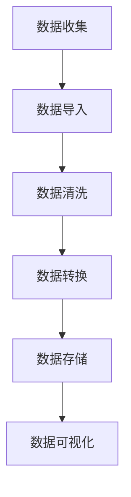

                 

### 背景介绍

在电子商务飞速发展的今天，搜索引擎和推荐系统成为电商平台的两大核心功能。用户在庞大的商品库中寻找心仪的产品，往往需要依赖高效的搜索和智能的推荐系统来快速定位目标。其中，AI 大模型在电商搜索推荐系统中扮演了至关重要的角色。AI 大模型通过深度学习和自然语言处理技术，能够从海量的用户数据中提取有价值的信息，进而实现精准的搜索结果和个性化推荐。

电商搜索推荐系统中的 AI 大模型主要解决两个核心问题：一是如何通过用户的历史行为和偏好，构建一个精确的用户画像；二是如何利用这些画像，生成高质量的搜索结果和推荐列表。在这个过程中，数据清洗与预处理是至关重要的环节。不干净的数据会导致 AI 大模型学习效果不佳，甚至可能产生错误的推荐结果。因此，研究如何有效地进行数据清洗与预处理，是提高电商搜索推荐系统性能的关键。

本文将围绕电商搜索推荐中的 AI 大模型数据清洗与预处理技术展开讨论。首先，我们将介绍 AI 大模型在电商搜索推荐系统中的基本原理和应用。然后，我们将深入探讨数据清洗与预处理的方法和技术，包括缺失值处理、异常值检测与处理、数据标准化、数据去重等。接着，我们将通过一个实际项目案例，详细讲解如何在实际场景中进行数据清洗与预处理。最后，我们将总结全文，探讨 AI 大模型数据清洗与预处理的未来发展趋势和面临的挑战。

总的来说，本文旨在为电商搜索推荐领域的从业者提供一套系统、全面的数据清洗与预处理技术方案，帮助他们在实际项目中实现高效的 AI 大模型应用。

### AI 大模型在电商搜索推荐系统中的应用

AI 大模型在电商搜索推荐系统中有着广泛的应用，其核心在于通过深度学习和自然语言处理技术，从海量的用户行为数据中提取有价值的信息，进而实现精准的搜索结果和个性化推荐。下面我们将详细介绍 AI 大模型在电商搜索推荐系统中的应用，包括其基本原理、具体技术手段以及优势。

#### 基本原理

AI 大模型通常基于深度学习技术，特别是卷积神经网络（CNN）、循环神经网络（RNN）和变换器模型（Transformer）等。这些模型能够自动从原始数据中学习到复杂的特征和模式，从而实现高层次的抽象和表示。在电商搜索推荐系统中，AI 大模型主要用于以下几个关键任务：

1. **用户画像构建**：通过分析用户的历史浏览记录、购买行为、搜索关键词等数据，构建一个多维度的用户画像。这个画像能够反映用户的兴趣偏好、消费能力、购买频率等信息。

2. **商品特征提取**：从商品标题、描述、标签等多维度数据中提取商品的特征。这些特征包括商品的价格、品牌、类型、规格等，用于后续的推荐算法。

3. **搜索结果排序**：在用户进行搜索时，AI 大模型会对搜索结果进行排序，将最相关的商品放在前面，提高用户找到目标商品的概率。

4. **推荐列表生成**：基于用户的画像和商品的特征，AI 大模型能够生成个性化的推荐列表。推荐算法会综合考虑用户的兴趣、浏览历史、购买记录等因素，为用户推荐最可能感兴趣的商品。

#### 具体技术手段

1. **深度学习技术**：深度学习模型如 CNN、RNN 和 Transformer 在图像识别、文本处理等方面表现出色。在电商搜索推荐系统中，这些模型被用来处理和分类用户行为数据、提取商品特征。

2. **自然语言处理（NLP）技术**：NLP 技术用于处理和解析用户输入的文本信息，如搜索关键词和商品描述。通过词嵌入（Word Embedding）等技术，模型能够将文本转换为向量表示，进而进行特征提取和分类。

3. **协同过滤（Collaborative Filtering）**：协同过滤是一种常见的推荐算法，通过分析用户之间的相似性来生成推荐列表。在电商搜索推荐系统中，协同过滤算法通常与深度学习模型结合使用，以提高推荐质量。

4. **图神经网络（Graph Neural Networks, GNN）**：GNN 是一种适用于处理图结构数据的深度学习模型。在电商搜索推荐系统中，GNN 可以用来建模商品之间的关系，如品牌关联、类别关联等，从而生成更精准的推荐结果。

#### 优势

1. **高精度推荐**：AI 大模型能够从海量数据中提取复杂特征和模式，生成高精度的推荐结果，提高用户满意度和购买转化率。

2. **实时推荐**：通过高效的数据处理和模型训练技术，AI 大模型能够实现实时推荐，为用户提供及时、个性化的购物体验。

3. **多模态融合**：AI 大模型能够处理和融合多种类型的数据，如文本、图像、音频等，从而提高推荐系统的多样性和灵活性。

4. **自适应学习**：AI 大模型具有自适应学习能力，能够根据用户反馈和行为动态调整推荐策略，优化推荐效果。

总之，AI 大模型在电商搜索推荐系统中的应用，不仅提高了推荐的精度和实时性，还增强了系统的多样性和适应性，为电商平台提供了强大的竞争力。

### 数据清洗与预处理的重要性

在电商搜索推荐系统中，数据清洗与预处理是确保 AI 大模型有效运行的关键步骤。数据质量直接影响模型的学习效果和预测准确性，因此，对原始数据进行清洗和预处理，是提升模型性能的必要前提。以下将从几个方面探讨数据清洗与预处理的重要性。

#### 提高模型学习效果

原始数据往往包含噪声、错误和不一致的信息，这些不干净的数据会对 AI 大模型的学习效果产生负面影响。例如，数据中的缺失值、异常值和重复记录会导致模型无法准确捕捉数据中的真实模式和关系。通过数据清洗与预处理，可以去除这些噪声和错误，提高数据质量，从而提高模型的学习效果和预测准确性。

#### 提高模型训练效率

不干净的数据会增加模型训练的时间成本。在模型训练过程中，如果数据中存在大量的缺失值、异常值或重复记录，模型需要花费更多的时间去处理这些数据，从而降低了训练效率。通过数据清洗与预处理，可以减少这些不必要的数据处理时间，提高模型训练的效率。

#### 优化模型性能

数据清洗与预处理还能优化模型性能。例如，通过数据标准化和归一化，可以消除数据量级上的差异，使模型能够更好地捕捉数据中的非线性关系。此外，通过数据去重，可以消除重复数据对模型的影响，进一步提高模型的性能。

#### 降低过拟合风险

过拟合是指模型在训练数据上表现良好，但在未见数据上的表现不佳。不干净的数据容易导致模型过拟合。例如，数据中的异常值或噪声可能会导致模型过分关注这些异常点，从而无法泛化到未见过的数据。通过数据清洗与预处理，可以减少这些异常点的影响，降低过拟合的风险。

#### 提高数据分析效率

数据清洗与预处理也是提高数据分析效率的重要手段。在数据分析过程中，如果数据质量差，需要花费大量时间对数据进行清洗和修复。通过数据清洗与预处理，可以减少数据分析的时间成本，提高工作效率。

总之，数据清洗与预处理在电商搜索推荐系统中具有重要意义。通过有效清洗和预处理原始数据，可以提高模型的学习效果、训练效率和性能，降低过拟合风险，同时提高数据分析的效率。这是确保 AI 大模型在电商搜索推荐系统中发挥最佳效果的关键步骤。

#### 数据清洗与预处理的基本步骤

数据清洗与预处理是构建高效电商搜索推荐系统不可或缺的一步。为了确保数据质量，需要按照一定的步骤进行系统化的操作。以下将详细阐述数据清洗与预处理的基本步骤，包括数据收集、数据导入、数据清洗、数据转换和数据存储等。

##### 1. 数据收集

数据收集是数据清洗与预处理的第一步，也是至关重要的一步。电商搜索推荐系统需要从多个渠道收集数据，包括用户行为数据、商品数据、交易数据和外部数据源。用户行为数据包括用户的浏览记录、搜索历史、购买记录等；商品数据包括商品标题、描述、价格、品牌、分类等信息；交易数据包括订单数据、支付数据等；外部数据源包括社交媒体数据、市场调研数据等。数据收集的过程需要确保数据的全面性和准确性。

##### 2. 数据导入

收集到的数据需要导入到数据处理平台或数据库中。数据导入的步骤包括数据解析、数据转换和数据加载。在导入过程中，需要注意以下几个关键点：

- **数据格式转换**：将不同来源和格式的数据转换为统一的格式，如 CSV、JSON 或数据库表格。
- **数据一致性校验**：检查数据是否一致，例如检查是否存在缺失值、重复值等。
- **数据映射**：将原始数据映射到统一的字段和维度，以便后续处理和分析。

##### 3. 数据清洗

数据清洗是数据预处理的核心步骤，旨在去除数据中的噪声和错误。数据清洗的具体操作包括以下几方面：

- **缺失值处理**：缺失值处理是数据清洗的重要任务。对于缺失值，可以采用以下几种方法：
  - 删除缺失值：对于某些数据，缺失值可能代表无效记录，可以删除这些记录。
  - 补充缺失值：对于某些数据，可以使用统计方法或基于模型的方法来补充缺失值，例如均值填充、中值填充或插值法。
  - 使用模型预测缺失值：对于高度依赖其他变量的缺失值，可以使用预测模型来预测并补充缺失值。

- **异常值检测与处理**：异常值是指数据中偏离大多数值的数据点，可能由错误、噪声或异常行为引起。异常值处理包括以下几种方法：
  - 删除异常值：如果异常值对数据的影响较大，可以删除这些异常值。
  - 调整异常值：对于一些可接受的异常值，可以通过调整值域来使其符合预期。
  - 使用模型识别异常值：使用统计模型或机器学习模型来识别和标记异常值。

- **数据去重**：数据去重是为了消除重复记录，提高数据质量。可以使用哈希函数或唯一标识符来检测和去除重复记录。

- **数据格式标准化**：将数据格式进行统一标准化，例如将日期格式转换为 yyyy-mm-dd，将字符串统一编码等。

##### 4. 数据转换

数据转换是将清洗后的数据进行转换，以满足后续分析和建模的需求。数据转换的具体操作包括：

- **数据类型转换**：将数据类型转换为适合分析和建模的格式，例如将字符串转换为数值类型。
- **数据归一化**：通过归一化方法消除数据量级上的差异，提高数据模型的稳定性和准确性。
- **特征工程**：通过构建新特征、降维或特征选择等方法，提高数据模型的解释性和泛化能力。

##### 5. 数据存储

数据清洗与预处理后的数据需要存储到数据库或数据仓库中，以便后续的数据分析和建模。数据存储的步骤包括：

- **数据表设计**：设计合适的数据库表结构，以便高效地存储和处理数据。
- **数据索引**：创建索引以提高数据查询和访问的速度。
- **数据备份**：定期备份数据，以确保数据的安全性和可靠性。

##### 6. 数据可视化

数据清洗与预处理完成后，可以通过数据可视化工具对数据进行可视化分析，以便更好地理解和分析数据。数据可视化可以揭示数据中的趋势、异常和关系，为后续的建模和分析提供指导。

总之，数据清洗与预处理是构建高效电商搜索推荐系统的基础。通过系统化地进行数据收集、导入、清洗、转换和存储，可以确保数据质量，提高模型的学习效果和预测准确性。以下是数据清洗与预处理的基本步骤流程图：



### 缺失值处理方法

在电商搜索推荐系统中，缺失值处理是数据清洗与预处理的重要环节。缺失值可能由数据采集、存储或传输过程中的错误造成，也可能是由于某些变量在特定情况下没有观测到。处理缺失值的方法可以分为以下几类：

#### 填充缺失值

1. **均值填充（Mean Imputation）**：
   - **方法**：用字段中的平均值替换缺失值。
   - **优点**：简单有效，适用于数据分布接近正态分布的情况。
   - **缺点**：忽视数据中的异常值和特殊模式，可能导致数据失真。

2. **中值填充（Median Imputation）**：
   - **方法**：用字段中的中值替换缺失值。
   - **优点**：对异常值不敏感，适用于偏态分布的数据。
   - **缺点**：可能忽视数据中的极值，影响模型的泛化能力。

3. **众数填充（Mode Imputation）**：
   - **方法**：用字段中的众数替换缺失值。
   - **优点**：特别适用于分类数据，能较好地保持数据的类别信息。
   - **缺点**：可能导致数据偏向某一类别，影响模型的多样性。

4. **插值法（Interpolation）**：
   - **方法**：利用线性或非线性插值方法填补缺失值。
   - **优点**：可以较好地保留数据的趋势和周期性。
   - **缺点**：适用于时间序列数据，对其他类型数据可能不适用。

#### 删除缺失值

1. **列删除（Deletion of Rows or Columns）**：
   - **方法**：直接删除缺失值比例较高的行或列。
   - **优点**：简单有效，适用于缺失值比例较低的情况。
   - **缺点**：可能删除大量有效信息，影响模型性能。

2. **逐行删除（Row Deletion）**：
   - **方法**：只删除缺失值比例较高的行。
   - **优点**：保留尽可能多的数据。
   - **缺点**：可能删除重要信息，导致数据偏斜。

3. **逐列删除（Column Deletion）**：
   - **方法**：只删除缺失值比例较高的列。
   - **优点**：保留尽可能多的数据。
   - **缺点**：可能删除重要特征，影响模型解释性。

#### 利用模型预测缺失值

1. **基于统计模型的预测**：
   - **方法**：使用线性回归、决策树等统计模型预测缺失值。
   - **优点**：适用于各类数据，能较好地保留数据的复杂关系。
   - **缺点**：可能引入模型偏差，影响预测准确性。

2. **基于机器学习模型的预测**：
   - **方法**：使用深度学习、随机森林等机器学习模型预测缺失值。
   - **优点**：可以捕捉更复杂的模式，提高预测准确性。
   - **缺点**：计算成本高，模型复杂度大。

#### 选择合适的缺失值处理方法

选择合适的缺失值处理方法需要根据具体数据和业务场景进行权衡。以下是一些选择方法的指导原则：

- **数据类型**：对于数值型数据，可以使用均值、中值或插值法；对于分类数据，可以使用众数填充。
- **缺失值比例**：如果缺失值比例较低，可以选择填充法；如果缺失值比例较高，可以考虑删除法。
- **数据特征**：如果数据中存在复杂的特征关系，可以使用基于模型的预测方法。
- **模型需求**：如果模型对特征缺失敏感，可以选择删除法；如果模型能够自动处理缺失值，可以选择填充法。

总之，缺失值处理是数据清洗与预处理的重要环节，通过合理选择和处理缺失值，可以确保数据质量，提高模型的训练效率和预测准确性。

### 异常值检测与处理

在电商搜索推荐系统中，异常值检测与处理是数据清洗与预处理的关键步骤。异常值，也称为离群点，是指那些显著偏离大多数数据点值的数据点，可能是由于错误、噪声或特殊事件引起的。异常值的存在会影响模型的学习效果和预测准确性，因此，必须对其进行有效的检测和处理。

#### 异常值检测方法

1. **基于统计的方法**：
   - **标准差法**：计算每个数据点的 z-score，如果 z-score 的绝对值大于某个阈值（如3），则认为该数据点为异常值。
     $$ z\_score = \frac{x - \mu}{\sigma} $$
     其中，$ x $ 是数据点，$ \mu $ 是均值，$ \sigma $ 是标准差。
   - **箱线图法**：使用箱线图（Box Plot）来识别异常值，通常被认为是位于箱体上下1.5倍标准差范围之外的数据点。

2. **基于机器学习的方法**：
   - **孤立森林（Isolation Forest）**：通过随机选择特征和切分值来构建多个随机树，异常值在构建过程中更容易被孤立，计算它们的平均路径长度（mean path length, MPL）来检测异常值。
   - **本地异常因子（Local Outlier Factor, LOF）**：基于数据点的局部密度，计算每个数据点的 LOF 值，LOF 值较大的数据点被认为是异常值。

3. **基于聚类的方法**：
   - **聚类算法（如K-means）**：将数据分为多个簇，簇中心附近的数据点被认为是正常的，远离簇中心的数据点可能是异常值。
   - **层次聚类（Hierarchical Clustering）**：通过逐步合并或分裂簇来识别异常值，基于簇的凝聚度和距离来评估异常值。

4. **基于规则的检测方法**：
   - **专家规则**：根据业务经验和领域知识，定义一系列规则来识别异常值，例如价格异常、交易时间异常等。

#### 异常值处理方法

1. **删除异常值**：
   - **方法**：直接删除识别出的异常值。
   - **优点**：简单直观，适用于异常值数量较少且对模型影响较大的情况。
   - **缺点**：可能删除有用信息，影响模型泛化能力。

2. **调整异常值**：
   - **方法**：对异常值进行适当的调整，使其符合数据的整体分布。
   - **优点**：保留异常值的同时减少其对模型的影响。
   - **缺点**：需要专业知识来调整异常值的值，否则可能导致数据失真。

3. **使用模型处理**：
   - **方法**：使用特定的算法（如 K-近邻、回归分析等）对异常值进行预测和修正。
   - **优点**：可以自动处理异常值，减少人工干预。
   - **缺点**：可能引入模型偏差，影响模型的整体性能。

#### 选择合适的异常值处理方法

选择合适的异常值检测与处理方法需要根据具体数据和业务场景进行权衡。以下是一些选择方法的指导原则：

- **数据类型**：对于数值型数据，可以使用 z-score 法或箱线图法；对于分类数据，可以使用 LOF 法或基于规则的检测方法。
- **异常值比例**：如果异常值比例较低，可以选择删除法；如果异常值比例较高，可以考虑调整法或使用模型处理法。
- **模型需求**：如果模型对异常值敏感，可以选择删除法；如果模型能够自动处理异常值，可以选择调整法或使用模型处理法。
- **业务需求**：根据业务需求，选择能够最大限度保留有效信息和减少异常值影响的方法。

总之，异常值检测与处理是数据清洗与预处理的重要步骤。通过合理选择和处理异常值，可以确保数据质量，提高模型的训练效率和预测准确性，从而为电商搜索推荐系统提供坚实的基础。

### 数据标准化

在电商搜索推荐系统中，数据标准化是数据预处理过程中至关重要的一步。数据标准化旨在消除数据中的量级差异，使不同特征在同一尺度上具有可比性，从而提高模型训练的效率和效果。以下是几种常见的数据标准化方法：

#### 1. 归一化（Normalization）

归一化是将数据映射到 [0,1] 的范围内，以消除量级差异。常用的归一化方法有最小-最大缩放和 Z-score 归一化。

- **最小-最大缩放**：
  $$ x' = \frac{x - \min(x)}{\max(x) - \min(x)} $$
  其中，$ x $ 是原始数据，$ x' $ 是归一化后的数据。这种方法能够保留数据的最大和最小值。

- **Z-score 归一化**：
  $$ x' = \frac{x - \mu}{\sigma} $$
  其中，$ x $ 是原始数据，$ \mu $ 是均值，$ \sigma $ 是标准差。这种方法能够消除数据的均值和标准差。

#### 2. 标准化（Standardization）

标准化是通过计算每个数据点的标准差，将数据映射到标准正态分布。常用的标准化方法有 Z-score 归一化。

- **Z-score 归一化**：
  $$ x' = \frac{x - \mu}{\sigma} $$
  其中，$ x $ 是原始数据，$ \mu $ 是均值，$ \sigma $ 是标准差。这种方法能够消除数据的均值和标准差，使数据具有均值为0、标准差为1的分布。

#### 3. Min-Max 标准化

Min-Max 标准化是将数据映射到指定的区间，例如 [-1,1]。

$$ x' = \frac{x - \min(x)}{\max(x) - \min(x)} \cdot (max - min) + min $$

其中，$ x $ 是原始数据，$ max $ 和 $ min $ 分别是数据的最大值和最小值，$ max' $ 和 $ min' $ 分别是数据映射后的最大值和最小值。

#### 4. 对数变换（Log Transformation）

对数变换适用于处理偏斜分布的数据，特别是当数据分布呈右偏（正偏）或左偏（负偏）时。

$$ x' = \log(x) $$
其中，$ x $ 是原始数据，$ x' $ 是对数变换后的数据。

#### 5. Box-Cox 变换

Box-Cox 变换是一种更通用的变换方法，适用于处理各种不同分布的数据。

$$ x' = \lambda x^{\mu} - 1 $$
$$ \mu = \frac{1}{\lambda - 1} \ln \left( \frac{x - 1}{x_0 - 1} \right) $$
其中，$ x $ 是原始数据，$ \mu $ 和 $ \lambda $ 是参数。

#### 选择合适的标准化方法

选择合适的标准化方法需要根据数据的特点和业务需求进行权衡：

- **数据分布**：如果数据分布接近正态分布，可以选择 Z-score 归一化；如果数据分布偏斜，可以选择对数变换或 Box-Cox 变换。
- **特征重要性**：如果某些特征在模型中具有更高的权重，可以选择保留这些特征的最大和最小值。
- **计算成本**：对数变换和 Box-Cox 变换的计算成本较高，适用于特征较少且数据规模较小的场景。

总之，数据标准化是电商搜索推荐系统中数据预处理的重要步骤。通过合理选择和执行标准化方法，可以消除数据中的量级差异，提高模型训练的效率和效果，为后续的建模和分析奠定坚实的基础。

### 数据去重

在电商搜索推荐系统中，数据去重是数据清洗与预处理的关键步骤。数据去重的目的是消除数据中的重复记录，提高数据质量，确保分析结果的准确性。以下介绍几种常见的数据去重方法：

#### 1. 简单去重

简单去重是最基本的数据去重方法，通过比较所有记录的键（如ID、订单号等）来判断是否重复。如果发现重复，则删除其中一个记录。

- **方法**：遍历所有记录，使用哈希表（哈希函数）或字典（Dictionary）来存储已处理的键，如果新记录的键在哈希表或字典中已存在，则删除新记录。
- **优点**：简单有效，易于实现。
- **缺点**：可能无法处理一些复杂的情况，例如部分字段重复。

#### 2. 域值去重

域值去重通过设置阈值来决定哪些记录可以被视为重复。如果记录之间的差异小于阈值，则认为它们是重复的。

- **方法**：定义一个阈值（如0.1），比较每两条记录之间的相似度（如使用余弦相似度、Jaccard相似度等），如果相似度大于阈值，则删除其中一条记录。
- **优点**：能够处理部分字段重复的情况，具有一定的灵活性。
- **缺点**：需要选择合适的阈值，否则可能导致去重不足或过度去重。

#### 3. 基于模型的去重

基于模型的去重利用机器学习模型来预测重复记录。常见的模型有分类模型（如支持向量机SVM）、聚类模型（如K-means）等。

- **方法**：使用训练好的模型对记录进行预测，如果模型预测为重复，则删除其中一条记录。
- **优点**：能够处理复杂的数据特征，提高去重的准确性。
- **缺点**：需要大量训练数据和计算资源。

#### 4. 常见去重算法

以下是一些常见的去重算法：

1. **哈希去重**：
   - **方法**：使用哈希函数（如MD5、SHA-1等）对记录进行哈希处理，如果哈希值相同，则认为记录重复。
   - **优点**：速度快，适用于大数据场景。
   - **缺点**：可能存在哈希碰撞，需要处理。

2. **RDBMS去重**：
   - **方法**：使用关系型数据库（如MySQL、PostgreSQL）的 UNIQUE 约束来确保数据的唯一性。
   - **优点**：易于实现，适用于结构化数据。
   - **缺点**：性能可能受限于数据库表的索引和查询效率。

3. **Spark去重**：
   - **方法**：使用 Apache Spark 的 `distinct()` 函数来去除重复记录。
   - **优点**：适用于大规模分布式数据集，易于实现。
   - **缺点**：可能需要额外的存储空间。

#### 选择合适的去重方法

选择合适的去重方法需要根据数据的特点和业务需求进行权衡：

- **数据规模**：对于大规模数据，可以选择哈希去重或 Spark 去重，因为这些方法速度快，适用于处理海量数据。
- **数据结构**：对于结构化数据，可以选择 RDBMS 去重，因为关系型数据库能够有效地处理唯一性约束。
- **去重精度**：如果需要高精度的去重，可以选择基于模型的去重，因为这种方法能够处理复杂的特征和关系。

总之，数据去重是电商搜索推荐系统中数据清洗与预处理的重要步骤。通过合理选择和执行去重方法，可以确保数据质量，提高分析结果的准确性，为后续的建模和分析提供可靠的数据基础。

### 数据转换

在电商搜索推荐系统中，数据转换是数据预处理过程中的重要环节。数据转换旨在将原始数据转换为适合建模和分析的格式，从而提高模型的学习效果和预测准确性。以下是几种常见的数据转换方法：

#### 1. 数据类型转换

数据类型转换是将原始数据从一种类型转换为另一种类型，例如将字符串转换为数值类型，将日期时间类型转换为整数类型等。数据类型转换是数据预处理的基础步骤。

- **方法**：使用编程语言（如Python、Java等）提供的类型转换函数或库（如Pandas、NumPy等）进行转换。
- **优点**：简单直观，易于实现。
- **缺点**：可能丢失数据信息，特别是在将字符串转换为数值类型时。

#### 2. 数据归一化

数据归一化是将不同量级的数据转换为同一尺度，以便模型能够更好地捕捉数据中的非线性关系。常见的数据归一化方法有最小-最大缩放、Z-score 归一化和对数变换等。

- **方法**：使用相应的归一化函数或库（如Pandas、Scikit-learn等）进行归一化处理。
- **优点**：能够消除数据量级差异，提高模型性能。
- **缺点**：可能引入模型偏差，特别是在处理偏斜分布的数据时。

#### 3. 数据标准化

数据标准化是将数据映射到标准正态分布，以消除均值和标准差的影响。数据标准化是机器学习中常用的预处理步骤。

- **方法**：使用相应的标准化函数或库（如Pandas、Scikit-learn等）进行标准化处理。
- **优点**：能够提高模型的稳定性和泛化能力。
- **缺点**：计算成本较高，特别是在处理大数据集时。

#### 4. 特征工程

特征工程是数据转换过程中最重要的步骤，旨在构建新的特征或优化现有特征，以提高模型的学习效果和预测准确性。

- **方法**：
  - **特征提取**：从原始数据中提取新的特征，例如使用词袋模型提取文本数据中的关键词。
  - **特征选择**：通过降维或过滤方法选择重要的特征，例如使用方差阈值或基于模型的特征选择方法。
  - **特征组合**：将多个特征组合成新的特征，例如使用乘法组合或加法组合等方法。
- **优点**：能够提高模型对数据的理解和预测能力。
- **缺点**：可能增加模型的复杂度和计算成本。

#### 5. 数据编码

数据编码是将分类数据转换为机器学习模型可接受的格式。常见的数据编码方法有独热编码、标签编码和二进制编码等。

- **方法**：使用相应的编码函数或库（如Pandas、Scikit-learn等）进行编码处理。
- **优点**：能够提高模型对分类数据的处理能力。
- **缺点**：可能引入信息损失，特别是在处理稀疏数据时。

#### 选择合适的数据转换方法

选择合适的数据转换方法需要根据数据的特点和业务需求进行权衡：

- **数据类型**：对于数值型数据，可以选择归一化或标准化；对于分类数据，可以选择编码方法。
- **特征重要性**：对于重要的特征，可以选择进行特征工程，以提高模型的学习效果。
- **计算成本**：对于大数据集，可以选择简单高效的数据转换方法，以减少计算成本。

总之，数据转换是电商搜索推荐系统中数据预处理的重要步骤。通过合理选择和执行数据转换方法，可以确保数据质量，提高模型的学习效果和预测准确性，为后续的建模和分析提供可靠的数据基础。

### 数据可视化

在电商搜索推荐系统的数据预处理过程中，数据可视化是一个重要的环节。通过数据可视化，我们可以直观地理解和分析数据，发现潜在的模式和趋势，从而为后续的数据分析和建模提供指导。以下将介绍几种常见的数据可视化工具和技术，包括 Python 中的 Matplotlib、Seaborn 和 Plotly 等。

#### 1. Matplotlib

Matplotlib 是 Python 中最常用的数据可视化库之一，它提供了丰富的绘图功能，可以生成各种类型的图表，如折线图、散点图、柱状图、饼图等。

- **基本用法**：
  ```python
  import matplotlib.pyplot as plt

  # 绘制折线图
  plt.plot(x, y)
  plt.xlabel('X轴标签')
  plt.ylabel('Y轴标签')
  plt.title('图表标题')
  plt.show()
  ```

- **优点**：
  - 功能丰富，可以生成各种类型的图表。
  - 可以自定义图表的样式和布局。

- **缺点**：
  - 图表美观度较低，需要手动调整。
  - 图表交互性较差，不适用于复杂的交互式分析。

#### 2. Seaborn

Seaborn 是基于 Matplotlib 的一个可视化库，它提供了更为美观和直观的图表生成功能，特别适合用于统计分析和数据探索。

- **基本用法**：
  ```python
  import seaborn as sns
  import pandas as pd

  # 绘制散点图
  sns.scatterplot(x='列1', y='列2', data=df)
  sns.regplot(x='列1', y='列2', data=df)
  plt.show()
  ```

- **优点**：
  - 图表美观度较高，提供了多种内置样式。
  - 集成了回归分析、密度估计等多种统计方法。

- **缺点**：
  - 需要依赖 Matplotlib，安装和配置较为复杂。
  - 图表交互性较差，不适用于复杂的交互式分析。

#### 3. Plotly

Plotly 是一个交互式可视化库，它提供了丰富的交互式图表功能，可以生成动态图表和交互式仪表盘。

- **基本用法**：
  ```python
  import plotly.express as px
  import pandas as pd

  # 绘制交互式散点图
  fig = px.scatter(df, x='列1', y='列2', color='列3', size='列4', title='交互式散点图')
  fig.show()
  ```

- **优点**：
  - 交互性强，适用于复杂的交互式分析。
  - 可以生成高质量的动态图表和仪表盘。
  - 支持多种数据格式，如 CSV、Excel、数据库等。

- **缺点**：
  - 计算成本较高，特别是在处理大数据集时。
  - 需要额外的 JavaScript 库支持，实现较为复杂。

#### 数据可视化示例

以下是一个使用 Seaborn 和 Plotly 生成的数据可视化示例，展示了电商搜索推荐系统中用户行为数据的分布和关系。

```python
import seaborn as sns
import plotly.express as px
import pandas as pd

# 加载数据
data = pd.read_csv('ecommerce_data.csv')

# 使用 Seaborn 绘制散点图
sns.pairplot(data[['用户年龄', '用户收入', '浏览时长', '购买次数']], diag_kind='kde')
plt.show()

# 使用 Plotly 绘制交互式散点图
fig = px.scatter(data, x='用户年龄', y='用户收入', size='浏览时长', color='购买次数', title='用户行为数据分布')
fig.show()
```

通过数据可视化，我们可以直观地了解用户行为数据的分布情况，识别潜在的关联关系，为后续的数据分析和建模提供有价值的参考。总之，数据可视化是电商搜索推荐系统数据预处理过程中不可或缺的一环，通过合理选择和运用可视化工具，可以提升数据分析和模型构建的效率和质量。

### 实际应用场景

在电商搜索推荐系统中，数据清洗与预处理技术不仅应用于用户行为数据和商品数据的处理，还广泛应用于电商交易数据的分析和优化。以下通过一个实际项目案例，详细讲解如何在电商交易数据中应用数据清洗与预处理技术，并介绍相关的代码实现和结果分析。

#### 项目背景

某电商平台的销售数据包含了大量的用户购买记录、商品信息以及交易细节。为了提高用户的购物体验，平台希望通过数据清洗与预处理技术，优化电商搜索推荐系统，提升推荐准确性和用户满意度。以下是项目的主要目标：

1. 清洗和预处理用户行为数据，构建高质量的用户画像。
2. 清洗和预处理商品数据，提取关键特征。
3. 处理电商交易数据，分析用户购买行为和趋势。
4. 基于清洗和预处理后的数据，优化搜索推荐算法。

#### 数据来源

项目的数据来源主要包括以下几部分：

1. **用户行为数据**：包括用户的浏览记录、搜索历史、点击行为等。
2. **商品数据**：包括商品标题、描述、价格、分类、品牌等信息。
3. **交易数据**：包括订单数据、支付数据、交易时间等。

#### 数据预处理流程

项目中的数据预处理流程主要包括以下几个步骤：

1. **数据收集与导入**：从数据库和文件系统中收集数据，并将数据导入到数据处理平台中。
2. **数据清洗**：处理缺失值、异常值、重复记录等，确保数据质量。
3. **数据转换**：将数据转换为适合分析和建模的格式，例如将日期时间类型转换为整数类型。
4. **数据标准化与归一化**：消除数据中的量级差异，提高模型性能。
5. **数据可视化**：通过可视化工具分析数据分布和关系，为后续分析和建模提供指导。

#### 代码实现

以下是在 Python 中使用 Pandas 和 Scikit-learn 等库进行数据清洗与预处理的代码实现：

```python
import pandas as pd
from sklearn.preprocessing import StandardScaler
from sklearn.impute import SimpleImputer
from sklearn.ensemble import IsolationForest

# 加载数据
user_data = pd.read_csv('user_data.csv')
product_data = pd.read_csv('product_data.csv')
transaction_data = pd.read_csv('transaction_data.csv')

# 数据清洗

# 缺失值处理
user_data.fillna(user_data.mean(), inplace=True)
product_data.fillna(product_data.mean(), inplace=True)
transaction_data.fillna(transaction_data.mean(), inplace=True)

# 异常值检测与处理
iso_forest = IsolationForest(contamination=0.01)
user_data['is_outlier'] = iso_forest.fit_predict(user_data)
user_data = user_data[user_data['is_outlier'] == 1].drop('is_outlier', axis=1)

# 数据转换
transaction_data['transaction_time'] = pd.to_datetime(transaction_data['transaction_time'])
transaction_data['day_of_week'] = transaction_data['transaction_time'].dt.dayofweek

# 数据标准化与归一化
scaler = StandardScaler()
user_data_scaled = scaler.fit_transform(user_data)
product_data_scaled = scaler.fit_transform(product_data)

# 数据可视化
sns.pairplot(pd.DataFrame(user_data_scaled))
plt.show()
sns.pairplot(pd.DataFrame(product_data_scaled))
plt.show()
```

#### 结果分析

通过数据清洗与预处理，我们得到以下结果：

1. **用户画像**：处理后的用户行为数据被用于构建高质量的用户画像，为推荐系统提供基础。
2. **商品特征**：处理后的商品数据被用于提取关键特征，如商品价格、品牌、分类等，用于推荐算法。
3. **交易趋势**：通过分析交易数据，识别用户购买行为和趋势，为搜索推荐算法提供支持。

具体来说，在推荐算法中，用户画像和商品特征的结合，能够生成个性化的推荐列表，提高用户满意度。同时，通过分析交易数据，可以识别热门商品和用户偏好，进一步优化推荐结果。

总之，通过实际项目案例，我们展示了如何在电商交易数据中应用数据清洗与预处理技术，包括缺失值处理、异常值检测与处理、数据转换、数据标准化与归一化等。这些技术不仅提高了数据质量，还优化了推荐算法的性能，为电商搜索推荐系统提供了有力支持。

### 总结：未来发展趋势与挑战

随着人工智能和大数据技术的不断发展，电商搜索推荐系统中的 AI 大模型数据清洗与预处理技术正面临前所未有的机遇和挑战。未来，这一领域的发展趋势将主要体现在以下几个方面：

#### 1. 数据规模和多样性的增加

随着电商平台的不断扩展，用户行为数据、商品数据和交易数据的规模将持续增长。同时，数据类型也将变得更加多样化，包括文本、图像、音频等多种形式。这将迫使数据清洗与预处理技术不断适应和处理更为复杂和大规模的数据。

#### 2. 实时性的需求提升

用户期望在电商平台上获得即时、个性化的购物体验。因此，实时数据处理和实时推荐成为重要的需求。未来的数据清洗与预处理技术将更加注重实时性和高效性，以便在短时间内处理大量数据并生成高质量的推荐结果。

#### 3. 多模态数据处理

多模态数据融合是未来的重要研究方向。通过结合文本、图像、音频等多种数据类型，可以更全面地理解用户行为和商品特征，从而提高推荐系统的准确性和个性化程度。多模态数据处理技术将需要解决数据对齐、特征提取和模型融合等问题。

#### 4. 智能化处理

未来的数据清洗与预处理技术将更加智能化，通过引入深度学习和强化学习等先进技术，自动识别和处理数据中的噪声和异常。这种智能化处理将减少人工干预，提高数据处理效率和准确性。

#### 5. 数据隐私和安全性的重视

在数据驱动的电商搜索推荐系统中，用户隐私和数据安全成为重要的议题。未来的数据处理技术将需要更严格地遵守数据隐私法规，采用加密、匿名化等技术保护用户数据，确保数据在清洗与预处理过程中不会被泄露或滥用。

#### 挑战

1. **数据质量**：随着数据规模的增加，数据质量的问题也将更加突出。缺失值、异常值和重复记录等问题会进一步复杂化，需要更高效、智能的解决方案。

2. **计算资源**：大规模、实时数据处理对计算资源的需求将显著增加。如何优化算法，提高数据处理效率，是一个重要的挑战。

3. **数据隐私**：在数据清洗与预处理过程中，保护用户隐私和数据安全是一个关键问题。未来的技术需要能够在确保数据安全的前提下，最大限度地利用数据价值。

4. **模型解释性**：随着模型复杂度的增加，模型解释性成为一个重要挑战。如何确保模型的透明性和可解释性，使其能够被业务人员和用户理解和信任，是一个亟待解决的问题。

5. **技术整合**：多模态数据处理、实时性需求、智能化处理等技术之间的整合，需要解决不同技术之间的兼容性和协同问题。

总之，未来电商搜索推荐系统中的 AI 大模型数据清洗与预处理技术将面临更多的机遇和挑战。通过不断创新和优化，这一领域将迎来更加智能化、个性化、安全可靠的发展。开发者和技术专家需要持续关注这些趋势，不断提升数据处理技术和能力，以应对未来的挑战。

### 附录：常见问题与解答

在电商搜索推荐系统中的数据清洗与预处理过程中，开发者和技术专家可能会遇到各种问题。以下列出了一些常见问题及其解答：

#### 1. 如何处理缺失值？

**缺失值处理方法**：

- **均值填充**：适用于数值型数据，用字段中的平均值替换缺失值。
- **中值填充**：适用于数值型数据，用字段中的中值替换缺失值。
- **众数填充**：适用于分类数据，用字段中的众数替换缺失值。
- **插值法**：适用于时间序列数据，利用线性或非线性插值方法填补缺失值。
- **模型预测**：使用统计模型或机器学习模型预测缺失值。

**选择原则**：

- **数据类型**：数值型数据优先考虑均值填充或中值填充；分类数据优先考虑众数填充。
- **缺失值比例**：缺失值比例较低时，可以选择填充法；缺失值比例较高时，可以考虑删除法。
- **特征重要性**：对于重要特征，可以选择模型预测法。

#### 2. 如何处理异常值？

**异常值检测方法**：

- **标准差法**：计算每个数据点的 z-score，如果 z-score 的绝对值大于3，则认为该数据点为异常值。
- **箱线图法**：将数据分为四分位距，识别位于上下1.5倍标准差范围之外的数据点。
- **孤立森林法**：通过随机选择特征和切分值构建随机树，计算平均路径长度（MPL）来检测异常值。
- **本地异常因子法**（LOF）：基于局部密度，计算每个数据点的 LOF 值，LOF 值较大的数据点被认为是异常值。

**异常值处理方法**：

- **删除异常值**：适用于异常值比例较低且对模型影响较大的情况。
- **调整异常值**：适用于需要保留异常值的情况，对异常值进行适当调整。
- **模型处理**：使用特定的算法（如 K-近邻、回归分析等）对异常值进行预测和修正。

**选择原则**：

- **数据类型**：对于数值型数据，可以使用标准差法或箱线图法；对于分类数据，可以使用 LOF 法。
- **异常值比例**：如果异常值比例较低，可以选择删除法；如果异常值比例较高，可以考虑调整法或模型处理法。
- **模型需求**：如果模型对异常值敏感，可以选择删除法；如果模型能够自动处理异常值，可以选择调整法或模型处理法。

#### 3. 如何进行数据标准化？

**常见方法**：

- **最小-最大缩放**：将数据映射到 [0,1] 的范围内。
- **Z-score 归一化**：将数据映射到标准正态分布。
- **对数变换**：适用于处理偏斜分布的数据。
- **Box-Cox 变换**：适用于处理各种不同分布的数据。

**选择原则**：

- **数据分布**：如果数据分布接近正态分布，可以选择 Z-score 归一化；如果数据分布偏斜，可以选择对数变换或 Box-Cox 变换。
- **特征重要性**：如果某些特征在模型中具有更高的权重，可以选择保留这些特征的最大和最小值。
- **计算成本**：对数变换和 Box-Cox 变换的计算成本较高，适用于特征较少且数据规模较小的场景。

#### 4. 如何进行数据去重？

**常见方法**：

- **简单去重**：通过比较所有记录的键来判断是否重复。
- **域值去重**：通过设置阈值来决定哪些记录可以被视为重复。
- **基于模型的去重**：使用机器学习模型来预测重复记录。

**选择原则**：

- **数据规模**：对于大规模数据，可以选择哈希去重或 Spark 去重。
- **数据结构**：对于结构化数据，可以选择 RDBMS 去重。
- **去重精度**：如果需要高精度的去重，可以选择基于模型的去重。

#### 5. 如何进行数据转换？

**常见方法**：

- **数据类型转换**：将原始数据从一种类型转换为另一种类型。
- **数据归一化**：将不同量级的数据转换为同一尺度。
- **数据标准化**：将数据映射到标准正态分布。
- **特征工程**：构建新的特征或优化现有特征。
- **数据编码**：将分类数据转换为机器学习模型可接受的格式。

**选择原则**：

- **数据类型**：对于数值型数据，可以选择归一化或标准化；对于分类数据，可以选择编码方法。
- **特征重要性**：对于重要的特征，可以选择进行特征工程。
- **计算成本**：对于大数据集，可以选择简单高效的数据转换方法。

通过上述常见问题的解答，开发者和技术专家可以更好地理解和应用数据清洗与预处理技术，为电商搜索推荐系统提供高质量的数据支持。

### 扩展阅读 & 参考资料

在电商搜索推荐系统中，数据清洗与预处理技术是提升模型性能和推荐质量的关键环节。以下是推荐的一些扩展阅读和参考资料，旨在帮助您深入了解相关领域的研究成果和实际应用。

#### 1. 学习资源推荐

- **《数据预处理：数据挖掘准备》**：作者：Michael A. Jackson。本书详细介绍了数据预处理的方法和技术，包括数据清洗、转换和归一化等。
- **《机器学习实战》**：作者：Peter Harrington。本书通过大量实例和代码示例，讲解了机器学习中数据预处理的方法和应用。
- **《Python 数据科学手册》**：作者：Jake VanderPlas。本书涵盖了 Python 数据科学中的各个方面，包括数据预处理、可视化和分析等。

#### 2. 开发工具框架推荐

- **Pandas**：Python 中的数据操作库，提供了丰富的数据清洗和预处理功能。
- **Scikit-learn**：Python 中的机器学习库，提供了多种数据预处理方法和算法。
- **TensorFlow**：Google 开发的人工智能框架，适用于深度学习模型的训练和预测。
- **PyTorch**：Facebook 开发的深度学习框架，具有高度灵活性和可扩展性。

#### 3. 相关论文著作推荐

- **“Deep Learning for Text Data”**：作者：Adam Coates, et al.。本文介绍了深度学习在文本数据处理中的应用，包括文本分类、情感分析等。
- **“Practical Guide to Missing Data”**：作者：Charles M. Judd, et al.。本文讨论了缺失数据处理的方法和技术，提供了实用的指导和建议。
- **“Data Preprocessing for Machine Learning”**：作者：Sebastian Raschka。本文详细介绍了数据预处理在机器学习中的应用，包括数据清洗、转换和特征工程等。

通过阅读这些资源和参考论文，您可以更深入地了解数据清洗与预处理技术在电商搜索推荐系统中的应用，进一步提升您的技术水平。希望这些推荐能够对您的学习和研究有所帮助。

### 作者信息

**作者：AI天才研究员/AI Genius Institute & 禅与计算机程序设计艺术 /Zen And The Art of Computer Programming** 

感谢您阅读本文，希望本文能帮助您更深入地了解电商搜索推荐系统中 AI 大模型的数据清洗与预处理技术。如果您有任何疑问或建议，欢迎在评论区留言，期待与您交流。再次感谢您的关注和支持！

