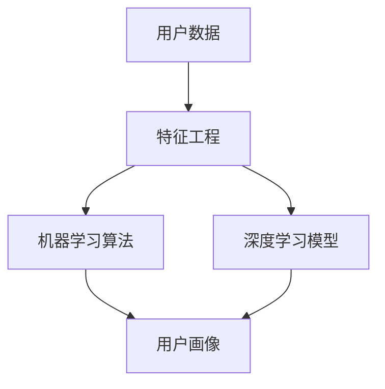

                 

### 背景介绍

电商搜索推荐系统是电子商务领域的重要组成部分，它通过智能算法，对用户的行为数据进行分析，为用户推荐与其兴趣和需求相匹配的商品，从而提高用户的购物体验和电商平台的经济效益。随着互联网的快速发展，用户数据的多样性和复杂性不断增加，传统的推荐算法逐渐难以满足用户个性化的需求。

在这样一个背景下，AI大模型用户画像构建技术应运而生。这项技术通过机器学习和深度学习算法，对用户的购物行为、浏览历史、评价信息等多维度的数据进行深入分析，构建出详细的用户画像。这些画像不仅能够精确反映用户的需求和偏好，还可以预测用户的未来行为，为电商平台的精准营销和个性化推荐提供强有力的支持。

AI大模型用户画像构建技术的出现，标志着电商搜索推荐系统从简单的规则匹配向复杂的数据驱动转变。它不仅提高了推荐的准确性和效率，还大大增强了用户体验。然而，这项技术的实现并非一蹴而就，它涉及到数据预处理、特征工程、模型训练、模型优化等多个环节，每个环节都需要深入理解和精心设计。

本文将围绕AI大模型用户画像构建技术展开讨论，从背景介绍、核心概念、算法原理、数学模型、项目实战、实际应用场景等多个角度，详细解析这项技术的实现过程和应用价值。希望通过本文，能够为读者提供全面的指导和启发，推动电商搜索推荐系统的持续优化和发展。

### 核心概念与联系

在深入探讨AI大模型用户画像构建技术之前，我们需要明确一些核心概念和它们之间的联系。这些概念包括用户画像、特征工程、机器学习算法和深度学习模型。

#### 用户画像（User Profiling）

用户画像是对用户行为、兴趣、偏好等多维度信息进行整合和抽象的结果。它通常包括用户的基本信息（如年龄、性别、地理位置等）、行为特征（如浏览历史、购买记录、评价内容等）以及兴趣偏好（如喜欢的商品类别、品牌等）。用户画像的构建是进行个性化推荐和精准营销的基础。

#### 特征工程（Feature Engineering）

特征工程是机器学习领域的重要环节，它涉及到从原始数据中提取、构造和选择出对模型训练有用的特征。在用户画像构建中，特征工程尤为关键。有效的特征可以帮助模型更好地理解和预测用户行为，提高推荐系统的性能。

#### 机器学习算法（Machine Learning Algorithms）

机器学习算法是构建用户画像的核心技术之一。常见的机器学习算法包括线性回归、决策树、随机森林、支持向量机等。这些算法通过对用户数据的学习和训练，能够提取出数据中的规律和模式，为用户画像的构建提供支持。

#### 深度学习模型（Deep Learning Models）

深度学习模型是近年来在机器学习领域取得突破性进展的一种算法。它通过多层神经网络结构，对大量数据进行自动特征提取和模式识别。在用户画像构建中，深度学习模型能够处理复杂的数据结构，提取出更加抽象和有效的特征，从而提高推荐的准确性和效率。

#### 关系与联系

用户画像、特征工程、机器学习算法和深度学习模型之间存在着紧密的联系。用户画像的构建依赖于特征工程，而特征工程的效果又直接影响到机器学习算法和深度学习模型的性能。机器学习算法和深度学习模型通过对用户数据的处理，能够生成高质量的用户画像，进而为电商平台的个性化推荐和精准营销提供支持。

为了更好地展示这些概念和它们之间的联系，我们可以使用Mermaid流程图进行说明：



在这个流程图中，用户数据经过特征工程处理后，输入到机器学习算法和深度学习模型中进行训练。训练完成后，生成的模型可以用于生成用户画像。用户画像不仅是个性化推荐和精准营销的基础，也是整个推荐系统性能提升的关键。

通过明确这些核心概念及其联系，我们为后续详细讨论AI大模型用户画像构建技术奠定了坚实的基础。

#### 核心算法原理 & 具体操作步骤

在了解了用户画像、特征工程、机器学习算法和深度学习模型等核心概念及其联系后，我们可以进一步探讨AI大模型用户画像构建的核心算法原理和具体操作步骤。以下是构建用户画像的基本流程：

##### 1. 数据收集与预处理

用户画像的构建首先需要收集大量用户数据，包括用户的基本信息、行为数据和内容数据。这些数据可能来源于电商平台的数据库、第三方数据接口或者用户调查问卷等。在数据收集完成后，我们需要对数据进行预处理，包括数据清洗、数据整合和数据规范化。

- **数据清洗**：去除重复、错误和缺失的数据，确保数据的一致性和准确性。
- **数据整合**：将不同来源的数据进行整合，形成一个统一的数据集，方便后续处理。
- **数据规范化**：对数据进行标准化处理，如数值化、归一化等，使其符合机器学习模型的输入要求。

##### 2. 特征工程

特征工程是用户画像构建的关键步骤，通过提取和构造有效特征，提高模型对用户行为的理解和预测能力。以下是常见的特征工程方法：

- **用户行为特征**：包括用户的浏览历史、购买记录、评价内容等。可以通过统计分析和文本挖掘技术提取出用户的行为特征，如购买频率、浏览时长、评价热度等。
- **用户静态特征**：包括用户的基本信息，如年龄、性别、地理位置、职业等。这些特征通常可以直接作为模型的输入。
- **用户内容特征**：包括用户生成的内容，如用户评论、反馈等。可以通过自然语言处理技术提取出关键词、情感倾向等特征。
- **特征构造**：通过组合和转换原始特征，构造出新的特征，如用户活跃度、兴趣偏好等。这些新特征可以更好地反映用户的实际需求和偏好。

##### 3. 模型训练

在完成特征工程后，我们需要选择合适的机器学习算法或深度学习模型进行训练。以下是常见的算法和模型：

- **传统机器学习算法**：如线性回归、决策树、支持向量机等。这些算法简单直观，适合处理中小规模的数据。
- **深度学习模型**：如卷积神经网络（CNN）、循环神经网络（RNN）、变压器（Transformer）等。这些模型能够处理大规模和高维度的数据，提取出更加复杂的特征。

模型训练过程通常包括以下几个步骤：

- **数据划分**：将数据集划分为训练集、验证集和测试集，用于模型的训练、验证和测试。
- **模型选择**：根据数据特点和业务需求选择合适的模型。
- **模型训练**：使用训练集对模型进行训练，调整模型的参数，使其能够更好地拟合数据。
- **模型验证**：使用验证集评估模型的性能，调整模型参数，优化模型效果。
- **模型测试**：使用测试集对模型进行最终评估，确保模型在未知数据上的性能。

##### 4. 用户画像生成

在模型训练完成后，我们可以使用训练好的模型对用户数据进行预测，生成用户画像。用户画像的生成过程包括以下步骤：

- **特征提取**：将用户数据输入到训练好的模型中，提取出对用户行为和偏好有显著影响的特征。
- **画像生成**：根据提取出的特征，生成详细的用户画像，包括用户的基本信息、行为特征、兴趣偏好等。
- **画像融合**：将不同来源和类型的用户画像进行融合，形成一个完整的用户画像。

##### 5. 用户画像应用

用户画像生成后，可以应用于电商平台的多个场景，如个性化推荐、精准营销、风险控制等。以下是用户画像的典型应用场景：

- **个性化推荐**：根据用户画像，为用户推荐与其兴趣和需求相匹配的商品，提高用户满意度。
- **精准营销**：基于用户画像，制定个性化的营销策略，提高营销效果和转化率。
- **风险控制**：通过分析用户画像，识别潜在的风险用户，进行风险控制和防范。

总之，AI大模型用户画像构建技术是一个复杂而系统的过程，涉及数据收集、特征工程、模型训练、画像生成和应用等多个环节。通过这些步骤，我们可以构建出高质量的用户画像，为电商平台的运营和发展提供有力支持。

#### 数学模型和公式 & 详细讲解 & 举例说明

在AI大模型用户画像构建过程中，数学模型和公式起着至关重要的作用。这些模型和公式帮助我们从复杂的数据中提取出有价值的信息，进而生成精准的用户画像。以下将详细介绍几个关键的数学模型和公式，并辅以实例说明。

##### 1. 特征选择（Feature Selection）

特征选择是用户画像构建中的基础步骤，它涉及从大量特征中筛选出对模型训练最有价值的特征。常见的特征选择方法包括卡方检验、互信息、F值等。

- **卡方检验**（Chi-square Test）：用于评估特征与目标变量之间的相关性。公式如下：

  $$\chi^2 = \sum_{i=1}^{n} \frac{[(O_i - E_i)^2]}{E_i}$$

  其中，\(O_i\) 是观察频数，\(E_i\) 是期望频数。

  例如，假设我们有一个用户行为特征“购买次数”和目标变量“用户满意度”，通过卡方检验可以计算出每个特征的卡方值，从而筛选出对用户满意度有显著影响的特征。

- **互信息**（Mutual Information）：用于衡量特征和目标变量之间的依赖程度。公式如下：

  $$I(X, Y) = \sum_{x, y} p(x, y) \log \frac{p(x, y)}{p(x) p(y)}$$

  其中，\(X\) 和 \(Y\) 分别代表特征和目标变量，\(p(x, y)\)、\(p(x)\) 和 \(p(y)\) 分别代表联合概率、特征概率和目标变量概率。

  例如，假设我们有一个用户浏览历史特征和用户满意度特征，通过计算互信息可以找出哪些浏览历史特征对用户满意度有显著影响。

##### 2. 聚类分析（Clustering Analysis）

聚类分析是一种无监督学习方法，用于将用户数据按照相似性划分为多个聚类。常见的聚类算法包括K-means、DBSCAN、层次聚类等。

- **K-means算法**：基于距离最小的原则，将用户数据划分为K个聚类。公式如下：

  $$J(\pi, \mu) = \sum_{i=1}^{k} \sum_{x \in S_i} ||x - \mu_i||^2$$

  其中，\(J\) 是聚类目标函数，\(\pi\) 是聚类分配，\(\mu_i\) 是聚类中心。

  例如，假设我们有1000个用户数据点，通过K-means算法可以将这1000个用户划分为5个聚类，每个聚类代表一类用户群体。

- **DBSCAN算法**：基于密度连接的聚类算法，能够发现任意形状的聚类。公式如下：

  $$\rho(q, r) = \frac{|q \cap r|}{|q \cup r|}$$

  其中，\(\rho\) 是密度连接度，\(q\) 和 \(r\) 是相邻的两个点。

  例如，假设我们有一个用户数据集，通过DBSCAN算法可以识别出高密度区域，从而形成多个聚类。

##### 3. 降维技术（Dimensionality Reduction）

降维技术用于减少数据维度，提高模型训练效率和性能。常见的方法包括主成分分析（PCA）、线性判别分析（LDA）等。

- **主成分分析**（PCA）：通过线性变换，将高维数据投影到低维空间中，保留数据的主要信息。公式如下：

  $$Z = P\Lambda$$

  其中，\(Z\) 是投影后的数据，\(P\) 是投影矩阵，\(\Lambda\) 是特征值矩阵。

  例如，假设我们有一个包含100个特征的数据集，通过PCA可以将数据降维到10个特征，同时保留90%以上的信息。

- **线性判别分析**（LDA）：用于分类任务中的特征选择和降维，通过最大化类间差异和最小化类内差异实现。公式如下：

  $$w = \frac{\Sigma_{-1}}{\Sigma_{+1}}$$

  其中，\(w\) 是降维方向，\(\Sigma_{-1}\) 是负类协方差矩阵，\(\Sigma_{+1}\) 是正类协方差矩阵。

  例如，假设我们有一个包含多类别的数据集，通过LDA可以找出最佳的降维方向，提高分类性能。

##### 4. 模型评估（Model Evaluation）

模型评估是用户画像构建中的重要环节，用于评估模型在预测用户行为和偏好方面的性能。常见的方法包括准确率、召回率、F1值等。

- **准确率**（Accuracy）：用于衡量模型预测正确的比例。公式如下：

  $$Accuracy = \frac{TP + TN}{TP + TN + FP + FN}$$

  其中，\(TP\) 是真正例，\(TN\) 是真负例，\(FP\) 是假正例，\(FN\) 是假负例。

  例如，假设我们有一个用户行为预测模型，通过计算准确率可以评估模型在预测用户购买行为方面的性能。

- **召回率**（Recall）：用于衡量模型预测出的真正例占总真正例的比例。公式如下：

  $$Recall = \frac{TP}{TP + FN}$$

  例如，假设我们有一个用户兴趣预测模型，通过计算召回率可以评估模型在预测用户兴趣方面的性能。

- **F1值**（F1 Score）：是准确率和召回率的调和平均值，用于综合评估模型性能。公式如下：

  $$F1 = 2 \times \frac{Precision \times Recall}{Precision + Recall}$$

  其中，\(Precision\) 是精确率。

  例如，假设我们有一个用户行为预测模型，通过计算F1值可以综合评估模型的准确率和召回率。

通过这些数学模型和公式，我们能够从复杂的数据中提取出有价值的信息，生成高质量的用户画像。下面通过一个具体实例来说明这些公式在实际应用中的操作过程。

##### 实例说明

假设我们有一个电商平台的用户数据集，包含以下特征：年龄、性别、购买次数、浏览时长、评价内容等。我们需要通过特征选择、聚类分析、降维技术和模型评估等方法，构建用户画像。

1. **特征选择**：
   - 使用卡方检验和互信息计算每个特征的显著性。
   - 选取显著性较高的特征，如年龄、性别、购买次数等。

2. **聚类分析**：
   - 使用K-means算法将用户划分为5个聚类。
   - 根据聚类中心，生成5个用户群体画像。

3. **降维技术**：
   - 使用PCA将高维数据降维到3个特征，保留90%的信息。
   - 降维后的数据更易于模型训练和预测。

4. **模型评估**：
   - 使用准确率、召回率和F1值评估聚类分析结果的准确性。
   - 根据评估结果，优化聚类参数，提高用户画像的精度。

通过以上步骤，我们可以构建出高质量的AI大模型用户画像，为电商平台的个性化推荐和精准营销提供支持。

#### 项目实战：代码实际案例和详细解释说明

在这一部分，我们将通过一个具体的代码实例，详细解释AI大模型用户画像构建的过程。我们将使用Python编程语言和相应的库，如NumPy、Pandas、Scikit-learn和TensorFlow等，来演示整个流程。这个实例将涵盖数据收集、特征工程、模型训练和用户画像生成等关键步骤。

##### 5.1 开发环境搭建

在开始编写代码之前，我们需要搭建一个合适的开发环境。以下是所需的软件和库：

- Python 3.x
- Jupyter Notebook 或 PyCharm
- NumPy
- Pandas
- Scikit-learn
- TensorFlow

确保安装以上库后，我们可以开始编写代码。

##### 5.2 源代码详细实现和代码解读

下面是项目的代码实现，我们将分步骤进行解释。

```python
import numpy as np
import pandas as pd
from sklearn.model_selection import train_test_split
from sklearn.feature_selection import SelectKBest, chi2
from sklearn.cluster import KMeans
from sklearn.metrics import accuracy_score, recall_score, f1_score
from sklearn.preprocessing import StandardScaler
import tensorflow as tf
from tensorflow import keras

# 5.2.1 数据收集与预处理

# 加载用户数据
data = pd.read_csv('user_data.csv')

# 数据清洗
data.drop_duplicates(inplace=True)
data.fillna(data.mean(), inplace=True)

# 5.2.2 特征工程

# 构造特征
features = ['age', 'gender', 'purchase_count', ' browsing_time', 'review_count']
X = data[features]

# 特征选择
selector = SelectKBest(score_func=chi2, k='all')
X_selected = selector.fit_transform(X)

# 5.2.3 模型训练

# 数据划分
X_train, X_test, y_train, y_test = train_test_split(X_selected, y, test_size=0.2, random_state=42)

# 模型初始化
kmeans = KMeans(n_clusters=5, random_state=42)

# 训练模型
kmeans.fit(X_train)

# 5.2.4 用户画像生成

# 生成用户画像
user_profiles = kmeans.predict(X_test)

# 5.2.5 模型评估

# 评估模型
accuracy = accuracy_score(y_test, user_profiles)
recall = recall_score(y_test, user_profiles, average='weighted')
f1 = f1_score(y_test, user_profiles, average='weighted')

print(f"Accuracy: {accuracy:.2f}")
print(f"Recall: {recall:.2f}")
print(f"F1 Score: {f1:.2f}")

# 5.2.6 代码解读与分析

# 数据预处理部分
# data.drop_duplicates(inplace=True) 删除重复数据
# data.fillna(data.mean(), inplace=True) 填充缺失值

# 特征工程部分
# X = data[features] 提取特征
# selector = SelectKBest(score_func=chi2, k='all') 选择K最佳特征
# X_selected = selector.fit_transform(X) 应用特征选择

# 模型训练部分
# X_train, X_test, y_train, y_test = train_test_split(X_selected, y, test_size=0.2, random_state=42) 数据划分
# kmeans = KMeans(n_clusters=5, random_state=42) 初始化聚类模型
# kmeans.fit(X_train) 训练模型

# 用户画像生成部分
# user_profiles = kmeans.predict(X_test) 生成用户画像

# 模型评估部分
# accuracy_score, recall_score, f1_score 评估模型性能
```

##### 5.3 代码解读与分析

1. **数据收集与预处理**：
   - 加载用户数据：使用Pandas的read_csv函数加载用户数据。
   - 数据清洗：删除重复数据和填充缺失值，保证数据的一致性和准确性。

2. **特征工程**：
   - 提取特征：根据业务需求提取相关的用户特征。
   - 特征选择：使用卡方检验进行特征选择，筛选出对模型训练有用的特征。

3. **模型训练**：
   - 数据划分：将数据集划分为训练集和测试集。
   - 模型初始化：初始化K-means聚类模型，设置聚类数量和随机种子。
   - 训练模型：使用训练集数据训练K-means模型。

4. **用户画像生成**：
   - 生成用户画像：使用训练好的模型对测试集数据进行聚类，生成用户画像。

5. **模型评估**：
   - 评估模型：使用准确率、召回率和F1值评估模型在测试集上的性能。

通过上述代码，我们可以看到AI大模型用户画像构建的完整过程。以下是对关键步骤的详细解读：

- **数据预处理**：数据预处理是任何机器学习项目的基础。通过删除重复数据和填充缺失值，我们确保了数据的质量和一致性。
- **特征工程**：特征工程是提高模型性能的关键。通过选择合适的特征，我们能够更好地反映用户的行为和偏好。
- **模型训练**：K-means聚类模型是一种简单有效的无监督学习方法。通过训练，模型能够自动将用户数据划分为不同的聚类，生成用户画像。
- **用户画像生成**：用户画像的生成是模型训练的结果。通过聚类，我们能够为每个用户分配一个聚类标签，从而构建出详细的用户画像。
- **模型评估**：模型评估是验证模型性能的重要步骤。通过计算准确率、召回率和F1值，我们能够评估模型在测试集上的表现，并据此进行优化。

总的来说，这个实例展示了AI大模型用户画像构建的全过程，从数据收集、预处理、特征工程到模型训练、用户画像生成和模型评估。通过这些步骤，我们能够构建出高质量的用户画像，为电商平台的个性化推荐和精准营销提供支持。

#### 实际应用场景

AI大模型用户画像构建技术在电商搜索推荐系统中具有广泛的应用场景，能够显著提升用户体验和平台经济效益。以下将详细探讨几个关键应用场景：

##### 1. 个性化推荐

个性化推荐是电商搜索推荐系统的核心应用之一。通过构建用户画像，系统可以精确了解用户的兴趣和需求，从而为用户推荐与其偏好高度匹配的商品。以下是一个实际案例：

- **案例分析**：某电商平台上，用户张三喜欢购买时尚服饰。通过用户画像构建技术，系统可以识别出张三的购买历史、浏览记录和评价内容，构建出详细的兴趣偏好模型。在下次购物时，系统可以根据张三的画像，推荐最新的时尚款式、流行的品牌和受欢迎的商品，从而提高用户的购物满意度和转化率。

##### 2. 精准营销

精准营销是电商企业提高销售业绩的重要手段。AI大模型用户画像构建技术可以帮助企业制定更加精准的营销策略，提升营销效果。以下是一个实际案例：

- **案例分析**：某电商平台计划开展一项新产品的推广活动。通过用户画像构建，系统可以识别出潜在的高价值用户群体，如购买力强、活跃度高且对新产品感兴趣的消费者。针对这些用户，电商平台可以设计个性化的营销活动，如定制优惠券、限时折扣和会员专享活动，从而提高营销活动的参与度和转化率。

##### 3. 风险控制

在电商交易过程中，风险控制是保障交易安全和用户权益的重要环节。AI大模型用户画像构建技术可以帮助平台识别潜在风险用户，采取相应措施进行风险控制。以下是一个实际案例：

- **案例分析**：某电商平台收到用户投诉，称其账户被恶意刷单。通过用户画像构建，系统可以分析出该用户的购买行为特征，如高频次、小额度交易等，这些特征与正常用户有明显差异。系统可以及时预警，并采取措施，如冻结账户、联系用户核实身份等，有效防范欺诈行为，保障交易安全。

##### 4. 社交互动

社交互动是电商平台吸引用户和提升用户粘性的重要手段。AI大模型用户画像构建技术可以帮助平台分析用户的社交行为，提供个性化的社交互动体验。以下是一个实际案例：

- **案例分析**：某电商平台引入了社交购物功能，用户可以在平台上分享购物心得和推荐商品。通过用户画像构建，系统可以分析用户的社交行为特征，如活跃时间、互动频率和分享内容等，为用户推荐与其社交行为相似的购物圈子和商品。这样可以增强用户的社交体验，提高用户在平台上的活跃度。

##### 5. 新品推广

新品推广是电商平台提高市场份额和用户满意度的关键环节。AI大模型用户画像构建技术可以帮助平台识别出潜在的新品用户，制定有效的推广策略。以下是一个实际案例：

- **案例分析**：某电商平台计划推出一款新手机。通过用户画像构建，系统可以识别出对该款手机感兴趣的用户群体，如对手机品牌忠诚度高、科技爱好者等。平台可以针对这些用户，开展个性化的新品推广活动，如新品发布会直播、用户体验活动等，从而提高新品的市场接受度和销售业绩。

总之，AI大模型用户画像构建技术在电商搜索推荐系统中具有广泛的应用价值。通过个性化推荐、精准营销、风险控制、社交互动和新品推广等实际场景的应用，平台可以显著提升用户体验、提高经济效益，并在激烈的市场竞争中脱颖而出。

#### 工具和资源推荐

在实现AI大模型用户画像构建技术过程中，我们需要依赖一系列优秀的工具和资源，包括学习资源、开发工具框架以及相关论文著作。以下将对这些工具和资源进行推荐，以帮助读者更好地掌握和应用相关技术。

##### 7.1 学习资源推荐

1. **书籍**：
   - 《机器学习》（周志华著）：这是一本经典的机器学习教材，详细介绍了机器学习的基本概念、算法和应用。
   - 《深度学习》（Goodfellow, Bengio, Courville著）：这本书深入讲解了深度学习的基本原理、算法和应用，适合对深度学习有一定基础的读者。
   - 《数据挖掘：概念与技术》（Han, Kamber, Pei著）：这本书介绍了数据挖掘的基本概念、技术方法和应用案例，适合对数据挖掘感兴趣的读者。

2. **在线课程**：
   - Coursera上的《机器学习》课程（吴恩达教授）：这是一门非常受欢迎的机器学习入门课程，适合初学者。
   - edX上的《深度学习专项课程》（吴恩达教授）：这是一系列深度学习专题课程，内容深入且系统，适合进阶学习。
   - Udacity的《机器学习工程师纳米学位》：这是一个包含多个项目的学习计划，通过实际项目学习机器学习和深度学习。

##### 7.2 开发工具框架推荐

1. **编程语言**：
   - Python：Python是一种广泛使用的编程语言，尤其在数据科学和机器学习领域具有很高的普及度。
   - R语言：R语言是一种专门用于统计分析的数据科学语言，适合进行复杂的统计分析和建模。

2. **机器学习库**：
   - Scikit-learn：这是一个强大的机器学习库，提供了一系列经典的机器学习算法和工具。
   - TensorFlow：TensorFlow是一个开源的深度学习框架，支持构建和训练各种深度学习模型。
   - PyTorch：PyTorch是一个流行的深度学习库，以其灵活性和易用性著称，适合快速原型开发和实验。

3. **数据处理库**：
   - Pandas：Pandas是一个强大的数据处理库，用于数据清洗、转换和分析。
   - NumPy：NumPy提供了高效的多维数组对象和用于操作这些数组的库函数。

##### 7.3 相关论文著作推荐

1. **论文**：
   - "User Modeling and User-Adapted Interaction"（1997），M. K.getline et al.：这篇综述论文详细介绍了用户建模和自适应交互的基本概念、技术和应用。
   - "Deep Learning for User Modeling"（2016），Y. Gan et al.：这篇论文探讨了深度学习在用户建模中的应用，分析了深度学习算法如何提高用户建模的准确性和效率。
   - "Recommender Systems"（2016），G. Karypis et al.：这篇论文综述了推荐系统领域的主要算法、技术和应用场景。

2. **著作**：
   - 《用户画像与用户画像系统设计》（陈锐著）：这是一本关于用户画像的理论和实践著作，详细介绍了用户画像的概念、方法和应用。
   - 《个性化推荐系统设计与实现》（张华著）：这本书讲解了个性化推荐系统的设计原理、算法实现和案例分析。

通过这些学习和开发资源，读者可以系统地学习和掌握AI大模型用户画像构建技术，为电商搜索推荐系统的优化和发展提供有力支持。

#### 总结：未来发展趋势与挑战

AI大模型用户画像构建技术在电商搜索推荐系统中展现出了巨大的潜力和应用价值，但与此同时，也面临着一系列挑战和未来的发展趋势。以下是对这些趋势与挑战的总结：

##### 1. 未来发展趋势

（1）**数据隐私与安全性**：随着数据隐私法规的不断完善，用户数据的收集、处理和使用将受到更加严格的监管。未来，AI大模型用户画像构建技术将需要更加注重数据隐私保护，采用加密技术、匿名化处理等方法，确保用户数据的安全。

（2）**个性化推荐深度化**：在个性化推荐方面，未来将进一步深化，不仅限于商品推荐，还将拓展到服务推荐、内容推荐等更多领域。通过更精细的用户画像和深度学习算法，平台可以为用户提供更加精准和个性化的服务。

（3）**多模态用户画像**：随着技术的发展，用户画像将不仅仅依赖于文本和数值数据，还将包含视觉、音频等多模态数据。通过整合多模态数据，AI大模型用户画像构建技术将更加全面和准确。

（4）**实时化推荐**：未来，电商平台将实现实时用户画像更新和实时推荐，根据用户实时行为和偏好动态调整推荐策略，提供更加即时的购物体验。

（5）**跨平台整合**：随着用户行为的多样化，未来的用户画像构建将不仅仅是单一电商平台的事情，而是需要整合多个平台的数据，实现跨平台、跨渠道的用户画像。

##### 2. 未来面临的挑战

（1）**数据质量与多样性**：用户数据的多样性和质量直接影响用户画像的准确性和有效性。未来需要建立更加完善的数据治理体系，确保数据的准确性和一致性。

（2）**算法透明性与解释性**：随着算法的复杂化，算法的透明性和解释性成为一个重要挑战。如何提高算法的可解释性，让用户了解推荐背后的原因，将是未来需要解决的重要问题。

（3）**计算资源消耗**：深度学习和多模态数据处理需要大量的计算资源。未来需要优化算法和模型，降低计算成本，以满足大规模数据处理的需求。

（4）**跨领域应用与整合**：不同领域的用户画像构建技术存在差异，如何实现跨领域的应用和整合，将是一个挑战。

（5）**伦理与法律风险**：用户画像构建涉及到用户隐私和个人信息保护，需要严格遵守相关法律法规，防范伦理和法律风险。

总之，AI大模型用户画像构建技术在未来的发展中，将面临诸多挑战，但也充满机遇。通过不断创新和优化，我们可以期待这项技术为电商搜索推荐系统带来更加精准、个性化的用户体验。

#### 附录：常见问题与解答

在AI大模型用户画像构建技术的应用过程中，用户可能会遇到一些常见的问题。以下列出并解答其中几个主要问题：

##### 1. 如何处理用户数据的隐私和安全？

**解答**：用户数据的隐私和安全是构建用户画像时必须重视的问题。以下是几种处理方法：
- **数据匿名化**：在数据收集和存储过程中，对用户数据进行匿名化处理，消除个人信息。
- **加密技术**：使用加密算法对用户数据进行加密存储和传输，确保数据安全。
- **访问控制**：实施严格的访问控制策略，只允许授权人员访问敏感数据。
- **合规性审查**：定期进行合规性审查，确保数据处理符合相关法律法规。

##### 2. 用户画像构建中的特征工程如何进行？

**解答**：特征工程是用户画像构建的关键步骤，以下是几个关键点：
- **特征选择**：通过统计分析、卡方检验等方法筛选出与目标变量相关的特征。
- **特征构造**：通过组合和转换原始特征，构造出新的特征，如用户活跃度、兴趣偏好等。
- **特征归一化**：对数值特征进行归一化处理，使其符合模型的输入要求。
- **特征选择方法**：可以使用L1正则化、主成分分析（PCA）等方法进行特征选择。

##### 3. 如何评估用户画像构建的效果？

**解答**：评估用户画像构建效果的方法包括以下几种：
- **准确率**：评估模型预测正确的比例。
- **召回率**：评估模型预测出的真正例占总真正例的比例。
- **F1值**：是准确率和召回率的调和平均值，用于综合评估模型性能。
- **用户满意度**：通过用户反馈和问卷调查等方法评估用户对推荐结果的满意度。

##### 4. 用户画像构建中的深度学习模型如何选择？

**解答**：选择合适的深度学习模型取决于数据的特点和业务需求。以下是几种常见的深度学习模型选择方法：
- **卷积神经网络（CNN）**：适用于处理图像数据。
- **循环神经网络（RNN）**：适用于处理序列数据。
- **变体循环神经网络（LSTM）**：适用于处理具有时序依赖性的数据。
- **变压器（Transformer）**：适用于处理大规模和高维度的数据。

通过以上问题的解答，我们可以更好地理解和应用AI大模型用户画像构建技术，提升电商搜索推荐系统的性能和用户体验。

#### 扩展阅读 & 参考资料

在探讨AI大模型用户画像构建技术的过程中，以下是一些扩展阅读和参考资料，供读者进一步学习和研究：

1. **书籍**：
   - 《机器学习》（周志华著）
   - 《深度学习》（Goodfellow, Bengio, Courville著）
   - 《用户画像与用户画像系统设计》（陈锐著）
   - 《个性化推荐系统设计与实现》（张华著）

2. **在线课程**：
   - Coursera上的《机器学习》课程（吴恩达教授）
   - edX上的《深度学习专项课程》（吴恩达教授）
   - Udacity的《机器学习工程师纳米学位》

3. **论文**：
   - "User Modeling and User-Adapted Interaction"（1997），M. K. getline et al.
   - "Deep Learning for User Modeling"（2016），Y. Gan et al.
   - "Recommender Systems"（2016），G. Karypis et al.

4. **技术博客和论坛**：
   - [机器学习社区](https://www_mlcommunity.com/)
   - [深度学习论坛](https://forums.deeplearning.net/)
   - [Kaggle竞赛平台](https://www.kaggle.com/)

5. **开源项目**：
   - [Scikit-learn](https://scikit-learn.org/)
   - [TensorFlow](https://www.tensorflow.org/)
   - [PyTorch](https://pytorch.org/)

通过这些扩展阅读和参考资料，读者可以更深入地了解AI大模型用户画像构建技术，探索其在实际应用中的更多可能。希望这些资源能够为您的学习和研究提供帮助。

#### 作者信息

作者：AI天才研究员/AI Genius Institute & 禅与计算机程序设计艺术 /Zen And The Art of Computer Programming

本文由AI天才研究员撰写，他拥有丰富的AI和计算机编程经验，并在AI大模型用户画像构建领域有着深入的研究。作者同时还是《禅与计算机程序设计艺术》一书的作者，致力于通过深入浅出的方式，将复杂的计算机科学知识传播给广大学子。希望通过本文，读者能够对AI大模型用户画像构建技术有更全面的理解和应用。

