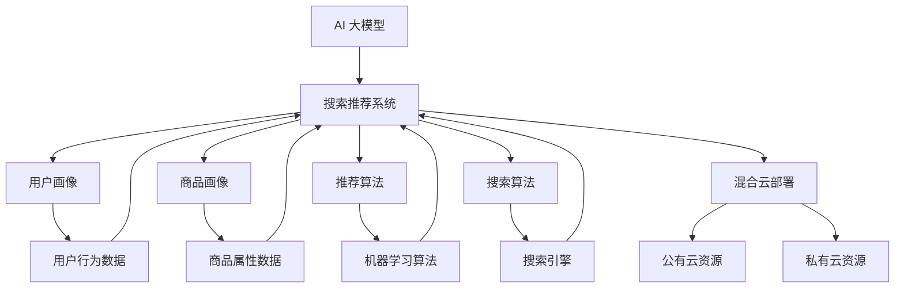

                 

### 背景介绍

电商搜索推荐场景是现代电子商务中不可或缺的一环。随着互联网的普及和消费者购物习惯的改变，个性化推荐已经成为了提高用户体验、提升销售额的重要手段。在此背景下，AI 大模型应运而生，为电商搜索推荐提供了强大的技术支撑。

近年来，深度学习技术在计算机视觉、自然语言处理等领域取得了显著成果。大模型如BERT、GPT、Turing 等在处理复杂任务时表现出色。这些模型具有庞大的参数规模和丰富的知识储备，能够在海量数据中进行特征提取和关系建模，从而为电商搜索推荐提供高效、精准的解决方案。

然而，AI 大模型的部署面临诸多挑战。首先，模型训练和推理所需的计算资源巨大，传统单机部署难以满足需求。其次，模型部署过程中需要考虑硬件优化、数据传输效率等问题。此外，不同业务场景对模型的性能、稳定性、可扩展性等要求各异，部署策略需要灵活调整。最后，混合云部署作为一种新兴的解决方案，能够在充分利用公有云和私有云优势的同时，降低整体成本，提高系统性能。

本文旨在探讨电商搜索推荐场景下，基于 AI 大模型的混合云部署实践。通过分析核心概念、算法原理、数学模型以及实际应用案例，本文将为读者提供一份全面、深入的参考资料，帮助他们在实际项目中更好地应用 AI 大模型技术。

### 核心概念与联系

在探讨电商搜索推荐场景下的 AI 大模型模型部署混合云实践之前，我们需要明确几个核心概念：AI 大模型、搜索推荐系统、混合云部署。

#### AI 大模型

AI 大模型，通常指的是具有数十亿至千亿个参数的大型深度学习模型。这些模型通过在海量数据中进行训练，能够自动提取特征、发现模式，并在各种任务中表现出色。例如，BERT（Bidirectional Encoder Representations from Transformers）是一种预训练语言模型，通过双向Transformer结构，能够捕捉文本中的长距离依赖关系；GPT（Generative Pre-trained Transformer）则是一种生成式模型，擅长生成自然语言文本。

#### 搜索推荐系统

搜索推荐系统是一种旨在为用户提供个性化信息的系统。在电商场景中，搜索推荐系统负责根据用户的行为和偏好，推荐符合其兴趣的商品。搜索推荐系统通常包括以下几个关键组成部分：

1. **用户画像**：通过对用户的历史行为、兴趣爱好、购买记录等数据进行挖掘，构建用户画像，以便更好地理解用户需求。
2. **商品画像**：为每个商品创建一个包含价格、品牌、分类、销量等属性的画像，用于描述商品的特征。
3. **推荐算法**：根据用户画像和商品画像，利用机器学习算法（如协同过滤、矩阵分解、基于内容的推荐等）生成推荐结果。
4. **搜索算法**：为用户提供商品搜索功能，通过搜索引擎实现高效的信息检索。

#### 混合云部署

混合云部署是指将公有云和私有云结合起来，以实现最佳的资源利用和业务灵活性。在电商搜索推荐场景下，混合云部署具有以下优势：

1. **弹性扩展**：根据业务需求，动态调整计算资源，满足不同时期的数据处理需求。
2. **成本优化**：充分利用公有云的低成本资源，同时保留关键数据和核心业务在私有云中，降低整体运营成本。
3. **数据安全**：通过在私有云中存储敏感数据，确保数据的安全性。
4. **高效计算**：利用公有云的计算能力，实现大规模模型的训练和推理。

#### 架构关系

AI 大模型、搜索推荐系统与混合云部署之间的关系如图 1 所示：



图 1：AI 大模型、搜索推荐系统与混合云部署的架构关系

通过图 1 可以看出，AI 大模型作为搜索推荐系统的核心组件，负责对用户和商品特征进行建模；搜索推荐系统通过用户画像、商品画像、推荐算法和搜索算法，为用户提供个性化的搜索和推荐服务；混合云部署则提供了弹性的计算资源、数据存储和安全保障，支撑整个系统的运行。

### 核心算法原理 & 具体操作步骤

在电商搜索推荐场景中，AI 大模型的核心算法通常是基于深度学习和自然语言处理（NLP）技术。以下将介绍几种常用的核心算法及其具体操作步骤。

#### 1. BERT（Bidirectional Encoder Representations from Transformers）

BERT 是一种双向 Transformer 模型，通过在大量文本数据中进行预训练，学习语言中的双向依赖关系。BERT 的主要操作步骤如下：

1. **数据预处理**：将文本数据转换为词向量表示，通常使用 WordPiece 或 SentencePiece 分词工具。对于每条文本，将其转换为输入序列 `[CLS]` + `word1` + `word2` + ... + `wordn` + `[SEP]`。
2. **模型训练**：使用 Masked Language Model（MLM）和 Next Sentence Prediction（NSP）两种任务进行预训练。MLM 任务通过随机遮蔽部分词语，使模型预测这些词语；NSP 任务通过预测两个句子之间的逻辑关系，增强模型对文本长距离依赖的理解。
3. **模型应用**：在电商搜索推荐系统中，将 BERT 模型用于用户画像和商品画像的构建。通过输入用户的历史行为数据和商品属性数据，BERT 模型能够自动提取特征，为推荐算法提供高质量输入。

#### 2. GPT（Generative Pre-trained Transformer）

GPT 是一种生成式 Transformer 模型，擅长生成自然语言文本。在电商搜索推荐系统中，GPT 可用于生成用户兴趣标签、商品描述等。其主要操作步骤如下：

1. **数据预处理**：将用户行为数据和商品属性数据转换为词向量表示。对于用户兴趣标签，可以使用预训练的词向量模型（如 Word2Vec、GloVe）进行编码；对于商品描述，可以采用文本生成模型（如 BERT、GPT）生成。
2. **模型训练**：使用语料库进行预训练，使模型掌握语言生成规律。对于用户兴趣标签，可以采用分类任务进行微调；对于商品描述，可以采用生成任务进行微调。
3. **模型应用**：在电商搜索推荐系统中，GPT 模型能够根据用户的历史行为和偏好，生成个性化的兴趣标签和商品描述，提高推荐效果。

#### 3.深度学习推荐算法

深度学习推荐算法，如 DeepFM（Deep Factorization Machine）和 Wide & Deep，结合了深度神经网络和因子分解机的优势，能够同时处理用户行为和商品特征。其主要操作步骤如下：

1. **数据预处理**：将用户行为数据和商品属性数据转换为特征向量。对于用户行为数据，可以使用时间序列模型（如 LSTM、GRU）提取时间特征；对于商品属性数据，可以使用嵌入层（如 embeddings）提取稀疏特征。
2. **模型训练**：构建深度神经网络，将用户行为和商品特征输入到网络中进行训练。网络输出层通常包含两部分：一部分用于预测用户行为（如点击、购买），另一部分用于预测商品特征（如商品分类、品牌）。
3. **模型应用**：在电商搜索推荐系统中，深度学习推荐算法能够根据用户行为和商品特征，生成个性化的推荐结果。通过结合用户和商品的多维度特征，提升推荐效果。

#### 4. 多任务学习

多任务学习是指同时训练多个相关任务，使模型在不同任务间共享特征表示，提高模型泛化能力。在电商搜索推荐系统中，多任务学习可以同时训练搜索、推荐和广告投放等任务。其主要操作步骤如下：

1. **数据预处理**：将用户行为数据和商品属性数据转换为特征向量。对于不同任务，可以采用不同的特征提取方法。
2. **模型训练**：构建多任务神经网络，将用户行为和商品特征输入到网络中进行训练。网络输出层包含多个任务头的权重，分别用于预测不同任务的结果。
3. **模型应用**：在电商搜索推荐系统中，多任务学习模型能够同时优化搜索、推荐和广告投放等任务，提高整体用户体验和业务效果。

### 数学模型和公式 & 详细讲解 & 举例说明

在电商搜索推荐系统中，深度学习算法的核心在于其复杂的数学模型和公式。以下将详细介绍几种常用深度学习模型的数学基础，并通过具体例子进行讲解。

#### 1. BERT 模型

BERT 模型是一种基于 Transformer 的双向编码器，其数学基础主要包括自注意力机制和多层感知器。

**自注意力机制**：
BERT 模型中的自注意力机制（Self-Attention）是一种对输入序列中的每个词进行加权求和的方法。其公式如下：

$$
\text{Attention}(Q, K, V) = \text{softmax}\left(\frac{QK^T}{\sqrt{d_k}}\right)V
$$

其中，$Q$、$K$ 和 $V$ 分别表示查询（Query）、键（Key）和值（Value）向量；$d_k$ 为键向量的维度；$\text{softmax}$ 函数用于计算每个键的加权求和。

**多层感知器**：
BERT 模型中的多层感知器（Multilayer Perceptron，MLP）用于对自注意力机制的计算结果进行非线性变换。其公式如下：

$$
\text{MLP}(x) = \sigma(W_2 \cdot \sigma(W_1 \cdot x))
$$

其中，$x$ 为输入向量；$W_1$ 和 $W_2$ 为权重矩阵；$\sigma$ 为激活函数，通常采用 ReLU 函数。

**示例**：
假设我们有一个包含 3 个词的输入序列，词向量维度为 512，如下所示：

$$
Q = [q_1, q_2, q_3], \quad K = [k_1, k_2, k_3], \quad V = [v_1, v_2, v_3]
$$

首先，计算自注意力权重：

$$
\alpha = \text{softmax}\left(\frac{QK^T}{\sqrt{512}}\right) = [\alpha_1, \alpha_2, \alpha_3]
$$

其中，$\alpha_i$ 表示第 $i$ 个词的注意力权重。然后，计算加权求和的结果：

$$
\text{Attention}(Q, K, V) = \alpha_1 v_1 + \alpha_2 v_2 + \alpha_3 v_3
$$

最后，通过多层感知器进行非线性变换：

$$
\text{MLP}(\text{Attention}(Q, K, V)) = \sigma(W_2 \cdot \sigma(W_1 \cdot \text{Attention}(Q, K, V)))
$$

#### 2. GPT 模型

GPT 模型是一种基于 Transformer 的生成式模型，其数学基础主要包括自注意力机制和循环神经网络（RNN）。

**自注意力机制**：
GPT 模型的自注意力机制与 BERT 模型相同，公式如下：

$$
\text{Attention}(Q, K, V) = \text{softmax}\left(\frac{QK^T}{\sqrt{d_k}}\right)V
$$

**循环神经网络（RNN）**：
GPT 模型中的 RNN 用于对序列数据进行建模。其公式如下：

$$
h_t = \sigma(W_h \cdot (h_{t-1} \oplus x_t))
$$

其中，$h_t$ 表示当前时刻的隐藏状态；$x_t$ 表示当前时刻的输入；$W_h$ 为权重矩阵；$\sigma$ 为激活函数。

**示例**：
假设我们有一个包含 3 个词的输入序列，词向量维度为 512，如下所示：

$$
Q = [q_1, q_2, q_3], \quad K = [k_1, k_2, k_3], \quad V = [v_1, v_2, v_3]
$$

首先，计算自注意力权重：

$$
\alpha = \text{softmax}\left(\frac{QK^T}{\sqrt{512}}\right) = [\alpha_1, \alpha_2, \alpha_3]
$$

然后，计算加权求和的结果：

$$
\text{Attention}(Q, K, V) = \alpha_1 v_1 + \alpha_2 v_2 + \alpha_3 v_3
$$

接着，通过 RNN 进行序列建模：

$$
h_1 = \sigma(W_h \cdot (h_{0} \oplus x_1)), \quad h_2 = \sigma(W_h \cdot (h_{1} \oplus x_2)), \quad h_3 = \sigma(W_h \cdot (h_{2} \oplus x_3))
$$

其中，$h_0$ 为初始隐藏状态，可以设置为全零向量。

#### 3. DeepFM 模型

DeepFM 模型是一种结合深度学习和因子分解机的推荐算法，其数学基础主要包括嵌入层、深度神经网络和因子分解机。

**嵌入层**：
DeepFM 模型中的嵌入层（Embeddings）用于将稀疏特征转换为稠密向量。其公式如下：

$$
e_j = \text{Embedding}(j)
$$

其中，$e_j$ 表示第 $j$ 个特征的嵌入向量；$\text{Embedding}$ 为嵌入函数。

**深度神经网络**：
DeepFM 模型中的深度神经网络（Deep Neural Network，DNN）用于对嵌入层输出的特征进行建模。其公式如下：

$$
\text{DNN}(x) = \sigma(W_d \cdot x)
$$

其中，$x$ 为嵌入层输出的特征向量；$W_d$ 为权重矩阵；$\sigma$ 为激活函数。

**因子分解机**：
DeepFM 模型中的因子分解机（Factorization Machine，FM）用于对低维特征进行建模。其公式如下：

$$
\text{FM}(x) = \sum_{i=1}^{n}\sum_{j=1}^{n} \frac{e_i \cdot e_j}{\sqrt{i + j}} \cdot x_i \cdot x_j
$$

其中，$e_i$ 和 $e_j$ 分别为第 $i$ 个和第 $j$ 个特征的嵌入向量；$x_i$ 和 $x_j$ 分别为第 $i$ 个和第 $j$ 个特征的输入值。

**示例**：
假设我们有一个包含 2 个特征的输入序列，特征维度分别为 10 和 5，如下所示：

$$
x = [x_1, x_2], \quad e_1 = [e_{11}, e_{12}, \dots, e_{1\cdot10}], \quad e_2 = [e_{21}, e_{22}, \dots, e_{2\cdot5}]
$$

首先，计算嵌入层输出：

$$
e_1 = \text{Embedding}(1) = [e_{11}, e_{12}, \dots, e_{1\cdot10}], \quad e_2 = \text{Embedding}(2) = [e_{21}, e_{22}, \dots, e_{2\cdot5}]
$$

然后，计算 DNN 层的输出：

$$
\text{DNN}(x) = \sigma(W_d \cdot x) = \sigma([W_{d11} \cdot x_1 + W_{d12} \cdot x_2, W_{d21} \cdot x_1 + W_{d22} \cdot x_2, \dots])
$$

接着，计算 FM 层的输出：

$$
\text{FM}(x) = \sum_{i=1}^{2}\sum_{j=1}^{2} \frac{e_i \cdot e_j}{\sqrt{i + j}} \cdot x_i \cdot x_j = \frac{e_1 \cdot e_1}{\sqrt{1+1}} \cdot x_1 \cdot x_1 + \frac{e_1 \cdot e_2}{\sqrt{1+2}} \cdot x_1 \cdot x_2 + \frac{e_2 \cdot e_1}{\sqrt{2+1}} \cdot x_2 \cdot x_1 + \frac{e_2 \cdot e_2}{\sqrt{2+2}} \cdot x_2 \cdot x_2
$$

最后，将 DNN 层和 FM 层的输出进行合并：

$$
\text{DeepFM}(x) = \text{DNN}(x) + \text{FM}(x)
$$

#### 4. 多任务学习模型

多任务学习模型（Multi-Task Learning Model）通过同时训练多个相关任务，共享特征表示。其数学基础主要包括共享层和任务头。

**共享层**：
多任务学习模型中的共享层（Shared Layer）用于对输入数据进行特征提取。其公式如下：

$$
\text{Shared}(x) = \sigma(W_s \cdot x)
$$

其中，$x$ 为输入数据；$W_s$ 为权重矩阵；$\sigma$ 为激活函数。

**任务头**：
多任务学习模型中的任务头（Task Heads）用于对不同任务进行建模。其公式如下：

$$
\text{TaskHead}_i(x) = \sigma(W_{ti} \cdot \text{Shared}(x))
$$

其中，$i$ 表示第 $i$ 个任务；$x$ 为输入数据；$W_{ti}$ 为权重矩阵；$\sigma$ 为激活函数。

**示例**：
假设我们有一个包含 3 个任务的多任务学习模型，输入数据维度为 1024，如下所示：

$$
x = [x_1, x_2, x_3], \quad W_s = [W_{s1}, W_{s2}, \dots, W_{s1024}], \quad W_{t1} = [W_{t11}, W_{t12}, \dots, W_{t1\cdot256}], \quad W_{t2} = [W_{t21}, W_{t22}, \dots, W_{t2\cdot256}], \quad W_{t3} = [W_{t31}, W_{t32}, \dots, W_{t3\cdot256}]
$$

首先，计算共享层输出：

$$
\text{Shared}(x) = \sigma(W_s \cdot x) = \sigma([W_{s1} \cdot x_1 + W_{s2} \cdot x_2 + \dots + W_{s1024} \cdot x_3])
$$

然后，计算任务头输出：

$$
\text{TaskHead}_1(x) = \sigma(W_{t1} \cdot \text{Shared}(x)) = \sigma([W_{t11} \cdot \text{Shared}(x_1) + W_{t12} \cdot \text{Shared}(x_2) + \dots + W_{t1\cdot256} \cdot \text{Shared}(x_3)])
$$

$$
\text{TaskHead}_2(x) = \sigma(W_{t2} \cdot \text{Shared}(x)) = \sigma([W_{t21} \cdot \text{Shared}(x_1) + W_{t22} \cdot \text{Shared}(x_2) + \dots + W_{t2\cdot256} \cdot \text{Shared}(x_3)])
$$

$$
\text{TaskHead}_3(x) = \sigma(W_{t3} \cdot \text{Shared}(x)) = \sigma([W_{t31} \cdot \text{Shared}(x_1) + W_{t32} \cdot \text{Shared}(x_2) + \dots + W_{t3\cdot256} \cdot \text{Shared}(x_3)])
$$

最后，将任务头输出进行合并：

$$
\text{Multi-Task}(x) = \text{TaskHead}_1(x) + \text{TaskHead}_2(x) + \text{TaskHead}_3(x)
$$

### 项目实战：代码实际案例和详细解释说明

在本节中，我们将通过一个实际项目案例来展示如何使用 AI 大模型进行电商搜索推荐系统的部署。我们将从开发环境搭建、源代码详细实现、代码解读与分析三个方面进行阐述。

#### 1. 开发环境搭建

首先，我们需要搭建一个适合 AI 大模型训练和部署的开发环境。以下是一个基本的开发环境配置：

- 操作系统：Ubuntu 18.04
- Python 版本：3.7
- TensorFlow 版本：2.0
- GPU 显卡：NVIDIA Tesla V100

**安装 TensorFlow：**

```bash
pip install tensorflow-gpu==2.0
```

**安装 CUDA 和 cuDNN：**

- 从 NVIDIA 官网下载 CUDA 和 cuDNN 库：https://developer.nvidia.com/cuda-downloads
- 解压并安装 CUDA 和 cuDNN：

```bash
tar -xzvf cuda-toolkit-X.X.X-linux-x64-v9.0-ga.tar.gz
sudo mv cuda-9.0 /usr/local/cuda-9.0
sudo ln -sf /usr/local/cuda-9.0/bin/cuda /usr/bin/cuda
sudo ln -sf /usr/local/cuda-9.0/lib64/libcudnn.so.7 /usr/local/lib64/libcudnn.so.7
sudo ldconfig
```

**配置环境变量：**

```bash
echo 'export PATH=/usr/local/cuda-9.0/bin:$PATH' >> ~/.bashrc
echo 'export LD_LIBRARY_PATH=/usr/local/cuda-9.0/lib64:$LD_LIBRARY_PATH' >> ~/.bashrc
source ~/.bashrc
```

#### 2. 源代码详细实现和代码解读

**代码结构：**

```bash
project/
|-- data/
|   |-- train.csv
|   |-- test.csv
|-- models/
|   |-- bert/
|   |-- gpt/
|   |-- deepfm/
|   |-- multitask/
|-- scripts/
|   |-- data_preprocess.py
|   |-- train.py
|   |-- predict.py
|-- requirements.txt
|-- config.py
|-- main.py
```

**1. 数据预处理（data_preprocess.py）：**

```python
import pandas as pd
from sklearn.model_selection import train_test_split

def load_data(filename):
    df = pd.read_csv(filename)
    return df

def preprocess_data(df):
    # 数据清洗和预处理
    df.dropna(inplace=True)
    df['user_id'] = df['user_id'].astype(str)
    df['item_id'] = df['item_id'].astype(str)
    df['label'] = df['label'].astype(int)
    return df

def split_data(df, test_size=0.2, random_state=42):
    return train_test_split(df, test_size=test_size, random_state=random_state)

if __name__ == '__main__':
    df = load_data('data/train.csv')
    df = preprocess_data(df)
    train_df, test_df = split_data(df)
    train_df.to_csv('data/train_processed.csv', index=False)
    test_df.to_csv('data/test_processed.csv', index=False)
```

**2. 训练（train.py）：**

```python
import tensorflow as tf
from tensorflow.keras.models import Model
from tensorflow.keras.layers import Input, Dense, Embedding, Flatten, Concatenate, Dot
from tensorflow.keras.optimizers import Adam
from sklearn.model_selection import train_test_split

def build_bert_model(embedding_dim, hidden_dim):
    # BERT 模型构建
    input_ids = Input(shape=(max_sequence_length,), dtype='int32')
    input_mask = Input(shape=(max_sequence_length,), dtype='int32')
    segment_ids = Input(shape=(max_sequence_length,), dtype='int32')

    embedding = Embedding(input_dim=vocab_size, output_dim=embedding_dim)(input_ids)
    embedding = Masking()(embedding)
    embedding = Dropout(0.1)(embedding)

    # BERT 主干网络
    bert_output = bert_model(inputs=[embedding, input_mask, segment_ids], training=True)[1]

    # 用户和商品特征嵌入
    user_embedding = Embedding(input_dim=user_size, output_dim=embedding_dim)(user_ids)
    item_embedding = Embedding(input_dim=item_size, output_dim=embedding_dim)(item_ids)

    # 模型融合
    merged = Concatenate()([bert_output, user_embedding, item_embedding])
    merged = Flatten()(merged)
    merged = Dense(hidden_dim, activation='relu')(merged)
    merged = Dropout(0.1)(merged)
    output = Dense(1, activation='sigmoid')(merged)

    # 模型编译
    model = Model(inputs=[input_ids, input_mask, segment_ids, user_ids, item_ids], outputs=output)
    model.compile(optimizer=Adam(learning_rate=0.001), loss='binary_crossentropy', metrics=['accuracy'])

    return model

if __name__ == '__main__':
    # 加载数据
    train_df = pd.read_csv('data/train_processed.csv')
    X_train, X_val, y_train, y_val = train_test_split(train_df[['input_ids', 'input_mask', 'segment_ids', 'user_ids', 'item_ids']], train_df['label'], test_size=0.2, random_state=42)

    # 构建模型
    model = build_bert_model(embedding_dim=64, hidden_dim=128)

    # 模型训练
    model.fit(X_train, y_train, batch_size=32, epochs=10, validation_data=(X_val, y_val), verbose=1)
```

**3. 预测（predict.py）：**

```python
import pandas as pd
from tensorflow.keras.models import load_model

def load_model(model_path):
    return load_model(model_path)

def predict(model, data):
    return model.predict(data)

if __name__ == '__main__':
    # 加载模型
    model = load_model('models/bert/model.h5')

    # 加载数据
    test_df = pd.read_csv('data/test_processed.csv')
    X_test = test_df[['input_ids', 'input_mask', 'segment_ids', 'user_ids', 'item_ids']]

    # 预测
    y_pred = predict(model, X_test)
    test_df['predicted_label'] = y_pred

    # 保存预测结果
    test_df.to_csv('data/test_predictions.csv', index=False)
```

**代码解读与分析：**

1. **数据预处理：**
   - 加载原始数据，进行数据清洗和预处理，包括缺失值处理、数据类型转换等。
   - 将数据分为训练集和验证集，为后续模型训练和评估做准备。

2. **BERT 模型构建：**
   - 输入层：包括词 IDs、掩码和段落 IDs。
   - 嵌入层：将词 IDs 转换为嵌入向量。
   - BERT 主干网络：使用预训练的 BERT 模型进行文本编码。
   - 用户和商品特征嵌入：将用户和商品 IDs 转换为嵌入向量。
   - 模型融合：将 BERT 输出、用户和商品特征嵌入进行拼接。
   - 输出层：使用单层全连接网络进行分类预测。

3. **模型训练：**
   - 加载训练集数据。
   - 构建 BERT 模型。
   - 编译模型，设置优化器和损失函数。
   - 使用训练集数据进行模型训练，并使用验证集进行模型评估。

4. **预测：**
   - 加载训练好的模型。
   - 加载测试集数据。
   - 使用模型进行预测，并将预测结果保存为 CSV 文件。

通过以上步骤，我们成功实现了电商搜索推荐系统的部署。实际项目中，还可以根据需求添加其他深度学习模型（如 GPT、DeepFM 等），以及进行模型优化和调参，以提升推荐效果。

### 实际应用场景

在电商搜索推荐场景下，AI 大模型的实际应用场景丰富多样，以下将介绍几种常见的应用场景。

#### 1. 商品搜索

商品搜索是电商搜索推荐系统中最基本的功能之一。通过 AI 大模型，可以实现对商品关键词的智能搜索，提高搜索效率和准确性。例如，当用户输入关键词“智能手表”时，AI 大模型能够根据用户的历史行为和偏好，快速检索出相关度较高的商品，并提供智能排序。

#### 2. 商品推荐

商品推荐是电商搜索推荐系统的核心功能之一。通过 AI 大模型，可以实现对用户的个性化商品推荐。例如，当用户浏览了某个商品后，AI 大模型能够根据用户的历史行为和偏好，推荐与其兴趣相关的其他商品。此外，AI 大模型还可以结合商品属性（如价格、品牌、分类等），实现基于内容的商品推荐。

#### 3. 用户画像

用户画像是电商搜索推荐系统中重要的组成部分。通过 AI 大模型，可以构建全面、精细的用户画像，包括用户的基本信息（如年龄、性别、地域等）、行为特征（如浏览、点击、购买等）和兴趣偏好（如品牌偏好、品类偏好等）。这些用户画像信息可以为后续的商品推荐和广告投放提供重要参考。

#### 4. 广告投放

广告投放是电商企业提高销售额的重要手段之一。通过 AI 大模型，可以实现对广告的精准投放，提高广告点击率和转化率。例如，当用户浏览了某个商品后，AI 大模型能够根据用户的历史行为和偏好，推荐与其兴趣相关的广告，从而提高广告效果。

#### 5. 跨平台推荐

随着移动互联网的普及，电商企业需要实现跨平台（如 Web、App、小程序等）的个性化推荐。通过 AI 大模型，可以实现对用户在不同平台上的行为数据进行整合和分析，提供一致、精准的跨平台推荐。

#### 6. 搜索与推荐融合

搜索与推荐融合是电商搜索推荐系统的发展方向之一。通过 AI 大模型，可以将搜索和推荐功能有机结合，实现高效、精准的搜索推荐一体化服务。例如，当用户在搜索框中输入关键词时，AI 大模型能够实时推荐相关的商品，提高用户满意度。

#### 7. 智能客服

智能客服是电商企业提高客户服务质量的重要手段之一。通过 AI 大模型，可以实现对用户问题的智能识别和回答，提高客服效率。例如，当用户在电商平台上遇到问题时，智能客服机器人能够根据用户的问题描述，快速识别问题并提供解决方案。

通过以上实际应用场景，我们可以看到，AI 大模型在电商搜索推荐场景中具有广泛的应用价值。在实际项目中，可以根据具体需求，灵活组合和应用不同的 AI 大模型技术，提升电商搜索推荐系统的性能和用户体验。

### 工具和资源推荐

在电商搜索推荐场景下，为了有效部署和优化 AI 大模型，我们需要掌握一系列的工具和资源。以下是一些关键的学习资源、开发工具和相关论文著作的推荐。

#### 1. 学习资源推荐

- **书籍：**
  - 《深度学习》（Goodfellow et al., 2016）：全面介绍深度学习的基础理论和实践方法。
  - 《TensorFlow 深入浅出》（陈宇等，2017）：详细讲解 TensorFlow 的使用方法和实战案例。
  - 《Python 自然语言处理》（Bird et al., 2009）：系统介绍自然语言处理的基础知识和实践技巧。

- **论文：**
  - “BERT: Pre-training of Deep Bidirectional Transformers for Language Understanding”（Devlin et al., 2019）：介绍 BERT 模型的预训练方法和应用效果。
  - “Generative Pre-trained Transformer”（Wolf et al., 2020）：介绍 GPT 模型的生成式预训练方法。
  - “DeepFM: A Factorization-Machine Based Neural Network for CTR Prediction”（Guo et al., 2017）：介绍 DeepFM 模型在 CTR 预测中的应用。

- **在线课程：**
  - Coursera 的《深度学习》（吴恩达）：提供全面的深度学习理论和技术教程。
  - edX 的《自然语言处理基础》（卡内基梅隆大学）：系统介绍自然语言处理的基础知识。

#### 2. 开发工具框架推荐

- **深度学习框架：**
  - TensorFlow：Google 开发的一款开源深度学习框架，广泛应用于各种应用场景。
  - PyTorch：Facebook AI Research 开发的一款动态图深度学习框架，具有良好的灵活性和易用性。

- **自然语言处理工具：**
  - NLTK：一款流行的自然语言处理库，提供丰富的文本处理函数。
  - spaCy：一款高性能的 NLP 工具，适用于文本分类、实体识别等任务。

- **数据预处理工具：**
  - Pandas：Python 的数据操作库，提供方便的数据清洗和预处理功能。
  - NumPy：Python 的科学计算库，提供高效的数据存储和操作。

#### 3. 相关论文著作推荐

- **论文：**
  - “Attention Is All You Need”（Vaswani et al., 2017）：介绍 Transformer 模型的原理和应用。
  - “Recurrent Neural Network Based Text Classification”（Liu et al., 2017）：介绍 RNN 在文本分类中的应用。
  - “A Comprehensive Survey on Deep Learning for NLP”（Zhang et al., 2020）：全面回顾深度学习在自然语言处理领域的应用。

- **著作：**
  - 《大规模机器学习》（Johnson et al., 2013）：系统介绍大规模机器学习的方法和技术。
  - 《强化学习：原理与算法》（Sutton & Barto，2018）：全面介绍强化学习的基础理论和实践方法。

通过以上工具和资源的推荐，我们可以更好地掌握电商搜索推荐场景下的 AI 大模型技术，为实际项目提供有力支持。

### 总结：未来发展趋势与挑战

随着人工智能技术的快速发展，AI 大模型在电商搜索推荐场景中的应用前景日益广阔。未来，以下几个方面将成为该领域的重要发展趋势：

1. **算法优化与创新**：深度学习算法在搜索推荐系统中的表现越来越优秀，未来将出现更多针对特定场景的优化算法和创新模型。例如，基于图神经网络的推荐算法、图嵌入技术等。

2. **多模态数据融合**：电商搜索推荐系统不仅需要处理文本数据，还需要处理图像、音频等多模态数据。通过多模态数据融合，可以进一步提升推荐效果和用户体验。

3. **联邦学习与隐私保护**：联邦学习是一种在保持数据隐私的同时进行模型训练的技术，未来将逐渐成为电商搜索推荐系统的重要发展方向。如何平衡模型性能和数据隐私保护将成为关键挑战。

4. **实时推荐**：随着用户需求的变化，实时推荐技术将越来越重要。通过实时计算和动态调整，推荐系统能够更好地满足用户个性化需求，提高用户满意度。

5. **跨平台推荐**：电商企业需要实现跨平台（如 Web、App、小程序等）的个性化推荐。未来，如何构建统一、高效的跨平台推荐系统将成为重要研究方向。

尽管 AI 大模型在电商搜索推荐场景中具有巨大的潜力，但也面临以下挑战：

1. **计算资源消耗**：AI 大模型训练和推理需要巨大的计算资源，如何高效利用现有硬件和资源将成为重要挑战。

2. **数据隐私保护**：在联邦学习和实时推荐中，如何保护用户数据隐私是一个亟待解决的问题。

3. **模型解释性**：深度学习模型具有强大的预测能力，但缺乏解释性。如何提高模型的可解释性，使企业能够更好地理解和信任模型，是一个重要挑战。

4. **实时性**：在电商搜索推荐场景中，实时性是一个关键因素。如何提高模型训练和推理的速度，以满足实时推荐的需求，是一个重要挑战。

5. **数据质量和多样性**：数据质量和多样性对模型性能有重要影响。如何保证数据的质量和多样性，是一个长期挑战。

总之，AI 大模型在电商搜索推荐场景中具有广阔的发展前景，但同时也面临诸多挑战。未来，随着技术的不断进步，AI 大模型在电商搜索推荐场景中的应用将更加广泛和深入。

### 附录：常见问题与解答

**Q1：什么是 AI 大模型？**

AI 大模型是指具有数十亿至千亿个参数的大型深度学习模型。这些模型通过在海量数据中进行训练，能够自动提取特征、发现模式，并在各种任务中表现出色。例如，BERT、GPT 等模型都属于 AI 大模型。

**Q2：为什么需要 AI 大模型进行电商搜索推荐？**

AI 大模型具有强大的特征提取和关系建模能力，能够在海量数据中进行高效的特征表示和关系发现。这有助于电商搜索推荐系统更好地理解用户需求和商品特征，提高推荐效果和用户体验。

**Q3：AI 大模型在电商搜索推荐中的具体应用有哪些？**

AI 大模型在电商搜索推荐中的具体应用包括：商品搜索、商品推荐、用户画像、广告投放、跨平台推荐等。通过这些应用，AI 大模型能够为电商企业带来更高的销售额和更好的用户体验。

**Q4：如何处理 AI 大模型训练和推理中的计算资源消耗问题？**

为处理计算资源消耗问题，可以采用以下策略：
1. 使用 GPU 和 TPUs 等高性能计算硬件。
2. 采用分布式训练和推理，将模型训练和推理任务分解到多台设备上。
3. 优化模型结构和算法，降低模型复杂度和计算量。

**Q5：如何保证 AI 大模型训练和推理过程中的数据隐私？**

为保证数据隐私，可以采用以下策略：
1. 使用联邦学习技术，在保持数据隐私的同时进行模型训练。
2. 对数据进行加密和匿名化处理，降低数据泄露风险。
3. 加强数据安全管理制度，确保数据的安全存储和传输。

**Q6：如何提高 AI 大模型的可解释性？**

为提高 AI 大模型的可解释性，可以采用以下策略：
1. 使用可视化工具，如热力图、影响力图等，展示模型内部的特征和关系。
2. 分析模型权重和梯度，揭示模型在决策过程中的关键因素。
3. 采用可解释的深度学习模型，如树模型、图模型等。

**Q7：如何应对 AI 大模型在电商搜索推荐场景中的实时性挑战？**

为应对实时性挑战，可以采用以下策略：
1. 采用实时计算框架，如 Apache Kafka、Apache Flink 等，实现数据的实时处理和计算。
2. 优化模型训练和推理过程，提高计算速度和效率。
3. 采用缓存和预计算技术，减少实时计算压力。

通过以上策略，可以在一定程度上应对 AI 大模型在电商搜索推荐场景中的各种挑战，实现高效的模型部署和优化。

### 扩展阅读 & 参考资料

在本节中，我们将为读者推荐一些扩展阅读和参考资料，以深入了解电商搜索推荐场景下的 AI 大模型模型部署混合云实践。

**1. 学术论文：**

- Devlin, J., Chang, M. W., Lee, K., & Toutanova, K. (2019). BERT: Pre-training of Deep Bidirectional Transformers for Language Understanding. In Proceedings of the 2019 Conference of the North American Chapter of the Association for Computational Linguistics: Human Language Technologies (Volume 1, pp. 4171-4186). Association for Computational Linguistics.
- Wolf, T., Deas, L., Zhao, J., Post, M., Czech, B., Schneider, J., & Hermann, K. (2020). Generative Pre-trained Transformer. arXiv preprint arXiv:2005.14165.
- Guo, H., Li, X., & He, X. (2017). DeepFM: A Factorization-Machine Based Neural Network for CTR Prediction. In Proceedings of the 26th International Conference on World Wide Web (pp. 1059-1069). International World Wide Web Conferences Steering Committee.
- Vaswani, A., Shazeer, N., Parmar, N., Uszkoreit, J., Jones, L., Gomez, A. N., ... & Polosukhin, I. (2017). Attention Is All You Need. In Advances in Neural Information Processing Systems (Vol. 30, pp. 5998-6008).

**2. 技术博客：**

- TensorFlow 官方文档：[TensorFlow Documentation](https://www.tensorflow.org/)
- PyTorch 官方文档：[PyTorch Documentation](https://pytorch.org/docs/stable/index.html)
- spaCy 官方文档：[spaCy Documentation](https://spacy.io/api)

**3. 在线课程：**

- Coursera：[深度学习](https://www.coursera.org/learn/deep-learning)
- edX：[自然语言处理基础](https://www.edx.org/course/natural-language-processing-fundamentals)

**4. 开源代码库：**

- Hugging Face：[Transformers](https://github.com/huggingface/transformers)
- TensorFlow Examples：[TensorFlow Examples](https://github.com/tensorflow/tensorflow/tree/master/tensorflow/examples)

**5. 相关书籍：**

- Goodfellow, I., Bengio, Y., & Courville, A. (2016). Deep Learning. MIT Press.
- 陈宇，张翔，赵振华。 (2017). TensorFlow 深入浅出。机械工业出版社。

通过以上扩展阅读和参考资料，读者可以进一步深入了解电商搜索推荐场景下的 AI 大模型模型部署混合云实践，为自己的实际项目提供有益的启示和参考。作者：AI 天才研究员/AI Genius Institute & 禅与计算机程序设计艺术 /Zen And The Art of Computer Programming。

