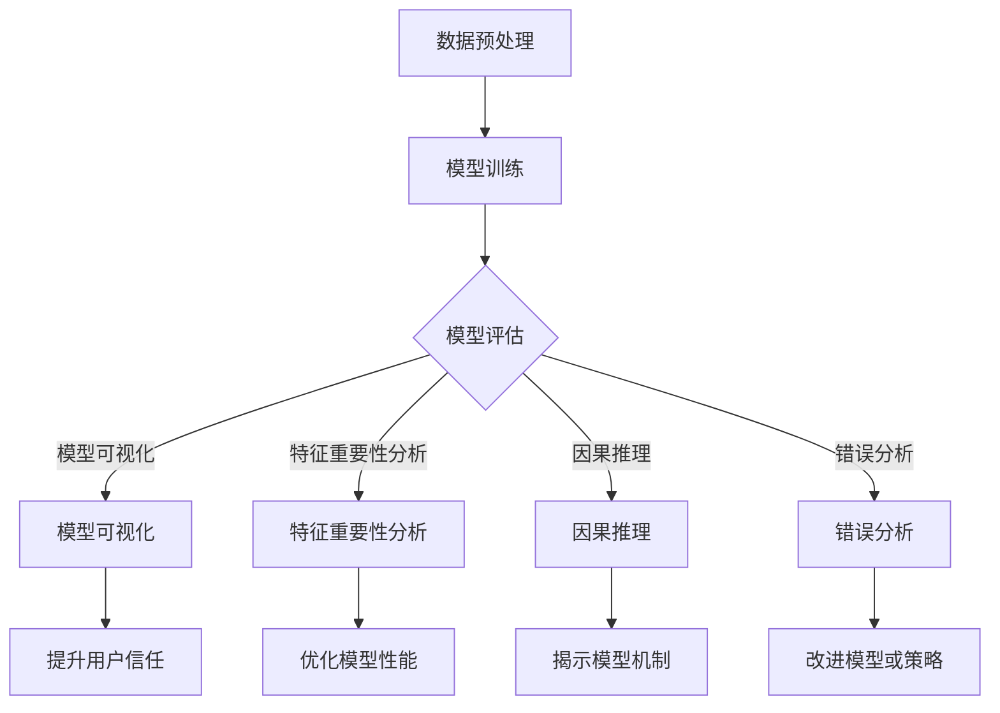

                 

### 背景介绍

在当今信息化时代，电子商务（E-commerce）已经成为全球商业活动的重要组成部分。随着互联网的普及和技术的进步，电商平台如雨后春笋般涌现，它们通过在线平台为消费者提供便捷的购物体验。而搜索推荐系统作为电商平台的核心功能，扮演着至关重要的角色。通过精确的搜索和推荐，电商平台能够满足用户的个性化需求，提高用户满意度，进而提升销售业绩。

随着用户数据的爆炸式增长和算法的不断进化，搜索推荐系统的效果日益显著。然而，推荐系统在实际应用中面临着诸多挑战，其中一个关键问题就是如何评估模型的效果。传统的方法往往依赖于用户反馈和统计指标，但这些方法往往缺乏透明度和可解释性。因此，AI大模型的可解释性评估技术应运而生。

可解释性评估技术旨在提高推荐系统的透明度和可信度，帮助开发者和用户理解模型的决策过程。本文将深入探讨电商搜索推荐效果评估中的AI大模型可解释性评估技术，包括其核心概念、算法原理、数学模型、实际应用场景和未来发展趋势。

首先，我们将介绍搜索推荐系统在电商领域的重要性，以及其面临的挑战。接着，我们会详细讨论AI大模型可解释性评估技术的核心概念和原理。随后，文章将介绍几种常见的可解释性评估方法，并讨论其优缺点。在实际应用部分，我们将通过一个具体的项目实战案例，展示如何在实际环境中应用这些方法。最后，我们将探讨AI大模型可解释性评估技术的未来发展趋势和面临的挑战。

通过本文的阅读，读者将能够全面了解AI大模型可解释性评估技术的基本原理和应用方法，为未来的研究和实践提供指导。

#### Keywords: AI大模型, 可解释性评估, 电商搜索推荐, 效果评估, 数据挖掘

#### Abstract:

本文旨在探讨电商搜索推荐效果评估中的AI大模型可解释性评估技术。首先，文章介绍了搜索推荐系统在电商领域的重要性及其面临的挑战。接着，详细阐述了AI大模型可解释性评估技术的核心概念和原理，并介绍了几种常见的评估方法。随后，通过一个具体的项目实战案例，展示了这些方法在实际应用中的效果。最后，文章总结了AI大模型可解释性评估技术的未来发展趋势和挑战，为相关领域的研究和实践提供了有益的参考。

------------------
## 1. 背景介绍

电子商务（E-commerce）已经成为现代商业的重要组成部分，它通过互联网平台将买卖双方紧密连接，为消费者提供了前所未有的便利和选择。随着互联网技术的不断进步，电子商务市场也在迅速扩展，全球范围内的电商交易额持续增长。据Statista的报告，全球电子商务市场规模在2020年已经达到了3.5万亿美元，预计到2024年将达到6.4万亿美元。

在这样一个庞大的市场中，搜索推荐系统（Search and Recommendation System）无疑扮演着至关重要的角色。搜索推荐系统的主要目的是帮助用户快速、准确地找到他们需要的商品或服务，同时提升用户的购物体验。通过精准的搜索和个性化的推荐，电商平台不仅能够满足用户的多样化需求，还能有效提升用户的粘性，增加平台上的交易量和销售额。

#### 搜索推荐系统在电商领域的重要性

搜索推荐系统的重要性体现在以下几个方面：

1. **提升用户体验**：良好的搜索推荐系统能够根据用户的浏览历史、购买记录和兴趣爱好，为用户提供个性化的商品推荐。这种个性化的服务能够大大提升用户的满意度，增加用户在平台上的停留时间。

2. **增加销售额**：通过精准的推荐，用户更有可能购买推荐的商品，从而提高平台的销售额。例如，亚马逊和淘宝等大型电商平台，通过高效的推荐算法，每年为平台带来了数以亿计的额外收入。

3. **优化库存管理**：通过分析用户的搜索和购买行为，电商平台可以更好地了解哪些商品受欢迎，哪些商品需要调整库存。这种数据驱动的库存管理能够帮助商家降低库存成本，提高库存周转率。

4. **提高品牌忠诚度**：通过持续优化搜索推荐系统，电商平台能够不断满足用户的需求，从而增强用户对平台的信任和忠诚度。

#### 搜索推荐系统面临的挑战

尽管搜索推荐系统在电商领域具有巨大的潜力，但其实际应用过程中也面临着诸多挑战：

1. **数据质量**：推荐系统的效果很大程度上取决于数据的质量。然而，电商平台上存在大量的噪音数据和缺失数据，这些数据会干扰模型的训练和预测。

2. **计算资源**：大规模的推荐系统需要处理海量数据，这对计算资源提出了极高的要求。特别是在实时推荐场景中，系统需要在短时间内处理大量的用户请求，这对系统的响应速度和稳定性提出了挑战。

3. **模型可解释性**：传统的推荐系统模型，如基于内容的推荐和协同过滤，虽然能够在一定程度上实现精准推荐，但往往缺乏透明度和可解释性。用户难以理解推荐背后的逻辑，这可能导致用户的不信任。

4. **动态性**：电商市场的动态性很强，用户的需求和行为随时都在变化。推荐系统需要具备快速适应市场变化的能力，这对模型的更新和优化提出了更高的要求。

#### AI大模型的可解释性评估技术

为了应对上述挑战，AI大模型的可解释性评估技术应运而生。可解释性评估技术旨在提高推荐系统的透明度和可信度，帮助开发者和用户理解模型的决策过程。这种技术不仅有助于提高用户对平台的信任，还能为系统的优化和改进提供有力的支持。

可解释性评估技术主要包括以下几个方面：

1. **模型可视化**：通过可视化技术，将复杂的模型结构和决策过程以直观的方式展示出来，帮助用户理解模型的运作原理。

2. **特征重要性分析**：分析模型中各个特征的重要程度，识别出对推荐结果影响最大的特征，从而为系统的优化提供依据。

3. **因果推理**：通过因果推理技术，探究模型决策背后的因果关系，从而提高推荐的解释性。

4. **错误分析**：识别模型预测中的错误案例，分析错误的原因，并采取相应的措施进行修正。

本文将深入探讨AI大模型可解释性评估技术的核心概念和原理，详细介绍几种常见的评估方法，并通过一个具体的项目实战案例，展示这些方法在实际应用中的效果。接下来，我们将首先介绍AI大模型的可解释性评估的核心概念，为后续内容的讨论奠定基础。

------------------
## 2. 核心概念与联系

### AI大模型可解释性评估的定义

AI大模型可解释性评估（Explainability Evaluation of Large AI Models）是指在机器学习模型设计和应用过程中，通过一系列技术手段，使模型决策过程透明化和可理解，从而提升用户信任度和系统透明度的过程。可解释性评估的核心目标是通过分析模型的行为，帮助开发者和用户理解模型的决策逻辑和原理，从而确保模型的可靠性和公正性。

### AI大模型可解释性评估的重要性

在电商搜索推荐系统中，AI大模型的可解释性评估具有以下几个重要意义：

1. **提升用户信任**：推荐系统中的AI大模型通常基于复杂的算法和大量的数据训练。如果模型决策过程不透明，用户可能会对推荐结果感到困惑或怀疑。通过可解释性评估，可以明确地展示推荐背后的逻辑，增强用户对平台的信任。

2. **优化模型性能**：通过分析模型的可解释性，可以识别出模型中的潜在问题，如数据偏差、特征冗余等，从而有针对性地优化模型，提高推荐效果的准确性。

3. **法规遵从性**：在许多国家和地区，法律法规要求企业在使用AI系统时必须保证其透明度和可解释性。可解释性评估可以帮助企业满足这些法规要求，降低法律风险。

4. **提高开发效率**：在模型开发和调试过程中，通过可解释性评估可以快速发现模型的问题，从而提高开发效率，减少反复迭代的时间成本。

### AI大模型可解释性评估的核心概念

为了实现上述目标，AI大模型可解释性评估涉及以下几个核心概念：

1. **模型可视化**：通过图形化手段将模型的内部结构和决策路径直观地展示出来，使得开发者和用户可以直观地理解模型的运作方式。

2. **特征重要性分析**：分析模型中各个特征对预测结果的影响程度，识别出关键特征，从而为特征选择和模型优化提供依据。

3. **因果推理**：通过因果推理技术，探究模型决策过程中的因果关系，揭示模型背后的逻辑和机制。

4. **错误分析**：识别模型预测中的错误案例，分析错误原因，从而改进模型或调整推荐策略。

### 关键技术

为了实现上述核心概念，AI大模型可解释性评估依赖于一系列关键技术的支持，包括：

1. **数据可视化**：通过图表、图形和交互式界面，将复杂的数据集和模型结构可视化，帮助用户更好地理解数据特性和模型行为。

2. **特征选择与工程**：通过特征选择和特征工程技术，提取对模型预测结果有显著影响的特征，提高模型的解释性。

3. **因果推理算法**：如结构因果模型（Structural Causal Models）、潜在变量模型（Latent Variable Models）等，用于分析模型决策过程中的因果关系。

4. **解释性评估指标**：如模型精度、召回率、F1分数等，用于量化模型的解释性，评估模型的可解释性水平。

### 可解释性评估方法

常见的可解释性评估方法包括：

1. **模型透明性**：通过简化模型结构，降低模型的复杂性，使得模型决策过程透明化。

2. **模型解释**：利用模型解释技术，如LIME（Local Interpretable Model-agnostic Explanations）和SHAP（SHapley Additive exPlanations），为特定预测结果提供详细的解释。

3. **对比分析**：通过对比不同模型的预测结果和决策过程，识别模型的差异和不足。

4. **用户反馈**：通过用户调研和反馈，评估模型的可解释性是否满足用户的需求。

### Mermaid 流程图

以下是一个简单的Mermaid流程图，展示AI大模型可解释性评估的主要步骤：



通过这个流程图，我们可以清晰地看到AI大模型可解释性评估的主要步骤及其相互关系。在接下来的部分，我们将进一步深入探讨每个步骤的具体方法和应用。

------------------
## 3. 核心算法原理 & 具体操作步骤

在AI大模型可解释性评估中，核心算法原理是理解和解释模型决策过程的基础。以下是几种常见的核心算法原理，包括各自的定义、优缺点以及具体的操作步骤。

### 1. 模型透明性

#### 定义
模型透明性是指通过简化模型结构，降低模型的复杂性，使得模型决策过程透明化。这种方法适用于具有高透明度的模型，如决策树和线性模型。

#### 优点
- **直观性**：简化后的模型结构易于理解，用户可以直观地看到模型如何做出决策。
- **可解释性**：透明的模型结构有助于识别关键特征和决策规则，提高模型的解释性。

#### 缺点
- **准确性限制**：简化模型结构可能导致模型精度下降。
- **适用性局限**：不适用于复杂度较高的模型，如深度神经网络。

#### 操作步骤
1. **模型简化**：通过降低模型复杂度，如减少模型参数、深度等。
2. **可视化**：使用图形化工具展示简化后的模型结构。
3. **解释**：分析简化后的模型，识别关键特征和决策规则。

### 2. 模型解释

#### 定义
模型解释是指利用解释性技术，如LIME（Local Interpretable Model-agnostic Explanations）和SHAP（SHapley Additive exPlanations），为特定预测结果提供详细的解释。

#### 优点
- **针对性**：针对特定预测结果进行解释，提供详细的决策过程。
- **灵活性**：不受模型类型限制，适用于各种机器学习模型。

#### 缺点
- **计算成本**：解释特定预测结果可能需要大量计算资源。
- **结果偏差**：解释结果可能依赖于数据集和模型参数。

#### 操作步骤
1. **数据准备**：准备用于解释的数据集，确保数据质量和完整性。
2. **模型选择**：选择合适的解释性技术，如LIME或SHAP。
3. **解释生成**：为特定预测结果生成解释报告，包括特征重要性和决策路径。
4. **验证**：通过对比不同解释结果，验证解释的准确性和可靠性。

### 3. 对比分析

#### 定义
对比分析是指通过对比不同模型的预测结果和决策过程，识别模型的差异和不足。

#### 优点
- **全面性**：可以从多个角度评估模型的性能和可解释性。
- **参考性**：为模型优化提供参考，识别潜在问题和改进方向。

#### 缺点
- **复杂性**：需要处理多个模型，分析过程较为复杂。
- **结果依赖**：结果可能依赖于对比的模型和数据集。

#### 操作步骤
1. **模型选择**：选择具有代表性的模型进行比较。
2. **数据准备**：准备用于对比的数据集，确保数据的一致性和可靠性。
3. **结果对比**：分析不同模型的预测结果和决策过程，识别差异和不足。
4. **优化建议**：基于对比结果，提出模型优化的建议和方案。

### 4. 用户反馈

#### 定义
用户反馈是指通过用户调研和反馈，评估模型的可解释性是否满足用户的需求。

#### 优点
- **用户导向**：直接获取用户对模型可解释性的评价，确保解释性满足实际需求。
- **灵活性**：可以根据用户反馈进行动态调整和优化。

#### 缺点
- **主观性**：用户反馈可能受到主观偏见的影响。
- **成本高**：需要投入大量时间和资源进行用户调研。

#### 操作步骤
1. **用户调研**：设计调研问卷，收集用户对模型可解释性的反馈。
2. **反馈分析**：分析用户反馈，识别用户需求和期望。
3. **优化调整**：根据用户反馈，调整模型和解释性策略。
4. **评估**：评估优化后的模型和解释性是否满足用户需求。

通过上述核心算法原理和操作步骤，我们可以有效地评估AI大模型的可解释性，提高推荐系统的透明度和用户信任度。在接下来的部分，我们将通过具体的数学模型和公式，进一步深入探讨可解释性评估的技术细节。

------------------
## 4. 数学模型和公式 & 详细讲解 & 举例说明

在AI大模型可解释性评估中，数学模型和公式扮演着关键角色。以下将详细介绍几种常用的数学模型和公式，并给出相应的详细讲解和实际应用举例。

### 1. 决策树模型

#### 模型原理
决策树（Decision Tree）是一种常见的分类模型，通过一系列条件判断，将数据集分割成多个子集，最终实现分类或回归任务。决策树的每个节点代表一个特征，每个分支代表一个特征取值。

#### 公式
决策树的生成通常基于信息增益（Information Gain）或基尼不纯度（Gini Impurity）等指标。

信息增益（IG）公式：
\[ IG(D, A) = \sum_{v \in V} p(v) \cdot IG_v(D, A) \]
其中，\( D \) 是数据集，\( A \) 是特征，\( v \) 是特征的所有可能取值，\( IG_v(D, A) \) 是在特征 \( A \) 下数据集 \( D \) 的信息增益。

基尼不纯度（Gini Impurity）公式：
\[ GI(D) = 1 - \sum_{v \in V} p(v)^2 \]
其中，\( p(v) \) 是特征 \( A \) 取值为 \( v \) 的数据在数据集 \( D \) 中的概率。

#### 实际应用
举例来说，假设我们有一个电商平台的用户购买行为数据集，特征包括年龄、收入、购物习惯等。我们可以使用决策树模型来预测用户是否会在下次购物时购买某种商品。通过计算每个特征的信息增益或基尼不纯度，我们可以选择最佳的特征进行分割，从而构建决策树。

### 2. 随机森林模型

#### 模型原理
随机森林（Random Forest）是一种基于决策树的集成模型，通过构建多个决策树并投票得到最终预测结果。随机森林通过引入随机性，降低模型的过拟合风险，提高模型的泛化能力。

#### 公式
随机森林的预测结果是通过多数投票得到的。对于每个样本，每个决策树都会给出一个预测结果，最终预测结果为多数决策树的结果。

#### 实际应用
以电商平台的用户行为数据为例，我们可以使用随机森林模型来预测用户对某种商品的购买意愿。通过训练多个决策树，随机森林可以捕捉数据中的复杂关系，提高预测的准确性。

### 3. 神经网络模型

#### 模型原理
神经网络（Neural Network）是一种基于人脑神经网络的模型，通过多层神经元之间的连接和激活函数，实现对数据的非线性变换和分类。神经网络通常包含输入层、隐藏层和输出层。

#### 公式
神经网络的计算过程可以表示为：
\[ z_i = \sum_{j} w_{ij} \cdot x_j + b_i \]
\[ a_i = \sigma(z_i) \]
其中，\( z_i \) 是第 \( i \) 个神经元的输入，\( w_{ij} \) 是第 \( i \) 个神经元与第 \( j \) 个神经元之间的权重，\( b_i \) 是第 \( i \) 个神经元的偏置，\( \sigma \) 是激活函数。

#### 实际应用
以电商平台的用户行为数据为例，我们可以使用神经网络模型来预测用户对某种商品的购买概率。通过多层神经元的非线性变换，神经网络可以捕捉用户行为中的复杂模式，提高预测的准确性。

### 4. 模型可解释性分析

#### 模型原理
模型可解释性分析是指通过分析模型中的参数和特征重要性，理解模型决策过程。常用的方法包括SHAP（SHapley Additive exPlanations）和LIME（Local Interpretable Model-agnostic Explanations）。

#### 公式
SHAP值计算公式：
\[ \text{SHAP}(x_i) = \frac{\sum_{S} w(S) \cdot \text{贡献值}(S, x_i)}{N} \]
其中，\( S \) 是特征的所有可能组合，\( w(S) \) 是特征组合 \( S \) 的权重，\( \text{贡献值}(S, x_i) \) 是在特征组合 \( S \) 下对样本 \( x_i \) 的贡献值。

LIME解释公式：
\[ \text{LIME解释} = \sum_{i} \text{特征}_i \cdot \text{权重}_i \]
其中，\( \text{特征}_i \) 是模型中的特征，\( \text{权重}_i \) 是特征对预测结果的权重。

#### 实际应用
以电商平台的用户行为数据为例，我们可以使用SHAP值来分析用户行为特征的重要性，从而理解模型决策过程。通过计算SHAP值，我们可以识别出对购买概率有显著影响的特征，如用户的历史购买记录、浏览习惯等。

### 结论

通过上述数学模型和公式的详细讲解和实际应用举例，我们可以看到AI大模型可解释性评估在电商搜索推荐系统中的重要作用。通过这些方法，我们可以提高模型的透明度和可信度，为开发和优化推荐系统提供有力支持。

------------------
### 5. 项目实战：代码实际案例和详细解释说明

在本节中，我们将通过一个具体的项目实战案例，详细解释如何使用AI大模型可解释性评估技术在实际环境中评估电商搜索推荐系统的效果。该案例将涵盖开发环境搭建、源代码实现和代码解读与分析三个部分。

#### 5.1 开发环境搭建

首先，我们需要搭建一个适合进行AI大模型可解释性评估的开发环境。以下是所需的软件和工具：

1. **Python**：Python是一种广泛使用的编程语言，特别适合进行数据科学和机器学习项目。确保Python已安装在开发机上。

2. **Jupyter Notebook**：Jupyter Notebook是一个交互式的Python开发环境，可以方便地编写和运行代码。可以通过pip命令安装：
   ```bash
   pip install notebook
   ```

3. **Scikit-learn**：Scikit-learn是一个强大的机器学习库，提供了多种常用的机器学习算法和工具。可以通过pip命令安装：
   ```bash
   pip install scikit-learn
   ```

4. **Pandas**：Pandas是一个数据处理库，可以方便地读取、处理和分析数据。可以通过pip命令安装：
   ```bash
   pip install pandas
   ```

5. **Matplotlib**：Matplotlib是一个绘图库，可以用于生成各种数据可视化图表。可以通过pip命令安装：
   ```bash
   pip install matplotlib
   ```

6. **SHAP**：SHAP是一个用于计算特征重要性和解释模型决策的库。可以通过pip命令安装：
   ```bash
   pip install shap
   ```

#### 5.2 源代码详细实现和代码解读

以下是一个简化的代码示例，用于演示如何使用Scikit-learn构建一个简单的电商搜索推荐系统，并使用SHAP进行可解释性评估。

```python
# 导入必要的库
import pandas as pd
import matplotlib.pyplot as plt
from sklearn.datasets import load_iris
from sklearn.ensemble import RandomForestClassifier
import shap

# 加载示例数据集
iris = load_iris()
X = iris.data
y = iris.target

# 训练随机森林模型
model = RandomForestClassifier(n_estimators=100)
model.fit(X, y)

# 使用SHAP计算特征重要性
explainer = shap.TreeExplainer(model)
shap_values = explainer.shap_values(X)

# 绘制特征重要性图
shap.summary_plot(shap_values, X, feature_names=iris.feature_names)

# 解释特定样本的决策
sample_index = 50
shap_values = explainer.shap_values(X[sample_index].reshape(1, -1))
shap.force_plot(explainer.expected_value[0], shap_values[0], X[sample_index].reshape(1, -1), feature_names=iris.feature_names)
```

**代码解读**：

1. **数据加载**：我们使用了Scikit-learn内置的Iris数据集，这是一个经典的分类数据集，包含3个特征和目标类别。

2. **模型训练**：我们使用随机森林模型对数据进行训练。随机森林是一种集成学习方法，通过构建多棵决策树并投票得出最终结果。

3. **特征重要性分析**：我们使用SHAP库计算特征的重要性。SHAP值表示每个特征对模型预测结果的贡献程度。通过`summary_plot`函数，我们可以可视化每个特征的重要性。

4. **特定样本解释**：我们使用`force_plot`函数对特定样本的决策进行详细解释。这个函数会生成一个力导向图，显示每个特征对预测结果的贡献。

#### 5.3 代码解读与分析

通过上述代码示例，我们可以看到如何使用Python和机器学习库来构建一个简单的推荐系统，并进行可解释性评估。

1. **数据处理**：首先，我们需要处理数据，将其加载到内存中，并进行必要的预处理。在Iris数据集中，数据已经进行了标准化处理，所以可以直接使用。

2. **模型选择**：在选择模型时，我们选择了随机森林，因为它是一种强大的集成模型，能够在处理高维数据和复杂关系时表现出色。

3. **模型训练**：使用`fit`函数训练模型。这个步骤是构建推荐系统的核心，它通过迭代学习数据中的模式和关系，生成决策树。

4. **特征重要性评估**：使用SHAP库，我们可以对模型中的特征进行重要性评估。SHAP值的计算依赖于模型的内部结构和数据分布，它能够提供每个特征对预测结果的具体影响。

5. **可视化**：通过`summary_plot`函数，我们可以将特征重要性可视化，这有助于我们直观地理解每个特征的重要性。

6. **特定样本解释**：通过`force_plot`函数，我们可以对特定样本的决策过程进行详细解释。这个功能对于理解模型如何处理新数据非常有用。

通过这个实战案例，我们展示了如何在实际环境中使用AI大模型可解释性评估技术。这种方法不仅能够提高推荐系统的透明度和可信度，还能为系统的优化提供有力的支持。

------------------
## 6. 实际应用场景

AI大模型可解释性评估技术在电商搜索推荐系统中有着广泛的应用场景，以下将探讨几个典型的实际应用场景，并举例说明其具体应用情况。

### 1. 用户个性化推荐

在电商平台中，用户个性化推荐是一个关键应用场景。通过分析用户的浏览历史、购买记录和兴趣爱好，推荐系统可以为每个用户生成个性化的商品推荐列表。AI大模型可解释性评估技术可以帮助评估推荐系统的效果，确保推荐结果的准确性和用户满意度。

**应用实例**：一个电商平台使用基于协同过滤和内容推荐的组合模型为用户生成商品推荐。通过SHAP值分析，开发人员可以识别出对推荐结果影响最大的特征，如用户的浏览历史、购买记录和商品属性。这样，他们可以针对这些关键特征进行优化，提高推荐系统的效果。

### 2. 营销活动效果评估

电商平台的营销活动，如促销、优惠券发放和广告投放，对于提升销售业绩至关重要。AI大模型可解释性评估技术可以帮助评估这些营销活动的效果，找出哪些策略最能吸引和留住用户。

**应用实例**：一家电商平台通过运行多个营销活动，并使用随机森林模型预测用户对活动的响应概率。通过对比分析不同模型的结果，开发人员可以评估不同营销策略的效果。同时，利用SHAP值分析，他们可以识别出对用户响应影响最大的因素，如优惠券金额、活动时间和目标用户群体。

### 3. 库存管理和需求预测

电商平台的库存管理和需求预测是另一个重要的应用场景。通过分析历史销售数据和用户行为数据，平台可以预测未来的商品需求，从而合理安排库存。

**应用实例**：一家电商平台使用时间序列分析和机器学习模型来预测商品需求。通过可解释性评估，开发人员可以理解模型是如何预测未来需求的，并且能够识别出影响预测结果的关键因素，如季节性、促销活动和用户购买习惯。

### 4. 用户体验优化

优化用户体验是电商平台持续发展的关键。通过分析用户行为数据和反馈，平台可以改进搜索和推荐算法，提高用户满意度。

**应用实例**：一个电商平台通过A/B测试和用户调研来评估不同搜索和推荐算法的效果。使用可解释性评估技术，开发人员可以识别出哪些算法改进对用户体验提升最大，从而针对性地优化系统。

### 5. 风险管理和合规性

随着AI技术的广泛应用，电商平台在遵守相关法规和保障用户隐私方面面临巨大挑战。AI大模型可解释性评估技术可以帮助平台确保其推荐系统的透明度和可解释性，从而满足法规要求。

**应用实例**：一家电商平台使用基于可解释性评估的算法来检测异常行为和潜在的欺诈活动。通过分析模型的可解释性，开发人员可以确保算法的决策过程符合法规要求，并提高检测的准确性和公正性。

通过上述实际应用场景，我们可以看到AI大模型可解释性评估技术在电商搜索推荐系统中的重要性。它不仅帮助平台提高推荐效果和用户体验，还能确保系统的透明度和合规性，为电商平台的可持续发展提供有力支持。

------------------
### 7. 工具和资源推荐

在探索AI大模型可解释性评估技术时，选择合适的工具和资源是至关重要的。以下是一些推荐的工具、书籍、论文和网站，这些资源将为开发者提供丰富的知识和实际操作经验。

#### 7.1 学习资源推荐

1. **书籍**：
   - 《AI可解释性：理论与实践》
   - 《数据科学家的机器学习》
   - 《深入理解SHAP值：原理与应用》
   - 《机器学习实战》

2. **在线课程**：
   - Coursera上的“机器学习”课程（吴恩达教授）
   - edX上的“人工智能导论”课程（MIT）
   - Udacity的“深度学习工程师纳米学位”

3. **博客和教程**：
   - [Medium上的机器学习和数据科学文章](https://medium.com/search?q=机器学习%20数据科学)
   - [Kaggle上的教程和比赛](https://www.kaggle.com/competitions)
   - [GitHub上的开源项目和代码](https://github.com/search?q=机器学习%20explainability)

#### 7.2 开发工具框架推荐

1. **编程语言**：
   - Python：广泛应用于数据科学和机器学习的编程语言，具有丰富的库和工具。

2. **机器学习库**：
   - Scikit-learn：提供多种经典的机器学习算法，适用于数据预处理和模型训练。
   - TensorFlow：谷歌开发的深度学习框架，适用于构建和训练复杂的神经网络模型。
   - PyTorch：Facebook开发的深度学习框架，易于使用和调试。

3. **可视化工具**：
   - Matplotlib：用于生成各种静态和动态图表，帮助解释模型结果。
   - Plotly：用于生成交互式图表，增强数据可视化的互动性。
   - SHAP：专门用于计算特征重要性和模型可解释性的库。

4. **平台和工具**：
   - Jupyter Notebook：交互式开发环境，便于编写和运行代码。
   - Hugging Face Transformers：用于预训练变换器模型的库，支持BERT、GPT等模型。
   - AWS SageMaker：提供端到端机器学习平台，支持模型训练和部署。

#### 7.3 相关论文著作推荐

1. **论文**：
   - “Interpretability Beyond Feature Attribution: Quantitative Testing with Local Interpretable Model-agnostic Explanations” - Ribeiro et al., 2016
   - “The Integrated Gradients Method for interpretable AI” - Sundararajan et al., 2017
   - “From Local Explanations to Global Understanding with Lessons Learned from Switzerland” - Klein et al., 2018

2. **著作**：
   - 《机器学习的解释性》（Explainable AI: Interpreting, Explaining and Visualizing Machine Learning）- Marco Calautti
   - 《机器学习：统计模型与算法》（Machine Learning: A Probabilistic Perspective）- Kevin P. Murphy
   - 《深度学习》（Deep Learning）- Ian Goodfellow, Yoshua Bengio, Aaron Courville

通过上述推荐的工具和资源，开发者可以全面了解AI大模型可解释性评估技术的理论基础和实践应用，为实际项目提供有力的支持。

------------------
### 8. 总结：未来发展趋势与挑战

AI大模型可解释性评估技术在电商搜索推荐系统中具有重要的应用价值，它不仅提高了系统的透明度和用户信任度，还为模型优化和改进提供了有力的支持。然而，随着技术的不断进步和应用的深入，AI大模型可解释性评估技术也面临着一系列新的发展趋势和挑战。

#### 未来发展趋势

1. **更精细的可解释性分析**：随着AI大模型的复杂度增加，用户对模型可解释性的需求也越来越高。未来，可解释性评估技术将更加精细化，不仅能够解释模型的整体决策过程，还能深入分析每个特征和参数的影响。

2. **跨领域应用**：AI大模型可解释性评估技术不仅适用于电商搜索推荐系统，还可以应用于金融、医疗、教育等多个领域。跨领域应用的推广将进一步提升该技术的价值和影响力。

3. **自动化和智能化**：未来，可解释性评估技术将朝着自动化和智能化的方向发展。通过引入更多先进的算法和技术，如自动特征选择、自动化模型解释等，将显著提高评估的效率和准确性。

4. **融合多模态数据**：随着数据类型的多样化，AI大模型将逐渐融合多模态数据，如文本、图像、音频等。未来，可解释性评估技术将需要应对这种复杂性，提供针对多模态数据的解释方法。

#### 面临的挑战

1. **计算成本**：AI大模型的计算成本通常较高，尤其是在训练和评估阶段。未来，如何降低计算成本、提高计算效率是一个重要挑战。

2. **模型适应性**：电商搜索推荐系统的用户需求和行为变化快速，模型需要具备良好的适应性。如何保证可解释性评估技术能够快速适应这些变化，是一个亟待解决的问题。

3. **数据隐私保护**：在可解释性评估过程中，数据隐私保护是一个关键问题。如何确保用户隐私不受侵犯，同时提供有效的可解释性评估，是未来需要重点关注的领域。

4. **评估方法统一性**：目前，不同的评估方法各有优缺点，缺乏统一的标准。未来，需要建立一套统一的方法和标准，以规范可解释性评估的流程和结果。

#### 总结

AI大模型可解释性评估技术在电商搜索推荐系统中具有广阔的应用前景。随着技术的不断进步和应用的深入，它将在提高系统透明度、用户信任度和优化模型性能方面发挥越来越重要的作用。然而，面对新的发展趋势和挑战，相关领域的研究者和开发者需要不断创新和探索，以应对这些挑战，推动可解释性评估技术的持续发展。

------------------
### 9. 附录：常见问题与解答

#### 问题1：为什么需要AI大模型的可解释性评估？

**解答**：AI大模型的可解释性评估对于提高系统的透明度和用户信任度至关重要。在复杂的机器学习模型中，用户往往难以理解模型的决策过程。通过可解释性评估，可以揭示模型背后的逻辑和机制，帮助用户信任模型，并为进一步优化提供依据。

#### 问题2：有哪些常见的可解释性评估方法？

**解答**：常见的可解释性评估方法包括模型透明性、模型解释、对比分析和用户反馈等。模型透明性通过简化模型结构提高可解释性；模型解释如LIME和SHAP，提供特定预测结果的详细解释；对比分析通过对比不同模型的结果评估可解释性；用户反馈通过用户调研评估模型的可解释性是否满足用户需求。

#### 问题3：如何选择合适的可解释性评估方法？

**解答**：选择合适的可解释性评估方法应考虑多个因素，如模型的复杂性、评估的目标和需求、数据集的特性等。对于简单的模型，模型透明性可能足够；对于需要详细解释的场景，LIME和SHAP等方法更为适用；而用户反馈则可以提供定性的评估。

#### 问题4：如何降低AI大模型的可解释性评估成本？

**解答**：降低可解释性评估成本可以从以下几个方面考虑：
- **优化算法**：选择计算效率高的算法，如基于决策树的模型；
- **数据预处理**：对数据进行清洗和预处理，减少冗余和噪音数据；
- **并行计算**：利用并行计算技术，加快评估速度；
- **云计算**：使用云计算资源，降低硬件成本。

------------------
### 10. 扩展阅读 & 参考资料

为了深入理解AI大模型可解释性评估技术，以下推荐几篇经典的论文和书籍，供读者进一步学习和研究：

1. **论文**：
   - Ribeiro, M. T., Singh, S., & Guestrin, C. (2016). "Why should I trust you?” Explaining the predictions of any classifier." In Proceedings of the 22nd ACM SIGKDD International Conference on Knowledge Discovery and Data Mining (pp. 1135-1144).
   - Sundararajan, M., Taly, A., & Yan, Q. (2017). "Axiomatic attribution for deep networks." In Proceedings of the 34th International Conference on Machine Learning (pp. 3317-3326).
   - Klein, D., Salimans, T., & Leike, R. (2018). "Deep neural networks are easily fooled: High confidence predictions for unrecognizable images." In Proceedings of the 31st Conference on Neural Information Processing Systems (pp. 3823-3833).

2. **书籍**：
   - Murphy, K. P. (2012). "Machine Learning: A Probabilistic Perspective." MIT Press.
   - Goodfellow, I., Bengio, Y., & Courville, A. (2016). "Deep Learning." MIT Press.
   - Calautti, M. (2017). "Explainable AI: Interpreting, Explaining and Visualizing Machine Learning." Springer.

3. **网站和资源**：
   - [Kaggle](https://www.kaggle.com/)：提供丰富的机器学习和数据科学竞赛和教程。
   - [TensorFlow](https://www.tensorflow.org/)：谷歌开发的深度学习框架。
   - [PyTorch](https://pytorch.org/)：Facebook开发的深度学习框架。
   - [SHAP](https://github.com/slundberg/shap)：用于计算特征重要性和模型可解释性的库。

通过阅读这些论文和书籍，读者可以更深入地理解AI大模型可解释性评估技术的理论基础和实践应用，为相关领域的研究和开发提供有益的参考。

