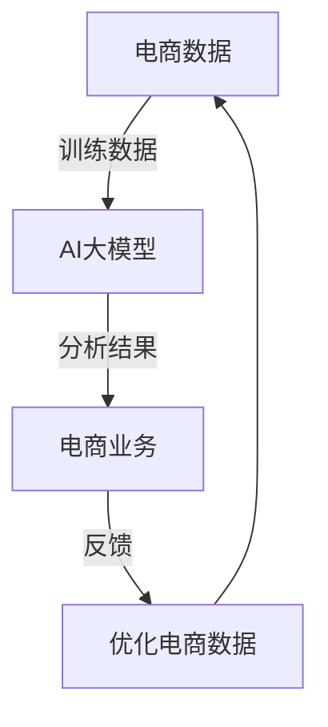

                 

### 背景介绍

在当今数字时代，电子商务已成为全球商业活动的重要组成部分。随着互联网的普及和移动设备的广泛应用，消费者和商家之间的互动方式发生了巨大变化。在这个过程中，数据扮演了至关重要的角色。电商数据包括用户的购买历史、浏览行为、搜索记录等，这些数据既是商业决策的重要依据，也是人工智能（AI）算法的重要输入。

人工智能的快速发展为电商领域带来了前所未有的机遇。通过大数据分析和机器学习算法，电商企业能够更好地理解用户需求，优化营销策略，提升用户体验，甚至预测市场趋势。尤其是大模型（如深度学习模型）的引入，使得AI在处理复杂数据和分析大规模商业问题方面具备了更高的效率和准确性。

大模型在电商中的应用主要体现在以下几个方面：

1. **个性化推荐**：通过分析用户历史行为和偏好，大模型可以推荐用户可能感兴趣的商品，从而提高转化率和客户满意度。
2. **需求预测**：大模型可以基于历史销售数据预测未来的市场需求，帮助电商企业优化库存管理，降低库存成本。
3. **价格优化**：通过分析市场数据，大模型可以为产品制定更合理的定价策略，提升竞争力。
4. **客户服务**：大模型可以用于构建智能客服系统，自动回答用户问题，提高客户服务水平。

本文将围绕电商数据与AI大模型的结合展开，详细探讨其核心概念、算法原理、数学模型以及实际应用案例。通过逐步分析和推理，旨在为广大读者提供一个深入理解和应用这一技术的指南。

### 2. 核心概念与联系

在探讨电商数据与AI大模型的结合之前，我们首先需要明确一些核心概念和它们之间的联系。

**电商数据**：电商数据是指与电子商务活动相关的各种数据，包括用户行为数据、交易数据、商品信息数据等。用户行为数据包括用户的浏览记录、点击行为、搜索历史等；交易数据包括购买订单、支付方式、购买时间等；商品信息数据包括商品名称、价格、分类、库存等。

**人工智能（AI）**：人工智能是一种模拟人类智能行为的计算机系统，包括机器学习、深度学习、自然语言处理等子领域。AI可以处理和分析大量数据，从中提取有价值的信息，并做出智能决策。

**大模型**：大模型通常指的是深度学习模型，尤其是那些具有数十亿参数的模型。这些模型可以通过大量数据训练，从而在特定任务上实现高性能。

**核心概念联系**：

- **电商数据**为AI大模型提供了丰富的训练数据集，使得模型能够更好地理解和预测用户行为。
- **AI大模型**通过复杂的数据分析技术，从电商数据中提取出有价值的信息，用于个性化推荐、需求预测等应用。
- **电商业务**通过与AI大模型的结合，能够实现更智能的决策，提升运营效率和服务质量。

**Mermaid 流程图**：

下面是一个简单的Mermaid流程图，展示了电商数据与AI大模型之间的主要联系。



**图解**：

- **电商数据**作为训练数据输入到**AI大模型**中。
- **AI大模型**通过分析电商数据，生成分析结果。
- **电商业务**根据分析结果进行调整和优化，并将优化后的数据反馈给**电商数据**。

通过这一流程，电商数据与AI大模型之间形成了一个闭环，实现了数据驱动的电商运营优化。

### 3. 核心算法原理 & 具体操作步骤

在了解了电商数据与AI大模型之间的联系后，我们需要深入探讨AI大模型的核心算法原理以及具体操作步骤。以下是关于核心算法原理的详细说明。

#### 3.1 深度学习算法原理

深度学习是人工智能的一个重要分支，其核心思想是通过模拟人脑神经网络结构，实现对数据的自动学习和特征提取。在深度学习中，最常用的算法是神经网络（Neural Network）。

**神经网络**：神经网络由多个层次组成，包括输入层、隐藏层和输出层。每个层次包含多个神经元，神经元之间通过权重（weights）进行连接。在训练过程中，神经网络通过不断调整权重，使得网络对输入数据的输出越来越接近期望输出。

**激活函数**：激活函数（Activation Function）是神经网络中一个重要的组成部分，用于引入非线性特性。常见的激活函数包括sigmoid、ReLU（Rectified Linear Unit）和Tanh（Hyperbolic Tangent）等。

**反向传播算法**：反向传播算法（Backpropagation Algorithm）是深度学习训练过程中用于更新网络权重的一种算法。该算法通过计算输出误差梯度，并反向传播到每个神经元，从而更新网络权重。

#### 3.2 深度学习模型训练步骤

以下是一个简单的深度学习模型训练步骤：

1. **数据预处理**：对电商数据进行预处理，包括数据清洗、归一化、数据增强等操作。数据预处理的主要目的是提高模型训练效果和减少过拟合现象。

2. **构建模型**：根据任务需求，构建合适的深度学习模型。常见的模型包括卷积神经网络（CNN）、循环神经网络（RNN）和变压器（Transformer）等。

3. **模型训练**：使用预处理后的电商数据对模型进行训练。训练过程包括迭代计算梯度、更新权重和优化损失函数。常见的优化算法包括随机梯度下降（SGD）、Adam等。

4. **模型评估**：使用验证集对训练好的模型进行评估，判断模型的泛化能力和准确性。

5. **模型调整**：根据模型评估结果，对模型进行调整和优化，包括调整超参数、增加隐藏层或神经元等。

6. **模型部署**：将训练好的模型部署到生产环境中，用于实际应用。

#### 3.3 深度学习模型在实际应用中的操作步骤

以下是在电商领域使用深度学习模型的具体操作步骤：

1. **数据收集**：收集电商平台的用户行为数据、交易数据和商品信息数据等。

2. **数据预处理**：对收集到的数据进行清洗、归一化和数据增强等处理。

3. **模型选择**：根据任务需求，选择合适的深度学习模型。例如，对于个性化推荐任务，可以选择基于协同过滤（Collaborative Filtering）和深度学习相结合的模型。

4. **模型训练**：使用预处理后的数据对模型进行训练，调整超参数，优化模型性能。

5. **模型评估**：使用验证集对训练好的模型进行评估，确保模型具有良好的泛化能力和准确性。

6. **模型部署**：将训练好的模型部署到生产环境中，用于实时推荐、需求预测等应用。

7. **持续优化**：根据实际应用效果，不断调整和优化模型，提高模型性能。

通过以上步骤，电商企业可以更好地利用AI大模型来提升运营效率和服务质量。

### 4. 数学模型和公式 & 详细讲解 & 举例说明

在深度学习模型中，数学模型和公式起到了至关重要的作用。以下将详细讲解深度学习中的核心数学模型和公式，并通过举例说明其应用。

#### 4.1 损失函数（Loss Function）

损失函数是深度学习模型中的一个关键组件，用于衡量模型的预测值与真实值之间的差距。常用的损失函数包括均方误差（MSE）、交叉熵损失（Cross-Entropy Loss）等。

**均方误差（MSE）**：

均方误差（Mean Squared Error, MSE）是最常见的损失函数之一，用于回归问题。

$$
MSE = \frac{1}{n}\sum_{i=1}^{n}(y_i - \hat{y}_i)^2
$$

其中，$y_i$是真实值，$\hat{y}_i$是模型的预测值，$n$是样本数量。

**交叉熵损失（Cross-Entropy Loss）**：

交叉熵损失函数用于分类问题，其数学表达式为：

$$
Cross-Entropy Loss = -\sum_{i=1}^{n} y_i \log(\hat{y}_i)
$$

其中，$y_i$是真实标签，$\hat{y}_i$是模型对第$i$个样本的预测概率。

#### 4.2 优化算法（Optimization Algorithm）

优化算法用于更新深度学习模型中的权重，以最小化损失函数。常用的优化算法包括随机梯度下降（SGD）、Adam等。

**随机梯度下降（SGD）**：

随机梯度下降是一种简单的优化算法，其核心思想是使用每个样本的梯度来更新权重。

$$
w_{t+1} = w_t - \alpha \cdot \nabla_w J(w)
$$

其中，$w_t$是当前权重，$\alpha$是学习率，$J(w)$是损失函数。

**Adam优化器**：

Adam优化器是SGD的一种改进，结合了动量（Momentum）和自适应学习率（Adaptive Learning Rate）的特点。

$$
v_t = \beta_1 \cdot v_{t-1} + (1 - \beta_1) \cdot \nabla_w J(w)
$$

$$
s_t = \beta_2 \cdot s_{t-1} + (1 - \beta_2) \cdot (\nabla_w J(w))^2
$$

$$
\hat{v}_t = \frac{v_t}{1 - \beta_1^t}
$$

$$
\hat{s}_t = \frac{s_t}{1 - \beta_2^t}
$$

$$
w_{t+1} = w_t - \alpha \cdot \frac{\hat{v}_t}{\sqrt{\hat{s}_t} + \epsilon}
$$

其中，$\beta_1$和$\beta_2$分别是动量和自适应学习率的超参数，$\epsilon$是一个很小的常数，用于避免除以零。

#### 4.3 举例说明

假设我们有一个二元分类问题，需要预测一个样本属于类别0或类别1。使用交叉熵损失函数和Adam优化器进行模型训练。

1. **数据集**：假设我们有一个包含100个样本的数据集，每个样本有一个标签（0或1）和一个特征向量。
2. **模型**：构建一个简单的神经网络模型，包括一个输入层、一个隐藏层和一个输出层。
3. **训练过程**：

   - 初始化权重和偏置。
   - 遍历每个样本，计算损失函数值。
   - 使用Adam优化器更新权重和偏置。
   - 重复以上步骤，直到达到训练迭代次数或损失函数收敛。

通过以上步骤，我们可以训练出一个能够预测样本类别的深度学习模型。

### 5. 项目实战：代码实际案例和详细解释说明

#### 5.1 开发环境搭建

在进行电商数据与AI大模型结合的项目实战之前，我们需要搭建一个合适的开发环境。以下是所需的工具和步骤：

1. **Python环境**：确保Python环境已安装，版本建议为3.7或以上。
2. **深度学习框架**：选择一个流行的深度学习框架，如TensorFlow或PyTorch。
3. **依赖库**：安装必要的依赖库，如NumPy、Pandas、Scikit-learn、Matplotlib等。

以下是在终端中安装所需依赖库的命令：

```bash
pip install numpy pandas scikit-learn matplotlib tensorflow
```

#### 5.2 源代码详细实现和代码解读

在本节中，我们将使用TensorFlow框架实现一个简单的电商数据分类项目，并对关键代码进行详细解释。

```python
import tensorflow as tf
from tensorflow.keras.models import Sequential
from tensorflow.keras.layers import Dense, Dropout
from tensorflow.keras.optimizers import Adam
from sklearn.model_selection import train_test_split
import pandas as pd

# 5.2.1 数据准备

# 加载电商数据集
data = pd.read_csv('ecommerce_data.csv')

# 分离特征和标签
X = data.drop('label', axis=1)
y = data['label']

# 划分训练集和测试集
X_train, X_test, y_train, y_test = train_test_split(X, y, test_size=0.2, random_state=42)

# 5.2.2 构建模型

# 创建一个顺序模型
model = Sequential()

# 添加隐藏层和输出层
model.add(Dense(64, activation='relu', input_shape=(X_train.shape[1],)))
model.add(Dropout(0.5))
model.add(Dense(1, activation='sigmoid'))

# 编译模型
model.compile(optimizer=Adam(learning_rate=0.001), loss='binary_crossentropy', metrics=['accuracy'])

# 5.2.3 训练模型

# 训练模型
model.fit(X_train, y_train, epochs=10, batch_size=32, validation_data=(X_test, y_test))

# 5.2.4 模型评估

# 评估模型
loss, accuracy = model.evaluate(X_test, y_test)
print(f"Test Loss: {loss}, Test Accuracy: {accuracy}")

# 5.2.5 预测新数据

# 预测新数据
new_data = pd.read_csv('new_eCommerce_data.csv')
predictions = model.predict(new_data)
predictions = (predictions > 0.5).astype(int)

# 输出预测结果
print(predictions)
```

**代码解读**：

1. **数据准备**：
   - 加载电商数据集，并分离特征和标签。
   - 使用`train_test_split`函数划分训练集和测试集，以便进行模型训练和评估。

2. **构建模型**：
   - 使用`Sequential`模型创建一个顺序模型。
   - 添加一个隐藏层，并使用ReLU激活函数。
   - 添加一个Dropout层，用于防止过拟合。
   - 添加输出层，使用sigmoid激活函数进行二元分类。

3. **编译模型**：
   - 选择Adam优化器，并设置学习率为0.001。
   - 使用`compile`函数编译模型，指定损失函数和评估指标。

4. **训练模型**：
   - 使用`fit`函数训练模型，指定训练轮数、批量大小和验证数据。

5. **模型评估**：
   - 使用`evaluate`函数评估模型在测试集上的性能，并打印损失和准确率。

6. **预测新数据**：
   - 加载新数据集，并使用`predict`函数进行预测。
   - 将预测结果输出。

通过以上步骤，我们可以实现一个简单的电商数据分类模型，并对关键代码进行详细解读。

#### 5.3 代码解读与分析

在本节中，我们将对代码进行深入分析，解释每个部分的作用和实现细节。

**1. 数据准备**

```python
data = pd.read_csv('ecommerce_data.csv')
X = data.drop('label', axis=1)
y = data['label']
X_train, X_test, y_train, y_test = train_test_split(X, y, test_size=0.2, random_state=42)
```

- **加载数据集**：使用`pd.read_csv`函数加载电商数据集。
- **分离特征和标签**：使用`drop`函数分离特征和标签。
- **划分训练集和测试集**：使用`train_test_split`函数划分训练集和测试集，其中`test_size`设置为0.2表示测试集占比20%，`random_state`设置为42用于确保结果可复现。

**2. 构建模型**

```python
model = Sequential()
model.add(Dense(64, activation='relu', input_shape=(X_train.shape[1],)))
model.add(Dropout(0.5))
model.add(Dense(1, activation='sigmoid'))
```

- **创建顺序模型**：使用`Sequential`创建一个顺序模型。
- **添加隐藏层**：使用`Dense`层添加一个隐藏层，包含64个神经元，使用ReLU激活函数。
- **添加Dropout层**：使用`Dropout`层，设置丢弃概率为0.5，以防止过拟合。
- **添加输出层**：使用`Dense`层添加输出层，包含1个神经元，使用sigmoid激活函数进行二元分类。

**3. 编译模型**

```python
model.compile(optimizer=Adam(learning_rate=0.001), loss='binary_crossentropy', metrics=['accuracy'])
```

- **选择优化器**：使用`Adam`优化器，设置学习率为0.001。
- **指定损失函数**：使用`binary_crossentropy`损失函数，适用于二元分类问题。
- **指定评估指标**：使用`accuracy`指标评估模型性能。

**4. 训练模型**

```python
model.fit(X_train, y_train, epochs=10, batch_size=32, validation_data=(X_test, y_test))
```

- **训练模型**：使用`fit`函数训练模型，设置训练轮数（epochs）为10，批量大小（batch_size）为32，使用`validation_data`参数提供验证数据。

**5. 模型评估**

```python
loss, accuracy = model.evaluate(X_test, y_test)
print(f"Test Loss: {loss}, Test Accuracy: {accuracy}")
```

- **评估模型**：使用`evaluate`函数评估模型在测试集上的性能，打印损失和准确率。

**6. 预测新数据**

```python
new_data = pd.read_csv('new_eCommerce_data.csv')
predictions = model.predict(new_data)
predictions = (predictions > 0.5).astype(int)
print(predictions)
```

- **加载新数据**：使用`pd.read_csv`函数加载新数据集。
- **预测新数据**：使用`predict`函数进行预测，将输出概率大于0.5的样本预测为正类，小于0.5的样本预测为负类。
- **输出预测结果**：打印预测结果。

通过以上分析，我们可以更好地理解代码的实现细节和逻辑流程。

### 6. 实际应用场景

电商数据与AI大模型的结合在多个实际应用场景中展现出了巨大的潜力。以下是几个典型的应用场景：

#### 6.1 个性化推荐

个性化推荐是电商数据与AI大模型结合最为广泛的应用场景之一。通过分析用户的购物历史、浏览记录和搜索行为，AI大模型可以生成个性化的商品推荐列表，提高用户的购物体验和满意度。例如，亚马逊和阿里巴巴等电商巨头都广泛应用了个性化推荐系统，通过精准推荐提升用户留存率和销售额。

**案例**：亚马逊的个性化推荐系统每天会向数亿用户推送数百万个个性化商品推荐。这些推荐基于用户的浏览历史、购买记录和相似用户的购买行为，通过深度学习算法和协同过滤技术实现。根据统计，个性化推荐显著提升了亚马逊的销售额，约为整体销售额的30%。

#### 6.2 需求预测

电商企业常常需要预测未来一段时间内的商品需求，以便优化库存管理和供应链。AI大模型通过分析历史销售数据、季节性因素和市场需求趋势，可以预测未来的商品需求量。这种预测能力对于减少库存积压和库存过剩至关重要。

**案例**：亚马逊利用AI大模型预测书籍和电子书的销售量。通过对数百万种商品的每天销售数据进行深度学习分析，亚马逊能够准确预测哪些书籍将在未来几个月内畅销，从而优化库存策略，降低库存成本。

#### 6.3 价格优化

价格优化是电商竞争中的关键环节。通过AI大模型分析市场数据、竞争对手的价格策略和用户的历史购买行为，电商企业可以制定出更具竞争力的价格策略。动态定价和个性化定价策略能够提高商品转化率和利润率。

**案例**：京东通过AI大模型实现动态定价。根据用户的历史购买行为、购物车数据和市场竞争对手的价格，京东的AI系统会实时调整商品价格，以提高销售量和市场份额。据分析，动态定价策略显著提升了京东的销售额和利润率。

#### 6.4 客户服务

智能客服系统是电商数据与AI大模型结合的另一个重要应用。通过自然语言处理和机器学习算法，AI大模型可以构建一个能够自动回答用户问题的智能客服系统，提高客户服务效率和质量。

**案例**：阿里巴巴的智能客服系统“阿里小蜜”通过深度学习算法和自然语言处理技术，能够自动解答用户咨询，包括订单查询、售后服务等。根据统计，智能客服系统的引入显著降低了阿里巴巴的客户服务成本，同时提升了客户满意度。

### 7. 工具和资源推荐

#### 7.1 学习资源推荐

**书籍**：
1. 《深度学习》（Goodfellow, Ian，等著）- 这本书是深度学习领域的经典教材，详细介绍了深度学习的理论基础和应用案例。
2. 《机器学习实战》（Peter Harrington著）- 该书通过大量实例，介绍了机器学习的实际应用方法，包括数据分析、特征工程和模型评估等。

**论文**：
1. "Deep Learning for E-commerce Recommendations"（Hidasi, András，等）- 该论文介绍了如何利用深度学习技术优化电商推荐系统。
2. "Neural Collaborative Filtering"（He, Xiang，等）- 该论文提出了神经协同过滤算法，用于解决推荐系统的冷启动问题。

**博客和网站**：
1. [TensorFlow 官方文档](https://www.tensorflow.org/) - TensorFlow提供了丰富的教程和文档，是学习和实践深度学习的重要资源。
2. [PyTorch 官方文档](https://pytorch.org/docs/stable/) - PyTorch是一个流行的深度学习框架，其官方文档提供了详细的使用指南和教程。

#### 7.2 开发工具框架推荐

**开发框架**：
1. **TensorFlow** - 一个开源的深度学习框架，提供了丰富的API和工具，适用于各种深度学习应用。
2. **PyTorch** - 一个动态的深度学习框架，提供了灵活的编程接口和强大的GPU加速功能，适用于研究和开发。

**开发环境**：
1. **Google Colab** - 一个免费的云端Jupyter Notebook平台，支持TensorFlow和PyTorch，适用于在线实验和开发。
2. **AWS SageMaker** - AWS提供的一个全托管的服务，支持多种深度学习框架和工具，适用于大规模模型训练和部署。

#### 7.3 相关论文著作推荐

**相关论文**：
1. "Deep Learning for E-commerce: Personalized Recommendations, Demand Forecasting, and More"（Wang, Yiming，等）- 该论文综述了深度学习在电商领域的应用，包括个性化推荐、需求预测等。
2. "Neural Collaborative Filtering"（He, Xiang，等）- 该论文提出了神经协同过滤算法，为解决推荐系统的冷启动问题提供了有效方法。

**著作**：
1. 《深度学习与电商应用》 - 本书结合深度学习和电商领域的实际案例，详细介绍了深度学习技术在电商中的应用，包括个性化推荐、需求预测等。

通过上述工具和资源的推荐，读者可以更好地学习和应用电商数据与AI大模型的相关技术，为电商业务的优化提供有力支持。

### 8. 总结：未来发展趋势与挑战

随着电商行业的持续发展和人工智能技术的不断进步，电商数据与AI大模型的结合呈现出强劲的发展势头。在未来，这一领域有望在以下几个方面实现突破：

**1. 模型复杂度与效率的提升**：目前，AI大模型在电商中的应用已经取得了一定的成效，但随着数据量的增加和任务复杂度的提升，如何提高模型的效率和可扩展性成为关键挑战。未来，研究者将致力于开发更高效、更轻量级的深度学习模型，以适应大规模电商数据处理的需求。

**2. 跨模态数据融合**：电商数据不仅包括结构化数据，还涉及图像、视频、语音等非结构化数据。如何将不同模态的数据进行有效融合，以提升模型性能，是未来研究的一个重要方向。跨模态数据融合技术有望在个性化推荐、需求预测等方面发挥更大的作用。

**3. 解释性AI的发展**：虽然AI大模型在电商领域取得了显著成果，但其决策过程往往缺乏透明性和可解释性。未来，研究者将致力于开发可解释的AI模型，使其能够向电商企业解释决策背后的原因，从而提高模型的信任度和应用范围。

**4. 隐私保护和数据安全**：随着数据隐私法规的日益严格，如何保护用户数据隐私和确保数据安全成为电商数据与AI大模型结合的重要挑战。未来，研究者将关注数据隐私保护技术和安全加密算法，确保在数据分析和模型训练过程中不会泄露用户隐私。

**5. 模型定制化与个性化**：每个电商企业都有其独特的业务模式和用户群体，因此，如何开发高度定制化的AI模型，以适应不同电商企业的需求，是未来发展的一个重要方向。个性化模型能够更好地满足不同用户群体的需求，提高用户体验和满意度。

**6. 法律法规与伦理问题**：随着AI技术在电商领域的广泛应用，法律法规和伦理问题也逐渐浮现。如何确保AI算法的公平性、透明性和合规性，成为电商企业需要关注的重要问题。未来，研究者将探讨AI技术在电商领域的法律法规和伦理问题，为AI技术的健康发展提供指导。

总之，电商数据与AI大模型的结合在未来仍具有巨大的发展潜力。面对机遇与挑战，电商企业应积极拥抱新技术，与研究者紧密合作，共同推动这一领域的发展。

### 9. 附录：常见问题与解答

**Q1：为什么选择深度学习模型来处理电商数据？**

深度学习模型在处理复杂数据和大规模商业问题方面具备以下优势：
1. **强大的特征提取能力**：深度学习模型可以通过多层神经网络自动提取数据中的高阶特征，使得模型在处理高维数据时更加有效。
2. **适应性强**：深度学习模型可以处理多种类型的数据，包括文本、图像、音频等，适用于电商数据中多种模态的整合。
3. **高精度**：通过大量数据的训练，深度学习模型可以实现较高的预测精度，从而提升电商业务的运营效率。

**Q2：电商数据预处理的重要性是什么？**

电商数据预处理的重要性体现在以下几个方面：
1. **数据清洗**：去除数据中的噪声和异常值，提高数据质量。
2. **数据归一化**：将不同量纲的数据转换到同一尺度，使得模型训练更加稳定。
3. **数据增强**：通过数据扩增技术，增加数据的多样性，提高模型的泛化能力。
4. **特征工程**：选择和构造有效的特征，帮助模型更好地理解和预测数据。

**Q3：如何评估深度学习模型在电商数据中的应用效果？**

评估深度学习模型在电商数据中的应用效果可以从以下几个方面进行：
1. **准确率**：模型预测正确的样本比例。
2. **召回率**：模型召回的实际正例样本比例。
3. **F1分数**：准确率和召回率的调和平均值。
4. **ROC曲线和AUC值**：模型在不同阈值下的表现，AUC值越大，模型性能越好。
5. **业务指标**：结合业务目标，评估模型对业务的影响，如提升销售额、降低库存成本等。

**Q4：如何处理电商数据中的冷启动问题？**

电商数据中的冷启动问题是指新用户或新商品没有足够的历史数据供模型训练。以下是一些解决方法：
1. **基于内容的推荐**：利用商品或用户的内容特征进行推荐，减少对历史数据的依赖。
2. **协同过滤算法**：结合用户行为数据，通过相似用户或相似商品进行推荐。
3. **基于模型的冷启动解决方法**：使用迁移学习、无监督学习等方法，通过跨领域数据或零样本学习技术，解决新用户或新商品的推荐问题。

### 10. 扩展阅读 & 参考资料

**扩展阅读**：
1. 《深度学习》（Goodfellow, Ian，等著）- 详细介绍了深度学习的理论基础和应用实践。
2. 《机器学习实战》（Peter Harrington著）- 通过实例介绍了机器学习的应用方法。

**参考资料**：
1. "Deep Learning for E-commerce Recommendations"（Hidasi, András，等）- 探讨了深度学习在电商推荐中的应用。
2. "Neural Collaborative Filtering"（He, Xiang，等）- 提出了神经协同过滤算法，用于解决推荐系统的冷启动问题。

**网站与论文**：
1. [TensorFlow 官方文档](https://www.tensorflow.org/) - 提供了TensorFlow框架的详细教程和文档。
2. [PyTorch 官方文档](https://pytorch.org/docs/stable/) - 提供了PyTorch框架的详细教程和文档。
3. [ArXiv](https://arxiv.org/) - 提供了最新深度学习领域的研究论文。

