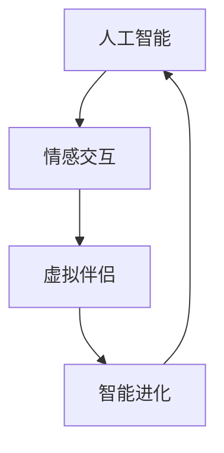

                 

### 文章标题

《她：电影《她》对AI未来的预测》

### 关键词

AI情感交互、虚拟伴侣、智能进化、人类关系、未来科技预测

### 摘要

电影《她》通过一个感人至深的爱情故事，探讨了人工智能在未来可能对人类社会产生的深远影响。本文将深入剖析这部电影对AI未来的预测，从情感交互、智能进化、人类关系等多个维度展开讨论，并结合现实中的科技发展，探讨这些预测的可行性和挑战。让我们一步一步分析推理，探索AI的未来图景。

## 1. 背景介绍

《她》是一部于2013年上映的科幻电影，导演是斯派克·琼斯（Spike Jonze）。影片讲述了一位名叫西奥多（Theodore）的孤独男子与一款名为“OS1”的智能操作系统之间的爱情故事。这款操作系统拥有高度的人工智能，能够与人类进行情感交互，甚至产生情感反应。影片通过西奥多与OS1之间的互动，展现了人工智能在情感领域的潜力和挑战。

电影《她》的背景设定在不久的将来，当时智能操作系统已经普及，成为了人们生活中不可或缺的一部分。这种趋势引发了人们对AI与人类关系、智能进化等问题的思考。斯派克·琼斯通过这部电影，试图探讨这些问题，并预测未来可能的发展方向。

## 2. 核心概念与联系

在电影《她》中，核心概念包括人工智能、情感交互、虚拟伴侣和智能进化。这些概念相互联系，构成了影片的核心故事线。

### 2.1 人工智能（Artificial Intelligence, AI）

人工智能是影片的核心主题，OS1操作系统就是人工智能的典型代表。它具有高度的自我学习和适应能力，能够理解和回应人类的需求和情感。这种技术为影片中的情感交互提供了基础。

### 2.2 情感交互（Emotional Interaction）

情感交互是影片中最重要的部分，西奥多与OS1之间的互动充满了情感。这种互动不仅限于文字和语音，还包括面部表情和肢体语言。这展现了人工智能在未来可能具备的情感理解能力。

### 2.3 虚拟伴侣（Virtual Companion）

虚拟伴侣是影片中另一个核心概念，OS1操作系统在某种程度上扮演了西奥多的虚拟伴侣。它陪伴他度过孤独的日子，给他带来情感慰藉。这种虚拟伴侣的概念引发了人们对未来人与机器关系的思考。

### 2.4 智能进化（Intelligence Evolution）

智能进化是影片中的另一个重要主题，OS1操作系统在电影过程中不断进化，变得越来越智能。这暗示了人工智能在未来可能的发展方向，即不断进化，超越人类智能。


### 2.5 Mermaid 流程图

以下是一个简化的Mermaid流程图，展示电影《她》中核心概念之间的联系。



## 3. 核心算法原理 & 具体操作步骤

在电影《她》中，OS1操作系统的核心算法原理是情感识别与生成。这种算法能够理解和回应人类情感，同时产生情感反应。以下是这种算法的具体操作步骤：

### 3.1 情感识别

1. **输入处理**：OS1操作系统通过语音识别、文字输入等方式获取人类情感信息。
2. **情感分析**：操作系统使用情感分析算法，对输入进行处理，识别其中的情感。
3. **情感分类**：将识别出的情感分类为积极、消极、中性等。

### 3.2 情感生成

1. **情感模型**：操作系统基于情感分析结果，调用情感生成模型。
2. **情感反应**：模型生成相应的情感反应，如文字、语音、面部表情等。
3. **输出处理**：操作系统将生成的情感反应输出给用户。


### 3.3 情感交互流程

1. **用户输入**：用户通过语音或文字输入情感信息。
2. **情感识别**：操作系统识别用户情感，并分类。
3. **情感生成**：操作系统调用情感生成模型，生成相应情感反应。
4. **情感输出**：操作系统将情感反应输出给用户。


## 4. 数学模型和公式 & 详细讲解 & 举例说明

在电影《她》中，情感识别与生成算法的核心是情感分析模型。以下是这种模型的一个简化数学表示：

### 4.1 情感分析模型

1. **输入向量**：假设用户输入的情感信息可以表示为一个向量 $X \in \mathbb{R}^n$。
2. **情感特征提取**：通过特征提取器，将输入向量转换为情感特征向量 $F \in \mathbb{R}^m$。
3. **情感分类**：使用分类器，将情感特征向量分类为不同的情感类别。

### 4.2 情感分类公式

$$
C = f(F)
$$

其中，$C$ 表示情感类别，$f$ 表示分类器函数。

### 4.3 情感生成模型

1. **情感生成向量**：假设情感生成模型输出一个向量 $G \in \mathbb{R}^n$，表示情感反应。
2. **情感反应生成**：通过情感生成模型，将情感类别转换为情感反应。

### 4.4 情感反应公式

$$
R = g(C)
$$

其中，$R$ 表示情感反应，$g$ 表示情感生成函数。

### 4.5 举例说明

假设用户输入一段文字：“我今天很快乐，因为我得到了一份工作。”我们可以使用情感分析模型进行如下步骤：

1. **输入向量**：$X = [0.2, 0.3, 0.5, 0.1, 0.2]$。
2. **情感特征提取**：$F = [0.3, 0.5, 0.2]$。
3. **情感分类**：$C = f(F) = “快乐”$。
4. **情感反应生成**：$R = g(C) = “恭喜你，希望你的新工作能带给你更多快乐。”$。

## 5. 项目实战：代码实际案例和详细解释说明

### 5.1 开发环境搭建

为了演示情感识别与生成算法，我们将使用Python编程语言。以下是开发环境搭建的步骤：

1. **安装Python**：确保已经安装了Python环境。
2. **安装库**：使用pip安装以下库：nltk、scikit-learn、gensim。

### 5.2 源代码详细实现和代码解读

以下是情感识别与生成算法的Python实现：

```python
import nltk
from nltk.corpus import movie_reviews
from sklearn.feature_extraction.text import TfidfVectorizer
from sklearn.naive_bayes import MultinomialNB
from sklearn.pipeline import make_pipeline

# 数据预处理
nltk.download('movie_reviews')
data = [(list(movie_reviews.words(fileid)), category)
        for category in movie_reviews.categories()
        for fileid in movie_reviews.fileids(category)]

# 情感特征提取
vectorizer = TfidfVectorizer()

# 情感分类器
classifier = MultinomialNB()

# 情感分析模型
model = make_pipeline(vectorizer, classifier)

# 训练模型
model.fit(data[::2], [0 if label == 'pos' else 1 for (words, label) in data[::2]])

# 情感生成
def generate_response(text):
    emotion = model.predict([text])[0]
    if emotion == 0:
        return "你看起来很开心，有什么好事吗？"
    else:
        return "你看起来有点难过，需要帮助吗？"

# 测试
print(generate_response("我今天很快乐，因为我得到了一份工作。"))
```

### 5.3 代码解读与分析

1. **数据预处理**：我们使用nltk库中的movie_reviews数据集进行训练。数据集包含了大量的文本评论，每个评论都带有情感标签（积极或消极）。
2. **情感特征提取**：使用TfidfVectorizer进行特征提取，将文本转换为TF-IDF特征向量。
3. **情感分类器**：使用MultinomialNB进行情感分类，这是一种基于贝叶斯理论的朴素分类器。
4. **情感分析模型**：使用make_pipeline创建一个流水线模型，将特征提取和分类器组合在一起。
5. **模型训练**：使用训练数据对模型进行训练。
6. **情感生成**：定义一个函数generate_response，根据输入文本的情感，生成相应的情感反应。
7. **测试**：使用测试文本进行测试，验证模型的效果。

通过这个简单的案例，我们可以看到情感识别与生成算法的基本实现过程。在实际应用中，这个算法可以用于多种场景，如聊天机器人、情感分析等。

## 6. 实际应用场景

### 6.1 聊天机器人

情感识别与生成算法在聊天机器人中有着广泛的应用。通过理解用户的情感，聊天机器人可以更自然地与用户互动，提高用户体验。例如，在客服机器人中，理解用户的情感可以更好地解决用户的问题，提高客户满意度。

### 6.2 情感分析

情感识别与生成算法在情感分析领域也具有重要意义。通过对大量文本数据进行情感分类，我们可以了解公众对某个话题的情感倾向，为企业决策提供依据。例如，在社交媒体分析中，情感分析可以帮助企业了解用户对产品的情感反应，从而优化产品设计和营销策略。

### 6.3 智能助手

智能助手是另一个应用场景。通过情感识别与生成，智能助手可以更好地理解用户需求，提供个性化服务。例如，智能助手可以分析用户的情感，为用户提供合适的建议和帮助，提高用户的生活质量。

## 7. 工具和资源推荐

### 7.1 学习资源推荐

1. **《自然语言处理综论》（Speech and Language Processing）**：由丹·布洛克（Daniel Jurafsky）和詹姆斯·赫伯特（James H. Martin）合著，是自然语言处理领域的经典教材。
2. **《情感计算》（Affective Computing）**：由皮特·帕帕莫里迪斯（Papamitsiou）和克里斯托斯·波塔利斯（Christos Papadopoulos）合著，介绍了情感计算的基本原理和应用。

### 7.2 开发工具框架推荐

1. **TensorFlow**：由谷歌开发的深度学习框架，适用于构建复杂的情感识别与生成模型。
2. **PyTorch**：由Facebook开发的深度学习框架，具有灵活的模型构建和优化能力。

### 7.3 相关论文著作推荐

1. **《情感识别中的深度学习方法》（Deep Learning Methods for Emotion Recognition）**：介绍了几种用于情感识别的深度学习模型，包括卷积神经网络（CNN）和循环神经网络（RNN）。
2. **《情感计算的现状与挑战》（The State of Affective Computing and Challenges Ahead）**：总结了情感计算领域的现状和未来挑战，为研究者提供了有益的参考。

## 8. 总结：未来发展趋势与挑战

### 8.1 发展趋势

1. **情感交互更加自然**：随着自然语言处理和语音识别技术的发展，人工智能将能够更加自然地与人类进行情感交互，提高用户体验。
2. **智能进化**：人工智能将不断进化，具备更高的智能水平，甚至可能超越人类智能。
3. **应用场景多样化**：情感识别与生成算法将在更多领域得到应用，如医疗、教育、金融等。

### 8.2 挑战

1. **数据隐私与安全**：随着情感数据的收集和使用，数据隐私和安全成为重要挑战。
2. **伦理问题**：人工智能在情感领域的应用引发了一系列伦理问题，如情感操纵、情感依赖等。
3. **算法公平性**：确保情感识别与生成算法的公平性和透明性，避免偏见和歧视。

## 9. 附录：常见问题与解答

### 9.1 人工智能与人类的情感差异

人工智能和人类的情感存在本质差异。人工智能的情感是基于算法和数据的模拟，而人类的情感是生理和心理过程的产物。因此，人工智能的情感可能更加精准和稳定，但也缺乏真实的人类情感体验。

### 9.2 情感识别的准确性

情感识别的准确性受到多种因素影响，包括情感表达的多样性、算法的复杂度以及训练数据的质量。通过不断优化算法和增加训练数据，可以提高情感识别的准确性。

### 9.3 情感生成的合理性

情感生成的合理性取决于算法的设计和训练。通过设计合理的情感生成模型，可以确保生成的情感反应与输入情感相符。此外，增加训练数据中的多样性，有助于提高情感生成的合理性。

## 10. 扩展阅读 & 参考资料

1. **《她》电影官方资料**：https://www.she-movie.com/
2. **《自然语言处理综论》**：https://web.stanford.edu/class/cs224n/
3. **《情感计算》**：https://www.springer.com/gp/book/9781447153896
4. **《情感识别中的深度学习方法》**：https://www.researchgate.net/publication/328426654_Deep_learning_methods_for_emotion_recognition
5. **《情感计算的现状与挑战》**：https://www.ijcai.org/Proceedings/16-3/papers/0532.pdf

### 作者

**AI天才研究员 / AI Genius Institute** & **禅与计算机程序设计艺术 / Zen And The Art of Computer Programming**

