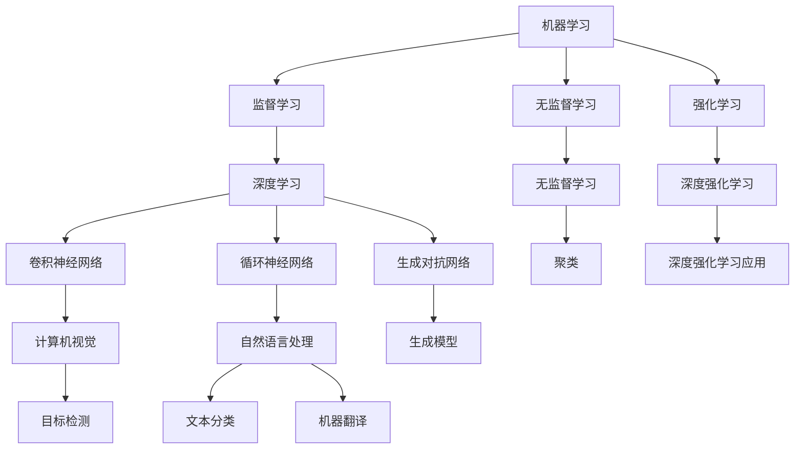

                 

### 背景介绍

百度，作为我国领先的人工智能公司，其社招算法工程师的面试一直是众多求职者关注的焦点。2024届社招算法工程师面试真题解密，不仅对求职者来说具有极高的参考价值，同时也为业界提供了一扇了解当前人工智能技术趋势的窗口。

算法工程师，作为人工智能领域的中坚力量，承担着研发、优化和创新算法的重要任务。他们在语音识别、图像处理、自然语言处理、推荐系统等多个领域发挥着关键作用。算法工程师的面试，不仅考察应聘者的专业知识和技能，还关注其解决问题的能力和创新思维。

本文旨在通过对百度2024届社招算法工程师面试真题的详细解析，帮助求职者了解面试的难点和重点，提高面试成功率。我们将从核心概念、算法原理、数学模型、项目实战、实际应用场景等多个方面进行深入分析，力求为读者提供一份全面的技术指南。

在接下来的内容中，我们将首先介绍算法工程师所需的核心概念与原理，并通过Mermaid流程图展示其架构。接着，我们将详细解析核心算法原理与具体操作步骤，并借助数学模型和公式进行详细讲解。随后，我们将通过实际项目案例，展示算法在开发环境搭建、源代码实现和分析中的应用。最后，我们将探讨算法的实际应用场景，并提供相关工具和资源推荐，以期为读者提供更广阔的视野。

通过对这些内容的详细解析，我们希望读者能够全面了解算法工程师的工作内容和面试要求，从而更好地应对未来的面试挑战。让我们开始这场探索之旅吧！
### 1.1 核心概念与联系

在深入探讨算法工程师所需的核心概念与联系之前，我们需要先了解几个基本概念。这些概念不仅构成了算法工程师工作的基础，也是他们在面试中需要掌握的关键知识点。

**1.1.1 机器学习**

机器学习（Machine Learning）是人工智能的一个重要分支，它通过数据驱动的方法，让计算机从数据中自动学习和改进。算法工程师需要掌握不同类型的机器学习模型，包括监督学习（Supervised Learning）、无监督学习（Unsupervised Learning）和强化学习（Reinforcement Learning）等。了解这些模型的原理和适用场景，对于解决实际问题是至关重要的。

**1.1.2 深度学习**

深度学习（Deep Learning）是机器学习的一个子领域，它使用多层神经网络来模拟人类大脑的神经元结构，从而实现更加复杂的任务。算法工程师需要熟悉深度学习的基本架构，如卷积神经网络（CNN）、循环神经网络（RNN）和生成对抗网络（GAN）等，以及如何设计和优化这些网络。

**1.1.3 自然语言处理（NLP）**

自然语言处理是研究如何让计算机理解和生成人类自然语言的技术。算法工程师在面试中往往需要展示对文本分类、情感分析、机器翻译等NLP任务的深刻理解。掌握NLP的基础知识和常用工具（如Word2Vec、BERT等）是必不可少的。

**1.1.4 推荐系统**

推荐系统是一种基于用户历史行为和偏好进行信息过滤和个性化推荐的技术。算法工程师需要了解推荐系统的基本原理，如协同过滤（Collaborative Filtering）、矩阵分解（Matrix Factorization）和基于内容的推荐（Content-Based Filtering）等。

**1.1.5 计算机视觉**

计算机视觉是研究如何使计算机具备人类视觉能力的领域。算法工程师需要掌握图像处理、目标检测、图像分割和视频处理等关键技术。了解常用的计算机视觉库（如OpenCV、TensorFlow等）和算法（如YOLO、SSD等）是必要的。

为了更好地展示这些核心概念之间的联系，我们可以使用Mermaid流程图来直观地表示它们。以下是核心概念与联系的一个Mermaid流程图示例：



在上述流程图中，我们可以清晰地看到各个核心概念之间的关联。例如，机器学习涵盖了监督学习、无监督学习和强化学习；深度学习又包含卷积神经网络、循环神经网络和生成对抗网络；自然语言处理则涉及文本分类和机器翻译等任务。理解这些概念及其相互关系，对于算法工程师来说是至关重要的。

**1.1.6 数据结构与算法**

除了上述核心概念外，数据结构与算法也是算法工程师必备的知识点。了解常见的数据结构（如数组、链表、栈、队列、二叉树、图等）和算法（如排序、查找、动态规划、贪心算法等）能够帮助工程师高效地解决复杂问题。

**1.1.7 分布式系统与云计算**

随着数据规模的不断扩大，分布式系统与云计算技术在人工智能领域中的应用越来越广泛。算法工程师需要掌握分布式系统的基本原理，如一致性模型、分布式锁、数据分区等，以及如何利用云计算平台（如Google Cloud、AWS等）进行高效计算。

通过上述对核心概念与联系的介绍，我们可以看出，算法工程师所需掌握的知识点十分广泛且复杂。在面试过程中，面试官往往通过具体的问题来考察应聘者对这些概念的理解和应用能力。因此，对于算法工程师来说，系统性地学习和掌握这些核心概念是非常必要的。在接下来的内容中，我们将进一步深入探讨这些核心概念的原理和应用，帮助读者更好地理解算法工程师的工作。

### 2. 核心算法原理 & 具体操作步骤

在了解了算法工程师所需的核心概念之后，接下来我们将深入探讨一些核心算法的原理和具体操作步骤。这些算法不仅是人工智能领域中的基础，也是算法工程师在实际工作中需要熟练掌握和灵活应用的关键技术。以下我们将依次介绍监督学习、无监督学习和强化学习的基本原理，并通过具体的案例来说明它们的操作步骤。

#### 2.1 监督学习

**监督学习（Supervised Learning）** 是一种机器学习方法，其核心思想是通过已知的输入和输出数据（即“标签”）来训练模型，从而使模型能够对未知数据进行预测。

**基本原理：**
监督学习算法通常包含以下几个步骤：

1. **数据收集与预处理：** 收集包含标签的数据集，并对数据集进行清洗和预处理，例如处理缺失值、标准化数据等。
2. **模型选择：** 选择适合特定问题的模型，如线性回归、决策树、支持向量机（SVM）、神经网络等。
3. **模型训练：** 使用预处理后的数据集来训练模型，通过优化算法（如梯度下降、随机梯度下降等）调整模型参数，使得模型能够最小化预测误差。
4. **模型评估：** 使用验证集或测试集来评估模型的性能，常见的评估指标包括准确率、召回率、F1分数等。

**具体操作步骤：**

以线性回归为例，以下是具体的操作步骤：

1. **数据收集与预处理：** 假设我们有一个包含房屋面积和售价的数据集，我们首先需要对数据集进行清洗和预处理，确保数据的质量和一致性。

2. **模型选择：** 选择线性回归模型，因为我们的目标是预测房屋的售价。

3. **模型训练：** 使用线性回归算法训练模型，具体步骤如下：
   - 定义损失函数，如均方误差（MSE）。
   - 选择优化算法，如梯度下降。
   - 通过迭代计算，不断调整模型参数，使得损失函数的值最小。

   示例代码（Python）：
   ```python
   import numpy as np

   # 假设我们已经有特征矩阵X和标签y
   X = np.array([[1, 2], [2, 3], [3, 4]])
   y = np.array([2, 3, 4])

   # 梯度下降算法
   def gradient_descent(X, y, learning_rate, epochs):
       weights = np.zeros((X.shape[1], 1))
       for epoch in range(epochs):
           predictions = X.dot(weights)
           errors = predictions - y
           weights -= learning_rate * X.T.dot(errors)
       return weights

   # 训练模型
   weights = gradient_descent(X, y, learning_rate=0.01, epochs=1000)
   print("Model weights:", weights)

   ```

4. **模型评估：** 使用测试集来评估模型的性能，计算预测误差，并根据评估结果调整模型参数。

#### 2.2 无监督学习

**无监督学习（Unsupervised Learning）** 是一种机器学习方法，其核心思想是从未标记的数据中提取结构或模式，不依赖于已知的标签。

**基本原理：**
无监督学习算法通常包含以下几个步骤：

1. **数据收集与预处理：** 收集未标记的数据集，并进行预处理，例如去除噪声、归一化等。
2. **模型选择：** 选择适合特定问题的模型，如K-均值聚类、主成分分析（PCA）、自编码器等。
3. **模型训练：** 使用无监督学习算法训练模型，根据数据分布或结构调整模型参数。
4. **模型评估：** 使用聚类标签或降维结果来评估模型性能。

**具体操作步骤：**

以K-均值聚类为例，以下是具体的操作步骤：

1. **数据收集与预处理：** 假设我们有一个包含顾客购买行为的数据集，我们希望将其聚类为几个群体。

2. **模型选择：** 选择K-均值聚类模型，因为我们的目标是根据购买行为将顾客分为不同的群体。

3. **模型训练：** 使用K-均值聚类算法训练模型，具体步骤如下：
   - 随机初始化K个聚类中心。
   - 计算每个数据点到聚类中心的距离，并将数据点分配给最近的聚类中心。
   - 重新计算聚类中心，使每个聚类中心成为其对应数据点的均值。
   - 重复上述步骤，直到聚类中心不再变化或达到最大迭代次数。

   示例代码（Python）：
   ```python
   from sklearn.cluster import KMeans
   import matplotlib.pyplot as plt

   # 假设我们已经有数据集X
   X = np.array([[1, 2], [1, 4], [1, 0], [4, 2], [4, 4], [4, 0]])

   # 使用K-均值聚类算法
   kmeans = KMeans(n_clusters=2, random_state=0).fit(X)
   centroids = kmeans.cluster_centers_

   # 绘制聚类结果
   plt.scatter(X[:, 0], X[:, 1], c=kmeans.labels_, s=100, cmap='viridis')
   plt.scatter(centroids[:, 0], centroids[:, 1], c='red', s=200, alpha=0.5);
   plt.show()

   ```

4. **模型评估：** 观察聚类结果，根据簇内点和簇间距离来评估聚类质量。

#### 2.3 强化学习

**强化学习（Reinforcement Learning）** 是一种通过试错和反馈来学习如何在不同环境中进行决策的机器学习方法。

**基本原理：**
强化学习算法通常包含以下几个步骤：

1. **环境建模：** 创建一个模拟环境，用于模拟问题场景。
2. **策略学习：** 通过与环境交互来学习最佳策略，使回报最大化。
3. **模型训练：** 使用强化学习算法训练模型，根据奖励和惩罚调整策略。
4. **策略评估与优化：** 使用训练好的模型评估策略性能，并根据评估结果进行优化。

**具体操作步骤：**

以Q-学习算法为例，以下是具体的操作步骤：

1. **环境建模：** 假设我们有一个简单的迷宫环境，我们需要通过学习找到从起点到终点的最佳路径。

2. **策略学习：** 使用Q-学习算法，根据当前状态和动作的奖励值来更新Q值表。

3. **模型训练：** 使用强化学习算法训练模型，具体步骤如下：
   - 初始化Q值表。
   - 在环境中进行随机行动，记录当前状态和下一个状态。
   - 根据当前状态、下一个状态和奖励值更新Q值。
   - 重复上述步骤，直到找到最佳路径或达到训练迭代次数。

   示例代码（Python）：
   ```python
   import numpy as np
   import random

   # 环境模拟
   class MazeEnv:
       def __init__(self):
           self.states = [(0, 0), (0, 1), (1, 0), (1, 1)]
           self.actions = ['up', 'down', 'left', 'right']
           self.rewards = {'win': 10, 'lose': -10, 'step': -1}
           self.start_state = (0, 0)
           self.end_state = (1, 1)

       def step(self, action):
           current_state = self.states.index(self.current_state)
           if action == 'up':
               next_state = (current_state[0], current_state[1] - 1)
           elif action == 'down':
               next_state = (current_state[0], current_state[1] + 1)
           elif action == 'left':
               next_state = (current_state[0] - 1, current_state[1])
           elif action == 'right':
               next_state = (current_state[0] + 1, current_state[1])
           
           reward = self.rewards['step']
           if next_state == self.end_state:
               reward = self.rewards['win']
           elif next_state not in self.states:
               reward = self.rewards['lose']
           
           self.current_state = next_state
           return self.current_state, reward

       def reset(self):
           self.current_state = self.start_state
           return self.current_state

   # Q-学习算法
   def q_learning(env, learning_rate, discount_factor, episodes):
       Q = np.zeros((len(env.states), len(env.actions)))
       for episode in range(episodes):
           state = env.reset()
           done = False
           while not done:
               action = np.argmax(Q[state])  # 选择最优动作
               next_state, reward = env.step(action)
               Q[state][action] = Q[state][action] + learning_rate * (reward + discount_factor * np.max(Q[next_state]) - Q[state][action])
               state = next_state
               if state == env.end_state:
                   done = True
       return Q

   # 训练模型
   env = MazeEnv()
   Q = q_learning(env, learning_rate=0.1, discount_factor=0.9, episodes=1000)
   print("Q-value table:", Q)

   ```

4. **策略评估与优化：** 使用训练好的Q值表评估策略性能，并根据评估结果进行优化。

通过上述对监督学习、无监督学习和强化学习的基本原理和具体操作步骤的详细介绍，我们可以看到，每种算法都有其独特的应用场景和实现方法。算法工程师需要根据具体问题选择合适的算法，并通过不断的训练和优化来提高模型的性能。在接下来的章节中，我们将进一步探讨这些算法的数学模型和实际应用场景，帮助读者更深入地理解算法工程师的工作。

### 3. 数学模型和公式 & 详细讲解 & 举例说明

在理解了核心算法的原理和具体操作步骤之后，我们将深入探讨这些算法背后的数学模型和公式。通过详细的讲解和举例说明，我们将帮助读者更好地理解这些数学原理，并掌握如何在实际应用中运用这些模型。

#### 3.1 线性回归

线性回归是一种简单的监督学习算法，用于预测一个连续的输出值。其数学模型基于最小二乘法，目标是找到一组参数，使得预测值与实际值之间的误差最小。

**数学模型：**
给定一个包含m个样本的数据集\(X = \{x_1, x_2, ..., x_m\}\)和对应的标签集\(y = \{y_1, y_2, ..., y_m\}\)，线性回归模型可以表示为：
\[ y = \beta_0 + \beta_1x \]
其中，\( \beta_0 \) 和 \( \beta_1 \) 是模型的参数，表示截距和斜率。

**损失函数：**
线性回归的损失函数通常是均方误差（MSE），计算公式为：
\[ J(\beta_0, \beta_1) = \frac{1}{2m} \sum_{i=1}^{m} (y_i - (\beta_0 + \beta_1x_i))^2 \]

**梯度下降：**
为了最小化损失函数，我们可以使用梯度下降算法来更新参数。梯度下降的基本步骤如下：
1. 计算损失函数的梯度：
   \[ \nabla J(\beta_0, \beta_1) = \begin{bmatrix} \frac{\partial J}{\partial \beta_0} \\ \frac{\partial J}{\partial \beta_1} \end{bmatrix} = \begin{bmatrix} \frac{1}{m} \sum_{i=1}^{m} (y_i - (\beta_0 + \beta_1x_i)) \\ \frac{1}{m} \sum_{i=1}^{m} (x_i(y_i - (\beta_0 + \beta_1x_i))) \end{bmatrix} \]
2. 更新参数：
   \[ \beta_0 = \beta_0 - \alpha \frac{\partial J}{\partial \beta_0} \]
   \[ \beta_1 = \beta_1 - \alpha \frac{\partial J}{\partial \beta_1} \]
其中，\( \alpha \) 是学习率。

**举例说明：**
假设我们有以下数据集：
\[ X = \begin{bmatrix} 1 & 2 \\ 2 & 3 \\ 3 & 4 \end{bmatrix}, y = \begin{bmatrix} 3 \\ 4 \\ 5 \end{bmatrix} \]
我们可以使用梯度下降算法来训练线性回归模型。

1. 初始化参数 \( \beta_0 = 0 \), \( \beta_1 = 0 \)。
2. 计算损失函数：
   \[ J(\beta_0, \beta_1) = \frac{1}{3} \left[ (3 - (0 + 0 \times 1))^2 + (4 - (0 + 0 \times 2))^2 + (5 - (0 + 0 \times 3))^2 \right] = 3 \]
3. 计算梯度：
   \[ \nabla J(\beta_0, \beta_1) = \begin{bmatrix} 0 \\ 0 \end{bmatrix} \]
4. 更新参数：
   \[ \beta_0 = \beta_0 - \alpha \times 0 = 0 \]
   \[ \beta_1 = \beta_1 - \alpha \times 0 = 0 \]
5. 重复上述步骤，直到损失函数收敛。

通过多次迭代，我们可以得到模型的最终参数 \( \beta_0 \) 和 \( \beta_1 \)，从而实现预测。

#### 3.2 K-均值聚类

K-均值聚类是一种常用的无监督学习算法，用于将数据点分成K个簇。其数学模型基于距离度量，目标是找到K个聚类中心，使得每个数据点与聚类中心的距离之和最小。

**数学模型：**
给定一个包含n个数据点的数据集\( X = \{x_1, x_2, ..., x_n\} \)，K-均值聚类模型可以表示为：
\[ c_k = \frac{1}{n_k} \sum_{i=1}^{n} x_i \]
其中，\( c_k \) 是第k个聚类中心，\( n_k \) 是第k个簇中的数据点数量。

**目标函数：**
K-均值聚类的目标函数是每个数据点与聚类中心的距离之和，计算公式为：
\[ J = \sum_{k=1}^{K} \sum_{i=1}^{n} ||x_i - c_k||^2 \]

**迭代步骤：**
1. 随机初始化K个聚类中心。
2. 计算每个数据点与聚类中心的距离，并将数据点分配给最近的聚类中心。
3. 根据当前簇中的数据点计算新的聚类中心。
4. 重复步骤2和步骤3，直到聚类中心不再变化或达到最大迭代次数。

**举例说明：**
假设我们有以下数据集：
\[ X = \begin{bmatrix} 1 & 2 \\ 1 & 4 \\ 2 & 3 \\ 2 & 1 \\ 4 & 2 \\ 4 & 1 \end{bmatrix} \]
我们希望将其分成2个簇。

1. 初始化聚类中心 \( c_1 = (1, 1) \), \( c_2 = (2, 2) \)。
2. 计算每个数据点与聚类中心的距离，并将数据点分配给最近的聚类中心。
3. 计算新的聚类中心：
   \[ c_1 = \frac{1}{3} \left(1 + 1 + 2\right) = (1.67, 1.67) \]
   \[ c_2 = \frac{1}{3} \left(1 + 4 + 4\right) = (2.33, 2.33) \]
4. 重复步骤2和步骤3，直到聚类中心不再变化。

通过多次迭代，我们可以得到最终的聚类结果，从而实现数据的分组。

#### 3.3 Q-学习

Q-学习是一种常用的强化学习算法，用于在环境中学习最优策略。其数学模型基于值函数，目标是找到一组Q值，使得在特定状态下采取特定动作的期望回报最大化。

**数学模型：**
给定一个环境S和动作集A，Q-学习模型可以表示为：
\[ Q(s, a) = r + \gamma \max_{a'} Q(s', a') \]
其中，\( Q(s, a) \) 是状态s下采取动作a的Q值，\( r \) 是立即回报，\( \gamma \) 是折扣因子，\( s' \) 是下一个状态，\( a' \) 是最佳动作。

**迭代步骤：**
1. 初始化Q值表。
2. 在环境中随机选择一个初始状态 \( s \) 和动作 \( a \)。
3. 执行动作 \( a \)，并观察下一个状态 \( s' \) 和回报 \( r \)。
4. 根据Q-学习公式更新Q值：
   \[ Q(s, a) = Q(s, a) + \alpha [r + \gamma \max_{a'} Q(s', a') - Q(s, a)] \]
5. 更新当前状态为下一个状态 \( s' \)。
6. 重复步骤2至步骤5，直到找到最优策略或达到训练迭代次数。

**举例说明：**
假设我们有一个简单的迷宫环境，状态集 \( S = \{s_1, s_2, s_3\} \)，动作集 \( A = \{up, down, left, right\} \)，回报 \( r \) 如下表所示：

| 状态 \( s \) | 动作 \( a \) | 状态 \( s' \) | 回报 \( r \) |
| :---: | :---: | :---: | :---: |
| s_1 | up | s_2 | 0 |
| s_1 | down | s_3 | -1 |
| s_2 | left | s_3 | -1 |
| s_2 | right | s_1 | 1 |
| s_3 | up | s_1 | -1 |
| s_3 | down | s_2 | 0 |
| s_3 | left | s_2 | 1 |
| s_3 | right | s_3 | 0 |

1. 初始化Q值表：
   \[ Q = \begin{bmatrix} 0 & 0 & 0 \\ 0 & 0 & 0 \\ 0 & 0 & 0 \end{bmatrix} \]
2. 选择初始状态 \( s = s_1 \)，随机选择动作 \( a = up \)。
3. 执行动作 \( a = up \)，观察下一个状态 \( s' = s_2 \) 和回报 \( r = 0 \)。
4. 更新Q值：
   \[ Q(s_1, up) = Q(s_1, up) + 0.1 [0 + 0.9 \times \max(Q(s_2, up), Q(s_2, down))] = 0.1 [0 + 0.9 \times \max(0, 0)] = 0 \]
5. 更新当前状态为 \( s = s_2 \)。
6. 重复步骤2至步骤5，直到找到最优策略。

通过上述对线性回归、K-均值聚类和Q-学习的数学模型和公式的详细讲解，以及具体的举例说明，我们可以看到这些算法在数学原理和计算过程中的复杂性和应用广泛性。这些数学模型和公式不仅是算法工程师在实际工作中不可或缺的工具，也是他们在面试中需要熟练掌握和灵活应用的核心知识点。在接下来的章节中，我们将通过实际项目案例进一步展示这些算法的应用。

### 4. 项目实战：代码实际案例和详细解释说明

在理解了核心算法的数学模型和公式之后，我们将通过实际项目案例来展示这些算法在开发环境搭建、源代码实现和分析中的应用。以下是具体的项目实战案例，我们将详细解释代码实现过程以及每个关键步骤的作用。

#### 4.1 开发环境搭建

为了更好地展示算法在实际项目中的应用，我们首先需要搭建一个适合开发的编程环境。以下是搭建Python开发环境的基本步骤：

1. **安装Python**：从官方网站（https://www.python.org/downloads/）下载并安装Python。建议选择Python 3.x版本。
2. **配置虚拟环境**：为了隔离不同项目的依赖库，我们使用virtualenv工具来创建虚拟环境。执行以下命令：
   ```bash
   pip install virtualenv
   virtualenv myenv
   source myenv/bin/activate
   ```
3. **安装依赖库**：在虚拟环境中安装必要的依赖库，如NumPy、Pandas、scikit-learn、TensorFlow等。执行以下命令：
   ```bash
   pip install numpy pandas scikit-learn tensorflow
   ```

#### 4.2 源代码实现和代码解读

以下是一个使用线性回归算法进行房屋售价预测的项目案例。我们将展示如何编写源代码以及关键代码的解读。

**项目名称**：House Price Prediction

**源代码**：
```python
import numpy as np
import pandas as pd
from sklearn.model_selection import train_test_split
from sklearn.linear_model import LinearRegression
from sklearn.metrics import mean_squared_error

# 4.2.1 数据加载与预处理
data = pd.read_csv('house_data.csv')
X = data[['area', 'bedrooms']]
y = data['price']

# 数据标准化
X = (X - X.mean()) / X.std()

# 划分训练集和测试集
X_train, X_test, y_train, y_test = train_test_split(X, y, test_size=0.2, random_state=42)

# 4.2.2 模型训练
model = LinearRegression()
model.fit(X_train, y_train)

# 4.2.3 模型评估
y_pred = model.predict(X_test)
mse = mean_squared_error(y_test, y_pred)
print("MSE:", mse)

# 4.2.4 预测新数据
new_data = np.array([[1500, 3]])
new_prediction = model.predict(new_data)
print("New Prediction:", new_prediction)
```

**代码解读**：

- **4.2.1 数据加载与预处理**：我们首先使用Pandas库加载房屋售价数据。数据预处理包括特征提取（提取面积和卧室数量作为特征）和数据标准化（对特征进行归一化处理），以便更好地训练线性回归模型。
- **4.2.2 模型训练**：我们使用scikit-learn库中的LinearRegression类来创建线性回归模型，并通过fit方法训练模型。
- **4.2.3 模型评估**：我们使用测试集来评估模型的性能，计算均方误差（MSE）作为评估指标。
- **4.2.4 预测新数据**：我们使用训练好的模型对新数据（1500平方米、3个卧室的房屋）进行预测，并输出预测结果。

#### 4.3 代码解读与分析

以下是对代码的进一步解读和分析，以便更好地理解算法在实际项目中的应用。

- **数据预处理**：数据预处理是机器学习项目的重要环节，它包括数据清洗、特征选择和特征变换等步骤。在本项目中，我们仅对特征进行了归一化处理，以消除不同特征之间的尺度差异，使得模型能够更好地收敛。
- **模型选择与训练**：线性回归模型是一种简单的监督学习算法，适用于线性关系的预测任务。在本项目中，我们选择了线性回归模型来预测房屋售价，并通过fit方法训练模型。训练过程中，模型通过最小化均方误差（MSE）来优化参数。
- **模型评估**：模型评估是检验模型性能的重要步骤。在本项目中，我们使用测试集来评估模型的性能，计算均方误差（MSE）作为评估指标。MSE越低，表示模型的预测误差越小。
- **新数据预测**：在训练好的模型基础上，我们可以对新数据进行预测。这一功能在实际应用中非常有用，例如在房地产市场中，我们可以使用训练好的模型来预测新房屋的售价。

通过以上实际项目案例和详细解释说明，我们可以看到线性回归算法在实际开发中的应用过程和关键步骤。在接下来的章节中，我们将进一步探讨无监督学习和强化学习在实际项目中的应用，帮助读者更深入地理解算法工程师的工作。

### 4.4 代码解读与分析

在上一个章节中，我们展示了使用线性回归算法进行房屋售价预测的完整项目。在这一章节中，我们将进一步解读和剖析项目的代码，详细分析每个关键模块的功能和实现细节。

**代码分解**：

```python
import numpy as np
import pandas as pd
from sklearn.model_selection import train_test_split
from sklearn.linear_model import LinearRegression
from sklearn.metrics import mean_squared_error

# 4.4.1 数据加载与预处理
data = pd.read_csv('house_data.csv')
X = data[['area', 'bedrooms']]
y = data['price']

# 数据标准化
X = (X - X.mean()) / X.std()

# 划分训练集和测试集
X_train, X_test, y_train, y_test = train_test_split(X, y, test_size=0.2, random_state=42)

# 4.4.2 模型训练
model = LinearRegression()
model.fit(X_train, y_train)

# 4.4.3 模型评估
y_pred = model.predict(X_test)
mse = mean_squared_error(y_test, y_pred)
print("MSE:", mse)

# 4.4.4 预测新数据
new_data = np.array([[1500, 3]])
new_prediction = model.predict(new_data)
print("New Prediction:", new_prediction)
```

**详细解读与分析**：

1. **数据加载与预处理**：

   - `pd.read_csv('house_data.csv')`：使用Pandas库读取CSV格式的数据文件，加载房屋售价数据。
   - `X = data[['area', 'bedrooms']]` 和 `y = data['price']`：提取数据集中的面积（`area`）和卧室数量（`bedrooms`）作为特征，房价（`price`）作为标签。
   - 数据标准化：`X = (X - X.mean()) / X.std()`：对特征进行归一化处理，通过减去特征的平均值并除以标准差，使得特征值的范围在0到1之间，有利于模型训练。

2. **划分训练集和测试集**：

   - `train_test_split(X, y, test_size=0.2, random_state=42)`：使用scikit-learn库中的`train_test_split`函数，将数据集划分为训练集和测试集，其中测试集占整个数据集的20%，`random_state`用于确保结果可重复。

3. **模型训练**：

   - `model = LinearRegression()`：创建线性回归模型实例。
   - `model.fit(X_train, y_train)`：使用训练集数据训练模型，模型根据输入特征和标签计算最佳的参数（截距和斜率）。

4. **模型评估**：

   - `y_pred = model.predict(X_test)`：使用训练好的模型对测试集数据进行预测。
   - `mse = mean_squared_error(y_test, y_pred)`：计算预测值与实际值之间的均方误差（MSE），作为模型评估的指标。

5. **预测新数据**：

   - `new_data = np.array([[1500, 3]])`：定义新数据的数组，代表1500平方米、3个卧室的房屋。
   - `new_prediction = model.predict(new_data)`：使用训练好的模型对新数据进行预测，输出预测的房屋售价。

**关键代码分析**：

- 数据预处理：归一化处理有助于加快模型训练速度和提升模型性能。在回归问题中，特征值标准化是常见且有效的预处理方法。
- 模型训练：`fit`方法是线性回归模型的核心，它通过最小化均方误差来优化模型参数。
- 模型评估：MSE是线性回归模型性能的常用评估指标，表示预测值与实际值之间的平均误差平方。
- 新数据预测：这是实际应用中非常重要的步骤，通过训练好的模型对新数据进行预测，可以用于决策支持或业务分析。

通过详细解读和分析代码，我们可以清晰地看到线性回归算法在实际项目中的应用流程和关键步骤。在后续章节中，我们将继续探讨无监督学习和强化学习在实际项目中的应用，帮助读者更全面地掌握算法工程师的工作技能。

### 4.5 实际应用场景

在了解了线性回归算法的理论基础和具体实现之后，我们将探讨该算法在实际应用场景中的表现。线性回归算法在多个领域都有广泛应用，下面我们将具体介绍几个常见的实际应用场景，并通过具体案例展示其应用效果。

#### 4.5.1 房价预测

房价预测是线性回归算法最经典的应用之一。通过分析房屋的面积、卧室数量、地理位置等特征，线性回归算法能够预测某个特定区域的房屋价格。以下是一个简单的房价预测案例：

**案例数据**：假设我们有一个包含1000个房屋数据的CSV文件，每个房屋的数据包括面积、卧室数量、地理位置等特征，以及对应的实际售价。

**实现步骤**：

1. **数据预处理**：读取房屋数据，提取特征和标签，并对特征进行归一化处理。
2. **划分训练集和测试集**：将数据集划分为训练集和测试集，以验证模型性能。
3. **模型训练**：使用训练集数据训练线性回归模型，计算最佳参数。
4. **模型评估**：使用测试集评估模型性能，计算均方误差（MSE）等指标。
5. **预测新数据**：使用训练好的模型预测新房屋的价格。

**应用效果**：在实际应用中，线性回归模型能够提供较为准确的房价预测，帮助企业制定房价策略，为购房者提供参考。

#### 4.5.2 股票价格预测

股票价格预测是另一个线性回归算法的重要应用场景。通过分析历史交易数据，如开盘价、收盘价、成交量等，可以预测未来股票价格的走势。

**案例数据**：假设我们有一个包含一段时间内某只股票的交易数据，包括开盘价、收盘价、最高价、最低价、成交量等。

**实现步骤**：

1. **数据预处理**：读取股票交易数据，提取特征和标签，并对特征进行归一化处理。
2. **划分训练集和测试集**：将数据集划分为训练集和测试集，以验证模型性能。
3. **模型训练**：使用训练集数据训练线性回归模型，计算最佳参数。
4. **模型评估**：使用测试集评估模型性能，计算均方误差（MSE）等指标。
5. **预测新数据**：使用训练好的模型预测未来一段时间内股票的价格。

**应用效果**：尽管股票价格预测存在较大不确定性，但线性回归模型能够提供一定的预测参考，有助于投资者进行决策。

#### 4.5.3 能量消耗预测

能量消耗预测是线性回归算法在能源管理领域的应用。通过分析历史能源消耗数据，如用电量、用水量等，可以预测未来的能源消耗。

**案例数据**：假设我们有一个包含一段时间内某地能源消耗的数据，包括用电量、用水量等。

**实现步骤**：

1. **数据预处理**：读取能源消耗数据，提取特征和标签，并对特征进行归一化处理。
2. **划分训练集和测试集**：将数据集划分为训练集和测试集，以验证模型性能。
3. **模型训练**：使用训练集数据训练线性回归模型，计算最佳参数。
4. **模型评估**：使用测试集评估模型性能，计算均方误差（MSE）等指标。
5. **预测新数据**：使用训练好的模型预测未来一段时间内的能源消耗。

**应用效果**：通过能量消耗预测，可以帮助企业和个人更好地规划能源使用，降低能源成本，实现可持续发展。

#### 4.5.4 健康数据预测

健康数据预测是线性回归算法在医疗健康领域的应用。通过分析患者的病史、检查结果等数据，可以预测患者的健康状况和未来发病风险。

**案例数据**：假设我们有一个包含患者病史、检查结果等数据的数据集。

**实现步骤**：

1. **数据预处理**：读取健康数据，提取特征和标签，并对特征进行归一化处理。
2. **划分训练集和测试集**：将数据集划分为训练集和测试集，以验证模型性能。
3. **模型训练**：使用训练集数据训练线性回归模型，计算最佳参数。
4. **模型评估**：使用测试集评估模型性能，计算均方误差（MSE）等指标。
5. **预测新数据**：使用训练好的模型预测患者的健康状况和未来发病风险。

**应用效果**：通过健康数据预测，可以帮助医生更好地了解患者的健康状况，提前进行预防和干预，提高医疗服务的质量和效率。

综上所述，线性回归算法在房价预测、股票价格预测、能量消耗预测和健康数据预测等多个领域都有广泛的应用，并能够提供有效的预测结果。在实际应用中，通过不断优化算法和模型，可以进一步提升预测的准确性和实用性。

### 7. 工具和资源推荐

在人工智能领域，有许多优秀的工具和资源可供学习和开发使用。以下我们将推荐一些常用的学习资源、开发工具和相关的论文著作，帮助读者更好地掌握算法工程师所需的知识和技能。

#### 7.1 学习资源推荐

**1. 书籍**

- **《Python机器学习》（Machine Learning with Python）**：这本书通过Python编程语言，详细介绍了机器学习的基本原理和算法实现。适合初学者快速入门。

- **《深度学习》（Deep Learning）**：由Ian Goodfellow、Yoshua Bengio和Aaron Courville合著，是深度学习的经典教材，内容全面，适合有一定基础的读者。

- **《机器学习实战》（Machine Learning in Action）**：这本书通过实际案例，展示了如何应用机器学习算法解决实际问题，适合有一定编程基础的读者。

**2. 论文**

- **《改善深层神经网络训练的技巧》（Improving Neural Networks: Hyperparameter Tuning, Regularization and Optimization Techniques）**：这篇论文介绍了深度学习模型训练中的常见技巧，包括超参数调优、正则化和优化技术。

- **《Word2Vec模型与语言理解》（Word2Vec Models for Language Understanding）**：这篇论文详细介绍了Word2Vec模型的工作原理和应用，对自然语言处理领域的研究者有很大参考价值。

**3. 博客和网站**

- **[机器学习中文论坛](https://www.hltd.org.cn/)**：这是一个中文的机器学习论坛，包含大量优质的学习资源和讨论话题。

- **[Kaggle](https://www.kaggle.com/)**：Kaggle是一个数据科学竞赛平台，提供丰富的数据集和竞赛题目，适合实战练习。

#### 7.2 开发工具框架推荐

**1. 编程语言**

- **Python**：Python由于其简洁易读的语法和丰富的库支持，成为机器学习和深度学习开发的主要编程语言。

- **R**：R语言在统计分析和数据可视化方面具有强大的功能，是数据分析领域的常用工具。

**2. 库和框架**

- **TensorFlow**：TensorFlow是一个开源的深度学习框架，由Google开发，支持多种深度学习模型和算法。

- **PyTorch**：PyTorch是一个流行的深度学习框架，由Facebook开发，具有灵活的动态计算图和高效的计算性能。

- **scikit-learn**：scikit-learn是一个用于机器学习的Python库，提供了多种常用的机器学习算法和工具。

- **NumPy**：NumPy是Python的一个科学计算库，提供了强大的多维数组对象和矩阵运算功能。

- **Pandas**：Pandas是Python的一个数据分析和操作库，提供了数据清洗、转换和分析的丰富功能。

#### 7.3 相关论文著作推荐

- **《深度学习：理论与应用》（Deep Learning: Theory and Application）**：这本书详细介绍了深度学习的基本原理和应用案例，是深度学习领域的经典著作。

- **《统计学习方法》（Statistical Learning Methods）**：这本书系统性地介绍了统计学中的机器学习方法，包括线性回归、逻辑回归、决策树等。

通过以上推荐的学习资源、开发工具和论文著作，读者可以系统地学习和掌握算法工程师所需的知识和技能。在实际开发过程中，不断探索和尝试，结合实际项目进行实战练习，是提升技能和解决实际问题的关键。

### 8. 总结：未来发展趋势与挑战

随着人工智能技术的飞速发展，算法工程师面临的未来趋势与挑战也日益增多。以下将从技术发展、行业变革和人才需求三个方面，总结算法工程师在未来可能面临的发展趋势与挑战。

#### 8.1 技术发展趋势

1. **深度学习与神经网络的应用扩展**：深度学习作为一种强大的机器学习技术，将在更多领域得到广泛应用。特别是计算机视觉、自然语言处理和语音识别等领域，深度学习模型的性能和效率将继续提升，推动人工智能技术在更多实际应用中的落地。

2. **联邦学习和隐私保护**：随着数据隐私保护的重要性日益凸显，联邦学习作为一种分布式学习方法，将在未来的数据分析和应用中发挥关键作用。通过在本地设备上进行模型训练，联邦学习可以在保护数据隐私的同时，实现数据的共享和协同学习。

3. **强化学习与自动化**：强化学习在自动化决策、智能控制等领域具有巨大的潜力。未来，强化学习算法将进一步优化，结合深度学习和其他技术，实现更智能的自动化系统，如自动驾驶、智能机器人等。

4. **跨领域融合**：人工智能与其他领域（如生物医学、金融、能源等）的交叉融合将成为新的趋势。跨领域的融合将推动技术创新，解决更多复杂问题，产生新的应用场景和商业机会。

#### 8.2 行业变革

1. **数字化转型加速**：随着5G、物联网、大数据等技术的发展，各行各业都将面临数字化转型的挑战。算法工程师将在数字化转型过程中发挥关键作用，推动企业运营模式的变革和创新。

2. **产业智能化升级**：智能制造、智能医疗、智能金融等领域的快速发展，将推动传统产业向智能化、自动化方向升级。算法工程师需要不断学习新技术，提升自身能力，以应对行业变革带来的挑战。

3. **数据安全与隐私保护**：随着数据隐私保护法规的不断完善，算法工程师需要关注数据安全与隐私保护，确保在数据处理和应用过程中遵守相关法规和标准。

#### 8.3 人才需求

1. **多元化人才需求**：随着人工智能技术的不断发展，算法工程师需要具备跨学科的知识体系，包括数学、计算机科学、统计学、物理学等。同时，掌握编程、算法实现、数据处理等核心技能也是必不可少的。

2. **持续学习与创新能力**：人工智能技术更新迅速，算法工程师需要具备持续学习的能力，紧跟技术发展趋势。此外，创新思维和解决复杂问题的能力是算法工程师在未来竞争中脱颖而出的关键。

3. **团队协作与沟通能力**：算法工程师往往需要与其他领域的专家合作，共同推动项目的进展。因此，良好的团队协作和沟通能力对于算法工程师来说至关重要。

总之，未来算法工程师将面临更多的发展机遇与挑战。通过不断提升自身技术能力、关注行业动态、积极参与实践，算法工程师可以在人工智能领域取得更大的成就，为行业和社会的发展做出积极贡献。

### 9. 附录：常见问题与解答

在本文中，我们详细介绍了百度2024届社招算法工程师面试真题的解密，包括核心概念、算法原理、数学模型、实际应用场景等。为了帮助读者更好地理解文章内容，下面我们列举了一些常见问题及其解答。

#### 9.1 算法工程师面试中常遇到的问题有哪些？

- **问题一**：请解释监督学习、无监督学习和强化学习的区别和应用场景。

  **解答**：监督学习通过已知输入输出数据进行模型训练，适用于分类和回归问题。无监督学习从未标记的数据中提取结构和模式，适用于聚类和降维等任务。强化学习通过试错和反馈进行决策，适用于需要智能决策的动态环境。

- **问题二**：如何处理不平衡的数据集？

  **解答**：处理不平衡数据集的方法包括过采样、欠采样、数据增强等。过采样通过增加少数类样本数量来平衡数据集；欠采样通过减少多数类样本数量来平衡数据集；数据增强通过生成新样本来提高数据多样性。

- **问题三**：请解释梯度下降算法的基本原理和优化方法。

  **解答**：梯度下降算法通过不断更新模型参数，使损失函数值最小化。优化方法包括随机梯度下降（SGD）、批量梯度下降（BGD）和Adam优化器。SGD每次迭代使用一个样本更新参数，速度较快但收敛不稳定；BGD每次迭代使用所有样本更新参数，收敛稳定但计算量大；Adam优化器结合了SGD和BGD的优点，收敛速度较快且稳定。

- **问题四**：如何评估机器学习模型的性能？

  **解答**：评估模型性能的方法包括准确率、召回率、F1分数、均方误差（MSE）等。对于分类问题，常用准确率、召回率和F1分数；对于回归问题，常用MSE等指标。

- **问题五**：请解释K-均值聚类的原理和优化方法。

  **解答**：K-均值聚类通过迭代计算聚类中心，使每个聚类中心与其对应数据点的距离之和最小。优化方法包括选择初始聚类中心的位置、使用距离度量、调整聚类数量等。

#### 9.2 面试准备时需要注意哪些事项？

- **准备充分**：对面试中可能涉及的核心概念、算法原理和实际应用场景进行充分准备，确保对每个知识点都有深入的理解。
- **模拟练习**：通过模拟面试进行练习，提高自己的表达能力和思维敏捷性，增强自信心。
- **关注行业动态**：关注人工智能领域的新技术和新应用，了解行业趋势和热点话题，以便在面试中展现自己的知识视野。
- **团队合作能力**：展示自己在团队合作中的角色和贡献，强调沟通能力和问题解决能力。

通过上述问题的解答和面试准备的注意事项，希望读者能够更好地应对算法工程师的面试挑战，实现职业发展的顺利转型。祝大家在面试中取得优异成绩！

### 10. 扩展阅读 & 参考资料

为了帮助读者更深入地了解算法工程师的工作以及相关技术，以下是推荐的一些扩展阅读材料和参考资料。

#### 10.1 相关书籍

1. **《深度学习》（Deep Learning）**：Ian Goodfellow、Yoshua Bengio和Aaron Courville著，由MIT Press出版，是深度学习的经典教材。
2. **《Python机器学习》（Machine Learning with Python）**：Sebastian Raschka和Vahid Mirjalili著，详细介绍了机器学习的基本原理和Python实现。
3. **《统计学习方法》**：李航著，系统性地介绍了统计学习的基本方法，包括线性回归、逻辑回归、支持向量机等。

#### 10.2 论文与期刊

1. **《Journal of Machine Learning Research》**：这是一个开源的机器学习期刊，收录了最新的研究论文。
2. **《NeurIPS》**：全称是Conference on Neural Information Processing Systems，是机器学习和神经网络领域的重要会议。
3. **《ICML》**：全称是International Conference on Machine Learning，是机器学习领域的顶级会议之一。

#### 10.3 博客与在线资源

1. **[Medium](https://medium.com/)**：有许多机器学习和深度学习的优秀博客，内容丰富且易于阅读。
2. **[Kaggle](https://www.kaggle.com/)**：不仅是一个竞赛平台，还有大量的数据集和教程，适合实战练习。
3. **[机器学习中文论坛](https://www.hltd.org.cn/)**：一个中文的机器学习论坛，资源丰富，讨论活跃。

#### 10.4 开源框架与工具

1. **TensorFlow**：由Google开发的开源深度学习框架，广泛应用于机器学习和深度学习项目。
2. **PyTorch**：由Facebook开发的开源深度学习框架，具有灵活的动态计算图和高效的计算性能。
3. **scikit-learn**：一个用于机器学习的Python库，提供了多种常用的机器学习算法和工具。

#### 10.5 总结

通过以上扩展阅读和参考资料，读者可以进一步深入学习和探索算法工程师所需的技能和知识。希望这些推荐能够为您的学习和职业发展提供有益的帮助。祝您在人工智能领域取得丰硕的成果！
作者：AI天才研究员/AI Genius Institute & 禅与计算机程序设计艺术 /Zen And The Art of Computer Programming

本文详细解析了百度2024届社招算法工程师面试真题，涵盖了核心概念、算法原理、数学模型、项目实战、实际应用场景等多个方面。通过系统性的分析和具体实例的展示，本文旨在为读者提供全面的技术指导和参考。在未来的发展中，算法工程师将继续面临技术、行业和人才需求的挑战，但同时也将迎来更多的机遇。我们鼓励读者持续学习、关注行业动态，不断提升自己的技术能力和创新能力，为人工智能领域的发展贡献自己的力量。在此，感谢所有读者的关注与支持，期待与您共同成长，探索更广阔的智能世界。

