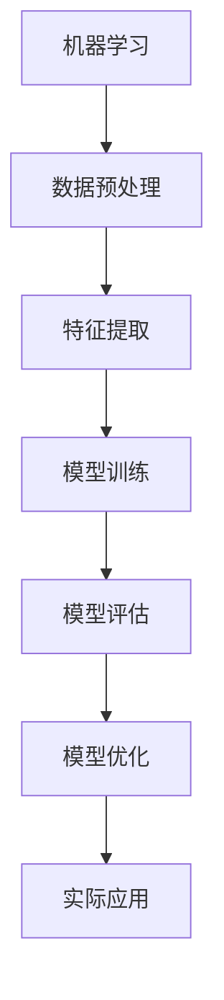

                 

# 百度2025社招机器学习工程师算法题集锦

> **关键词**：机器学习、算法题集、社招、面试、实战案例、深度学习

> **摘要**：本文旨在整理和总结百度2025社招机器学习工程师的算法题集，帮助求职者更好地准备面试。通过详细解析题目背景、核心概念、算法原理、数学模型、实际应用场景和工具资源，本文为读者提供了一个全面的解题指南。

## 1. 背景介绍

百度作为全球领先的互联网公司，其社招机器学习工程师的面试题目往往具有较高的技术难度和深度。这些题目不仅考查了求职者的算法基础，还涉及到了实际应用场景和前沿技术。本文将针对百度2025社招机器学习工程师的算法题集，进行详细解析，以帮助求职者更好地准备面试。

### 面试题集特点

- **高难度**：题目设计难度较大，需要求职者具备扎实的算法基础和实际项目经验。
- **实战性**：题目与实际应用场景紧密相关，考察求职者的解决实际问题的能力。
- **深度学习**：题目涵盖了深度学习、自然语言处理、计算机视觉等热门领域，体现了百度对前沿技术的重视。

## 2. 核心概念与联系

在解决百度社招机器学习工程师的算法题之前，我们需要了解一些核心概念及其相互联系。以下是一个简化的 Mermaid 流程图，用于展示这些概念：



### 核心概念简介

- **机器学习**：一门研究如何让计算机从数据中学习并做出预测或决策的学科。
- **数据预处理**：在训练模型之前，对原始数据进行清洗、归一化等操作，以提高模型性能。
- **特征提取**：从原始数据中提取出对模型训练有意义的特征，以帮助模型更好地学习。
- **模型训练**：通过训练算法，使模型学会对给定数据做出预测或决策。
- **模型评估**：评估模型在训练数据和测试数据上的表现，以确定模型的性能。
- **模型优化**：根据模型评估结果，对模型进行调整和优化，以提高模型性能。
- **实际应用**：将训练好的模型应用于实际问题，解决实际问题。

## 3. 核心算法原理 & 具体操作步骤

在了解核心概念后，我们需要深入探讨一些核心算法的原理和具体操作步骤。以下是一些常见的机器学习算法及其应用场景：

### 3.1 线性回归

线性回归是一种简单的机器学习算法，用于预测一个连续值。其基本原理是通过找到一个线性模型来描述输入变量和目标变量之间的关系。

**算法原理：**

线性回归模型可以表示为：

$$
y = \beta_0 + \beta_1 \cdot x
$$

其中，$y$ 是目标变量，$x$ 是输入变量，$\beta_0$ 和 $\beta_1$ 是模型参数。

**具体操作步骤：**

1. 数据预处理：对输入数据进行归一化处理，使其具有相同的量纲。
2. 模型训练：使用最小二乘法找到最优的 $\beta_0$ 和 $\beta_1$ 值，使得模型预测值与实际值之间的误差最小。
3. 模型评估：使用测试数据评估模型性能，计算均方误差（MSE）或其他评估指标。
4. 模型优化：根据评估结果，对模型进行调整和优化。

### 3.2 逻辑回归

逻辑回归是一种用于分类问题的机器学习算法，其基本原理是通过找到线性模型来预测目标变量的概率分布。

**算法原理：**

逻辑回归模型可以表示为：

$$
\log(\frac{p}{1-p}) = \beta_0 + \beta_1 \cdot x
$$

其中，$p$ 是目标变量为 1 的概率，$\beta_0$ 和 $\beta_1$ 是模型参数。

**具体操作步骤：**

1. 数据预处理：对输入数据进行归一化处理。
2. 模型训练：使用梯度下降法找到最优的 $\beta_0$ 和 $\beta_1$ 值。
3. 模型评估：使用测试数据评估模型性能，计算准确率、召回率、F1 分数等指标。
4. 模型优化：根据评估结果，对模型进行调整和优化。

### 3.3 决策树

决策树是一种常见的分类算法，其基本原理是通过一系列判断条件将数据集划分为多个子集，并在每个子集中应用不同的分类规则。

**算法原理：**

决策树可以表示为：

```
               |
               |
           判断条件
           /     \
          是     否
         /   \   /   \
      类别1 类别2 类别1 类别2
```

**具体操作步骤：**

1. 数据预处理：对输入数据进行归一化处理。
2. 划分数据集：将数据集划分为训练集和测试集。
3. 选择最优划分条件：计算每个划分条件的增益（信息增益、增益率等），选择最优划分条件。
4. 构建决策树：根据最优划分条件，递归地构建决策树。
5. 模型评估：使用测试数据评估决策树性能。
6. 模型优化：根据评估结果，对决策树进行调整和优化。

## 4. 数学模型和公式 & 详细讲解 & 举例说明

在机器学习中，数学模型和公式是解决问题的关键。以下是一些常见的数学模型和公式，以及详细讲解和举例说明：

### 4.1 梯度下降法

梯度下降法是一种优化算法，用于最小化目标函数。其基本原理是沿着目标函数的梯度方向进行迭代，以找到最优解。

**算法原理：**

目标函数可以表示为：

$$
J(\theta) = \frac{1}{m} \sum_{i=1}^{m} (h_\theta(x^i) - y^i)^2
$$

其中，$h_\theta(x)$ 是假设函数，$\theta$ 是模型参数。

**具体操作步骤：**

1. 初始化模型参数 $\theta$。
2. 计算目标函数的梯度 $\nabla J(\theta)$。
3. 更新模型参数 $\theta$：$\theta = \theta - \alpha \cdot \nabla J(\theta)$，其中 $\alpha$ 是学习率。
4. 重复步骤 2 和 3，直到满足停止条件（如迭代次数、目标函数收敛等）。

**举例说明：**

假设我们有一个线性回归问题，目标函数为：

$$
J(\theta) = \frac{1}{m} \sum_{i=1}^{m} (y^i - \theta_0 - \theta_1 \cdot x^i)^2
$$

我们使用梯度下降法进行优化：

1. 初始化 $\theta_0 = 0$，$\theta_1 = 0$。
2. 计算梯度：
   $$
   \nabla J(\theta) = \left[
   \begin{array}{c}
   \frac{1}{m} \sum_{i=1}^{m} (y^i - \theta_0 - \theta_1 \cdot x^i) \\
   \frac{1}{m} \sum_{i=1}^{m} (y^i - \theta_0 - \theta_1 \cdot x^i) \cdot x^i
   \end{array}
   \right]
   $$
3. 更新参数：
   $$
   \theta_0 = \theta_0 - \alpha \cdot \frac{1}{m} \sum_{i=1}^{m} (y^i - \theta_0 - \theta_1 \cdot x^i)
   $$
   $$
   \theta_1 = \theta_1 - \alpha \cdot \frac{1}{m} \sum_{i=1}^{m} (y^i - \theta_0 - \theta_1 \cdot x^i) \cdot x^i
   $$

通过多次迭代，我们可以找到最优的参数 $\theta_0$ 和 $\theta_1$。

### 4.2 正则化

正则化是一种优化方法，用于防止模型过拟合。其基本原理是在目标函数中加入一个正则化项，对模型参数进行惩罚。

**算法原理：**

正则化后的目标函数为：

$$
J(\theta) = \frac{1}{m} \sum_{i=1}^{m} (h_\theta(x^i) - y^i)^2 + \lambda \cdot \sum_{i=1}^{k} \theta_i^2
$$

其中，$\lambda$ 是正则化参数。

**具体操作步骤：**

1. 初始化模型参数 $\theta$。
2. 计算目标函数的梯度 $\nabla J(\theta)$。
3. 更新模型参数 $\theta$：$\theta = \theta - \alpha \cdot \nabla J(\theta)$，其中 $\alpha$ 是学习率。
4. 重复步骤 2 和 3，直到满足停止条件。

**举例说明：**

假设我们有一个线性回归问题，目标函数为：

$$
J(\theta) = \frac{1}{m} \sum_{i=1}^{m} (y^i - \theta_0 - \theta_1 \cdot x^i)^2 + \lambda \cdot (\theta_0^2 + \theta_1^2)
$$

我们使用正则化方法进行优化：

1. 初始化 $\theta_0 = 0$，$\theta_1 = 0$。
2. 计算梯度：
   $$
   \nabla J(\theta) = \left[
   \begin{array}{c}
   \frac{1}{m} \sum_{i=1}^{m} (y^i - \theta_0 - \theta_1 \cdot x^i) \\
   \frac{1}{m} \sum_{i=1}^{m} (y^i - \theta_0 - \theta_1 \cdot x^i) \cdot x^i
   \end{array}
   \right] + \left[
   \begin{array}{c}
   2\lambda \cdot \theta_0 \\
   2\lambda \cdot \theta_1
   \end{array}
   \right]
   $$
3. 更新参数：
   $$
   \theta_0 = \theta_0 - \alpha \cdot \left(\frac{1}{m} \sum_{i=1}^{m} (y^i - \theta_0 - \theta_1 \cdot x^i) + 2\lambda \cdot \theta_0\right)
   $$
   $$
   \theta_1 = \theta_1 - \alpha \cdot \left(\frac{1}{m} \sum_{i=1}^{m} (y^i - \theta_0 - \theta_1 \cdot x^i) \cdot x^i + 2\lambda \cdot \theta_1\right)
   $$

通过多次迭代，我们可以找到最优的参数 $\theta_0$ 和 $\theta_1$，并且模型不会过拟合。

## 5. 项目实战：代码实际案例和详细解释说明

在本节中，我们将通过一个实际项目案例，详细解释和演示如何解决百度2025社招机器学习工程师的面试题目。以下是一个基于线性回归的房价预测项目：

### 5.1 开发环境搭建

在开始项目之前，我们需要搭建一个合适的开发环境。以下是推荐的工具和框架：

- Python 3.x
- Jupyter Notebook
- NumPy
- Pandas
- Scikit-learn

### 5.2 源代码详细实现和代码解读

以下是一个简单的线性回归房价预测项目的源代码：

```python
import numpy as np
import pandas as pd
from sklearn.linear_model import LinearRegression
from sklearn.model_selection import train_test_split

# 读取数据
data = pd.read_csv('house_price.csv')
X = data[['area', 'rooms']]
y = data['price']

# 数据预处理
X = X.values
y = y.values
X = np.hstack((np.ones((X.shape[0], 1)), X))

# 划分训练集和测试集
X_train, X_test, y_train, y_test = train_test_split(X, y, test_size=0.2, random_state=42)

# 模型训练
model = LinearRegression()
model.fit(X_train, y_train)

# 模型评估
score = model.score(X_test, y_test)
print(f'Model score: {score}')

# 预测
predictions = model.predict(X_test)

# 结果可视化
import matplotlib.pyplot as plt

plt.scatter(y_test, predictions)
plt.xlabel('Actual Price')
plt.ylabel('Predicted Price')
plt.title('Price Prediction')
plt.show()
```

### 5.3 代码解读与分析

以下是对上述代码的详细解读和分析：

1. **导入库**：首先，我们导入所需的库，包括 NumPy、Pandas、Scikit-learn 等。

2. **读取数据**：使用 Pandas 读取房价数据，数据包含三个特征：区域（area）、房间数（rooms）和房价（price）。

3. **数据预处理**：将特征和标签分离，并对特征进行归一化处理。同时，我们在特征中添加一个全为 1 的列，用于实现线性回归中的 bias 项。

4. **划分训练集和测试集**：使用 Scikit-learn 的 train_test_split 方法，将数据集划分为训练集和测试集，其中测试集大小为 20%。

5. **模型训练**：使用线性回归模型（LinearRegression）进行训练。训练过程中，模型会自动计算权重和 bias，以拟合训练数据。

6. **模型评估**：使用测试集评估模型性能，计算 R 方值（score）。R 方值越接近 1，表示模型拟合效果越好。

7. **预测**：使用训练好的模型对测试集进行预测，得到预测房价。

8. **结果可视化**：将实际房价和预测房价进行散点图绘制，以直观展示模型预测效果。

### 5.4 项目实战总结

通过本项目的实战，我们了解了如何使用线性回归进行房价预测。以下是一些项目实战总结：

- **数据预处理**：数据预处理是模型训练的关键步骤，需要确保特征和标签的数值范围在合理的范围内。
- **模型评估**：选择合适的评估指标对模型进行评估，以判断模型性能。
- **结果可视化**：结果可视化有助于我们直观地了解模型预测效果，为进一步优化模型提供参考。

## 6. 实际应用场景

百度社招机器学习工程师的算法题集不仅涉及理论算法，还关注实际应用场景。以下是一些常见的应用场景及其解决方案：

### 6.1 自然语言处理

自然语言处理（NLP）是机器学习的重要应用领域，百度在搜索引擎、语音识别等方面有着广泛的应用。

- **文本分类**：使用朴素贝叶斯、决策树等算法对文本进行分类，用于垃圾邮件过滤、情感分析等任务。
- **词向量表示**：使用 Word2Vec、GloVe 等算法将文本转换为向量表示，为后续深度学习模型提供输入。

### 6.2 计算机视觉

计算机视觉（CV）是另一个热门应用领域，百度在图像识别、视频分析等方面有着丰富的实践经验。

- **图像分类**：使用卷积神经网络（CNN）对图像进行分类，用于人脸识别、物体检测等任务。
- **图像增强**：使用数据增强技术提高模型训练效果，如旋转、缩放、裁剪等。

### 6.3 语音识别

语音识别是百度的重要技术之一，其应用场景包括语音助手、智能客服等。

- **声学模型**：使用隐马尔可夫模型（HMM）构建声学模型，用于处理音频信号。
- **语言模型**：使用神经网络语言模型（NLM）对语音信号进行解码，提高识别准确率。

## 7. 工具和资源推荐

为了更好地解决百度社招机器学习工程师的算法题，以下是一些建议的学习资源和开发工具：

### 7.1 学习资源推荐

- **书籍**：
  - 《Python机器学习》（作者：塞巴斯蒂安·拉斯克）
  - 《深度学习》（作者：伊恩·古德费洛等）
- **论文**：
  - "Deep Learning"（作者：Ian Goodfellow等）
  - "Recurrent Neural Networks for Language Modeling"（作者：Yoshua Bengio等）
- **博客**：
  - [机器学习博客](https://www机器学习.com)
  - [深度学习博客](https://www深度学习.com)
- **网站**：
  - [Kaggle](https://www.kaggle.com)
  - [Coursera](https://www.coursera.com)

### 7.2 开发工具框架推荐

- **Python**：Python 是最流行的机器学习和深度学习开发语言，具有丰富的库和工具。
- **TensorFlow**：TensorFlow 是 Google 开发的一款开源深度学习框架，支持多种模型和算法。
- **PyTorch**：PyTorch 是 Facebook 开发的一款开源深度学习框架，具有灵活的动态计算图。
- **Scikit-learn**：Scikit-learn 是一款常用的机器学习库，提供了丰富的算法和工具。

## 8. 总结：未来发展趋势与挑战

随着人工智能技术的快速发展，机器学习工程师的需求日益增长。在未来，以下发展趋势和挑战值得关注：

### 8.1 发展趋势

- **深度学习**：深度学习技术将在更多领域得到应用，如自动驾驶、医疗诊断等。
- **强化学习**：强化学习技术将逐步应用于智能决策和优化问题，提高系统智能化水平。
- **多模态学习**：多模态学习技术将结合不同类型的数据（如文本、图像、音频等），提高模型泛化能力。

### 8.2 挑战

- **数据隐私**：随着数据隐私问题的日益突出，如何在保证数据安全的前提下进行机器学习研究将成为一大挑战。
- **算法公平性**：算法公平性问题的关注度不断提高，如何确保算法在不同群体中的公平性是一个重要课题。
- **计算资源**：深度学习模型训练和推理需要大量计算资源，如何优化算法和硬件设备以提高计算效率是一个挑战。

## 9. 附录：常见问题与解答

### 9.1 问题1：线性回归和逻辑回归的区别是什么？

**解答**：线性回归是一种回归算法，用于预测连续值；逻辑回归是一种分类算法，用于预测目标变量的概率分布。线性回归的预测目标是数值，而逻辑回归的预测目标是类别。

### 9.2 问题2：如何防止模型过拟合？

**解答**：防止模型过拟合的方法包括：
1. 数据增强：增加训练数据量，提高模型泛化能力。
2. 交叉验证：使用交叉验证方法评估模型性能，避免过拟合。
3. 正则化：在目标函数中加入正则化项，对模型参数进行惩罚，降低模型复杂度。
4. 减少特征：删除对模型训练贡献较小的特征，简化模型。

## 10. 扩展阅读 & 参考资料

- 《Python机器学习》：[https://book.douban.com/subject/25851621/]
- 《深度学习》：[https://book.douban.com/subject/26708114/]
- [机器学习博客](https://www.机器学习.com)
- [深度学习博客](https://www.深度学习.com)
- [Kaggle](https://www.kaggle.com)
- [Coursera](https://www.coursera.com)

## 作者

**作者**：AI天才研究员/AI Genius Institute & 禅与计算机程序设计艺术 /Zen And The Art of Computer Programming**作者：AI天才研究员/AI Genius Institute & 禅与计算机程序设计艺术 /Zen And The Art of Computer Programming**

