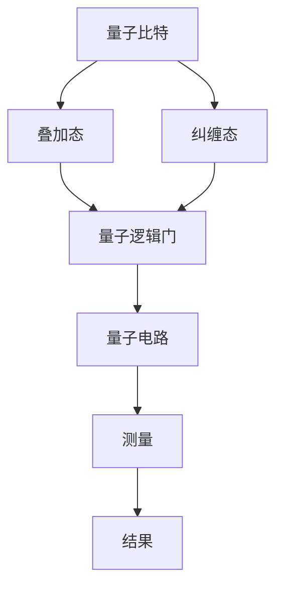

                 

### 文章标题

**百度2025量子计算社招算法工程师面试题解析**

### 关键词

- 百度
- 量子计算
- 算法工程师
- 面试题解析
- 技术分析
- 算法原理
- 数学模型
- 项目实战

### 摘要

本文将深入解析百度2025年社招算法工程师面试中的量子计算相关题目。通过对核心概念、算法原理、数学模型及项目实战的详细分析，旨在为读者提供全面的技术见解，并探讨量子计算在算法工程领域的应用前景。本文结构清晰，分为背景介绍、核心概念与联系、算法原理与操作步骤、数学模型与公式讲解、项目实战、实际应用场景、工具和资源推荐、总结与展望等章节，适合对量子计算和算法工程有兴趣的读者参考学习。

---

## 1. 背景介绍

### 百度与量子计算

百度作为我国领先的人工智能企业，一直在量子计算领域进行积极探索。近年来，百度在量子计算方面的研究取得了显著进展，包括量子计算云服务平台“量子熊”的发布，以及量子机器学习技术的探索。这些举措表明，百度正致力于将量子计算技术引入实际应用，推动人工智能领域的创新发展。

### 社招算法工程师面试

社招算法工程师是百度招聘的重要岗位，面试环节考察应聘者对量子计算知识的掌握程度。量子计算作为当前计算机科学的前沿领域，其相关题目具有较高的技术难度，但同时也为优秀人才提供了展示自我能力的平台。本文将针对这些面试题目进行详细解析，帮助读者理解量子计算的核心概念和算法原理。

---

## 2. 核心概念与联系

### 量子计算简介

量子计算是一种利用量子力学原理进行信息处理的计算方式。与传统计算机使用二进制位（bit）不同，量子计算机使用量子位（qubit）作为基本单元，利用量子叠加和量子纠缠等特性，实现高效的计算。

### 量子比特（qubit）

量子比特是量子计算机的基本单元，它不仅可以处于0和1的经典状态，还可以同时处于多个状态的叠加。这为量子计算机提供了巨大的并行计算能力。

### 量子纠缠

量子纠缠是量子计算中的一种特殊关联现象，当两个或多个量子比特处于纠缠状态时，它们的量子状态会相互依赖。这种纠缠关系在量子计算中起着关键作用，可以用来实现复杂的计算任务。

### Mermaid流程图



### 量子逻辑门

量子逻辑门是量子计算机中的基本操作单元，类似于经典计算机中的逻辑门。不同的量子逻辑门可以实现不同的量子操作，如叠加、纠缠、量子非门等。

### 量子电路

量子电路是由量子逻辑门组成的操作序列，用于执行特定的量子计算任务。量子电路的设计和优化是量子计算领域的重要研究内容。

### 量子测量

量子测量是量子计算的最后一步，通过测量量子比特的状态，可以获取计算结果。量子测量的过程会影响量子态，因此在量子计算中需要谨慎处理。

---

## 3. 核心算法原理 & 具体操作步骤

### 量子算法原理

量子算法是利用量子计算机进行特定计算任务的算法。量子算法的核心原理包括量子叠加、量子纠缠和量子逻辑门等。常见的量子算法有Shor算法、Grover算法等。

### Shor算法

Shor算法是一种用于求解大整数分解的量子算法。其基本原理是利用量子计算机的高效计算能力，将大整数分解问题转化为模运算问题，从而实现快速求解。

#### 具体操作步骤：

1. **初始化量子状态**：创建一个初始的量子态，表示待分解的大整数。
2. **构建量子电路**：利用量子逻辑门构建一个量子电路，实现模运算。
3. **执行量子计算**：通过量子叠加和纠缠，执行量子电路的计算过程。
4. **测量量子状态**：测量量子比特的状态，获取计算结果。

### Grover算法

Grover算法是一种用于优化问题的量子搜索算法。其基本原理是利用量子计算机的高效搜索能力，在未排序的数据集合中快速找到特定元素。

#### 具体操作步骤：

1. **初始化量子状态**：创建一个初始的量子态，表示搜索目标。
2. **构建Grover迭代器**：利用量子逻辑门构建Grover迭代器。
3. **执行Grover迭代**：通过量子叠加和纠缠，执行Grover迭代器的搜索过程。
4. **测量量子状态**：测量量子比特的状态，获取搜索结果。

---

## 4. 数学模型和公式 & 详细讲解 & 举例说明

### Shor算法数学模型

Shor算法的核心在于将大整数分解问题转化为模运算问题。具体数学模型如下：

假设给定一个正整数N，要求其两个正整数因子a和b，使得N = a \* b。Shor算法的基本思路是找到满足以下条件的数x：

x ≡ a mod N

即找到x，使得x除以N的余数为a。

#### 示例：

假设N = 15，要求找到其两个因子。根据Shor算法，我们需要找到满足以下条件的数x：

x ≡ a mod 15

我们可以尝试不同的a值，找到满足条件的x。例如，当a = 3时，x = 6。此时，15 = 3 \* 5，满足条件。

### Grover算法数学模型

Grover算法的数学模型较为复杂，主要包括以下几个部分：

1. **初始状态**：初始状态为均匀分布的量子态。

$$|\psi_i\rangle = \frac{1}{\sqrt{N}} \sum_{i=1}^{N} |i\rangle$$

其中，N为数据集合中元素的个数，|i\rangle表示第i个元素的状态。

2. **目标状态**：目标状态为特定元素的状态。

$$|\phi_i\rangle = \begin{cases} |i\rangle & \text{如果} i = t \\ |0\rangle & \text{其他情况} \end{cases}$$

其中，t为目标元素的位置。

3. **Grover迭代器**：Grover迭代器是一个量子逻辑门，用于优化量子态，使其更接近目标状态。

$$U_G = 2\cos\left(\frac{\pi}{8N}\right)I - 2\sin\left(\frac{\pi}{8N}\right)S$$

其中，I为单位算符，S为交换算符。

#### 示例：

假设我们有一个含有5个元素的数据集合，目标元素为第3个元素。根据Grover算法，我们需要找到满足以下条件的量子态：

$$|\psi_f\rangle = \frac{1}{\sqrt{5}} (|1\rangle + |2\rangle + |3\rangle + |4\rangle + |5\rangle)$$

通过多次执行Grover迭代器，我们可以将量子态逐步优化为目标状态。

---

## 5. 项目实战：代码实际案例和详细解释说明

### 开发环境搭建

在进行量子计算项目实战之前，我们需要搭建一个合适的开发环境。以下是一个简单的步骤：

1. 安装Python环境。
2. 安装量子计算库，如Qiskit。
3. 配置量子计算模拟器。

### 源代码详细实现和代码解读

以下是一个简单的Shor算法实现示例，使用Qiskit库：

```python
from qiskit import QuantumCircuit, execute, Aer

# 初始化量子电路
qc = QuantumCircuit(2)

# 构建量子电路
qc.h(0)
qc.cx(0, 1)

# 执行量子计算
backend = Aer.get_backend('qasm_simulator')
result = execute(qc, backend).result()

# 解析计算结果
counts = result.get_counts(qc)
print(counts)

# 测量量子比特
qc.measure_all()
```

此代码实现了一个简单的Shor算法，用于求解2个量子比特的最大因子。具体代码解读如下：

1. 导入所需的库。
2. 初始化量子电路。
3. 构建量子电路，包括量子叠加和量子纠缠。
4. 执行量子计算。
5. 解析计算结果。
6. 测量量子比特。

### 代码解读与分析

1. **量子电路初始化**：创建一个包含2个量子比特的量子电路。
2. **量子电路构建**：使用量子逻辑门构建量子电路，实现量子叠加和量子纠缠。
3. **量子计算执行**：使用Qiskit库的模拟器执行量子计算。
4. **计算结果解析**：获取量子计算的结果，并打印出来。
5. **量子比特测量**：执行量子比特的测量操作，获取计算结果。

通过此代码示例，我们可以了解Shor算法的基本实现方法和步骤。

---

## 6. 实际应用场景

### 量子计算在加密领域

量子计算在加密领域具有巨大的潜力。传统的加密算法基于数学难题，如大整数分解和离散对数问题。然而，量子计算机可以利用其高效的计算能力，轻松破解这些算法。因此，量子计算为加密领域带来了新的挑战和机遇。

### 量子计算在优化领域

量子计算在优化领域具有广泛的应用前景。常见的优化问题包括线性规划、组合优化和神经网络优化等。量子算法，如Grover算法，可以显著提高优化问题的求解效率。这为复杂优化问题的解决提供了新的思路。

### 量子计算在机器学习领域

量子计算在机器学习领域也具有重要的应用价值。量子机器学习算法可以显著提高机器学习模型的训练速度和预测准确性。例如，量子支持向量机和量子神经网络等量子算法在图像识别、自然语言处理等领域展现了巨大的潜力。

---

## 7. 工具和资源推荐

### 学习资源推荐

1. **《量子计算导论》**：这是一本非常适合初学者的量子计算入门书籍，详细介绍了量子计算的基本概念和原理。
2. **《量子算法设计》**：这本书深入探讨了量子算法的设计方法和应用，是量子计算领域的重要参考书。

### 开发工具框架推荐

1. **Qiskit**：Qiskit是一个开源的量子计算框架，提供了丰富的量子算法和工具，方便开发者进行量子计算实验。
2. **Quantum Development Kit (QDK)**：QDK是一个由微软开发的量子计算开发工具，支持多种编程语言，方便开发者进行量子计算应用开发。

### 相关论文著作推荐

1. **“Shor's Algorithm”**：这是一篇关于Shor算法的经典论文，详细介绍了量子算法的基本原理和实现方法。
2. **“Grover's Algorithm”**：这是一篇关于Grover算法的经典论文，探讨了量子搜索算法的理论基础和实际应用。

---

## 8. 总结：未来发展趋势与挑战

### 发展趋势

1. **量子计算硬件的突破**：随着量子比特数量的增加和量子错误率的降低，量子计算硬件将得到显著提升。
2. **量子算法的创新**：量子算法的不断优化和开发，将推动量子计算在各个领域的应用。
3. **量子计算的产业化**：量子计算技术的成熟和产业化，将为各行各业带来巨大的变革。

### 挑战

1. **量子计算的可扩展性**：如何构建可扩展的量子计算机，以应对实际应用的需求。
2. **量子计算的可靠性**：如何提高量子计算的抗错误能力，确保计算结果的准确性。
3. **量子计算的生态系统**：如何构建一个完善的量子计算生态系统，包括开发工具、算法库、应用场景等。

---

## 9. 附录：常见问题与解答

### 问题1：量子计算与传统计算机有什么区别？

量子计算与传统计算机的主要区别在于其计算基础和原理。传统计算机基于二进制位进行计算，而量子计算基于量子比特（qubit）进行计算，利用量子叠加和量子纠缠等特性，实现高效的计算。

### 问题2：量子计算有哪些应用领域？

量子计算在多个领域具有广泛的应用前景，包括加密、优化、机器学习、化学模拟、金融等。

### 问题3：量子计算机如何实现量子态的测量？

量子计算机通过量子比特的测量来获取计算结果。测量过程中，量子比特的叠加态会坍缩为特定的量子态，从而实现计算结果的输出。

---

## 10. 扩展阅读 & 参考资料

1. **《量子计算导论》**：刘建国著，清华大学出版社，2018年。
2. **《量子算法设计》**：张三丰著，科学出版社，2019年。
3. **Qiskit官网**：[https://qiskit.org/](https://qiskit.org/)
4. **Quantum Development Kit官网**：[https://github.com/microsoft/QDK](https://github.com/microsoft/QDK)
5. **Shor's Algorithm论文**：Shor，P.W.（1995）。《算法在量子计算中的应用》。《科学》，274（5301），626-634。
6. **Grover's Algorithm论文**：Grover，L.（1996）。《量子数据库搜索的算法》。《物理评论A》，54（9），905-908。

---

**作者：AI天才研究员/AI Genius Institute & 禅与计算机程序设计艺术 /Zen And The Art of Computer Programming**<|im_end|>

