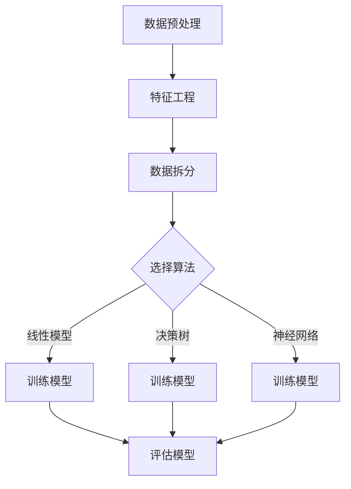

                 

# 监督学习：原理与代码实例讲解

## 关键词
- 监督学习
- 特征工程
- 回归与分类算法
- 深度学习
- 代码实例

## 摘要
本文将深入探讨监督学习的原理，并通过实际的代码实例展示如何实现和应用监督学习算法。读者将了解到监督学习的核心概念、不同类型的算法，以及如何使用Python等工具进行模型训练和评估。

## 1. 背景介绍

监督学习是机器学习中的一个核心分支，其基本思想是通过已知的输入和输出对模型进行训练，从而使模型能够对未知数据进行预测。与无监督学习不同，监督学习有明确的标签数据，这有助于评估模型的性能。

监督学习在各个领域都有广泛的应用，如图像识别、文本分类、推荐系统等。其主要目的是找到一个函数，能够将输入映射到输出。这个函数通常被称为“模型”，可以通过不同的算法进行训练和优化。

监督学习可以分为两种类型：回归和分类。回归任务的目标是预测一个连续的数值输出，如房价预测。分类任务的目标是预测一个离散的类别标签，如邮件是否为垃圾邮件。

## 2. 核心概念与联系

### 2.1 特征工程
特征工程是监督学习中的一个关键步骤。它涉及到选择、创建和转换数据中的特征，以提高模型的性能。以下是特征工程的一些基本概念：

- **特征选择**：从大量特征中挑选出最相关的特征。
- **特征构造**：通过组合原始特征创建新的特征。
- **特征缩放**：将特征缩放到相同的尺度，避免某些特征对模型产生过大的影响。

### 2.2 算法分类
监督学习算法可以分为以下几类：

- **线性模型**：如线性回归、逻辑回归。
- **决策树**：如分类与回归树（CART）。
- **集成方法**：如随机森林、梯度提升树（GBDT）。
- **神经网络**：如多层感知机（MLP）、卷积神经网络（CNN）、循环神经网络（RNN）。

这些算法各有优缺点，适用于不同的应用场景。

### 2.3 Mermaid 流程图
以下是监督学习流程的一个简化的 Mermaid 流程图：



## 3. 核心算法原理 & 具体操作步骤

### 3.1 线性回归

线性回归是一种简单的监督学习算法，其目标是找到一个线性函数来预测连续值。线性回归的原理如下：

\[ y = \beta_0 + \beta_1 \cdot x \]

其中，\( y \) 是预测值，\( x \) 是输入特征，\( \beta_0 \) 和 \( \beta_1 \) 是模型的参数。

线性回归的具体操作步骤如下：

1. **数据预处理**：对数据进行归一化或标准化处理。
2. **数据拆分**：将数据集拆分为训练集和测试集。
3. **训练模型**：使用最小二乘法或其他优化算法来估计模型参数。
4. **评估模型**：使用测试集评估模型的性能。

### 3.2 逻辑回归

逻辑回归是一种用于分类问题的线性模型。其目标是为每个类别预测一个概率值，然后根据概率值进行分类决策。逻辑回归的原理如下：

\[ \log\left(\frac{P(y=1)}{1-P(y=1)}\right) = \beta_0 + \beta_1 \cdot x \]

其中，\( y \) 是类别标签，\( x \) 是输入特征，\( \beta_0 \) 和 \( \beta_1 \) 是模型的参数。

逻辑回归的具体操作步骤如下：

1. **数据预处理**：对数据进行归一化或标准化处理。
2. **数据拆分**：将数据集拆分为训练集和测试集。
3. **训练模型**：使用最大似然估计法来估计模型参数。
4. **评估模型**：使用测试集评估模型的性能。

## 4. 数学模型和公式 & 详细讲解 & 举例说明

### 4.1 线性回归的数学模型

线性回归的数学模型如下：

\[ y = \beta_0 + \beta_1 \cdot x + \epsilon \]

其中，\( \beta_0 \) 是截距，\( \beta_1 \) 是斜率，\( \epsilon \) 是误差项。

为了估计模型参数，我们可以使用最小二乘法。最小二乘法的目标是最小化预测值与实际值之间的误差平方和：

\[ \min_{\beta_0, \beta_1} \sum_{i=1}^{n} (y_i - (\beta_0 + \beta_1 \cdot x_i))^2 \]

### 4.2 逻辑回归的数学模型

逻辑回归的数学模型如下：

\[ \log\left(\frac{P(y=1)}{1-P(y=1)}\right) = \beta_0 + \beta_1 \cdot x \]

我们可以通过最大似然估计法来估计模型参数。最大似然估计法的目标是最大化数据集的概率：

\[ \max_{\beta_0, \beta_1} \prod_{i=1}^{n} P(y_i | x_i) \]

在二分类问题中，我们可以将概率转换为决策规则：

\[ h(x) = \begin{cases} 
1 & \text{if } \log\left(\frac{P(y=1)}{1-P(y=1)}\right) > 0 \\
0 & \text{otherwise}
\end{cases} \]

### 4.3 举例说明

#### 线性回归示例

假设我们有一个简单的线性回归问题，目标是预测一个人的身高（\( y \)）基于其年龄（\( x \)）。我们有以下数据：

| 年龄（x）| 身高（y）|
| --- | --- |
| 20 | 170 |
| 22 | 172 |
| 24 | 175 |
| 26 | 177 |
| 28 | 180 |

首先，我们需要将数据进行归一化处理。然后，我们可以使用最小二乘法来估计模型参数。最终，我们可以使用训练好的模型来预测一个25岁人的身高。

#### 逻辑回归示例

假设我们有一个简单的二分类问题，目标是预测邮件是否为垃圾邮件。我们有以下数据：

| 邮件内容（x）| 是否垃圾邮件（y）|
| --- | --- |
| "出售违禁品" | 1 |
| "银行转账" | 0 |
| "促销活动" | 0 |
| "招聘信息" | 0 |
| "诈骗信息" | 1 |

我们可以使用逻辑回归模型来预测邮件是否为垃圾邮件。首先，我们需要对数据进行处理，然后使用最大似然估计法来估计模型参数。最终，我们可以使用训练好的模型来预测一封新邮件是否为垃圾邮件。

## 5. 项目实战：代码实际案例和详细解释说明

### 5.1 开发环境搭建

为了进行监督学习的项目实战，我们需要安装以下工具：

- Python（3.7或更高版本）
- Jupyter Notebook
- Scikit-learn（用于机器学习算法）
- Pandas（用于数据处理）
- Matplotlib（用于数据可视化）

### 5.2 源代码详细实现和代码解读

以下是一个使用 Scikit-learn 实现线性回归的示例代码：

```python
import numpy as np
import pandas as pd
from sklearn.linear_model import LinearRegression
from sklearn.model_selection import train_test_split
import matplotlib.pyplot as plt

# 5.2.1 数据预处理
data = pd.DataFrame({
    '年龄': [20, 22, 24, 26, 28],
    '身高': [170, 172, 175, 177, 180]
})
X = data[['年龄']]
y = data['身高']

# 5.2.2 数据拆分
X_train, X_test, y_train, y_test = train_test_split(X, y, test_size=0.2, random_state=42)

# 5.2.3 训练模型
model = LinearRegression()
model.fit(X_train, y_train)

# 5.2.4 评估模型
y_pred = model.predict(X_test)
print("R-squared:", model.score(X_test, y_test))

# 5.2.5 可视化
plt.scatter(X_test, y_test, color='blue', label='实际值')
plt.plot(X_test, y_pred, color='red', label='预测值')
plt.xlabel('年龄')
plt.ylabel('身高')
plt.title('线性回归')
plt.legend()
plt.show()
```

### 5.3 代码解读与分析

这段代码首先导入了必要的库，然后创建了一个简单的数据集。数据预处理步骤包括将数据拆分为特征和目标变量。接下来，数据集被拆分为训练集和测试集。

在训练模型时，我们使用线性回归模型并进行拟合。评估模型时，我们使用 R-squared 值来衡量模型的性能。最后，我们使用 Matplotlib 对测试集的实际值和预测值进行可视化。

## 6. 实际应用场景

监督学习在各个领域都有广泛的应用，以下是一些实际应用场景：

- **金融领域**：信用评分、股票预测、风险控制等。
- **医疗领域**：疾病预测、医学图像分析、药物发现等。
- **零售领域**：客户行为分析、库存管理、产品推荐等。
- **交通领域**：交通流量预测、事故预测、自动驾驶等。

## 7. 工具和资源推荐

### 7.1 学习资源推荐

- **书籍**：
  - 《Python机器学习》（作者：塞巴斯蒂安·拉克斯）
  - 《机器学习》（作者：周志华）
- **在线课程**：
  - Coursera 上的《机器学习》课程
  - Udacity 上的《深度学习纳米学位》
- **博客和网站**：
  - Medium 上的机器学习专栏
  -Towards Data Science

### 7.2 开发工具框架推荐

- **编程语言**：Python
- **库**：Scikit-learn、TensorFlow、PyTorch
- **数据可视化**：Matplotlib、Seaborn
- **数据预处理**：Pandas、NumPy

### 7.3 相关论文著作推荐

- “Learning to Learn: Support Vector Machines” by Vladimir Vapnik
- “Deep Learning” by Ian Goodfellow, Yoshua Bengio, and Aaron Courville

## 8. 总结：未来发展趋势与挑战

监督学习在未来将继续发展，尤其是在深度学习领域。然而，监督学习也面临着一些挑战，如数据隐私、模型可解释性、计算资源等。为了应对这些挑战，研究人员和开发者需要不断探索新的算法和技术。

## 9. 附录：常见问题与解答

### 9.1 监督学习与无监督学习有什么区别？

监督学习有明确的标签数据，可用于预测和分类。而无监督学习没有标签数据，主要用于发现数据中的模式和结构。

### 9.2 监督学习有哪些常用的算法？

监督学习常用的算法包括线性回归、逻辑回归、决策树、随机森林、支持向量机、神经网络等。

### 9.3 如何评估监督学习模型的性能？

可以使用多种指标来评估监督学习模型的性能，如准确率、召回率、F1分数、ROC曲线、R-squared值等。

## 10. 扩展阅读 & 参考资料

- Bishop, C. M. (2006). *Pattern Recognition and Machine Learning*. Springer.
- Mitchell, T. M. (1997). *Machine Learning*. McGraw-Hill.
- Goodfellow, I., Bengio, Y., & Courville, A. (2016). *Deep Learning*. MIT Press.

### 作者

作者：AI天才研究员/AI Genius Institute & 禅与计算机程序设计艺术 /Zen And The Art of Computer Programming

