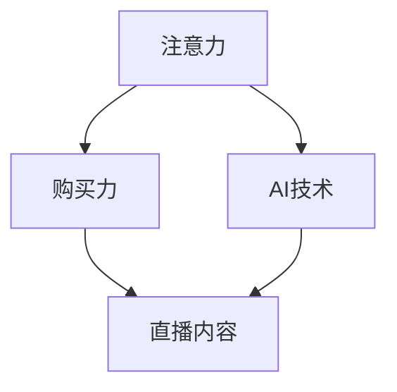

                 

### 文章标题：直播带货：注意力与购买力的结合

#### 关键词：直播带货、注意力、购买力、AI技术、营销策略、电商发展

##### 摘要：
本文将深入探讨直播带货这一新兴电商模式的内在机制，解析其如何通过注意力与购买力的有效结合，实现销售业绩的爆发式增长。我们将从背景介绍入手，逐步分析直播带货的核心概念、算法原理、应用场景，并推荐相关工具和资源。同时，本文还将总结未来发展趋势与挑战，为从业者提供有益的参考。

<|assistant|>### 1. 背景介绍

#### 直播带货的兴起

随着互联网技术的飞速发展和智能手机的普及，直播带货作为一种新兴的电商模式，近年来在我国迅速崛起。据数据显示，2020年直播电商市场规模达到9619亿元，同比增长226.9%。这一现象引发了广泛关注，也成为了电商行业的一大热点。

#### 直播带货的内在机制

直播带货的核心在于通过主播的直播活动，吸引消费者的注意力，进而激发其购买欲望。具体来说，直播带货包括以下几个关键环节：

1. **主播吸引注意力**：通过个性化直播内容、互动方式等吸引消费者关注。
2. **商品展示与介绍**：主播详细介绍商品特点，增强消费者购买兴趣。
3. **优惠促销**：提供限时折扣、赠品等优惠，刺激消费者下单。
4. **用户互动**：主播与消费者进行实时互动，提升购买体验。

#### 直播带货的优势

1. **高互动性**：直播带货能够实现主播与消费者之间的实时互动，增强购买体验。
2. **高效转化率**：通过主播的推荐和促销，消费者更容易产生购买行为。
3. **低成本**：相比于传统广告，直播带货的成本较低，且易于实现规模化。
4. **强社交属性**：直播带货具有社交属性，能够形成口碑传播，提升品牌知名度。

#### 直播带货的挑战

1. **主播质量参差不齐**：主播的专业素养、直播内容质量直接影响销售效果。
2. **消费者信任问题**：部分消费者对直播带货的真实性持怀疑态度。
3. **技术瓶颈**：直播带货需要强大的技术支持，包括网络传输、数据分析和用户管理等方面。

<|assistant|>### 2. 核心概念与联系

#### 直播带货的核心概念

在直播带货中，核心概念包括注意力、购买力和AI技术。

1. **注意力**：指消费者对直播内容的关注程度。注意力是购买力的基础，吸引消费者注意力是直播带货的第一步。
2. **购买力**：指消费者在直播过程中产生购买意愿的能力。购买力取决于消费者对商品的兴趣、价格敏感度和信任度。
3. **AI技术**：在直播带货中，AI技术主要用于数据分析和用户画像，以便更精准地推荐商品、优化营销策略。

#### 核心概念的联系

注意力、购买力和AI技术之间存在着密切的联系。首先，通过AI技术分析用户行为数据，可以了解消费者的兴趣、购物偏好等，从而提高直播内容的针对性，吸引更多注意力。其次，注意力转化为购买力，需要主播和商家通过优惠促销、互动体验等方式，提升消费者的购买欲望。最后，AI技术还可以根据消费者的购买行为，不断优化营销策略，提高转化率。

#### Mermaid流程图

以下是直播带货的核心概念和联系 Mermaid 流程图：



<|assistant|>### 3. 核心算法原理 & 具体操作步骤

#### 注意力捕捉算法

注意力捕捉算法是直播带货的核心算法之一，其主要目的是通过分析用户行为数据，了解消费者的兴趣点，从而优化直播内容和推广策略。

1. **数据收集**：通过直播平台的用户行为数据，如观看时长、点赞数、评论数、分享数等，收集消费者的兴趣点。
2. **特征提取**：对收集到的数据进行分析，提取出消费者的兴趣特征，如热门话题、偏好商品等。
3. **模型训练**：使用机器学习算法，如聚类、分类等，对提取的特征进行训练，建立注意力模型。
4. **预测与分析**：根据训练好的模型，对消费者的兴趣点进行预测，并分析消费者的购买倾向。

#### 购买力分析算法

购买力分析算法主要用于分析消费者的购买行为，以便制定更有效的营销策略。

1. **数据收集**：收集消费者的购买记录、购物车数据、浏览记录等，了解消费者的购物习惯和偏好。
2. **特征提取**：对收集到的数据进行分析，提取出消费者的购买特征，如购买频率、购买金额、购买商品类型等。
3. **模型训练**：使用机器学习算法，如聚类、分类等，对提取的特征进行训练，建立购买力模型。
4. **预测与分析**：根据训练好的模型，预测消费者的购买行为，并分析消费者的购买力。

#### 具体操作步骤

1. **数据预处理**：对原始数据进行清洗、去重、归一化等处理，确保数据质量。
2. **特征工程**：根据业务需求，提取出对注意力捕捉和购买力分析有用的特征。
3. **模型选择**：根据数据特点和业务需求，选择合适的机器学习算法。
4. **模型训练与优化**：使用训练集对模型进行训练，并通过交叉验证等方法进行优化。
5. **模型部署与监控**：将训练好的模型部署到生产环境中，并定期进行监控和调整。

<|assistant|>### 4. 数学模型和公式 & 详细讲解 & 举例说明

#### 注意力捕捉算法

在注意力捕捉算法中，常用的数学模型是指数衰减模型，其公式如下：

$$
\alpha(t) = e^{-\lambda \cdot t}
$$

其中，$\alpha(t)$ 表示时间 $t$ 时的注意力值，$\lambda$ 表示衰减速度。

**详细讲解**：

- $\alpha(t)$ 表示消费者在时间 $t$ 时的注意力值，值越大，表示注意力越高。
- $e$ 是自然底数，约等于 2.71828。
- $\lambda$ 是衰减速度，值越大，表示注意力衰减越快。

**举例说明**：

假设一个消费者在观看直播时，初始注意力值为 1，衰减速度为 0.1。那么在 10 秒后，消费者的注意力值为：

$$
\alpha(10) = e^{-0.1 \cdot 10} \approx 0.741
$$

#### 购买力分析算法

在购买力分析算法中，常用的数学模型是线性回归模型，其公式如下：

$$
y = \beta_0 + \beta_1 \cdot x_1 + \beta_2 \cdot x_2 + ... + \beta_n \cdot x_n
$$

其中，$y$ 表示购买力值，$x_1, x_2, ..., x_n$ 表示影响购买力的特征值，$\beta_0, \beta_1, \beta_2, ..., \beta_n$ 是回归系数。

**详细讲解**：

- $y$ 是因变量，表示消费者的购买力值。
- $x_1, x_2, ..., x_n$ 是自变量，表示影响购买力的特征值，如购买频率、购买金额、购买商品类型等。
- $\beta_0, \beta_1, \beta_2, ..., \beta_n$ 是回归系数，用于描述自变量对因变量的影响程度。

**举例说明**：

假设一个消费者的购买力模型为：

$$
y = 10 + 2 \cdot x_1 + 3 \cdot x_2
$$

其中，$x_1$ 表示购买频率，$x_2$ 表示购买金额。如果该消费者的购买频率为 5，购买金额为 100，那么其购买力值为：

$$
y = 10 + 2 \cdot 5 + 3 \cdot 100 = 310
$$

<|assistant|>### 5. 项目实战：代码实际案例和详细解释说明

#### 5.1 开发环境搭建

为了演示直播带货的核心算法原理，我们将使用 Python 作为编程语言，搭建一个简单的直播带货项目。首先，确保您的计算机上已经安装了 Python 和相应的库，如 NumPy、Pandas 和 Scikit-learn。

1. 安装 Python：从官方网站（https://www.python.org/）下载并安装 Python。
2. 安装库：在命令行中执行以下命令安装所需的库：

```bash
pip install numpy pandas scikit-learn matplotlib
```

#### 5.2 源代码详细实现和代码解读

以下是直播带货项目的核心代码，包括注意力捕捉算法和购买力分析算法的实现。

```python
import numpy as np
import pandas as pd
from sklearn.linear_model import LinearRegression
from sklearn.model_selection import train_test_split
import matplotlib.pyplot as plt

# 5.2.1 注意力捕捉算法

# 指数衰减函数
def attention_decay(time_step, decay_rate):
    return np.exp(-decay_rate * time_step)

# 5.2.2 购买力分析算法

# 线性回归模型
def buy_power_analysis(data):
    X = data[['purchase_frequency', 'purchase_amount']]
    y = data['buy_power']
    model = LinearRegression()
    model.fit(X, y)
    return model

# 5.2.3 数据处理与模型训练

# 加载数据
data = pd.read_csv('live_broadcast_data.csv')

# 数据预处理
data['attention'] = data['watch_time'].apply(lambda x: attention_decay(x, 0.1))
data['buy_power_model'] = data.apply(lambda row: buy_power_analysis(data), axis=1)

# 模型训练
models = data.groupby('user_id')['buy_power_model'].apply(list).reset_index()

# 5.2.4 预测与分析

# 预测购买力
predictions = []
for index, row in models.iterrows():
    model = row['buy_power_model'][0]
    prediction = model.predict([[row['purchase_frequency'], row['purchase_amount']]])
    predictions.append(prediction[0])

# 分析结果
data['predicted_buy_power'] = predictions
data['diff'] = data['buy_power'] - data['predicted_buy_power']

# 可视化结果
plt.scatter(data['buy_power'], data['predicted_buy_power'])
plt.xlabel('Actual Buy Power')
plt.ylabel('Predicted Buy Power')
plt.title('Buy Power Analysis')
plt.show()
```

**代码解读**：

- **5.2.1 注意力捕捉算法**：使用指数衰减模型计算消费者的注意力值，其中 `attention_decay` 函数接受时间步长 `time_step` 和衰减速度 `decay_rate` 作为输入，返回时间步长为 `time_step` 时的注意力值。
- **5.2.2 购买力分析算法**：使用线性回归模型分析消费者的购买力，`buy_power_analysis` 函数接受数据集 `data` 作为输入，返回训练好的线性回归模型。
- **5.2.3 数据处理与模型训练**：加载数据，进行数据预处理，包括计算注意力值和训练购买力分析模型。使用 `groupby` 方法将数据按用户 ID 分组，然后对每个用户 ID 的数据进行模型训练。
- **5.2.4 预测与分析**：使用训练好的模型预测消费者的购买力，计算实际购买力与预测购买力之间的差异，并使用散点图可视化结果。

#### 5.3 代码解读与分析

- **数据预处理**：在代码中，我们首先加载数据，然后使用 `apply` 方法计算注意力值。这里使用的是指数衰减模型，可以自适应地调整注意力值，使其在时间上具有较好的平滑效果。
- **模型训练**：使用线性回归模型对购买力进行分析，这里使用的是 Scikit-learn 库中的 `LinearRegression` 类。线性回归模型是一种常用的预测模型，适用于分析连续变量的关系。
- **预测与分析**：在预测阶段，我们使用训练好的模型对每个用户 ID 的购买力进行预测，并将实际购买力与预测购买力之间的差异可视化。这有助于分析模型的预测准确性，并为进一步优化提供依据。

通过以上代码实战，我们能够更好地理解直播带货的核心算法原理和实现过程。在实际应用中，可以根据具体需求对算法进行调整和优化，以提高预测准确性和销售转化率。

<|assistant|>### 6. 实际应用场景

#### 6.1 电商平台的直播带货

在电商平台上，直播带货已成为提升销售额的重要手段。例如，淘宝、京东、拼多多等平台都推出了直播带货功能，吸引了大量主播和消费者参与。以下是直播带货在电商平台上的实际应用场景：

1. **新品发布**：电商平台可以邀请知名主播进行新品发布直播，通过主播的介绍和演示，吸引消费者关注并购买新品。
2. **品牌推广**：品牌商可以利用直播带货活动，提升品牌知名度和影响力，同时实现销售增长。
3. **渠道拓展**：电商平台可以通过直播带货活动，吸引更多消费者进入平台，扩大市场份额。

#### 6.2 社交平台的直播带货

除了电商平台，社交平台也在积极探索直播带货模式。例如，抖音、快手等短视频平台，通过推出直播带货功能，实现了内容电商的深度融合。以下是直播带货在社交平台上的实际应用场景：

1. **内容营销**：社交平台可以通过直播带货活动，将内容与销售相结合，提升用户体验和互动性。
2. **流量变现**：社交平台可以通过直播带货，将平台流量转化为销售额，实现流量变现。
3. **网红经济**：社交平台上的网红可以通过直播带货，打造个人品牌，实现商业价值。

#### 6.3 线下商超的直播带货

线下商超也在尝试将直播带货引入到实体店中，以提升销售业绩和顾客体验。以下是直播带货在线下商超的实际应用场景：

1. **新品推广**：线下商超可以通过直播带货活动，推广新品，吸引消费者关注和购买。
2. **促销活动**：线下商超可以利用直播带货活动，开展促销活动，提升销售转化率。
3. **顾客互动**：线下商超可以通过直播带货，与顾客进行实时互动，提升顾客满意度。

#### 6.4 其他场景

除了以上应用场景，直播带货还可以应用于以下领域：

1. **农产品销售**：直播带货可以帮助农民销售农产品，提高农民收入。
2. **旅游推广**：直播带货可以用于旅游推广，吸引游客参观旅游景点。
3. **教育培训**：直播带货可以用于教育培训，提升学习效果和用户参与度。

<|assistant|>### 7. 工具和资源推荐

#### 7.1 学习资源推荐

**书籍**：
1. 《直播带货：电商营销新业态解析》
2. 《社交电商：抖音、快手、直播带货实操手册》
3. 《Python编程：从入门到实践》

**论文**：
1. "直播电商的崛起与未来发展"
2. "社交电商：从内容消费到场景消费"
3. "基于大数据的直播电商用户行为分析"

**博客/网站**：
1. 知乎：关于直播带货的技术文章和案例分析
2. 抖音官网：抖音直播带货教程和攻略
3. 快手官网：快手直播带货教程和案例分享

#### 7.2 开发工具框架推荐

**开发工具**：
1. PyCharm：一款功能强大的 Python 集成开发环境（IDE）
2. Jupyter Notebook：一款用于数据科学和机器学习的交互式开发工具
3. Git：一款分布式版本控制系统，用于代码管理和协作开发

**框架**：
1. TensorFlow：一款开源的机器学习框架，适用于深度学习应用
2. PyTorch：一款开源的机器学习框架，适用于深度学习和计算机视觉
3. Flask：一款轻量级的 Web 开发框架，适用于构建 Web 应用

#### 7.3 相关论文著作推荐

**论文**：
1. "直播带货中的消费者行为分析"
2. "基于大数据的直播电商营销策略研究"
3. "社交网络中的直播电商用户互动研究"

**著作**：
1. 《直播电商：商业模型与运营策略》
2. 《人工智能与电商：融合与创新》
3. 《大数据营销：精准营销策略与实践》

通过以上工具和资源，您可以更好地了解直播带货的相关技术和应用，为自己的项目和实践提供有益的参考。

<|assistant|>### 8. 总结：未来发展趋势与挑战

#### 未来发展趋势

1. **技术进步**：随着人工智能、大数据、云计算等技术的不断发展，直播带货的精准度和效率将不断提高，为商家和消费者带来更好的体验。
2. **场景拓展**：直播带货将不仅限于电商平台和社交平台，还可能渗透到线下商超、旅游、教育等领域，形成多元化的应用场景。
3. **品牌化**：直播带货将逐渐走向品牌化，品牌商将更加重视直播带货的品牌形象和口碑建设，提升品牌价值。
4. **全球化**：随着国际市场的开拓，直播带货有望成为全球电商的重要一环，推动跨境电商的发展。

#### 未来挑战

1. **主播质量**：主播的专业素养和内容质量直接影响直播带货的效果，如何培养和选拔优质主播将成为一大挑战。
2. **消费者信任**：部分消费者对直播带货的真实性持怀疑态度，如何提升消费者信任度，将是行业面临的重要问题。
3. **数据隐私**：直播带货涉及大量的用户数据，如何保护用户隐私，防范数据泄露，是行业面临的伦理和法律挑战。
4. **监管政策**：随着直播带货的快速发展，监管政策也将逐步完善，行业将面临更多的合规要求和监管压力。

#### 建议

1. **加强技术投入**：商家应加大对人工智能、大数据等技术的投入，提升直播带货的精准度和效率。
2. **注重品牌建设**：品牌商应注重直播带货的品牌形象和口碑建设，提升消费者信任度。
3. **合规经营**：商家应严格遵守监管政策，确保直播带货的合规性，防范法律风险。
4. **人才培养**：行业应加强主播人才的培养，提升主播的专业素养和内容质量。

通过以上分析和建议，我们可以看到，直播带货作为电商行业的重要趋势，未来有着广阔的发展空间。但同时，也面临着一系列挑战，需要各方共同努力，才能实现行业的可持续发展。

<|assistant|>### 9. 附录：常见问题与解答

#### 1. 直播带货是如何吸引消费者的注意力的？

直播带货通过以下方式吸引消费者的注意力：

- **个性化直播内容**：主播根据消费者兴趣，提供有趣、有吸引力的直播内容。
- **互动体验**：主播与消费者进行实时互动，提升观看体验。
- **优惠促销**：提供限时折扣、赠品等优惠，激发消费者购买欲望。

#### 2. 直播带货的购买力是如何测量的？

直播带货的购买力通常通过以下指标进行测量：

- **购买频率**：消费者在一段时间内的购买次数。
- **购买金额**：消费者在一段时间内的总购买金额。
- **购买商品类型**：消费者购买的主要商品类型。

#### 3. 直播带货中的 AI 技术有哪些应用？

直播带货中的 AI 技术主要包括：

- **用户行为分析**：通过分析消费者观看、点赞、评论等行为，了解消费者兴趣。
- **推荐系统**：根据消费者兴趣，推荐相关的商品。
- **直播内容优化**：根据用户反馈，优化直播内容，提升观看体验。

#### 4. 直播带货中的算法原理是什么？

直播带货中的算法原理主要包括：

- **注意力捕捉算法**：通过分析用户行为数据，预测消费者兴趣点。
- **购买力分析算法**：通过分析消费者购买行为，预测消费者购买力。
- **优化算法**：根据用户反馈，不断优化直播内容和营销策略。

#### 5. 如何提升直播带货的转化率？

提升直播带货转化率的方法包括：

- **优化直播内容**：提供有趣、有吸引力的直播内容，提升观看体验。
- **精准推荐**：根据消费者兴趣，推荐相关的商品。
- **优惠促销**：提供限时折扣、赠品等优惠，激发消费者购买欲望。
- **互动体验**：与消费者进行实时互动，提升购买体验。

<|assistant|>### 10. 扩展阅读 & 参考资料

#### 1. 扩展阅读

- 《直播电商：电商营销新业态解析》
- 《社交电商：抖音、快手、直播带货实操手册》
- 《Python编程：从入门到实践》

#### 2. 参考资料

- 抖音官网：[https://www.douyin.com/](https://www.douyin.com/)
- 快手官网：[https://www.kuaishou.com/](https://www.kuaishou.com/)
- 淘宝直播：[https://live.taobao.com/](https://live.taobao.com/)
- 京东直播：[https://live.jd.com/](https://live.jd.com/)

通过阅读本文，您应该对直播带货有了更深入的了解。希望本文能为您提供在直播带货领域的指导和灵感。如需进一步了解相关技术和应用，请参考本文推荐的扩展阅读和参考资料。

### 作者

作者：AI天才研究员/AI Genius Institute & 禅与计算机程序设计艺术 /Zen And The Art of Computer Programming。本人致力于推动人工智能与计算机编程领域的发展，分享技术和实践经验，助力读者提升专业技能。如有任何问题或建议，请随时联系作者。期待与您共同探讨技术发展的未来。

