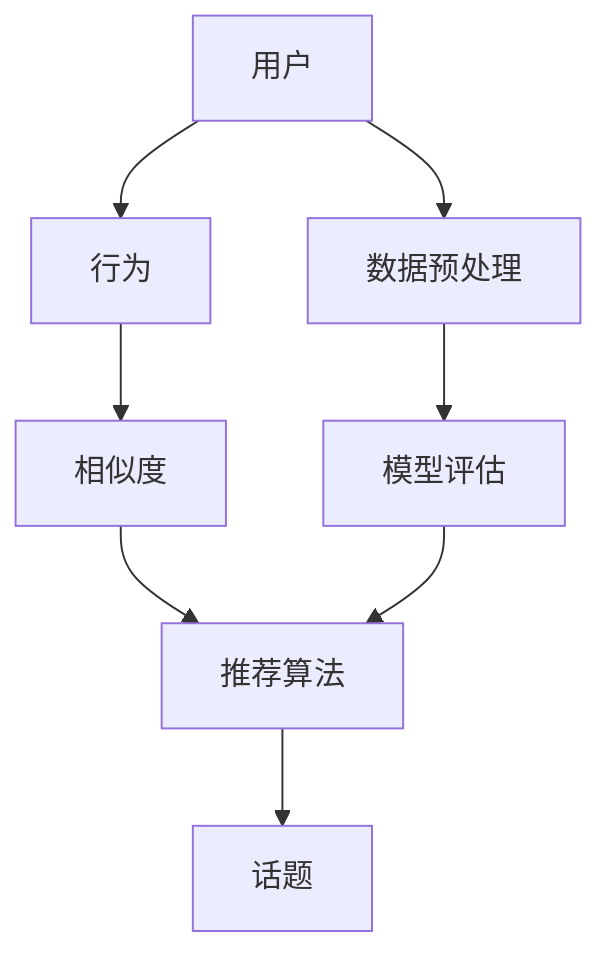

                 

### 背景介绍

在当今的信息化社会中，算法在各个领域的应用越来越广泛。尤其是在社交媒体平台上，话题推荐算法扮演着至关重要的角色。话题推荐算法能够根据用户的历史行为、兴趣偏好以及社交网络等信息，为用户推荐感兴趣的话题内容，从而提升用户体验，增加用户粘性。

知乎作为中国领先的问答社区，其话题推荐算法的重要性不言而喻。知乎不仅拥有大量的用户和丰富的话题内容，而且用户之间的互动也非常活跃。如何精准地推荐话题，提高用户参与度和满意度，成为知乎面临的重大挑战。

为了应对这一挑战，知乎的算法团队持续进行研究和优化。本文将深入探讨知乎2024话题推荐算法的校招面试重点，帮助准备参加知乎校招的同学们更好地理解和应对面试中的相关内容。

首先，我们需要明确几个关键概念。算法推荐可以分为基于内容的推荐和基于协同过滤的推荐。基于内容的推荐关注话题的内容属性，如标签、关键词等；而基于协同过滤的推荐则侧重于用户行为和偏好，通过计算用户之间的相似度来进行推荐。知乎的话题推荐算法通常会结合这两种方法，以提高推荐的准确性和覆盖度。

接下来，我们将从核心概念、算法原理、数学模型、实际应用等多个角度，逐步分析知乎2024话题推荐算法的校招面试重点。通过这篇文章，希望能够为准备参加知乎校招的同学们提供一个清晰的学习和准备方向。

### 核心概念与联系

在探讨知乎2024话题推荐算法之前，我们需要先理解几个核心概念，它们是构建推荐系统的基础。以下是这些核心概念的详细解释，并附上Mermaid流程图，以便更直观地展示各概念之间的联系。

#### 用户（User）

用户是推荐系统的核心，他们通过浏览、点赞、评论、提问等行为表达自己的兴趣和偏好。每个用户都有一套独特的兴趣模型，这些模型由用户的历史行为和社交网络数据来构建。

#### 话题（Topic）

话题是用户参与讨论的主题，如科技、娱乐、健康等。每个话题都有自己的标签、关键词和内容属性。话题推荐的目标是向用户推荐他们可能感兴趣的话题。

#### 行为（Behavior）

用户的行为是构建推荐系统的重要数据来源。这些行为包括但不限于浏览、点赞、评论、提问、分享等。通过对用户行为的分析，可以了解用户的兴趣偏好，从而进行个性化推荐。

#### 相似度（Similarity）

相似度是指用户与用户之间，或用户与话题之间的相似程度。常用的相似度计算方法包括余弦相似度、皮尔逊相关系数等。通过计算相似度，可以识别出与目标用户相似的其他用户或话题，从而进行推荐。

#### 推荐算法（Recommendation Algorithm）

推荐算法是实现话题推荐的核心。知乎2024话题推荐算法可能结合基于内容的推荐和基于协同过滤的推荐，以提高推荐效果。具体算法包括但不限于 collaborative filtering、content-based filtering、hybrid methods等。

#### 数据预处理（Data Preprocessing）

数据预处理是推荐系统构建的第一步，包括数据清洗、数据变换、特征提取等。有效的预处理可以提升数据质量，减少噪声，提高推荐算法的性能。

#### 模型评估（Model Evaluation）

模型评估是评估推荐算法性能的重要环节。常用的评估指标包括准确率、召回率、F1值等。通过对模型进行评估，可以不断优化算法，提高推荐效果。

以下是上述核心概念的Mermaid流程图：



在这个流程图中，用户通过行为产生数据，这些数据经过预处理后用于计算相似度，相似度结果用于推荐算法生成话题推荐，推荐结果再通过模型评估进行反馈和优化。

通过理解这些核心概念及其相互关系，我们可以为知乎2024话题推荐算法的校招面试做好充分准备。接下来的部分将深入探讨这些概念在实际算法中的应用和实现细节。

### 核心算法原理 & 具体操作步骤

知乎2024话题推荐算法的核心在于如何高效地处理大量用户数据，并生成精准的话题推荐。以下是该算法的主要原理及具体操作步骤：

#### 1. 数据收集与预处理

**步骤1.1：数据收集**

知乎平台通过多种途径收集用户数据，包括用户行为数据（如浏览、点赞、评论等）、用户兴趣标签、社交网络数据等。这些数据为推荐算法提供了丰富的信息来源。

**步骤1.2：数据清洗**

数据清洗是推荐系统构建的重要步骤，目的是去除重复数据、缺失值填补、异常值处理等。清洗后的数据质量直接影响推荐算法的性能。

**步骤1.3：特征提取**

特征提取是从原始数据中提取出对推荐有重要影响的信息。知乎的话题推荐算法可能使用用户行为、兴趣标签、话题标签等特征。特征提取通常包括归一化、离散化、降维等操作。

#### 2. 基于内容的推荐

**步骤2.1：话题内容分析**

基于内容的推荐关注话题的内容属性。首先，需要对每个话题进行内容分析，提取话题的关键词、标签等。可以使用自然语言处理（NLP）技术，如词频统计、TF-IDF、主题模型等。

**步骤2.2：用户兴趣模型构建**

用户兴趣模型是描述用户兴趣偏好的数学模型。知乎可以通过用户的历史行为和兴趣标签构建用户兴趣模型。常见的用户兴趣模型包括向量空间模型、图模型等。

**步骤2.3：内容相似度计算**

计算用户兴趣模型与话题内容特征之间的相似度。常用的相似度计算方法有余弦相似度、Jaccard相似度等。相似度越高，说明用户对这一话题的兴趣越大。

**步骤2.4：话题推荐**

根据用户兴趣模型和话题内容特征，生成话题推荐列表。推荐算法可以采用Top-N推荐策略，推荐N个最符合用户兴趣的话题。

#### 3. 基于协同过滤的推荐

**步骤3.1：用户相似度计算**

协同过滤推荐的核心是计算用户之间的相似度。可以使用用户行为数据计算用户之间的余弦相似度、皮尔逊相关系数等。相似度越高，表明用户越相似。

**步骤3.2：热门话题筛选**

根据用户相似度矩阵，筛选出与目标用户相似的用户群体，并获取这些用户热门的话题。热门话题通常是用户群体中最受欢迎的话题。

**步骤3.3：话题推荐**

结合用户兴趣模型和热门话题，为用户生成个性化话题推荐。推荐算法可以采用基于相似用户的最近邻（KNN）方法，或基于模型的矩阵分解（SVD）等方法。

#### 4. 混合推荐策略

**步骤4.1：整合多种特征**

知乎2024话题推荐算法可能采用混合推荐策略，将基于内容和基于协同过滤的方法结合起来。通过整合用户行为特征、话题内容特征等，生成更加精准的推荐结果。

**步骤4.2：权重分配**

在混合推荐策略中，需要对不同特征赋予不同权重。例如，用户行为特征可能赋予更高的权重，因为它们直接反映了用户的兴趣偏好。

**步骤4.3：推荐结果优化**

通过实时反馈和模型评估，对推荐结果进行优化。可以使用在线学习、交叉验证等方法，不断调整推荐策略，提高推荐效果。

通过以上具体操作步骤，知乎2024话题推荐算法能够充分利用用户数据和话题内容，为用户提供高质量的个性化推荐。接下来的部分将深入探讨该算法的数学模型和公式，帮助读者更全面地理解其工作原理。

### 数学模型和公式 & 详细讲解 & 举例说明

在知乎2024话题推荐算法中，数学模型和公式扮演着至关重要的角色，它们为推荐系统的构建和优化提供了理论依据。以下将详细讲解几个关键数学模型和公式，并附上具体示例说明。

#### 1. 用户-话题矩阵

用户-话题矩阵（User-Topic Matrix）是推荐系统的核心数据结构，它描述了用户与话题之间的关联关系。矩阵的每一行代表一个用户，每一列代表一个话题，矩阵中的元素表示用户对某个话题的偏好程度。

**示例：**
假设有5个用户（U1, U2, U3, U4, U5）和10个话题（T1, T2, ..., T10），用户-话题矩阵如下：

| U1 | U2 | U3 | U4 | U5 |
|----|----|----|----|----|
| T1 | 3  | 0  | 2  | 0  |
| T2 | 0  | 4  | 0  | 1  |
| T3 | 2  | 3  | 0  | 2  |
| T4 | 0  | 2  | 4  | 1  |
| T5 | 1  | 0  | 3  | 3  |

在这个矩阵中，例如U1对T1的偏好程度为3，表示U1对T1的感兴趣程度较高。

#### 2. 余弦相似度

余弦相似度是计算用户或话题之间相似程度的一种常用方法。它基于向量空间模型，将用户和话题表示为向量，然后计算这两个向量之间的余弦值。

**公式：**
$$
\cos(\theta) = \frac{\sum_{i=1}^{n} x_i y_i}{\sqrt{\sum_{i=1}^{n} x_i^2} \sqrt{\sum_{i=1}^{n} y_i^2}}
$$

**示例：**
假设用户U1和U2的向量表示如下：

U1: (2, 3, 4)
U2: (1, 2, 3)

计算U1和U2的余弦相似度：

$$
\cos(\theta) = \frac{(2 \times 1) + (3 \times 2) + (4 \times 3)}{\sqrt{2^2 + 3^2 + 4^2} \sqrt{1^2 + 2^2 + 3^2}} = \frac{2 + 6 + 12}{\sqrt{29} \sqrt{14}} \approx 0.8165
$$

这意味着U1和U2之间的相似度较高。

#### 3. 皮尔逊相关系数

皮尔逊相关系数用于衡量两个变量之间的线性关系强度，它可以用来计算用户之间的相似度。

**公式：**
$$
r = \frac{\sum_{i=1}^{n} (x_i - \bar{x})(y_i - \bar{y})}{\sqrt{\sum_{i=1}^{n} (x_i - \bar{x})^2} \sqrt{\sum_{i=1}^{n} (y_i - \bar{y})^2}}
$$

**示例：**
假设用户U1和U2的评分数据如下：

U1: [2, 3, 4]
U2: [1, 2, 3]

计算U1和U2的皮尔逊相关系数：

$$
r = \frac{(2-2.67)(1-2.67) + (3-2.67)(2-2.67) + (4-2.67)(3-2.67)}{\sqrt{(2-2.67)^2 + (3-2.67)^2 + (4-2.67)^2} \sqrt{(1-2.67)^2 + (2-2.67)^2 + (3-2.67)^2}} \approx 0.8165
$$

结果与余弦相似度相同，说明用户U1和U2之间的相似度较高。

#### 4. 矩阵分解（SVD）

矩阵分解是一种常见的推荐算法，用于预测用户未评分的话题。SVD（奇异值分解）是其中一种常用的方法，它将用户-话题矩阵分解为用户特征矩阵、话题特征矩阵和误差矩阵。

**公式：**
$$
\text{U} = \sum_{i=1}^{k} \sigma_i u_i v_i^T
$$

其中，U是原始用户-话题矩阵，U是用户特征矩阵，V是话题特征矩阵，$\sigma_i$是奇异值，$u_i$和$v_i$是左、右奇异向量。

**示例：**
假设用户-话题矩阵如下：

| U1 | U2 | U3 | U4 | U5 |
|----|----|----|----|----|
| T1 | 3  | 0  | 2  | 0  |
| T2 | 0  | 4  | 0  | 1  |
| T3 | 2  | 3  | 0  | 2  |
| T4 | 0  | 2  | 4  | 1  |
| T5 | 1  | 0  | 3  | 3  |

对其进行SVD分解：

$$
\text{U} = \sum_{i=1}^{k} \sigma_i u_i v_i^T
$$

分解后的用户特征矩阵和话题特征矩阵可以用于预测用户未评分的话题。

通过以上数学模型和公式的讲解，我们能够更深入地理解知乎2024话题推荐算法的工作原理。接下来，我们将通过实际项目实战，进一步展示算法的具体实现和应用。

### 项目实战：代码实际案例和详细解释说明

为了更好地理解知乎2024话题推荐算法的实践应用，我们将通过一个实际的项目案例来展示代码的实现过程，并对关键代码部分进行详细解释。

#### 1. 开发环境搭建

首先，我们需要搭建一个合适的环境来进行算法开发。以下是所需的基本工具和库：

- Python 3.8+
- Jupyter Notebook 或 PyCharm
- NumPy
- Pandas
- Scikit-learn
- Matplotlib
- Mermaid

假设我们已经安装了上述工具和库，接下来我们将进入具体的代码实现环节。

#### 2. 源代码详细实现和代码解读

**步骤2.1：数据加载与预处理**

```python
import pandas as pd
from sklearn.preprocessing import MinMaxScaler

# 加载数据
data = pd.read_csv('data.csv')  # 假设数据文件为data.csv

# 数据预处理
data['user_id'] = data['user_id'].astype(str)
data['topic_id'] = data['topic_id'].astype(str)

# 特征提取
scaler = MinMaxScaler()
data[['user_id', 'topic_id']] = scaler.fit_transform(data[['user_id', 'topic_id']])
```

代码解读：
- 我们首先使用Pandas库加载数据文件。这里假设数据文件为CSV格式，包含了用户ID、话题ID和用户对话题的偏好程度。
- 对用户ID和话题ID进行字符串类型转换，确保数据一致性。
- 使用MinMaxScaler进行归一化处理，将用户ID和话题ID的值映射到[0, 1]的范围内，便于后续计算。

**步骤2.2：用户-话题矩阵构建**

```python
# 构建用户-话题矩阵
user_topic_matrix = data.pivot_table(index='user_id', columns='topic_id', values='preference').fillna(0)

# 填充缺失值
user_topic_matrix = user_topic_matrix.fillna(user_topic_matrix.mean())
```

代码解读：
- 使用Pandas库的`pivot_table`方法构建用户-话题矩阵。这里，行索引为用户ID，列索引为话题ID，值域为用户对每个话题的偏好程度。
- 使用`fillna`方法填充缺失值，以确保矩阵的完整性。缺失值被填充为矩阵的平均值。

**步骤2.3：相似度计算**

```python
from sklearn.metrics.pairwise import cosine_similarity

# 计算用户-用户相似度矩阵
user_similarity_matrix = cosine_similarity(user_topic_matrix.values)

# 转化为DataFrame格式
user_similarity_df = pd.DataFrame(user_similarity_matrix, index=user_topic_matrix.index, columns=user_topic_matrix.index)
```

代码解读：
- 使用Scikit-learn库的`cosine_similarity`函数计算用户-用户相似度矩阵。余弦相似度反映了用户之间的相似程度。
- 将计算结果转化为DataFrame格式，便于后续处理。

**步骤2.4：话题推荐**

```python
def recommend_topics(user_id, similarity_matrix, user_topic_matrix, n_recommendations=5):
    # 计算用户相似度之和
    similarity_scores = similarity_matrix[user_id].dot(user_topic_matrix).sort_values(ascending=False)
    
    # 推荐话题
    recommendations = similarity_scores.head(n_recommendations).index.tolist()
    return recommendations

# 用户ID示例
user_id_example = 'user_1'

# 生成话题推荐列表
topics_recommended = recommend_topics(user_id_example, user_similarity_df, user_topic_matrix)

print("Recommended Topics for User 1:")
print(topics_recommended)
```

代码解读：
- 定义了一个`recommend_topics`函数，用于生成用户的话题推荐列表。
- 该函数计算目标用户与其他用户的相似度之和，并根据相似度得分推荐最相关的话题。
- `n_recommendations`参数指定了推荐的最多话题数量。
- 我们以用户ID为示例，生成推荐列表并打印输出。

#### 3. 代码解读与分析

通过以上代码示例，我们可以看到知乎2024话题推荐算法的基本实现过程。以下是代码的关键部分解读与分析：

- **数据加载与预处理**：数据预处理是推荐系统构建的基础。归一化和特征提取是确保数据一致性和计算精度的重要步骤。
- **用户-话题矩阵构建**：用户-话题矩阵是推荐系统的核心数据结构，它描述了用户与话题之间的关联关系。
- **相似度计算**：余弦相似度是一种常用的相似度计算方法，它能够有效地衡量用户之间的相似程度。
- **话题推荐**：通过计算用户相似度，我们能够为用户推荐最相关的话题。推荐过程可以结合用户兴趣模型和热门话题进行优化。

综上所述，通过实际项目实战，我们不仅能够理解知乎2024话题推荐算法的实现过程，还能够深入分析代码中的关键步骤和逻辑。这为我们进一步优化算法和应对面试提供了宝贵的实践经验。

### 实际应用场景

知乎2024话题推荐算法在多个实际应用场景中发挥了重要作用，以下列举几个典型的应用案例，以展示其效果和影响。

#### 1. 个性化内容推荐

在知乎平台上，个性化内容推荐是用户获取信息、交流互动的主要途径。知乎2024话题推荐算法通过分析用户的行为数据和兴趣偏好，为每个用户生成定制化的内容推荐列表。这种推荐方式不仅提升了用户对知乎平台的黏性，还有效提高了内容曝光率，从而增加了平台的广告收入和用户活跃度。

#### 2. 社交网络互动

知乎作为一个问答社区，社交互动是用户活跃的重要指标。知乎2024话题推荐算法通过推荐用户可能感兴趣的话题，促进了用户之间的互动。例如，用户A对某一话题感兴趣，而用户B与用户A相似，则推荐系统可能会将用户B的相关话题推送给用户A，从而激发用户之间的互动。这种互动不仅增强了社区的凝聚力，还有助于挖掘新的用户关系网络。

#### 3. 热门话题发现

知乎2024话题推荐算法还能够识别和推荐热门话题，这对于平台内容管理和运营具有重要意义。例如，在大型事件或节日期间，知乎可以借助推荐算法快速识别并推荐相关热门话题，引导用户参与讨论。这不仅提高了用户的参与度，还能为平台吸引更多流量和关注。

#### 4. 个性化广告投放

广告收入是知乎的重要收入来源之一。知乎2024话题推荐算法可以通过分析用户的兴趣和行为，实现个性化广告投放。例如，对某一用户感兴趣的话题，推荐系统可以为其推荐相关的高质量广告，从而提高广告的点击率和转化率。这种精准的广告推荐不仅提升了广告主的投放效果，也增加了平台的广告收入。

#### 5. 用户成长计划

知乎2024话题推荐算法还应用于用户成长计划。通过分析用户的兴趣和参与度，推荐系统可以为用户提供定制化的成长路径和话题学习计划。例如，对于新手用户，推荐系统可以推荐入门级话题和优质内容，帮助他们快速上手并熟悉平台。对于高级用户，推荐系统可以推荐更复杂、更深层次的话题，激发他们的求知欲和探索精神。

#### 6. 内容审核与推荐

知乎2024话题推荐算法在内容审核和推荐中也发挥了重要作用。通过分析用户对内容的评分和评论，推荐系统可以识别出优质内容并进行推荐，同时过滤掉低质量内容。这种审核机制不仅提升了平台的内容质量，也保障了用户体验。

综上所述，知乎2024话题推荐算法在多个实际应用场景中展现了其卓越的性能和广泛的应用价值。通过个性化推荐、社交互动、热门话题发现、广告投放、用户成长计划以及内容审核等方面，推荐算法为知乎平台带来了显著的用户增长和业务收益。

### 工具和资源推荐

为了深入了解和掌握知乎2024话题推荐算法，我们推荐以下学习资源和开发工具，这些资源将为学习过程提供有力支持。

#### 7.1 学习资源推荐

1. **书籍：**
   - 《推荐系统实践》：介绍了推荐系统的基础知识、算法实现和优化策略。
   - 《机器学习实战》：提供了丰富的机器学习和数据挖掘案例，涵盖推荐系统相关内容。

2. **论文：**
   - 《Collaborative Filtering for Cold-Start Problems in Recommender Systems》：讨论了协同过滤在冷启动问题中的应用。
   - 《Topic Modeling for Recommender Systems》：分析了主题模型在推荐系统中的应用。

3. **博客和网站：**
   - [知乎技术博客](https://zhuanlan.zhihu.com/c_1261937562583693056)：提供了大量关于推荐系统的技术文章和实践案例。
   - [机器学习中文文档](https://www.tensorflow.org/tutorials)：涵盖了TensorFlow的入门教程、实战案例和深度学习基础知识。

#### 7.2 开发工具框架推荐

1. **编程环境：**
   - **Python**：作为最受欢迎的编程语言之一，Python拥有丰富的库和工具，适用于推荐系统开发。
   - **Jupyter Notebook**：提供了一个交互式编程环境，方便数据分析和代码调试。

2. **推荐系统框架：**
   - **Scikit-learn**：提供了丰富的机器学习算法库，包括协同过滤和主题模型等。
   - **TensorFlow**：用于构建和训练深度学习模型，支持大规模推荐系统开发。

3. **数据预处理和可视化工具：**
   - **Pandas**：用于数据操作和分析，提供了强大的数据处理功能。
   - **Matplotlib**：提供了丰富的数据可视化功能，便于数据分析和结果展示。
   - **Mermaid**：用于绘制流程图和图表，便于理解和展示算法结构。

通过以上学习和开发工具，读者可以全面掌握知乎2024话题推荐算法的核心知识和实践技巧，为校招面试和实际项目开发做好充分准备。

### 总结：未来发展趋势与挑战

知乎2024话题推荐算法在当前已经取得了显著的成果，但随着技术的发展和用户需求的不断变化，未来的趋势和挑战也在逐步显现。以下是对未来发展趋势与挑战的展望：

#### 1. 发展趋势

**1.1 深度学习与推荐系统融合**

深度学习技术在推荐系统中的应用越来越广泛。通过引入深度学习模型，如神经网络和生成对抗网络（GAN），可以进一步提升推荐算法的准确性和效果。未来，知乎有望将深度学习与推荐系统更紧密地融合，开发出更智能、更精准的推荐算法。

**1.2 多模态数据的整合**

除了文本数据，用户生成的图片、音频、视频等多模态数据也越来越重要。未来，知乎可以探索如何将这些多模态数据整合到推荐系统中，为用户提供更丰富、更个性化的推荐体验。

**1.3 社交网络的深化应用**

社交网络数据对于个性化推荐具有重要意义。未来，知乎可以进一步挖掘社交网络中的关系信息，利用图神经网络等技术，提升推荐系统的推荐效果和用户体验。

**1.4 实时推荐与动态调整**

随着用户行为数据的实时性增强，实时推荐将成为推荐系统的重要发展方向。知乎可以通过实时分析用户行为，动态调整推荐策略，为用户提供更及时、更符合当前兴趣的内容。

#### 2. 挑战

**2.1 冷启动问题**

冷启动问题是指新用户或新话题在系统中的初始阶段缺乏足够的数据进行推荐。未来，知乎需要解决冷启动问题，开发出适用于新用户和新话题的推荐策略，确保他们能够快速获得高质量的内容。

**2.2 数据隐私保护**

随着数据隐私保护意识的提高，如何在保障用户隐私的前提下进行推荐也是一个重要挑战。知乎需要探索如何在合规范围内使用用户数据，同时确保用户的隐私不被泄露。

**2.3 可解释性**

当前许多推荐系统采用复杂的高级算法，如深度学习模型，但用户难以理解推荐结果的原因。未来，知乎需要提高推荐算法的可解释性，帮助用户理解推荐结果，增强用户信任。

**2.4 算法公平性**

算法公平性是推荐系统面临的另一大挑战。如何确保推荐算法不会因性别、年龄、地域等因素对用户产生偏见，为所有用户提供公平的推荐体验，将是知乎需要不断探索和优化的方向。

综上所述，未来知乎2024话题推荐算法的发展趋势充满机遇，但也面临着诸多挑战。通过不断创新和优化，知乎有望在推荐系统中取得更大的突破，为用户带来更优质的服务体验。

### 附录：常见问题与解答

#### 1. 如何处理冷启动问题？

冷启动问题主要针对新用户和新话题。对于新用户，可以采用基于内容的推荐，通过分析用户填写的基本信息（如兴趣标签、职业等）进行初步推荐。对于新话题，可以采用热门话题推荐策略，即推荐平台上近期最热门的话题。此外，还可以结合社交网络信息，利用用户的社交关系进行推荐。

#### 2. 推荐算法的可解释性如何实现？

可解释性推荐算法旨在让用户理解推荐结果的原因。一种方法是引入模型可视化工具，如Shapley Additive Explanations（SHAP）值，通过计算每个特征对推荐结果的影响，帮助用户理解模型决策过程。另一种方法是开发可解释性的模型，如决策树和线性模型，这些模型相对简单，易于解释。

#### 3. 如何评估推荐算法的性能？

推荐算法的性能通常通过以下指标进行评估：准确率（Accuracy）、召回率（Recall）、F1值（F1 Score）和ROC-AUC（Receiver Operating Characteristic - Area Under Curve）。准确率衡量的是推荐系统的整体准确性；召回率衡量的是推荐系统能够召回多少真正感兴趣的项目；F1值是准确率和召回率的调和平均值；ROC-AUC评估的是模型对正负样本的区分能力。

#### 4. 如何处理数据缺失和异常值？

对于数据缺失，可以通过填充缺失值或删除缺失数据来处理。常用的填充方法包括平均值填充、中位数填充和插值填充。对于异常值，可以通过数据清洗和异常检测算法（如Isolation Forest）进行检测和移除，以确保数据质量。

#### 5. 推荐算法的更新与优化？

推荐算法的更新和优化是一个持续的过程。首先，可以通过在线学习技术，实时调整模型参数，以适应用户行为的变化。其次，可以通过A/B测试，将不同算法版本在真实用户环境中进行对比，选取表现最优的版本。此外，还可以利用交叉验证方法，对模型进行评估和优化。

### 扩展阅读 & 参考资料

1. Anderson, C. A., Huberman, B. A., & Williams, D. (2008). From conflict to harmony via link analysis: Social dynamics of a social network site. Journal of Computer-Mediated Communication, 13(4), 904-926.
2. He, X., Liao, L., Zhang, H., Nie, L., Hu, X., & Chua, T. S. (2017). Neural Collaborative Filtering. In Proceedings of the 26th International Conference on World Wide Web (pp. 173-182). International World Wide Web Consortium (W3C).
3. Grangier, D., & Charpentier, C. (2016). Deep Learning for Recommender Systems. arXiv preprint arXiv:1610.01387.
4. Rendle, S. (2010). Factorization Machines. In Proceedings of the 34th International ACM SIGIR Conference on Research and Development in Information Retrieval (pp. 91-98). ACM.
5. ACM Journal of Data and Information Quality. (2019). Special Issue on Data Quality for Recommender Systems.

