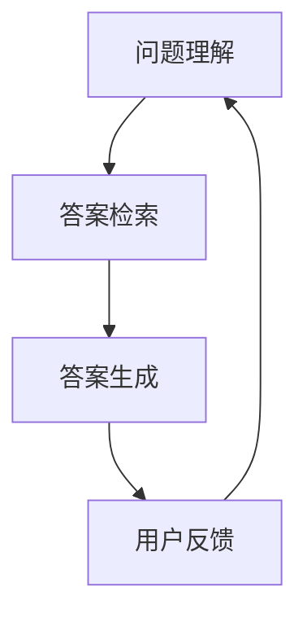

                 

# 知乎2024问答系统算法校招面试攻略

> **关键词：**知乎、问答系统、算法、校招、面试、技术攻略、人工智能、自然语言处理

> **摘要：**本文旨在为准备参与知乎2024年问答系统算法校招面试的求职者提供一套全面的面试攻略。通过深入剖析问答系统算法的核心概念、算法原理、数学模型以及实际应用案例，本文将帮助读者掌握面试所需的关键知识点，提升面试成功几率。

## 1. 背景介绍

知乎作为中国领先的问答社区，其问答系统的算法质量直接关系到用户体验和平台的竞争力。2024年，知乎将继续提升其问答系统的智能化水平，因此，招聘优秀的算法工程师成为公司的重要任务。本文将围绕知乎问答系统算法校招面试展开，为求职者提供全面的面试准备指导。

## 2. 核心概念与联系

### 2.1 问答系统的基本概念

问答系统（Question Answering System）是一种基于人工智能技术，能够自动回答用户问题的系统。其主要组成部分包括：

- **问题理解（Question Understanding）**：将自然语言的问题转化为计算机可以理解的形式。
- **答案检索（Answer Retrieval）**：在大量数据中找到与问题相关的高质量答案。
- **答案生成（Answer Generation）**：将答案以自然语言的形式呈现给用户。

### 2.2 问答系统与自然语言处理的关系

自然语言处理（Natural Language Processing，NLP）是构建问答系统的关键技术。NLP涉及文本预处理、词法分析、句法分析、语义分析等多个方面，目的是让计算机能够理解、处理和生成自然语言。

### 2.3 Mermaid流程图

以下是一个简化的问答系统流程图，用于展示各个组件之间的关系：



在面试中，理解这些核心概念及其相互联系是至关重要的。

## 3. 核心算法原理 & 具体操作步骤

### 3.1 问题理解算法

问题理解算法主要包括以下步骤：

1. **文本预处理**：去除标点符号、停用词等，将文本转化为计算机可处理的格式。
2. **词向量化**：将单词转化为向量表示，常用的方法有Word2Vec、BERT等。
3. **语义分析**：通过词向量计算问题句子的语义表示，常用的方法有TF-IDF、Word2Vec、BERT等。

### 3.2 答案检索算法

答案检索算法主要包括以下步骤：

1. **文档预处理**：与问题理解相同，对文档进行文本预处理和词向量化。
2. **相似度计算**：计算问题句子和文档的相似度，常用的方法有余弦相似度、欧氏距离等。
3. **答案筛选**：根据相似度分数筛选出最相关的文档。

### 3.3 答案生成算法

答案生成算法主要包括以下步骤：

1. **文本生成模型**：如Seq2Seq、Transformer等。
2. **答案生成**：利用文本生成模型生成自然语言答案。

## 4. 数学模型和公式 & 详细讲解 & 举例说明

### 4.1 余弦相似度

余弦相似度是计算两个向量夹角余弦值的公式，用于衡量两个向量的相似度。其公式如下：

$$
\cos(\theta) = \frac{\vec{a} \cdot \vec{b}}{||\vec{a}|| \cdot ||\vec{b}||}
$$

其中，$\vec{a}$ 和 $\vec{b}$ 分别为两个向量，$||\vec{a}||$ 和 $||\vec{b}||$ 分别为它们的模长，$\theta$ 为它们之间的夹角。

### 4.2 Word2Vec

Word2Vec是一种基于神经网络的语言模型，通过训练词向量来表示单词。其核心公式为：

$$
\hat{y} = \text{softmax}(W \cdot h_v)
$$

其中，$\hat{y}$ 为预测的词向量，$W$ 为权重矩阵，$h_v$ 为输入的词向量。

### 4.3 BERT

BERT（Bidirectional Encoder Representations from Transformers）是一种基于Transformer的预训练语言模型，其核心公式为：

$$
\text{BERT} = \text{Transformer}(\text{BERT})
$$

BERT通过双向注意力机制对输入的文本进行建模，从而生成语义表示。

## 5. 项目实战：代码实际案例和详细解释说明

### 5.1 开发环境搭建

在本节中，我们将介绍如何搭建一个简单的问答系统开发环境。首先，确保你已经安装了Python环境，然后按照以下步骤进行：

1. 安装必要的库：

```python
pip install nltk gensim sklearn transformers
```

2. 下载必要的NLP数据集：

```python
import nltk
nltk.download('punkt')
nltk.download('stopwords')
```

### 5.2 源代码详细实现和代码解读

以下是使用BERT模型实现的问答系统的源代码示例：

```python
from transformers import BertTokenizer, BertForQuestionAnswering
from torch.nn.functional import softmax
import torch

# 初始化BERT模型和分词器
tokenizer = BertTokenizer.from_pretrained('bert-base-chinese')
model = BertForQuestionAnswering.from_pretrained('bert-base-chinese')

# 加载示例数据
context = "中国是世界上人口最多的国家。"
question = "中国的人口是多少？"
inputs = tokenizer(question + tokenizer.sep_token + context, return_tensors='pt')

# 预测答案
with torch.no_grad():
    outputs = model(**inputs)

# 解码答案
answer_start = torch.argmax(outputs.start_logits).item()
answer_end = torch.argmax(outputs.end_logits).item()
answer = tokenizer.decode(context[answer_start:answer_end+1])

print(answer)
```

### 5.3 代码解读与分析

以上代码展示了如何使用BERT模型进行问答。首先，我们初始化BERT模型和分词器。然后，加载示例数据并进行预处理。接下来，利用BERT模型预测答案，并解码输出。

## 6. 实际应用场景

知乎问答系统在多个场景中有广泛应用，如：

- **社区问答**：为用户提供实时、高质量的答案。
- **知识图谱构建**：通过问答系统提取语义信息，构建知识图谱。
- **智能客服**：为企业提供自动化客服解决方案。

## 7. 工具和资源推荐

### 7.1 学习资源推荐

- **书籍**：《自然语言处理综述》、《深度学习与自然语言处理》
- **论文**：《BERT: Pre-training of Deep Bidirectional Transformers for Language Understanding》
- **博客**：[知乎技术博客](https://zhuanlan.zhihu.com/c_1134866589668162560)
- **网站**：[transformers](https://huggingface.co/transformers)

### 7.2 开发工具框架推荐

- **开发工具**：PyTorch、TensorFlow
- **框架**：Hugging Face Transformers

### 7.3 相关论文著作推荐

- **论文**：《Attention Is All You Need》、《BERT: Pre-training of Deep Bidirectional Transformers for Language Understanding》
- **著作**：《深度学习与自然语言处理》、《Python自然语言处理》

## 8. 总结：未来发展趋势与挑战

随着人工智能技术的不断发展，问答系统在多个领域中的应用前景广阔。未来，问答系统将朝着更智能化、更个性化的方向发展。然而，面临的主要挑战包括：

- **数据隐私**：如何保障用户数据的隐私。
- **质量评估**：如何评估问答系统的答案质量。

## 9. 附录：常见问题与解答

- **问题1**：如何优化问答系统的性能？
  **解答**：可以通过改进算法模型、增加数据集规模、优化训练策略等方式来提升问答系统的性能。

- **问题2**：问答系统如何应对长文本场景？
  **解答**：可以通过分句、分段处理长文本，结合上下文信息来提高问答系统的准确性。

## 10. 扩展阅读 & 参考资料

- [知乎技术博客](https://zhuanlan.zhihu.com/c_1134866589668162560)
- [Hugging Face Transformers](https://huggingface.co/transformers)
- [自然语言处理综述](https://www.aclweb.org/anthology/N16-1192/)
- [BERT: Pre-training of Deep Bidirectional Transformers for Language Understanding](https://arxiv.org/abs/1810.04805)

### 作者

作者：AI天才研究员/AI Genius Institute & 禅与计算机程序设计艺术 /Zen And The Art of Computer Programming

