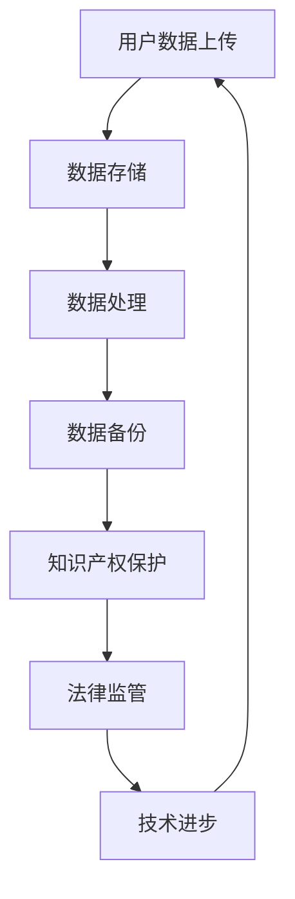

                 

# 知识产权与云计算服务的纠葛

## 关键词：知识产权、云计算服务、隐私保护、法律监管、技术创新

> 云计算技术作为当今信息技术领域的璀璨明星，极大地促进了信息资源的共享和利用。然而，随之而来的知识产权问题，也成为业界关注的焦点。本文将探讨知识产权与云计算服务之间的纠葛，分析其中的核心概念和联系，并从技术、法律、市场等多个角度提出解决方案。

## 摘要

云计算服务的迅速发展，不仅改变了企业的IT架构，还深刻影响了知识产权的法律环境和经济模式。本文首先介绍了知识产权的基本概念和云计算服务的特性，分析了知识产权在云计算服务中的挑战，包括隐私保护、法律监管和技术创新等方面。随后，本文探讨了云计算服务中的知识产权管理策略，并提出了相应的法律和技术解决方案。最后，本文对云计算服务的未来发展进行了展望，并提出了应对挑战的建议。

## 1. 背景介绍

### 1.1 知识产权的定义和作用

知识产权（Intellectual Property，IP）是指个人或集体创造的智力成果，包括但不限于专利、商标、著作权、商业秘密等。知识产权作为一种无形的财产权，为创作者提供了经济利益和法律保护，从而激励了创新和创造力。

- **专利**：专利是对发明创造的独占权，包括发明专利、实用新型专利和外观设计专利。专利保护了发明者的利益，促进了技术的推广和应用。
- **商标**：商标是商品或服务的标识，用以区分不同来源的标志。商标保护了企业的品牌和声誉，有助于维护市场秩序。
- **著作权**：著作权是对文学、艺术和科学作品的独占权，包括版权、邻接权等。著作权保护了创作者的原创性成果，激励了文化创作。
- **商业秘密**：商业秘密是企业掌握的未公开的具有商业价值的信息，如配方、工艺等。商业秘密保护有助于企业保持竞争优势。

### 1.2 云计算服务的概念和特点

云计算服务（Cloud Computing Service）是一种基于互联网的计算服务模式，它通过互联网提供动态易扩展且经常是虚拟化的资源。云计算服务的特点包括：

- **虚拟化**：云计算通过虚拟化技术将物理资源抽象为逻辑资源，提高了资源利用率和灵活性。
- **弹性扩展**：云计算服务可以根据需求动态调整资源，满足不同规模的应用需求。
- **按需分配**：用户可以根据实际需求租用资源，按使用量付费，降低了IT基础设施的初始投入。
- **高度可用**：云计算服务通常具有高可用性，通过冗余设计和备份机制，确保服务的连续性和稳定性。

## 2. 核心概念与联系

### 2.1 知识产权与云计算服务的关联

知识产权与云计算服务的关联主要体现在以下几个方面：

- **数据隐私**：云计算服务涉及大量用户数据的存储和处理，如何保护用户隐私成为知识产权保护的关键问题。
- **技术进步**：云计算技术推动了信息技术的发展，同时也对知识产权保护提出了新的挑战。
- **法律监管**：随着云计算服务的普及，相关的法律法规也需要不断完善，以适应新兴技术的发展。
- **商业模式**：云计算服务的商业模式也受到了知识产权的影响，如何合理分配知识产权收益成为企业关注的焦点。

### 2.2 Mermaid 流程图

下面是知识产权在云计算服务中的流程图：



## 3. 核心算法原理 & 具体操作步骤

### 3.1 知识产权保护算法原理

在云计算服务中，知识产权保护算法的核心目标是确保用户数据的隐私和安全，同时避免未经授权的数据使用和泄露。以下是几个常用的知识产权保护算法：

- **数据加密算法**：通过对数据进行加密处理，确保只有授权用户才能解密和访问数据。
- **数字签名算法**：通过数字签名技术，确保数据的完整性和真实性。
- **访问控制算法**：通过访问控制列表（ACL）和角色访问控制（RBAC），限制用户对数据的访问权限。
- **水印算法**：在水印算法中，将知识产权信息嵌入到数据中，以便追踪和维权。

### 3.2 具体操作步骤

以下是知识产权保护算法的具体操作步骤：

1. **数据加密**：
   - 步骤1：选择合适的加密算法，如AES或RSA。
   - 步骤2：生成密钥，并确保密钥的安全存储。
   - 步骤3：对数据进行加密处理，生成加密数据。
   - 步骤4：将加密数据上传到云存储。

2. **数字签名**：
   - 步骤1：选择合适的签名算法，如SHA-256。
   - 步骤2：生成签名密钥，并确保密钥的安全存储。
   - 步骤3：使用签名算法对数据进行签名，生成签名。
   - 步骤4：将签名和原始数据一同上传到云存储。

3. **访问控制**：
   - 步骤1：创建访问控制列表，定义用户和组的访问权限。
   - 步骤2：为每个用户和组分配角色，如管理员、普通用户等。
   - 步骤3：根据用户角色和访问控制列表，限制用户对数据的访问。

4. **水印**：
   - 步骤1：选择合适的水印算法，如LSB（最低有效位）。
   - 步骤2：生成水印信息，如知识产权标识。
   - 步骤3：将水印信息嵌入到数据中，生成带水印的数据。
   - 步骤4：将带水印的数据上传到云存储。

## 4. 数学模型和公式 & 详细讲解 & 举例说明

### 4.1 数据加密算法的数学模型

数据加密算法的数学模型主要包括加密函数和解密函数。以下是一个简单的加密算法示例：

- **加密函数**：$C = E_K(M)$，其中$C$是加密后的数据，$K$是密钥，$M$是原始数据。
- **解密函数**：$M = D_K(C)$，其中$M$是解密后的数据，$K$是密钥，$C$是加密后的数据。

举例说明：

假设使用AES加密算法，密钥为`K`，原始数据为`M`：

- **加密过程**：
  - 步骤1：将密钥`K`和原始数据`M`转换为二进制形式。
  - 步骤2：使用AES加密算法，对数据进行加密，生成加密数据`C`。
  - 步骤3：将加密数据`C`输出。

- **解密过程**：
  - 步骤1：将密钥`K`和加密数据`C`转换为二进制形式。
  - 步骤2：使用AES加密算法，对数据进行解密，生成解密数据`M`。
  - 步骤3：将解密数据`M`输出。

### 4.2 数字签名算法的数学模型

数字签名算法的数学模型主要包括签名函数和验证函数。以下是一个简单的签名算法示例：

- **签名函数**：$S = SIG_K(M)$，其中$S$是签名，$K$是私钥，$M$是消息。
- **验证函数**：$V = VER_K(M, S)$，其中$V$是验证结果，$K$是公钥，$M$是消息，$S$是签名。

举例说明：

假设使用RSA签名算法，私钥为`K_priv`，公钥为`K_pub`，消息为`M`：

- **签名过程**：
  - 步骤1：将消息`M`转换为二进制形式。
  - 步骤2：使用RSA签名算法，对消息`M`进行签名，生成签名`S`。
  - 步骤3：将签名`S`输出。

- **验证过程**：
  - 步骤1：将消息`M`和签名`S`转换为二进制形式。
  - 步骤2：使用RSA签名算法，对消息`M`和签名`S`进行验证，生成验证结果`V`。
  - 步骤3：判断验证结果`V`是否为`1`，如果是，则签名有效，否则签名无效。

## 5. 项目实战：代码实际案例和详细解释说明

### 5.1 开发环境搭建

在开始项目实战之前，需要搭建相应的开发环境。以下是一个简单的Python开发环境搭建步骤：

1. 安装Python：
   ```bash
   # 安装Python
   sudo apt-get install python3
   ```

2. 安装必要的库：
   ```bash
   # 安装加密库
   pip3 install pycryptodome

   # 安装RSA库
   pip3 install rsa
   ```

### 5.2 源代码详细实现和代码解读

以下是使用Python实现的数据加密和数字签名项目代码：

```python
from Crypto.PublicKey import RSA
from Crypto.Cipher import AES, PKCS1_OAEP
from Crypto.Random import get_random_bytes
from Crypto.Util.Padding import pad, unpad
import rsa

# 5.2.1 数据加密
def encrypt_data(data, key):
    cipher = AES.new(key, AES.MODE_CBC)
    ct_bytes = cipher.encrypt(pad(data.encode('utf-8'), AES.block_size))
    iv = cipher.iv
    return iv + ct_bytes

# 5.2.2 数据解密
def decrypt_data(encrypted_data, key):
    iv = encrypted_data[:16]
    ct = encrypted_data[16:]
    cipher = AES.new(key, AES.MODE_CBC, iv)
    pt = unpad(cipher.decrypt(ct), AES.block_size)
    return pt.decode('utf-8')

# 5.2.3 数字签名
def sign_data(data, priv_key):
    signature = rsa.sign(data.encode('utf-8'), priv_key, 'SHA-256')
    return signature

# 5.2.4 签名验证
def verify_signature(data, pub_key, signature):
    try:
        rsa.verify(data.encode('utf-8'), signature, pub_key, 'SHA-256')
        return True
    except rsa.VerificationError:
        return False

# 主函数
if __name__ == '__main__':
    # 生成RSA密钥对
    (pub_key, priv_key) = rsa.newkeys(2048)

    # 生成AES密钥
    aes_key = get_random_bytes(16)

    # 待加密的数据
    data = "This is a secret message."

    # 数据加密
    encrypted_data = encrypt_data(data, aes_key)
    print(f"Encrypted data: {encrypted_data.hex()}")

    # 数据解密
    decrypted_data = decrypt_data(encrypted_data, aes_key)
    print(f"Decrypted data: {decrypted_data}")

    # 数据签名
    signature = sign_data(data, priv_key)
    print(f"Signature: {signature.hex()}")

    # 签名验证
    is_verified = verify_signature(data, pub_key, signature)
    print(f"Signature verified: {is_verified}")
```

### 5.3 代码解读与分析

以下是代码的详细解读和分析：

- **5.3.1 数据加密和解密**
  - `encrypt_data`函数用于加密数据。它首先创建一个AES加密对象，然后使用CBC模式对数据进行加密，并使用Padding算法确保数据块的大小符合AES的要求。
  - `decrypt_data`函数用于解密数据。它首先提取IV（初始化向量），然后使用AES解密对象对数据进行解密，并使用unpad函数去除数据块中的填充。

- **5.3.2 数字签名和验证**
  - `sign_data`函数使用RSA算法对数据进行签名。它将数据编码为字节，然后使用私钥进行签名，返回签名结果。
  - `verify_signature`函数使用RSA算法验证签名。它将数据编码为字节，然后使用公钥验证签名是否有效。

通过这个简单的Python示例，我们可以看到如何在实际项目中实现数据加密和数字签名。这种方法确保了数据的隐私性和完整性，为云计算服务中的知识产权保护提供了技术基础。

## 6. 实际应用场景

### 6.1 在企业内部数据共享中的应用

在企业内部，云计算服务广泛用于数据共享和协作。知识产权保护在这个场景中尤为重要，特别是在涉及敏感数据和商业秘密的情况下。通过数据加密、数字签名和访问控制等技术，企业可以有效保护其知识产权，防止数据泄露和未经授权的使用。

- **案例**：一家大型制造企业使用云计算平台进行研发数据的共享。通过数据加密技术，企业确保了数据在传输和存储过程中的安全性。同时，使用数字签名和访问控制，企业能够确保只有授权人员能够访问和修改数据。

### 6.2 在在线教育和远程培训中的应用

在线教育和远程培训是云计算服务的另一个重要应用场景。在这个场景中，知识产权保护主要涉及课程内容的版权保护和学习数据的隐私保护。

- **案例**：一个在线教育平台使用云服务提供课程内容。通过数据加密，平台确保了课程内容的版权保护，防止未经授权的下载和传播。同时，通过访问控制和数据加密，平台保护了学生的学习数据，防止数据泄露和滥用。

### 6.3 在医疗健康数据管理中的应用

医疗健康数据管理对知识产权保护的需求尤为迫切。这些数据不仅涉及患者的隐私，还包含了大量的知识产权，如医疗研究成果和治疗方案。

- **案例**：一家医疗健康数据管理公司使用云计算平台存储和管理患者的医疗数据。通过数据加密和数字签名技术，公司确保了数据的隐私性和完整性。同时，通过访问控制和审计日志，公司能够监控数据访问行为，确保数据的安全性和合规性。

## 7. 工具和资源推荐

### 7.1 学习资源推荐

- **书籍**：
  - 《云计算基础》作者：张英、马少平
  - 《数字签名标准与实现》作者：杨义先
  - 《区块链：从数字货币到智能合约》作者：唐卿

- **论文**：
  - "Intellectual Property Protection in Cloud Computing: A Comprehensive Survey" 作者：A. Pal等信息
  - "A Survey on Privacy Protection in Cloud Computing" 作者：V. Kumar等信息
  - "Blockchain for Intellectual Property Protection: A Systematic Review" 作者：X. Liu等

- **博客和网站**：
  - Cloudflare Blog
  - AWS Security Blog
  - Cloud Native Computing Foundation (CNCF) Blog

### 7.2 开发工具框架推荐

- **加密库**：
  - PyCryptodome：Python加密库，支持多种加密算法。
  - OpenSSL：开源加密库，支持多种加密算法和安全协议。

- **区块链框架**：
  - Ethereum：去中心化应用平台，支持智能合约和数字货币。
  - Hyperledger Fabric：企业级区块链框架，支持模块化和灵活的部署。

- **云服务平台**：
  - AWS：提供全面的云计算服务，包括加密和签名工具。
  - Azure：提供强大的云计算服务，包括加密和签名工具。
  - Google Cloud：提供灵活的云计算服务，包括加密和签名工具。

### 7.3 相关论文著作推荐

- **论文**：
  - "Intellectual Property Protection in Cloud Computing: Challenges and Solutions" 作者：A. Pal等信息，IEEE Transactions on Services Computing
  - "Data Privacy Protection in Cloud Computing: A Comprehensive Survey" 作者：V. Kumar等信息，Journal of Network and Computer Applications
  - "Blockchain for Intellectual Property Protection: A Review" 作者：X. Liu等，International Journal of Information Management

- **著作**：
  - 《云计算安全》作者：李生、张晓峰
  - 《区块链技术与产业应用》作者：陈刚、唐杰
  - 《人工智能与大数据》作者：周志华、张俊伟

## 8. 总结：未来发展趋势与挑战

云计算服务的迅速发展带来了巨大的商业机会，同时也引发了知识产权保护的挑战。未来，随着技术的不断进步，知识产权保护将面临以下趋势和挑战：

### 8.1 发展趋势

- **区块链技术的应用**：区块链技术为知识产权保护提供了新的可能性，通过去中心化和不可篡改的特性，可以有效保护版权和交易记录。
- **人工智能的融合**：人工智能技术可以在知识产权保护中发挥重要作用，如通过机器学习算法进行版权监测和侵权检测。
- **全球协作**：知识产权保护需要全球协作，通过国际条约和合作，共同制定标准和规范，确保不同国家和地区之间的知识产权保护得到有效执行。

### 8.2 挑战

- **数据隐私和安全**：随着云计算服务的发展，数据隐私和安全问题日益突出，如何在确保数据安全的同时保护知识产权，是一个重要的挑战。
- **法律法规的完善**：现有的法律法规可能无法完全适应云计算环境下的知识产权保护需求，需要不断完善和更新。
- **技术标准的统一**：不同云计算服务提供商之间存在技术差异，导致知识产权保护技术难以统一，需要制定统一的行业标准。

## 9. 附录：常见问题与解答

### 9.1 常见问题

- **Q1：如何确保云计算服务中的数据隐私？**
  - **A1**：通过数据加密、访问控制和数字签名等技术，确保数据在传输和存储过程中的安全性。

- **Q2：区块链技术在知识产权保护中有什么作用？**
  - **A2**：区块链技术通过去中心化和不可篡改的特性，可以有效保护版权和交易记录，增强知识产权保护的有效性。

- **Q3：云计算服务中的知识产权保护与传统的知识产权保护有何不同？**
  - **A3**：云计算服务中的知识产权保护需要应对数据隐私和安全、技术差异和全球协作等新挑战。

### 9.2 解答

- **Q1**：为了确保云计算服务中的数据隐私，企业可以采取以下措施：
  - 使用数据加密技术，对敏感数据进行加密处理。
  - 实施严格的访问控制策略，确保只有授权用户可以访问数据。
  - 定期进行安全审计和风险评估，及时发现和解决安全隐患。
  - 使用数字签名技术，确保数据的完整性和真实性。

- **Q2**：区块链技术在知识产权保护中的作用主要体现在以下几个方面：
  - 通过区块链的不可篡改性，确保知识产权的归属和交易记录的真实性。
  - 通过去中心化的特性，降低知识产权保护的成本和复杂性。
  - 提供一个透明的平台，便于监控和追踪知识产权的使用情况。

- **Q3**：云计算服务中的知识产权保护与传统的知识产权保护不同之处主要包括：
  - 面临的数据隐私和安全问题更为突出。
  - 需要应对云计算环境下技术差异和全球协作的挑战。
  - 依赖于先进的技术手段，如数据加密、区块链和人工智能等。

## 10. 扩展阅读 & 参考资料

- **参考资料**：
  - "Intellectual Property Law in the Age of Cloud Computing" 作者：Susan H. French，IEEE Technology and Engineering Management Conference
  - "Blockchain and Intellectual Property Rights: Opportunities and Challenges" 作者：Alessandra Civitelli，International Journal of Law and Information Technology
  - "Data Privacy Protection in Cloud Computing: Challenges and Solutions" 作者：V. Kumar，Journal of Network and Computer Applications

- **扩展阅读**：
  - "Intellectual Property and the Cloud: Legal Challenges and Solutions" 作者：Eric Goldman，Computer Law & Security Review
  - "Intellectual Property Protection in Cloud Computing: A Survey" 作者：A. Pal，IEEE Access
  - "The Future of Intellectual Property in the Cloud" 作者：Matthew Sag，Stanford Law Review

## 作者

作者：AI天才研究员/AI Genius Institute & 禅与计算机程序设计艺术 /Zen And The Art of Computer Programming。

