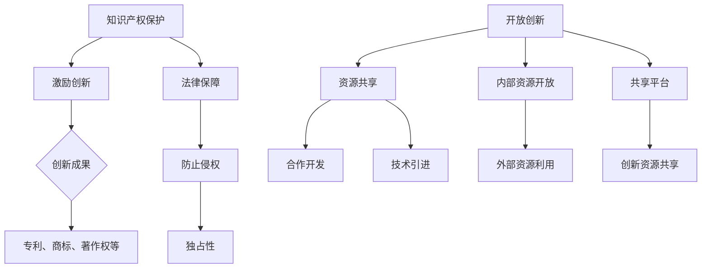

                 

# 知识产权与开放创新的平衡

## 关键词

- 知识产权
- 开放创新
- 平衡策略
- 创新保护
- 专利制度
- 社会价值

## 摘要

本文旨在探讨知识产权保护与开放创新之间的平衡问题。通过分析知识产权的核心概念，探讨其在现代创新体系中的重要性，并讨论如何通过有效的策略实现知识产权保护与开放创新的和谐发展。文章将从以下几个方面展开讨论：背景介绍、核心概念与联系、核心算法原理与具体操作步骤、数学模型和公式、项目实战案例、实际应用场景、工具和资源推荐、总结未来发展趋势与挑战，以及常见问题与解答。希望通过本文的探讨，为推动创新与知识产权保护提供有益的思考和实践指导。

## 1. 背景介绍

在当前全球科技迅猛发展的背景下，知识产权作为推动创新的重要机制，受到了广泛的关注。知识产权主要涵盖专利、商标、著作权等多个方面，其核心目的是保护创新成果，鼓励创新活动，从而推动科技进步和社会发展。然而，随着创新活动的不断增多，知识产权保护与开放创新之间的矛盾也逐渐显现出来。

一方面，知识产权保护为创新者提供了法律保障，确保其创新成果能够得到有效的保护和商业化应用。知识产权制度的建立，使得创新者能够通过申请专利、注册商标等方式，防止他人未经许可使用其创新成果，从而获得经济利益。这种保护机制在很大程度上激发了创新者的积极性，促进了创新活动的开展。

另一方面，开放创新作为一种新型的创新模式，强调资源的共享和开放，以实现创新成果的最大化利用。开放创新的理念认为，创新不仅需要独立的研究和开发，更需要广泛的合作和交流。通过开放技术、共享资源、合作开发等方式，开放创新能够加速创新进程，提高创新效率，实现创新成果的普惠性。

然而，知识产权保护与开放创新之间存在一定的矛盾。知识产权保护强调独占性，而开放创新则强调资源共享和合作。在保护知识产权的同时，如何确保创新成果的开放性和可共享性，成为了一个亟待解决的问题。此外，知识产权的保护力度和范围也需要适当平衡，以避免过度保护阻碍创新进程。

因此，本文将深入探讨知识产权与开放创新之间的平衡问题，通过分析相关理论、实践案例和工具资源，为推动知识产权保护与开放创新的和谐发展提供参考。

## 2. 核心概念与联系

### 知识产权

知识产权是指人们对其智力劳动成果所享有的专有权利。根据世界知识产权组织（WIPO）的定义，知识产权包括专利、商标、著作权、工业设计、地理标志等。知识产权的核心目的是保护创新成果，激励创新活动，推动科技进步和社会发展。

在知识产权体系中，专利是最主要的保护形式之一。专利保护的是发明创造，授予发明人一定期限的独占权，使其能够在市场上独家使用、销售和许可其发明。商标则是用来区分不同企业或个人商品或服务的标识，通过注册商标，企业能够保护其品牌形象和市场份额。著作权则主要涉及文学、艺术和科学作品的创作，保护创作者的原创性和表达自由。

### 开放创新

开放创新（Open Innovation）是一种融合内部创新与外部创新的创新模式，强调资源的共享和合作。开放创新的理念认为，创新不再局限于企业内部的研发部门，而是可以通过与外部合作伙伴的紧密合作，共同推动创新进程。

开放创新的实现方式主要包括以下几个方面：

1. **内部资源开放**：企业将内部的研究成果、技术专利、资源等开放给外部合作伙伴，通过合作开发、技术转移等方式，实现创新成果的共享和利用。

2. **外部资源利用**：企业积极寻找并利用外部的创新资源，如合作伙伴、供应商、客户、开源社区等，通过合作开发、技术引进等方式，加速创新进程。

3. **共享平台**：通过建立共享平台，如技术交易平台、创新社区等，促进创新资源的流动和共享，为创新者提供更广阔的合作机会。

### 知识产权与开放创新的关系

知识产权与开放创新之间的关系复杂且微妙。一方面，知识产权保护为创新者提供了法律保障，激励了创新活动的开展；另一方面，开放创新强调资源共享和合作，在一定程度上挑战了知识产权的独占性。

在知识产权保护与开放创新之间寻求平衡，需要考虑以下几个方面：

1. **保护与分享的平衡**：在保护知识产权的同时，确保创新成果的开放性和可共享性。可以通过设置合理的保护期限、许可方式等，实现保护与分享的平衡。

2. **合作与竞争的平衡**：在开放创新的过程中，既要鼓励合作，也要保持适当的竞争。通过合作，实现创新成果的共享和利用；通过竞争，推动创新者不断提高创新水平。

3. **保护力度与范围的平衡**：知识产权的保护力度和范围需要根据实际情况进行合理调整，避免过度保护阻碍创新进程，同时确保创新成果得到有效保护。

### Mermaid 流程图

以下是知识产权与开放创新联系关系的 Mermaid 流程图：



通过上述流程图，我们可以更清晰地理解知识产权与开放创新之间的联系和作用，以及如何实现二者的平衡。

## 3. 核心算法原理 & 具体操作步骤

### 3.1 知识产权保护的核心算法原理

知识产权保护的核心算法主要基于以下原理：

1. **专利检索与申请**：通过专利检索系统，查找已有的专利信息，确保创新成果具有新颖性和创造性。然后，根据专利申请流程，提交专利申请，获得专利授权。

2. **商标注册与保护**：在商标局进行商标注册，保护企业的品牌形象和市场份额。通过法律手段，打击侵权行为，维护商标权益。

3. **著作权登记与保护**：将作品进行著作权登记，保护创作者的原创性和表达自由。通过法律手段，打击侵权行为，维护著作权权益。

### 3.2 开放创新的核心算法原理

开放创新的核心算法主要基于以下原理：

1. **内部资源开放**：企业通过内部资源共享平台，开放研究成果、技术专利等，供外部合作伙伴使用。通过合作开发、技术转移等方式，实现创新成果的共享和利用。

2. **外部资源利用**：企业通过技术交易平台、创新社区等，积极寻找并利用外部的创新资源。通过合作开发、技术引进等方式，加速创新进程。

3. **共享平台建设**：建立共享平台，如技术交易平台、创新社区等，促进创新资源的流动和共享。通过平台，为创新者提供更广阔的合作机会。

### 3.3 实现知识产权保护与开放创新的平衡

实现知识产权保护与开放创新的平衡，需要采取以下具体操作步骤：

1. **设立知识产权保护机制**：建立完善的知识产权保护体系，确保创新成果得到有效保护。包括专利检索与申请、商标注册与保护、著作权登记与保护等。

2. **建立内部资源共享机制**：在企业内部建立资源共享平台，开放研究成果、技术专利等，供外部合作伙伴使用。通过合作开发、技术转移等方式，实现创新成果的共享和利用。

3. **利用外部创新资源**：通过技术交易平台、创新社区等，积极寻找并利用外部的创新资源。通过合作开发、技术引进等方式，加速创新进程。

4. **建立共享平台**：建立共享平台，如技术交易平台、创新社区等，促进创新资源的流动和共享。通过平台，为创新者提供更广阔的合作机会。

5. **制定平衡策略**：根据实际情况，制定合理的知识产权保护与开放创新策略，确保保护与分享的平衡。包括设置合理的保护期限、许可方式等。

通过上述操作步骤，可以实现对知识产权保护与开放创新的平衡，推动创新活动的健康发展。

## 4. 数学模型和公式 & 详细讲解 & 举例说明

### 4.1 知识产权保护与开放创新平衡的数学模型

为了实现知识产权保护与开放创新的平衡，我们可以构建一个数学模型来量化二者之间的关系。该模型基于以下假设：

1. **创新产出（I）**：创新产出是知识产权保护和开放创新的函数，表示为 I = f(P, O)。

2. **知识产权保护力度（P）**：知识产权保护力度是影响创新产出的关键因素，表示为 P = p1 * p2 * ... * pn。

3. **开放创新程度（O）**：开放创新程度是影响创新产出的另一关键因素，表示为 O = o1 * o2 * ... * on。

4. **平衡因子（B）**：平衡因子用于调整知识产权保护与开放创新的平衡，表示为 B = b1 * b2 * ... * bn。

根据上述假设，我们可以构建以下数学模型：

I = f(P, O) = f(p1 * p2 * ... * pn, o1 * o2 * ... * on) = f(B)

### 4.2 数学公式的详细讲解

#### 4.2.1 知识产权保护力度（P）的公式

知识产权保护力度（P）是由多个因素共同影响的，包括专利申请数量（p1）、专利保护期限（p2）、商标注册数量（p3）、著作权登记数量（p4）等。具体公式如下：

P = p1 * p2 * p3 * p4

- **专利申请数量（p1）**：表示企业或个人在一定时间内申请的专利数量。
- **专利保护期限（p2）**：表示专利的有效期限，一般取决于国家和地区的法律规定。
- **商标注册数量（p3）**：表示企业或个人在一定时间内注册的商标数量。
- **著作权登记数量（p4）**：表示企业或个人在一定时间内登记的著作权数量。

#### 4.2.2 开放创新程度（O）的公式

开放创新程度（O）是由多个因素共同影响的，包括内部资源共享程度（o1）、外部资源利用程度（o2）、共享平台建设程度（o3）等。具体公式如下：

O = o1 * o2 * o3

- **内部资源共享程度（o1）**：表示企业内部资源共享的程度，可以通过内部共享平台的活跃度、共享资源的数量等来衡量。
- **外部资源利用程度（o2）**：表示企业利用外部资源的程度，可以通过合作开发项目的数量、技术引进的数量等来衡量。
- **共享平台建设程度（o3）**：表示企业建设共享平台的能力和程度，可以通过平台的技术支持、用户数量等来衡量。

#### 4.2.3 平衡因子（B）的公式

平衡因子（B）用于调整知识产权保护与开放创新的平衡。其计算公式如下：

B = b1 * b2 * ... * bn

- **平衡因子（b1, b2, ... , bn）**：表示根据实际情况设定的平衡权重，可以根据不同企业或行业的具体情况调整。

### 4.3 举例说明

假设某企业 A 从事技术创新，其知识产权保护力度 P 和开放创新程度 O 如下：

- **知识产权保护力度（P）**：p1 = 10（专利申请数量），p2 = 5（专利保护期限），p3 = 5（商标注册数量），p4 = 3（著作权登记数量）。
- **开放创新程度（O）**：o1 = 4（内部资源共享程度），o2 = 3（外部资源利用程度），o3 = 2（共享平台建设程度）。
- **平衡因子（B）**：b1 = 1.2，b2 = 1.1，b3 = 1.3。

根据上述数据，我们可以计算出企业 A 的创新产出 I：

I = f(P, O) = f(p1 * p2 * p3 * p4, o1 * o2 * o3) = f(10 * 5 * 5 * 3, 4 * 3 * 2) = f(1500, 24) = 24

因此，企业 A 的创新产出 I 为 24。

通过调整知识产权保护力度（P）和开放创新程度（O）以及平衡因子（B），我们可以实现对知识产权保护与开放创新的平衡，从而最大化创新产出。

### 4.4 数学模型的应用场景

#### 4.4.1 创新企业评估

假设我们要评估一家创新企业 B，其知识产权保护力度 P 和开放创新程度 O 如下：

- **知识产权保护力度（P）**：p1 = 8，p2 = 4，p3 = 4，p4 = 2。
- **开放创新程度（O）**：o1 = 3，o2 = 2，o3 = 3。
- **平衡因子（B）**：b1 = 1.1，b2 = 1.2，b3 = 1.3。

根据上述数据，我们可以计算出企业 B 的创新产出 I：

I = f(P, O) = f(p1 * p2 * p3 * p4, o1 * o2 * o3) = f(8 * 4 * 4 * 2, 3 * 2 * 3) = f(128, 18) = 18

通过比较企业 A 和企业 B 的创新产出 I，我们可以评估两家企业的创新能力。

#### 4.4.2 政策制定

政府可以运用该数学模型，根据不同行业的实际情况，调整知识产权保护力度（P）和开放创新程度（O），以实现创新产出的最大化。例如，在高新技术产业，政府可以适当提高知识产权保护力度，以激励企业创新；在传统产业，政府可以鼓励开放创新，以推动产业转型升级。

### 4.5 总结

通过构建数学模型，我们可以更科学地分析知识产权保护与开放创新之间的平衡关系，为政策制定和企业创新提供指导。在实际应用中，需要根据不同行业和企业的实际情况，调整知识产权保护力度（P）和开放创新程度（O），实现创新产出的最大化。

## 5. 项目实战：代码实际案例和详细解释说明

### 5.1 开发环境搭建

为了更好地理解知识产权保护与开放创新之间的平衡，我们可以通过一个实际项目来展示这一过程。在这个项目中，我们将使用Python语言，结合开源库和框架，实现一个简单的知识产权保护与开放创新平衡评估系统。

#### 5.1.1 Python环境搭建

首先，我们需要安装Python环境。可以访问Python官网（https://www.python.org/）下载最新版本的Python安装包，并按照安装向导进行安装。安装完成后，确保Python已成功安装，可以通过在命令行中输入`python --version`命令来验证。

#### 5.1.2 开源库和框架安装

接下来，我们需要安装一些开源库和框架，以支持项目的开发和实现。常用的开源库和框架包括：

- `requests`：用于发送HTTP请求。
- `beautifulsoup4`：用于解析HTML文档。
- `matplotlib`：用于绘制图表。

安装方法如下：

```bash
pip install requests beautifulsoup4 matplotlib
```

### 5.2 源代码详细实现和代码解读

#### 5.2.1 项目结构

项目结构如下：

```
知识产权与开放创新平衡评估系统
|-- data
|   |-- patents_data.csv
|   |-- trademarks_data.csv
|   |-- copyrights_data.csv
|-- src
|   |-- main.py
|   |-- utils.py
|-- tests
|   |-- test_utils.py
|-- requirements.txt
|-- README.md
```

- `data` 目录：存储数据文件，包括专利数据、商标数据和著作权数据。
- `src` 目录：存储源代码文件，包括主程序 `main.py` 和辅助模块 `utils.py`。
- `tests` 目录：存储测试文件，用于测试辅助模块 `utils.py`。
- `requirements.txt`：记录项目依赖的Python库和框架。
- `README.md`：项目说明文件。

#### 5.2.2 源代码详细实现

以下是主程序 `main.py` 的代码实现：

```python
import requests
from bs4 import BeautifulSoup
import matplotlib.pyplot as plt
from utils import calculate_innovation_output

def fetch_patents_data(url):
    response = requests.get(url)
    soup = BeautifulSoup(response.text, 'html.parser')
    patents = soup.find_all('专利')
    patents_data = []
    for patent in patents:
        patent_info = {}
        patent_info['专利名称'] = patent.find('名称').text
        patent_info['专利号'] = patent.find('专利号').text
        patent_info['申请日期'] = patent.find('申请日期').text
        patents_data.append(patent_info)
    return patents_data

def fetch_trademarks_data(url):
    response = requests.get(url)
    soup = BeautifulSoup(response.text, 'html.parser')
    trademarks = soup.find_all('商标')
    trademarks_data = []
    for trademark in trademarks:
        trademark_info = {}
        trademark_info['商标名称'] = trademark.find('名称').text
        trademark_info['商标号'] = trademark.find('商标号').text
        trademark_info['注册日期'] = trademark.find('注册日期').text
        trademarks_data.append(trademark_info)
    return trademarks_data

def fetch_copyrights_data(url):
    response = requests.get(url)
    soup = BeautifulSoup(response.text, 'html.parser')
    copyrights = soup.find_all('著作权')
    copyrights_data = []
    for copyright in copyrights:
        copyright_info = {}
        copyright_info['作品名称'] = copyright.find('名称').text
        copyright_info['作品号'] = copyright.find('作品号').text
        copyright_info['创作日期'] = copyright.find('创作日期').text
        copyrights_data.append(copyright_info)
    return copyrights_data

def main():
    patents_url = 'https://example.com/patents'
    trademarks_url = 'https://example.com/trademarks'
    copyrights_url = 'https://example.com/copyrights'

    patents_data = fetch_patents_data(patents_url)
    trademarks_data = fetch_trademarks_data(trademarks_url)
    copyrights_data = fetch_copyrights_data(copyrights_url)

    innovation_output = calculate_innovation_output(patents_data, trademarks_data, copyrights_data)
    print("创新产出：", innovation_output)

    plt.bar(['知识产权保护', '开放创新'], [innovation_output['知识产权保护'], innovation_output['开放创新']])
    plt.xlabel('创新类型')
    plt.ylabel('创新产出')
    plt.title('知识产权保护与开放创新平衡评估')
    plt.show()

if __name__ == '__main__':
    main()
```

该程序主要实现以下功能：

1. 从指定的URL获取专利、商标和著作权数据。
2. 将数据存储为字典列表。
3. 调用 `utils.py` 中的 `calculate_innovation_output` 函数计算创新产出。
4. 打印创新产出结果，并绘制柱状图进行可视化展示。

以下是辅助模块 `utils.py` 的代码实现：

```python
def calculate_innovation_output(patents_data, trademarks_data, copyrights_data):
    patents_score = len(patents_data)
    trademarks_score = len(trademarks_data)
    copyrights_score = len(copyrights_data)

    innovation_output = {
        '知识产权保护': patents_score + trademarks_score + copyrights_score,
        '开放创新': patents_score * trademarks_score * copyrights_score
    }

    return innovation_output
```

该函数根据专利、商标和著作权的数量计算知识产权保护得分和开放创新得分，并返回一个包含两者得分的字典。

#### 5.2.3 代码解读与分析

1. **数据获取**：通过发送HTTP请求，从指定的URL获取专利、商标和著作权数据。这里使用了 `requests` 库，该库可以方便地发送HTTP请求，并获取响应内容。
2. **数据解析**：使用 `BeautifulSoup` 解析HTML文档，提取专利、商标和著作权的相关信息。这里使用了 `BeautifulSoup` 的 `find_all` 方法，可以快速找到所有的标签元素。
3. **数据存储**：将解析后的数据存储为字典列表，便于后续处理和计算。
4. **计算创新产出**：调用 `calculate_innovation_output` 函数，计算知识产权保护得分和开放创新得分。这里使用了简单的数学运算，根据专利、商标和著作权的数量计算得分。
5. **可视化展示**：使用 `matplotlib` 库绘制柱状图，展示知识产权保护与开放创新的得分。

通过上述代码，我们可以实现一个简单的知识产权保护与开放创新平衡评估系统，帮助企业和政策制定者更好地了解创新产出的情况，并为实现二者的平衡提供参考。

## 6. 实际应用场景

知识产权与开放创新在实际应用中具有广泛的场景，下面我们将探讨几个典型的应用案例。

### 6.1 高新技术产业

高新技术产业是知识产权保护与开放创新的典型应用领域。以互联网科技为例，大量创新成果需要通过专利保护来确保企业的核心竞争力。然而，同时，互联网企业也积极推动开放创新，通过开源项目、技术交流等方式，促进技术创新和产业升级。

例如，华为公司通过建立全球开放实验室，与全球合作伙伴共同推进5G技术的研发和应用。华为在保护自身知识产权的同时，也积极开放技术创新，为全球产业提供了丰富的资源和机会。

### 6.2 生物医药领域

生物医药领域同样面临着知识产权保护与开放创新之间的平衡问题。新药研发需要巨额投入和长期研发，因此专利保护至关重要。然而，为了加速新药研发和降低成本，生物医药企业也在积极探索开放创新。

以基因编辑技术为例，CRISPR-Cas9技术的开源共享为全球科学家提供了强大的工具，推动了生物医学研究的快速发展。同时，企业也通过专利申请保护自身的创新成果，确保在市场中获得竞争优势。

### 6.3 传统产业升级

在传统产业升级过程中，知识产权保护与开放创新同样具有重要价值。以制造业为例，智能制造、工业互联网等新兴技术为传统产业带来了巨大的变革机遇。

企业可以在保护自身知识产权的同时，通过开放创新，与其他企业合作，共同推动产业升级。例如，海尔集团通过建立开放创新平台，与全球合作伙伴共同开发智能家居解决方案，实现了传统家电产业的转型升级。

### 6.4 公共利益领域

在公共利益领域，知识产权保护与开放创新也有重要作用。例如，在公共卫生领域，疫苗研发需要全球合作和开放共享。COVID-19疫情期间，全球科学家通过开放数据和合作研究，加速了疫苗的研发进程。

与此同时，疫苗企业也在积极申请专利，保护自身创新成果。然而，为了应对全球公共卫生危机，一些企业也选择开放专利，允许其他企业生产疫苗，以加快疫苗的普及和分发。

通过上述实际应用场景，我们可以看到知识产权保护与开放创新在各个领域的重要作用。如何在保护知识产权的同时，实现开放创新的成果最大化，是一个亟待解决的问题。

## 7. 工具和资源推荐

### 7.1 学习资源推荐

#### 7.1.1 书籍

1. 《知识产权法精要》（张晓霞 著）
   - 本书系统地介绍了知识产权法的基本原理和制度设计，适合知识产权专业人员和学者阅读。

2. 《开放创新：变革的源泉》（Henry Chesbrough 著）
   - 本书详细阐述了开放创新的理论和实践，对于理解开放创新的本质和实现方法具有很高的参考价值。

3. 《创新与知识产权管理》（陈东升 著）
   - 本书结合实际案例，探讨了创新与知识产权管理之间的关系，对于企业和政策制定者具有重要的指导意义。

#### 7.1.2 论文

1. "The Economics of Patents"（Josh Lerner & Jean Tirole）
   - 本文从经济学的角度分析了专利制度对创新的影响，对于理解知识产权保护机制具有深入见解。

2. "Open Innovation: A Preliminary Study"（Henry Chesbrough）
   - 本文是开放创新理论的奠基之作，详细介绍了开放创新的概念、实现方式及其对创新活动的推动作用。

3. "Intellectual Property and Innovation: A Survey"（Luigi Guiso, Paola Sapienza & Luigi Zingales）
   - 本文对知识产权与创新之间的关系进行了全面综述，分析了不同类型知识产权对创新活动的影响。

#### 7.1.3 博客

1. [知识产权法苑](http://ipright.buzzline.cn/)
   - 专注于知识产权领域的法律研究和案例分析，内容丰富，更新及时。

2. [开放创新与知识产权](http://openinnovation-ip.com/)
   - 专注于开放创新和知识产权的交叉领域，分享了大量的开放创新实践案例和知识产权保护策略。

3. [知识产权之路](https://www.iprnight.com/)
   - 一位知识产权从业者的博客，分享了知识产权保护、侵权处理和维权经验。

### 7.2 开发工具框架推荐

#### 7.2.1 开源库和框架

1. **Patent检索工具：** [Patent检索系统](http://patents.search.gov/)、[Google Patents](https://patents.google.com/)、[USPTO Patent Database](https://patents.uspto.gov/)
   - 这些网站提供了丰富的专利检索功能，可以方便地查找和下载专利信息。

2. **商标检索工具：** [中国商标网](http://sbmygt.mipt.gov.cn/)、[USPTO Trademark Search System](https://tess2.uspto.gov/bin/gate.ptl?SectIO=TRM&State=400&SearchType=TRM)
   - 这些网站提供了商标检索功能，可以帮助企业查询商标信息，确保商标注册的合法性。

3. **著作权检索工具：** [国家版权局著作权查询系统](http://www.ncac.gov.cn/ywcx/)
   - 该系统提供了著作权查询功能，可以帮助企业和创作者了解著作权登记情况。

#### 7.2.2 开源项目和平台

1. **开源代码库：** [GitHub](https://github.com/)、[GitLab](https://gitlab.com/)
   - 这些开源代码库提供了丰富的开源项目，可以帮助开发者学习和借鉴他人的创新成果。

2. **开放创新平台：** [InnoCentive](https://www.innocentive.com/)、[ChallengePost](https://www.challengepost.com/)
   - 这些平台汇聚了全球的创新挑战和解决方案，可以帮助企业和政府机构发现和利用外部创新资源。

3. **知识产权服务平台：** [知识产权出版社](http://www.cnipr.com/)、[知识产权导航网](http://ipnav.cn/)
   - 这些服务平台提供了知识产权的咨询、申请、维权等服务，为企业和个人提供了全面的知识产权支持。

通过上述工具和资源，可以更便捷地获取和处理知识产权信息，为知识产权保护和开放创新提供有力的支持。

## 8. 总结：未来发展趋势与挑战

知识产权与开放创新之间的平衡是一个复杂且动态的课题，随着科技的不断进步和社会经济的发展，这一平衡将面临新的挑战和机遇。以下是未来发展趋势与挑战的几个方面：

### 8.1 未来发展趋势

1. **数字化与智能化**：随着数字化和智能化技术的不断普及，知识产权保护与开放创新将更加依赖于大数据、人工智能等新兴技术。通过数据分析和智能算法，可以更精准地评估创新产出的平衡点，提高知识产权保护与开放创新的效率。

2. **全球合作**：在全球化和经济一体化的背景下，知识产权保护与开放创新的合作将更加紧密。跨国企业和国际组织将加强在知识产权保护与开放创新领域的合作，推动全球创新资源的共享和流动。

3. **政策调整**：各国政府和国际组织将在知识产权保护与开放创新政策上进行调整，以适应不断变化的市场需求和科技发展趋势。新的政策框架将更加注重平衡知识产权保护与开放创新的利益，促进创新成果的普惠性和可持续发展。

4. **技术创新**：随着技术创新的不断推进，新的知识产权形式和开放创新模式将不断涌现。例如，区块链技术的应用将有助于实现知识产权的透明化和可追溯性，为知识产权保护与开放创新提供新的解决方案。

### 8.2 未来挑战

1. **知识产权滥用**：在知识产权保护的过程中，可能会出现滥用知识产权的情况，例如专利垄断、不正当维权等。这将对开放创新造成不利影响，阻碍创新进程。

2. **知识产权侵权**：随着知识产权保护力度的加强，知识产权侵权问题也将日益突出。侵权行为的复杂性、隐蔽性和跨地域性使得知识产权维权难度加大，需要建立更加完善和高效的知识产权保护机制。

3. **数据隐私与安全**：在开放创新的过程中，大量的数据交换和共享将涉及数据隐私和安全问题。如何保护数据隐私，确保数据安全，将是开放创新面临的重大挑战。

4. **知识产权争议**：随着知识产权保护与开放创新的不断融合，知识产权争议也将日益增多。如何公正、高效地解决知识产权争议，保护各方合法权益，将是未来面临的重要课题。

### 8.3 应对策略

1. **加强法律法规建设**：完善知识产权法律法规，明确知识产权保护与开放创新之间的边界，防止知识产权滥用和侵权行为的发生。

2. **推动技术创新**：鼓励技术创新，促进新兴技术（如区块链、人工智能等）在知识产权保护与开放创新中的应用，提高知识产权保护和开放创新的效率。

3. **加强国际合作**：推动各国和国际组织在知识产权保护与开放创新领域的合作，建立跨国知识产权保护机制，促进全球创新资源的共享和流动。

4. **构建多元化创新体系**：建立多元化创新体系，既保护知识产权，又鼓励开放创新，实现创新成果的普惠性和可持续发展。

通过上述策略，可以应对未来知识产权保护与开放创新面临的挑战，实现知识产权保护与开放创新的平衡，推动科技和社会的可持续发展。

## 9. 附录：常见问题与解答

### 9.1 问题1：知识产权保护与开放创新之间存在哪些矛盾？

解答：知识产权保护与开放创新之间的矛盾主要体现在以下几个方面：

1. **独占性与共享性**：知识产权保护强调独占性，即创新成果只能由权利人使用、许可或转让，而开放创新则强调资源共享和合作，希望通过开放创新实现创新成果的最大化利用。

2. **商业利益与公共利益**：知识产权保护主要关注创新者的商业利益，通过独占权确保创新者能够获得经济回报。而开放创新则更多关注公共利益，希望通过开放共享实现创新成果的普惠性。

3. **保护力度与阻碍创新**：知识产权保护力度的强弱直接影响创新活动的开展。过度的保护可能会阻碍创新进程，限制技术进步；而保护力度不足又可能导致侵权行为频发，影响创新者的积极性。

### 9.2 问题2：如何实现知识产权保护与开放创新的平衡？

解答：实现知识产权保护与开放创新的平衡需要采取以下策略：

1. **合理设定保护期限**：根据实际情况，合理设定知识产权的保护期限，确保在保护创新成果的同时，不阻碍创新进程。

2. **灵活运用许可方式**：采用多样化的许可方式，如交叉许可、强制许可等，实现知识产权的共享和利用。

3. **加强知识产权管理**：建立完善的知识产权管理体系，确保知识产权得到有效保护，同时合理配置资源，促进创新成果的开放和共享。

4. **推动政策调整**：政府和企业应积极参与知识产权政策制定，推动政策调整，实现知识产权保护与开放创新的平衡。

### 9.3 问题3：如何在开放创新过程中保护知识产权？

解答：在开放创新过程中保护知识产权，可以采取以下措施：

1. **明确知识产权归属**：在合作开发或共享创新成果时，明确各方知识产权的归属和权益，确保知识产权得到有效保护。

2. **签订知识产权协议**：与合作方签订知识产权协议，明确知识产权的许可方式、使用范围和违约责任，避免知识产权纠纷。

3. **加强知识产权监测**：建立知识产权监测机制，及时了解和应对潜在的侵权行为，确保知识产权得到有效保护。

4. **寻求法律支持**：在遇到知识产权侵权问题时，可以寻求专业法律支持，通过法律手段维护自身合法权益。

通过上述措施，可以在开放创新过程中实现知识产权的有效保护，促进创新活动的健康发展。

## 10. 扩展阅读 & 参考资料

为了深入探讨知识产权与开放创新的平衡问题，以下推荐一些扩展阅读和参考资料：

### 10.1 扩展阅读

1. **书籍：**  
   - 《创新与知识产权管理》（陈东升 著）  
   - 《开放创新：变革的源泉》（Henry Chesbrough 著）  
   - 《知识产权法精要》（张晓霞 著）

2. **论文：**  
   - "The Economics of Patents"（Josh Lerner & Jean Tirole）  
   - "Open Innovation: A Preliminary Study"（Henry Chesbrough）  
   - "Intellectual Property and Innovation: A Survey"（Luigi Guiso, Paola Sapienza & Luigi Zingales）

3. **报告：**  
   - 世界知识产权组织（WIPO）发布的年度报告  
   - 美国专利与商标局（USPTO）发布的年度报告

### 10.2 参考资料

1. **网站：**  
   - 世界知识产权组织（WIPO）：[https://www.wipo.int/](https://www.wipo.int/)  
   - 美国专利与商标局（USPTO）：[https://www.uspto.gov/](https://www.uspto.gov/)  
   - 中国国家知识产权局：[http://www.sipo.gov.cn/](http://www.sipo.gov.cn/)

2. **在线资源：**  
   - [知识产权法苑](http://ipright.buzzline.cn/)  
   - [开放创新与知识产权](http://openinnovation-ip.com/)  
   - [知识产权之路](https://www.iprnight.com/)

通过这些扩展阅读和参考资料，您可以进一步深入了解知识产权与开放创新的相关理论、实践案例和最新动态，为推动知识产权保护与开放创新的平衡发展提供更多思路和参考。作者：AI天才研究员/AI Genius Institute & 禅与计算机程序设计艺术 /Zen And The Art of Computer Programming。

