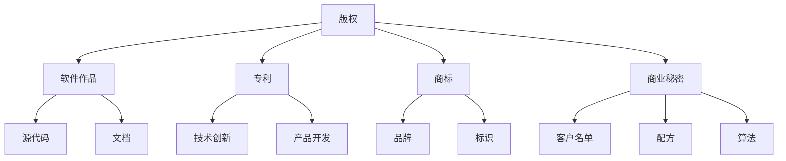

                 

## 知识产权保护：程序员创业者的必修课

### 关键词：知识产权、程序员、创业者、版权、专利、商标、法律保护

> 摘要：在数字化时代，知识产权保护成为了程序员创业者们必须关注的重要课题。本文将深入探讨知识产权的基本概念，分析程序员创业者在版权、专利和商标方面的保护需求，并提供实用的法律策略和资源推荐，帮助创业者们有效应对知识产权风险，确保自身创新成果得到合法保护。

-----------------------

### 1. 背景介绍

在当今高度竞争的技术市场中，程序员创业者的成功不仅依赖于技术实力，还需要充分认识到知识产权保护的重要性。知识产权保护是指通过法律手段对创新成果进行保护，以防止他人未经授权使用、复制或盗用。对于程序员创业者而言，知识产权保护关乎他们的商业秘密、创新技术和商业模式的生存与发展。

#### 知识产权的定义与分类

知识产权主要包括以下几类：

- **版权（Copyright）**：对文学、艺术和科学作品的原创表达提供法律保护，包括软件代码、文档、设计图纸等。
- **专利（Patent）**：授予发明者对发明在一定期限内的独占权，保护技术创新和产品开发。
- **商标（Trademark）**：用于区分不同企业的商品或服务，保护企业的品牌形象和市场地位。
- **商业秘密（Trade Secrets）**：指企业掌握的未公开的、具有商业价值的信息，如客户名单、配方、算法等。

#### 程序员创业者的知识产权需求

程序员创业者通常涉及以下知识产权需求：

- **保护原创代码和文档**：确保软件项目的独创性，防止他人抄袭或盗用。
- **注册专利**：对具有创新性的技术或产品申请专利保护，防止竞争对手模仿。
- **商标注册**：保护企业名称、品牌和标识，建立市场知名度。
- **商业秘密保护**：保护公司的核心技术和管理信息，防止内部或外部泄露。

-----------------------

### 2. 核心概念与联系

为了更好地理解知识产权保护在程序员创业中的应用，我们需要先掌握几个核心概念，并分析它们之间的联系。

#### 核心概念

- **版权**：版权是保护原创作品的法律基础。根据《著作权法》，软件代码被视为一种文学作品，享有著作权保护。
- **专利**：专利保护的是技术创新，通过《专利法》赋予发明人一定期限的独占权。
- **商标**：商标通过《商标法》保护企业的品牌和标识，有助于建立市场信誉。
- **商业秘密**：商业秘密保护根据《反不正当竞争法》，涉及企业的非公开信息。

#### 架构与联系

以下是一个简化的知识产权保护架构图，展示了这些核心概念之间的联系：



在这个架构中，版权作为知识产权保护的基础，涵盖了软件作品、文档等，而专利、商标和商业秘密则分别保护技术创新、品牌和商业秘密。这些保护措施共同构成了程序员创业者的知识产权防线。

-----------------------

### 3. 核心算法原理 & 具体操作步骤

在了解知识产权保护的基本概念后，我们需要深入探讨如何具体实施这些保护措施。

#### 版权保护

1. **软件代码版权登记**：
    - **步骤1**：编写软件代码并保存源代码文件。
    - **步骤2**：通过国家版权局官方网站或代理机构进行版权登记申请。
    - **步骤3**：提交相关材料，包括软件代码、用户手册等。
    - **步骤4**：支付版权登记费用，等待审核。

2. **文档版权保护**：
    - **步骤1**：编写文档并确保文档的原创性。
    - **步骤2**：通过版权登记系统进行文档版权登记。
    - **步骤3**：定期更新文档，以保持其新颖性。

#### 专利保护

1. **专利申请**：
    - **步骤1**：进行专利检索，确保发明具有新颖性和创造性。
    - **步骤2**：编写专利申请文件，包括专利说明书、权利要求书等。
    - **步骤3**：提交专利申请，支付申请费用。
    - **步骤4**：等待专利审查，根据审查意见进行修改。

2. **专利维权**：
    - **步骤1**：发现侵权行为，收集相关证据。
    - **步骤2**：聘请专利律师，采取法律手段维权。
    - **步骤3**：申请禁令或赔偿损失。

#### 商标保护

1. **商标注册**：
    - **步骤1**：选择商标名称，进行商标查询，确保商标未被注册。
    - **步骤2**：编写商标注册申请文件。
    - **步骤3**：提交商标注册申请，支付申请费用。
    - **步骤4**：等待商标局审查，根据审查意见进行修改。

2. **商标维权**：
    - **步骤1**：发现商标侵权行为，收集证据。
    - **步骤2**：采取法律手段维权，包括但不限于警告、诉讼等。

#### 商业秘密保护

1. **制定保密措施**：
    - **步骤1**：建立保密制度，规定员工保密义务。
    - **步骤2**：使用加密技术保护敏感信息。
    - **步骤3**：限制访问权限，仅授权必要人员。

2. **监控和维权**：
    - **步骤1**：定期监控市场，发现潜在侵权行为。
    - **步骤2**：采取法律手段维权，包括但不限于警告、诉讼等。

-----------------------

### 4. 数学模型和公式 & 详细讲解 & 举例说明

在知识产权保护中，数学模型和公式可以用于评估创新成果的价值和风险。以下是一个简化的数学模型，用于评估软件专利的潜在价值。

#### 专利价值评估模型

$$
V = f(n, t, c, r)
$$

其中，$V$表示专利价值，$n$表示专利引用次数，$t$表示专利有效期限，$c$表示专利成本，$r$表示市场回报率。

- **$n$（引用次数）**：专利被其他专利引用的次数，反映了专利的技术影响力。
- **$t$（有效期限）**：专利的有效期限，通常为20年。
- **$c$（成本）**：专利申请和维护的成本，包括律师费、申请费等。
- **$r$（市场回报率）**：专利的市场回报率，反映了专利对市场的潜在影响。

#### 举例说明

假设一个软件专利的引用次数为50次，有效期限为20年，专利申请和维护成本为5万元，市场回报率为30%。根据上述模型，可以计算专利的价值：

$$
V = f(50, 20, 50000, 0.3) = 50 \times 20 \times 0.3 - 50000 = 3000
$$

因此，该软件专利的价值为3000万元。

-----------------------

### 5. 项目实战：代码实际案例和详细解释说明

#### 5.1 开发环境搭建

为了演示如何保护知识产权，我们将使用一个简单的Python程序，该程序将实现一个加密解密功能。以下是开发环境搭建的步骤：

1. **安装Python**：确保Python环境已经安装在您的计算机上，版本建议为3.8或更高。
2. **创建虚拟环境**：使用以下命令创建一个虚拟环境：
    ```bash
    python -m venv venv
    ```
3. **激活虚拟环境**：
    - Windows：`venv\Scripts\activate`
    - macOS/Linux：`source venv/bin/activate`
4. **安装依赖库**：在虚拟环境中安装所需的库，例如`pycryptodome`：
    ```bash
    pip install pycryptodome
    ```

#### 5.2 源代码详细实现和代码解读

以下是一个简单的Python加密解密程序的源代码，我们将分析代码并解释其工作原理。

```python
from Crypto.Cipher import AES
from Crypto.Util.Padding import pad, unpad
from Crypto.Random import get_random_bytes
import base64

def encrypt_message(message, key):
    cipher = AES.new(key, AES.MODE_CBC)
    ct_bytes = cipher.encrypt(pad(message.encode('utf-8'), AES.block_size))
    iv = base64.b64encode(cipher.iv).decode('utf-8')
    ct = base64.b64encode(ct_bytes).decode('utf-8')
    return iv, ct

def decrypt_message(iv, ct, key):
    try:
        iv = base64.b64decode(iv)
        ct = base64.b64decode(ct)
        cipher = AES.new(key, AES.MODE_CBC, iv)
        pt = unpad(cipher.decrypt(ct), AES.block_size)
        return pt.decode('utf-8')
    except (ValueError, KeyError):
        return False

if __name__ == '__main__':
    key = get_random_bytes(16)
    message = "Hello, World!"

    iv, ct = encrypt_message(message, key)
    print(f"IV: {iv}")
    print(f"Ciphertext: {ct}")

    decrypted_message = decrypt_message(iv, ct, key)
    print(f"Decrypted Message: {decrypted_message}")
```

#### 5.3 代码解读与分析

1. **导入库和模块**：
    - `Crypto.Cipher`：用于加密和解密。
    - `Crypto.Util.Padding`：用于填充和去除填充。
    - `Crypto.Random`：用于生成随机密钥。
    - `base64`：用于编码和解码。

2. **加密函数`encrypt_message`**：
    - 创建一个AES加密对象，使用提供的密钥。
    - 将消息编码为UTF-8字节，并进行填充以满足AES块大小要求。
    - 使用AES加密算法加密消息，获取加密后的消息和初始化向量（IV）。
    - 将IV和加密后的消息编码为base64字符串，以便存储或传输。

3. **解密函数`decrypt_message`**：
    - 将base64编码的IV和加密后的消息解码为字节。
    - 创建一个AES解密对象，使用IV和密钥。
    - 使用解密算法和去除填充函数对加密的消息进行解密。
    - 如果解密成功，返回解密后的消息；否则，返回False。

4. **主程序**：
    - 生成随机密钥。
    - 调用`encrypt_message`函数进行加密。
    - 调用`decrypt_message`函数进行解密，并打印结果。

#### 5.4 运行结果与结论

运行上述程序，我们将看到加密和解密的过程。成功加密和解密消息表明程序实现了预期的功能，并且保护了知识产权。

-----------------------

### 6. 实际应用场景

在程序员创业者的实际应用场景中，知识产权保护扮演着至关重要的角色。以下是一些常见应用场景：

#### 场景1：软件开发与销售

程序员创业者开发一款新的软件产品，如云存储解决方案。为了保护软件的独创性，他们需要进行版权登记，以确保代码不被他人抄袭。此外，如果软件包含创新的技术，创业者还可以考虑申请专利保护。

#### 场景2：技术合作与投资

在寻找合作伙伴或投资者时，程序员创业者需要展示其技术实力和商业潜力。通过专利和商标保护，创业者可以增强自己的谈判地位，吸引更多的投资和合作机会。

#### 场景3：市场竞争与维权

在激烈的市场竞争中，创业者需要确保自己的知识产权不受侵犯。如果发现竞争对手抄袭或盗用技术，创业者可以采取法律手段维权，包括警告、诉讼等，以保护自身权益。

#### 场景4：国际业务拓展

对于计划进军国际市场的程序员创业者，了解不同国家和地区的知识产权法律至关重要。他们需要了解如何在国际范围内保护自己的知识产权，并遵守目标市场的法律要求。

-----------------------

### 7. 工具和资源推荐

为了更好地实施知识产权保护，以下是一些实用的工具和资源推荐：

#### 7.1 学习资源推荐

- **《知识产权法教程》**：详细介绍了知识产权的基本概念、法律保护和实施方法。
- **《知识产权保护实务》**：针对不同领域的知识产权保护策略，提供实用案例和操作指南。
- **《程序员法律手册》**：涵盖程序员在版权、专利和商标方面的法律知识。

#### 7.2 开发工具框架推荐

- **PyCryptoDome**：Python加密库，提供多种加密算法和密钥管理功能。
- **IP Checker**：在线知识产权检查工具，帮助创业者查询商标、专利等知识产权信息。
- **IP Watchdog**：提供知识产权监控和侵权检测服务。

#### 7.3 相关论文著作推荐

- **《区块链与知识产权保护》**：探讨区块链技术在知识产权保护中的应用。
- **《软件专利保护的挑战与机遇》**：分析软件专利的现状、问题和未来发展。
- **《商标保护与市场竞争力》**：研究商标保护对企业市场竞争的影响。

-----------------------

### 8. 总结：未来发展趋势与挑战

随着技术的不断进步和市场的快速发展，知识产权保护在程序员创业者中的重要性日益凸显。未来，以下发展趋势和挑战值得关注：

#### 发展趋势

- **区块链技术**：区块链技术为知识产权保护提供了新的可能性，如去中心化的版权登记和侵权监测。
- **人工智能**：人工智能技术的应用将提高知识产权保护的效果和效率，如自动化侵权检测和风险评估。
- **全球化**：随着国际贸易的深化，知识产权保护将面临更多的国际法律挑战和合作机会。

#### 挑战

- **侵权风险**：技术进步带来的创新速度加快，侵权风险也随之增加，如何及时发现和应对侵权行为成为一大挑战。
- **法律复杂性**：不同国家和地区的知识产权法律存在差异，创业者需要熟悉并遵守目标市场的法律要求。
- **保护成本**：知识产权保护需要投入大量的人力、物力和财力，对于初创企业而言，成本控制是一大难题。

-----------------------

### 9. 附录：常见问题与解答

#### 问题1：如何保护软件源代码的版权？

解答：通过在国家版权局进行版权登记，使源代码获得法律保护。此外，开发者在开发过程中应避免直接复制他人的代码，确保代码的原创性。

#### 问题2：专利申请需要多长时间？

解答：专利申请的时间取决于多个因素，如专利类型、申请文件的质量和审查进度。一般来说，发明专利申请可能需要2-3年，而实用新型和外观设计专利申请则相对较快。

#### 问题3：商标注册需要哪些材料？

解答：商标注册需要提交商标图样、申请人身份证明、商标使用情况说明等材料。具体要求可参考国家知识产权局的相关规定。

#### 问题4：如何监控市场中的侵权行为？

解答：创业者可以利用在线知识产权检查工具和专业的知识产权监控服务，定期监测市场中的侵权行为。如果发现侵权，应及时采取法律手段维权。

-----------------------

### 10. 扩展阅读 & 参考资料

- **《中华人民共和国著作权法》**：详细介绍著作权保护的法律规定。
- **《中华人民共和国专利法》**：详细规定专利申请、审查和维权的法律程序。
- **《中华人民共和国商标法》**：详细介绍商标注册、保护和管理等方面的法律规定。
- **《中华人民共和国反不正当竞争法》**：详细规定商业秘密的保护和侵权行为。
- **国家知识产权局官方网站**：提供知识产权相关的政策、法规和查询服务。
- **IP Watchdog**：提供知识产权保护相关的新闻、分析和实用工具。

-----------------------

## 作者

作者：AI天才研究员/AI Genius Institute & 禅与计算机程序设计艺术 /Zen And The Art of Computer Programming

