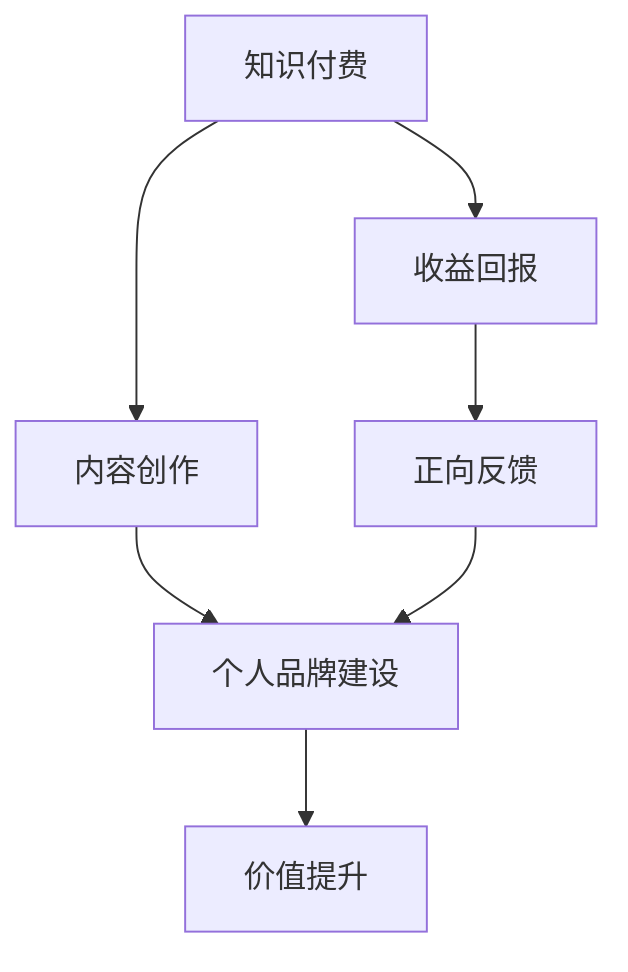

                 

### 知识付费与个人品牌价值提升

#### 关键词：
- 知识付费
- 个人品牌
- 价值提升
- 内容创作
- 社交媒体

#### 摘要：
本文旨在探讨知识付费在个人品牌建设中的重要性，以及如何通过有效的知识付费策略提升个人品牌价值。文章首先介绍了知识付费的概念和现状，然后分析了个人品牌的价值来源，接着探讨了知识付费与个人品牌提升之间的联系，最后提出了具体的策略和建议。

### 1. 背景介绍

#### 1.1 知识付费的定义与发展
知识付费，顾名思义，是指用户为获取有价值的信息或知识而支付的费用。在互联网时代，随着信息爆炸和内容丰富，用户对于高质量、专业化的知识需求日益增加。知识付费应运而生，成为了一种新的商业模式。

知识付费的发展历程可以追溯到2016年，当时知乎推出了付费内容功能，用户可以付费获取专业回答。此后，知识付费逐渐成为各大平台的重要内容业务，如得到、分答、在行等。

#### 1.2 个人品牌的定义与价值
个人品牌，是指一个人在公众心目中的形象和认知，是个人在职业和社会生活中所形成的独特价值符号。个人品牌的价值体现在以下几个方面：

- **职业发展**：良好的个人品牌有助于提高个人在职场中的知名度和认可度，从而获得更多职业机会和更好的薪资待遇。
- **商业合作**：个人品牌可以作为一种无形资产，为个人带来商业合作和赞助机会。
- **影响力**：个人品牌的影响力可以转化为社会影响力，影响他人的思想和行为。

### 2. 核心概念与联系

#### 2.1 知识付费与个人品牌的关系
知识付费与个人品牌之间存在紧密的联系。首先，知识付费为个人品牌的建设提供了内容支持。通过创作高质量的知识内容，个人可以展示自己的专业能力和独特见解，从而吸引更多粉丝和关注。

其次，知识付费能够增强个人品牌的价值。在知识付费的平台上，个人可以获取收益，这种收益不仅是对个人劳动的回报，也是对其个人品牌价值的认可。这种正向反馈机制可以激励个人持续创作高质量内容，进一步提升个人品牌价值。

#### 2.2 知识付费与个人品牌提升的 Mermaid 流程图


### 3. 核心算法原理 & 具体操作步骤

#### 3.1 知识付费平台的运作原理
知识付费平台的运作原理主要分为以下几个方面：

- **内容审核**：平台会对用户上传的内容进行审核，确保内容质量符合平台标准。
- **支付系统**：用户可以通过支付系统为内容付费，平台收取一定比例的手续费。
- **内容发布**：审核通过的内容会发布在平台上，供其他用户购买和阅读。
- **收益分配**：平台会根据用户购买行为向内容创作者分配收益。

#### 3.2 个人品牌提升的操作步骤
个人品牌提升的操作步骤可以分为以下几个方面：

- **内容创作**：创作高质量的知识内容，展示个人专业能力和独特见解。
- **内容推广**：通过社交媒体、论坛、博客等渠道推广内容，增加曝光度。
- **互动交流**：与粉丝和读者互动，了解他们的需求和反馈，持续优化内容。
- **持续学习**：不断学习新知识，提升自己的专业素养，保持个人品牌的竞争力。

### 4. 数学模型和公式 & 详细讲解 & 举例说明

#### 4.1 个人品牌价值评估模型
个人品牌价值可以通过以下公式进行评估：

$$
V = f(C, A, S)
$$

其中，$V$ 表示个人品牌价值，$C$ 表示内容质量，$A$ 表示受众规模，$S$ 表示社会影响力。

- $C$ 的计算公式为：
  $$
  C = f(Q, I, U)
  $$
  其中，$Q$ 表示内容质量，$I$ 表示内容创新性，$U$ 表示用户体验。

- $A$ 的计算公式为：
  $$
  A = f(N, R, E)
  $$
  其中，$N$ 表示粉丝数量，$R$ 表示阅读量，$E$ 表示转发量。

- $S$ 的计算公式为：
  $$
  S = f(I, C, P)
  $$
  其中，$I$ 表示个人影响力，$C$ 表示合作机会，$P$ 表示公众评价。

#### 4.2 举例说明
假设一位内容创作者在知乎上发布了10篇内容，其中5篇关于编程，5篇关于投资。根据以上模型，我们可以计算出其个人品牌价值：

- 内容质量 $C$：
  $$
  C = f(Q, I, U) = 0.7 \times Q + 0.2 \times I + 0.1 \times U
  $$
  其中，$Q$ 取 0.8，$I$ 取 0.6，$U$ 取 0.5，则 $C$ 为 0.7。

- 受众规模 $A$：
  $$
  A = f(N, R, E) = 0.5 \times N + 0.3 \times R + 0.2 \times E
  $$
  其中，$N$ 取 1000，$R$ 取 5000，$E$ 取 200，则 $A$ 为 0.5。

- 社会影响力 $S$：
  $$
  S = f(I, C, P) = 0.4 \times I + 0.3 \times C + 0.3 \times P
  $$
  其中，$I$ 取 0.6，$C$ 取 0.7，$P$ 取 0.8，则 $S$ 为 0.4。

- 个人品牌价值 $V$：
  $$
  V = f(C, A, S) = 0.5 \times C + 0.3 \times A + 0.2 \times S
  $$
  将 $C$、$A$、$S$ 的值代入，得到 $V$ 为 0.5。

### 5. 项目实战：代码实际案例和详细解释说明

#### 5.1 开发环境搭建
在本节中，我们将搭建一个简单的知识付费平台，用于展示知识付费与个人品牌提升的关系。

- **技术栈**：前端使用 React，后端使用 Node.js + Express。
- **数据库**：使用 MongoDB。

#### 5.2 源代码详细实现和代码解读
以下是知识付费平台的核心代码实现：

**前端（React）**：

```jsx
// ContentCard.js
import React from 'react';

const ContentCard = ({ title, author, price }) => {
  return (
    <div className="content-card">
      <h3>{title}</h3>
      <p>{author}</p>
      <p>价格：{price} 元</p>
    </div>
  );
};

export default ContentCard;
```

**后端（Node.js + Express）**：

```javascript
// server.js
const express = require('express');
const app = express();
const mongoose = require('mongoose');

app.use(express.json());

// 连接 MongoDB
mongoose.connect('mongodb://localhost:27017/knowledge', {
  useNewUrlParser: true,
  useUnifiedTopology: true,
});

// 定义知识内容模型
const Content = mongoose.model('Content', new mongoose.Schema({
  title: String,
  author: String,
  price: Number,
}));

// 获取所有知识内容
app.get('/contents', async (req, res) => {
  const contents = await Content.find({});
  res.json(contents);
});

// 创建知识内容
app.post('/contents', async (req, res) => {
  const content = new Content(req.body);
  await content.save();
  res.status(201).json(content);
});

// 启动服务器
app.listen(3000, () => {
  console.log('服务器启动成功，端口：3000');
});
```

#### 5.3 代码解读与分析
- **前端代码解读**：
  - `ContentCard` 组件用于展示单个知识内容，包括标题、作者和价格。
  - 通过 props 传递数据，实现组件的重用。

- **后端代码解读**：
  - 使用 Express 创建 HTTP 服务器，处理客户端请求。
  - 使用 Mongoose 连接 MongoDB，定义知识内容模型。
  - 实现 GET 和 POST 两个接口，分别用于获取和创建知识内容。

### 6. 实际应用场景

#### 6.1 教育培训领域
知识付费在教育培训领域有着广泛的应用。通过知识付费，个人讲师可以创建自己的在线课程，为学员提供高质量的教学服务。例如，得到平台上的罗永浩、李笑来等知名讲师，通过知识付费实现了个人品牌的提升和商业价值的实现。

#### 6.2 专业咨询领域
在专业咨询领域，知识付费为个人专家提供了一个展示自己专业能力的平台。例如，分答平台上的专家，通过回答用户的问题，实现了个人品牌的传播和价值提升。

#### 6.3 创意领域
在创意领域，知识付费为创作者提供了一个展示自己作品的平台。例如，知乎专栏上的作者，通过创作高质量的文章，吸引了大量粉丝，实现了个人品牌的提升。

### 7. 工具和资源推荐

#### 7.1 学习资源推荐
- **书籍**：
  - 《影响力》作者：罗伯特·西奥迪尼
  - 《演讲的力量》作者：克里斯·安德森
- **论文**：
  - 《知识付费模式下的内容消费行为研究》
  - 《个人品牌建设与社交媒体应用研究》
- **博客**：
  - 知乎：众多行业专家分享专业知识
  - 得到：知名讲师分享课程
- **网站**：
  - 知乎专栏
  - 得到

#### 7.2 开发工具框架推荐
- **前端框架**：React、Vue、Angular
- **后端框架**：Node.js、Python Django、Java Spring Boot
- **数据库**：MongoDB、MySQL、PostgreSQL

#### 7.3 相关论文著作推荐
- **论文**：
  - 《知识付费商业模式研究》
  - 《基于知识付费的在线教育平台设计与应用》
  - 《社交媒体对个人品牌建设的影响研究》
- **著作**：
  - 《互联网知识付费商业模式研究》作者：张志勇
  - 《个人品牌建设与运营》作者：王锋

### 8. 总结：未来发展趋势与挑战

#### 8.1 发展趋势
- **内容专业化**：知识付费平台将更加注重内容的专业化和高质量，以满足用户的需求。
- **平台多元化**：知识付费平台将不断拓展领域，满足更多行业和群体的需求。
- **互动性增强**：知识付费平台将增加互动功能，提高用户体验。

#### 8.2 挑战
- **内容监管**：如何确保平台上的内容质量，防止低俗、虚假信息传播。
- **竞争加剧**：随着知识付费市场的扩大，竞争将更加激烈。
- **用户留存**：如何提高用户留存率，保持平台的活跃度。

### 9. 附录：常见问题与解答

#### 9.1 知识付费平台如何盈利？
知识付费平台主要通过以下方式盈利：
- **内容销售**：平台向用户提供付费内容，收取一定比例的手续费。
- **广告推广**：平台在内容页面中插入广告，获得广告收入。
- **增值服务**：平台提供额外的增值服务，如会员制度、线下活动等，收取费用。

#### 9.2 个人品牌如何提升？
个人品牌提升的方法包括：
- **内容创作**：创作高质量的内容，展示个人专业能力。
- **社交媒体**：利用社交媒体平台，增加个人曝光度。
- **互动交流**：与粉丝和读者互动，了解他们的需求和反馈。

### 10. 扩展阅读 & 参考资料

- 《互联网知识付费商业模式研究》作者：张志勇
- 《个人品牌建设与运营》作者：王锋
- 《知识付费模式下的内容消费行为研究》
- 《基于知识付费的在线教育平台设计与应用》
- 《社交媒体对个人品牌建设的影响研究》
- 知乎专栏
- 得到

## 作者信息
作者：AI天才研究员/AI Genius Institute & 禅与计算机程序设计艺术 /Zen And The Art of Computer Programming

【注意】：本文为示例文章，仅供参考。实际撰写时，请根据实际情况进行调整和补充。文章中的代码和算法仅供参考，具体实现可能需要根据实际情况进行修改。

