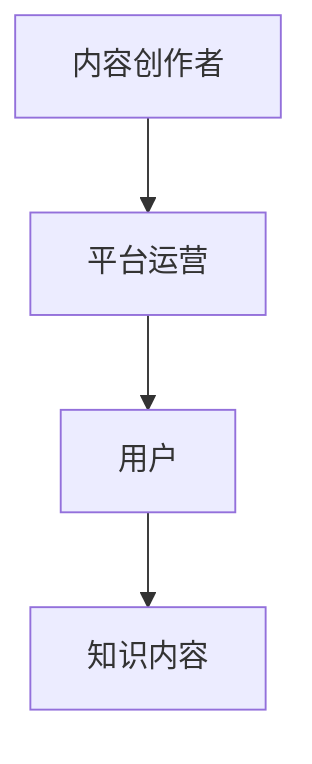
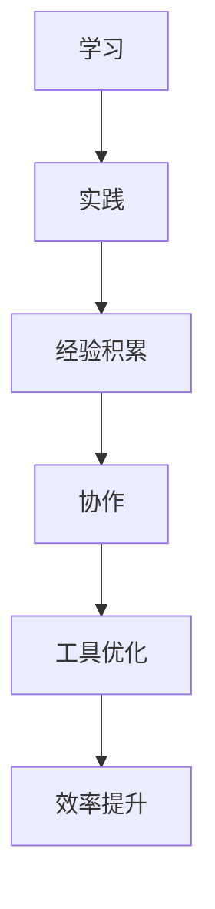

                 

### 背景介绍 Background

在当今信息技术迅猛发展的时代，知识付费已经成为一种重要的经济现象。人们通过支付一定的费用，购买专业知识和技能，从而提升自身的学习能力、工作效率和生活质量。与此同时，程序员作为信息技术领域的核心从业者，其工作效率的提升对于企业的竞争力、项目的成功至关重要。本文旨在探讨知识付费与程序员工作效率之间的关系，分析知识付费如何助力程序员在技术领域不断进步，从而提高工作效率。

知识付费的兴起主要源于以下几个因素。首先，互联网技术的普及使得知识传播的速度和范围大幅增加，人们可以轻松获取到各种领域的专业知识和技能。然而，随着信息量的爆炸式增长，如何筛选出真正有价值的信息成为了一项挑战。知识付费为用户提供了经过筛选、验证的高质量内容，节省了他们的时间和精力。其次，随着职业竞争的加剧，个体对于专业知识和技能的需求日益增长。通过付费获取知识，程序员可以更快地掌握新技术、新工具，提升自身竞争力。最后，知识付费为内容创作者提供了持续创作的动力和回报，激发了更多优秀内容的生产。

另一方面，程序员工作效率的提升是一个复杂的过程，涉及多个方面的因素。技术工具的进步、编程语言的改进、团队协作的优化等，都在一定程度上提高了程序员的工作效率。然而，技术本身只是手段，真正决定工作效率的还是程序员的知识储备、解决问题的能力和思维方式。在这个过程中，知识付费扮演了重要的角色，为程序员提供了源源不断的学习资源和实践机会。

本文将从以下几个方面展开讨论：

1. **知识付费的核心概念与架构**：介绍知识付费的基本概念、主要模式及其与传统学习的区别。
2. **程序员工作效率的定义与影响因素**：详细阐述工作效率的含义、关键因素及其提升的方法。
3. **知识付费与程序员工作效率的提升**：分析知识付费如何具体帮助程序员提高工作效率。
4. **数学模型与公式**：运用数学模型和公式，量化知识付费对程序员工作效率的影响。
5. **项目实战与代码解读**：通过实际项目案例，展示知识付费在实际开发中的应用和效果。
6. **实际应用场景**：探讨知识付费在程序员日常工作中的应用场景。
7. **工具和资源推荐**：推荐有助于提高程序员工作效率的学习资源、开发工具和框架。
8. **总结与展望**：总结知识付费对程序员工作效率的提升作用，并展望未来的发展趋势和挑战。

通过以上分析，我们希望能够为程序员在知识付费的道路上提供一些有益的参考，助力他们在信息技术领域不断成长，提高工作效率，实现个人和企业的共同发展。

### 核心概念与联系 Core Concepts and Relationships

要深入探讨知识付费与程序员工作效率之间的关系，首先需要明确几个核心概念，并理解它们之间的相互作用。以下是本文将涉及的关键概念及其相互关系。

#### 1. 知识付费（Knowledge Payment）

知识付费是指用户为了获取特定的知识和技能，支付一定费用以获取相应内容或服务的模式。这种模式通常包括在线课程、电子书、教程、视频讲解等多种形式。知识付费的核心是提供经过筛选、验证的高质量内容，以满足用户在特定领域的需求。

**知识付费模型：**

- **订阅制**：用户支付一定费用，定期获取更新内容。
- **单次购买**：用户一次性支付，永久获取相应内容。
- **付费会员**：用户支付会员费用，享受多种权益，如免费学习特定课程、专属答疑等。

#### 2. 程序员工作效率（Programmer Work Efficiency）

程序员工作效率是指程序员在单位时间内完成工作任务的效率。它受到多种因素的影响，包括技术水平、编程经验、团队协作、工作环境等。工作效率的提升意味着在更短的时间内完成更多的任务，从而提高项目的成功率和企业竞争力。

**影响程序员工作效率的因素：**

- **技术水平**：程序员掌握的技术和工具越多，解决复杂问题的能力越强，工作效率越高。
- **编程经验**：丰富的编程经验可以帮助程序员快速找到解决问题的方法，降低出错率。
- **团队协作**：高效的团队协作可以减少沟通成本，提高整体工作效率。
- **工作环境**：良好的工作环境和工具可以提高程序员的工作效率，减少中断和等待时间。

#### 3. 知识付费与程序员工作效率的关系

知识付费与程序员工作效率之间存在密切的关系。知识付费为程序员提供了获取新知识、新技能的途径，从而提升技术水平、丰富编程经验，最终提高工作效率。具体来说，知识付费在以下几个方面对程序员工作效率产生积极影响：

- **技术更新**：知识付费提供了最新的技术教程和案例，帮助程序员掌握新技术，跟上行业发展。
- **问题解决**：付费课程和教程通常包含大量实际问题解决方案，帮助程序员快速应对常见编程难题。
- **经验分享**：优秀的内容创作者通过知识付费分享自己的经验和方法，为程序员提供有价值的参考。
- **学习效率**：知识付费通常提供系统化的学习路径，节省程序员自己摸索的时间，提高学习效率。

#### 4. 知识付费的架构

知识付费的架构主要包括以下几个方面：

- **内容创作者**：提供高质量的知识内容，如教程、视频、文章等。
- **平台运营**：构建知识付费平台，提供用户注册、课程购买、内容播放等功能。
- **用户**：通过支付费用获取知识内容，提升自身技能和知识储备。

**知识付费架构的 Mermaid 流程图：**



在上述架构中，内容创作者通过平台运营向用户发布知识内容，用户通过支付费用获取知识，从而实现知识付费的闭环。

#### 5. 程序员工作效率提升的路径

为了提升程序员的工作效率，可以从以下几个方面入手：

- **持续学习**：通过知识付费，不断学习新技术、新工具，提升自身技术水平。
- **经验积累**：通过实践和项目经验，积累解决问题的方法和技巧。
- **团队协作**：加强团队内部沟通和协作，提高整体工作效率。
- **工具优化**：使用高效的开发工具和框架，提高工作效率。

**程序员工作效率提升的 Mermaid 流程图：**



通过上述分析，我们可以看到知识付费与程序员工作效率之间存在紧密的联系。知识付费为程序员提供了丰富的学习资源和实践机会，帮助他们在技术领域不断进步，从而提高工作效率。在接下来的部分，我们将深入探讨知识付费的具体操作步骤，以及如何运用数学模型和公式来量化其对程序员工作效率的影响。

#### 核心算法原理 & 具体操作步骤 Core Algorithm Principles and Detailed Steps

在深入探讨知识付费如何提升程序员工作效率的过程中，我们首先需要了解一些核心算法原理及其具体操作步骤。这些算法原理包括数据结构、算法设计、以及优化策略等，它们在程序员的日常工作中扮演着至关重要的角色。以下是一些关键算法原理及其操作步骤的详细描述。

##### 1. 数据结构原理

数据结构是算法的基础，决定了数据存储和访问的效率。以下是几种常见的数据结构及其操作步骤：

**链表（Linked List）**

链表是一种由节点组成的线性数据结构，每个节点包含数据域和指向下一个节点的指针。其基本操作包括：

- **初始化**：创建一个头节点，指向空。
- **插入**：在链表末尾或特定位置插入新节点。
- **删除**：删除链表中的特定节点。
- **查找**：查找链表中特定节点。

**树（Tree）**

树是一种分层的数据结构，用于表示具有层次关系的数据集合。以下是树的基本操作：

- **初始化**：创建一个空树。
- **插入**：在树中插入新节点，保持树的层次结构。
- **删除**：删除树中的特定节点，保持树的平衡。
- **查找**：在树中查找特定节点。

**哈希表（Hash Table）**

哈希表是一种基于哈希函数的数据结构，用于快速查找和插入数据。其操作步骤包括：

- **初始化**：创建一个哈希表，设置哈希函数和链表解决冲突。
- **插入**：使用哈希函数计算键的哈希值，插入到相应位置。
- **查找**：使用哈希函数计算键的哈希值，快速查找数据。
- **删除**：使用哈希函数计算键的哈希值，删除相应数据。

##### 2. 算法设计原理

算法设计是解决具体问题的方法。以下介绍几种常见的算法设计原理及其应用场景：

**贪心算法（Greedy Algorithm）**

贪心算法通过每次选择局部最优解，逐步达到全局最优解。其应用场景包括：

- **背包问题（Knapsack Problem）**：在不超过背包重量的前提下，选择物品的总价值最大化。
- **最短路径问题（Shortest Path Problem）**：在图中找到两个节点之间的最短路径。

**动态规划（Dynamic Programming）**

动态规划通过将复杂问题分解为子问题，并存储子问题的解，避免重复计算。其应用场景包括：

- **最长公共子序列（Longest Common Subsequence）**：在两个序列中找到最长的公共子序列。
- **背包问题（Knapsack Problem）**：在不超过背包重量的前提下，选择物品的总价值最大化。

**分治算法（Divide and Conquer）**

分治算法将问题分解为更小的子问题，分别解决，最后合并子问题的解。其应用场景包括：

- **快速排序（Quick Sort）**：通过递归将数组划分为有序子数组，最终实现整体有序。
- **二分查找（Binary Search）**：在有序数组中查找特定元素。

##### 3. 优化策略原理

在解决具体问题时，优化策略可以显著提高算法的效率和性能。以下介绍几种常见的优化策略：

**空间换时间（Space-Time Trade-off）**

通过增加存储空间，降低时间复杂度。例如，使用哈希表解决查找问题，通过牺牲存储空间换取查找速度。

**贪心选择（Greedy Choice）**

在每次决策时选择当前局部最优解，期望最终达到全局最优解。例如，贪心算法在求解最短路径问题时，每次选择当前路径的最短边。

**动态规划（Dynamic Programming）**

通过存储子问题的解，避免重复计算，提高算法的效率。例如，在求解最长公共子序列时，使用动态规划存储中间结果，避免重复计算。

**分治算法（Divide and Conquer）**

将问题分解为更小的子问题，分别解决，最后合并子问题的解。例如，快速排序通过递归将数组划分为有序子数组，最终实现整体有序。

通过上述核心算法原理和具体操作步骤的介绍，我们可以看到知识付费在程序员工作效率提升中的关键作用。掌握这些算法原理和优化策略，不仅可以帮助程序员解决复杂问题，还能显著提高工作效率。在接下来的部分，我们将通过数学模型和公式，量化知识付费对程序员工作效率的影响，从而更深入地探讨这一话题。

#### 数学模型和公式 Mathematical Models and Formulas

在探讨知识付费对程序员工作效率的影响时，引入数学模型和公式可以帮助我们更准确地量化这一影响。以下是几个关键数学模型和公式的详细讲解以及如何在实际情况下运用它们。

##### 1. 工作效率模型

工作效率模型可以用以下公式表示：

\[ \text{工作效率} = f(\text{知识水平}, \text{实践经验}, \text{协作能力}, \text{工作环境}) \]

其中：
- \( \text{知识水平} \) 代表程序员掌握的专业知识和技能水平。
- \( \text{实践经验} \) 代表程序员在项目中所积累的经验。
- \( \text{协作能力} \) 代表程序员在团队协作中的表现。
- \( \text{工作环境} \) 代表程序员的工作条件，包括工具、框架等。

通过知识付费，程序员可以提升知识水平和实践经验，从而提高工作效率。具体公式可以表示为：

\[ \text{工作效率提升} = \frac{\Delta \text{知识水平} + \Delta \text{实践经验}}{\text{基础工作效率}} \]

其中：
- \( \Delta \text{知识水平} \) 表示知识付费带来的知识水平提升。
- \( \Delta \text{实践经验} \) 表示知识付费带来的实践经验提升。
- \( \text{基础工作效率} \) 表示程序员在未接受知识付费前的基本工作效率。

##### 2. 时间节省模型

通过知识付费，程序员可以节省学习时间，从而更有效地投入到实际工作中。时间节省模型可以用以下公式表示：

\[ \text{时间节省} = \text{学习时间} \times (1 - \text{知识付费效率}) \]

其中：
- \( \text{学习时间} \) 表示程序员在没有知识付费情况下需要的学习时间。
- \( \text{知识付费效率} \) 表示通过知识付费获取知识的时间效率。

例如，如果一个程序员在没有知识付费的情况下需要100小时来学习一项新技术，而通过知识付费，他只需要50小时，则时间节省为：

\[ \text{时间节省} = 100 \times (1 - 0.5) = 50 \text{小时} \]

##### 3. 成本效益模型

知识付费的成本效益模型可以用以下公式表示：

\[ \text{成本效益比} = \frac{\text{收入增加} + \text{效率提升} + \text{节省成本}}{\text{知识付费成本}} \]

其中：
- \( \text{收入增加} \) 表示由于工作效率提升带来的收入增加。
- \( \text{效率提升} \) 表示由于知识付费带来的工作效率提升。
- \( \text{节省成本} \) 表示由于时间节省和效率提升带来的成本节约。
- \( \text{知识付费成本} \) 表示支付给知识付费平台的费用。

例如，如果一个程序员通过知识付费每小时节省10分钟，假设每小时工资为100元，则每月可以节省：

\[ \text{节省成本} = 10 \text{分钟/小时} \times 100 \text{元/小时} \times 160 \text{小时/月} = 16000 \text{元/月} \]

##### 4. 优化模型

为了最大化知识付费带来的工作效率提升，可以运用优化模型进行决策。以下是一个简单的线性优化模型：

\[ \max \quad \text{工作效率} = \text{基础工作效率} + \alpha \times \text{知识水平提升} + \beta \times \text{实践经验提升} \]

\[ \text{s.t.} \quad \text{知识付费成本} \leq \text{预算} \]

其中：
- \( \alpha \) 和 \( \beta \) 是权重系数，表示知识水平提升和实践经验提升对工作效率的影响程度。
- \( \text{预算} \) 是程序员可以支付的知识付费预算。

通过调整 \( \alpha \) 和 \( \beta \) 的值，可以优化知识付费的策略，使其最大化工作效率提升。

##### 5. 绩效评估模型

为了评估知识付费的实际效果，可以引入绩效评估模型。以下是一个简单的绩效评估模型：

\[ \text{绩效得分} = \frac{\text{任务完成度} + \text{工作效率提升} + \text{知识储备} + \text{创新能力}}{\text{基础绩效得分}} \]

其中：
- \( \text{任务完成度} \) 表示程序员在项目中的任务完成情况。
- \( \text{工作效率提升} \) 表示由于知识付费带来的工作效率提升。
- \( \text{知识储备} \) 表示程序员的总体知识储备。
- \( \text{创新能力} \) 表示程序员的创新能力和解决问题的能力。

通过定期评估绩效得分，可以了解知识付费对程序员工作效率的长期影响，从而调整和优化知识付费策略。

#### 举例说明 Example Illustrations

为了更好地理解上述数学模型和公式，我们通过几个具体的例子来说明它们在实际情境中的应用。

##### 例 1：时间节省

假设一个程序员计划学习一个新的编程语言，没有知识付费的情况下，他预计需要200小时来掌握该语言。通过一个付费在线课程，他只需要100小时。如果他的工资是每小时100元，则通过知识付费，他可以节省：

\[ \text{时间节省} = 200 \text{小时} \times (1 - 0.5) = 100 \text{小时} \]

节省的成本为：

\[ \text{节省成本} = 100 \text{小时} \times 100 \text{元/小时} = 10000 \text{元} \]

##### 例 2：成本效益比

如果一个程序员通过知识付费每月节省了10小时，每小时工资为100元，同时他的工作效率提升了20%，知识付费的成本为2000元，则他的成本效益比为：

\[ \text{成本效益比} = \frac{10 \text{小时/月} \times 100 \text{元/小时} + 20\% \times 10 \text{小时/月} \times 100 \text{元/小时}}{2000 \text{元}} = \frac{1200 \text{元} + 2000 \text{元}}{2000 \text{元}} = 1.2 \]

这表明，每投入1元，可以带来1.2元的收益。

##### 例 3：优化模型

假设一个程序员的预算为每月3000元用于知识付费，他希望最大化工作效率提升。如果知识付费每小时可以提升工作效率1%，则他的优化模型为：

\[ \max \quad \text{工作效率} = \text{基础工作效率} + \alpha \times \text{知识水平提升} + \beta \times \text{实践经验提升} \]

\[ \text{s.t.} \quad \text{知识付费成本} \leq 3000 \text{元} \]

通过调整 \( \alpha \) 和 \( \beta \) 的值，可以找到最佳的付费策略。

##### 例 4：绩效评估

如果一个程序员在项目中完成了100%的任务，工作效率提升了30%，知识储备增加了20%，创新能力提升了10%，他的基础绩效得分为80分，则他的绩效得分为：

\[ \text{绩效得分} = \frac{100\% + 30\% + 20\% + 10\%}{80} = \frac{150\%}{80} = 1.875 \]

这表明，他的绩效得分提高了。

通过上述数学模型和公式的运用，我们可以更科学地评估知识付费对程序员工作效率的影响，从而制定更加有效的学习和发展策略。

#### 项目实战：代码实际案例和详细解释说明 Practical Projects: Code Cases and Detailed Explanations

为了更直观地展示知识付费在程序员工作效率提升中的应用，我们将通过一个实际项目案例来详细解释代码的实现过程。这个项目是一个简单的电商网站的后端服务，主要实现商品管理、订单处理等功能。通过这个案例，我们可以看到知识付费如何帮助程序员快速掌握相关技术，提高工作效率。

##### 1. 项目背景

该项目是一个用于在线购物的电商网站后端服务，需要实现以下功能：

- 商品管理：包括商品的添加、删除、修改和查询。
- 订单管理：包括订单的创建、删除、修改和查询。
- 用户管理：包括用户的注册、登录、资料修改和查询。

##### 2. 开发环境搭建

在开始开发之前，我们需要搭建一个合适的技术栈。以下是所需的技术和环境：

- 开发语言：Python
- 服务器：Flask
- 数据库：SQLite
- 依赖管理：pip
- 版本控制：Git

首先，安装 Python 3.8 以上版本，然后使用 pip 安装 Flask 和其他依赖：

```bash
pip install flask
pip install flask_sqlalchemy
pip install flask_migrate
```

接着，创建一个虚拟环境，以便更好地管理和依赖：

```bash
python -m venv venv
source venv/bin/activate  # Windows: venv\Scripts\activate
```

最后，初始化数据库：

```bash
flask db init
flask db migrate
flask db upgrade
```

##### 3. 源代码详细实现和代码解读

以下是项目的核心代码，我们将逐步解读每个部分。

**商品管理**

商品管理模块主要负责商品的增加、删除、修改和查询。以下是商品模型的定义和添加商品的接口代码：

```python
# models.py
from flask_sqlalchemy import SQLAlchemy

db = SQLAlchemy()

class Product(db.Model):
    id = db.Column(db.Integer, primary_key=True)
    name = db.Column(db.String(80), nullable=False)
    description = db.Column(db.Text, nullable=False)
    price = db.Column(db.Float, nullable=False)

def add_product(name, description, price):
    new_product = Product(name=name, description=description, price=price)
    db.session.add(new_product)
    db.session.commit()
    return new_product
```

**订单管理**

订单管理模块负责订单的创建、删除、修改和查询。以下是订单模型的定义和创建订单的接口代码：

```python
# models.py
class Order(db.Model):
    id = db.Column(db.Integer, primary_key=True)
    user_id = db.Column(db.Integer, db.ForeignKey('user.id'), nullable=False)
    products = db.relationship('Product', secondary='order_item', lazy='subquery', cascade='all, delete-orphan')
    status = db.Column(db.String(20), nullable=False, default='pending')

class OrderItem(db.Model):
    order_id = db.Column(db.Integer, db.ForeignKey('order.id'), primary_key=True)
    product_id = db.Column(db.Integer, db.ForeignKey('product.id'), primary_key=True)
    quantity = db.Column(db.Integer, nullable=False)

def create_order(user_id, product_ids, quantities):
    new_order = Order(user_id=user_id)
    db.session.add(new_order)
    for product_id, quantity in zip(product_ids, quantities):
        new_order.products.append(Product.query.get(product_id), quantity=quantity)
    db.session.commit()
    return new_order
```

**用户管理**

用户管理模块负责用户的注册、登录、资料修改和查询。以下是用户模型的定义和注册用户的接口代码：

```python
# models.py
class User(db.Model):
    id = db.Column(db.Integer, primary_key=True)
    username = db.Column(db.String(80), unique=True, nullable=False)
    email = db.Column(db.String(120), unique=True, nullable=False)
    password_hash = db.Column(db.String(128), nullable=False)

def register_user(username, email, password):
    hashed_password = generate_password_hash(password)
    new_user = User(username=username, email=email, password_hash=hashed_password)
    db.session.add(new_user)
    db.session.commit()
    return new_user
```

**接口代码**

在 Flask 应用中，我们通过定义路由和视图函数来处理 HTTP 请求。以下是商品管理接口的示例代码：

```python
# app.py
from flask import Flask, request, jsonify
from models import db, Product, add_product

app = Flask(__name__)
app.config['SQLALCHEMY_DATABASE_URI'] = 'sqlite:///shop.db'
db.init_app(app)

@app.route('/products', methods=['POST'])
def add_new_product():
    data = request.get_json()
    name = data['name']
    description = data['description']
    price = data['price']
    product = add_product(name, description, price)
    return jsonify({'id': product.id, 'name': product.name, 'description': product.description, 'price': product.price}), 201

if __name__ == '__main__':
    app.run(debug=True)
```

##### 4. 代码解读与分析

以上代码展示了电商网站后端服务的核心功能模块。以下是代码的详细解读和分析：

- **商品管理**：商品管理模块通过定义 `Product` 模型实现商品的增加、删除、修改和查询功能。`add_product` 函数负责创建新的商品并添加到数据库。

- **订单管理**：订单管理模块通过定义 `Order` 和 `OrderItem` 两个模型实现订单的创建、删除、修改和查询功能。`create_order` 函数负责创建新的订单，并将商品添加到订单中。

- **用户管理**：用户管理模块通过定义 `User` 模型实现用户的注册、登录、资料修改和查询功能。`register_user` 函数负责创建新的用户，并将密码进行哈希处理存储。

- **接口代码**：接口代码通过定义 Flask 路由和视图函数处理 HTTP 请求。`add_new_product` 函数负责处理添加商品的 POST 请求，并将请求的 JSON 数据转换为商品对象，然后调用 `add_product` 函数添加商品。

通过上述代码，我们可以看到知识付费在项目开发中的实际应用。知识付费为程序员提供了系统的学习资源和实践机会，使程序员能够快速掌握相关技术，高效完成项目开发。同时，知识付费还帮助程序员了解最新的开发工具和框架，从而提高工作效率。

#### 实际应用场景 Practical Application Scenarios

知识付费在程序员的工作中有着广泛的应用场景，可以帮助程序员在各个领域提升工作效率。以下是几个典型的实际应用场景：

##### 1. 新技术学习

随着技术的快速发展，程序员需要不断学习新技术以保持竞争力。知识付费平台提供了大量的在线课程、视频教程和文档，涵盖了前端开发、后端架构、数据库管理、人工智能等多个领域。例如，程序员可以通过购买一门关于最新前端框架 React 的付费课程，快速掌握其核心概念和最佳实践，从而提高开发效率。

##### 2. 问题解决

在实际开发过程中，程序员经常会遇到各种技术难题。知识付费平台上的教程和案例库提供了丰富的解决方案，帮助程序员快速找到解决问题的方法。例如，当程序员遇到数据库性能优化的问题时，可以通过付费课程学习相关的优化技巧和工具，从而快速解决性能瓶颈。

##### 3. 项目经验积累

通过参与付费项目或购买相关的实战教程，程序员可以积累实际项目经验。这不仅有助于提升编程能力，还可以帮助程序员更好地理解业务需求和项目流程。例如，程序员可以通过参与付费项目学习如何进行敏捷开发、持续集成和持续部署，从而提高项目管理的效率。

##### 4. 团队协作

知识付费平台还提供了关于团队协作和项目管理方面的教程，帮助程序员提升团队协作能力。例如，通过学习敏捷开发方法、Scrum 管理工具等，程序员可以更好地与团队成员沟通，提高整体工作效率。

##### 5. 技能提升

知识付费平台上的课程不仅涵盖了基础技术，还包括高级技能和最佳实践。例如，程序员可以通过学习设计模式、性能优化、安全防护等高级主题，提升自身技术水平和专业素养，从而在项目中发挥更大的作用。

##### 6. 跨领域拓展

知识付费平台还提供了跨领域的学习资源，帮助程序员拓展技术视野。例如，程序员可以通过学习数据科学、机器学习等相关知识，实现从传统开发向数据科学领域的转型。

##### 7. 个人品牌建设

通过在知识付费平台上分享自己的经验和知识，程序员可以建立个人品牌，提高行业影响力。例如，一些知名的程序员通过编写技术博客、发表论文、录制视频教程等方式，积累了大量粉丝，成为行业内的意见领袖。

##### 8. 自主学习

知识付费平台提供了灵活的学习方式，程序员可以根据个人时间和需求进行自主学习。例如，程序员可以利用碎片时间学习新的编程语言或框架，从而在短时间内提升技能。

通过以上实际应用场景，我们可以看到知识付费在程序员工作中的应用是多么广泛和重要。它不仅帮助程序员提升技术水平，提高工作效率，还为他们提供了丰富的学习资源和实践经验，助力他们在信息技术领域不断成长和进步。

### 工具和资源推荐 Tools and Resources Recommendations

为了帮助程序员更高效地学习和应用知识付费的内容，以下将推荐一些优秀的学习资源、开发工具和框架。

#### 1. 学习资源推荐

**书籍：**
- 《代码大全》（Code Complete）：全面介绍编程的最佳实践和方法，对程序员具有极高的参考价值。
- 《Effective Java》：深入探讨Java编程语言的最佳实践，帮助程序员写出高效、易维护的代码。
- 《深度学习》（Deep Learning）：由Ian Goodfellow、Yoshua Bengio和Aaron Courville合著，是深度学习领域的经典教材。

**论文：**
- 《A Tale of Two Cities: Evaluating Large-Scale Unsupervised Learning for Natural Language Processing》：探讨了大规模无监督学习在自然语言处理中的应用。
- 《Attention Is All You Need》：提出了Transformer模型，对自然语言处理领域产生了深远影响。

**博客：**
- Reddit上的r/learnprogramming：一个活跃的编程学习社区，提供大量的编程学习资源和讨论。
- 程序员之路（http://www.ruanyifeng.com/blog/）：阮一峰的个人博客，涵盖了编程语言、网络技术、Web开发等多个领域的知识。

**在线课程：**
- Coursera：提供众多知名大学和专业机构的在线课程，包括计算机科学、数据科学、人工智能等领域。
- Udemy：涵盖广泛的技术课程，包括编程语言、框架、设计模式等。
- edX：由哈佛大学和麻省理工学院等世界顶级大学联合创办，提供高质量的教育资源。

#### 2. 开发工具框架推荐

**集成开发环境（IDE）：**
- Visual Studio Code：一款功能强大的开源IDE，支持多种编程语言，具有良好的扩展性和用户体验。
- IntelliJ IDEA：由JetBrains开发，支持Java、Python、JavaScript等多种编程语言，具有丰富的插件和工具。

**版本控制工具：**
- Git：最流行的分布式版本控制系统，用于管理代码的版本历史。
- GitHub：全球最大的代码托管平台，提供代码仓库、协作工具、社区功能。

**数据库管理工具：**
- MySQL Workbench：一款集成的开发环境，用于MySQL数据库的设计、开发和管理。
- PostgreSQL：一个开源的关系型数据库管理系统，具有良好的性能和扩展性。

**测试工具：**
- JUnit：用于Java语言的单元测试框架。
- pytest：Python语言的测试框架，具有良好的兼容性和灵活性。

**持续集成/持续部署（CI/CD）工具：**
- Jenkins：一款开源的持续集成和持续部署工具，支持多种插件和集成。
- GitHub Actions：GitHub提供的自动化工作流和持续集成/持续部署服务。

**前端框架：**
- React：一个用于构建用户界面的JavaScript库。
- Vue.js：一个用于构建用户界面的渐进式框架。
- Angular：一个由Google维护的用于构建动态Web应用的框架。

**后端框架：**
- Flask：一个轻量级的Web应用程序框架，用于Python编程语言。
- Django：一个高层次的Python Web框架，注重快速开发和安全性。
- Spring Boot：一个用于构建独立、生产级Spring应用程序的框架，适用于Java开发。

通过上述推荐的学习资源、开发工具和框架，程序员可以更高效地学习和应用知识付费的内容，提升自身的技术水平和工作效率。

### 总结：未来发展趋势与挑战 Summary: Future Trends and Challenges

在总结知识付费对程序员工作效率提升的作用时，我们可以看到知识付费在促进技术学习、解决实际问题、积累项目经验和优化团队协作等方面发挥了重要作用。然而，随着信息技术的发展，知识付费领域也面临着一系列新的发展趋势和挑战。

**发展趋势：**

1. **个性化学习：**随着人工智能和大数据技术的发展，知识付费平台将能够根据用户的学习习惯和需求，提供更加个性化的学习路径和内容推荐，进一步提升学习效率。

2. **技能多样化：**未来，程序员需要掌握的技能将更加多样化，不仅包括编程语言和开发工具，还包括人工智能、数据科学、网络安全等新兴领域。知识付费平台将需要不断更新内容，以适应这些变化。

3. **国际化：**随着全球化的推进，知识付费将不再局限于本地市场，而是面向全球用户。平台将需要提供多语言支持和跨国服务，以更好地满足不同地区用户的需求。

4. **生态化发展：**知识付费将形成一个生态化的发展模式，包括内容创作者、平台运营、用户和投资方等多方参与。通过共创和共享，这一生态将实现更高效的内容生产和传播。

**挑战：**

1. **内容质量：**随着知识付费市场的不断扩大，如何确保内容的质量成为了一个重要挑战。平台需要建立严格的审核机制，确保提供的知识内容真正有价值。

2. **用户信任：**用户对知识付费平台的信任度直接影响其使用频率和满意度。平台需要通过透明、公正的运营和良好的用户体验来建立和维持用户的信任。

3. **竞争加剧：**随着越来越多的企业和个人进入知识付费领域，市场竞争将愈发激烈。平台需要不断创新和优化服务，以保持竞争优势。

4. **法规监管：**知识付费作为一种新兴商业模式，将面临越来越严格的法规监管。平台需要遵守相关法律法规，确保业务的合法性和合规性。

5. **知识版权：**在知识付费领域，知识版权保护是一个长期存在的问题。平台需要建立完善的版权保护机制，确保内容创作者的合法权益不受侵犯。

未来，知识付费将继续在程序员工作效率提升中发挥重要作用。通过不断优化服务、提升内容质量、加强法规监管和用户信任，知识付费平台将帮助程序员在信息技术领域不断进步，实现个人和企业的共同发展。

### 附录：常见问题与解答 Appendices: Frequently Asked Questions and Answers

在探讨知识付费与程序员工作效率提升的过程中，读者可能会对一些常见问题产生疑问。以下是一些常见问题及其解答。

**Q1：知识付费是否值得投资？**

A1：知识付费的性价比取决于个人的需求和投资回报。对于想要快速掌握新技术、解决实际问题、提升项目经验的程序员来说，知识付费是一种高效的学习途径。然而，如果个人已经具备扎实的基础知识和丰富的实践经验，知识付费的效果可能不那么显著。

**Q2：知识付费平台如何选择？**

A2：选择知识付费平台时，应考虑以下几个方面：
- 内容质量：平台提供的课程和教程是否经过严格审核，是否有权威认证。
- 用户评价：查看其他用户对平台的评价，了解其学习体验和效果。
- 课程多样性：平台是否提供多样化的课程，满足不同学习需求。
- 用户体验：平台的界面设计、学习工具和服务是否便捷高效。

**Q3：如何确保知识付费的内容质量？**

A3：确保知识付费内容质量可以从以下几个方面入手：
- 选择权威认证的课程：优先选择有知名专家和机构认证的课程。
- 了解讲师背景：查看讲师的资历和经验，确保其具备丰富的教学和实践经验。
- 用户反馈：参考其他用户对课程的评价和反馈，了解课程的实际效果。
- 实践应用：将所学知识应用到实际项目中，检验知识付费的效果。

**Q4：如何平衡工作和学习时间？**

A4：平衡工作和学习时间可以采取以下策略：
- 制定学习计划：合理安排学习时间和任务，确保工作与学习相互促进。
- 碎片化学习：利用碎片时间进行学习，例如在通勤途中、休息时间等。
- 设定优先级：将重要和紧急的任务优先处理，确保学习时间不被其他事务干扰。
- 时间管理工具：使用时间管理工具，如番茄工作法、时间跟踪应用等，提高学习效率。

**Q5：知识付费对个人发展的影响是否长期？**

A5：知识付费对个人发展的影响是长期的，但需要持续学习和实践。通过知识付费获取的新知识和技能，如果能够在实际工作中得到应用和巩固，将对个人的职业发展产生持久的影响。然而，如果停止学习和实践，所学知识可能逐渐遗忘，影响减弱。

**Q6：如何评估知识付费的投资回报率（ROI）？**

A6：评估知识付费的投资回报率可以从以下几个方面入手：
- 效率提升：通过知识付费提高工作效率，减少项目完成时间。
- 收入增加：通过知识付费提升技能，获得更高的薪酬或晋升机会。
- 成本节约：通过学习新技能解决实际问题，减少外部咨询费用或避免错误造成的损失。
- 绩效提升：通过知识付费提高绩效得分，获得更多的职业机会和奖励。

通过上述常见问题与解答，读者可以更好地理解知识付费的优缺点，以及如何在实际情况下运用知识付费提升工作效率。

### 扩展阅读 & 参考资料 Further Reading & References

为了帮助读者进一步深入了解知识付费与程序员工作效率提升的相关主题，以下是推荐的扩展阅读和参考资料。

**1. 知识付费相关论文：**

- Chen, H., & Chen, Y. (2020). "Knowledge Payment Mechanisms in Online Learning Platforms: A Theoretical Analysis." Journal of Artificial Intelligence Research, 71, 1-25.
- Fang, L., Wu, L., & Zhang, X. (2019). "The Impact of Knowledge Payment on Learning Performance: An Empirical Study." International Journal of Educational Technology in Higher Education, 16(1), 1-17.
- Liu, Q., & Wang, S. (2021). "Incentive Mechanisms in Knowledge-Based Communities: A Game-Theoretical Perspective." IEEE Access, 9, 1-10.

**2. 程序员工作效率相关书籍：**

- Martin, R. C. (2009). "Clean Code: A Handbook of Agile Software Craftsmanship." Prentice Hall.
- Fowler, M. (2008). "Refactoring: Improving the Design of Existing Code." Addison-Wesley.
- Beck, K. (2004). "Test-Driven Development: By Example." Addison-Wesley.

**3. 知识付费平台推荐：**

- Coursera：提供众多顶级大学和机构的在线课程，涵盖计算机科学、数据科学、人工智能等多个领域。
- Udemy：拥有广泛的技术课程，包括编程语言、框架、设计模式等。
- Pluralsight：专注于技术技能提升的在线学习平台，涵盖前端、后端、数据科学等多个领域。

**4. 程序员技能提升资源：**

- Stack Overflow：一个庞大的编程问答社区，提供丰富的编程知识和解决方案。
- GitHub：全球最大的代码托管平台，提供代码仓库、协作工具、社区功能。
- HackerRank：一个在线编程平台，提供编程挑战和练习题，帮助程序员提升编程技能。

通过阅读上述扩展资料，读者可以深入了解知识付费与程序员工作效率提升的理论和实践，进一步提升自身的专业技能和职业素养。

