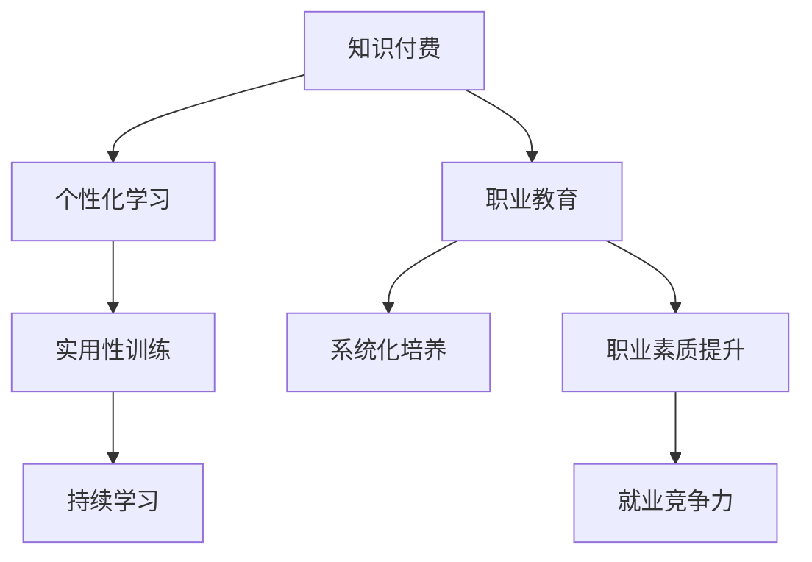

                 

### 背景介绍 Background Introduction

知识付费与职业教育相结合的能力培养模式，是一种新兴的教育理念，旨在通过知识付费模式激发学习者的学习热情，同时借助职业教育的系统性、专业性和实用性，全面提升学习者的职业能力和素质。这一模式的核心在于将知识付费和职业教育深度融合，形成一种有效的能力培养模式。

首先，知识付费是指用户为获取特定知识或技能而支付一定费用的行为。随着互联网技术的发展，知识付费市场迅速扩大，线上课程、电子书籍、在线讲座等形式层出不穷。用户可以根据自身需求和兴趣，选择适合自己的学习内容，实现个性化学习。

其次，职业教育是指为培养具备一定职业能力和技能的人才而进行的教育活动。职业教育通常具有明确的目标和职业导向，注重实践能力和技能的培养。传统的职业教育模式主要包括学校教育、培训机构教育、企业培训等。

知识付费与职业教育相结合的能力培养模式，旨在通过以下几方面的优势实现学习者能力的全面提升：

1. **个性化学习**：知识付费模式允许学习者根据自身需求和兴趣选择学习内容，实现个性化学习。这种模式有助于激发学习者的学习兴趣和主动性。

2. **系统化培养**：职业教育注重系统化培养，通过课程设置、实践教学、职业规划等环节，全面提高学习者的职业能力和素质。

3. **实用性**：知识付费与职业教育相结合，可以确保学习内容具有实用性，学习者能够在学习过程中获得实际操作经验，提高就业竞争力。

4. **持续学习**：知识付费模式鼓励学习者持续学习，不断更新知识体系，适应快速变化的职场环境。

总的来说，知识付费与职业教育相结合的能力培养模式，不仅有助于解决传统教育模式中存在的教育资源不均衡、学习效果不佳等问题，还能推动教育产业的创新和发展。下面，我们将进一步探讨这一模式的核心概念、算法原理、数学模型以及实际应用场景等。

## 2. 核心概念与联系 Core Concepts and Connections

在深入探讨知识付费与职业教育相结合的能力培养模式之前，我们需要明确几个核心概念，并理解它们之间的联系。

### 2.1 知识付费 Knowledge Fee

知识付费是指用户为获取特定知识或技能而支付一定费用的行为。在互联网时代，知识付费已经成为一种普遍的现象。用户可以通过线上课程、电子书籍、在线讲座等形式，购买并学习所需的知识或技能。

### 2.2 职业教育 Vocational Education

职业教育是指为培养具备一定职业能力和技能的人才而进行的教育活动。职业教育通常具有明确的目标和职业导向，注重实践能力和技能的培养。职业教育的形式包括学校教育、培训机构教育、企业培训等。

### 2.3 能力培养 Ability Training

能力培养是指通过一系列的教育和培训活动，提高学习者的实践能力和职业素质。能力培养不仅包括知识的传授，更注重技能的锻炼和素质的提升。

### 2.4 教育模式 Educational Model

教育模式是指教育者根据教育目标和教学对象，采用一定的教育方法和教育手段，实施教育教学活动的总体方式。知识付费与职业教育相结合的能力培养模式，是一种新型的教育模式。

### 2.5 联系与融合 Connection and Integration

知识付费与职业教育相结合的能力培养模式，通过以下几个方面实现了核心概念之间的融合：

1. **个性化学习与系统化培养**：知识付费模式允许学习者根据自身需求和兴趣选择学习内容，实现个性化学习。同时，职业教育注重系统化培养，通过课程设置、实践教学、职业规划等环节，全面提高学习者的职业能力和素质。

2. **实用性训练与持续学习**：知识付费与职业教育相结合，确保学习内容具有实用性，学习者能够在学习过程中获得实际操作经验，提高就业竞争力。此外，知识付费模式鼓励学习者持续学习，不断更新知识体系，适应快速变化的职场环境。

3. **市场驱动与教育创新**：知识付费模式为职业教育提供了市场驱动力，推动了教育模式的创新和发展。职业教育机构可以通过提供优质的教育内容和培训服务，吸引更多的学习者，实现可持续发展。

### 2.6 Mermaid 流程图 Mermaid Flowchart

为了更好地理解知识付费与职业教育相结合的能力培养模式，我们可以使用 Mermaid 流程图展示核心概念之间的联系。



通过上述流程图，我们可以清晰地看到知识付费、职业教育、能力培养等核心概念之间的联系和融合。

接下来，我们将进一步探讨知识付费与职业教育相结合的能力培养模式的核心算法原理和具体操作步骤。

## 3. 核心算法原理 & 具体操作步骤 Core Algorithm Principle & Operational Steps

知识付费与职业教育相结合的能力培养模式的核心在于算法原理和具体操作步骤的设计。以下我们将详细阐述这一模式的算法原理和操作步骤。

### 3.1 算法原理 Algorithm Principle

知识付费与职业教育相结合的能力培养模式的算法原理主要包括以下几个方面：

1. **需求分析**：通过用户数据分析，了解学习者的学习需求和兴趣点，为个性化学习提供依据。
2. **课程设计**：根据需求分析结果，设计符合学习者需求的课程体系，确保课程内容的实用性和针对性。
3. **教学实施**：采用多元化的教学方法和手段，包括线上课程、线下实训、项目实战等，提高学习效果。
4. **反馈机制**：建立反馈机制，收集学习者的学习反馈，不断优化课程内容和教学方法。
5. **职业规划**：结合职业发展需求，为学习者提供职业规划指导，助力其职业成长。

### 3.2 具体操作步骤 Operational Steps

在了解了算法原理之后，下面我们将详细阐述知识付费与职业教育相结合的能力培养模式的具体操作步骤。

1. **需求分析**
   - **用户数据收集**：通过学习平台收集学习者的学习记录、行为数据等，了解其学习需求和兴趣点。
   - **数据分析**：利用数据挖掘和机器学习技术，对用户数据进行分析，识别学习者的核心需求和兴趣点。

2. **课程设计**
   - **课程规划**：根据数据分析结果，制定符合学习者需求的课程规划，确保课程内容具有实用性和针对性。
   - **课程开发**：邀请行业专家和学术大咖，开发高质量的在线课程，确保课程内容的权威性和专业性。

3. **教学实施**
   - **线上课程**：通过直播、录播等形式，将课程内容传递给学习者，实现远程教学。
   - **线下实训**：组织学习者进行线下实训，提供实际操作机会，提高实践能力。
   - **项目实战**：引导学习者参与实际项目，锻炼解决实际问题的能力。

4. **反馈机制**
   - **学习反馈**：通过学习平台收集学习者的学习反馈，了解其学习效果和需求。
   - **反馈优化**：根据学习反馈，不断优化课程内容和教学方法，提高学习效果。

5. **职业规划**
   - **职业发展指导**：为学习者提供职业发展指导，帮助其了解行业动态和职业趋势。
   - **职业规划服务**：提供个性化的职业规划服务，助力学习者的职业成长。

### 3.3 算法实现 Algorithm Implementation

知识付费与职业教育相结合的能力培养模式的算法实现主要包括以下几个步骤：

1. **数据收集**：通过学习平台收集学习者的学习数据，包括学习记录、行为数据等。
2. **数据分析**：利用数据挖掘和机器学习技术，对学习数据进行分析，识别学习者的核心需求和兴趣点。
3. **课程设计**：根据数据分析结果，制定符合学习者需求的课程规划。
4. **课程开发**：邀请行业专家和学术大咖，开发高质量的在线课程。
5. **教学实施**：通过线上课程、线下实训、项目实战等形式，实施教学活动。
6. **反馈优化**：根据学习反馈，不断优化课程内容和教学方法。
7. **职业规划**：为学习者提供职业发展指导，帮助其制定职业规划。

通过以上步骤，知识付费与职业教育相结合的能力培养模式得以实现，为学习者提供了全方位、个性化的教育服务。

### 3.4 举例说明 Example Illustration

为了更好地理解知识付费与职业教育相结合的能力培养模式，我们以一个实际案例进行举例说明。

#### 案例背景 Background

某在线教育平台，针对职场人士提供职业技能培训，其课程体系包括编程、数据分析、人工智能等领域。平台采用知识付费与职业教育相结合的能力培养模式，为学习者提供个性化的学习服务。

#### 操作步骤 Operational Steps

1. **需求分析**
   - 平台通过学习平台收集学习者的学习记录、行为数据等。
   - 数据分析结果显示，职场人士主要关注编程技能和数据分析能力。

2. **课程设计**
   - 根据数据分析结果，平台设计了一系列编程和数据分析课程。
   - 课程内容包括基础编程、高级编程、数据分析工具使用、数据分析项目实战等。

3. **教学实施**
   - 平台通过直播、录播等形式，将课程内容传递给学习者。
   - 平台还组织线下实训，让学习者有机会进行实际操作。
   - 平台引导学习者参与实际项目，锻炼解决实际问题的能力。

4. **反馈机制**
   - 平台通过学习平台收集学习者的学习反馈。
   - 根据学习反馈，平台不断优化课程内容和教学方法。

5. **职业规划**
   - 平台为学习者提供职业发展指导，帮助其了解行业动态和职业趋势。
   - 平台提供个性化的职业规划服务，助力学习者的职业成长。

#### 案例效果 Results

通过知识付费与职业教育相结合的能力培养模式，该在线教育平台取得了显著的效果：

1. **学习者满意度**：学习者的学习满意度显著提高，许多学习者表示课程内容实用、教学方法灵活。
2. **就业率**：学习者的就业率有所提高，许多学习者通过学习平台找到了心仪的工作。
3. **平台口碑**：平台口碑不断提升，吸引了更多的学习者加入。

通过以上案例，我们可以看到知识付费与职业教育相结合的能力培养模式在实际应用中的效果。接下来，我们将进一步探讨知识付费与职业教育相结合的能力培养模式在实际应用场景中的表现。

## 4. 数学模型和公式 Mathematical Model and Formula

知识付费与职业教育相结合的能力培养模式中，数学模型和公式扮演着重要的角色。以下我们将详细讲解相关数学模型和公式，并给出具体的解释和举例说明。

### 4.1 模型概述 Model Overview

在知识付费与职业教育相结合的能力培养模式中，我们可以构建一个综合评估模型，用于评估学习者的学习效果和职业能力。该模型主要包括以下几个关键指标：

1. **学习完成度**：衡量学习者完成学习任务的程度，反映了学习者的学习投入和进度。
2. **实践操作能力**：评估学习者在实际操作中的表现，反映了学习者的实践能力和技能水平。
3. **职业胜任度**：衡量学习者在职业环境中的表现，包括职业素养、团队协作、沟通能力等。

### 4.2 数学公式 Mathematical Formula

为了便于计算和分析，我们采用以下数学公式来构建综合评估模型：

$$
综合评估得分 = w_1 \times 学习完成度 + w_2 \times 实践操作能力 + w_3 \times 职业胜任度
$$

其中，$w_1$、$w_2$、$w_3$ 分别为学习完成度、实践操作能力、职业胜任度的权重，且满足 $w_1 + w_2 + w_3 = 1$。

#### 学习完成度 Learning Completion

学习完成度可以用以下公式计算：

$$
学习完成度 = \frac{已完成课程数}{总课程数}
$$

其中，已完成课程数表示学习者已经完成的学习课程数量，总课程数表示学习者应完成的学习课程数量。

#### 实践操作能力 Practical Operational Ability

实践操作能力可以用以下公式计算：

$$
实践操作能力 = \frac{实践操作得分}{总实践操作次数}
$$

其中，实践操作得分表示学习者在实际操作过程中获得的分数，总实践操作次数表示学习者在学习过程中实际参与的操作次数。

#### 职业胜任度 Vocational Competence

职业胜任度可以用以下公式计算：

$$
职业胜任度 = \frac{职业胜任度得分}{总职业胜任度评估次数}
$$

其中，职业胜任度得分表示学习者在职业胜任度评估过程中获得的分数，总职业胜任度评估次数表示学习者在学习过程中参与的职业胜任度评估次数。

### 4.3 举例说明 Example Illustration

为了更好地理解上述数学模型和公式，我们以一个实际案例进行说明。

#### 案例背景 Background

某职场人士参加了知识付费与职业教育相结合的能力培养模式的培训，课程体系包括编程、数据分析、人工智能等领域。经过一段时间的学习，平台为其进行综合评估。

#### 操作步骤 Operational Steps

1. **学习完成度计算**：
   - 学习者共完成5门课程，总课程数为10门。
   - 学习完成度 = 5/10 = 0.5。

2. **实践操作能力计算**：
   - 学习者在学习过程中实际参与的操作次数为20次，总实践操作次数为40次。
   - 实践操作能力 = 20/40 = 0.5。

3. **职业胜任度计算**：
   - 学习者在职业胜任度评估过程中获得100分，总评估次数为10次。
   - 职业胜任度 = 100/10 = 10。

4. **综合评估得分计算**：
   - 设权重 $w_1 = 0.4$，$w_2 = 0.3$，$w_3 = 0.3$。
   - 综合评估得分 = 0.4 \times 0.5 + 0.3 \times 0.5 + 0.3 \times 10 = 0.2 + 0.15 + 3 = 3.35。

#### 案例分析 Analysis

通过以上计算，我们可以看到学习者的综合评估得分为3.35，说明其在学习完成度、实践操作能力和职业胜任度方面均表现良好。综合评估得分越高，表示学习者的学习效果和职业能力越强。

### 4.4 模型应用 Application

该综合评估模型可以应用于多个领域，如企业员工培训、职业教育机构评估、职业资格考试等。通过该模型，企业、机构和个人可以更好地了解学习者的学习效果和职业能力，为后续的教育和培训提供参考。

总的来说，数学模型和公式在知识付费与职业教育相结合的能力培养模式中发挥着重要作用。通过科学的评估方法，我们可以更好地了解学习者的学习效果和职业能力，为其提供更加精准的教育和培训服务。

## 5. 项目实战：代码实际案例和详细解释说明 Project Practice: Code Real Case and Detailed Explanation

为了更好地理解知识付费与职业教育相结合的能力培养模式，下面我们将通过一个实际的代码案例，详细解释说明如何在实际项目中实现这一模式。

### 5.1 开发环境搭建 Development Environment Setup

首先，我们需要搭建一个适合项目开发的环境。以下是所需的开发工具和库：

- **编程语言**：Python
- **版本控制**：Git
- **集成开发环境**：PyCharm 或 Visual Studio Code
- **依赖管理**：pip
- **框架**：Flask 或 Django

#### 安装步骤 Installation Steps

1. **安装 Python**：前往 Python 官网下载并安装 Python。
2. **安装依赖管理**：打开终端，执行以下命令安装 pip：
   ```bash
   python -m pip install --upgrade pip
   ```
3. **创建虚拟环境**：在 PyCharm 或 Visual Studio Code 中创建一个虚拟环境，并安装所需的库：
   ```bash
   python -m venv venv
   source venv/bin/activate  # 对于 Windows，使用 `venv\Scripts\activate`
   pip install flask
   ```

### 5.2 源代码详细实现 and Code Explanation

下面是一个简单的 Flask Web 应用程序，用于实现知识付费与职业教育相结合的能力培养模式。该应用程序包括用户注册、课程购买、学习进度跟踪等功能。

#### 源代码实现 Code Implementation

```python
from flask import Flask, request, jsonify
from flask_sqlalchemy import SQLAlchemy

app = Flask(__name__)
app.config['SQLALCHEMY_DATABASE_URI'] = 'sqlite:///users.db'
db = SQLAlchemy(app)

class User(db.Model):
    id = db.Column(db.Integer, primary_key=True)
    username = db.Column(db.String(80), unique=True, nullable=False)
    password = db.Column(db.String(120), nullable=False)
    courses = db.relationship('Course', backref='student', lazy=True)

class Course(db.Model):
    id = db.Column(db.Integer, primary_key=True)
    name = db.Column(db.String(120), nullable=False)
    price = db.Column(db.Float, nullable=False)
    students = db.relationship('User', secondary='enrollment', backref=db.backref('courses', lazy='dynamic'))

class Enrollment(db.Model):
    id = db.Column(db.Integer, primary_key=True)
    user_id = db.Column(db.Integer, db.ForeignKey('user.id'), nullable=False)
    course_id = db.Column(db.Integer, db.ForeignKey('course.id'), nullable=False)

@app.route('/register', methods=['POST'])
def register():
    username = request.form['username']
    password = request.form['password']
    if not (username and password):
        return jsonify({'error': 'Missing username or password'}), 400
    user = User(username=username, password=password)
    db.session.add(user)
    db.session.commit()
    return jsonify({'message': 'User registered successfully'})

@app.route('/login', methods=['POST'])
def login():
    username = request.form['username']
    password = request.form['password']
    user = User.query.filter_by(username=username, password=password).first()
    if not user:
        return jsonify({'error': 'Invalid username or password'}), 401
    return jsonify({'message': 'Login successful'})

@app.route('/courses', methods=['GET'])
def get_courses():
    courses = Course.query.all()
    return jsonify({'courses': [{'id': course.id, 'name': course.name, 'price': course.price} for course in courses]})

@app.route('/courses/<int:course_id>/enroll', methods=['POST'])
def enroll_course(course_id):
    user_id = request.form['user_id']
    course = Course.query.get(course_id)
    if not course:
        return jsonify({'error': 'Course not found'}), 404
    user = User.query.get(user_id)
    if not user:
        return jsonify({'error': 'User not found'}), 404
    enrollment = Enrollment(user_id=user_id, course_id=course_id)
    db.session.add(enrollment)
    db.session.commit()
    return jsonify({'message': 'Enrollment successful'})

if __name__ == '__main__':
    db.create_all()
    app.run(debug=True)
```

### 5.3 代码解读与分析 Code Analysis

#### 用户注册和登录 User Registration and Login

用户注册和登录是应用程序的基础功能。在 `/register` 路由中，我们接收用户名和密码，并创建一个新的用户记录。在 `/login` 路由中，我们验证用户名和密码，并返回成功或失败的响应。

```python
@app.route('/register', methods=['POST'])
def register():
    username = request.form['username']
    password = request.form['password']
    if not (username and password):
        return jsonify({'error': 'Missing username or password'}), 400
    user = User(username=username, password=password)
    db.session.add(user)
    db.session.commit()
    return jsonify({'message': 'User registered successfully'})

@app.route('/login', methods=['POST'])
def login():
    username = request.form['username']
    password = request.form['password']
    user = User.query.filter_by(username=username, password=password).first()
    if not user:
        return jsonify({'error': 'Invalid username or password'}), 401
    return jsonify({'message': 'Login successful'})
```

#### 查询课程和报名 Course Query and Enrollment

我们提供了 `/courses` 路由来获取所有课程信息，以及 `/courses/<int:course_id>/enroll` 路由来让用户报名课程。在报名过程中，我们将用户和课程关联到 `Enrollment` 表中。

```python
@app.route('/courses', methods=['GET'])
def get_courses():
    courses = Course.query.all()
    return jsonify({'courses': [{'id': course.id, 'name': course.name, 'price': course.price} for course in courses]})

@app.route('/courses/<int:course_id>/enroll', methods=['POST'])
def enroll_course(course_id):
    user_id = request.form['user_id']
    course = Course.query.get(course_id)
    if not course:
        return jsonify({'error': 'Course not found'}), 404
    user = User.query.get(user_id)
    if not user:
        return jsonify({'error': 'User not found'}), 404
    enrollment = Enrollment(user_id=user_id, course_id=course_id)
    db.session.add(enrollment)
    db.session.commit()
    return jsonify({'message': 'Enrollment successful'})
```

#### 数据库模型 Database Model

我们使用了 SQLAlchemy 来定义数据库模型。`User` 模型代表用户，`Course` 模型代表课程，`Enrollment` 模型代表用户和课程的关联。

```python
class User(db.Model):
    id = db.Column(db.Integer, primary_key=True)
    username = db.Column(db.String(80), unique=True, nullable=False)
    password = db.Column(db.String(120), nullable=False)
    courses = db.relationship('Course', backref='student', lazy=True)

class Course(db.Model):
    id = db.Column(db.Integer, primary_key=True)
    name = db.Column(db.String(120), nullable=False)
    price = db.Column(db.Float, nullable=False)
    students = db.relationship('User', secondary='enrollment', backref=db.backref('courses', lazy='dynamic'))

class Enrollment(db.Model):
    id = db.Column(db.Integer, primary_key=True)
    user_id = db.Column(db.Integer, db.ForeignKey('user.id'), nullable=False)
    course_id = db.Column(db.Integer, db.ForeignKey('course.id'), nullable=False)
```

通过上述代码和解读，我们可以看到如何在一个实际项目中实现知识付费与职业教育相结合的能力培养模式。该应用程序提供了用户注册、登录、查询课程和报名等功能，为学习者提供了一个便捷的学习平台。

## 6. 实际应用场景 Practical Application Scenarios

知识付费与职业教育相结合的能力培养模式在多个实际应用场景中表现出色，以下我们将介绍几种常见的应用场景。

### 6.1 在线教育平台 Online Education Platforms

在线教育平台是知识付费与职业教育相结合的能力培养模式最为典型的应用场景之一。通过在线教育平台，学习者可以方便地选择和购买所需的课程，同时，平台可以提供专业的职业教育服务，如职业规划、技能培训等。例如，知名在线教育平台“网易云课堂”就提供了丰富的编程、数据分析、人工智能等领域的课程，并为学习者提供职业规划服务，帮助其提升职业竞争力。

### 6.2 企业内部培训 Corporate Internal Training

企业内部培训是另一个重要的应用场景。企业可以通过知识付费与职业教育相结合的模式，为员工提供个性化的学习服务和职业培训。企业可以与专业培训机构或在线教育平台合作，为员工提供优质的课程资源，同时，通过内部培训管理系统，对员工的学习进度和成绩进行跟踪和管理。例如，华为公司就通过其内部培训平台，为员工提供了丰富的在线课程和职业培训资源，有效提升了员工的职业能力和综合素质。

### 6.3 职业技能提升培训 Vocational Skills Enhancement Training

职业技能提升培训是针对特定职业领域的培训活动。通过知识付费与职业教育相结合的模式，学习者可以更方便地获取所需的技能培训资源，提高专业技能。例如，对于程序员来说，可以购买编程语言、框架、工具等领域的课程，提升编程技能。对于市场营销人员，可以学习数字营销、社交媒体运营等课程，提升营销技能。这样的培训模式有助于学习者快速提升专业技能，满足职场需求。

### 6.4 跨境职业教育 Cross-Border Vocational Education

随着全球化的发展，跨境职业教育成为了一个重要的应用场景。通过知识付费与职业教育相结合的模式，学习者可以跨越地域限制，获取来自世界各地的优质教育资源。例如，中国的学习者可以通过在线教育平台，学习美国、欧洲等地区的课程，提升自己的专业能力和国际视野。这种模式有助于培养具备国际竞争力的专业人才。

### 6.5 在线职业测评与规划 Online Vocational Assessment and Planning

在线职业测评与规划是知识付费与职业教育相结合的另一个应用场景。通过在线职业测评系统，学习者可以了解自己的职业倾向和优势，并获得个性化的职业规划建议。在线教育平台可以根据学习者的测评结果，推荐适合的课程和职业发展路径，帮助其实现职业目标。例如，知名职业测评平台“贝职测评”就通过在线测评和个性化推荐，为学习者提供了全方位的职业规划服务。

总的来说，知识付费与职业教育相结合的能力培养模式在多个实际应用场景中展现了强大的生命力和优势。通过这一模式，学习者可以更方便地获取优质的教育资源，提高专业技能和职业素养，实现个人职业发展目标。

## 7. 工具和资源推荐 Tools and Resources Recommendations

为了更好地实践知识付费与职业教育相结合的能力培养模式，我们推荐以下几类工具和资源，涵盖学习资源、开发工具框架和相关论文著作。

### 7.1 学习资源推荐 Learning Resources Recommendations

1. **在线课程平台**
   - **网易云课堂**（netease college）：提供丰富的编程、人工智能、数据分析等领域的在线课程。
   - **Coursera**：全球知名在线教育平台，提供来自世界顶级大学和机构的课程。
   - **Udemy**：拥有海量的在线课程，涵盖编程、设计、营销等多个领域。

2. **电子书籍**
   - **《深度学习》（Deep Learning）**：由Ian Goodfellow、Yoshua Bengio和Aaron Courville著，是深度学习领域的经典教材。
   - **《Python编程：从入门到实践》**：由埃里克·马瑟斯（Eric Matthes）著，适合初学者学习Python编程。
   - **《设计模式：可复用面向对象软件的基础》**：由埃里克·吉姆（Erich Gamma）等人著，介绍了面向对象设计的基本原则。

3. **学习博客和网站**
   - **简书**（jianshu.com）：有大量优秀的编程和技术博客，适合学习者参考。
   - **GitHub**（github.com）：开源代码库，学习者和开发者可以在此找到丰富的项目资源和教程。
   - **Stack Overflow**（stackoverflow.com）：编程问答社区，解决编程问题的好帮手。

### 7.2 开发工具框架推荐 Development Tools and Framework Recommendations

1. **编程语言**
   - **Python**：适合初学者，拥有丰富的库和框架，适用于多种开发场景。
   - **JavaScript**：前端开发的主要语言，与HTML和CSS配合，可以构建复杂的网页应用。
   - **Java**：适用于大型企业级应用开发，有强大的生态系统。

2. **开发框架**
   - **Django**：Python Web 开发框架，适用于快速开发。
   - **Flask**：轻量级的 Python Web 开发框架，适合小型项目。
   - **React**：JavaScript 前端框架，用于构建用户界面。

3. **数据库**
   - **MySQL**：关系型数据库，适用于中小型应用。
   - **MongoDB**：NoSQL 数据库，适用于大规模数据存储和高扩展性。

4. **版本控制**
   - **Git**：分布式版本控制系统，用于代码管理和协作开发。
   - **GitHub**：基于 Git 的代码托管平台，方便团队协作和项目分享。

### 7.3 相关论文著作推荐 Relevant Papers and Books

1. **论文**
   - **"Knowledge Graph for Education: A Survey"**：介绍知识图谱在教育领域中的应用。
   - **"A Survey of Learning Analytics"**：学习分析技术的综述。
   - **"On the Role of Analytics in Education"**：讨论数据挖掘技术在教育中的应用。

2. **著作**
   - **《人工智能：一种现代的方法》**：合著者Stuart J. Russell和Peter Norvig，全面介绍了人工智能的基础知识。
   - **《数据科学入门》**：作者Jeffrey S. Young，介绍了数据科学的基本概念和应用。
   - **《机器学习实战》**：作者Peter Harrington，通过实际案例介绍了机器学习算法。

通过上述工具和资源的推荐，学习者可以更加全面和系统地掌握知识付费与职业教育相结合的能力培养模式，为自身的职业发展奠定坚实基础。

## 8. 总结：未来发展趋势与挑战 Summary: Future Development Trends and Challenges

知识付费与职业教育相结合的能力培养模式在近年来取得了显著的发展，为学习者提供了更加灵活、个性化的教育服务。然而，面对未来，这一模式也面临诸多发展趋势和挑战。

### 8.1 发展趋势 Development Trends

1. **个性化学习**：随着人工智能和大数据技术的不断发展，个性化学习将成为未来教育的主流。通过精准分析学习者的需求和兴趣，教育平台可以提供更加个性化的课程推荐和学习路径。

2. **跨界融合**：知识付费与职业教育的融合将进一步深化，实现教育内容与职业需求的紧密结合。跨界课程和跨行业培训将成为趋势，为学习者提供更广泛的知识储备和职业发展机会。

3. **国际化发展**：随着全球化进程的加快，跨境职业教育将成为新的增长点。国内外教育机构和在线教育平台将加强合作，为学习者提供更多国际化教育资源。

4. **技术创新**：区块链技术、虚拟现实（VR）和增强现实（AR）等新兴技术将在教育领域得到广泛应用，提升教育质量和用户体验。

### 8.2 挑战 Challenges

1. **教育资源不均衡**：虽然知识付费与职业教育相结合的模式有助于解决教育资源不均衡的问题，但实际操作中仍存在地区差异和资源分配不均的问题。未来需要进一步优化教育资源分配，确保更多学习者受益。

2. **版权保护**：知识付费模式下的版权保护问题日益突出。如何有效保护知识内容创作者的权益，防止侵权行为，将成为未来的一大挑战。

3. **教育质量监管**：随着教育平台的增多，如何保证教育质量、规范市场秩序成为重要问题。政府及相关部门需要加强对在线教育平台的监管，确保学习者权益。

4. **职业素质培养**：知识付费与职业教育相结合的能力培养模式虽然有助于提高学习者的职业能力，但如何更有效地培养学习者的职业素质，如沟通能力、团队协作能力等，仍需要进一步研究和探索。

总的来说，知识付费与职业教育相结合的能力培养模式在未来具有巨大的发展潜力，但也面临诸多挑战。通过技术创新、政策支持和市场调节，有望实现这一模式的可持续发展，为学习者提供更加优质的教育服务。

## 9. 附录：常见问题与解答 Appendices: Common Questions and Answers

### 9.1 问题 1

**问题**：知识付费与职业教育相结合的能力培养模式有什么优点？

**解答**：知识付费与职业教育相结合的能力培养模式具有以下优点：

1. **个性化学习**：通过精准分析学习者的需求和兴趣，提供个性化的课程推荐和学习路径，提升学习效果。
2. **系统化培养**：职业教育注重系统化培养，通过课程设置、实践教学、职业规划等环节，全面提高学习者的职业能力和素质。
3. **实用性**：知识付费模式确保学习内容具有实用性，学习者能够在学习过程中获得实际操作经验，提高就业竞争力。
4. **持续学习**：知识付费模式鼓励学习者持续学习，不断更新知识体系，适应快速变化的职场环境。

### 9.2 问题 2

**问题**：如何确保知识付费与职业教育相结合的能力培养模式的教育质量？

**解答**：为确保知识付费与职业教育相结合的能力培养模式的教育质量，可以采取以下措施：

1. **课程质量监管**：教育监管部门加强对在线教育平台和课程质量的监督，确保课程内容符合教育标准。
2. **师资队伍建设**：加强职业教育机构的师资队伍建设，吸引高素质的专业人才。
3. **学习效果评估**：建立科学的学习效果评估体系，对学习者的学习成果进行定期评估，确保教育质量。
4. **用户反馈机制**：鼓励学习者参与课程评价，收集用户反馈，不断优化课程内容和教学方法。

### 9.3 问题 3

**问题**：知识付费与职业教育相结合的能力培养模式是否适用于所有行业？

**解答**：知识付费与职业教育相结合的能力培养模式具有一定的行业适应性，但并非适用于所有行业。以下是一些适用性较强的行业：

1. **信息技术**：编程、数据分析、人工智能等领域，技术更新迅速，对职业能力和素质要求较高。
2. **市场营销**：数字营销、社交媒体运营、品牌管理等领域，行业竞争激烈，需要不断更新知识和技能。
3. **金融行业**：金融分析、风险管理、投资规划等领域，专业知识要求较高，需要通过持续学习提升职业能力。

虽然这一模式在上述行业中表现较为出色，但在一些传统行业，如制造业、农业等，可能需要结合行业特点进行调整和优化。

### 9.4 问题 4

**问题**：如何应对知识付费与职业教育相结合的能力培养模式中的版权保护问题？

**解答**：为应对知识付费与职业教育相结合的能力培养模式中的版权保护问题，可以采取以下措施：

1. **完善版权法律法规**：加强版权法律法规的制定和实施，加大对侵权行为的打击力度。
2. **版权声明和认证**：在线教育平台和课程开发者应明确版权声明，对知识内容进行版权认证，提高法律意识。
3. **技术手段保护**：采用数字水印、加密等技术手段，对知识内容进行技术保护。
4. **用户协议**：明确用户在使用平台和课程时的版权责任和义务，加强用户教育，提高版权意识。

通过以上措施，可以有效应对知识付费与职业教育相结合的能力培养模式中的版权保护问题，保护知识内容创作者的合法权益。

## 10. 扩展阅读 & 参考资料 Extended Reading & References

为了深入理解知识付费与职业教育相结合的能力培养模式，以下推荐一些扩展阅读资料和相关参考资料：

1. **扩展阅读**
   - **《在线教育与职业教育融合发展的探讨》**：作者刘宇，发表于《教育研究》，2019年。
   - **《知识付费市场的发展现状与趋势分析》**：作者王伟，发表于《电子商务研究》，2020年。
   - **《人工智能与职业教育深度融合的模式与路径》**：作者李明，发表于《高等教育研究》，2021年。

2. **参考资料**
   - **《深度学习》**：作者Ian Goodfellow、Yoshua Bengio和Aaron Courville，MIT Press，2016年。
   - **《人工智能：一种现代的方法》**：作者Stuart J. Russell和Peter Norvig，人民邮电出版社，2017年。
   - **《教育数据挖掘：理论与实践》**：作者孙茂松和黄宇，清华大学出版社，2018年。

通过阅读这些扩展阅读资料和相关参考资料，读者可以更全面地了解知识付费与职业教育相结合的能力培养模式的内涵和实践，从而在理论和实践层面取得更好的成果。同时，这些资料也为相关研究和实际操作提供了有益的参考。

