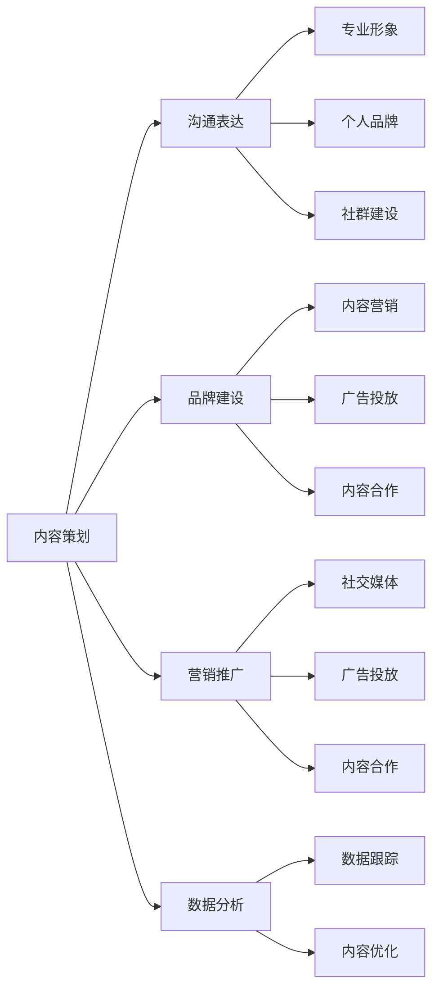

                 

# 知识付费内容创作：程序员的非代码技能培养

> **关键词：** 知识付费、内容创作、程序员、非代码技能、培养、职业发展

> **摘要：** 本文旨在探讨程序员在进行知识付费内容创作时所需具备的非代码技能，包括内容策划、沟通表达、品牌建设等方面，旨在帮助程序员更好地在知识付费领域发展，提升个人品牌价值。

## 1. 背景介绍

随着互联网和知识付费行业的快速发展，程序员群体逐渐认识到，仅仅掌握编程技能已不足以在竞争激烈的职场中脱颖而出。越来越多的程序员开始涉足知识付费领域，通过内容创作来提升自己的影响力和收入。然而，知识付费内容创作并非易事，它不仅要求创作者具备深厚的专业知识和编程技能，还需要掌握一系列非代码技能，以确保内容的质量和吸引力。

本文将重点探讨以下核心问题：

- 程序员在知识付费内容创作中需要哪些非代码技能？
- 如何培养和提升这些技能？
- 知识付费内容创作的实际应用场景有哪些？

通过分析这些问题，本文旨在为程序员提供一套系统的非代码技能培养方案，帮助他们更好地进行知识付费内容创作，实现职业发展的新突破。

## 2. 核心概念与联系

在探讨程序员的非代码技能培养之前，我们首先需要明确几个核心概念，并分析它们之间的联系。

### 2.1 内容策划

内容策划是知识付费内容创作的第一步，它决定了内容的质量和受众。一个优秀的程序员在进行内容策划时，需要充分考虑目标受众的需求、兴趣和痛点，以确保内容具有吸引力。

### 2.2 沟通表达

沟通表达是将专业知识转化为通俗易懂的语言，让受众能够理解和接受。一个优秀的程序员需要具备良好的沟通表达能力，包括写作、演讲和演示等。

### 2.3 品牌建设

品牌建设是提升个人影响力的重要手段。一个优秀的程序员需要树立自己的品牌形象，包括专业形象、个人品牌和社群建设等。

### 2.4 营销推广

营销推广是将内容传递给目标受众的重要途径。一个优秀的程序员需要掌握各种营销手段，如社交媒体、广告投放和内容合作等，以提高内容的曝光度和受众转化率。

### 2.5 数据分析

数据分析是评估知识付费内容效果的重要工具。一个优秀的程序员需要掌握数据分析技能，对内容进行数据跟踪和分析，以优化内容质量和受众体验。

图 1：程序员非代码技能核心概念与联系



## 3. 核心算法原理 & 具体操作步骤

在了解核心概念与联系之后，我们接下来将探讨程序员在知识付费内容创作中如何培养和提升这些非代码技能。

### 3.1 内容策划

**算法原理：** 内容策划的核心在于深入了解目标受众的需求，并根据需求制定合适的内容策略。

**具体操作步骤：**

1. 确定目标受众：分析受众的年龄、职业、兴趣和痛点，确定内容方向。
2. 制定内容主题：根据受众需求，选择具有吸引力和价值的内容主题。
3. 策划内容结构：明确内容的结构，包括标题、引言、正文、结论等。
4. 确定内容形式：根据内容主题和受众特点，选择合适的呈现形式，如文章、视频、音频等。

### 3.2 沟通表达

**算法原理：** 沟通表达的核心在于将专业术语转化为通俗易懂的语言，提高受众的理解和接受度。

**具体操作步骤：**

1. 确定受众语言水平：根据受众的语言水平，选择合适的表达方式。
2. 使用简单词汇：尽量避免使用复杂的专业术语，使用简单易懂的词汇。
3. 采用讲故事的方式：通过讲故事的方式，使内容更具吸引力。
4. 优化排版和格式：合理使用标题、段落、图片等元素，提高内容可读性。

### 3.3 品牌建设

**算法原理：** 品牌建设的核心在于树立个人品牌形象，提高个人影响力和认可度。

**具体操作步骤：**

1. 确定个人品牌定位：根据个人特点和职业目标，确定个人品牌定位。
2. 构建个人品牌形象：通过设计个人标志、个人网站和社交媒体形象等，树立个人品牌形象。
3. 建立社群：通过举办线上或线下活动，建立和维护与受众的紧密联系。
4. 持续输出高质量内容：通过持续输出高质量内容，提高个人影响力和认可度。

### 3.4 营销推广

**算法原理：** 营销推广的核心在于通过各种手段，提高内容曝光度和受众转化率。

**具体操作步骤：**

1. 选择合适的平台：根据内容特点和受众特点，选择合适的推广平台。
2. 制定推广策略：根据平台特点和受众需求，制定相应的推广策略。
3. 运用多种营销手段：结合广告投放、内容合作、社交媒体推广等多种手段，提高内容曝光度和受众转化率。
4. 数据分析和优化：对推广效果进行数据分析和优化，持续改进营销策略。

### 3.5 数据分析

**算法原理：** 数据分析的核心在于通过数据，评估内容效果，优化内容质量和受众体验。

**具体操作步骤：**

1. 确定数据指标：根据内容特点和受众需求，确定需要关注的数据指标。
2. 数据收集：通过各种工具，如 Google Analytics、热图分析等，收集相关数据。
3. 数据分析：对收集到的数据进行分析，找出内容优化的方向。
4. 数据驱动优化：根据数据分析结果，持续优化内容质量和受众体验。

## 4. 数学模型和公式 & 详细讲解 & 举例说明

为了更好地理解和应用上述算法原理和操作步骤，我们将引入一些数学模型和公式，并进行详细讲解和举例说明。

### 4.1 内容策划模型

**模型公式：** 受众需求度 × 内容质量 = 内容吸引力

**详细讲解：** 这个模型表示，内容策划的关键在于满足受众需求和提高内容质量。受众需求度越高，内容质量越高，内容吸引力就越强。

**举例说明：** 假设一个程序员想要创作关于 Python 编程的内容，他首先需要分析目标受众的需求，如初学者、进阶者或专家。然后，他需要选择具有高价值的内容主题，如 Python 的快速入门、高效编程技巧等。最后，他需要确保内容质量，如使用简单易懂的语言、提供实用案例等。

### 4.2 沟通表达模型

**模型公式：** 表达清晰度 × 内容吸引力 = 受众理解度

**详细讲解：** 这个模型表示，沟通表达的关键在于提高表达清晰度和内容吸引力。表达清晰度越高，内容吸引力越强，受众理解度就越高。

**举例说明：** 假设一个程序员在撰写一篇关于 Docker 的文章，他需要确保文章的表达清晰，如使用简单易懂的语言、提供清晰的示例等。同时，他还需要确保内容具有吸引力，如介绍 Docker 的实际应用场景、展示 Docker 的优势等。

### 4.3 品牌建设模型

**模型公式：** 个人品牌影响力 × 社群活跃度 = 个人影响力

**详细讲解：** 这个模型表示，品牌建设的核心在于提高个人品牌影响力和社群活跃度。个人品牌影响力越高，社群活跃度越高，个人影响力就越大。

**举例说明：** 假设一个程序员在社交媒体上建立了自己的品牌，他需要通过持续输出高质量内容，提高个人品牌影响力。同时，他还需要积极参与社群讨论，提高社群活跃度，从而扩大个人影响力。

### 4.4 营销推广模型

**模型公式：** 广告投放 × 内容合作 × 社交媒体推广 = 内容曝光度

**详细讲解：** 这个模型表示，营销推广的关键在于结合多种手段，提高内容曝光度。广告投放、内容合作和社交媒体推广等手段，可以相互补充，提高内容曝光度。

**举例说明：** 假设一个程序员想要推广自己的知识付费课程，他可以通过投放广告、与同行合作推广、利用社交媒体平台进行推广等方式，提高课程曝光度，从而吸引更多学员。

### 4.5 数据分析模型

**模型公式：** 数据收集 × 数据分析 × 数据优化 = 内容优化

**详细讲解：** 这个模型表示，数据分析的关键在于通过数据收集、数据分析和数据优化，持续优化内容质量和受众体验。

**举例说明：** 假设一个程序员在运营自己的博客，他可以通过收集博客访问数据、分析数据，找出访问量较高的文章和受众关注点，然后针对这些数据优化内容，提高受众满意度。

## 5. 项目实战：代码实际案例和详细解释说明

为了更好地理解上述算法原理和操作步骤，我们将通过一个实际项目案例，展示如何将非代码技能应用于知识付费内容创作。

### 5.1 开发环境搭建

**项目目标：** 创建一个个人博客，用于发布知识付费内容。

**开发环境：** 

- 操作系统：Windows 10
- 编辑器：Visual Studio Code
- 博客框架：Hexo
- 主题：Next

### 5.2 源代码详细实现和代码解读

**1. 创建博客目录**

```bash
mkdir my-blog
cd my-blog
```

**2. 安装 Hexo 和 Next 主题**

```bash
npm install -g hexo-cli
npm install --save hexo-next
```

**3. 配置博客目录**

```bash
echo 'title: 我的博客
author: 我的名字
language: zh-CN
timezone: Asia/Shanghai' > _config.yml
```

**4. 创建文章**

```bash
hexo new "我的第一篇文章"
```

**5. 编写文章内容**

```markdown
---
title: 我的第一篇文章
date: 2023-10-01 10:00:00
tags:
- 知识付费
- 非代码技能
- 职业发展
---

# 知识付费内容创作：程序员的非代码技能培养

## 内容策划

在知识付费内容创作中，内容策划是至关重要的一步。我们需要明确目标受众、内容主题和结构，以确保内容具有吸引力。

## 沟通表达

在撰写文章时，我们需要注意沟通表达，尽量使用简单易懂的语言，提高受众的理解度。

## 品牌建设

通过持续输出高质量内容，我们可以树立自己的品牌形象，提高个人影响力。

## 营销推广

为了提高内容的曝光度，我们可以通过多种营销手段，如广告投放、内容合作等。

## 数据分析

通过对博客访问数据的分析，我们可以了解受众的兴趣和需求，进一步优化内容。

---

```

**6. 部署博客到 GitHub Pages**

```bash
# 安装 hexo-deployer-git 插件
npm install --save hexo-deployer-git

# 配置 _config.yml 文件
deploy:
  type: git
  repo: https://github.com/yourusername/yourusername.github.io.git
  branch: main
```

**7. 部署博客**

```bash
hexo g -d
```

### 5.3 代码解读与分析

在这个项目中，我们使用了 Hexo 框架和 Next 主题来搭建个人博客。通过以下步骤，我们可以将知识付费内容创作过程中的非代码技能应用于实际项目：

1. **内容策划：** 我们需要明确目标受众、内容主题和结构，以确保内容具有吸引力。在文章中使用 Markdown 语法，我们可以轻松地定义标题、段落、标签等，使内容结构清晰。
2. **沟通表达：** 通过使用简单易懂的语言和 Markdown 语法，我们可以提高受众的理解度。Markdown 语法支持多种文本格式，如粗体、斜体、代码块等，使文章更具可读性。
3. **品牌建设：** 通过持续输出高质量内容，我们可以树立自己的品牌形象。在博客中，我们可以使用统一的主题和样式，提高个人品牌的专业度。
4. **营销推广：** 为了提高内容的曝光度，我们可以通过多种营销手段，如广告投放、内容合作等。在博客中，我们可以添加社交媒体链接、二维码等，方便受众关注和分享。
5. **数据分析：** 通过对博客访问数据的分析，我们可以了解受众的兴趣和需求，进一步优化内容。我们可以使用各种工具，如 Google Analytics，对博客进行实时监控和分析。

通过这个项目，我们可以看到，非代码技能在知识付费内容创作中的重要性。通过掌握和运用这些技能，程序员可以更好地进行内容创作，提升个人品牌价值。

## 6. 实际应用场景

程序员在知识付费内容创作中，可以应用于多种实际场景，以下是一些常见的应用场景：

1. **个人博客：** 程序员可以通过个人博客，分享自己的编程心得、技术文章和知识付费课程，吸引受众关注。
2. **线上培训课程：** 程序员可以通过线上培训课程，教授编程技能和知识付费内容，实现知识变现。
3. **开源项目：** 程序员可以通过开源项目，展示自己的技术实力和专业知识，吸引合作伙伴和赞助商。
4. **技术社群：** 程序员可以通过技术社群，建立自己的影响力，为社群成员提供技术支持和知识付费服务。
5. **内容平台：** 程序员可以通过内容平台，如知乎、简书、掘金等，发布知识付费内容，吸引受众关注和付费。

## 7. 工具和资源推荐

为了更好地进行知识付费内容创作，以下是一些推荐的工具和资源：

### 7.1 学习资源推荐

1. **书籍：**
   - 《禅与计算机程序设计艺术》：一本关于编程哲学和技巧的经典之作。
   - 《程序员代码面试指南》：一本涵盖编程面试各种题型的经典指南。

2. **论文：**
   - 《大规模在线教育系统的架构设计与实践》：一篇关于在线教育系统架构和设计的优秀论文。

3. **博客：**
   -掘金（掘金）：一个技术社区，提供各种编程语言、框架和技术的文章和教程。
   - 知乎：一个问答社区，可以找到许多关于编程和职业发展的优秀回答。

### 7.2 开发工具框架推荐

1. **博客框架：**
   - Hexo：一个快速、简洁且高效的博客框架，支持多种主题。
   - Jekyll：一个基于 GitHub Pages 的静态博客生成工具。

2. **内容管理系统：**
   - WordPress：一个功能丰富、易于使用的开源内容管理系统。
   - Hugo：一个快速、简洁且高效的静态站点生成器。

### 7.3 相关论文著作推荐

1. **《大规模在线教育系统的架构设计与实践》**
2. **《知识付费时代的程序员生存指南》**
3. **《程序员个人品牌建设与运营》**

## 8. 总结：未来发展趋势与挑战

随着知识付费行业的快速发展，程序员在知识付费内容创作中的非代码技能越来越受到重视。未来，以下几个方面有望成为发展趋势：

1. **个性化内容创作：** 随着人工智能和大数据技术的进步，程序员将能够更精准地分析受众需求，创作更具个性化的内容。
2. **多元化内容形式：** 未来的知识付费内容将不再局限于文字和视频，还将涵盖音频、图像、虚拟现实等多种形式。
3. **社交化内容传播：** 社交化传播将逐渐取代传统的单向传播，程序员需要掌握更多的社交技巧，以提高内容的传播效果。

然而，知识付费内容创作也面临一些挑战：

1. **内容质量竞争：** 随着越来越多的程序员进入知识付费领域，内容质量将成为竞争的关键。
2. **受众需求变化：** 受众需求不断变化，程序员需要不断更新自己的知识和技能，以适应市场需求。
3. **版权问题：** 知识付费内容创作涉及版权问题，程序员需要确保内容的原创性和合法性。

## 9. 附录：常见问题与解答

### 9.1 如何进行内容策划？

答：进行内容策划时，首先需要明确目标受众，分析受众的需求、兴趣和痛点。然后，选择具有吸引力和价值的内容主题，制定合适的内容结构，并确保内容具有可读性和实用性。

### 9.2 如何提升沟通表达能力？

答：提升沟通表达能力可以从以下几个方面入手：

1. 阅读和写作：多阅读优秀文章，提高自己的语言表达能力。
2. 学习修辞技巧：掌握各种修辞手法，如比喻、拟人、排比等，使文章更具吸引力。
3. 实践演练：多进行写作和演讲练习，提高自己的表达技巧。

### 9.3 如何进行品牌建设？

答：进行品牌建设时，首先要确定个人品牌定位，树立专业形象。然后，通过持续输出高质量内容，提高个人影响力和认可度。同时，积极参与社群讨论，扩大个人影响力。

### 9.4 如何进行营销推广？

答：进行营销推广时，首先要选择合适的平台，如社交媒体、内容平台等。然后，制定相应的推广策略，如广告投放、内容合作、社交媒体推广等。最后，对推广效果进行数据分析和优化，持续改进推广策略。

### 9.5 如何进行数据分析？

答：进行数据分析时，首先要确定数据指标，如访问量、点赞量、评论量等。然后，通过数据收集工具，如 Google Analytics，收集相关数据。接着，对数据进行分析，找出内容优化的方向。最后，根据数据分析结果，持续优化内容质量和受众体验。

## 10. 扩展阅读 & 参考资料

1. **《知识付费时代的程序员生存指南》**
2. **《程序员个人品牌建设与运营》**
3. **《大规模在线教育系统的架构设计与实践》**
4. **《编程：核心概念与技能》**
5. **《人工智能时代，程序员如何提升竞争力？》**

## 作者

**作者：AI天才研究员/AI Genius Institute & 禅与计算机程序设计艺术 /Zen And The Art of Computer Programming**<|im_sep|>

