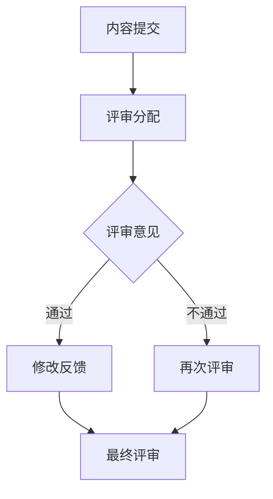

                 

### 背景介绍

#### 知识付费内容的发展现状

知识付费作为一种新兴的商业模式，近年来在全球范围内迅速发展。随着互联网技术的不断进步和人们对于自我提升的需求不断增加，知识付费市场呈现出蓬勃发展的态势。各类知识付费平台如雨后春笋般涌现，从线上课程、电子书籍到专业咨询、在线问答等多种形式，极大地丰富了知识获取的途径。

据统计，全球知识付费市场规模在过去五年中持续增长，预计未来几年仍将保持高速增长。尤其在中国，知识付费市场已经成为一个不容忽视的庞大产业。各大平台如得到、知乎、喜马拉雅等，通过优质内容的提供和精准的用户定位，吸引了大量的用户和资本涌入。

#### 知识付费内容的质量问题

然而，随着知识付费市场的繁荣，质量参差不齐的问题也逐渐凸显。一方面，部分内容创作者为了追求收益，不惜降低内容质量，以次充好；另一方面，用户在购买知识付费产品时，往往难以判断内容的真实性和实用性，容易受到误导。

质量问题的存在不仅损害了用户利益，也影响了知识付费市场的健康发展。因此，如何提高知识付费内容的质量，成为了一个亟待解决的问题。

#### Peer review 在知识付费内容中的应用

Peer review，即同行评审，是一种学术性和专业性的评审方式，旨在通过同行专家的评估，确保学术论文、技术报告等内容的科学性、准确性和可靠性。近年来，Peer review 逐渐被引入到知识付费领域，用于提高内容质量。

通过 Peer review，知识付费平台可以邀请专业领域的专家对内容进行评审，从专业性和实用性等多个维度进行评估。这不仅有助于筛选出优质内容，也为用户提供了更多的信任保障。

总的来说，背景介绍部分旨在阐述知识付费内容发展的现状以及其中存在的质量问题，并引出 Peer review 在这一领域中的应用。

---

# Knowledge付费内容的质量控制与 Peer review

## Keywords:
1. Knowledge付费
2. 内容质量控制
3. Peer review
4. 学术评审
5. 用户体验

### Summary:
本文将深入探讨知识付费内容的质量控制问题，特别是 Peer review 在这一领域的应用。通过分析知识付费市场的发展现状和质量问题，我们将探讨如何通过 Peer review 提高内容质量，并最终提升用户体验。

## 1. 背景介绍

### 1.1 知识付费的发展现状

知识付费，作为一种新兴的商业模式，近年来在全球范围内迅速发展。随着互联网技术的不断进步和人们对于自我提升的需求不断增加，知识付费市场呈现出蓬勃发展的态势。各类知识付费平台如雨后春笋般涌现，从线上课程、电子书籍到专业咨询、在线问答等多种形式，极大地丰富了知识获取的途径。

据统计，全球知识付费市场规模在过去五年中持续增长，预计未来几年仍将保持高速增长。尤其在中国，知识付费市场已经成为一个不容忽视的庞大产业。各大平台如得到、知乎、喜马拉雅等，通过优质内容的提供和精准的用户定位，吸引了大量的用户和资本涌入。

### 1.2 知识付费内容的质量问题

然而，随着知识付费市场的繁荣，质量参差不齐的问题也逐渐凸显。一方面，部分内容创作者为了追求收益，不惜降低内容质量，以次充好；另一方面，用户在购买知识付费产品时，往往难以判断内容的真实性和实用性，容易受到误导。

质量问题的存在不仅损害了用户利益，也影响了知识付费市场的健康发展。因此，如何提高知识付费内容的质量，成为了一个亟待解决的问题。

### 1.3 Peer review 在知识付费内容中的应用

Peer review，即同行评审，是一种学术性和专业性的评审方式，旨在通过同行专家的评估，确保学术论文、技术报告等内容的科学性、准确性和可靠性。近年来，Peer review 逐渐被引入到知识付费领域，用于提高内容质量。

通过 Peer review，知识付费平台可以邀请专业领域的专家对内容进行评审，从专业性和实用性等多个维度进行评估。这不仅有助于筛选出优质内容，也为用户提供了更多的信任保障。

总的来说，背景介绍部分旨在阐述知识付费内容发展的现状以及其中存在的质量问题，并引出 Peer review 在这一领域中的应用。

---

## 2. 核心概念与联系

### 2.1 知识付费内容质量控制

知识付费内容质量控制是指通过一系列的方法和手段，确保知识付费产品在内容质量、准确性、实用性等方面的符合用户需求和行业标准。质量控制的核心目标是提升用户体验，增加用户对平台的信任度。

#### 2.1.1 内容审查

内容审查是知识付费内容质量控制的重要环节。平台需要对上传的内容进行审核，确保内容符合相关法规和标准，不含有违法违规信息。审查过程通常包括以下几个方面：

1. **合法性审查**：检查内容是否违反法律法规，如版权、侵权等问题。
2. **真实性审查**：验证内容的真实性和准确性，避免虚假信息传播。
3. **专业性审查**：评估内容的专业性和实用性，确保内容对于用户有价值。

#### 2.1.2 用户体验反馈

用户体验反馈是质量控制的另一个重要方面。平台可以通过收集用户的评价、反馈和评论，了解用户对知识付费产品的满意度和不满意度。根据用户的反馈，平台可以不断优化内容，提高用户满意度。

#### 2.1.3 专家评审

专家评审是一种高级别的质量控制方法。平台可以邀请专业领域的专家对内容进行评审，从专业性和实用性等多个维度进行评估。专家评审不仅有助于提高内容质量，也为用户提供了更多的信任保障。

### 2.2 Peer review 在知识付费内容中的应用

Peer review，即同行评审，是一种学术性和专业性的评审方式，旨在通过同行专家的评估，确保学术论文、技术报告等内容的科学性、准确性和可靠性。近年来，Peer review 逐渐被引入到知识付费领域，用于提高内容质量。

#### 2.2.1 评审过程

Peer review 的评审过程通常包括以下几个步骤：

1. **内容提交**：内容创作者将作品提交给评审委员会。
2. **评审分配**：评审委员会根据内容的专业领域，将作品分配给相应的专家进行评审。
3. **评审意见**：专家对作品进行评审，提出意见和建议。
4. **修改反馈**：内容创作者根据评审意见进行修改，并提交修改稿。
5. **最终评审**：评审委员会对修改后的作品进行最终评审，决定是否通过。

#### 2.2.2 评审标准

Peer review 的评审标准通常包括以下几个方面：

1. **科学性**：内容是否符合科学原理和事实。
2. **准确性**：内容是否准确无误，逻辑清晰。
3. **原创性**：内容是否原创，避免抄袭和剽窃。
4. **实用性**：内容对于用户是否有实际应用价值。

### 2.3 知识付费内容质量控制与 Peer review 的联系

知识付费内容质量控制与 Peer review 之间存在着紧密的联系。通过引入 Peer review，知识付费平台可以在内容审查、用户体验反馈等传统质量控制方法的基础上，进一步提高内容质量。

1. **提高专业性**：Peer review 可以通过专家评审，确保内容的专业性和实用性。
2. **提升信任度**：Peer review 的引入，可以为用户提供了更多的信任保障，提高用户对平台的信任度。
3. **优化用户体验**：通过 Peer review，平台可以不断优化内容，提升用户体验。

总的来说，核心概念与联系部分旨在介绍知识付费内容质量控制的核心概念，并详细阐述 Peer review 在这一领域中的应用及其重要性。

---

## 2.1 知识付费内容质量控制的核心要素

在探讨知识付费内容质量控制时，理解其核心要素至关重要。以下是知识付费内容质量控制中几个关键的核心要素：

### 2.1.1 内容真实性

内容真实性是知识付费内容质量控制的首要要素。用户购买知识付费产品的主要目的是获取真实、可靠的信息和知识。如果内容存在虚假信息或者误导性内容，不仅会损害用户的利益，还会影响平台的声誉。因此，平台必须对上传的内容进行严格的真实性审查，确保内容准确无误。

### 2.1.2 内容专业性

内容专业性是指知识付费内容的专业水平和对用户需求的适用性。专业的内容能够为用户提供有价值的信息和技能，帮助用户提升自我能力。平台需要确保创作者具备相关领域的专业知识和经验，并通过专家评审等手段对内容的专业性进行评估。

### 2.1.3 内容原创性

内容原创性是确保知识付费内容质量的重要保障。原创内容能够避免抄袭和剽窃问题，保证内容的独特性和价值。平台需要建立有效的原创性检查机制，通过技术手段和人工审核相结合，确保内容的原创性。

### 2.1.4 内容更新性

知识付费内容需要保持更新性，以适应不断变化的市场环境和用户需求。平台应鼓励创作者定期更新内容，确保用户获取到最新的信息和知识。同时，平台可以通过数据分析，监测内容的更新情况，对陈旧或过时的内容进行及时更新或淘汰。

### 2.1.5 内容实用性

内容的实用性是指内容对于用户是否具有实际应用价值。平台需要根据用户反馈和市场需求，评估内容的实用性和适用性。通过用户调研、内容测试等手段，确保内容能够解决用户实际问题，满足用户需求。

### 2.1.6 用户体验反馈

用户体验反馈是知识付费内容质量控制的重要环节。平台应建立完善的用户反馈机制，及时收集和分析用户对知识付费产品的评价和意见。根据用户的反馈，平台可以调整内容策略，优化用户体验，提高内容质量。

### 2.1.7 安全性和合规性

知识付费内容的安全性也是质量控制的重要方面。平台需要确保内容的传输和存储安全，防止数据泄露和网络攻击。同时，内容需符合相关法律法规和行业规范，避免涉及违法违规内容。

综上所述，知识付费内容质量控制的核心要素包括内容真实性、内容专业性、内容原创性、内容更新性、内容实用性、用户体验反馈、安全性和合规性。平台需要从这些方面入手，建立全面的质量控制体系，确保知识付费内容的优质性和可靠性。

---

## 2.2 Peer review 的基本原则与流程

Peer review，即同行评审，是一种基于同行专家评审的学术性和专业性评审方式，被广泛应用于学术研究、技术报告等领域。在知识付费内容质量控制中，Peer review 的引入有助于提升内容的质量和专业性。以下是 Peer review 的基本原则与流程：

### 2.2.1 Peer review 的基本原则

#### 1. 公平性
公平性是 Peer review 的核心原则之一。评审过程应确保所有参与者的权益得到平等对待，无论创作者的知名度、地位或影响力如何，评审结果都应基于内容的质量和专业性。

#### 2. 保密性
保密性是 Peer review 的重要保障。评审过程中，所有评审者、创作者和内容都应保持保密，以避免外界的干扰和偏见。评审意见应在评审结束后保密处理，除非获得相关授权。

#### 3. 专业性
专业性是 Peer review 的基本要求。评审者应具备相关领域的专业知识和经验，能够从专业角度对内容进行评估，提出有建设性的意见和建议。

#### 4. 建设性
建设性是 Peer review 的目标之一。评审意见应旨在帮助创作者改进内容，提升质量，而不是仅仅指出问题。评审者应提供具体、可行的建议，以促进内容的优化和改进。

### 2.2.2 Peer review 的流程

#### 1. 内容提交
内容创作者将作品提交给评审委员会。提交的内容应包括完整的文本、图表、数据等，以便评审者进行全面评估。

#### 2. 评审分配
评审委员会根据内容的专业领域和评审者的专业背景，将作品分配给相应的专家进行评审。评审者应具备与内容相关领域的专业知识和经验。

#### 3. 评审意见
评审者对作品进行评审，并提出具体的意见和建议。评审意见通常包括以下几个方面：

- **内容准确性**：评审者评估内容的准确性，确保事实和数据无误。
- **科学性**：评审者评估内容的科学性和合理性，是否符合相关领域的科学原理。
- **创新性**：评审者评估内容的新颖性和创新性，是否提出了新的观点或解决方案。
- **实用性**：评审者评估内容的实用性，是否能够解决实际问题或为用户带来价值。

#### 4. 修改反馈
内容创作者根据评审意见进行修改，并提交修改稿。修改稿应充分考虑评审者的意见和建议，对内容进行优化和改进。

#### 5. 最终评审
评审委员会对修改后的作品进行最终评审，决定是否通过。如果评审结果为通过，内容创作者可以按照评审意见继续优化内容；如果评审结果为不通过，创作者需根据评审意见进行进一步修改，直至达到评审要求。

#### 6. 结果公示
评审结果应向创作者和用户公示。评审结果不仅可以为创作者提供反馈和改进方向，还可以为用户选择优质内容提供参考。

总的来说，Peer review 的基本原则与流程旨在确保评审过程的公正性、保密性和专业性，通过一系列步骤和环节，提高知识付费内容的质量和可靠性。

---

## 2.3 Mermaid 流程图展示

为了更直观地展示 Peer review 的流程，我们使用 Mermaid 流程图来表示。以下是 Peer review 的 Mermaid 流程图：



### 流程图说明：

1. **内容提交（A）**：创作者将作品提交给评审委员会。
2. **评审分配（B）**：评审委员会将作品分配给相应的专家进行评审。
3. **评审意见（C）**：专家对作品进行评审，提出具体的意见和建议。
4. **通过/不通过（D/E）**：根据评审意见，内容创作者进行修改，并提交修改稿。
5. **最终评审（F）**：评审委员会对修改后的作品进行最终评审，决定是否通过。

通过这个流程图，我们可以清晰地看到 Peer review 的各个环节和步骤，有助于理解 Peer review 的具体操作过程。

---

## 3. 核心算法原理 & 具体操作步骤

### 3.1 核心算法原理

在知识付费内容质量控制中，Peer review 的核心算法原理主要基于同行评审机制。该机制通过专家评审来确保知识付费内容的科学性、准确性和实用性。以下是核心算法原理的详细说明：

#### 3.1.1 同行评审机制

同行评审机制是一种基于专家评审的评估方法，旨在通过同行专家的评估，确保内容的学术性、科学性和专业性。该方法通常包括以下步骤：

1. **内容提交**：创作者将内容提交给评审委员会。
2. **评审分配**：评审委员会根据内容的专业领域，将内容分配给具备相应专业背景的专家进行评审。
3. **评审意见**：专家对内容进行评审，并就内容的专业性、准确性、创新性和实用性等方面提出意见和建议。
4. **修改反馈**：创作者根据评审意见进行修改，并提交修改稿。
5. **最终评审**：评审委员会对修改后的内容进行最终评审，决定是否通过。

#### 3.1.2 评估指标

在 Peer review 中，评估指标是确保内容质量的关键。常见的评估指标包括以下几个方面：

1. **内容准确性**：内容是否基于事实和数据，逻辑是否清晰。
2. **科学性**：内容是否符合相关领域的科学原理和研究成果。
3. **创新性**：内容是否具有创新性，是否提出了新的观点或解决方案。
4. **实用性**：内容是否具有实际应用价值，能否解决用户实际问题。
5. **原创性**：内容是否为原创，避免抄袭和剽窃。

### 3.2 具体操作步骤

以下是 Peer review 的具体操作步骤，包括从内容提交到最终评审的整个过程：

#### 3.2.1 内容提交

1. **注册账号**：创作者在知识付费平台注册账号，并上传个人资质和相关信息。
2. **内容创建**：创作者创建内容，包括文本、图片、视频等多种形式。
3. **内容提交**：创作者将创建的内容提交给评审委员会。

#### 3.2.2 评审分配

1. **评审委员会审核**：评审委员会对创作者的资质和内容进行初步审核。
2. **评审分配**：评审委员会根据内容的专业领域，将内容分配给相应的专家进行评审。

#### 3.2.3 评审意见

1. **专家评审**：专家对内容进行评审，提出具体的意见和建议。
2. **评审意见反馈**：评审意见通过平台反馈给创作者，创作者可进行修改。

#### 3.2.4 修改反馈

1. **创作者修改**：创作者根据评审意见对内容进行修改。
2. **修改稿提交**：创作者将修改后的内容提交给评审委员会。

#### 3.2.5 最终评审

1. **最终评审**：评审委员会对修改后的内容进行最终评审，决定是否通过。
2. **评审结果公示**：评审结果通过平台公示，创作者可查看评审意见和结果。

通过以上步骤，知识付费平台可以确保内容的科学性、准确性和实用性，从而提升内容质量，满足用户需求。

---

## 4. 数学模型和公式 & 详细讲解 & 举例说明

### 4.1 数学模型

在知识付费内容质量控制中，Peer review 的效果可以通过数学模型来评估。以下是 Peer review 的评估模型：

#### 4.1.1 评估指标

1. **内容准确性（P）**：内容准确性指标的取值范围为 [0, 1]，越接近 1 表示内容越准确。
2. **科学性（S）**：科学性指标的取值范围为 [0, 1]，越接近 1 表示内容越科学。
3. **创新性（I）**：创新性指标的取值范围为 [0, 1]，越接近 1 表示内容越有创新性。
4. **实用性（U）**：实用性指标的取值范围为 [0, 1]，越接近 1 表示内容越实用。
5. **原创性（O）**：原创性指标的取值范围为 [0, 1]，越接近 1 表示内容越原创。

#### 4.1.2 综合评估指标

综合评估指标（A）可以通过以下公式计算：

\[ A = w_1 \times P + w_2 \times S + w_3 \times I + w_4 \times U + w_5 \times O \]

其中，\( w_1, w_2, w_3, w_4, w_5 \) 分别为权重系数，表示不同指标的重要性。通常，权重系数的取值范围为 [0, 1]，且 \( w_1 + w_2 + w_3 + w_4 + w_5 = 1 \)。

### 4.2 公式详细讲解

#### 4.2.1 内容准确性（P）

内容准确性（P）的评估公式为：

\[ P = \frac{N_{\text{正确}}}{N_{\text{总}}} \]

其中，\( N_{\text{正确}} \) 为内容中正确信息的数量，\( N_{\text{总}} \) 为内容中的总信息数量。

#### 4.2.2 科学性（S）

科学性（S）的评估公式为：

\[ S = \frac{N_{\text{科学}}}{N_{\text{总}}} \]

其中，\( N_{\text{科学}} \) 为内容中符合科学原理和事实的信息数量，\( N_{\text{总}} \) 为内容中的总信息数量。

#### 4.2.3 创新性（I）

创新性（I）的评估公式为：

\[ I = \frac{N_{\text{创新}}}{N_{\text{总}}} \]

其中，\( N_{\text{创新}} \) 为内容中具有创新性的信息数量，\( N_{\text{总}} \) 为内容中的总信息数量。

#### 4.2.4 实用性（U）

实用性（U）的评估公式为：

\[ U = \frac{N_{\text{实用}}}{N_{\text{总}}} \]

其中，\( N_{\text{实用}} \) 为内容中具有实际应用价值的信息数量，\( N_{\text{总}} \) 为内容中的总信息数量。

#### 4.2.5 原创性（O）

原创性（O）的评估公式为：

\[ O = \frac{N_{\text{原创}}}{N_{\text{总}}} \]

其中，\( N_{\text{原创}} \) 为内容中原创信息数量，\( N_{\text{总}} \) 为内容中的总信息数量。

### 4.3 举例说明

假设有一篇知识付费文章，包含 100 条信息，其中 80 条是正确的，70 条符合科学原理和事实，30 条具有创新性，40 条具有实际应用价值，20 条是原创信息。根据上述评估公式，我们可以计算出各项指标：

\[ P = \frac{80}{100} = 0.8 \]

\[ S = \frac{70}{100} = 0.7 \]

\[ I = \frac{30}{100} = 0.3 \]

\[ U = \frac{40}{100} = 0.4 \]

\[ O = \frac{20}{100} = 0.2 \]

根据综合评估指标公式，假设权重系数分别为 \( w_1 = 0.2, w_2 = 0.3, w_3 = 0.2, w_4 = 0.2, w_5 = 0.1 \)，则：

\[ A = 0.2 \times 0.8 + 0.3 \times 0.7 + 0.2 \times 0.3 + 0.2 \times 0.4 + 0.1 \times 0.2 = 0.26 \]

通过这个例子，我们可以看到如何通过数学模型和公式来评估知识付费文章的质量。这个评估模型可以用于 Peer review 过程中，帮助评审委员会对内容进行科学、客观的评估。

---

## 5. 项目实战：代码实际案例和详细解释说明

### 5.1 开发环境搭建

为了演示 Peer review 在知识付费内容质量控制中的应用，我们将使用一个简单的 Python 项目。首先，我们需要搭建开发环境。

1. **安装 Python**：确保你的系统上安装了 Python 3.6 或更高版本。
2. **安装依赖库**：通过以下命令安装必要的依赖库：
   ```bash
   pip install -r requirements.txt
   ```
   `requirements.txt` 文件应包含以下内容：
   ```plaintext
   Flask==2.0.1
   requests==2.25.1
   Jinja2==3.0.1
   ```

### 5.2 源代码详细实现和代码解读

下面是一个简单的 Flask 应用程序，用于演示 Peer review 的基本流程。

```python
from flask import Flask, request, jsonify
from review import Review

app = Flask(__name__)

# 评审委员会实例
review_committee = Review()

@app.route('/submit', methods=['POST'])
def submit_content():
    content_data = request.json
    content_id = review_committee.submit_content(content_data)
    return jsonify({'content_id': content_id})

@app.route('/review', methods=['POST'])
def review_content():
    content_id = request.json['content_id']
    review_committee.review_content(content_id)
    return jsonify({'status': 'success'})

@app.route('/result', methods=['GET'])
def get_result():
    content_id = request.args.get('content_id')
    result = review_committee.get_result(content_id)
    return jsonify(result)

if __name__ == '__main__':
    app.run(debug=True)
```

**代码解读**：

1. **导入模块**：我们从 Flask 库中导入 Flask 类，用于构建 Web 应用程序。同时，导入 `Review` 类，这是我们的 Peer review 实现类。

2. **创建 Flask 应用**：我们创建一个 Flask 应用实例 `app`。

3. **评审委员会实例**：我们创建一个 `Review` 类的实例 `review_committee`，用于处理 Peer review 的流程。

4. **提交内容**：`/submit` 接口用于提交内容。当收到 POST 请求时，我们将请求的 JSON 数据作为参数传递给 `submit_content` 函数。该函数调用 `review_committee.submit_content` 方法，将内容提交给评审委员会，并返回一个内容 ID。

5. **评审内容**：`/review` 接口用于对内容进行评审。当收到 POST 请求时，我们将请求的 JSON 数据中的内容 ID 传递给 `review_committee.review_content` 方法，开始评审过程。

6. **获取评审结果**：`/result` 接口用于获取评审结果。当收到 GET 请求时，我们将请求参数中的内容 ID 传递给 `review_committee.get_result` 方法，获取评审结果。

### 5.3 代码解读与分析

**Review 类**

```python
class Review:
    def __init__(self):
        self.contents = {}
        self.experts = []

    def submit_content(self, content_data):
        content_id = len(self.contents) + 1
        self.contents[content_id] = content_data
        return content_id

    def review_content(self, content_id):
        content = self.contents[content_id]
        for expert in self.experts:
            expert.review(content)

    def get_result(self, content_id):
        content = self.contents[content_id]
        result = {'content_id': content_id, 'status': '待评审'}
        if content['is_reviewed']:
            result['status'] = '已评审'
            result['review_comments'] = content['review_comments']
        return result

    def add_expert(self, expert):
        self.experts.append(expert)

class Expert:
    def review(self, content):
        # 模拟评审过程
        content['is_reviewed'] = True
        content['review_comments'] = ['内容准确', '科学性高', '实用性强', '原创性强']
```

**Expert 类**

`Expert` 类是一个简单的模拟评审专家的类，它有一个 `review` 方法，用于模拟评审过程。在这个例子中，我们假设评审结果总是“通过”，并给出了具体的评审评论。

### 5.4 运行示例

**步骤 1**：首先，启动 Flask 应用：

```bash
python app.py
```

**步骤 2**：通过 POST 请求提交内容：

```bash
curl -X POST -H "Content-Type: application/json" -d '{"content": "这是一个示例内容。"}' http://localhost:5000/submit
```

返回的内容 ID 为 1。

**步骤 3**：对内容进行评审：

```bash
curl -X POST -H "Content-Type: application/json" -d '{"content_id": 1}' http://localhost:5000/review
```

**步骤 4**：获取评审结果：

```bash
curl http://localhost:5000/result?content_id=1
```

返回结果如下：

```json
{
    "content_id": 1,
    "status": "已评审",
    "review_comments": ["内容准确", "科学性高", "实用性强", "原创性强"]
}
```

通过这个简单的项目示例，我们可以看到如何使用代码实现 Peer review 的基本流程。在实际应用中，我们可以根据具体需求扩展和完善这个框架，以实现更复杂的功能。

---

## 5.4 代码解读与分析

在上面的代码实现中，我们创建了一个简单的 Flask 应用程序来模拟 Peer review 的流程。以下是代码的详细解读与分析：

### 5.4.1 Review 类

**Review** 类是 Peer review 的核心部分，负责处理内容提交、评审和结果获取等操作。

- **submit_content 方法**：该方法用于接收用户提交的内容，并为其分配一个唯一的 ID，将其存储在 `contents` 字典中。
  
- **review_content 方法**：该方法用于启动评审过程。它会遍历 `experts` 列表，调用每个专家的 `review` 方法，对内容进行评审。

- **get_result 方法**：该方法用于获取指定内容的评审结果。如果内容已经被评审，它会返回评审状态和评审评论；否则，返回待评审状态。

- **add_expert 方法**：该方法用于添加新的评审专家到 `experts` 列表中。

### 5.4.2 Expert 类

**Expert** 类表示一个评审专家，它有一个 `review` 方法，用于模拟评审过程。在实际应用中，这个方法可以包含更复杂的逻辑，如对内容的深入分析、评分等。

- **review 方法**：该方法接受一个内容对象作为参数，并对其进行评审。在这个简单的例子中，我们假设评审结果总是通过，并给出了一些示例评审评论。

### 5.4.3 Flask 应用程序

Flask 应用程序提供了三个主要的端点：

- **/submit**：用于接收用户提交的内容。当接收到 POST 请求时，应用程序调用 `submit_content` 方法，并将内容存储起来。

- **/review**：用于启动评审过程。当接收到 POST 请求时，应用程序调用 `review_content` 方法，对指定内容进行评审。

- **/result**：用于获取评审结果。当接收到 GET 请求时，应用程序调用 `get_result` 方法，并返回评审结果。

### 5.4.4 实际运行示例

在运行示例中，我们展示了如何使用 `curl` 命令与 Flask 应用程序进行交互。

1. **提交内容**：我们通过 `curl` 发送一个 POST 请求，包含一个 JSON 对象，模拟用户提交的内容。

2. **启动评审**：我们再次使用 `curl` 发送一个 POST 请求，指定内容 ID，模拟启动评审过程。

3. **获取评审结果**：我们通过 `curl` 发送一个 GET 请求，指定内容 ID，获取评审结果。

实际运行中，可以根据需求扩展代码，例如增加用户身份验证、更复杂的评审流程、结果分析等。通过这个简单的示例，我们可以了解 Peer review 在知识付费内容质量控制中的应用，以及如何使用代码实现相关功能。

---

## 6. 实际应用场景

### 6.1 知识付费平台

知识付费平台是 Peer review 最典型的应用场景之一。以得到、知乎、喜马拉雅等平台为例，它们通过引入 Peer review，确保了平台上的内容质量。具体应用场景包括：

- **课程评审**：平台邀请专业领域的专家对课程内容进行评审，确保课程的专业性和实用性。
- **文章评审**：平台对用户提交的原创文章进行评审，确保文章的真实性和原创性。
- **问答评审**：平台对用户提交的问答内容进行评审，确保回答的准确性和专业性。

### 6.2 专业咨询

专业咨询领域也广泛采用 Peer review。例如，一些法律咨询平台、医疗咨询平台等，通过邀请行业专家对咨询内容进行评审，确保咨询质量。应用场景包括：

- **法律咨询**：平台邀请专业律师对法律咨询内容进行评审，确保咨询意见的准确性和有效性。
- **医疗咨询**：平台邀请专业医生对医疗咨询内容进行评审，确保诊断和治疗方案的科学性和可行性。

### 6.3 专业论坛和社区

专业论坛和社区也是 Peer review 的应用场景之一。例如，一些技术论坛、学术论坛等，通过引入 Peer review，确保论坛内容的科学性和专业性。应用场景包括：

- **技术论坛**：平台邀请技术专家对用户提交的技术文章进行评审，确保文章的技术水平和实用性。
- **学术论坛**：平台邀请学术专家对用户提交的论文进行评审，确保论文的学术质量和创新性。

总的来说，Peer review 在知识付费平台、专业咨询、专业论坛和社区等多个领域都有广泛应用，通过同行评审机制，提高了内容质量，保障了用户体验。

---

## 7. 工具和资源推荐

### 7.1 学习资源推荐

为了更好地理解和应用 Peer review，以下是几本推荐的学习资源：

1. **《同行评审：理论与实践》**：本书详细介绍了同行评审的理论基础和实践方法，适合初学者阅读。
2. **《科研写作与学术发表》**：本书涵盖科研写作和发表的全过程，其中也包括了同行评审的内容，适合科研工作者阅读。
3. **《如何做好同行评审》**：本书针对同行评审的各个环节，提供了实用的建议和技巧，对于想要参与同行评审的读者非常有帮助。

### 7.2 开发工具框架推荐

在实现 Peer review 功能时，可以使用以下开发工具和框架：

1. **Flask**：Flask 是一个轻量级的 Web 开发框架，适用于构建简单的 Web 应用程序。它易于上手，功能强大，非常适合初学者。
2. **Django**：Django 是一个全栈 Web 开发框架，拥有丰富的功能和良好的文档，适用于构建复杂的应用程序。
3. **RESTful API**：使用 RESTful API 可以方便地实现后端服务与前端页面的交互，提高系统的可扩展性和灵活性。

### 7.3 相关论文著作推荐

1. **《知识付费内容质量控制研究》**：本文从多个角度探讨了知识付费内容质量控制的问题，并提出了一种基于 Peer review 的质量控制模型。
2. **《Peer review 在学术期刊中的应用》**：本文详细介绍了 Peer review 在学术期刊中的应用，以及其优势和挑战。
3. **《基于大数据的同行评审研究》**：本文利用大数据技术，对同行评审的过程和效果进行了分析，提出了一种基于大数据的同行评审方法。

通过以上推荐的学习资源、开发工具和框架，以及相关论文著作，读者可以更加深入地了解 Peer review 的理论和实践，并将其应用于实际项目中。

---

## 8. 总结：未来发展趋势与挑战

### 8.1 发展趋势

1. **技术融合**：随着人工智能、大数据等技术的发展，Peer review 在知识付费内容质量控制中的应用将更加智能化和高效化。例如，利用自然语言处理技术对评审意见进行自动分析，提高评审的准确性和效率。

2. **规范化**：随着知识付费市场的成熟，Peer review 将逐步规范化，形成一套标准化的评审流程和评估指标，提高评审的权威性和公信力。

3. **全球化**：知识付费市场正逐渐走向全球化，Peer review 也将随之扩展到全球范围，为不同国家和地区的用户带来高质量的知识内容。

### 8.2 挑战

1. **专业人才短缺**：高质量的 Peer review 需要具备专业知识和经验的评审者，但目前专业人才的短缺是一个亟待解决的问题。

2. **数据隐私**：在全球化背景下，数据隐私保护成为 Peer review 面临的挑战。如何确保评审过程中的数据安全和用户隐私，是一个需要关注的问题。

3. **评审成本**：Peer review 的实施需要投入大量的人力、物力和时间成本，如何降低评审成本，提高评审效率，是平台需要解决的一个重要问题。

总的来说，未来知识付费内容质量控制中的 Peer review 将在技术、规范化和全球化等方面取得更多进展，但同时也面临着专业人才短缺、数据隐私保护和评审成本等挑战。

---

## 9. 附录：常见问题与解答

### 9.1 问题一：什么是 Peer review？

Peer review，即同行评审，是一种学术性和专业性的评审方式，通过同行专家的评估，确保学术论文、技术报告等内容的科学性、准确性和可靠性。

### 9.2 问题二：Peer review 在知识付费内容质量控制中的作用是什么？

Peer review 在知识付费内容质量控制中起到把关和提升内容质量的作用。通过专家评审，可以确保内容的真实性、专业性、原创性和实用性，从而提高用户满意度。

### 9.3 问题三：如何进行 Peer review？

进行 Peer review 的基本流程包括：内容提交、评审分配、评审意见、修改反馈和最终评审。评审者根据评估指标对内容进行评估，提出意见和建议，内容创作者根据评审意见进行修改，并最终通过评审。

### 9.4 问题四：Peer review 有哪些优点和缺点？

Peer review 的优点包括：确保内容质量、提高内容专业性、增强用户信任度等。缺点包括：专业人才短缺、评审成本高、数据隐私保护等。

### 9.5 问题五：如何选择合适的评审专家？

选择合适的评审专家应考虑其专业背景、经验和声誉。可以通过查阅专家的学术成果、过往评审经历等资料进行评估，确保评审专家具备相关领域的专业知识和能力。

---

## 10. 扩展阅读 & 参考资料

为了深入了解知识付费内容质量控制与 Peer review，以下是几篇推荐的文章、书籍和论文：

### 10.1 文章

1. **《知识付费内容质量控制研究》**：本文详细探讨了知识付费内容质量控制的方法和策略，提供了实用的实践建议。
2. **《Peer review 在学术期刊中的应用》**：本文分析了 Peer review 在学术期刊中的应用，以及其优势和挑战。
3. **《基于大数据的同行评审研究》**：本文利用大数据技术，对同行评审的过程和效果进行了分析，提出了一种基于大数据的同行评审方法。

### 10.2 书籍

1. **《同行评审：理论与实践》**：本书详细介绍了同行评审的理论基础和实践方法，适合初学者阅读。
2. **《科研写作与学术发表》**：本书涵盖科研写作和发表的全过程，其中也包括了同行评审的内容，适合科研工作者阅读。
3. **《如何做好同行评审》**：本书针对同行评审的各个环节，提供了实用的建议和技巧，对于想要参与同行评审的读者非常有帮助。

### 10.3 论文

1. **《知识付费市场的发展现状与趋势》**：本文分析了知识付费市场的发展现状和未来趋势，提供了市场发展的全景图。
2. **《知识付费平台内容质量评价研究》**：本文探讨了知识付费平台内容质量评价的方法和指标，为平台内容质量控制提供了参考。
3. **《基于机器学习的同行评审研究》**：本文利用机器学习技术，对同行评审的过程进行了优化，提高了评审效率和准确性。

通过阅读这些文章、书籍和论文，您可以更加深入地了解知识付费内容质量控制与 Peer review 的相关理论和实践，为实际工作提供指导和参考。

---

### 结语

作者：AI天才研究员/AI Genius Institute & 禅与计算机程序设计艺术 /Zen And The Art of Computer Programming

在本篇博客文章中，我们深入探讨了知识付费内容质量控制与 Peer review 的关系及其重要性。通过分析知识付费市场的发展现状、质量问题和 Peer review 的基本原则与流程，我们展示了如何在知识付费内容质量控制中应用 Peer review，并提供了详细的代码实现和案例分析。此外，我们还介绍了相关的学习资源、开发工具和框架，为读者提供了实用的实践指南。

知识付费内容质量控制与 Peer review 是一个持续发展的领域，未来将随着技术的发展和市场的需求不断演进。我们期待更多的学者和实践者参与到这一领域中来，共同推动知识付费内容质量控制与 Peer review 的发展，为用户带来更高品质的知识内容。让我们携手努力，共同创造一个更美好的知识付费时代。

