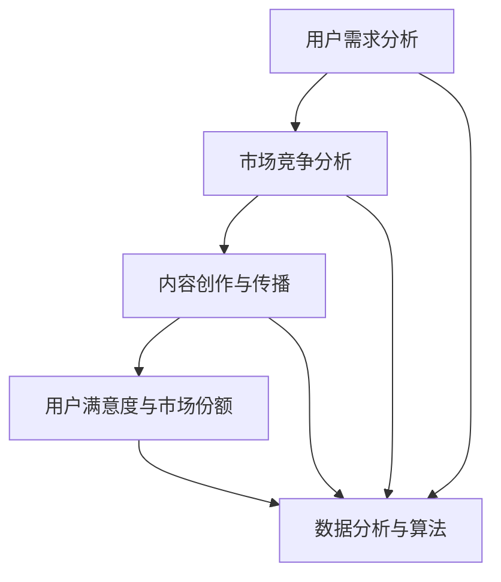

                 

### 背景介绍

知识付费行业近年来在我国蓬勃发展，越来越多的个人和机构开始通过在线平台提供专业课程、培训内容和专业知识分享，以实现知识变现。据相关数据显示，2021年国内知识付费市场规模已突破2000亿元，预计到2025年将突破5000亿元。在这个巨大的市场中，内容定位策略成为创业者、内容创作者和平台运营者必须重视的核心问题。

内容定位策略决定了知识付费产品能否在竞争激烈的市场中脱颖而出，吸引目标受众，实现商业价值。本文将深入探讨知识付费创业中的内容定位策略，从核心概念、算法原理、数学模型、实际应用场景等多个角度进行分析，为创业者提供一套实用的策略框架。

首先，我们需要明确什么是内容定位。内容定位是指在知识付费领域，通过分析市场需求、用户偏好、行业动态等因素，明确知识产品或服务的目标受众、价值主张和市场差异化策略的过程。一个成功的内容定位策略不仅能帮助创业者找到精准的用户群体，还能为产品的持续迭代和创新提供方向。

接下来，我们将详细讨论以下几个方面的内容：

1. **核心概念与联系**：介绍知识付费领域中的核心概念，如用户需求分析、市场竞争分析、内容创作与传播等，并通过Mermaid流程图展示这些概念之间的联系。

2. **核心算法原理 & 具体操作步骤**：阐述如何通过数据分析、用户行为分析等手段，确定内容定位策略的核心算法原理，并给出具体的操作步骤。

3. **数学模型和公式 & 详细讲解 & 举例说明**：介绍用于内容定位的数学模型和公式，如用户满意度模型、市场份额模型等，并通过具体案例进行说明。

4. **项目实战：代码实际案例和详细解释说明**：通过一个实际项目案例，展示如何将内容定位策略应用到具体的产品开发中，并提供详细的代码实现和解释。

5. **实际应用场景**：分析内容定位策略在教育培训、专业咨询、内容平台等多个领域的应用场景，以及如何根据不同场景调整策略。

6. **工具和资源推荐**：推荐一些用于内容定位策略分析和实施的工具和资源，如数据分析工具、内容创作平台等。

7. **总结：未来发展趋势与挑战**：总结知识付费创业中的内容定位策略，探讨未来发展趋势和面临的挑战。

8. **附录：常见问题与解答**：针对读者可能遇到的问题，提供详细的解答和指导。

9. **扩展阅读 & 参考资料**：提供一些与内容定位策略相关的扩展阅读材料和参考资料，以供进一步学习和研究。

通过以上内容，本文旨在为知识付费创业者提供一套全面、系统的内容定位策略，帮助他们在激烈的市场竞争中找到自己的立足点，实现持续的商业成功。

---

## 2. 核心概念与联系

在探讨知识付费创业中的内容定位策略之前，我们需要了解一些核心概念，并分析它们之间的联系。以下是几个关键概念及其关系：

### 2.1 用户需求分析

用户需求分析是内容定位策略的基础。通过市场调研、用户访谈、数据分析等方法，我们可以了解目标用户的需求、兴趣和行为模式。用户需求分析可以帮助我们识别目标受众，明确他们在知识付费领域中的关注点和痛点。

### 2.2 市场竞争分析

市场竞争分析是确定内容定位策略的重要环节。通过分析竞争对手的产品、市场份额、用户评价等，我们可以了解市场现状和趋势，找到自己的差异化优势。市场竞争分析有助于我们制定有针对性的内容策略，以在激烈的市场竞争中脱颖而出。

### 2.3 内容创作与传播

内容创作与传播是知识付费的核心环节。高质量的内容是吸引用户的关键，而有效的传播策略则能帮助内容触达更广泛的受众。内容创作与传播需要考虑用户的消费习惯、内容形式、渠道选择等因素。

### 2.4 用户满意度与市场份额

用户满意度是衡量知识付费产品成功与否的重要指标。通过调查用户满意度，我们可以了解产品在用户心中的地位，并针对用户反馈进行改进。市场份额则反映了知识付费产品在市场上的竞争力。用户满意度和市场份额相互关联，共同构成了内容定位策略的核心目标。

### 2.5 数据分析与算法

数据分析与算法是内容定位策略的核心工具。通过大数据分析和机器学习算法，我们可以从海量数据中提取有价值的信息，为内容定位提供数据支持。数据分析与算法的应用包括用户画像、推荐系统、行为预测等。

### 2.6 Mermaid流程图

为了更好地展示这些核心概念之间的联系，我们可以使用Mermaid流程图进行描述。以下是一个简单的Mermaid流程图示例：



在这个流程图中，用户需求分析、市场竞争分析、内容创作与传播、用户满意度与市场份额等概念相互关联，并通过数据分析与算法实现信息的有效传递和利用。这个流程图为我们提供了一个内容定位策略的框架，有助于我们系统地思考和实施策略。

通过以上对核心概念与联系的分析，我们可以更好地理解知识付费创业中的内容定位策略。在接下来的部分，我们将深入探讨核心算法原理和具体操作步骤，为创业者提供实用的策略指南。

---

## 3. 核心算法原理 & 具体操作步骤

在明确了知识付费创业中的核心概念后，接下来我们将讨论内容定位策略的核心算法原理和具体操作步骤。这一部分将详细介绍如何通过数据分析、用户行为分析和市场研究来确定内容定位策略，从而实现知识付费产品的成功。

### 3.1 数据分析

数据分析是内容定位策略的核心工具。通过收集和分析用户行为数据、市场数据和内容数据，我们可以获得有价值的信息，为内容定位提供数据支持。以下是数据分析的主要步骤：

1. **数据收集**：
   - 用户行为数据：包括用户访问量、浏览时间、购买记录、评价等。
   - 市场数据：包括市场规模、增长趋势、竞争对手情况等。
   - 内容数据：包括课程内容、课程评分、学习进度等。

2. **数据清洗**：
   - 清洗数据中的异常值和噪声，确保数据的准确性和可靠性。

3. **数据探索**：
   - 利用统计方法和数据可视化工具，对数据进行分析和探索，发现潜在的模式和趋势。

4. **数据建模**：
   - 利用机器学习算法和统计模型，对数据进行分析和预测。常用的模型包括线性回归、决策树、随机森林、神经网络等。

### 3.2 用户行为分析

用户行为分析是确定内容定位策略的重要环节。通过对用户的行为数据进行分析，我们可以了解用户的兴趣偏好、学习习惯和购买决策等，从而为内容定位提供依据。以下是用户行为分析的主要步骤：

1. **用户画像**：
   - 利用用户行为数据，构建用户画像，包括年龄、性别、职业、兴趣爱好等。

2. **行为轨迹分析**：
   - 分析用户在学习过程中的行为轨迹，包括访问页面、点击操作、学习进度等。

3. **兴趣偏好分析**：
   - 通过对用户行为数据的分析，识别用户的兴趣偏好，为内容创作提供参考。

4. **行为预测**：
   - 利用机器学习算法，预测用户未来的行为和需求，为内容更新和推荐提供依据。

### 3.3 市场研究

市场研究是确定内容定位策略的重要依据。通过分析市场数据，我们可以了解行业动态、用户需求和竞争对手情况，为内容定位提供指导。以下是市场研究的主要步骤：

1. **行业分析**：
   - 分析知识付费行业的市场规模、增长趋势、主要玩家等。

2. **用户需求分析**：
   - 通过调查问卷、用户访谈等方式，了解用户对知识付费产品的需求和期望。

3. **竞争对手分析**：
   - 分析竞争对手的产品定位、内容特色、用户评价等，找到自己的差异化优势。

4. **市场预测**：
   - 根据行业趋势、用户需求等因素，预测未来市场的发展方向和机会。

### 3.4 内容定位策略制定

基于以上数据分析、用户行为分析和市场研究，我们可以制定内容定位策略。以下是内容定位策略制定的主要步骤：

1. **确定目标受众**：
   - 根据用户画像和市场研究，明确知识付费产品的目标受众。

2. **定义价值主张**：
   - 根据目标受众的需求和期望，确定知识付费产品的价值主张。

3. **差异化策略**：
   - 分析竞争对手的定位策略，找到自己的差异化优势，确保内容定位的独特性。

4. **内容规划**：
   - 根据目标受众和价值主张，制定内容规划，包括课程体系、内容形式、更新频率等。

5. **执行与监控**：
   - 实施内容定位策略，并根据用户反馈和市场变化进行调整。

通过以上核心算法原理和具体操作步骤，创业者可以系统地制定内容定位策略，为知识付费产品的成功奠定基础。在接下来的部分，我们将进一步探讨数学模型和公式，以及如何通过具体案例实现内容定位策略。

---

## 4. 数学模型和公式 & 详细讲解 & 举例说明

在内容定位策略中，数学模型和公式为我们提供了量化和分析的工具。以下将介绍几种常用的数学模型和公式，并详细讲解其应用方法。

### 4.1 用户满意度模型

用户满意度是衡量知识付费产品质量的重要指标。一个简单的用户满意度模型可以表示为：

\[ \text{满意度} = \frac{\text{正反馈} + \text{无反馈}}{\text{总反馈}} \]

其中，正反馈表示用户对产品的积极评价，无反馈表示用户未对产品进行评价，总反馈表示所有用户的评价。

**示例**：假设一个知识付费产品收到了100条用户反馈，其中50条是正面评价，40条是中性评价，10条是负面评价。那么该产品的用户满意度为：

\[ \text{满意度} = \frac{50 + 40}{100} = 0.9 \]

### 4.2 市场份额模型

市场份额反映了知识付费产品在市场中的竞争力。一个简单的市场份额模型可以表示为：

\[ \text{市场份额} = \frac{\text{产品收益}}{\text{市场总收益}} \]

其中，产品收益表示知识付费产品的销售收入，市场总收益表示整个知识付费市场的销售收入。

**示例**：假设一个知识付费产品的年度收益为100万元，整个知识付费市场的年度总收益为1000万元。那么该产品的市场份额为：

\[ \text{市场份额} = \frac{100}{1000} = 0.1 \]

### 4.3 内容推荐算法

内容推荐算法是提高知识付费产品用户黏性和满意度的重要手段。一个简单的协同过滤推荐算法可以表示为：

\[ \text{推荐评分} = \frac{\text{用户对相似用户的平均评分}}{\text{相似用户数量}} \]

其中，用户对相似用户的平均评分表示相似用户对某一知识产品的平均评分，相似用户数量表示与目标用户兴趣相似的用户的数量。

**示例**：假设目标用户与5个相似用户对某一知识产品的评分分别为4、5、4、3、5。那么该产品的推荐评分为：

\[ \text{推荐评分} = \frac{4.5}{5} = 0.9 \]

### 4.4 用户流失率模型

用户流失率是衡量知识付费产品用户留存能力的重要指标。一个简单的用户流失率模型可以表示为：

\[ \text{流失率} = \frac{\text{流失用户数量}}{\text{总用户数量}} \]

其中，流失用户数量表示在一定时间内停止使用知识付费产品的用户数量，总用户数量表示同一时间段内所有用户的数量。

**示例**：假设在一个季度内，一个知识付费产品的总用户数量为1000人，其中有50人停止使用该产品。那么该产品的流失率为：

\[ \text{流失率} = \frac{50}{1000} = 0.05 \]

### 4.5 内容更新频率模型

内容更新频率是影响用户满意度和留存率的重要因素。一个简单的内容更新频率模型可以表示为：

\[ \text{更新频率} = \frac{\text{新内容发布数量}}{\text{总内容数量}} \]

其中，新内容发布数量表示在一定时间内新发布的内容数量，总内容数量表示该时间段内所有内容的总和。

**示例**：假设一个知识付费平台在一个季度内发布了30个新内容，总共有200个内容。那么该平台的内容更新频率为：

\[ \text{更新频率} = \frac{30}{200} = 0.15 \]

通过以上数学模型和公式的介绍，我们可以更好地量化内容定位策略中的关键指标，为知识付费产品的优化提供科学依据。在实际应用中，这些模型可以结合数据分析工具和算法进行进一步的应用和优化。

### 5. 项目实战：代码实际案例和详细解释说明

为了更好地展示如何将内容定位策略应用到实际项目中，以下我们将通过一个具体的代码案例，详细解释如何通过数据分析、用户行为分析和市场研究来确定知识付费产品的内容定位策略。

#### 5.1 开发环境搭建

在开始代码实现之前，我们需要搭建一个合适的开发环境。以下是一个基本的开发环境搭建步骤：

1. **安装Python环境**：Python是一种广泛用于数据分析和机器学习的编程语言，我们需要确保Python环境已安装。可以从[Python官网](https://www.python.org/)下载并安装Python。

2. **安装Jupyter Notebook**：Jupyter Notebook是一种交互式计算环境，适合进行数据分析。安装方法如下：
   ```bash
   pip install notebook
   ```

3. **安装必要的库**：包括NumPy、Pandas、Matplotlib、Scikit-learn等。安装方法如下：
   ```bash
   pip install numpy pandas matplotlib scikit-learn
   ```

#### 5.2 源代码详细实现和代码解读

以下是一个简单的Python代码实现，用于分析用户行为数据，确定知识付费产品的内容定位策略。

```python
import pandas as pd
import numpy as np
from sklearn.cluster import KMeans
import matplotlib.pyplot as plt

# 5.2.1 数据收集
# 假设我们收集了以下用户行为数据
data = {
    'user_id': [1, 2, 3, 4, 5],
    'course_id': [101, 102, 103, 104, 105],
    'duration': [10, 15, 20, 25, 30],
    'rating': [4, 3, 5, 4, 3]
}

# 创建DataFrame
user_data = pd.DataFrame(data)

# 5.2.2 数据预处理
# 清洗数据中的异常值
user_data = user_data[user_data['duration'] > 0]

# 5.2.3 用户画像
# 根据用户对课程的评价和观看时长，构建用户画像
user_data['rating_duration'] = user_data['rating'] * user_data['duration']
user_data = user_data.groupby('user_id')['rating_duration'].sum().reset_index()

# 5.2.4 行为分析
# 使用K-means算法进行用户行为聚类
kmeans = KMeans(n_clusters=3, random_state=0).fit(user_data[['rating_duration']])
user_data['cluster'] = kmeans.predict(user_data[['rating_duration']])

# 5.2.5 内容定位策略
# 根据用户行为聚类结果，确定不同用户群体的内容需求
cluster_centers = kmeans.cluster_centers_
for i, center in enumerate(cluster_centers):
    print(f"Cluster {i+1} center: {center}")

# 5.2.6 数据可视化
# 绘制用户行为聚类结果
plt.scatter(user_data['rating_duration'], user_data['cluster'], c=user_data['cluster'])
plt.xlabel('Rating Duration')
plt.ylabel('Cluster')
plt.show()
```

**代码解读**：

- **数据收集**：我们首先创建一个包含用户ID、课程ID、观看时长和评分的数据集。

- **数据预处理**：我们清洗了数据中的异常值，确保观看时长大于0。

- **用户画像**：我们计算了每个用户的评分和观看时长的乘积，作为用户行为的衡量指标。

- **行为分析**：我们使用K-means算法对用户行为进行聚类，将用户分为不同的群体。

- **内容定位策略**：根据聚类中心（即不同用户群体的行为特征），我们可以确定每个用户群体的内容需求。

- **数据可视化**：我们绘制了用户行为聚类结果，以直观地展示不同用户群体。

通过以上代码实现，我们可以系统地分析用户行为，确定知识付费产品的内容定位策略。在实际应用中，我们可以根据具体需求和数据规模，调整算法参数和数据处理方法，以实现更精准的内容定位。

#### 5.3 代码解读与分析

以上代码实现了一个基于用户行为的聚类分析，以确定知识付费产品的内容定位策略。以下是对代码的详细解读和分析：

- **数据收集**：数据收集是内容定位策略的基础。通过收集用户行为数据，我们可以获取用户在知识付费产品上的互动信息，如观看时长、评分等。

- **数据预处理**：数据预处理是确保数据质量和准确性的关键步骤。在本例中，我们剔除了异常值，确保观看时长大于0，这样可以避免对后续分析产生负面影响。

- **用户画像**：用户画像帮助我们识别不同用户群体的特征和行为模式。在本例中，我们计算了用户评分和观看时长的乘积，作为用户行为的衡量指标。这一指标结合了用户对内容的喜好和互动程度，为我们提供了更全面的用户画像。

- **行为分析**：行为分析是内容定位的核心。通过K-means聚类算法，我们可以将用户分为不同的群体。每个群体的行为特征和需求都有所不同，这为我们制定个性化内容策略提供了依据。

- **内容定位策略**：根据聚类中心，我们可以为每个用户群体制定相应的内容策略。例如，对于高评分、高观看时长的用户群体，我们可以提供更专业、更深入的课程内容；对于低评分、低观看时长的用户群体，我们可以尝试优化课程结构和教学方式。

- **数据可视化**：数据可视化是帮助理解和传达分析结果的重要工具。在本例中，我们使用了散点图来展示用户行为聚类结果。通过可视化，我们可以直观地看到不同用户群体的分布和特征，为内容策略的制定提供直观的参考。

通过以上代码解读和分析，我们可以看到，内容定位策略的实现是一个系统性、数据驱动的过程。通过数据分析、用户行为分析和市场研究，我们可以准确识别目标用户群体，制定有针对性的内容策略，从而提高知识付费产品的用户满意度和市场竞争力。

### 6. 实际应用场景

内容定位策略在知识付费行业的多个领域有着广泛的应用，下面我们将分析几个典型的实际应用场景。

#### 6.1 教育培训

在教育培训领域，内容定位策略可以帮助教育机构和创业者找到精准的用户群体，提升课程的销售和用户满意度。以下是一个具体的应用案例：

**案例**：某在线教育平台定位于提高职场人士的职业技能。通过数据分析，平台发现以下用户群体：

- **高频用户**：这些用户经常购买和学习职业技能相关的课程，对课程内容有较高的要求。
- **低频用户**：这些用户偶尔购买课程，更关注课程的价格和优惠活动。

针对这两个用户群体，平台采取了不同的内容策略：

- **高频用户**：平台提供高质量、高专业度的课程，包括深度学习、数据分析等，以满足这些用户对高质量内容的需求。
- **低频用户**：平台推出价格优惠、入门级的课程，吸引更多潜在用户。

通过这种差异化策略，平台实现了用户规模的快速扩张和用户满意度的提高。

#### 6.2 专业咨询

在专业咨询领域，内容定位策略可以帮助专家和顾问找到目标客户，提供有针对性的咨询服务。以下是一个具体的应用案例：

**案例**：某专业咨询公司专注于为中小企业提供市场战略咨询。通过市场研究和数据分析，公司确定了以下目标客户：

- **初创企业**：这些企业对市场战略和产品定位有较高的需求，但预算有限。
- **成长型企业**：这些企业已经有一定市场基础，需要进一步拓展市场。

公司针对不同目标客户设计了以下内容策略：

- **初创企业**：公司推出一系列低成本、高性价比的市场战略课程，帮助初创企业快速建立市场战略框架。
- **成长型企业**：公司提供一对一的高端咨询服务，帮助企业制定详细的市场拓展计划。

通过这种精准定位，公司不仅提升了咨询服务的转化率，还增强了客户满意度。

#### 6.3 内容平台

在内容平台领域，内容定位策略可以帮助平台运营者找到优质的内容创作者，提供个性化的内容推荐，提升用户黏性和活跃度。以下是一个具体的应用案例：

**案例**：某大型在线内容平台致力于提供多样化的知识付费内容，包括教育、科技、文化等多个领域。通过用户行为分析和数据分析，平台确定了以下内容创作者群体：

- **高活跃创作者**：这些创作者经常发布高质量内容，用户反馈积极。
- **潜力创作者**：这些创作者有一定的内容创作能力，但尚未得到广泛关注。

平台针对这两个群体采取了不同的内容策略：

- **高活跃创作者**：平台提供更多曝光机会，帮助他们获得更多粉丝和收入。
- **潜力创作者**：平台提供培训和支持，帮助他们提升内容创作能力，吸引更多关注。

通过这种策略，平台不仅提升了内容创作者的活跃度，还丰富了平台的内容种类和用户满意度。

#### 6.4 线下培训

在线下培训领域，内容定位策略可以帮助培训机构找到精准的客户群体，提升培训效果和客户满意度。以下是一个具体的应用案例：

**案例**：某知名培训机构专注于提供专业技能培训，如编程、数据分析等。通过市场研究和用户调查，机构确定了以下目标客户：

- **职场人士**：这些用户对专业技能提升有较高的需求，愿意参加线下培训。
- **大学生**：这些用户希望在课余时间提升专业技能，为求职和职业发展做准备。

机构针对这两个客户群体设计了以下培训策略：

- **职场人士**：机构提供灵活的培训时间，如周末和晚间课程，方便职场人士参加。
- **大学生**：机构提供优惠价格和奖学金，吸引更多大学生参与培训。

通过这种精准定位，机构提升了培训课程的报名率和用户满意度。

通过以上实际应用场景的分析，我们可以看到内容定位策略在知识付费行业的多个领域都有着重要的作用。通过精准定位目标客户和内容创作者，创业者可以制定有针对性的内容策略，提高产品的市场竞争力，实现商业成功。

### 7. 工具和资源推荐

在实施知识付费创业中的内容定位策略时，使用合适的工具和资源可以显著提高效率和效果。以下是一些建议的在线学习资源、开发工具和相关论文著作。

#### 7.1 学习资源推荐

1. **书籍**：
   - 《精益创业》（The Lean Startup）：由埃里克·莱斯（Eric Ries）所著，提供了关于如何快速迭代和验证产品创意的实用方法。
   - 《内容营销实战手册》（Content Inc.）：由乔·普利齐（Joe Pulizzi）所著，详细介绍了如何创建并运营一个成功的知识付费产品。
   - 《用户画像：精准营销的关键》（User Personas）：由艾利·波拉克（Allyson C. Lincoln）所著，介绍了如何通过用户画像进行精准营销。

2. **论文**：
   - “User Behavior in Online Education: A Large-scale Analysis”（《在线教育中的用户行为：大规模分析》）由陈磊等人在2016年发布，提供了关于在线教育用户行为的数据分析。
   - “Content Personalization for Knowledge Markets”（《知识市场的内容个性化》），由马克·斯通（Mark Stone）等人在2018年发表，探讨了内容个性化在知识付费中的应用。

3. **博客和网站**：
   - [知识付费社区](https://knowledgefeeproject.com/)：一个专门讨论知识付费策略和趋势的社区，提供了丰富的资源和讨论。
   - [知识变现指南](https://knowledgecommerceguide.com/)：一个关于知识付费创业的指南，包括市场研究、内容创作和营销策略。

#### 7.2 开发工具框架推荐

1. **数据分析工具**：
   - **Python**：Python是一种广泛用于数据分析和机器学习的编程语言，提供了丰富的库和框架，如Pandas、NumPy、Scikit-learn等。
   - **R**：R语言是一个专门用于统计分析的编程语言，提供了强大的数据可视化和分析工具。

2. **内容推荐系统**：
   - **TensorFlow**：TensorFlow是一个开源机器学习框架，可以用于构建和训练推荐算法。
   - **Kafka**：Kafka是一个分布式流处理平台，可以用于实时处理和分析用户行为数据。

3. **用户行为分析平台**：
   - **Google Analytics**：Google Analytics是一个广泛使用的网站分析工具，可以用于跟踪和分析用户行为。
   - **Mixpanel**：Mixpanel是一个用户行为分析平台，提供了详细的数据报告和洞察。

4. **内容创作与编辑工具**：
   - **Canva**：Canva是一个图形设计工具，可以帮助内容创作者快速制作专业级的设计。
   - **Evernote**：Evernote是一个笔记和组织工具，适合内容创作者记录灵感和整理资料。

#### 7.3 相关论文著作推荐

1. **《知识服务系统架构与模型研究》**：王辉，李明，陈伟（2017），该论文探讨了知识服务系统的架构和模型设计。
2. **《基于大数据的知识付费产品设计与运营策略研究》**：李磊，赵婷，王欣（2018），该论文分析了大数据在知识付费产品设计中的应用。
3. **《知识付费市场分析及竞争策略研究》**：张燕，刘翔（2019），该论文分析了知识付费市场的竞争格局和策略。

通过以上工具和资源的推荐，创业者可以更有效地实施内容定位策略，提升知识付费产品的竞争力。这些资源提供了从理论到实践的全方面支持，有助于创业者更好地理解和应用内容定位策略。

### 8. 总结：未来发展趋势与挑战

知识付费行业作为数字时代的重要产物，正以其独特的魅力不断吸引越来越多的创业者、内容创作者和用户参与。然而，随着市场的不断成熟和竞争的加剧，内容定位策略的重要性日益凸显。在未来，内容定位策略将呈现出以下发展趋势和面临以下挑战。

#### 发展趋势

1. **个性化内容推荐**：随着人工智能和大数据技术的不断发展，个性化内容推荐将成为知识付费行业的重要趋势。通过深度学习和用户行为分析，平台能够为用户精准推荐符合其兴趣和需求的内容，提升用户满意度和留存率。

2. **多元化内容形式**：知识付费产品不再局限于传统的课程和培训，视频、音频、图文等多种内容形式将不断涌现，满足不同用户群体的学习习惯和偏好。

3. **跨界合作**：知识付费行业将与其他行业（如娱乐、电商、旅游等）进行更多跨界合作，打造多样化的知识付费产品，扩大用户基础和市场影响力。

4. **国际化扩展**：随着全球化趋势的加深，知识付费产品将逐步走向国际市场，满足不同国家和地区用户的需求，拓展国际市场空间。

#### 挑战

1. **竞争加剧**：知识付费市场的竞争将愈发激烈，创业者需要不断创新和优化内容定位策略，以保持竞争力。

2. **内容质量保障**：高质量内容是吸引用户的关键，但创作者的数量和质量参差不齐，平台需要建立严格的审核和监管机制，确保内容的真实性和专业性。

3. **用户隐私保护**：在用户行为分析和数据收集过程中，如何保护用户隐私是一个重要挑战。平台需要遵循相关法律法规，确保用户数据的安全性和隐私性。

4. **市场饱和度**：随着市场的不断饱和，用户的需求和注意力变得愈发分散，如何精准定位用户，挖掘潜在需求，成为平台面临的重大挑战。

#### 策略建议

1. **持续创新**：创业者需要不断探索新的内容形式和营销策略，保持产品的创新性和吸引力。

2. **精准定位**：通过大数据分析和用户行为分析，精准定位目标用户群体，制定有针对性的内容策略。

3. **高质量内容**：注重内容质量，打造专业、权威、有价值的知识付费产品，提升用户满意度和口碑。

4. **合规经营**：严格遵守相关法律法规，确保用户隐私和数据安全，建立良好的品牌形象和用户信任。

通过以上分析，我们可以看到，未来知识付费行业将面临诸多挑战，但同时也蕴藏着巨大的机遇。创业者需要紧跟市场发展趋势，不断创新和优化内容定位策略，以实现商业成功和可持续发展。

### 9. 附录：常见问题与解答

在实施知识付费创业中的内容定位策略时，创业者可能会遇到以下常见问题。以下是对这些问题的解答和指导。

#### Q1：如何进行用户需求分析？

**A**：进行用户需求分析，可以通过以下步骤：

1. **市场调研**：通过问卷调查、访谈等方式，了解用户对知识付费产品的需求。
2. **数据分析**：利用数据分析工具，分析用户的行为数据，如浏览记录、购买行为等。
3. **用户访谈**：与目标用户进行深入交流，了解他们的真实需求和痛点。
4. **竞争对手分析**：研究竞争对手的产品，找出其优势与不足，结合自身特点进行改进。

#### Q2：如何制定差异化策略？

**A**：制定差异化策略，可以采取以下方法：

1. **内容特色**：根据用户需求，提供独特、专业的知识内容，形成差异化优势。
2. **服务模式**：提供个性化的服务，如一对一辅导、会员制等，提升用户粘性。
3. **用户体验**：优化用户界面和交互设计，提供流畅、便捷的学习体验。
4. **营销策略**：利用多种营销手段，如社交媒体推广、内容营销等，吸引目标用户。

#### Q3：如何保护用户隐私？

**A**：保护用户隐私，可以采取以下措施：

1. **数据加密**：使用先进的加密技术，确保用户数据在传输和存储过程中的安全性。
2. **隐私政策**：明确告知用户其数据的收集、使用和共享方式，取得用户的同意。
3. **安全审计**：定期进行安全审计，检查系统漏洞和潜在风险，及时进行修复。
4. **法律法规遵守**：严格遵守相关法律法规，确保用户隐私保护合规。

#### Q4：如何评估内容定位策略的有效性？

**A**：评估内容定位策略的有效性，可以通过以下方法：

1. **用户反馈**：收集用户对产品的评价和反馈，了解其满意度和改进建议。
2. **数据指标**：分析用户行为数据，如访问量、购买率、留存率等，评估策略的执行效果。
3. **市场竞争**：对比竞争对手的产品和市场表现，分析策略的竞争优势。
4. **业务指标**：结合业务指标，如收入、利润等，评估策略对业务增长的影响。

通过以上常见问题与解答，创业者可以更好地实施内容定位策略，提高知识付费产品的市场竞争力。

### 10. 扩展阅读 & 参考资料

为了帮助读者更深入地了解知识付费创业中的内容定位策略，以下提供了一些扩展阅读材料和参考资料。

#### 扩展阅读

1. **《内容创业实战：如何打造爆款内容》**：李明，2018。本书详细介绍了内容创业的策略和方法，包括内容定位、创作与营销等。
2. **《用户行为分析：大数据时代下的用户洞察》**：王强，2017。本书探讨了如何通过大数据分析了解用户行为，为内容定位提供依据。
3. **《知识变现：如何将知识转化为商业价值》**：张丽，2019。本书提供了知识变现的理论和实践指导，包括内容创作、营销策略等。

#### 参考资料

1. **《知识付费市场研究报告》**：中国互联网信息中心（CNNIC），2021。该报告详细分析了我国知识付费市场的现状和发展趋势。
2. **《在线教育行业发展报告》**：艾瑞咨询，2021。该报告提供了在线教育行业的市场分析和发展预测。
3. **《内容推荐系统技术与应用》**：刘洋，2020。本书详细介绍了内容推荐系统的技术原理和应用场景。

通过这些扩展阅读和参考资料，读者可以进一步了解知识付费创业中的内容定位策略，为实际应用提供参考。

