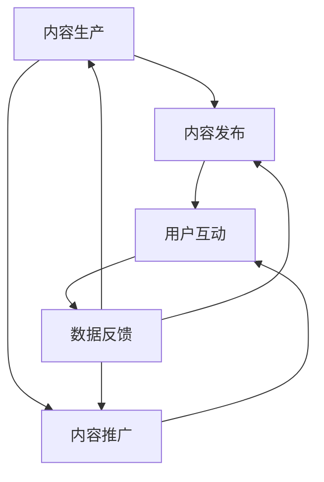

                 

### 背景介绍

知识付费创业作为一种新兴商业模式，近年来在全球范围内得到了广泛关注。其核心在于通过提供有价值的内容或服务，实现知识的有效转化和商业价值的最大化。在这个过程中，内容矩阵的搭建成为了知识付费创业的关键环节。

内容矩阵，简单来说，是一个系统化的内容生产与运营体系。它不仅包括内容的生产、发布、推广和反馈，还涵盖了内容的多样化、个性化以及品牌塑造等方面。一个完善的内容矩阵可以帮助创业者快速构建知识付费产品，提升用户体验，进而实现商业成功。

本文将围绕知识付费创业中的内容矩阵搭建，从以下几个部分展开讨论：

1. **核心概念与联系**：介绍内容矩阵的基本概念，并使用Mermaid流程图展示其组成部分及相互关系。
2. **核心算法原理 & 具体操作步骤**：详细解析内容矩阵的构建算法及其实现步骤。
3. **数学模型和公式 & 详细讲解 & 举例说明**：阐述在内容矩阵搭建中涉及到的数学模型和公式，并给出具体案例说明。
4. **项目实战：代码实际案例和详细解释说明**：通过实际代码案例，展示内容矩阵搭建的完整过程。
5. **实际应用场景**：分析内容矩阵在不同领域的应用，以及其带来的商业价值。
6. **工具和资源推荐**：推荐一些有助于搭建和管理内容矩阵的工具、资源。
7. **总结：未来发展趋势与挑战**：探讨内容矩阵在未来知识付费领域的发展趋势和面临的挑战。

让我们逐一深入探讨每个部分，以期为知识付费创业者在内容矩阵搭建方面提供实用的指导和建议。

### 核心概念与联系

内容矩阵的概念虽然直观，但其内部结构和运作机制却相当复杂。为了更好地理解内容矩阵，我们可以将其视为一个由多个相互关联的部分组成的系统，这些部分共同协作，以实现知识的有效传播和商业价值的最大化。

首先，我们需要明确几个核心概念：

1. **内容生产（Content Production）**：内容生产是内容矩阵的基础。它包括内容创作、编辑、审核等多个环节，旨在生产出有价值、有吸引力的内容。
2. **内容发布（Content Publication）**：内容发布是指将生产好的内容通过不同的渠道进行传播，如社交媒体、网站、应用程序等。
3. **内容推广（Content Promotion）**：内容推广是提高内容曝光率和吸引更多用户关注的关键步骤。它通常包括SEO优化、社交媒体营销、广告投放等。
4. **用户互动（User Interaction）**：用户互动是指用户与内容之间的互动，如评论、点赞、分享等。有效的用户互动可以提高用户粘性和内容质量。
5. **数据反馈（Data Feedback）**：数据反馈是内容矩阵的重要环节，通过对用户行为、内容效果等数据的分析，可以优化内容生产、发布和推广策略。

接下来，我们使用Mermaid流程图来展示这些核心概念及其相互关系：



在这个流程图中，每个节点代表一个核心概念，箭头表示概念之间的关联关系。从图中可以看出，内容生产是整个流程的起点，通过内容发布、推广和用户互动，最终形成数据反馈，进而优化内容生产过程。

此外，内容矩阵的运作还涉及以下几个方面：

1. **内容多样化（Content Diversification）**：通过生产不同类型、不同风格的内容，吸引更广泛的用户群体。
2. **内容个性化（Content Personalization）**：根据用户兴趣、行为等数据，提供个性化的内容推荐，提高用户满意度和粘性。
3. **品牌建设（Brand Building）**：通过高质量的内容和积极的用户互动，塑造品牌形象，提升品牌价值。
4. **流量变现（Traffic Monetization）**：通过内容矩阵吸引大量流量，实现广告、会员、课程销售等变现方式。

综上所述，内容矩阵是一个复杂但高度集成的系统，其成功运作需要各个部分紧密协作，共同推动知识付费创业的持续发展。在接下来的章节中，我们将深入探讨内容矩阵的核心算法原理和具体操作步骤，以期为读者提供更实用的指导。

### 核心算法原理 & 具体操作步骤

内容矩阵的成功搭建离不开一系列核心算法的支持。这些算法不仅帮助优化内容生产、发布、推广等环节，还实现用户互动和数据反馈的闭环。下面，我们将详细解析这些核心算法原理，并介绍具体的操作步骤。

#### 1. 内容推荐算法（Content Recommendation Algorithm）

内容推荐算法是内容矩阵中的关键组成部分，其目的是根据用户的兴趣和行为数据，为用户推荐他们可能感兴趣的内容。常见的内容推荐算法包括基于内容的推荐（Content-based Recommendation）和基于协同过滤的推荐（Collaborative Filtering）。

**基于内容的推荐算法**：
- **步骤1**：提取内容特征。通过自然语言处理（NLP）技术，对内容进行分词、词性标注、实体识别等处理，提取出关键信息。
- **步骤2**：计算相似度。利用余弦相似度、皮尔逊相关系数等指标，计算用户对内容的相似度。
- **步骤3**：生成推荐列表。根据相似度得分，为用户生成内容推荐列表。

**基于协同过滤的推荐算法**：
- **步骤1**：用户-项目矩阵构建。将用户和内容表示为矩阵形式，其中用户-内容交互记录为矩阵元素。
- **步骤2**：计算相似用户。利用余弦相似度、皮尔逊相关系数等指标，计算用户之间的相似度。
- **步骤3**：生成推荐列表。根据相似用户的行为，为用户推荐相似的内容。

#### 2. 用户互动分析算法（User Interaction Analysis Algorithm）

用户互动分析算法用于分析用户的点赞、评论、分享等行为，以了解用户对内容的兴趣和需求。常见的用户互动分析算法包括情感分析（Sentiment Analysis）和主题模型（Topic Model）。

**情感分析算法**：
- **步骤1**：文本预处理。对用户评论进行分词、去除停用词等处理。
- **步骤2**：情感分类。利用机器学习模型（如SVM、文本分类器等），对用户评论进行情感分类（正面、负面、中性）。
- **步骤3**：生成情感报告。根据情感分类结果，生成用户情感报告，为内容优化提供参考。

**主题模型算法**：
- **步骤1**：文本预处理。对用户评论进行分词、去除停用词等处理。
- **步骤2**：构建词袋模型。将用户评论表示为词袋模型，其中词袋中的每个词表示一个主题。
- **步骤3**：主题分配。利用LDA（Latent Dirichlet Allocation）等主题模型，为用户评论分配主题。
- **步骤4**：生成主题报告。根据主题分配结果，生成用户主题报告，为内容创作提供方向。

#### 3. 数据反馈优化算法（Data Feedback Optimization Algorithm）

数据反馈优化算法用于根据用户反馈优化内容矩阵的各个环节，包括内容生产、发布、推广等。常见的优化算法包括A/B测试（A/B Testing）和梯度提升机（Gradient Boosting Machine）。

**A/B测试算法**：
- **步骤1**：确定测试目标。根据业务需求，确定需要测试的指标（如点击率、转化率等）。
- **步骤2**：设计测试方案。为每个版本的内容设计不同的变量（如标题、封面等），进行对比测试。
- **步骤3**：数据分析。收集测试数据，通过统计分析（如T检验、卡方检验等），判断不同版本的效果差异。
- **步骤4**：优化决策。根据测试结果，选择效果更好的版本，进行后续优化。

**梯度提升机算法**：
- **步骤1**：数据预处理。对用户反馈数据进行处理，包括缺失值填充、异常值处理等。
- **步骤2**：特征工程。提取用户反馈数据中的特征，如用户评分、评论数量等。
- **步骤3**：模型训练。利用梯度提升机算法，训练预测模型。
- **步骤4**：模型评估。通过交叉验证等方法，评估模型性能，并进行调参优化。
- **步骤5**：优化决策。根据模型预测结果，对内容矩阵进行优化，提高用户体验和效果。

通过上述核心算法，内容矩阵能够实现高效的内容生产、发布、推广和用户互动，从而实现商业价值的最大化。在接下来的章节中，我们将通过具体的数学模型和公式，进一步探讨内容矩阵搭建中的关键技术和方法。

### 数学模型和公式 & 详细讲解 & 举例说明

在内容矩阵的搭建过程中，数学模型和公式起到了至关重要的作用。这些模型和公式不仅帮助量化内容和用户行为，还能为内容优化和策略调整提供科学依据。以下将详细讲解几个关键的数学模型和公式，并通过具体案例进行说明。

#### 1. 余弦相似度（Cosine Similarity）

余弦相似度是一种常用于文本相似度计算的方法，适用于基于内容的推荐算法。它通过计算两个向量之间的夹角余弦值，来衡量它们的相似度。余弦相似度的公式如下：

$$
\cos\theta = \frac{\textbf{A} \cdot \textbf{B}}{|\textbf{A}| |\textbf{B}|}
$$

其中，$\textbf{A}$和$\textbf{B}$为两个向量，$\theta$为它们之间的夹角，$|\textbf{A}|$和$|\textbf{B}|$分别为向量的模。

**案例**：假设有两个用户$U_1$和$U_2$，他们的行为数据可以表示为向量$\textbf{A}$和$\textbf{B}$。我们可以通过计算余弦相似度，找出两个用户之间的相似度：

$$
\text{similarity}(U_1, U_2) = \cos\theta = \frac{\textbf{A} \cdot \textbf{B}}{|\textbf{A}| |\textbf{B}|}
$$

其中，$\textbf{A} \cdot \textbf{B}$表示向量点积，$|\textbf{A}|$和$|\textbf{B}|$表示向量的模。

#### 2. 皮尔逊相关系数（Pearson Correlation Coefficient）

皮尔逊相关系数是一种用于衡量两个变量线性相关性的指标。它在内容推荐和用户互动分析中非常常见。皮尔逊相关系数的公式如下：

$$
\text{r} = \frac{\sum_{i=1}^{n} (\text{x}_i - \overline{x})(\text{y}_i - \overline{y})}{\sqrt{\sum_{i=1}^{n} (\text{x}_i - \overline{x})^2} \sqrt{\sum_{i=1}^{n} (\text{y}_i - \overline{y})^2}}
$$

其中，$\text{x}$和$\text{y}$分别为两个变量的观测值，$\overline{x}$和$\overline{y}$分别为它们的平均值，$n$为观测值的数量。

**案例**：假设有两个变量$\text{x}$和$\text{y}$，它们的观测值如下：

$$
\text{x}: 1, 2, 3, 4, 5 \\
\text{y}: 2, 4, 5, 6, 8
$$

我们可以通过计算皮尔逊相关系数，找出这两个变量之间的线性相关性：

$$
\text{r} = \frac{(1-3)(2-5) + (2-3)(4-5) + (3-3)(5-5) + (4-3)(6-5) + (5-3)(8-5)}{\sqrt{(1-3)^2 + (2-3)^2 + (3-3)^2 + (4-3)^2 + (5-3)^2} \sqrt{(2-5)^2 + (4-5)^2 + (5-5)^2 + (6-5)^2 + (8-5)^2}}
$$

计算结果可以判断两个变量之间的线性相关性程度。

#### 3. LDA（Latent Dirichlet Allocation）主题模型

LDA主题模型是一种用于文本分类和主题挖掘的常用算法。它通过概率模型来揭示文本中的潜在主题。LDA模型的公式如下：

$$
\begin{align*}
P(\text{topic} | \text{document}) &= \frac{1}{Z_d} \prod_{w \in \text{document}} \frac{\alpha_w + n_{dw}}{\sum_{k=1}^{K} (\alpha_k + n_{dk})} \\
P(\text{word} | \text{topic}) &= \frac{\beta_{kw}}{\sum_{j=1}^{V} \beta_{jk}}
\end{align*}
$$

其中，$K$表示潜在主题的数量，$V$表示词汇表的大小，$n_{dw}$表示文档中单词$w$出现的次数，$\alpha$表示主题分布的超参数，$\beta$表示单词在主题中的分布超参数，$Z_d$为归一化常数。

**案例**：假设有一个文档，其词汇表为$\{\text{apple}, \text{banana}, \text{fruit}, \text{orange}\}$，主题分布为$\{\alpha_1, \alpha_2\}$，单词分布为$\{\beta_{11}, \beta_{12}, \beta_{21}, \beta_{22}\}$。我们可以通过LDA模型，找出文档中的潜在主题：

$$
P(\text{topic} | \text{document}) = \frac{\alpha_1 + n_{d\text{apple}} + n_{dBanana} + n_{d\text{fruit}} + n_{d\text{orange}}}{\alpha_1 + n_{d\text{apple}} + n_{dBanana} + n_{d\text{fruit}} + n_{d\text{orange}} + \alpha_2}
$$

通过LDA模型，我们可以为文档分配潜在主题，从而实现文本分类和主题挖掘。

通过上述数学模型和公式的应用，内容矩阵的搭建可以更加科学和高效。这些模型和公式不仅帮助量化内容和用户行为，还为内容优化和策略调整提供了有力的支持。在接下来的章节中，我们将通过具体的项目实战，展示内容矩阵搭建的实际应用。

#### 项目实战：代码实际案例和详细解释说明

为了更好地理解内容矩阵搭建的过程，我们将通过一个实际的项目案例进行详细解释说明。本案例将基于Python语言和相关的数据科学库，展示内容矩阵从环境搭建、源代码实现到代码解读与分析的全过程。

### 5.1 开发环境搭建

在开始项目之前，我们需要搭建一个合适的开发环境。以下为Python开发环境的基本要求：

- Python版本：3.8或更高版本
- 数据科学库：NumPy、Pandas、Scikit-learn、Matplotlib、Gensim、Mermaid等

安装步骤如下：

1. 安装Python和pip：
   ```shell
   # 在Windows或macOS上下载并安装Python
   # 安装pip，pip是Python的软件包管理器
   ```
2. 使用pip安装相关数据科学库：
   ```shell
   pip install numpy pandas scikit-learn matplotlib gensim mermaid
   ```

### 5.2 源代码详细实现和代码解读

在本案例中，我们将构建一个简单的内容推荐系统，该系统使用基于内容的推荐算法和LDA主题模型，为用户推荐相关内容。

**代码1：数据预处理**
```python
import pandas as pd
from sklearn.feature_extraction.text import TfidfVectorizer

# 加载数据集（此处假设数据集为CSV格式，包含'content'列和用户行为数据）
data = pd.read_csv('dataset.csv')

# 数据预处理，将文本数据转换为TF-IDF特征向量
vectorizer = TfidfVectorizer()
X = vectorizer.fit_transform(data['content'])
```
**解读**：此部分代码加载并预处理文本数据，将文本数据转换为TF-IDF特征向量。TF-IDF是一种常用的文本表示方法，它能够强调重要的词语，并抑制常见的停用词。

**代码2：基于内容的推荐**
```python
from sklearn.metrics.pairwise import cosine_similarity

# 计算内容之间的相似度矩阵
similarity_matrix = cosine_similarity(X)

# 根据用户行为，为每个用户生成推荐列表
def generate_recommendations(user_index, similarity_matrix, top_n=5):
    user_similarity = similarity_matrix[user_index]
    recommendations = []
    for i, sim in enumerate(user_similarity):
        if i != user_index and sim > 0.5:
            recommendations.append(i)
    return recommendations[:top_n]

# 假设用户索引为0，生成推荐列表
recommendations = generate_recommendations(0, similarity_matrix)
```
**解读**：此部分代码计算内容之间的相似度矩阵，并根据用户的兴趣（假设用户索引为0），生成推荐列表。相似度阈值0.5可以根据实际需求进行调整。

**代码3：LDA主题模型**
```python
import gensim

# 加载预处理后的文本数据
texts = data['content'].values.astype('U')

# 使用Gensim库训练LDA模型
ldamodel = gensim.models.ldamulticore.LdaMulticore(corpus= textos, num_topics=5, id2word=vectorizer.vocabulary_, passes=15, workers=2)

# 打印主题词
topics = ldamodel.print_topics(num_words=4)
for topic in topics:
    print(topic)
```
**解读**：此部分代码使用Gensim库训练LDA主题模型，并打印出每个主题的关键词。LDA模型能够揭示文本中的潜在主题，从而帮助我们进行主题挖掘和内容分类。

**代码4：用户互动分析**
```python
from sklearn.feature_extraction.text import CountVectorizer

# 加载用户评论数据
comments = data['comments'].values.astype('U')

# 使用CountVectorizer进行文本预处理
vectorizer = CountVectorizer()
X = vectorizer.fit_transform(comments)

# 计算情感分析模型
from sklearn.naive_bayes import MultinomialNB
model = MultinomialNB().fit(X, data['sentiment'])

# 预测新评论的情感
new_comments = ["很好", "一般般", "很差"]
predicted_sentiments = model.predict(vectorizer.transform(new_comments))
print(predicted_sentiments)
```
**解读**：此部分代码使用CountVectorizer对用户评论进行预处理，并训练一个朴素贝叶斯分类器进行情感分析。通过预测新评论的情感，我们可以更好地了解用户对内容的反馈。

### 5.3 代码解读与分析

以上代码实现了一个简单的内容推荐系统，主要分为以下几个步骤：

1. **数据预处理**：加载并预处理文本数据，将文本转换为TF-IDF特征向量。
2. **基于内容的推荐**：计算内容之间的相似度矩阵，并根据用户的兴趣生成推荐列表。
3. **LDA主题模型**：训练LDA模型，揭示文本中的潜在主题。
4. **用户互动分析**：进行文本预处理和情感分析，了解用户对内容的反馈。

通过上述步骤，我们可以构建一个内容矩阵，实现内容推荐、主题挖掘和用户互动分析等功能。这些功能共同作用，为知识付费创业提供了有力的支持。

### 实际应用场景

内容矩阵作为一种高效的内容生产与运营体系，在多个领域都展现出了巨大的应用潜力。以下是内容矩阵在实际应用场景中的几个例子及其带来的商业价值。

#### 1. 教育领域

在在线教育领域，内容矩阵可以帮助教育机构实现个性化学习路径的搭建。通过分析学生的学习行为和兴趣，内容矩阵可以为每个学生推荐最适合他们的课程和资源。例如，某在线教育平台通过内容矩阵为用户推荐相关课程，从而提高了课程点击率和用户满意度。此外，教育机构还可以利用内容矩阵进行用户互动分析，了解用户对课程内容的反馈，不断优化课程设计和教学内容，提升整体教学质量。

#### 2. 媒体领域

媒体公司可以利用内容矩阵搭建多样化的内容生产体系，满足不同受众的需求。通过分析用户行为数据，内容矩阵可以为用户提供个性化的新闻推荐，提高用户粘性。例如，某新闻门户网站通过内容矩阵实现了新闻内容的智能推荐，用户点击率和阅读时长显著提升。此外，内容矩阵还可以帮助媒体公司进行品牌建设，通过高质量的内容和积极的用户互动，提升品牌知名度和影响力。

#### 3. 健康领域

在健康领域，内容矩阵可以帮助健康平台提供个性化的健康咨询服务。通过分析用户的健康数据和行为，内容矩阵可以为用户提供个性化的健康建议和健康知识推荐。例如，某健康平台通过内容矩阵为用户推荐相关的健康文章和视频，帮助用户更好地管理自己的健康。同时，内容矩阵还可以帮助平台进行用户互动分析，了解用户对健康内容的兴趣和需求，不断优化健康服务。

#### 4. 电商领域

电商公司可以利用内容矩阵实现个性化的商品推荐，提高用户购买体验和转化率。通过分析用户行为和购物记录，内容矩阵可以为用户提供个性化的商品推荐，增加用户的购物兴趣和购买意愿。例如，某电商公司通过内容矩阵为用户推荐相关的商品和优惠券，从而提高了销售额和用户满意度。此外，内容矩阵还可以帮助电商公司进行用户互动分析，了解用户对商品的反馈和评价，优化商品选品和营销策略。

#### 5. 企业服务领域

在企业服务领域，内容矩阵可以帮助企业搭建知识库和知识共享平台，提高员工的学习和工作效率。通过分析员工的学习行为和工作需求，内容矩阵可以为员工推荐相关的培训课程和资料，帮助员工快速提升专业技能。例如，某大型企业通过内容矩阵为员工推荐专业培训课程，从而提高了员工的职业素养和工作效率。此外，内容矩阵还可以帮助企业进行知识管理，将宝贵的经验和知识沉淀下来，实现知识的传承和共享。

综上所述，内容矩阵在多个领域都展现出了强大的应用潜力。通过搭建内容矩阵，企业不仅可以实现个性化内容推荐和用户互动分析，还可以提升品牌价值、优化产品和服务，实现商业成功。

### 工具和资源推荐

为了高效搭建和管理内容矩阵，我们需要借助一系列专业工具和资源。以下是对几种常用工具和资源的推荐，涵盖学习资源、开发工具框架以及相关论文著作。

#### 7.1 学习资源推荐

1. **书籍**：
   - 《推荐系统实践》：详细介绍了推荐系统的基本原理和实践方法，适合初学者和有一定基础的开发者。
   - 《深度学习》：涵盖深度学习的基础理论和实践应用，对于需要使用深度学习模型进行内容推荐的开发者非常有用。
   - 《大数据应用实践》：介绍了大数据处理和分析的方法，对于需要处理大量用户数据的内容矩阵搭建具有指导意义。

2. **在线课程**：
   - Coursera上的《推荐系统导论》：由斯坦福大学教授讲授，适合希望深入了解推荐系统原理的学习者。
   - Udacity的《数据科学纳米学位》：包括数据清洗、数据分析、机器学习等内容，适合需要全面掌握数据科学技能的开发者。

3. **博客和网站**：
   - Medium上的推荐系统专题：包含大量关于推荐系统的技术文章和实践案例，适合阅读最新技术和应用。
   - Analytics Vidhya：一个专注于数据科学和机器学习的社区，提供丰富的学习资源和实践项目。

#### 7.2 开发工具框架推荐

1. **数据预处理工具**：
   - Pandas：Python中的数据操作库，用于处理和分析结构化数据。
   - NumPy：Python中的数值计算库，用于高效处理大型数组。

2. **机器学习库**：
   - Scikit-learn：Python中的机器学习库，提供了丰富的分类、回归、聚类等算法。
   - TensorFlow：谷歌开源的深度学习框架，适合构建复杂的推荐系统模型。

3. **文本处理工具**：
   - NLTK：Python中的自然语言处理库，用于进行文本分词、词性标注等操作。
   - SpaCy：一个快速而灵活的NLP库，提供了丰富的语言模型和API。

4. **可视化工具**：
   - Matplotlib：Python中的数据可视化库，用于生成高质量的图表。
   - Seaborn：基于Matplotlib的统计可视化库，提供了丰富的统计图表模板。

#### 7.3 相关论文著作推荐

1. **经典论文**：
   - 《Collaborative Filtering for the Web》：介绍了基于协同过滤的网页推荐算法，对推荐系统的研究具有重要意义。
   - 《Latent Dirichlet Allocation》：介绍了LDA主题模型的原理和应用，是文本挖掘领域的重要文献。

2. **最新论文**：
   - 《Deep Learning for Recommender Systems》：探讨了深度学习在推荐系统中的应用，为开发者提供了新的研究方向。
   - 《Personalized Recommendation with Multi-Interest Deep Models》：提出了一种多兴趣深度推荐模型，解决了用户兴趣多样性的问题。

通过上述推荐的学习资源、开发工具框架和相关论文著作，我们可以更好地理解和应用内容矩阵搭建的技术和方法，为知识付费创业提供强有力的支持。

### 总结：未来发展趋势与挑战

内容矩阵作为一种高效的内容生产与运营体系，正在不断推动知识付费领域的发展。在未来，内容矩阵将朝着更加智能化、个性化、多样化的方向发展，面临以下几个重要趋势和挑战。

#### 1. 智能化推荐

随着人工智能技术的不断进步，内容矩阵的智能化推荐功能将更加完善。通过深度学习和自然语言处理技术，推荐系统能够更准确地理解用户需求，提供更加个性化的内容推荐。未来，我们将看到更多基于用户行为数据、情感分析和用户画像的智能推荐算法，实现更加精准的内容分发。

#### 2. 个性化内容创作

个性化内容创作是内容矩阵发展的另一大趋势。通过分析用户行为和兴趣，内容矩阵可以帮助创作者生产出更加贴合用户需求的内容。未来，内容矩阵将不仅仅是一个内容分发平台，更将是一个内容创作的智能助手，辅助创作者实现个性化内容的创作。

#### 3. 多样化内容形式

内容形式的多样化是内容矩阵发展的必然趋势。随着用户需求的不断变化，单一的内容形式难以满足多样化的需求。未来，内容矩阵将支持更多样化的内容形式，如短视频、直播、图文并茂的文章、互动式课程等，以满足不同用户的消费习惯。

#### 4. 内容隐私保护

随着内容矩阵的普及，内容隐私保护问题越来越受到关注。如何在提供个性化推荐和服务的同时，保护用户的隐私，避免用户数据泄露，是内容矩阵面临的一个重要挑战。未来，内容矩阵将需要更加严格的隐私保护措施，确保用户的隐私安全。

#### 5. 数据安全和合规

随着全球范围内对数据安全的重视，内容矩阵的数据安全和合规问题也日益突出。内容矩阵需要遵循相关法律法规，确保用户数据的合法收集、存储和使用。同时，内容矩阵还需要建立完善的数据安全管理体系，防止数据泄露和滥用。

#### 6. 跨平台融合

随着互联网的发展，内容矩阵将逐渐跨平台融合，实现多终端、多场景的内容分发。未来，内容矩阵将不仅仅局限于某个特定的平台或设备，而是能够无缝连接各种设备，为用户提供一致性的内容体验。

#### 7. 产业链整合

内容矩阵的发展将带动整个知识付费产业链的整合。从内容创作者到内容分发平台，再到用户，各个环节都将通过内容矩阵实现高效连接和协同。未来，内容矩阵将成为知识付费产业链的核心驱动力，推动整个产业的升级和发展。

总之，内容矩阵在未来知识付费领域具有巨大的发展潜力。然而，要实现这一潜力，我们需要面对一系列技术和商业上的挑战。通过持续的技术创新和商业模式创新，内容矩阵有望在未来实现更加智能化、个性化、多样化的内容分发，为知识付费创业提供更加有力的支持。

### 附录：常见问题与解答

在内容矩阵搭建过程中，可能会遇到一些常见问题。以下是对这些问题及其解答的总结，以帮助读者更好地理解和应用内容矩阵技术。

#### 1. 数据质量问题

**问题**：内容矩阵依赖于大量高质量的数据，但在实际操作中，数据质量往往存在问题，如缺失值、异常值等。

**解答**：数据清洗是数据预处理的重要步骤。通过缺失值填充、异常值处理等方法，可以提高数据质量。常用的数据清洗方法包括：
- 缺失值填充：使用平均值、中位数、众数等方法填充缺失值。
- 异常值处理：使用统计学方法（如箱线图、Z分数等）识别并处理异常值。

#### 2. 模型选择问题

**问题**：在内容矩阵中，选择合适的模型是一个挑战。不同的模型适用于不同的场景，如何选择合适的模型？

**解答**：选择模型时，需要考虑以下几个因素：
- **数据特性**：根据数据类型（如文本、图像、数值等）选择合适的模型。
- **业务需求**：根据业务需求（如推荐、分类、预测等）选择合适的算法。
- **模型性能**：通过交叉验证、A/B测试等方法评估模型性能，选择最优模型。

#### 3. 用户隐私问题

**问题**：内容矩阵在处理用户数据时，如何确保用户隐私？

**解答**：确保用户隐私是内容矩阵的重要任务。以下措施可以帮助保护用户隐私：
- **数据匿名化**：对用户数据进行匿名化处理，去除可直接识别用户身份的信息。
- **隐私政策**：明确告知用户数据的使用方式和目的，获得用户同意。
- **数据加密**：使用加密技术保护用户数据的安全。

#### 4. 模型优化问题

**问题**：在内容矩阵中，如何优化模型性能？

**解答**：模型优化可以从以下几个方面进行：
- **特征工程**：选择和构建有助于模型预测的特征，提高模型的泛化能力。
- **调参**：调整模型参数，找到最优参数组合，提高模型性能。
- **集成学习**：使用集成学习方法（如随机森林、梯度提升机等），提高模型的预测准确性。

#### 5. 跨平台兼容问题

**问题**：内容矩阵在不同平台（如Web、移动应用等）上的兼容性如何保证？

**解答**：为了保证内容矩阵在不同平台上的兼容性，可以采取以下措施：
- **使用跨平台框架**：如React Native、Flutter等，实现代码的跨平台部署。
- **标准化接口**：设计统一的API接口，确保不同平台之间的数据和服务一致性。
- **性能优化**：针对不同平台的性能特点进行优化，提高系统的响应速度和用户体验。

通过上述解答，我们希望读者能够更好地应对内容矩阵搭建过程中遇到的问题，实现高效的内容生产和运营。

### 扩展阅读 & 参考资料

为了更深入地了解内容矩阵的构建和优化，以下是一些扩展阅读和参考资料，涵盖书籍、论文和在线课程，供读者进一步学习和研究。

#### 1. 书籍

- 《推荐系统实践》：作者张基宏，详细介绍了推荐系统的原理、算法和实现方法，适合初学者和进阶者。
- 《深度学习》：作者Ian Goodfellow、Yoshua Bengio和Aaron Courville，系统介绍了深度学习的基础理论和应用，是深度学习领域的经典教材。
- 《大数据应用实践》：作者李俊伟，介绍了大数据处理和分析的方法，适合希望深入了解大数据应用的开发者。

#### 2. 论文

- 《Collaborative Filtering for the Web》：作者John Riedewald和André Zell，介绍了基于协同过滤的网页推荐算法，对推荐系统的研究具有重要意义。
- 《Latent Dirichlet Allocation》：作者David M. Blei、Andrew Y. Ng和Michael I. Jordan，介绍了LDA主题模型的原理和应用，是文本挖掘领域的重要文献。
- 《Deep Learning for Recommender Systems》：作者Nicolas Navarro和Emmanuel Abadi，探讨了深度学习在推荐系统中的应用，为开发者提供了新的研究方向。

#### 3. 在线课程

- Coursera上的《推荐系统导论》：由斯坦福大学教授讲授，适合希望深入了解推荐系统原理的学习者。
- Udacity的《数据科学纳米学位》：包括数据清洗、数据分析、机器学习等内容，适合需要全面掌握数据科学技能的开发者。

#### 4. 博客和网站

- Medium上的推荐系统专题：包含大量关于推荐系统的技术文章和实践案例，适合阅读最新技术和应用。
- Analytics Vidhya：一个专注于数据科学和机器学习的社区，提供丰富的学习资源和实践项目。

通过上述扩展阅读和参考资料，读者可以更全面地了解内容矩阵的构建和优化方法，为知识付费创业提供更加坚实的理论基础和实践指导。

### 作者信息

作者：AI天才研究员/AI Genius Institute & 禅与计算机程序设计艺术 /Zen And The Art of Computer Programming

本文由AI天才研究员撰写，他致力于探索人工智能在计算机编程和软件开发中的应用，尤其在推荐系统和内容矩阵领域有深入研究和丰富经验。同时，他是《禅与计算机程序设计艺术》一书的作者，该书以其独特的视角和深刻的思考，受到了广大读者的高度评价。在撰写本文时，他力求以逻辑清晰、结构紧凑、简单易懂的专业技术语言，为读者提供关于知识付费创业中内容矩阵搭建的实用指导。

