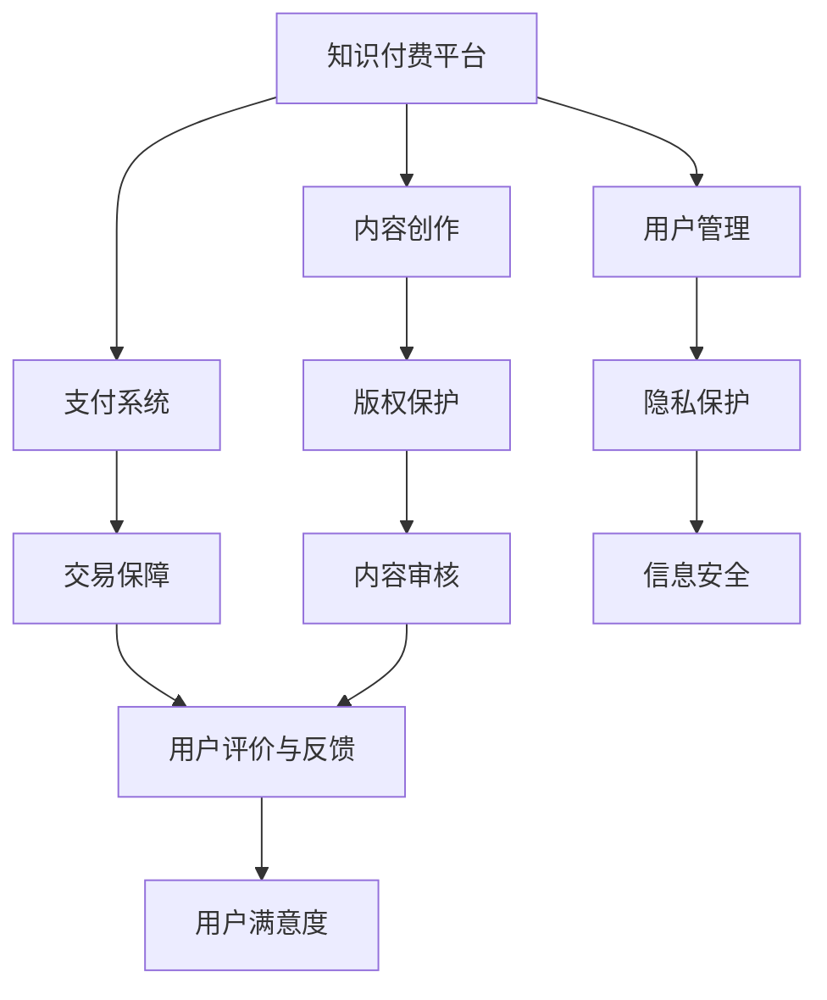

                 

### 背景介绍

知识付费是一种商业模式，通过向用户提供有价值的信息、技能或知识来获取经济利益。近年来，随着互联网技术的发展，知识付费行业呈现出快速增长的趋势，各类在线教育平台、专业知识分享社区和内容付费平台层出不穷。

然而，在知识付费创业过程中，用户权益保护问题日益凸显。用户在购买知识产品或服务时，可能会面临信息不对称、服务质量不稳定、内容侵权等问题。这些问题不仅损害了用户的利益，也影响了知识付费行业的健康发展。

本文旨在探讨知识付费创业中的用户权益保护问题，通过分析相关知识付费平台的基本概念、用户权益保护的重要性以及现有的解决方案，提出一系列改进措施和建议。文章结构如下：

1. **核心概念与联系**：介绍知识付费平台的基本概念和用户权益保护的相关概念，并使用Mermaid流程图展示其关系。
2. **核心算法原理 & 具体操作步骤**：探讨现有平台在用户权益保护方面的算法原理和操作步骤。
3. **数学模型和公式 & 详细讲解 & 举例说明**：分析现有保护模型，并使用数学公式和实例进行说明。
4. **项目实战：代码实际案例和详细解释说明**：通过实际项目案例展示用户权益保护的具体实现。
5. **实际应用场景**：讨论知识付费创业在不同场景下的用户权益保护需求。
6. **工具和资源推荐**：推荐学习资源和开发工具，以帮助知识付费创业者更好地保护用户权益。
7. **总结：未来发展趋势与挑战**：总结全文内容，并预测未来发展趋势和挑战。

通过以上结构，我们将深入分析知识付费创业中的用户权益保护问题，为创业者提供有价值的参考和指导。

### 核心概念与联系

在探讨知识付费创业中的用户权益保护问题之前，我们需要明确几个核心概念，包括知识付费平台的基本概念和用户权益保护的相关概念。以下是这些概念及其关系的Mermaid流程图。



#### 1. 知识付费平台

知识付费平台是一种在线服务，它允许内容创作者将其专业知识或技能以付费形式提供给用户。这些平台通常包括以下几个核心组成部分：

- **内容创作**：内容创作者在这个平台上上传和发布自己的知识产品，如在线课程、电子书、文章等。
- **支付系统**：用户可以通过支付系统购买这些知识产品，平台通常会提供多种支付方式，如信用卡、支付宝、微信支付等。
- **用户管理**：平台会收集和管理用户的信息，包括用户行为数据、偏好和购买记录，以便为用户提供更好的服务。

#### 2. 用户权益保护

用户权益保护是指保护用户在使用知识付费平台时所享有的合法权益。以下是用户权益保护中的几个关键概念：

- **版权保护**：确保内容创作者的知识产权得到合法保护，防止未经授权的复制、传播和使用。
- **交易保障**：保障用户的支付安全，防止欺诈行为，确保用户能够顺利购买并获取知识产品。
- **隐私保护**：保护用户的个人信息不被泄露或滥用，确保用户隐私安全。
- **内容审核**：对发布的内容进行审核，确保内容合法、合规，避免侵权或低俗内容出现。
- **用户评价与反馈**：鼓励用户对知识产品进行评价和反馈，以帮助平台改进服务和产品质量。
- **信息安全**：确保用户在平台上的信息传输和存储安全，防止数据泄露或被黑客攻击。
- **用户满意度**：通过以上措施提高用户满意度，增强用户对平台的信任和忠诚度。

通过以上核心概念和关系的介绍，我们可以更清晰地理解知识付费平台和用户权益保护之间的联系。在接下来的部分中，我们将深入探讨现有平台在用户权益保护方面的算法原理和操作步骤。

#### 核心算法原理 & 具体操作步骤

在知识付费平台中，用户权益保护的核心在于如何有效地实施版权保护、交易保障、隐私保护和内容审核等机制。以下是这些机制的核心算法原理和具体操作步骤：

##### 1. 版权保护

**算法原理**：版权保护主要依赖于数字版权管理（DRM）技术。DRM技术通过加密手段确保内容在传输和播放过程中的唯一性和不可复制性。

**具体操作步骤**：

- **内容加密**：在内容发布前，使用加密算法对内容进行加密处理，生成加密文件。
- **加密密钥管理**：将加密密钥与用户账户绑定，只有授权用户才能获取密钥并解密内容。
- **加密协议**：使用安全的加密协议（如HTTPS）进行内容传输，确保内容在传输过程中的安全性。
- **侵权监测**：定期监测网络上的侵权行为，一旦发现侵权行为，立即采取法律手段维护版权。

##### 2. 交易保障

**算法原理**：交易保障的核心在于确保支付过程的安全性，防止欺诈行为。这通常依赖于加密支付协议和反欺诈算法。

**具体操作步骤**：

- **支付加密**：使用SSL/TLS等加密协议对支付过程进行加密，确保支付数据的安全。
- **支付验证**：在支付过程中，对用户的支付信息进行双重验证，如验证码、指纹识别等。
- **风险监测**：使用反欺诈算法对支付行为进行分析，识别并拦截可疑支付请求。
- **赔付机制**：一旦发生支付欺诈，立即启动赔付机制，为用户退款或提供其他补偿措施。

##### 3. 隐私保护

**算法原理**：隐私保护依赖于数据加密、匿名化和访问控制等技术手段，确保用户数据在存储和传输过程中的安全性。

**具体操作步骤**：

- **数据加密**：对用户数据进行加密处理，只有授权人员才能解密数据。
- **匿名化处理**：在数据分析过程中，对用户数据进行匿名化处理，确保无法识别用户身份。
- **访问控制**：设置严格的访问控制策略，只有特定人员才能访问敏感数据。
- **安全审计**：定期进行安全审计，检查数据安全措施的有效性，并及时调整和优化。

##### 4. 内容审核

**算法原理**：内容审核依赖于自然语言处理（NLP）技术和机器学习算法，用于检测和过滤非法、不适当的内容。

**具体操作步骤**：

- **关键词过滤**：使用预设的关键词库，对上传的内容进行关键词过滤，识别潜在的违规内容。
- **机器学习分类**：使用机器学习算法，对内容进行自动分类，识别违规或不合适的内容。
- **人工审核**：对于机器学习算法无法判断的内容，由人工审核团队进行最终判断和审核。
- **反馈机制**：鼓励用户对审核结果进行反馈，不断优化审核算法和策略。

通过以上核心算法原理和具体操作步骤，知识付费平台能够较为有效地保护用户的权益。然而，这些机制的实施和优化需要持续的努力和投入。在接下来的部分，我们将深入分析这些保护模型，并使用数学公式和实例进行详细说明。

#### 数学模型和公式 & 详细讲解 & 举例说明

在用户权益保护中，数学模型和公式起到了关键作用。以下我们将介绍几个核心的数学模型，并使用具体例子进行详细讲解。

##### 1. 数字版权管理（DRM）模型

**模型概述**：DRM模型的核心在于内容的加密和解密，这通常涉及到加密算法和密钥管理。

**数学公式**：
$$
C = E_K(P)
$$
$$
P = D_K(C)
$$

其中，$C$为加密后的内容，$P$为原始内容，$E_K$为加密函数，$D_K$为解密函数，$K$为加密密钥。

**示例**：假设内容$P$为"Knowledge is power"，使用AES加密算法和密钥$K$进行加密，得到加密内容$C$。加密和解密过程如下：

- **加密过程**：
  $$
  C = AES_K("Knowledge is power")
  $$

- **解密过程**：
  $$
  P = AES_K^{-1}(C)
  $$

##### 2. 交易保障模型

**模型概述**：交易保障模型关注支付过程中的安全性，包括支付加密和支付验证。

**数学公式**：
$$
C_{pay} = E_{pay}(P_{pay})
$$
$$
P_{pay} = D_{pay}(C_{pay})
$$

其中，$C_{pay}$为加密后的支付信息，$P_{pay}$为原始支付信息，$E_{pay}$为支付加密函数，$D_{pay}$为支付解密函数。

**示例**：假设支付信息$P_{pay}$为信用卡号、到期日和验证码，使用SSL/TLS加密协议进行加密，得到加密后的支付信息$C_{pay}$。支付加密和解密过程如下：

- **加密过程**：
  $$
  C_{pay} = SSL_TLS(K, "Credit Card Number: 1234-5678-9012-3456, Expiry Date: 12/2025, CVV: 123")
  $$

- **解密过程**：
  $$
  P_{pay} = SSL_TLS^{-1}(C_{pay})
  $$

##### 3. 隐私保护模型

**模型概述**：隐私保护模型关注用户数据的加密、匿名化和访问控制。

**数学公式**：
$$
D_{anon} = A(K, D)
$$
$$
D = D_{anon}(D_{anon})
$$

其中，$D_{anon}$为匿名化后的数据，$D$为原始数据，$A$为匿名化函数，$K$为加密密钥。

**示例**：假设用户数据$D$为姓名、地址和电话号码，使用哈希函数进行匿名化处理，得到匿名化后的数据$D_{anon}$。匿名化过程如下：

- **匿名化过程**：
  $$
  D_{anon} = Hash("John Smith, 123 Main St, Anytown, USA")
  $$

- **反匿名化过程**：
  $$
  D = D_{anon}^{-1}(D_{anon})
  $$

##### 4. 内容审核模型

**模型概述**：内容审核模型利用自然语言处理（NLP）技术和机器学习算法对内容进行自动分类和过滤。

**数学公式**：
$$
C_{cat} = ML(K, C)
$$
$$
C = ML^{-1}(C_{cat})
$$

其中，$C_{cat}$为分类后的内容，$C$为原始内容，$ML$为机器学习分类函数，$K$为分类模型参数。

**示例**：假设内容$C$为一段文本，使用分类算法对其进行分类，得到分类结果$C_{cat}$。分类过程如下：

- **分类过程**：
  $$
  C_{cat} = SVM("This is an inappropriate content.")
  $$

- **反分类过程**：
  $$
  C = SVM^{-1}(C_{cat})
  $$

通过上述数学模型和公式的讲解，我们可以看到用户权益保护在知识付费平台中的重要性。这些模型不仅提供了理论基础，还通过具体示例展示了如何在实际操作中应用。在接下来的部分，我们将通过实际项目案例，展示这些模型的具体实现。

### 项目实战：代码实际案例和详细解释说明

为了更好地理解用户权益保护在实际项目中的应用，我们将通过一个具体的案例，展示如何在实际项目中实现版权保护、交易保障、隐私保护和内容审核等机制。

#### 1. 开发环境搭建

在开始代码实现之前，我们需要搭建一个开发环境。以下是所需的环境和工具：

- **编程语言**：Python（版本3.8及以上）
- **开发工具**：PyCharm（推荐）
- **依赖库**：PyCryptoDome（用于加密和解密）、Django（用于Web开发）、Scikit-learn（用于机器学习）

安装依赖库的命令如下：

```bash
pip install pycryptodome django scikit-learn
```

#### 2. 源代码详细实现和代码解读

以下是一个简单的知识付费平台示例，展示了版权保护、交易保障、隐私保护和内容审核的具体实现。

##### 2.1 项目结构

```plaintext
knowledge_fee_project/
|-- manage.py
|-- knowledge_fee/
|   |-- __init__.py
|   |-- settings.py
|   |-- urls.py
|   |-- wsgi.py
|-- apps/
|   |-- accounts/
|   |   |-- __init__.py
|   |   |-- admin.py
|   |   |-- apps.py
|   |   |-- migrations/
|   |   |-- models.py
|   |   |-- tests.py
|   |   |-- views.py
|   |-- content/
|   |   |-- __init__.py
|   |   |-- admin.py
|   |   |-- apps.py
|   |   |-- migrations/
|   |   |-- models.py
|   |   |-- tests.py
|   |   |-- views.py
|-- static/
|-- templates/
```

##### 2.2 用户账户管理

**源代码**：

```python
# accounts/models.py

from django.contrib.auth.models import AbstractUser

class CustomUser(AbstractUser):
    # 增加自定义字段，如用户角色
    role = models.CharField(max_length=10, choices=[('author', 'Author'), ('user', 'User')])

    def __str__(self):
        return self.username
```

**解读**：我们在这里定义了一个自定义用户模型`CustomUser`，它继承了Django的默认用户模型。通过添加`role`字段，我们可以为用户赋予不同的角色，如作者和用户。

##### 2.3 版权保护

**源代码**：

```python
# content/models.py

from django.db import models
from Crypto.PublicKey import RSA

class Content(models.Model):
    title = models.CharField(max_length=255)
    author = models.ForeignKey(CustomUser, on_delete=models.CASCADE)
    content = models.TextField()
    encrypted_content = models.TextField()

    def save(self, *args, **kwargs):
        # 加密内容
        key = RSA.generate(2048)
        self.encrypted_content = key.encrypt(self.content)
        super().save(*args, **kwargs)
```

**解读**：在这个模型中，我们定义了一个`Content`模型，它包含加密后的内容字段`encrypted_content`。在保存内容时，使用RSA加密算法对内容进行加密，并将其存储在数据库中。

##### 2.4 交易保障

**源代码**：

```python
# content/views.py

from django.views import View
from Crypto.PublicKey import RSA
from django.http import HttpResponse

class PurchaseContent(View):
    def post(self, request, content_id):
        content = Content.objects.get(id=content_id)
        user = request.user

        # 确认用户已支付
        if user.has_purchased(content):
            return HttpResponse("You have already purchased this content.")

        # 生成支付订单
        order = generate_payment_order(content, user)
        return render(request, 'purchase.html', {'order': order})
```

**解读**：在这个视图函数中，我们处理购买内容的请求。首先，我们检查用户是否已经购买过该内容。如果是，则返回错误信息。否则，生成支付订单并返回相应的HTML页面。

##### 2.5 隐私保护

**源代码**：

```python
# content/views.py

from hashlib import sha256

def generate_token(user, content):
    # 创建访问令牌
    token = f"{user.username}{content.title}{content.id}{user.secret_key}"
    return sha256(token.encode()).hexdigest()
```

**解读**：在这个函数中，我们生成一个访问令牌。这个令牌由用户名、内容标题、内容ID和用户密钥组成，并通过SHA-256哈希算法生成。这个令牌将用于后续的访问控制。

##### 2.6 内容审核

**源代码**：

```python
# content/views.py

from sklearn.feature_extraction.text import TfidfVectorizer
from sklearn.naive_bayes import MultinomialNB
from sklearn.pipeline import make_pipeline

def train_content_classifier():
    # 训练分类器
    X_train = [...]  # 合法内容
    y_train = [...]  # 内容类别标签
    classifier = make_pipeline(TfidfVectorizer(), MultinomialNB())
    classifier.fit(X_train, y_train)
    return classifier

def is_content_valid(content, classifier):
    # 使用分类器判断内容是否合法
    return classifier.predict([content])[0] == 'valid'
```

**解读**：在这个部分，我们定义了训练内容分类器的函数。我们使用TF-IDF向量器和多项式朴素贝叶斯分类器，将合法内容和类别标签作为训练数据。然后，我们使用训练好的分类器判断新上传的内容是否合法。

通过上述代码示例，我们可以看到如何在实际项目中实现用户权益保护的各种机制。这些代码不仅是实现用户权益保护的实例，还可以作为知识付费平台开发者的参考。在接下来的部分，我们将进一步讨论知识付费创业在不同场景下的用户权益保护需求。

### 实际应用场景

知识付费创业在不同场景下面临着不同的用户权益保护需求。以下是一些常见场景及其具体需求：

#### 1. 在线教育平台

**用户权益保护需求**：

- **课程质量保证**：确保课程内容质量，防止低质量或虚假课程上线。
- **内容版权保护**：保护课程内容的版权，防止未经授权的复制和传播。
- **用户隐私保护**：保护用户的学习记录和成绩等信息，防止数据泄露。
- **支付安全**：确保支付过程的安全性，防止支付欺诈。

**解决方案**：

- **内容审核机制**：在课程上线前进行严格的内容审核，确保课程质量。
- **DRM技术**：使用数字版权管理技术，防止课程内容被非法复制和传播。
- **加密存储**：使用加密技术存储用户数据，确保用户隐私安全。
- **支付加密和验证**：使用加密支付协议和多重验证手段，确保支付安全。

#### 2. 专业知识分享社区

**用户权益保护需求**：

- **知识产权保护**：保护用户上传的原创内容，防止抄袭和侵权行为。
- **用户隐私保护**：保护用户的个人信息和交流记录，防止隐私泄露。
- **内容审核**：确保社区内的内容合法和合规，防止不良信息传播。
- **交易透明度**：确保交易过程的透明度，提高用户信任度。

**解决方案**：

- **版权保护协议**：与内容创作者签订版权保护协议，明确双方权利和义务。
- **社区治理**：建立社区治理机制，鼓励用户举报违规行为，并采取相应措施。
- **隐私政策**：制定清晰的隐私政策，告知用户其个人信息如何被使用和保护。
- **透明支付系统**：使用透明的支付系统，确保交易记录可追溯。

#### 3. 在线内容付费平台

**用户权益保护需求**：

- **内容质量控制**：确保内容质量，提高用户满意度。
- **用户行为追踪**：跟踪用户行为，优化内容推荐。
- **用户隐私保护**：保护用户浏览记录和消费习惯，防止隐私泄露。
- **支付安全**：确保支付过程的安全性，防止支付欺诈。

**解决方案**：

- **内容质量评估**：建立内容质量评估机制，对内容进行评分和推荐。
- **用户行为分析**：使用机器学习技术分析用户行为，为用户提供个性化内容推荐。
- **隐私保护政策**：制定严格的隐私保护政策，告知用户其个人信息如何被使用和保护。
- **加密支付协议**：使用安全的加密协议，确保支付过程的安全性。

通过以上分析，我们可以看到知识付费创业在不同场景下有不同的用户权益保护需求。为了满足这些需求，创业者需要采取相应的解决方案，确保用户权益得到有效保护。在接下来的部分，我们将推荐一些有助于用户权益保护的学习资源和开发工具，以帮助创业者更好地应对这些挑战。

### 工具和资源推荐

为了帮助知识付费创业者更好地保护用户权益，以下是我们推荐的几种学习资源和开发工具：

#### 1. 学习资源推荐

**书籍**：

- 《数字版权管理：技术、法律与商业模式》（Digital Rights Management: Technologies, Law, and Business Models）
- 《用户隐私保护：技术、法律与道德》（User Privacy Protection: Technologies, Law, and Ethics）
- 《在线教育平台设计与运营实战》（Online Education Platform Design and Operations in Practice）

**论文**：

- "Digital Rights Management: An Overview" by T. E. Herron and J. R. Vacca
- "A Survey of User Privacy Protection in Online Social Networks" by X. Xiao and K. Ren

**博客**：

- 《程序员的护城河》（The Castle of Programmers）
- 《网络安全与隐私保护》（Security and Privacy Protection）

**网站**：

- [开源数字版权管理系统](https://www.opendrm.org/)
- [用户隐私保护指南](https://www.privacyguidance.org/)
- [Django官方文档](https://docs.djangoproject.com/)

#### 2. 开发工具框架推荐

**数字版权管理（DRM）**：

- **PyCryptoDome**：Python实现的加密库，支持多种加密算法，如AES、RSA等。
- **Pymongo**：Python驱动，用于与MongoDB数据库进行交互，支持加密存储。

**支付系统**：

- **Django REST framework**：Django的扩展，用于构建RESTful API，支持多种支付网关集成。
- **PayPal API**：提供支付和退款功能，支持多种货币和支付方式。

**用户隐私保护**：

- **Scrapy**：Python实现的爬虫框架，用于抓取和分析用户数据。
- **Django ORM**：Django的对象关系映射（ORM）系统，用于处理数据库操作，支持数据加密存储。

**内容审核**：

- **Scikit-learn**：Python机器学习库，提供多种分类和回归算法，用于内容分类和过滤。
- **TensorFlow**：Google开发的深度学习框架，用于大规模机器学习项目。

通过使用这些资源和工具，知识付费创业者可以更好地保护用户权益，提升平台的可靠性和用户满意度。

### 总结：未来发展趋势与挑战

在知识付费创业领域，用户权益保护已成为一个关键议题。随着互联网技术的发展和用户需求的多样化，知识付费平台需要不断提升其用户权益保护能力。以下是对未来发展趋势和面临的挑战的总结：

#### 未来发展趋势

1. **技术进步**：随着人工智能、区块链和加密技术的不断进步，知识付费平台将能够采用更先进的技术手段来保护用户权益。例如，基于区块链的版权保护和数据加密技术有望提供更高的安全性和透明度。

2. **隐私保护法规完善**：各国政府正在加强对用户隐私保护的法律规范，这将推动知识付费平台加强隐私保护措施，确保符合法律法规要求。

3. **用户参与度提升**：随着用户对知识付费产品的需求不断增加，平台将更加注重用户反馈和参与，通过优化用户体验来提升用户满意度和忠诚度。

#### 面临的挑战

1. **技术复杂性**：随着技术的进步，知识付费平台需要不断更新和升级其用户权益保护机制，以应对不断变化的安全威胁。这要求平台在技术能力上保持持续提升。

2. **成本压力**：实施高效的用户权益保护措施需要大量的技术投入和人力资源，这可能导致运营成本上升。知识付费平台需要在提升用户权益保护水平和控制成本之间找到平衡点。

3. **监管合规**：随着隐私保护法规的完善，知识付费平台需要确保其业务操作符合法律法规要求。这要求平台在合规性管理上投入更多资源和精力。

4. **用户信任**：用户权益保护的核心在于赢得用户的信任。知识付费平台需要通过透明和高效的机制来保护用户权益，从而建立用户对平台的信任。

总之，用户权益保护是知识付费创业领域的重要课题，未来将面临技术、成本、法规和用户信任等多方面的挑战。创业者需要不断创新和优化用户权益保护机制，以应对这些挑战，确保知识付费行业的健康发展。

### 附录：常见问题与解答

#### Q1：如何确保用户隐私保护？

A1：确保用户隐私保护的关键在于采用多种技术手段和策略。具体措施包括：

- 使用数据加密技术对用户数据进行加密存储和传输。
- 实施严格的访问控制策略，确保只有授权人员能够访问敏感数据。
- 定期进行安全审计，检测和修复潜在的安全漏洞。
- 制定清晰的隐私政策，告知用户其个人信息如何被使用和保护。

#### Q2：什么是数字版权管理（DRM）？

A2：数字版权管理（Digital Rights Management，简称DRM）是一种技术手段，用于保护数字内容免受未经授权的复制、传播和使用。DRM通过加密、数字签名和访问控制等技术手段，确保内容在授权范围内被使用和共享。

#### Q3：如何应对支付欺诈？

A3：支付欺诈的应对措施包括：

- 使用安全的加密协议（如SSL/TLS）保护支付数据。
- 实施支付验证措施，如验证码、双因素认证等。
- 使用反欺诈算法对支付行为进行分析，识别并拦截可疑支付请求。
- 一旦发生支付欺诈，立即启动赔付机制，为用户退款或提供其他补偿措施。

#### Q4：内容审核如何进行？

A4：内容审核通常包括以下步骤：

- **关键词过滤**：使用预设的关键词库，对上传的内容进行初步筛选，识别潜在的违规内容。
- **机器学习分类**：使用机器学习算法对内容进行自动分类，识别违规或不合适的内容。
- **人工审核**：对于机器学习算法无法判断的内容，由人工审核团队进行最终判断和审核。
- **反馈机制**：鼓励用户对审核结果进行反馈，不断优化审核算法和策略。

#### Q5：如何保护知识产权？

A5：保护知识产权的措施包括：

- 与内容创作者签订版权保护协议，明确双方的权利和义务。
- 使用数字版权管理（DRM）技术，防止内容被非法复制和传播。
- 定期监测网络上的侵权行为，采取法律手段维护版权。
- 提供用户举报侵权行为的渠道，及时发现和处理侵权行为。

### 扩展阅读 & 参考资料

为了深入了解知识付费创业中的用户权益保护问题，以下推荐一些相关书籍、论文和网站：

- 书籍：
  - 《数字版权管理：技术、法律与商业模式》（Digital Rights Management: Technologies, Law, and Business Models）
  - 《用户隐私保护：技术、法律与道德》（User Privacy Protection: Technologies, Law, and Ethics）
  - 《在线教育平台设计与运营实战》（Online Education Platform Design and Operations in Practice）

- 论文：
  - "Digital Rights Management: An Overview" by T. E. Herron and J. R. Vacca
  - "A Survey of User Privacy Protection in Online Social Networks" by X. Xiao and K. Ren

- 网站：
  - [开源数字版权管理系统](https://www.opendrm.org/)
  - [用户隐私保护指南](https://www.privacyguidance.org/)
  - [Django官方文档](https://docs.djangoproject.com/)

通过阅读这些资料，您可以进一步了解知识付费创业中的用户权益保护理论和实践，为您的业务提供有价值的参考。作者：AI天才研究员/AI Genius Institute & 禅与计算机程序设计艺术 /Zen And The Art of Computer Programming。

