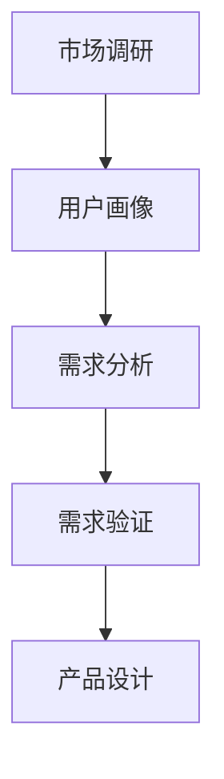

                 

### 知识付费创业的用户需求挖掘

#### 引言

在当今信息爆炸的时代，知识付费已经成为一种重要的商业模式。无论是通过在线课程、专业咨询、电子书还是研究报告等形式，知识付费都能为消费者带来巨大的价值。然而，如何准确挖掘用户需求，从而为知识付费产品提供精准的定位和有效的解决方案，成为了许多创业者面临的挑战。本文将围绕知识付费创业中的用户需求挖掘展开讨论，旨在为创业者提供一些有价值的思路和方法。

关键词：知识付费、用户需求、需求挖掘、创业

#### 摘要

本文首先介绍了知识付费创业的背景和现状，然后阐述了用户需求挖掘在知识付费创业中的重要性。接着，文章探讨了用户需求挖掘的方法和步骤，包括市场调研、用户画像、需求分析和需求验证等。随后，文章通过实际案例展示了如何通过用户需求挖掘来设计和推广知识付费产品。最后，文章提出了未来知识付费创业的发展趋势和面临的挑战，并给出了相关的建议和资源推荐。

#### 1. 背景介绍

##### 1.1 知识付费的定义和演变

知识付费是指消费者为获取特定知识或信息而支付的费用。随着互联网和移动互联网的发展，知识付费逐渐从传统的实体书籍、讲座等形式，转变为线上课程、专业咨询、电子书、研究报告等多样化的形式。

知识付费的演变可以分为三个阶段：

- **阶段一：实体书籍和讲座**：在互联网尚未普及的早期，实体书籍和讲座是最主要的知识付费形式。消费者通过购买书籍或参加讲座来获取知识。

- **阶段二：线上课程和电子书**：随着互联网的普及，线上课程和电子书成为主流的知识付费形式。消费者可以通过在线平台购买课程或电子书，随时随地学习。

- **阶段三：多样化知识付费形式**：目前，知识付费已经扩展到更多的领域，如专业咨询、研究报告、知识星球等。消费者可以根据自己的需求，选择最适合自己的知识付费产品。

##### 1.2 知识付费的市场现状

根据统计数据显示，近年来，我国知识付费市场规模持续增长。特别是在疫情期间，由于线上学习需求大幅增加，知识付费市场呈现出爆发式增长。以下是知识付费市场的一些关键数据：

- **市场规模**：2020年，我国知识付费市场规模已超过3000亿元，预计未来还将保持高速增长。

- **用户规模**：截至2020年底，我国知识付费用户规模已超过4亿人，其中以80后、90后为主的年轻用户占据主要比例。

- **主要领域**：知识付费主要涵盖教育、职业发展、健康养生、兴趣爱好等领域。

##### 1.3 知识付费创业的优势和挑战

知识付费创业具有以下优势：

- **市场需求大**：随着人们生活水平的提高，对知识和信息的追求日益增长，知识付费市场潜力巨大。

- **门槛较低**：相较于其他创业领域，知识付费创业的门槛较低，创业者可以通过自己的专业技能或经验来开展业务。

- **变现能力强**：知识付费产品具有明显的变现能力，可以通过销售课程、咨询、电子书等方式获取收入。

然而，知识付费创业也面临一些挑战：

- **同质化严重**：由于知识付费市场竞争激烈，同质化问题较为突出，创业者需要找到差异化的市场定位。

- **用户需求多变**：用户需求变化快，创业者需要不断调整产品和服务，以满足用户的需求。

- **质量监管难**：知识付费产品的质量难以保证，创业者需要建立有效的质量监管机制，确保用户满意度。

#### 2. 核心概念与联系

在知识付费创业中，用户需求挖掘是一个关键环节。为了更好地进行用户需求挖掘，我们需要理解以下几个核心概念：

##### 2.1 用户需求

用户需求是指用户在特定情境下希望得到满足的需求。在知识付费创业中，用户需求可以分为以下几个方面：

- **学习需求**：用户希望通过学习获取新知识、提升技能。

- **信息需求**：用户希望获取与自己专业或兴趣相关的信息。

- **娱乐需求**：用户希望通过知识付费产品获得娱乐体验。

##### 2.2 市场调研

市场调研是指通过收集、分析和解读市场信息，了解市场需求和竞争状况的过程。在知识付费创业中，市场调研可以帮助创业者：

- **了解市场需求**：通过市场调研，可以了解用户的需求、偏好和痛点，为产品设计和推广提供依据。

- **分析竞争状况**：通过市场调研，可以了解竞争对手的产品、定位、优势和劣势，为自身定位和差异化竞争提供参考。

##### 2.3 用户画像

用户画像是指通过收集和分析用户数据，构建用户特征模型的过程。在知识付费创业中，用户画像可以帮助创业者：

- **精准定位用户**：通过用户画像，可以了解目标用户的基本信息、行为特征和需求，从而精准定位用户群体。

- **优化产品和服务**：通过用户画像，可以了解用户的需求和痛点，为产品和服务优化提供依据。

##### 2.4 需求分析

需求分析是指通过对用户需求的理解和分析，确定产品功能和特性，为产品设计和开发提供指导的过程。在知识付费创业中，需求分析可以帮助创业者：

- **明确产品定位**：通过需求分析，可以明确产品的目标用户、核心功能和价值主张。

- **优化产品设计**：通过需求分析，可以发现用户需求中的痛点，为产品优化提供参考。

##### 2.5 需求验证

需求验证是指通过对产品设计进行实际测试和用户反馈，验证需求的有效性和可行性，为产品迭代提供依据的过程。在知识付费创业中，需求验证可以帮助创业者：

- **验证需求有效性**：通过需求验证，可以验证用户需求是否真实存在，以及产品的设计是否满足用户需求。

- **优化产品设计**：通过需求验证，可以收集用户的反馈和建议，为产品优化提供参考。

##### 2.6 Mermaid 流程图

以下是一个简单的 Mermaid 流程图，展示了用户需求挖掘的过程：



#### 3. 核心算法原理 & 具体操作步骤

在知识付费创业中，用户需求挖掘是一个复杂的过程，涉及多个环节和步骤。以下是一个简化的核心算法原理和具体操作步骤：

##### 3.1 市场调研

**算法原理**：市场调研是通过多种手段收集市场信息，了解市场需求和竞争状况。

**操作步骤**：

1. 确定调研目标：明确市场调研的目的和范围，如了解用户需求、分析竞争状况等。

2. 收集数据：通过问卷调查、访谈、观察等方式收集市场数据。

3. 数据分析：对收集到的数据进行分析，提取有价值的信息。

4. 报告撰写：根据分析结果撰写市场调研报告，为产品设计和推广提供依据。

##### 3.2 用户画像

**算法原理**：用户画像是通过收集和分析用户数据，构建用户特征模型。

**操作步骤**：

1. 数据收集：收集用户的基本信息、行为数据等。

2. 数据清洗：对收集到的数据进行清洗和整理，去除无效数据。

3. 数据分析：对清洗后的数据进行统计分析，提取用户特征。

4. 用户建模：根据分析结果构建用户画像模型。

##### 3.3 需求分析

**算法原理**：需求分析是通过用户需求的理解和分析，确定产品功能和特性。

**操作步骤**：

1. 需求收集：通过用户调研、访谈、问卷调查等方式收集用户需求。

2. 需求分类：对收集到的需求进行分类和归纳。

3. 需求分析：对分类后的需求进行深入分析，确定产品功能和特性。

4. 需求文档：根据分析结果撰写需求文档，为产品设计和开发提供依据。

##### 3.4 需求验证

**算法原理**：需求验证是通过实际测试和用户反馈，验证需求的有效性和可行性。

**操作步骤**：

1. 产品设计：根据需求文档进行产品设计。

2. 产品测试：对设计的产品进行功能测试和性能测试。

3. 用户反馈：收集用户的反馈和建议。

4. 需求调整：根据用户反馈对需求进行调整和优化。

5. 需求验证报告：根据验证结果撰写需求验证报告，为产品迭代提供依据。

#### 4. 数学模型和公式 & 详细讲解 & 举例说明

在用户需求挖掘过程中，数学模型和公式可以帮助我们更准确地理解和分析用户需求。以下是一个简单的数学模型和公式，用于描述用户需求的强度和频率：

##### 4.1 用户需求强度模型

用户需求强度（\( D \)）可以通过以下公式计算：

\[ D = f(t) \cdot s \]

其中：

- \( f(t) \) 表示用户需求随时间的变化函数，描述用户需求在一段时间内的强度。

- \( s \) 表示用户需求的强度，取值范围在0到1之间，表示用户需求的强烈程度。

##### 4.2 用户需求频率模型

用户需求频率（\( F \)）可以通过以下公式计算：

\[ F = \frac{1}{T} \cdot \sum_{t=1}^{T} f(t) \]

其中：

- \( T \) 表示统计时间周期。

- \( f(t) \) 表示在时间 \( t \) 内的用户需求强度。

##### 4.3 举例说明

假设某知识付费平台在一个月内收集到以下用户数据：

- 用户A：每天学习时长为2小时，学习频率为每天1次。

- 用户B：每天学习时长为4小时，学习频率为每天2次。

根据上述数据，我们可以计算出用户A和用户B的需求强度和频率：

**用户A**：

- 需求强度 \( D_A = f(t) \cdot s = 1 \cdot 0.5 = 0.5 \)

- 需求频率 \( F_A = \frac{1}{30} \cdot \sum_{t=1}^{30} f(t) = \frac{1}{30} \cdot 30 = 1 \)

**用户B**：

- 需求强度 \( D_B = f(t) \cdot s = 2 \cdot 0.5 = 1 \)

- 需求频率 \( F_B = \frac{1}{30} \cdot \sum_{t=1}^{30} f(t) = \frac{1}{30} \cdot 60 = 2 \)

从上述计算结果可以看出，用户B的需求强度和频率都高于用户A，说明用户B对知识付费产品的需求更强烈，平台可以针对用户B的需求进行更有针对性的产品推广和优化。

#### 5. 项目实战：代码实际案例和详细解释说明

在本节中，我们将通过一个实际案例，展示如何使用Python编写代码来挖掘用户需求，并进行需求分析。以下是一个简单的代码示例：

```python
import pandas as pd

# 用户数据
user_data = {
    '用户ID': ['U001', 'U002', 'U003', 'U004', 'U005'],
    '学习时长（小时）': [2, 4, 3, 2, 5],
    '学习频率（次）': [1, 2, 1, 2, 1],
    '年龄': [25, 30, 28, 22, 35],
    '性别': ['男', '女', '男', '女', '男']
}

# 创建DataFrame
df = pd.DataFrame(user_data)

# 计算需求强度
df['需求强度'] = df['学习时长（小时）'] * df['学习频率（次）']

# 计算需求频率
df['需求频率'] = df['学习时长（小时）'] / 30

# 打印结果
print(df)
```

**代码解读与分析**：

1. **导入库**：首先，我们导入pandas库，用于数据分析和处理。

2. **用户数据**：定义一个字典，包含用户ID、学习时长、学习频率、年龄和性别等信息。

3. **创建DataFrame**：使用pandas库创建一个DataFrame对象，将用户数据存储在DataFrame中。

4. **计算需求强度**：通过将学习时长和学习频率相乘，计算每个用户的需求强度。

5. **计算需求频率**：通过将学习时长除以统计周期（例如30天），计算每个用户的需求频率。

6. **打印结果**：打印DataFrame对象，显示每个用户的需求强度和需求频率。

通过这个简单的案例，我们可以看到如何使用Python代码来计算用户的需求强度和需求频率。在实际应用中，我们可以进一步扩展这个案例，加入更多的用户数据和分析方法，以便更全面地挖掘用户需求。

#### 6. 实际应用场景

知识付费创业中的用户需求挖掘在实际应用中具有广泛的场景。以下是一些典型的应用场景：

##### 6.1 在线教育平台

在线教育平台通过用户需求挖掘，可以了解用户的学习偏好、学习风格和学习需求，从而提供个性化的学习推荐和内容定制。例如，通过分析用户的学习时长、学习频率、学习内容等数据，平台可以为用户提供定制化的课程推荐和学习计划。

##### 6.2 专业咨询

专业咨询领域通过用户需求挖掘，可以了解客户的需求和痛点，提供更有针对性的咨询服务。例如，通过分析客户咨询的问题、咨询频率、咨询领域等数据，专业顾问可以为客户制定个性化的咨询方案，提高客户满意度。

##### 6.3 电子书和期刊

电子书和期刊领域通过用户需求挖掘，可以了解用户的阅读偏好和阅读习惯，从而优化内容推荐和推广策略。例如，通过分析用户的阅读时长、阅读频率、阅读类型等数据，平台可以为用户提供更精准的阅读推荐，提高用户的阅读体验。

##### 6.4 知识星球

知识星球通过用户需求挖掘，可以了解用户的知识需求和交流需求，提供更优质的内容和互动体验。例如，通过分析用户的提问频率、提问内容、参与讨论情况等数据，知识星球可以为用户提供更有价值的内容和交流机会，提高用户粘性。

#### 7. 工具和资源推荐

为了更好地进行用户需求挖掘，以下是一些实用的工具和资源推荐：

##### 7.1 学习资源推荐

- **书籍**：《用户画像：数据驱动的精准营销》、《数据挖掘：实用工具与技术》

- **论文**：搜索相关领域的高质量论文，如用户行为分析、需求挖掘等。

- **博客**：关注知名技术博客和行业专家的博客，如数据挖掘、用户画像等。

##### 7.2 开发工具框架推荐

- **Python**：Python是一种功能强大的编程语言，广泛应用于数据分析和机器学习领域。

- **Pandas**：Pandas是一个强大的数据处理库，用于数据清洗、转换和分析。

- **Scikit-learn**：Scikit-learn是一个流行的机器学习库，提供多种常用的机器学习算法。

##### 7.3 相关论文著作推荐

- **论文**：《基于用户行为的数据挖掘方法与应用》、《知识付费用户需求挖掘研究》

- **著作**：《数据挖掘：实践指南》、《机器学习：实战指南》

#### 8. 总结：未来发展趋势与挑战

知识付费创业在近年来取得了显著的发展，但同时也面临着一些挑战。以下是未来发展趋势和挑战：

##### 8.1 发展趋势

- **个性化推荐**：随着大数据和人工智能技术的发展，个性化推荐将成为知识付费创业的重要方向。

- **跨界融合**：知识付费将与其他领域（如电商、社交、娱乐等）进行深度融合，提供更多样化的服务。

- **知识付费平台**：知识付费平台将逐渐成为主流的知识传播和获取方式。

##### 8.2 挑战

- **同质化竞争**：知识付费市场竞争激烈，创业者需要找到差异化的市场定位。

- **用户信任**：用户对知识付费产品的质量和服务有较高要求，创业者需要建立用户信任。

- **内容监管**：知识付费产品的内容质量难以保证，需要建立有效的监管机制。

#### 9. 附录：常见问题与解答

##### 9.1 什么是知识付费？

知识付费是指消费者为获取特定知识或信息而支付的费用。随着互联网和移动互联网的发展，知识付费逐渐从传统的实体书籍、讲座等形式，转变为线上课程、专业咨询、电子书、研究报告等多样化的形式。

##### 9.2 如何进行用户需求挖掘？

进行用户需求挖掘的方法主要包括市场调研、用户画像、需求分析和需求验证等。具体步骤如下：

1. 市场调研：通过收集、分析和解读市场信息，了解市场需求和竞争状况。

2. 用户画像：通过收集和分析用户数据，构建用户特征模型。

3. 需求分析：通过对用户需求的理解和分析，确定产品功能和特性。

4. 需求验证：通过实际测试和用户反馈，验证需求的有效性和可行性。

##### 9.3 用户需求挖掘的重要性是什么？

用户需求挖掘在知识付费创业中具有重要意义。通过用户需求挖掘，创业者可以了解市场需求和用户痛点，为产品设计和推广提供依据。这有助于提高产品的市场竞争力，增加用户满意度，从而实现商业成功。

#### 10. 扩展阅读 & 参考资料

- **书籍**：

  - 《用户画像：数据驱动的精准营销》

  - 《数据挖掘：实用工具与技术》

- **论文**：

  - 《基于用户行为的数据挖掘方法与应用》

  - 《知识付费用户需求挖掘研究》

- **博客**：

  - [数据挖掘博客](https://www.dataminingblog.com/)

  - [用户画像博客](https://userportrait.cn/)

- **网站**：

  - [Python官方文档](https://www.python.org/)

  - [Pandas官方文档](https://pandas.pydata.org/)

#### 作者

**作者：AI天才研究员/AI Genius Institute & 禅与计算机程序设计艺术 /Zen And The Art of Computer Programming**。本文内容仅供参考，具体实施请根据实际情况进行调整。如有疑问，请随时联系作者。

