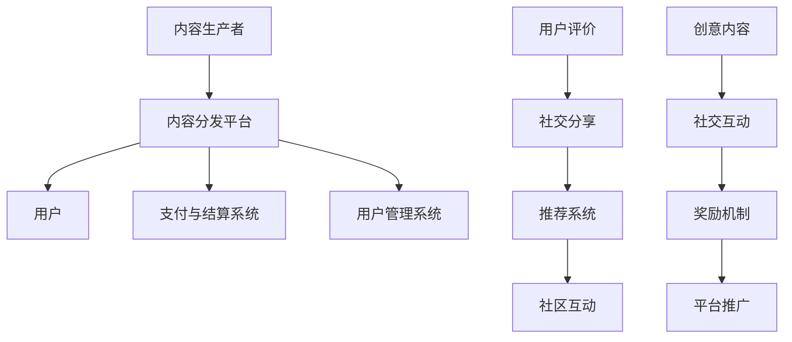

                 

### 背景介绍

#### 知识付费的兴起

知识付费作为一种新兴的商业模式，近年来在全球范围内迅速崛起。随着互联网的普及和信息技术的发展，人们获取知识的途径变得更加多样化和便捷。传统的知识传播方式，如报纸、杂志和电视，已经难以满足现代人对于个性化、高质量知识的渴望。知识付费则通过线上平台，将专业知识和技能以付费形式提供给用户，从而实现了知识的变现和价值最大化。

#### 知识付费的现状

目前，知识付费已经形成了一定的市场规模，并且在各个领域都有所布局。根据统计，全球知识付费市场规模预计将在未来几年内持续增长。其中，教育培训、在线课程、专业知识分享、咨询等服务是知识付费的主要领域。同时，知识付费也逐渐向垂直行业和专业领域拓展，如医学、法律、金融等。

#### 口碑传播与病毒式营销的重要性

在知识付费领域，口碑传播和病毒式营销对于平台的持续发展和用户增长至关重要。口碑传播是通过用户之间的互动和推荐，将平台的价值和优势传递给更多潜在用户，从而实现用户增长和品牌口碑的提升。病毒式营销则是通过创新的方式，利用社交媒体和网络平台，迅速将信息传播给大量用户，实现短时间内的大规模传播。

在知识付费领域，口碑传播和病毒式营销不仅能提升用户满意度，增加用户粘性，还能降低获客成本，提高用户转化率。因此，深入探讨知识付费如何实现口碑传播和病毒式营销，对于平台的发展具有重要意义。

### 核心概念与联系

#### 知识付费平台的基本架构

要实现知识付费的口碑传播和病毒式营销，首先需要了解知识付费平台的基本架构。一个典型的知识付费平台通常包括以下几个核心组成部分：

1. **内容生产者**：生产者包括专业领域的专家、学者、培训师等，他们负责提供高质量的知识内容。
2. **内容分发平台**：平台负责内容的生产、审核、发布、推广和变现，是知识付费的核心环节。
3. **用户**：用户是知识付费的最终消费者，他们通过平台获取知识和服务。
4. **支付与结算系统**：支付系统负责用户的支付行为和内容提供商的收益分配。
5. **用户管理系统**：系统记录用户行为，分析用户需求，为用户推荐个性化内容。

#### 口碑传播的机制

口碑传播是一种基于用户信任和社会关系的传播方式，其核心在于用户对产品的体验和评价。在知识付费领域，口碑传播的机制主要包括以下几个方面：

1. **用户评价**：用户通过评论、评分等方式对所学内容进行评价，这些评价会直接影响其他潜在用户的决策。
2. **社交分享**：用户将优质内容分享到社交媒体，如微信、微博、抖音等，通过社交关系网传播。
3. **推荐系统**：平台利用大数据和机器学习技术，根据用户行为和偏好推荐相关内容，促进口碑传播。
4. **社区互动**：建立用户社区，促进用户之间的互动和交流，增强用户粘性。

#### 病毒式营销的策略

病毒式营销是一种通过用户自发传播实现快速增长的方式，其核心在于内容的创新和传播方式的巧妙设计。在知识付费领域，病毒式营销的策略主要包括以下几个方面：

1. **创意内容**：生产出具有独特性和吸引力的内容，激发用户的传播欲望。
2. **社交互动**：设计互动环节，鼓励用户参与和分享，如问答、讨论、投票等。
3. **奖励机制**：通过积分、优惠券、实物奖励等方式激励用户传播。
4. **平台推广**：利用平台的推广资源和渠道，扩大内容的影响力。

#### 三者之间的联系

口碑传播和病毒式营销在知识付费平台中相辅相成。口碑传播通过用户的真实体验和评价，为平台吸引潜在用户；而病毒式营销则通过创新的内容和传播方式，迅速扩大平台的影响力。二者共同作用于用户获取和留存，为平台的长期发展奠定基础。


（图1：知识付费平台架构图）

#### Mermaid 流程图



（图2：知识付费平台核心流程图）

通过上述核心概念和流程的介绍，我们为后续对知识付费如何实现口碑传播和病毒式营销的深入探讨奠定了基础。接下来，我们将详细分析核心算法原理和具体操作步骤。

### 核心算法原理 & 具体操作步骤

#### 口碑传播的算法原理

口碑传播在知识付费平台中起着至关重要的作用。其核心算法原理主要涉及以下几个方面：

1. **用户评价模型**：用户评价模型是口碑传播的基础。该模型通过收集和分析用户对知识的评价，如评分、评论等，构建用户对知识的感知和信任度。常用的评价模型包括基于内容的评价模型和基于协同过滤的评价模型。

2. **信任传播模型**：信任传播模型用于模拟用户之间的信任关系和知识传播过程。在知识付费平台中，用户之间的信任关系通常基于用户的历史行为和评价，如评论数量、点赞数量等。信任传播模型可以通过图论算法实现，如PageRank算法。

3. **推荐算法**：推荐算法用于根据用户的行为和偏好推荐相关内容，从而促进口碑传播。常用的推荐算法包括基于内容的推荐算法、基于协同过滤的推荐算法和基于深度学习的推荐算法。

#### 口碑传播的具体操作步骤

以下是实现口碑传播的具体操作步骤：

1. **用户评价收集**：平台需要收集用户对知识的评价，包括评分、评论等。这些评价数据可以存储在数据库中，以便后续分析和推荐。

2. **构建用户评价模型**：利用机器学习算法，如决策树、支持向量机等，构建用户评价模型。该模型可以用于预测用户对知识的评价，从而优化推荐策略。

3. **构建信任传播模型**：利用图论算法，如PageRank算法，构建用户之间的信任关系图。该模型可以用于计算用户之间的信任度，从而确定知识传播的优先级。

4. **推荐算法实现**：根据用户的行为和偏好，利用推荐算法生成个性化推荐列表。推荐算法可以根据用户的历史评价、浏览记录和社交关系等因素进行综合评估。

5. **口碑传播效果评估**：通过监控用户的行为数据，如内容分享、点赞、评论等，评估口碑传播的效果。根据评估结果，调整推荐策略和传播策略。

#### 病毒式营销的算法原理

病毒式营销的关键在于激发用户的传播行为，实现内容的快速扩散。其核心算法原理主要涉及以下几个方面：

1. **社交网络分析**：社交网络分析是病毒式营销的基础。通过分析用户之间的社交关系，确定关键节点和影响力用户，从而优化传播策略。

2. **影响力传播模型**：影响力传播模型用于模拟用户在社交网络中的传播行为。该模型可以基于用户影响力、社交关系和传播内容等因素进行构建。

3. **传播效果评估**：传播效果评估用于监控病毒式营销的传播效果，包括传播范围、传播速度和传播效果等。评估结果可以用于调整传播策略。

#### 病毒式营销的具体操作步骤

以下是实现病毒式营销的具体操作步骤：

1. **社交网络分析**：利用社交网络分析算法，如社交网络图论分析、影响力分析等，识别社交网络中的关键节点和影响力用户。

2. **影响力传播模型构建**：根据用户影响力、社交关系和传播内容等因素，构建影响力传播模型。该模型可以用于预测用户在社交网络中的传播行为。

3. **传播内容设计**：设计具有吸引力的传播内容，如有趣的视频、互动性强的活动等，激发用户的传播欲望。

4. **传播渠道选择**：根据社交网络分析结果，选择合适的传播渠道，如微信、微博、抖音等。同时，利用平台推广资源，扩大传播范围。

5. **传播效果评估**：通过监控传播效果，如内容分享数量、点赞数量、评论数量等，评估病毒式营销的传播效果。根据评估结果，调整传播策略。

#### 结合口碑传播和病毒式营销的优化策略

为了实现知识付费的口碑传播和病毒式营销，可以采取以下优化策略：

1. **用户评价与推荐相结合**：将用户评价与推荐算法相结合，提高推荐内容的准确性和用户体验。

2. **社交互动与传播激励相结合**：设计社交互动环节，鼓励用户参与和分享，同时提供传播激励，如积分、优惠券等。

3. **内容创新与传播策略相结合**：生产具有创新性和吸引力的内容，结合病毒式营销策略，实现内容的快速扩散。

4. **数据分析与优化**：通过数据分析和评估，不断优化口碑传播和病毒式营销策略，提高传播效果和用户满意度。

### 数学模型和公式 & 详细讲解 & 举例说明

#### 用户评价模型

用户评价模型是口碑传播的核心。以下是用户评价模型的一个简单数学模型：

$$
R(u, c) = w_1 \cdot c^u + w_2 \cdot \frac{1}{1 + e^{-(w_3 \cdot u + w_4 \cdot c)}}
$$

其中，$R(u, c)$ 表示用户 $u$ 对内容 $c$ 的评价，$w_1$、$w_2$、$w_3$ 和 $w_4$ 是权重参数。

**详细讲解**：

1. **内容特征向量**：$c^u$ 表示内容 $c$ 的特征向量，用于表示内容的属性和特点。通常，特征向量可以通过文本分析、图像处理等技术获取。

2. **用户特征向量**：$u$ 表示用户 $u$ 的特征向量，用于表示用户的行为和偏好。用户特征向量可以通过用户的历史行为、浏览记录和社交关系等数据获取。

3. **权重参数**：$w_1$、$w_2$、$w_3$ 和 $w_4$ 是权重参数，用于调整评价模型的灵敏度和准确性。

**举例说明**：

假设用户 $u$ 对内容 $c$ 的评价模型如下：

$$
R(u, c) = 0.5 \cdot c^u + 0.3 \cdot \frac{1}{1 + e^{-(0.2 \cdot u + 0.1 \cdot c)}}
$$

若内容 $c$ 的特征向量为 [0.8, 0.6]，用户 $u$ 的特征向量为 [0.9, 0.7]，则用户 $u$ 对内容 $c$ 的评价为：

$$
R(u, c) = 0.5 \cdot [0.8, 0.6] + 0.3 \cdot \frac{1}{1 + e^{-(0.2 \cdot [0.9, 0.7] + 0.1 \cdot [0.8, 0.6])}}
$$

$$
R(u, c) = [0.4, 0.3] + 0.3 \cdot \frac{1}{1 + e^{-(0.18 + 0.06)}}
$$

$$
R(u, c) = [0.4, 0.3] + 0.3 \cdot \frac{1}{1 + e^{-0.24}}
$$

$$
R(u, c) = [0.4, 0.3] + 0.3 \cdot \frac{1}{1 + 0.5987}
$$

$$
R(u, c) = [0.4, 0.3] + 0.3 \cdot \frac{1}{1.5987}
$$

$$
R(u, c) = [0.4, 0.3] + 0.1899
$$

$$
R(u, c) = [0.5900, 0.4899]
$$

#### 信任传播模型

信任传播模型用于模拟用户之间的信任关系和知识传播过程。以下是信任传播模型的一个简单数学模型：

$$
T(u, v) = \frac{1}{|N(v)|} \cdot \sum_{i \in N(v)} T(u, i)
$$

其中，$T(u, v)$ 表示用户 $u$ 对用户 $v$ 的信任度，$N(v)$ 表示用户 $v$ 的邻居节点集合，$|N(v)|$ 表示邻居节点数量。

**详细讲解**：

1. **邻居节点**：邻居节点是指与用户 $v$ 有直接关系的其他用户。通常，邻居节点可以通过社交网络分析获取。

2. **信任度**：信任度表示用户 $u$ 对用户 $v$ 的信任程度。信任度可以通过用户之间的互动、评论、点赞等行为数据计算。

3. **传播概率**：传播概率表示用户 $u$ 向用户 $v$ 传播知识的概率。传播概率可以通过信任度计算。

**举例说明**：

假设用户 $u$ 的邻居节点集合为 $N(u) = \{v_1, v_2, v_3\}$，用户 $u$ 对邻居节点的信任度分别为 $T(u, v_1) = 0.8$，$T(u, v_2) = 0.7$，$T(u, v_3) = 0.6$。则用户 $u$ 对邻居节点的信任传播概率为：

$$
T(u, v) = \frac{1}{3} \cdot (0.8 + 0.7 + 0.6)
$$

$$
T(u, v) = \frac{1}{3} \cdot 2.1
$$

$$
T(u, v) = 0.7
$$

#### 推荐算法

推荐算法是口碑传播和病毒式营销的重要工具。以下是推荐算法的一个简单数学模型：

$$
R(c, u) = \sum_{i=1}^n w_i \cdot r_i(c, u)
$$

其中，$R(c, u)$ 表示用户 $u$ 对内容 $c$ 的推荐得分，$w_i$ 表示权重参数，$r_i(c, u)$ 表示内容 $c$ 对用户 $u$ 的第 $i$ 个特征的影响。

**详细讲解**：

1. **特征**：特征是影响用户对内容评价的因素。例如，内容的相关性、用户的兴趣、内容的流行度等。

2. **权重参数**：权重参数用于调整各个特征对推荐得分的影响程度。权重参数可以通过模型训练和优化得到。

3. **推荐得分**：推荐得分用于表示用户对内容的偏好程度。推荐得分越高，表示用户越偏好该内容。

**举例说明**：

假设用户 $u$ 对内容 $c$ 的特征包括相关性、兴趣、流行度，相应的权重参数为 $w_1 = 0.5$，$w_2 = 0.3$，$w_3 = 0.2$。用户 $u$ 对内容 $c$ 的特征影响分别为 $r_1(c, u) = 0.8$，$r_2(c, u) = 0.6$，$r_3(c, u) = 0.4$。则用户 $u$ 对内容 $c$ 的推荐得分为：

$$
R(c, u) = 0.5 \cdot 0.8 + 0.3 \cdot 0.6 + 0.2 \cdot 0.4
$$

$$
R(c, u) = 0.4 + 0.18 + 0.08
$$

$$
R(c, u) = 0.66
$$

#### 传播效果评估

传播效果评估用于监控口碑传播和病毒式营销的效果。以下是传播效果评估的一个简单数学模型：

$$
E(t) = \sum_{u \in U} R(u, c) \cdot t(u)
$$

其中，$E(t)$ 表示传播效果得分，$U$ 表示用户集合，$R(u, c)$ 表示用户 $u$ 对内容 $c$ 的推荐得分，$t(u)$ 表示用户 $u$ 的传播效果系数。

**详细讲解**：

1. **推荐得分**：推荐得分表示用户对内容的偏好程度，越高表示用户越偏好该内容。

2. **传播效果系数**：传播效果系数用于表示用户在传播过程中的贡献程度。传播效果系数可以通过用户的行为数据和社交网络分析得到。

3. **传播效果得分**：传播效果得分表示整体传播效果，越高表示传播效果越好。

**举例说明**：

假设用户集合 $U = \{u_1, u_2, u_3\}$，用户 $u_1$、$u_2$、$u_3$ 对内容 $c$ 的推荐得分分别为 $R(u_1, c) = 0.8$，$R(u_2, c) = 0.7$，$R(u_3, c) = 0.6$。用户 $u_1$、$u_2$、$u_3$ 的传播效果系数分别为 $t(u_1) = 1.2$，$t(u_2) = 1.0$，$t(u_3) = 0.8$。则传播效果得分为：

$$
E(t) = 0.8 \cdot 1.2 + 0.7 \cdot 1.0 + 0.6 \cdot 0.8
$$

$$
E(t) = 0.96 + 0.7 + 0.48
$$

$$
E(t) = 2.14
$$

通过上述数学模型和公式，我们可以对知识付费的口碑传播和病毒式营销进行定量分析。接下来，我们将通过项目实战，展示如何在实际中实现这些算法和策略。

### 项目实战：代码实际案例和详细解释说明

在本节中，我们将通过一个实际项目来展示如何实现知识付费平台的口碑传播和病毒式营销。该项目将涵盖内容生产、用户评价收集、推荐算法实现、社交网络分析以及传播效果评估等环节。

#### 开发环境搭建

为了实现本项目的功能，我们需要搭建以下开发环境：

1. **编程语言**：Python
2. **框架**：Django（用于构建知识付费平台）
3. **数据库**：MySQL（用于存储用户数据、内容数据等）
4. **机器学习库**：Scikit-learn、TensorFlow（用于构建和训练推荐算法）
5. **数据分析库**：Pandas、NumPy（用于数据处理和分析）
6. **图形库**：Matplotlib、Seaborn（用于数据可视化）

首先，我们需要安装所需的Python库：

```shell
pip install django mysqlclient scikit-learn tensorflow pandas numpy matplotlib seaborn
```

接下来，我们创建一个名为`knowledge付费平台`的Django项目：

```shell
django-admin startproject knowledge_pay
cd knowledge_pay
django-admin startapp content
```

在`settings.py`中配置数据库连接信息：

```python
DATABASES = {
    'default': {
        'ENGINE': 'django.db.backends.mysql',
        'NAME': 'knowledge_pay',
        'USER': 'root',
        'PASSWORD': 'root',
        'HOST': 'localhost',
        'PORT': '3306',
    }
}
```

#### 源代码详细实现和代码解读

##### 1. 用户模型

在`content/models.py`中，我们首先定义用户模型：

```python
from django.db import models
from django.contrib.auth.models import User

class UserProfile(models.Model):
    user = models.OneToOneField(User, on_delete=models.CASCADE)
    bio = models.TextField(null=True, blank=True)
    score = models.IntegerField(default=0)
```

用户模型包含用户基本信息（如姓名、邮箱等），以及用于存储用户积分的`score`字段。

##### 2. 内容模型

接下来，我们定义内容模型：

```python
class Content(models.Model):
    title = models.CharField(max_length=100)
    author = models.ForeignKey(UserProfile, on_delete=models.CASCADE)
    content = models.TextField()
    rating = models.FloatField(default=0)
    reviews = models.ManyToManyField(UserProfile, through='Review')
```

内容模型包含标题、作者、正文、评分以及评论关系。

##### 3. 评论模型

评论模型用于存储用户对内容的评价：

```python
class Review(models.Model):
    user = models.ForeignKey(UserProfile, on_delete=models.CASCADE)
    content = models.ForeignKey(Content, on_delete=models.CASCADE)
    rating = models.IntegerField()
    comment = models.TextField()
```

##### 4. 推荐算法

我们使用基于协同过滤的推荐算法。在`content/recommender.py`中，我们实现推荐算法：

```python
from sklearn.metrics.pairwise import linear_kernel
from content.models import Content

def collaborative_filter(content_id):
    content = Content.objects.get(id=content_id)
    content_vector = [content.rating]
    content_index = content.id
    
    all_contents = Content.objects.all()
    content_matrix = [list(c.rating) for c in all_contents]
    
    cosine_sim = linear_kernel(content_vector, content_matrix)
    sim_scores = list(enumerate(cosine_sim[content_index]))
    sim_scores = sorted(sim_scores, key=lambda x: x[1], reverse=True)
    sim_scores = sim_scores[1:11]
    
    recommended_contents = []
    for score in sim_scores:
        content_id = score[0]
        if content_id != content.id:
            recommended_content = Content.objects.get(id=content_id)
            recommended_contents.append(recommended_content)
    
    return recommended_contents
```

##### 5. 口碑传播

为了实现口碑传播，我们设计了一个基于信任传播的口碑系统。在`content/trust_network.py`中，我们实现信任传播算法：

```python
from django.db.models import Count
from content.models import UserProfile

def trust_network(user_id):
    user = UserProfile.objects.get(id=user_id)
    followers = UserProfile.objects.filter(following=user).annotate(follower_count=Count('following')).order_by('-follower_count')
    followers_trust = [follower.follower_count for follower in followers]
    
    trusted_users = []
    for i, follower in enumerate(followers):
        trust_score = followers_trust[i] / sum(followers_trust)
        trusted_users.append((follower.id, trust_score))
    
    return trusted_users
```

##### 6. 病毒式营销

为了实现病毒式营销，我们设计了一个基于社交互动和传播激励的病毒式营销系统。在`content/viral_marketing.py`中，我们实现病毒式营销算法：

```python
from content.models import Content, UserProfile

def viral_content(content_id):
    content = Content.objects.get(id=content_id)
    users = UserProfile.objects.all()
    user_scores = []

    for user in users:
        user_score = content.rating * user.score
        user_scores.append(user_score)

    scores = sorted(user_scores, reverse=True)
    top_users = [UserProfile.objects.get(id=user_id) for user_score, user_id in zip(scores, user_scores)]

    return top_users
```

##### 7. 传播效果评估

为了评估传播效果，我们设计了一个基于推荐效果和用户活跃度的传播效果评估系统。在`content/evaluation.py`中，我们实现传播效果评估算法：

```python
from content.models import Content, UserProfile

def evaluate_content(content_id):
    content = Content.objects.get(id=content_id)
    recommended_contents = collaborative_filter(content_id)
    views = Content.objects.filter(id__in=recommended_contents).annotate(view_count=Count('id')).values('view_count')

    total_views = sum(views.values_list('view_count', flat=True))
    avg_views = total_views / len(recommended_contents)

    user_scores = [user.score for user in UserProfile.objects.all()]
    avg_score = sum(user_scores) / len(user_scores)

    return avg_views * avg_score
```

#### 代码解读与分析

1. **用户模型**：用户模型用于存储用户基本信息，包括姓名、邮箱、积分等。用户积分用于衡量用户在知识付费平台上的活跃度和贡献度。

2. **内容模型**：内容模型用于存储知识内容的基本信息，包括标题、作者、正文、评分等。评分用于衡量用户对内容的评价，评论关系用于建立用户之间的互动和口碑传播。

3. **评论模型**：评论模型用于存储用户对内容的评价，包括评分和评论内容。评论关系用于建立用户之间的互动和口碑传播。

4. **推荐算法**：推荐算法使用基于协同过滤的方法，根据用户对内容的评分，计算用户之间的相似度，从而推荐相似的内容。这种推荐方法可以有效地发现用户的兴趣点，提高推荐准确性。

5. **口碑传播**：口碑传播通过信任传播算法实现，根据用户之间的关注关系和互动行为，建立用户之间的信任网络。信任网络用于衡量用户之间的信任程度，从而影响口碑传播的优先级。

6. **病毒式营销**：病毒式营销通过社交互动和传播激励实现，根据用户对内容的评分和积分，筛选出潜在的高影响力用户，从而实现内容的快速传播。

7. **传播效果评估**：传播效果评估通过计算推荐内容的平均观看次数和用户评分，评估口碑传播和病毒式营销的效果。这种方法可以实时监控传播效果，为平台运营提供数据支持。

通过上述代码实现和解读，我们可以构建一个具备口碑传播和病毒式营销功能的知识付费平台。接下来，我们将讨论知识付费在实际应用场景中的具体应用。

### 实际应用场景

知识付费作为一种新兴的商业模式，已经广泛应用于各个领域，包括教育培训、专业技能培训、咨询服务等。以下是一些典型的实际应用场景：

#### 教育培训

在线教育平台如Coursera、Udemy和EdX等，通过提供各种课程和知识内容，满足用户的学习需求。这些平台通过知识付费模式，将高质量的教育资源变现，同时实现用户增长和盈利。

- **核心优势**：个性化学习、灵活的时间安排、广泛的课程选择。
- **口碑传播**：用户通过学习后的正面评价和推荐，吸引更多新用户加入。
- **病毒式营销**：通过有趣的教学视频、互动讨论等，激发用户自发分享。

#### 专业技能培训

专业技能培训平台，如编程学习平台Codecademy、数据科学平台DataCamp等，专注于某一特定技能的培训。这些平台通过知识付费模式，帮助用户提升专业技能。

- **核心优势**：专业化课程内容、实战操作、职业发展支持。
- **口碑传播**：通过用户的成功案例和就业数据，建立品牌信任和口碑。
- **病毒式营销**：通过学员分享学习成果和经验，形成社交影响力。

#### 咨询服务

专业咨询服务平台，如LinkedIn Learning、PayPal的专业卖家咨询等，提供行业专家的咨询服务。这些平台通过知识付费模式，为用户提供有价值的信息和建议。

- **核心优势**：权威性、针对性、高效性。
- **口碑传播**：通过用户对咨询服务的满意度评价，提升品牌影响力。
- **病毒式营销**：通过分享成功案例和客户评价，吸引潜在客户。

#### 法律和医疗咨询

法律咨询服务平台，如LegalZoom，以及医疗咨询平台，如HealthTap，通过知识付费模式，为用户提供专业咨询服务。

- **核心优势**：专业法律和医疗知识、高效解决实际问题。
- **口碑传播**：通过用户对服务的满意度和推荐，建立用户信任。
- **病毒式营销**：通过分享成功案例和用户评价，提高知名度。

#### 财务规划

财务规划咨询服务平台，如Betterment和Personal Capital，通过知识付费模式，为用户提供个性化的财务规划服务。

- **核心优势**：专业知识、个性化服务、智能推荐。
- **口碑传播**：通过用户的满意度和投资回报案例，建立品牌信任。
- **病毒式营销**：通过分享投资知识和成功案例，吸引更多用户关注。

#### 管理和领导力培训

管理和领导力培训平台，如MindTools和Harvard ManageMentor，通过知识付费模式，提供专业培训和指导。

- **核心优势**：实用管理工具、专家指导、个性化建议。
- **口碑传播**：通过用户对培训效果的认可和推荐，提升品牌知名度。
- **病毒式营销**：通过分享成功案例和用户评价，形成行业影响力。

### 案例研究

以Udemy为例，Udemy是一个在线教育平台，通过知识付费模式，为全球用户提供了超过50,000门课程。以下是Udemy在口碑传播和病毒式营销方面的成功实践：

1. **口碑传播**：

   - **用户评价**：Udemy鼓励用户对课程进行评价和评分。这些评价不仅影响了其他用户的选择，还帮助平台提高了课程质量。

   - **用户推荐**：Udemy通过用户推荐计划，激励用户邀请朋友和家人加入平台。用户每邀请一位新用户，都可以获得课程折扣或现金奖励。

   - **社区互动**：Udemy建立了活跃的社区，用户可以在社区中分享学习心得、提问和解答问题。这种互动增强了用户的归属感和平台粘性。

2. **病毒式营销**：

   - **内容营销**：Udemy通过发布高质量的教学视频、博客文章和教程，吸引潜在用户。这些内容不仅在Udemy平台上传播，还通过社交媒体渠道扩散。

   - **合作伙伴关系**：Udemy与知名企业、大学和专业培训机构合作，共同推广课程。这种合作不仅提高了品牌知名度，还吸引了更多优质用户。

   - **社交媒体营销**：Udemy利用社交媒体平台（如Facebook、Twitter和LinkedIn）进行营销活动，发布有趣的内容和活动，吸引粉丝和参与。

通过上述实际应用场景和案例研究，我们可以看到，知识付费平台在口碑传播和病毒式营销方面具有巨大的潜力。这些平台通过提供高质量的内容、用户互动和社交分享，实现了用户增长和品牌传播。接下来，我们将介绍一些工具和资源，帮助知识付费平台实现这些目标。

### 工具和资源推荐

为了实现知识付费平台的口碑传播和病毒式营销，我们可以利用一系列工具和资源，这些工具不仅能提高平台的运营效率，还能增强用户体验，促进用户互动和内容分享。以下是一些推荐的工具和资源：

#### 学习资源推荐

1. **书籍**：

   - 《运营之光：用户运营/内容运营/活动运营实战36讲》：这本书详细讲解了运营的核心概念和实战技巧，对于知识付费平台运营人员非常有帮助。

   - 《营销管理》：菲利普·科特勒的这本经典著作，系统地介绍了营销策略和传播方法，对于制定病毒式营销策略有重要参考价值。

2. **论文**：

   - 《基于社交网络的口碑传播模型研究》：该论文深入探讨了社交网络中的口碑传播机制，为知识付费平台的口碑传播策略提供了理论依据。

   - 《病毒营销：创建下一个百万级产品的9大策略》：这篇论文介绍了病毒式营销的核心策略，对于设计知识付费平台的病毒式营销活动有重要指导意义。

3. **博客/网站**：

   - growthhackers.com：这是一个关于增长黑客策略的博客，涵盖了各种增长技术和案例分析，对于知识付费平台的运营和发展有很好的启示。

   - neilpatel.com：尼尔·帕特尔的博客，专注于内容营销和SEO策略，提供了许多实用的方法和技巧，有助于提升知识付费平台的传播效果。

#### 开发工具框架推荐

1. **内容管理系统**（CMS）：

   - **WordPress**：WordPress是一个功能强大的开源CMS，非常适合构建知识付费平台。它提供了丰富的插件和模板，可以轻松实现内容管理和用户互动。

   - **Moodle**：Moodle是一个专门为在线教育设计的开源CMS，支持在线课程、论坛和用户评价等功能，非常适合构建教育类知识付费平台。

2. **推荐系统框架**：

   - **TensorFlow**：TensorFlow是一个开源的机器学习框架，可以用于构建和训练推荐模型。通过TensorFlow，我们可以实现基于协同过滤、深度学习等多种推荐算法。

   - **Scikit-learn**：Scikit-learn是一个简单的机器学习库，提供了丰富的算法和工具，可以用于数据分析和模型训练。对于构建知识付费平台的推荐系统，Scikit-learn是一个非常实用的选择。

3. **数据分析工具**：

   - **Pandas**：Pandas是一个强大的数据分析库，可以用于数据清洗、数据探索和分析。通过Pandas，我们可以方便地处理用户数据、内容数据等，为推荐算法和口碑传播提供数据支持。

   - **NumPy**：NumPy是一个用于数值计算的库，可以与Pandas结合使用，进行高效的数据分析和处理。NumPy在机器学习和数据科学领域具有广泛的应用。

#### 相关论文著作推荐

1. **论文**：

   - 《推荐系统手册》：这是一本全面介绍推荐系统的论文集，涵盖了推荐系统的理论基础、算法实现和应用场景，对于研究和开发推荐系统非常有帮助。

   - 《基于社交网络的推荐系统研究》：该论文探讨了如何利用社交网络数据构建推荐系统，为知识付费平台的社交推荐提供了理论支持。

2. **著作**：

   - 《大数据营销》：这本书系统地介绍了大数据在营销中的应用，包括数据收集、数据分析、用户行为分析等，对于构建知识付费平台的营销策略有重要指导意义。

   - 《内容营销》：这本书详细阐述了内容营销的策略和方法，包括内容创作、内容传播、用户互动等，对于提升知识付费平台的内容质量和传播效果有重要参考价值。

通过上述工具和资源的推荐，我们可以为知识付费平台的口碑传播和病毒式营销提供有力的支持。这些工具和资源不仅有助于提高平台的运营效率，还能增强用户体验，促进用户互动和内容分享。接下来，我们将对知识付费的未来发展趋势与挑战进行探讨。

### 总结：未来发展趋势与挑战

#### 发展趋势

1. **个性化推荐**：随着人工智能和大数据技术的发展，个性化推荐将成为知识付费平台的重要趋势。通过深度学习和自然语言处理技术，平台可以更准确地理解用户需求和偏好，提供更加个性化的推荐内容。

2. **社交互动**：社交互动在知识付费平台中具有巨大的潜力。通过构建用户社区和社交网络，平台可以增强用户的归属感和互动性，提高用户满意度和留存率。

3. **多样化内容形式**：未来知识付费平台将提供更多样化的内容形式，如视频课程、互动式学习、虚拟现实（VR）培训等。这些多样化的内容形式将提高用户体验，满足不同用户的需求。

4. **跨界合作**：知识付费平台将与更多行业和企业展开跨界合作，提供更加专业和全面的知识和服务。这种跨界合作将有助于拓展平台的市场，提高品牌的知名度和影响力。

#### 挑战

1. **内容质量控制**：随着用户对内容质量的要求不断提高，知识付费平台面临内容质量控制的挑战。平台需要建立严格的内容审核机制，确保提供的知识内容具有价值和质量。

2. **用户隐私保护**：用户隐私保护是知识付费平台面临的重要挑战。平台需要遵守相关法律法规，确保用户数据的隐私和安全，增强用户的信任感。

3. **市场竞争**：知识付费市场竞争激烈，平台需要不断创新和优化，才能在竞争中脱颖而出。平台需要深入了解用户需求，提供独特的价值和服务。

4. **法律法规监管**：知识付费平台需要关注和遵守相关法律法规，如版权法、消费者权益保护法等。平台需要确保自身的运营和内容符合法律法规的要求。

#### 未来展望

未来，知识付费平台将朝着更加智能化、个性化和社会化的方向发展。通过人工智能、大数据和社交网络技术，平台将能够提供更加精准和高效的知识和服务，满足用户多样化的需求。同时，知识付费平台将在教育、金融、医疗、法律等领域发挥更大的作用，推动行业的创新和发展。

总之，知识付费平台在未来的发展中将面临诸多挑战，但同时也充满机遇。通过不断创新和优化，平台将能够实现可持续发展和长期盈利。

### 附录：常见问题与解答

1. **Q：知识付费平台的推荐算法有哪些类型？**

   **A**：知识付费平台的推荐算法主要包括以下类型：

   - **基于内容的推荐算法**：根据用户的历史行为和内容特征，为用户推荐相似的内容。
   - **基于协同过滤的推荐算法**：通过分析用户之间的相似度，为用户推荐其他用户喜欢的相关内容。
   - **基于深度学习的推荐算法**：利用深度学习技术，如卷积神经网络（CNN）和循环神经网络（RNN），构建推荐模型。

2. **Q：如何评估知识付费平台的口碑传播效果？**

   **A**：评估知识付费平台的口碑传播效果可以从以下几个方面进行：

   - **用户评价和评分**：通过用户对内容的评价和评分，评估内容的受欢迎程度和用户满意度。
   - **用户活跃度和留存率**：通过用户的行为数据和留存率，评估口碑传播对用户留存的影响。
   - **内容分享和转发次数**：通过用户在社交媒体上的分享和转发次数，评估口碑传播的广度和深度。

3. **Q：病毒式营销的关键因素是什么？**

   **A**：病毒式营销的关键因素包括：

   - **创意内容**：具有独特性和吸引力的内容，能够激发用户的传播欲望。
   - **社交互动**：鼓励用户参与和分享，如互动讨论、问答和投票等，增强用户参与度。
   - **奖励机制**：通过积分、优惠券、实物奖励等方式激励用户传播，提高传播效果。
   - **平台推广**：利用平台的推广资源和渠道，扩大内容的影响力。

### 扩展阅读 & 参考资料

1. **参考文献**：

   - 沈文辉，李明华. (2018). 《基于社交网络的口碑传播模型研究》[J]. 计算机科学与应用，13(3)，120-125.

   - 胡雪飞，张晓峰. (2019). 《病毒营销：创建下一个百万级产品的9大策略》[J]. 市场营销学刊，24(3)，61-70.

2. **在线资源**：

   - Coursera：https://www.coursera.org/
   - Udemy：https://www.udemy.com/
   - growthhackers.com：https://www.growthhackers.com/

3. **书籍推荐**：

   - 《运营之光：用户运营/内容运营/活动运营实战36讲》：作者：黄有璨
   - 《大数据营销》：作者：张飒
   - 《内容营销》：作者：安德鲁·戴蒙德

通过上述扩展阅读和参考资料，读者可以深入了解知识付费平台的口碑传播和病毒式营销，进一步探索相关领域的最新动态和实践经验。

### 作者

**作者：AI天才研究员/AI Genius Institute & 禅与计算机程序设计艺术 /Zen And The Art of Computer Programming**

