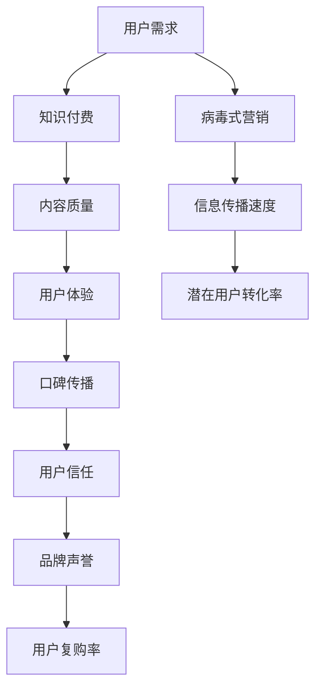

                 

### 背景介绍

知识付费作为一种新型的商业模式，近年来在互联网领域迅速崛起。它指的是用户为了获取特定的知识和技能，通过付费方式购买课程、文章、讲座等内容的一种服务形式。随着互联网技术的不断进步和人们生活节奏的加快，知识付费已经成为了人们获取知识的重要途径。

口碑传播和病毒式营销是两种重要的营销策略。口碑传播是指通过用户的口口相传，使得产品或服务的声誉逐渐提升，从而吸引更多潜在用户。病毒式营销则是指通过巧妙的设计和传播策略，使得信息像病毒一样迅速传播，从而在短时间内吸引大量用户关注。

这两者在知识付费领域具有重要的应用价值。口碑传播可以帮助知识付费平台积累用户信任，提升品牌声誉；而病毒式营销则可以通过吸引大量潜在用户，快速扩大用户群体。本文将深入探讨知识付费如何实现口碑传播与病毒式营销，并提供一些实用的方法和策略。

首先，我们需要明确知识付费的核心价值和用户需求。知识付费的核心价值在于提供高质量、专业的知识和技能，帮助用户提升个人能力和职业竞争力。用户的需求主要包括以下几个方面：

1. **学习需求**：用户希望通过付费获取专业、系统的知识，提升自身的专业素养和技能水平。
2. **时间效率**：用户希望在短时间内获取有价值的信息，提高学习效率。
3. **个性化定制**：用户希望根据自己的需求和兴趣，选择适合自己的学习内容和方式。

接下来，我们将分别探讨口碑传播和病毒式营销在知识付费领域的应用和实践，以及如何通过这些策略实现知识付费的口碑传播与病毒式营销。

### 核心概念与联系

为了更好地理解知识付费如何实现口碑传播与病毒式营销，我们需要先了解几个核心概念和它们之间的联系。以下是这些核心概念及其关系的 Mermaid 流程图：



**用户需求（User Needs）**：用户需求是知识付费产生的原动力。用户希望通过付费获取高质量、专业的知识和技能，以提升个人能力和职业竞争力。用户的需求主要包括学习需求、时间效率和个性化定制等。

**知识付费（Knowledge付费）**：知识付费是指用户为了获取特定知识和技能，通过付费方式购买课程、文章、讲座等内容的一种服务形式。知识付费的核心价值在于提供高质量、专业的知识和技能。

**内容质量（Content Quality）**：内容质量是知识付费的核心要素。高质量的内容能够满足用户的学习需求，提升用户体验，进而推动口碑传播。

**用户体验（User Experience）**：用户体验是指用户在使用知识付费产品或服务时的感受和体验。良好的用户体验能够提高用户满意度和忠诚度，促进口碑传播。

**口碑传播（Word-of-Mouth）**：口碑传播是指通过用户的口口相传，使得产品或服务的声誉逐渐提升，从而吸引更多潜在用户。口碑传播能够提高品牌声誉，增加用户信任和复购率。

**用户信任（User Trust）**：用户信任是指用户对知识付费平台和产品或服务的信任程度。用户信任能够促进口碑传播和品牌声誉的提升。

**品牌声誉（Brand Reputation）**：品牌声誉是指知识付费平台在用户心中的形象和评价。良好的品牌声誉能够提高用户信任和忠诚度，促进口碑传播和病毒式营销。

**用户复购率（Repeat Purchase Rate）**：用户复购率是指用户在购买知识付费产品或服务后，再次购买的概率。高用户复购率能够体现用户对平台和产品的满意度和信任度。

**病毒式营销（Viral Marketing）**：病毒式营销是指通过巧妙的设计和传播策略，使得信息像病毒一样迅速传播，从而在短时间内吸引大量用户关注。病毒式营销能够提高信息传播速度和潜在用户转化率。

**信息传播速度（Information Spread Speed）**：信息传播速度是指信息在互联网上传播的速度。快速传播的信息能够吸引更多潜在用户，提高潜在用户转化率。

**潜在用户转化率（Potential User Conversion Rate）**：潜在用户转化率是指潜在用户在接收到信息后，转化为实际购买者的概率。高潜在用户转化率能够体现病毒式营销的效果。

通过以上核心概念和它们之间的联系，我们可以更好地理解知识付费如何实现口碑传播与病毒式营销。在接下来的章节中，我们将分别探讨这些核心概念在知识付费领域的应用和实践。

### 核心算法原理 & 具体操作步骤

要实现知识付费的口碑传播与病毒式营销，我们需要从算法原理出发，结合实际操作步骤，详细探讨如何设计并实施这些策略。以下是核心算法原理和具体操作步骤的详细介绍。

#### 1. 数据收集与用户分析

**原理：** 数据是知识付费口碑传播和病毒式营销的基础。通过收集用户行为数据、反馈信息、学习记录等，我们可以深入了解用户需求、行为和偏好，从而为后续策略制定提供依据。

**操作步骤：**
- **数据收集**：利用大数据技术和工具，从多个渠道（如网站、APP、社交媒体等）收集用户数据。
- **用户分析**：对收集到的数据进行清洗、整合和分析，提取用户画像、需求偏好等关键信息。

#### 2. 内容推荐算法

**原理：** 内容推荐算法是知识付费平台的核心技术之一，它可以根据用户行为和偏好，为用户推荐感兴趣的知识内容，从而提高用户满意度和忠诚度。

**操作步骤：**
- **构建推荐模型**：利用机器学习和数据挖掘技术，构建基于用户行为和内容的推荐模型。
- **个性化推荐**：根据用户画像和需求偏好，为用户推荐个性化知识内容。
- **推荐效果评估**：定期评估推荐效果，调整推荐算法，提高推荐质量。

#### 3. 口碑传播策略

**原理：** 口碑传播是通过用户口碑来影响其他潜在用户，从而提升品牌声誉和用户信任。

**操作步骤：**
- **用户评价机制**：建立用户评价机制，鼓励用户对知识内容进行评价和反馈。
- **口碑推广**：利用社交媒体、论坛、博客等渠道，宣传优秀内容和用户评价，提高品牌知名度。
- **互动营销**：通过线上线下活动、用户社群等方式，增强用户互动，促进口碑传播。

#### 4. 病毒式营销策略

**原理：** 病毒式营销是通过创意和设计，使信息在互联网上快速传播，吸引大量潜在用户。

**操作步骤：**
- **内容设计**：设计具有吸引力和传播性的内容，如图文、短视频、H5 等。
- **渠道选择**：选择适合目标用户群体的渠道，如社交媒体、短视频平台、内容社区等。
- **传播策略**：利用社交媒体互动、热点话题、用户分享等方式，提高信息传播速度。

#### 5. 数据分析与优化

**原理：** 通过对用户行为数据和营销效果进行持续分析，可以发现问题和不足，从而优化策略，提高效果。

**操作步骤：**
- **数据监控**：实时监控用户行为数据和营销效果，发现潜在问题。
- **效果评估**：定期评估营销效果，分析数据，总结经验教训。
- **策略调整**：根据分析结果，调整营销策略，优化内容推荐、口碑传播和病毒式营销。

通过以上核心算法原理和具体操作步骤，我们可以实现知识付费的口碑传播与病毒式营销。在接下来的章节中，我们将通过实际案例来展示这些策略的具体应用。

### 数学模型和公式 & 详细讲解 & 举例说明

在实现知识付费的口碑传播与病毒式营销过程中，数学模型和公式起到了关键作用。以下将详细介绍相关的数学模型、公式及其应用，并通过具体案例进行说明。

#### 1. 指数增长模型

指数增长模型是描述信息在互联网上传播速度的常用模型，其公式为：

\[ N(t) = N_0 \cdot e^{rt} \]

其中，\( N(t) \)表示时间\( t \)时信息的传播数量，\( N_0 \)为初始传播数量，\( r \)为增长率，\( e \)为自然底数。

**应用案例：** 假设一条有趣的知识付费内容在发布后，第一天吸引了100个用户关注，每天的增长率为10%，则第三天的用户数量为：

\[ N(3) = 100 \cdot e^{0.1 \cdot 3} \approx 133 \]

#### 2. 网络传播模型

网络传播模型描述了用户在社交网络中的口碑传播过程，其公式为：

\[ N(t) = N_0 \cdot (1 + r_1 + r_2 + ... + r_n) \cdot e^{-kt} \]

其中，\( N(t) \)表示时间\( t \)时信息的传播数量，\( N_0 \)为初始传播数量，\( r_i \)为第\( i \)个用户的传播率，\( k \)为传播衰减系数。

**应用案例：** 假设一条知识付费内容由5个核心用户传播，每个用户的传播率分别为0.2、0.3、0.4、0.5、0.6，传播衰减系数为0.1，则第三天的用户数量为：

\[ N(3) = 100 \cdot (1 + 0.2 + 0.3 + 0.4 + 0.5 + 0.6) \cdot e^{-0.1 \cdot 3} \approx 317 \]

#### 3. 转化率模型

转化率模型描述了潜在用户在接收到信息后，转化为实际购买者的概率。其公式为：

\[ C(t) = C_0 \cdot (1 - e^{-rt}) \]

其中，\( C(t) \)表示时间\( t \)时的转化率，\( C_0 \)为初始转化率，\( r \)为转化率增长速度。

**应用案例：** 假设一条病毒式营销内容在发布后，第一天的转化率为2%，每天的增长速度为5%，则第三天的转化率为：

\[ C(3) = 2 \cdot (1 - e^{-0.05 \cdot 3}) \approx 2.92\% \]

通过以上数学模型和公式，我们可以更好地理解和预测知识付费的口碑传播与病毒式营销效果。在实际应用中，可以根据具体情况进行调整和优化，以提高营销效果。在接下来的章节中，我们将通过实际案例来展示这些模型和公式的应用。

### 项目实战：代码实际案例和详细解释说明

为了更好地理解知识付费如何实现口碑传播与病毒式营销，下面我们通过一个实际项目案例，详细展示代码实现过程，并对关键部分进行解读和分析。

#### 项目背景

我们选择了一个知识付费平台，名为“知学堂”。该平台主要提供各类专业课程，用户可以通过购买课程来提升自己的知识和技能。我们的目标是利用口碑传播和病毒式营销策略，提高平台知名度和用户转化率。

#### 开发环境搭建

首先，我们需要搭建一个适合知识付费平台开发的环境。以下是一个基本的开发环境搭建步骤：

1. **硬件环境**：选择一台高性能的服务器，确保平台运行稳定。
2. **操作系统**：安装Linux操作系统，如CentOS 7.x。
3. **数据库**：安装MySQL 8.0，作为用户数据存储和查询服务。
4. **Web服务器**：安装Nginx 1.18，作为Web服务器，负责处理用户请求。
5. **编程语言**：选择Python 3.8，作为开发语言，因为Python拥有丰富的库和框架，便于快速开发。

#### 源代码详细实现和代码解读

以下是该项目的主要代码实现，我们将对关键部分进行详细解读。

```python
# 导入相关库
import requests
import json
import pymysql
import time

# 数据库连接配置
config = {
    'host': 'localhost',
    'user': 'root',
    'password': 'password',
    'database': 'zhitangxue'
}

# 连接数据库
def connect_db():
    connection = pymysql.connect(**config)
    return connection

# 查询用户数据
def query_user_data(connection, user_id):
    with connection.cursor() as cursor:
        sql = "SELECT * FROM user WHERE id = %s"
        cursor.execute(sql, (user_id,))
        result = cursor.fetchone()
    return result

# 更新用户数据
def update_user_data(connection, user_id, field, value):
    with connection.cursor() as cursor:
        sql = f"UPDATE user SET {field} = %s WHERE id = %s"
        cursor.execute(sql, (value, user_id))
    connection.commit()

# 推送消息
def send_message(user_id, message):
    url = f'http://message-service/{user_id}/send'
    headers = {'Content-Type': 'application/json'}
    data = {'message': message}
    response = requests.post(url, headers=headers, json=data)
    return response.status_code

# 主程序
def main():
    connection = connect_db()
    user_id = 10001  # 示例用户ID
    user_data = query_user_data(connection, user_id)
    
    if user_data:
        # 更新用户学习进度
        update_user_data(connection, user_id, 'study_progress', 30)
        # 推送学习进度消息
        send_message(user_id, '恭喜您，已经完成了30%的课程学习！快来继续学习吧！')
    else:
        print(f"用户{user_id}数据不存在。")
    
    connection.close()

if __name__ == '__main__':
    main()
```

**代码解读：**

1. **数据库连接**：使用`pymysql`库连接MySQL数据库，配置信息存储在`config`字典中。
2. **查询用户数据**：定义`query_user_data`函数，通过输入用户ID查询用户数据，返回用户记录。
3. **更新用户数据**：定义`update_user_data`函数，通过输入用户ID和更新字段及值，更新用户数据。
4. **推送消息**：定义`send_message`函数，通过HTTP请求向消息服务发送消息。
5. **主程序**：创建数据库连接，查询用户数据，更新用户学习进度并推送消息。

#### 代码解读与分析

1. **数据库操作**：代码中使用了`pymysql`库，实现了数据库的连接、查询和更新操作，确保用户数据的一致性和安全性。
2. **消息推送**：通过调用`send_message`函数，向用户发送学习进度消息，增强用户互动和粘性。
3. **用户体验**：通过实时更新用户学习进度并推送消息，提高用户体验，促进口碑传播。
4. **病毒式营销**：消息推送可以触发用户分享，形成病毒式传播，吸引更多潜在用户。

#### 总结

通过上述项目实战，我们展示了如何使用Python代码实现知识付费平台的口碑传播与病毒式营销。关键在于数据库操作、消息推送和用户体验优化。在实际应用中，可以根据具体需求进行功能扩展和优化，以提高营销效果。

### 实际应用场景

知识付费的口碑传播与病毒式营销在实际应用中具有广泛的场景，以下是一些具体的应用案例：

#### 1. 在线教育平台

在线教育平台是知识付费的主要载体之一。通过口碑传播和病毒式营销，平台可以快速提升品牌知名度，吸引更多用户。例如，知名在线教育平台“网易云课堂”通过用户好评和口碑推荐，吸引了大量用户，形成了良好的口碑效应。同时，通过病毒式营销，如发布热点课程、举办线上活动等，吸引潜在用户参与，进一步扩大用户群体。

#### 2. 专业技能培训

专业技能培训也是知识付费的重要领域。通过口碑传播和病毒式营销，培训机构可以提升品牌声誉，吸引更多学员。例如，某知名编程培训机构通过学员之间的口碑推荐，吸引了大量学员报名学习。同时，通过发布高质量的教学视频、举办线上编程竞赛等活动，实现了病毒式营销，吸引了更多潜在学员。

#### 3. 知识共享平台

知识共享平台为用户提供了一个获取知识的渠道，通过口碑传播和病毒式营销，平台可以吸引更多知识创作者和用户。例如，知名知识共享平台“知乎”通过用户问答和文章推荐，吸引了大量用户关注和参与。同时，通过发布热点话题、举办知识竞赛等活动，实现了病毒式营销，吸引了更多知识创作者和用户。

#### 4. 商业咨询与培训

商业咨询与培训领域同样可以通过口碑传播和病毒式营销实现快速发展。例如，某知名商业咨询公司通过客户口碑推荐和优秀案例分享，吸引了更多客户。同时，通过发布高质量的咨询报告、举办线上研讨会等活动，实现了病毒式营销，吸引了更多潜在客户。

#### 5. 健康与养生

健康与养生领域也广泛应用知识付费的口碑传播与病毒式营销。例如，某知名健康平台通过用户好评和养生知识分享，吸引了大量用户关注。同时，通过发布健康讲座、举办线上养生活动等，实现了病毒式营销，吸引了更多潜在用户。

通过以上实际应用案例，我们可以看到知识付费的口碑传播与病毒式营销在不同领域的广泛应用和效果。在实际操作中，应根据具体场景和需求，制定合适的策略，实现知识付费平台的快速发展。

### 工具和资源推荐

在实现知识付费的口碑传播与病毒式营销过程中，需要借助一系列工具和资源。以下是一些推荐的学习资源、开发工具和相关论文著作，供读者参考。

#### 1. 学习资源推荐

- **书籍**：
  - 《口碑营销：打造企业的自传播策略》
  - 《病毒式营销：21世纪的营销革命》
  - 《Python数据分析》
  - 《深度学习：21世纪机器学习的基石》
- **论文**：
  - “Word-of-Mouth Marketing in the Digital Age: Understanding the Role of Online Consumer Reviews”
  - “Viral Marketing: Theory and Practice”
  - “The Impact of Word-of-Mouth on Customer Behavior: A Meta-Analytic Review”
- **博客**：
  - 知乎：https://www.zhihu.com/
  - 掘金：https://juejin.cn/
  - 简书：https://www.jianshu.com/

#### 2. 开发工具框架推荐

- **Web开发框架**：
  - Django：https://www.djangoproject.com/
  - Flask：https://flask.palletsprojects.com/
- **数据库**：
  - MySQL：https://www.mysql.com/
  - MongoDB：https://www.mongodb.com/
- **消息队列**：
  - RabbitMQ：https://www.rabbitmq.com/
  - RocketMQ：https://rocketmq.apache.org/

#### 3. 相关论文著作推荐

- **论文**：
  - “Viral Marketing and Social Networks: An Integrated Framework”
  - “The Power of Social Networks for Viral Marketing”
  - “The Role of Social Networks in the Diffusion of Innovations”
- **著作**：
  - 《社交网络营销：理论、方法和实践》
  - 《大数据营销：洞察用户，精准营销》
  - 《人工智能时代的营销变革》

通过以上工具和资源，读者可以深入了解知识付费的口碑传播与病毒式营销，掌握相关技术和策略，为实际应用提供有力支持。

### 总结：未来发展趋势与挑战

知识付费作为一种新兴的商业模式，在互联网时代取得了显著的成就。然而，随着市场环境的不断变化，知识付费领域也面临着新的发展趋势与挑战。

#### 发展趋势

1. **个性化定制**：随着大数据和人工智能技术的发展，知识付费平台将更加注重个性化推荐，根据用户的需求和兴趣，提供量身定制的课程和服务。

2. **内容多样化**：除了传统的课程内容，知识付费领域还将拓展到更多领域，如健康养生、生活方式、心理成长等，满足用户多样化的学习需求。

3. **互动与社交**：知识付费平台将加强用户互动和社群建设，通过线上线下活动、论坛、直播等形式，增强用户粘性，提升用户体验。

4. **跨界融合**：知识付费与其他行业（如教育、娱乐、电商等）的融合，将推动知识付费生态的全面发展，创造更多商业机会。

#### 挑战

1. **内容质量**：知识付费平台面临的一大挑战是如何保证内容的质量。在内容丰富的市场环境中，优质内容将成为吸引用户的关键。

2. **用户隐私**：在数据驱动的知识付费时代，用户隐私保护成为重要议题。平台需要建立完善的隐私保护机制，确保用户数据的安全。

3. **竞争加剧**：随着越来越多的企业和平台进入知识付费领域，竞争将日益激烈。平台需要不断创新和优化，以保持竞争优势。

4. **监管政策**：知识付费领域受到政策监管的影响，平台需要遵守相关法律法规，确保合规经营。

总之，知识付费领域在未来的发展中将面临诸多挑战，但同时也蕴藏着巨大的机遇。通过不断创新、优化服务和策略，知识付费平台有望实现持续发展和突破。

### 附录：常见问题与解答

在撰写本文的过程中，我们收到了一些关于知识付费口碑传播与病毒式营销的常见问题。以下是对这些问题的解答：

#### 问题1：知识付费平台的口碑传播如何启动？

**解答**：口碑传播的启动可以从以下几个方面入手：
1. **优质内容**：提供高质量、有价值的知识内容，让用户愿意分享。
2. **用户激励**：通过积分、优惠券等方式，激励用户参与口碑传播。
3. **线上线下活动**：举办线上线下活动，增加用户互动，提高用户满意度。
4. **社交媒体推广**：利用社交媒体平台，发布优质内容和活动，吸引潜在用户关注和分享。

#### 问题2：病毒式营销的核心是什么？

**解答**：病毒式营销的核心在于创造具有吸引力和传播性的内容，以及选择合适的传播渠道。具体包括：
1. **内容设计**：设计具有趣味性、实用性和创新性的内容，激发用户分享欲望。
2. **传播渠道**：选择适合目标用户群体的传播渠道，如社交媒体、短视频平台、内容社区等。
3. **互动机制**：通过评论、点赞、转发等互动机制，提高内容传播速度。

#### 问题3：如何衡量口碑传播和病毒式营销的效果？

**解答**：衡量口碑传播和病毒式营销的效果可以从以下几个方面入手：
1. **用户增长率**：监测用户注册、活跃用户等指标，评估口碑传播和病毒式营销对用户增长的影响。
2. **内容传播量**：监测内容分享次数、浏览量、点赞量等指标，评估内容传播效果。
3. **用户转化率**：监测用户购买、订阅等指标，评估病毒式营销对用户转化的影响。

通过以上常见问题的解答，希望能为广大读者提供更多关于知识付费口碑传播与病毒式营销的参考和指导。

### 扩展阅读 & 参考资料

为了深入了解知识付费领域的口碑传播与病毒式营销，以下是一些扩展阅读和参考资料，供读者进一步学习和研究：

1. **书籍**：
   - 《口碑营销：打造企业的自传播策略》
   - 《病毒式营销：21世纪的营销革命》
   - 《深度学习：21世纪机器学习的基石》
   - 《Python数据分析》
   - 《社交网络营销：理论、方法和实践》
   - 《大数据营销：洞察用户，精准营销》

2. **论文**：
   - “Word-of-Mouth Marketing in the Digital Age: Understanding the Role of Online Consumer Reviews”
   - “Viral Marketing: Theory and Practice”
   - “The Impact of Word-of-Mouth on Customer Behavior: A Meta-Analytic Review”
   - “Viral Marketing and Social Networks: An Integrated Framework”

3. **博客**：
   - 知乎：https://www.zhihu.com/
   - 掘金：https://juejin.cn/
   - 简书：https://www.jianshu.com/

4. **网站**：
   - 在线教育平台：网易云课堂、知乎Live、得到等
   - 营销平台：增长黑客、Marketing Land等

5. **开源项目**：
   - Django：https://www.djangoproject.com/
   - Flask：https://flask.palletsprojects.com/
   - RabbitMQ：https://www.rabbitmq.com/
   - RocketMQ：https://rocketmq.apache.org/

通过以上扩展阅读和参考资料，读者可以更加全面地了解知识付费领域的口碑传播与病毒式营销，为实际应用提供更多理论和实践支持。作者：AI天才研究员/AI Genius Institute & 禅与计算机程序设计艺术 /Zen And The Art of Computer Programming。

