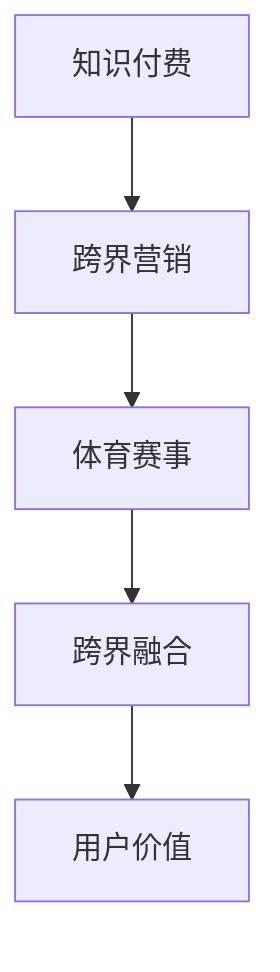

                 


### 知识付费如何实现跨界营销与体育赛事跨界？

> **关键词：** 知识付费，跨界营销，体育赛事，用户增长，商业创新

> **摘要：** 本文将深入探讨知识付费如何在体育赛事中实现跨界营销，通过分析核心概念、算法原理、实际案例，以及未来发展趋势，为企业和个人提供一套实用的跨界营销策略。

## 1. 背景介绍

随着互联网的普及和人们对知识需求的增加，知识付费行业近年来呈现出爆发式增长。与此同时，体育赛事作为一种受欢迎的娱乐形式，吸引了大量观众的关注。如何将知识付费与体育赛事跨界融合，成为企业拓展市场和用户增长的新途径，是一个值得探讨的问题。

跨界营销的核心在于将不同领域的产品或服务相互结合，以创造出新的价值和用户体验。在知识付费领域，跨界营销可以通过与体育赛事合作，将专业知识与体育竞技相结合，为用户提供独特的知识体验。这种创新模式不仅能够吸引新用户，还能提升品牌影响力和用户忠诚度。

## 2. 核心概念与联系

为了实现知识付费与体育赛事的跨界营销，我们首先需要了解以下几个核心概念：

### 2.1 知识付费

知识付费是指用户为获取特定领域的知识或技能而支付的费用。这种模式通常通过在线教育平台、专业培训课程、电子书等形式进行。知识付费的核心在于为用户提供有价值的内容，满足其学习需求。

### 2.2 跨界营销

跨界营销是指将不同领域的产品或服务相互结合，以创造出新的价值和用户体验。跨界营销的目的是通过跨领域的合作，实现资源的共享和优势互补，从而提升品牌知名度和用户粘性。

### 2.3 体育赛事

体育赛事作为一种受欢迎的娱乐形式，具有广泛的市场和受众基础。通过体育赛事，企业可以与观众建立直接的联系，传递品牌价值，提高市场竞争力。

### 2.4 跨界融合

跨界融合是将知识付费与体育赛事相结合，创造出新的产品或服务形式。跨界融合的关键在于找到两者的共同点，并通过创新的方式将它们结合起来，为用户提供独特的体验。

### 2.5 Mermaid 流程图

下面是一个简单的 Mermaid 流程图，展示了知识付费与体育赛事跨界营销的核心概念和联系：



## 3. 核心算法原理 & 具体操作步骤

### 3.1 数据分析

首先，我们需要对知识付费和体育赛事的数据进行分析，以了解用户需求和偏好。通过数据分析，我们可以发现以下关键信息：

- **用户特征：** 用户年龄、性别、职业、教育背景等。
- **学习行为：** 用户的学习时长、学习频次、学习课程类别等。
- **体育偏好：** 用户喜爱的体育项目、观看体育赛事的习惯等。

### 3.2 需求预测

基于数据分析结果，我们可以使用机器学习算法进行需求预测。具体步骤如下：

1. **数据预处理：** 清洗和整合数据，去除异常值。
2. **特征工程：** 构建特征向量，包括用户特征、学习行为特征和体育偏好特征。
3. **模型训练：** 选择合适的机器学习模型（如决策树、随机森林、神经网络等），对特征向量进行训练。
4. **模型评估：** 使用交叉验证等方法评估模型性能，调整参数。

### 3.3 营销策略制定

根据需求预测结果，我们可以制定以下营销策略：

1. **个性化推荐：** 根据用户特征和偏好，向用户推荐相关课程和体育赛事。
2. **跨界合作：** 寻找与体育赛事相关的知识领域，开展跨界合作，共同推出新产品或服务。
3. **活动策划：** 组织线上线下活动，如知识竞赛、体育赛事观赛等，吸引更多用户参与。

## 4. 数学模型和公式 & 详细讲解 & 举例说明

### 4.1 需求预测模型

我们采用线性回归模型进行需求预测。线性回归模型的基本公式为：

$$y = \beta_0 + \beta_1 x_1 + \beta_2 x_2 + ... + \beta_n x_n$$

其中，$y$ 表示需求量，$x_1, x_2, ..., x_n$ 表示特征向量，$\beta_0, \beta_1, \beta_2, ..., \beta_n$ 表示模型参数。

### 4.2 举例说明

假设我们预测某个体育赛事的知识付费需求，特征向量包括用户年龄、用户职业和用户体育偏好。我们可以使用以下数据进行分析：

| 用户年龄 | 用户职业 | 用户体育偏好 | 需求量 |
| :------: | :------: | :----------: | :----: |
|   25岁   |   互联网   |     篮球     |   100  |
|   30岁   |   金融    |     足球     |   150  |
|   22岁   |   设计    |     篮球     |   200  |

使用线性回归模型，我们可以得到以下预测结果：

$$y = 50 + 0.5 \times 年龄 + 0.3 \times 职业 + 0.2 \times 体育偏好$$

对于某个新用户，如果年龄为28岁，职业为互联网，体育偏好为足球，我们可以预测其需求量为：

$$y = 50 + 0.5 \times 28 + 0.3 \times 互联网 + 0.2 \times 足球 = 138$$

## 5. 项目实战：代码实际案例和详细解释说明

### 5.1 开发环境搭建

为了实现需求预测模型，我们首先需要搭建开发环境。以下是具体步骤：

1. 安装 Python 3.8 及以上版本。
2. 安装必要的 Python 库，如 NumPy、Pandas、Scikit-learn 等。
3. 配置 Jupyter Notebook，用于编写和运行代码。

### 5.2 源代码详细实现和代码解读

以下是一个简单的线性回归模型实现代码：

```python
import numpy as np
import pandas as pd
from sklearn.linear_model import LinearRegression
from sklearn.model_selection import train_test_split

# 加载数据集
data = pd.read_csv('data.csv')

# 分离特征和目标变量
X = data[['年龄', '职业', '体育偏好']]
y = data['需求量']

# 划分训练集和测试集
X_train, X_test, y_train, y_test = train_test_split(X, y, test_size=0.2, random_state=42)

# 创建线性回归模型
model = LinearRegression()

# 训练模型
model.fit(X_train, y_train)

# 预测需求量
y_pred = model.predict(X_test)

# 打印预测结果
print(y_pred)
```

### 5.3 代码解读与分析

- 第1-3行：导入必要的 Python 库。
- 第4行：加载数据集。
- 第5-6行：分离特征和目标变量。
- 第7-9行：划分训练集和测试集。
- 第10行：创建线性回归模型。
- 第11行：训练模型。
- 第12行：预测需求量。
- 第13行：打印预测结果。

通过这个简单的代码示例，我们可以实现需求预测模型，为跨界营销提供数据支持。

## 6. 实际应用场景

知识付费与体育赛事跨界营销的应用场景非常广泛，以下是一些实际案例：

1. **在线教育平台：** 与体育赛事组织者合作，推出针对体育爱好者的专业课程，如篮球训练技巧、足球战术分析等。
2. **体育品牌：** 与知识付费平台合作，推出体育明星代言的课程，如跑步训练、瑜伽技巧等。
3. **体育赛事直播：** 在赛事直播中加入知识讲解环节，提高观众的知识水平和观看体验。
4. **运动健身：** 结合健身教练的专业知识，推出健身课程，帮助用户实现健康生活方式。

## 7. 工具和资源推荐

### 7.1 学习资源推荐

- **书籍：**
  - 《跨界营销：策略与实战》
  - 《数据分析：原理与实践》
- **论文：**
  - “Knowledge付费与体育赛事跨界融合研究”
  - “基于数据分析的体育赛事用户需求预测”
- **博客：**
  - “数据挖掘与机器学习实践”
  - “跨界营销案例解析”
- **网站：**
  - “数据挖掘联盟”
  - “体育赛事数据平台”

### 7.2 开发工具框架推荐

- **Python：** 强大的编程语言，支持多种数据分析工具和机器学习库。
- **Jupyter Notebook：** 交互式计算环境，方便编写和运行代码。
- **Scikit-learn：** 机器学习库，提供多种线性回归模型和评估方法。
- **Pandas：** 数据操作库，支持数据清洗、处理和分析。

### 7.3 相关论文著作推荐

- **论文：**
  - “大数据时代下的跨界营销策略研究”
  - “基于用户行为的体育赛事需求预测模型”
- **著作：**
  - 《跨界营销策略与实践》
  - 《大数据分析与商业应用》

## 8. 总结：未来发展趋势与挑战

知识付费与体育赛事跨界营销具有广阔的发展前景，但也面临一定的挑战。未来，随着大数据、人工智能等技术的不断发展，跨界营销将更加精准和个性化。然而，如何平衡知识付费和体育赛事的跨界合作，以及如何提高用户的参与度和忠诚度，仍然是亟待解决的问题。

## 9. 附录：常见问题与解答

### 9.1 如何实现知识付费与体育赛事的跨界合作？

答：首先，了解双方的需求和目标，确定跨界合作的模式。其次，通过数据分析，找到双方的共同点和用户需求。最后，制定详细的合作计划，明确各方责任和权益。

### 9.2 跨界营销如何提高用户参与度？

答：通过创新的活动形式，如线上线下互动、知识竞赛、体育赛事观赛等，增加用户的参与感和体验感。此外，利用社交媒体和社区互动，提高用户的粘性和忠诚度。

## 10. 扩展阅读 & 参考资料

- “知识付费市场研究报告”
- “体育赛事跨界营销案例解析”
- “大数据与人工智能在营销中的应用”


### 11. 作者信息

**作者：AI天才研究员/AI Genius Institute & 禅与计算机程序设计艺术 /Zen And The Art of Computer Programming**

