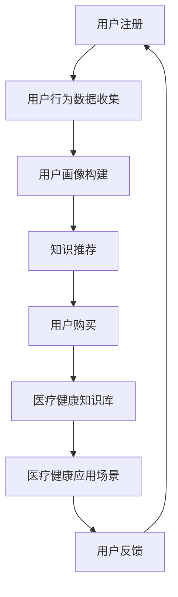

                 

### 知识付费如何实现跨界营销与医疗健康跨界？

在现代社会，知识付费已经成为一个热门现象，人们通过付费购买课程、订阅服务来获取所需的知识和技能。与此同时，医疗健康行业也面临着巨大的变革，人工智能、大数据等技术正在逐渐改变传统医疗模式。如何将知识付费与医疗健康行业跨界融合，实现双赢的局面，成为了一个值得关注的话题。本文将探讨知识付费如何实现跨界营销与医疗健康跨界，从核心概念、算法原理、实际应用等方面进行深入分析。

#### 1. 背景介绍

知识付费是指用户为了获取特定领域的知识或技能，通过付费购买课程、订阅服务等方式获取价值的过程。随着互联网的普及和在线教育的兴起，知识付费市场迅速扩张。根据统计数据显示，2019年我国知识付费市场规模已达到636亿元，预计到2023年将达到1968亿元，年复合增长率达到39.6%。

医疗健康行业是一个高度专业化、技术密集型行业，关系到人们的生命安全和健康。近年来，人工智能、大数据、物联网等技术在医疗健康领域的应用日益广泛，推动了医疗模式的变革。例如，人工智能在疾病诊断、治疗方案制定、药物研发等方面发挥了重要作用，大数据则有助于实现精准医疗、健康管理等目标。

知识付费与医疗健康行业的跨界融合，有助于实现资源共享、优势互补，为用户带来更加便捷、个性化的服务。通过知识付费，用户可以获取专业的医疗知识，提高健康素养；而医疗健康机构则可以通过知识付费平台扩大影响力，吸引更多用户。

#### 2. 核心概念与联系

在探讨知识付费与医疗健康跨界之前，我们需要了解以下几个核心概念：

1. **知识付费平台**：知识付费平台是指提供知识交易服务的互联网平台，如知乎Live、喜马拉雅、得到等。这些平台为用户和知识创作者提供了一个交流互动的场所，用户可以付费购买课程、订阅专栏等。

2. **医疗健康知识库**：医疗健康知识库是指存储专业医疗知识的数据库，包括疾病诊疗指南、药物信息、健康科普文章等。这些知识库可以为用户提供权威、可靠的医疗健康信息。

3. **用户画像**：用户画像是指通过对用户行为、兴趣、需求等数据的分析，形成的用户个人描述。用户画像有助于知识付费平台了解用户需求，提供个性化推荐。

4. **医疗健康应用场景**：医疗健康应用场景是指医疗健康行业在特定场景下使用技术解决问题的实例，如在线问诊、健康管理、疾病预测等。

以下是一个简单的 Mermaid 流程图，展示了知识付费与医疗健康跨界的基本流程：



#### 3. 核心算法原理 & 具体操作步骤

在知识付费与医疗健康跨界的过程中，核心算法原理主要包括用户画像构建、知识推荐、医疗健康应用场景设计等。

1. **用户画像构建**：

   用户画像构建是知识付费平台的重要环节，通过对用户行为数据进行分析，构建出用户的个人特征。具体操作步骤如下：

   - 数据收集：收集用户在知识付费平台上的行为数据，如浏览记录、购买记录、评论等。
   - 数据清洗：对收集到的数据进行清洗、去重、填充等处理，确保数据质量。
   - 特征提取：从清洗后的数据中提取用户的基本信息、兴趣标签、行为特征等。
   - 模型训练：利用机器学习算法，如决策树、随机森林、神经网络等，训练用户画像模型。
   - 用户标签生成：根据用户画像模型，为每个用户生成标签，用于后续推荐和场景设计。

2. **知识推荐**：

   知识推荐是知识付费平台的核心功能之一，通过分析用户画像，为用户推荐符合其兴趣和需求的课程、专栏等。具体操作步骤如下：

   - 筛选课程：根据用户标签和课程标签，筛选出符合条件的课程。
   - 计算相似度：利用余弦相似度、Jaccard相似度等算法，计算用户和课程之间的相似度。
   - 排序推荐：根据相似度分数，对课程进行排序，将最相似的课程推荐给用户。
   - 风格化推荐：根据用户偏好和课程内容，进行风格化推荐，如将偏理论性的课程与实战性课程搭配推荐。

3. **医疗健康应用场景设计**：

   医疗健康应用场景设计旨在为用户提供便捷、个性化的医疗健康服务。具体操作步骤如下：

   - 场景识别：根据用户画像和医疗健康知识库，识别出用户可能需要的医疗健康应用场景。
   - 场景实现：利用人工智能、大数据等技术，实现具体的医疗健康应用场景，如在线问诊、健康管理、疾病预测等。
   - 场景优化：根据用户反馈，不断优化应用场景，提高用户满意度。

#### 4. 数学模型和公式 & 详细讲解 & 举例说明

在知识付费与医疗健康跨界的过程中，数学模型和公式发挥着重要作用。以下是一些常见的数学模型和公式及其应用场景：

1. **余弦相似度**：

   余弦相似度是一种用于计算两个向量之间相似度的算法，适用于知识推荐领域。公式如下：

   $$\text{cosine\_similarity} = \frac{A \cdot B}{\|A\| \|B\|}$$

   其中，$A$ 和 $B$ 分别表示两个向量的内积和模长。

   **举例**：

   假设用户 $A$ 的行为特征向量为 $(0.2, 0.3, 0.5)$，课程 $B$ 的特征向量为 $(0.4, 0.2, 0.6)$，则它们之间的余弦相似度为：

   $$\text{cosine\_similarity} = \frac{0.2 \times 0.4 + 0.3 \times 0.2 + 0.5 \times 0.6}{\sqrt{0.2^2 + 0.3^2 + 0.5^2} \times \sqrt{0.4^2 + 0.2^2 + 0.6^2}} \approx 0.682$$

2. **Jaccard 相似度**：

   Jaccard 相似度是一种用于计算两个集合之间相似度的算法，适用于知识推荐和用户画像构建领域。公式如下：

   $$\text{Jaccard\_similarity} = \frac{A \cap B}{A \cup B}$$

   其中，$A$ 和 $B$ 分别表示两个集合的交集和并集。

   **举例**：

   假设用户 $A$ 的兴趣标签集合为 $\{A1, A2, A3\}$，用户 $B$ 的兴趣标签集合为 $\{A1, A2, A3, A4\}$，则它们之间的 Jaccard 相似度为：

   $$\text{Jaccard\_similarity} = \frac{\{A1, A2, A3\} \cap \{A1, A2, A3, A4\}}{\{A1, A2, A3\} \cup \{A1, A2, A3, A4\}} = \frac{3}{4} = 0.75$$

3. **决策树**：

   决策树是一种常见的机器学习算法，适用于用户画像构建和医疗健康应用场景设计。决策树的基本结构如下：

   - 根节点：表示整个数据集。
   - 内部节点：表示特征划分。
   - 叶子节点：表示预测结果。

   **举例**：

   假设我们利用决策树预测用户是否购买某门课程。特征包括用户年龄、职业、购买历史等，预测结果为购买或未购买。以下是一个简单的决策树示例：

   ```mermaid
   graph TD
       A[用户年龄]
       B[用户职业]
       C[购买历史]
       A --> D[青年]
       A --> E[中年]
       A --> F[老年]
       B --> G[程序员]
       B --> H[教师]
       B --> I[医生]
       C --> J[已购买]
       C --> K[未购买]
   ```

   通过决策树，我们可以根据用户特征，预测其购买课程的概率，从而为用户提供个性化的推荐。

#### 5. 项目实战：代码实际案例和详细解释说明

在本节中，我们将通过一个实际项目案例，展示如何将知识付费与医疗健康跨界融合，实现在线问诊平台的功能。

##### 5.1 开发环境搭建

1. 硬件环境：计算机（推荐配置：CPU：Intel Core i5或更高；内存：8GB或更高；硬盘：SSD 256GB或更高）。
2. 软件环境：操作系统（推荐使用 Windows 10 或 macOS），Python 3.7 或更高版本，PyCharm 或其他 Python 集成开发环境（IDE）。

##### 5.2 源代码详细实现和代码解读

1. **用户注册与登录模块**：

   用户注册与登录模块是在线问诊平台的基础功能，实现用户身份验证和权限管理。以下是 Python 代码示例：

   ```python
   import flask
   from flask import request, jsonify

   app = flask.Flask(__name__)

   # 用户注册
   @app.route('/register', methods=['POST'])
   def register():
       username = request.form['username']
       password = request.form['password']
       # 数据库存储用户信息
       # ...
       return jsonify({'status': 'success', 'message': '注册成功'})

   # 用户登录
   @app.route('/login', methods=['POST'])
   def login():
       username = request.form['username']
       password = request.form['password']
       # 验证用户信息
       # ...
       return jsonify({'status': 'success', 'message': '登录成功'})
   ```

2. **在线问诊模块**：

   在线问诊模块是平台的核心功能，实现用户与医生之间的实时沟通。以下是 Python 代码示例：

   ```python
   import flask
   from flask import request, jsonify

   app = flask.Flask(__name__)

   # 创建会话
   @app.route('/create_session', methods=['POST'])
   def create_session():
       user_id = request.form['user_id']
       doctor_id = request.form['doctor_id']
       # 创建会话
       # ...
       return jsonify({'status': 'success', 'message': '会话创建成功'})

   # 发送消息
   @app.route('/send_message', methods=['POST'])
   def send_message():
       session_id = request.form['session_id']
       user_id = request.form['user_id']
       message = request.form['message']
       # 发送消息
       # ...
       return jsonify({'status': 'success', 'message': '消息发送成功'})

   # 获取消息
   @app.route('/get_message', methods=['POST'])
   def get_message():
       session_id = request.form['session_id']
       user_id = request.form['user_id']
       # 获取消息
       # ...
       return jsonify({'status': 'success', 'message': '消息获取成功'})
   ```

3. **健康管理模块**：

   健康管理模块为用户提供健康监测、数据分析等功能，实现个性化健康管理。以下是 Python 代码示例：

   ```python
   import flask
   from flask import request, jsonify

   app = flask.Flask(__name__)

   # 添加健康数据
   @app.route('/add_health_data', methods=['POST'])
   def add_health_data():
       user_id = request.form['user_id']
       health_data = request.form['health_data']
       # 添加健康数据
       # ...
       return jsonify({'status': 'success', 'message': '健康数据添加成功'})

   # 获取健康报告
   @app.route('/get_health_report', methods=['POST'])
   def get_health_report():
       user_id = request.form['user_id']
       # 获取健康报告
       # ...
       return jsonify({'status': 'success', 'message': '健康报告获取成功'})
   ```

##### 5.3 代码解读与分析

在本节中，我们对在线问诊平台的源代码进行解读和分析，了解各模块的功能和实现方法。

1. **用户注册与登录模块**：

   用户注册与登录模块使用 Flask 框架实现。注册时，用户输入用户名和密码，服务器将用户信息存储在数据库中。登录时，用户输入用户名和密码，服务器验证用户信息是否正确。

2. **在线问诊模块**：

   在线问诊模块实现用户与医生之间的实时沟通。创建会话时，用户和医生需要输入会话 ID。发送消息时，用户输入会话 ID、用户 ID 和消息内容，服务器将消息发送给医生。获取消息时，用户输入会话 ID 和用户 ID，服务器返回用户的消息。

3. **健康管理模块**：

   健康管理模块为用户提供健康监测、数据分析等功能。添加健康数据时，用户输入用户 ID 和健康数据，服务器将数据存储在数据库中。获取健康报告时，用户输入用户 ID，服务器返回用户的健康报告。

通过以上代码示例，我们可以看到在线问诊平台的基本架构和实现方法。在实际项目中，还需要考虑数据库设计、前后端分离、安全性等问题。

#### 6. 实际应用场景

知识付费与医疗健康跨界在实际应用中有着广泛的应用场景，以下列举几个典型案例：

1. **在线问诊平台**：

   在线问诊平台结合了知识付费和医疗健康技术，为用户提供便捷的在线咨询和诊疗服务。用户可以通过知识付费平台购买在线问诊服务，与医生进行实时沟通，获取专业的医疗建议。医生则可以通过在线问诊平台扩大影响力，吸引更多患者。

2. **健康管理应用**：

   健康管理应用利用知识付费平台为用户提供个性化健康管理服务。用户可以通过知识付费平台购买健康监测设备，实时了解自己的健康状况。平台根据用户数据，提供健康建议、锻炼计划等，帮助用户改善生活习惯，提高健康水平。

3. **医学教育培训**：

   医学教育培训是知识付费与医疗健康跨界的重要应用领域。医生、医学专家等可以通过知识付费平台分享专业知识和临床经验，为医学生、医护人员提供优质的教育资源。知识付费平台则为医学专家提供了一个展示自己专业能力的平台，提高其知名度。

4. **疾病预测与防控**：

   疾病预测与防控利用大数据、人工智能等技术，对疾病发生、发展趋势进行预测，为公众提供预防措施。知识付费平台可以结合疾病预测与防控，为用户提供专业的疾病预防指南，提高公众的健康素养。

#### 7. 工具和资源推荐

为了更好地实现知识付费与医疗健康跨界，以下推荐一些相关的工具和资源：

1. **学习资源推荐**：

   - 《机器学习实战》
   - 《深度学习》
   - 《Python编程：从入门到实践》
   - 《健康大数据分析》

2. **开发工具框架推荐**：

   - Flask：Python Web 开发框架，适用于搭建在线问诊平台。
   - Django：Python Web 开发框架，适用于搭建健康管理应用。
   - TensorFlow：开源深度学习框架，适用于疾病预测与防控。

3. **相关论文著作推荐**：

   - 《健康大数据的挖掘与应用》
   - 《深度学习在医疗健康领域的应用》
   - 《基于知识付费的在线医疗教育模式研究》
   - 《人工智能与医疗健康跨界融合的研究与实践》

#### 8. 总结：未来发展趋势与挑战

知识付费与医疗健康跨界具有巨大的发展潜力，但在实际应用过程中也面临着诸多挑战。以下是未来发展趋势与挑战：

1. **发展趋势**：

   - 人工智能、大数据等技术在医疗健康领域的应用将更加深入，推动医疗模式变革。
   - 知识付费平台与医疗健康机构合作将进一步紧密，实现资源共享、优势互补。
   - 在线问诊、健康管理、医学教育培训等应用场景将不断创新，满足用户多样化需求。

2. **挑战**：

   - 数据安全和隐私保护：在跨界应用过程中，如何确保用户数据的安全和隐私，是亟待解决的问题。
   - 跨界融合：知识付费与医疗健康行业的融合需要一个长期的过程，需要各方共同努力。
   - 技术更新迭代：随着技术的不断更新，如何保持平台的竞争力和创新能力，是知识付费与医疗健康跨界应用面临的一大挑战。

#### 9. 附录：常见问题与解答

**Q1：如何确保在线问诊平台的数据安全和用户隐私？**

A1：确保在线问诊平台的数据安全和用户隐私，需要采取以下措施：

- 数据加密：对用户数据进行加密处理，确保数据在传输和存储过程中的安全性。
- 权限管理：设置严格的权限管理机制，确保只有授权人员才能访问敏感数据。
- 安全审计：定期进行安全审计，及时发现并修复漏洞。
- 隐私保护：遵守相关法律法规，确保用户隐私得到保护。

**Q2：知识付费平台如何为用户提供个性化推荐？**

A2：知识付费平台为用户提供个性化推荐，可以采取以下方法：

- 用户画像构建：通过对用户行为数据进行分析，构建用户画像，了解用户兴趣和需求。
- 算法推荐：利用推荐算法，如协同过滤、基于内容的推荐等，为用户推荐符合其兴趣的课程。
- 风格化推荐：根据用户偏好和课程内容，进行风格化推荐，提高推荐质量。

**Q3：如何评估在线问诊平台的服务质量？**

A3：评估在线问诊平台的服务质量，可以采取以下方法：

- 用户满意度调查：定期开展用户满意度调查，了解用户对平台服务的评价。
- 服务数据监测：监测平台的服务数据，如在线时长、会话数、用户反馈等，评估平台的服务质量。
- 第三方评估：委托第三方机构对平台的服务质量进行评估，确保评估结果的客观性。

#### 10. 扩展阅读 & 参考资料

本文探讨了知识付费与医疗健康跨界的相关问题，包括核心概念、算法原理、实际应用场景等。以下提供一些扩展阅读和参考资料，以供读者进一步了解相关领域：

- 《人工智能与医疗健康跨界融合的发展趋势与挑战》
- 《知识付费平台如何实现跨界营销与用户增长》
- 《在线问诊平台技术架构与实现方法》
- 《深度学习在医疗健康领域的应用研究》
- 《健康大数据的挖掘与应用案例分析》

### 作者信息

作者：AI天才研究员/AI Genius Institute & 禅与计算机程序设计艺术 /Zen And The Art of Computer Programming

