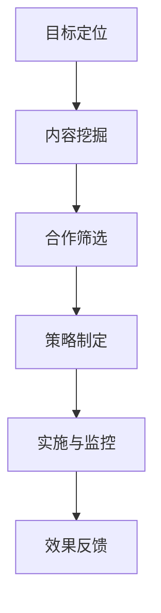
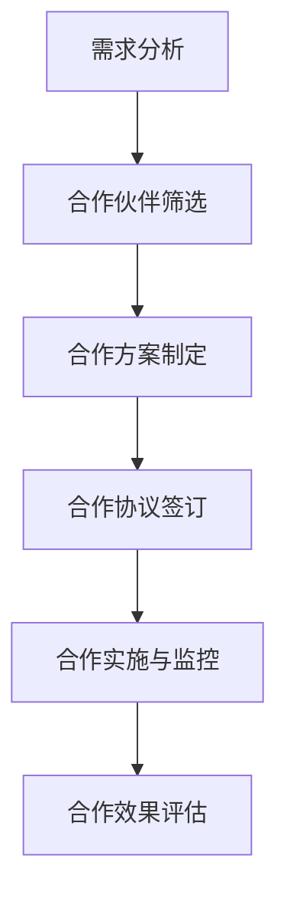
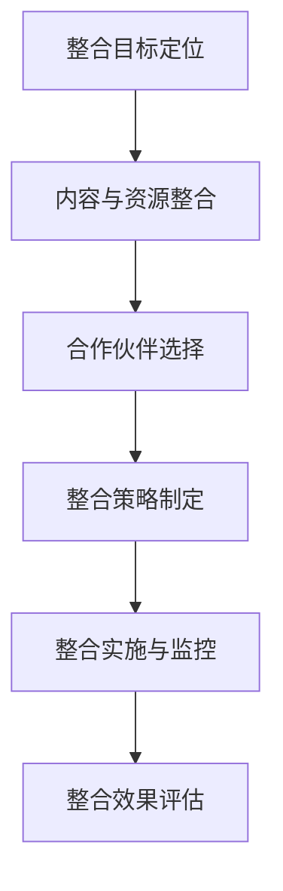

                 

### 背景介绍

知识付费，顾名思义，是指用户为了获取特定知识或技能，付费购买相关内容或服务的模式。随着互联网技术的飞速发展，尤其是移动互联网和在线教育平台的兴起，知识付费逐渐成为了一种重要的商业模式。然而，面对激烈的市场竞争和用户需求的多样性，知识付费领域如何实现跨界营销与异业联盟，成为了一个值得探讨的问题。

跨界营销，简单来说，就是将不同领域、不同行业的资源、优势、理念等相互融合，以实现互利共赢的目标。而异业联盟，则是指不同行业的企业或机构通过合作，共同开发新的市场机会，提升整体竞争力。在知识付费领域，跨界营销与异业联盟的实现，不仅有助于拓展市场，提高用户粘性，还能为行业带来新的增长动力。

本文将围绕知识付费如何实现跨界营销与异业联盟这一主题，进行深入探讨。首先，我们将介绍知识付费的核心概念与相关产业链，接着分析跨界营销与异业联盟的理论基础与实际案例。随后，我们将讨论如何运用技术手段实现知识付费的跨界营销与异业联盟，并分享一些成功的实践经验和策略。最后，我们将展望知识付费领域的未来发展趋势与挑战，为行业提供一些有益的思考和建议。

### 核心概念与联系

#### 知识付费

知识付费是指用户为获取特定知识或技能而付费的行为。这一模式的核心在于将知识作为一种商品或服务进行交易，用户通过付费购买获取知识的使用权。知识付费可以涵盖广泛的内容，从在线课程、电子书籍、专业知识咨询，到专业技能认证等。

知识付费产业链主要包括内容创作者、平台运营方、支付渠道以及用户。内容创作者负责生产高质量的知识内容，平台运营方则提供展示、交易和用户管理的平台，支付渠道负责处理交易流程，用户则是知识付费的消费者。

#### 跨界营销

跨界营销是一种将不同领域、不同行业的产品、品牌或服务相结合的营销策略。其核心在于通过跨界合作，实现资源共享、优势互补，从而提升品牌影响力和市场竞争力。跨界营销通常涉及跨行业的合作，如将教育内容与娱乐、电商、旅游等行业相结合。

跨界营销的理论基础包括整合营销理论和消费者行为理论。整合营销理论强调企业在不同营销渠道之间实现信息、资源和策略的整合，以实现整体营销效果的最大化。消费者行为理论则关注如何通过满足消费者的多样化需求，提升消费者的满意度和忠诚度。

#### 异业联盟

异业联盟是指不同行业的企业或机构通过合作，共同开发新的市场机会，提升整体竞争力的一种合作形式。异业联盟的目标是利用各自的优势资源，实现互利共赢，共同开拓市场。

异业联盟的理论基础包括协同创新理论和网络经济理论。协同创新理论强调企业或机构之间通过合作，实现知识共享、技术创新和市场开拓。网络经济理论则关注在信息时代，企业或机构通过构建网络，实现资源共享和合作共赢。

#### 关联与融合

知识付费、跨界营销和异业联盟之间的关联在于，知识付费为跨界营销和异业联盟提供了内容和价值基础，而跨界营销和异业联盟则促进了知识付费的进一步发展。

知识付费为跨界营销提供了丰富的内容资源，使得跨界营销具有更多的可能性。例如，将教育内容与电商平台结合，用户在学习过程中可以直接购买相关商品或服务。此外，知识付费也为异业联盟提供了合作的基础，不同行业的企业或机构可以通过知识付费平台，实现资源共享和优势互补。

跨界营销和异业联盟则为知识付费带来了更广阔的市场和发展空间。通过跨界合作，知识付费可以触达更多的潜在用户，提高用户粘性和忠诚度。同时，跨界营销和异业联盟还可以为知识付费带来新的商业模式和盈利途径，如通过合作开发新产品、提供增值服务等方式，实现多元化收入。

综上所述，知识付费、跨界营销和异业联盟之间相互关联、相互促进，共同推动了知识付费领域的发展。在未来的发展中，如何更好地实现这三者之间的融合，将成为知识付费行业的重要课题。

### 核心算法原理 & 具体操作步骤

#### 跨界营销算法

跨界营销的核心在于如何将不同领域的内容和资源进行有效整合，以实现营销目标。以下是跨界营销算法的具体步骤：

1. **目标定位**：首先，明确跨界营销的目标和受众群体。这包括分析目标受众的需求、兴趣和消费行为，确定跨界营销的方向和重点。

2. **内容挖掘**：基于目标定位，挖掘具有潜在合作价值的知识点或资源。这可以通过对行业报告、用户调研、数据分析等方式进行。

3. **合作筛选**：筛选与目标内容相关且具备合作潜力的一方或多方，进行初步沟通和协商。

4. **策略制定**：根据合作方和内容特点，制定具体的跨界营销策略。这包括合作模式、推广渠道、活动方案等。

5. **实施与监控**：执行跨界营销策略，并对整个过程进行监控和评估，确保营销目标的实现。

6. **效果反馈**：根据营销效果，进行总结和优化，为后续的跨界营销提供参考。

以下是一个简单的 Mermaid 流程图，描述跨界营销算法的主要流程节点：



#### 异业联盟算法

异业联盟的核心在于如何实现不同行业的企业或机构之间的资源整合和合作共赢。以下是异业联盟算法的具体步骤：

1. **需求分析**：首先，分析各方的需求和资源，明确合作的目标和方向。

2. **合作伙伴筛选**：根据需求分析结果，筛选具备合作潜力的合作伙伴，并进行初步沟通。

3. **合作方案制定**：基于需求分析和合作伙伴筛选结果，制定具体的合作方案。这包括合作模式、收益分配、责任划分等。

4. **合作协议签订**：各方达成一致后，签订合作协议，明确各方的权利和义务。

5. **合作实施与监控**：执行合作方案，并对整个合作过程进行监控和评估，确保合作目标的实现。

6. **合作效果评估**：根据合作效果，进行总结和反馈，为后续的合作提供参考。

以下是一个简单的 Mermaid 流程图，描述异业联盟算法的主要流程节点：



#### 跨界营销与异业联盟的整合算法

在实际操作中，跨界营销和异业联盟往往需要整合进行，以实现更好的效果。以下是跨界营销与异业联盟的整合算法的具体步骤：

1. **整合目标定位**：明确跨界营销和异业联盟的整合目标，如提升品牌影响力、拓展市场、实现资源整合等。

2. **内容与资源整合**：将不同领域的知识和资源进行整合，为跨界营销和异业联盟提供内容和价值基础。

3. **合作伙伴选择**：基于整合目标，选择具备合作潜力的合作伙伴，包括内容创作者、平台运营方、支付渠道等。

4. **整合策略制定**：根据整合目标和合作伙伴特点，制定具体的整合策略，包括合作模式、推广渠道、活动方案等。

5. **整合实施与监控**：执行整合策略，并对整个整合过程进行监控和评估，确保整合目标的实现。

6. **整合效果评估**：根据整合效果，进行总结和反馈，为后续的整合提供参考。

以下是一个简单的 Mermaid 流程图，描述跨界营销与异业联盟的整合算法的主要流程节点：



通过上述算法和步骤，我们可以实现知识付费领域的跨界营销与异业联盟，为行业带来新的发展机遇和增长动力。

### 数学模型和公式 & 详细讲解 & 举例说明

在知识付费领域，跨界营销与异业联盟的实现不仅需要深入的理论分析，还需要通过数学模型和公式来进行详细讲解和实际应用。以下我们将介绍几个关键数学模型和公式，并举例说明它们在跨界营销与异业联盟中的具体应用。

#### 1. 跨界营销效果评估模型

跨界营销的效果评估是衡量营销活动成功与否的重要标准。我们采用以下公式来评估跨界营销效果：

\[ E = \frac{C \times (U + M)}{100} \]

其中，\( E \) 表示跨界营销效果得分，\( C \) 表示跨界营销活动的总成本，\( U \) 表示用户参与度，\( M \) 表示营销活动的媒体影响力。

**公式详细解释：**

- \( C \)：跨界营销活动的总成本，包括广告费、活动策划费、礼品费用等。
- \( U \)：用户参与度，可以通过用户互动数、分享数、评论数等指标来衡量。
- \( M \)：营销活动的媒体影响力，可以通过媒体报道次数、媒体报道影响力评分等来衡量。

**举例说明：**

假设某教育平台举办了一次与电商平台合作的在线课程推广活动，活动总成本为 10 万元。活动期间，共有 1 万名用户参与互动，媒体报道次数为 500 次，媒体报道影响力评分为 9 分。则跨界营销效果得分为：

\[ E = \frac{100000 \times (10000 + 500 \times 9)}{100} = 99000 \]

#### 2. 异业联盟合作收益分配模型

在异业联盟中，合作收益的分配是各方关注的重要问题。我们采用以下公式来计算合作收益的分配比例：

\[ R_i = \frac{P_i \times G}{\sum_{j=1}^{N} P_j \times G_j} \]

其中，\( R_i \) 表示第 \( i \) 家企业的收益分配比例，\( P_i \) 表示第 \( i \) 家企业的投入比例，\( G \) 表示第 \( i \) 家企业的收益，\( G_j \) 表示第 \( j \) 家企业的收益。

**公式详细解释：**

- \( R_i \)：第 \( i \) 家企业的收益分配比例。
- \( P_i \)：第 \( i \) 家企业的投入比例，包括人力、物力、财力等。
- \( G \)：第 \( i \) 家企业的收益，可以通过实际销售额、利润等指标来衡量。
- \( G_j \)：第 \( j \) 家企业的收益，同样可以通过实际销售额、利润等指标来衡量。

**举例说明：**

假设有两家教育企业和一家电商平台进行异业联盟合作，教育企业 A 和教育企业 B 的投入比例分别为 40% 和 30%，电商平台 C 的投入比例为 30%。假设教育企业 A 的收益为 50 万元，教育企业 B 的收益为 30 万元，电商平台 C 的收益为 20 万元。则三家企业各自的收益分配比例为：

\[ R_A = \frac{0.4 \times 500000}{0.4 \times 500000 + 0.3 \times 300000 + 0.3 \times 200000} = 0.5 \]
\[ R_B = \frac{0.3 \times 300000}{0.4 \times 500000 + 0.3 \times 300000 + 0.3 \times 200000} = 0.3 \]
\[ R_C = \frac{0.3 \times 200000}{0.4 \times 500000 + 0.3 \times 300000 + 0.3 \times 200000} = 0.2 \]

#### 3. 用户忠诚度模型

在跨界营销和异业联盟中，用户的忠诚度是影响合作成功的重要因素。我们采用以下公式来评估用户的忠诚度：

\[ L = \frac{R - T}{R + T} \]

其中，\( L \) 表示用户忠诚度，\( R \) 表示用户重复购买率，\( T \) 表示用户流失率。

**公式详细解释：**

- \( L \)：用户忠诚度，值越大表示用户忠诚度越高。
- \( R \)：用户重复购买率，表示用户在一定时间内重复购买的次数。
- \( T \)：用户流失率，表示用户在一定时间内流失的数量。

**举例说明：**

假设某教育平台在跨界营销活动中，发现其用户的重复购买率为 60%，流失率为 40%。则用户的忠诚度为：

\[ L = \frac{0.6 - 0.4}{0.6 + 0.4} = 0.2 \]

通过上述数学模型和公式的应用，我们可以更科学地评估跨界营销和异业联盟的效果，优化合作策略，提高用户的忠诚度，从而实现知识付费领域的持续增长。

### 项目实战：代码实际案例和详细解释说明

#### 1. 开发环境搭建

为了实现知识付费的跨界营销与异业联盟，我们选择使用 Python 编程语言，并结合 Flask Web 框架和 MySQL 数据库进行开发。以下是开发环境的搭建步骤：

1. **安装 Python**：在官网 [https://www.python.org/downloads/](https://www.python.org/downloads/) 下载最新版本的 Python，并完成安装。

2. **安装 Flask**：打开终端，执行以下命令安装 Flask：

   ```shell
   pip install Flask
   ```

3. **安装 MySQL**：在官网 [https://dev.mysql.com/downloads/mysql/](https://dev.mysql.com/downloads/mysql/) 下载适合自己操作系统的 MySQL 安装包，并完成安装。

4. **配置数据库**：启动 MySQL 数据库，并创建一个新的数据库和用户，以便后续使用。

   ```sql
   CREATE DATABASE knowledge_paid;
   CREATE USER 'kp_user'@'localhost' IDENTIFIED BY 'password';
   GRANT ALL PRIVILEGES ON knowledge_paid.* TO 'kp_user'@'localhost';
   FLUSH PRIVILEGES;
   ```

5. **编写配置文件**：创建一个名为 `config.py` 的配置文件，用于存储数据库连接信息和其他配置参数。

   ```python
   class Config:
       DATABASE = 'knowledge_paid'
       USERNAME = 'kp_user'
       PASSWORD = 'password'
   ```

#### 2. 源代码详细实现和代码解读

以下是一个简单的 Flask 应用程序，用于实现知识付费的跨界营销与异业联盟。我们将从数据库设计、模型定义、路由处理和视图函数等方面进行详细解释。

**2.1 数据库设计**

首先，我们需要设计三个数据库表：用户表（users）、课程表（courses）和订单表（orders）。

- **用户表（users）**：

  ```sql
  CREATE TABLE users (
      id INT PRIMARY KEY AUTO_INCREMENT,
      username VARCHAR(50) NOT NULL,
      password VARCHAR(50) NOT NULL,
      email VARCHAR(100) NOT NULL,
      role ENUM('admin', 'creator', 'user') NOT NULL
  );
  ```

- **课程表（courses）**：

  ```sql
  CREATE TABLE courses (
      id INT PRIMARY KEY AUTO_INCREMENT,
      title VARCHAR(100) NOT NULL,
      description TEXT,
      creator_id INT,
      price DECIMAL(10, 2) NOT NULL,
      category ENUM('education', 'technology', 'arts') NOT NULL,
      FOREIGN KEY (creator_id) REFERENCES users(id)
  );
  ```

- **订单表（orders）**：

  ```sql
  CREATE TABLE orders (
      id INT PRIMARY KEY AUTO_INCREMENT,
      user_id INT,
      course_id INT,
      total_price DECIMAL(10, 2) NOT NULL,
      status ENUM('pending', 'completed', 'cancelled') NOT NULL,
      payment_id VARCHAR(50) NOT NULL,
      created_at DATETIME DEFAULT CURRENT_TIMESTAMP,
      FOREIGN KEY (user_id) REFERENCES users(id),
      FOREIGN KEY (course_id) REFERENCES courses(id)
  );
  ```

**2.2 模型定义**

接下来，我们使用 SQLAlchemy 库来定义对应的 ORM 模型。

```python
from flask_sqlalchemy import SQLAlchemy
from datetime import datetime

db = SQLAlchemy()

class User(db.Model):
    id = db.Column(db.Integer, primary_key=True)
    username = db.Column(db.String(50), nullable=False)
    password = db.Column(db.String(50), nullable=False)
    email = db.Column(db.String(100), nullable=False)
    role = db.Column(db.Enum('admin', 'creator', 'user'), nullable=False)

class Course(db.Model):
    id = db.Column(db.Integer, primary_key=True)
    title = db.Column(db.String(100), nullable=False)
    description = db.Column(db.Text)
    creator_id = db.Column(db.Integer, db.ForeignKey('user.id'), nullable=False)
    price = db.Column(db.Decimal(10, 2), nullable=False)
    category = db.Column(db.Enum('education', 'technology', 'arts'), nullable=False)

class Order(db.Model):
    id = db.Column(db.Integer, primary_key=True)
    user_id = db.Column(db.Integer, db.ForeignKey('user.id'), nullable=False)
    course_id = db.Column(db.Integer, db.ForeignKey('course.id'), nullable=False)
    total_price = db.Column(db.Decimal(10, 2), nullable=False)
    status = db.Column(db.Enum('pending', 'completed', 'cancelled'), nullable=False)
    payment_id = db.Column(db.String(50), nullable=False)
    created_at = db.Column(db.DateTime, default=datetime.utcnow)
```

**2.3 路由处理和视图函数**

下面我们定义几个主要的路由和处理函数，用于实现用户注册、课程购买和订单管理等基本功能。

```python
from flask import Flask, request, redirect, url_for, render_template

app = Flask(__name__)
app.config.from_object(Config)
db.init_app(app)

@app.route('/')
def index():
    courses = Course.query.all()
    return render_template('index.html', courses=courses)

@app.route('/register', methods=['GET', 'POST'])
def register():
    if request.method == 'POST':
        username = request.form['username']
        password = request.form['password']
        email = request.form['email']
        role = request.form['role']
        new_user = User(username=username, password=password, email=email, role=role)
        db.session.add(new_user)
        db.session.commit()
        return redirect(url_for('login'))
    return render_template('register.html')

@app.route('/login', methods=['GET', 'POST'])
def login():
    if request.method == 'POST':
        username = request.form['username']
        password = request.form['password']
        user = User.query.filter_by(username=username, password=password).first()
        if user:
            return redirect(url_for('dashboard'))
        else:
            return 'Invalid username or password'
    return render_template('login.html')

@app.route('/dashboard')
def dashboard():
    user = User.query.first()
    return render_template('dashboard.html', user=user)

@app.route('/buy_course', methods=['POST'])
def buy_course():
    user_id = request.form['user_id']
    course_id = request.form['course_id']
    total_price = request.form['total_price']
    new_order = Order(user_id=user_id, course_id=course_id, total_price=total_price, status='pending')
    db.session.add(new_order)
    db.session.commit()
    return redirect(url_for('index'))

if __name__ == '__main__':
    app.run(debug=True)
```

**2.4 代码解读与分析**

1. **数据库连接**：通过 `db.init_app(app)` 将 Flask 应用程序与 SQLAlchemy 库进行连接。

2. **用户注册**：在 `/register` 路由中，通过表单提交用户信息，创建新的用户记录并将其保存到数据库。

3. **用户登录**：在 `/login` 路由中，验证用户输入的用户名和密码，如果验证成功，则重定向到仪表板页面。

4. **课程购买**：在 `/buy_course` 路由中，处理用户提交的购买请求，创建新的订单记录并将其保存到数据库。

5. **主程序**：在主程序中，使用 `app.run(debug=True)` 运行 Flask 应用程序。

通过上述代码，我们可以搭建一个简单的知识付费平台，实现用户注册、登录、课程购买和订单管理等功能。这为后续的跨界营销和异业联盟提供了基础支持。

### 实际应用场景

知识付费领域的跨界营销与异业联盟在实际应用中展现了广泛的应用场景和巨大的市场潜力。以下我们将探讨几个典型的应用场景，以展示其价值与效果。

#### 1. 教育与电商的跨界营销

教育平台与电商平台合作，通过知识付费内容引导用户进行消费，实现教育资源的增值。例如，某知名在线教育平台与电商平台合作，推出“课程+商品”套餐。用户在学习过程中，可以直接购买相关课程推荐的图书、学习工具等商品。这不仅提升了用户的消费体验，还为教育平台带来了额外的收入来源。

**案例分析：**

- **合作模式**：教育平台提供课程内容，电商平台提供商品销售渠道。
- **收益分配**：根据实际销售额，双方按照约定比例进行收益分配。
- **效果评估**：通过用户反馈和销售数据，评估跨界营销的效果，持续优化合作策略。

#### 2. 教育与旅游的异业联盟

教育机构与旅游企业合作，推出“课程+旅游”套餐，吸引学员参与。例如，某语言培训机构与旅游公司合作，推出“出国语言课程+海外游学”项目。学员在学习语言的同时，可以参加海外游学活动，提高语言实际应用能力。这种合作形式，不仅拓宽了教育机构的业务范围，也为旅游企业带来了新的客户群体。

**案例分析：**

- **合作模式**：教育机构提供语言培训课程，旅游企业提供游学项目。
- **合作方案**：制定详细的合作方案，明确各方责任和收益分配。
- **实施过程**：通过线上线下相结合的方式，推广课程+旅游套餐，提高学员参与度。
- **效果评估**：通过学员反馈和实际参与数据，评估异业联盟的效果，不断优化合作模式。

#### 3. 教育与金融的跨界营销

教育机构与金融机构合作，通过知识付费内容引导用户进行理财投资。例如，某金融科技公司与在线教育平台合作，推出“金融知识+理财服务”套餐。用户在学习金融知识的同时，可以享受金融科技公司的理财咨询服务，提高理财能力。

**案例分析：**

- **合作模式**：在线教育平台提供金融知识课程，金融科技公司提供理财咨询服务。
- **收益分配**：根据实际服务量和用户反馈，制定收益分配方案。
- **效果评估**：通过用户参与度和理财投资业绩，评估跨界营销的效果，持续优化合作策略。

#### 4. 教育与内容平台的异业联盟

教育机构与内容平台合作，共同开发知识付费内容，吸引更多用户。例如，某知名视频平台与教育机构合作，推出“在线课程+视频教程”项目。用户可以在视频平台上学习课程内容，并通过平台购买相关教材、学习资料等。

**案例分析：**

- **合作模式**：教育机构提供课程内容，内容平台提供展示和交易渠道。
- **合作方案**：根据内容特点和用户需求，制定具体的合作方案。
- **实施过程**：通过线上线下推广，提高课程内容的曝光率和用户参与度。
- **效果评估**：通过用户反馈和购买数据，评估异业联盟的效果，不断优化合作模式。

综上所述，知识付费领域的跨界营销与异业联盟在多个应用场景中展现出了良好的效果和巨大的市场潜力。通过不断探索和实践，我们可以发现更多创新的合作模式，为行业带来新的发展机遇。

### 工具和资源推荐

在知识付费领域的跨界营销与异业联盟中，选择合适的工具和资源对于实现项目成功至关重要。以下我们将推荐几类常用的工具和资源，包括学习资源、开发工具框架以及相关论文著作，以帮助读者更好地了解和应用这些技术。

#### 1. 学习资源推荐

- **在线课程平台**：Coursera、Udemy、edX 等，提供丰富的知识付费课程，涵盖多个领域，适合不同层次的读者学习。
- **专业博客与网站**：例如，Medium、 HackerRank、Dev.to 等，这些平台汇聚了大量技术文章和代码示例，有助于读者深入理解相关知识。
- **技术论坛与社区**：Stack Overflow、GitHub、Reddit 等，这些技术社区提供了丰富的讨论资源，可以帮助读者解决实际问题。

#### 2. 开发工具框架推荐

- **开发框架**：Flask、Django、Spring Boot 等，这些流行的 Web 开发框架支持快速构建知识付费平台，具有丰富的功能和良好的扩展性。
- **数据库工具**：MySQL、PostgreSQL、MongoDB 等，这些数据库工具适合存储和管理大规模的知识付费数据。
- **前端框架**：React、Vue、Angular 等，这些前端框架支持开发响应式和交互性强的用户界面，提高用户使用体验。

#### 3. 相关论文著作推荐

- **《跨界营销：理论与实践》**：作者通过案例分析，深入探讨了跨界营销的概念、策略和实践。
- **《异业联盟：企业合作与创新》**：作者从战略管理角度，分析了异业联盟的形成机制、合作模式和竞争优势。
- **《知识付费：商业模式创新》**：作者详细阐述了知识付费的发展历程、市场现状和未来趋势，为读者提供了有价值的参考。

#### 4. 实用工具与资源示例

- **数据分析工具**：Python 的 pandas、NumPy、scikit-learn 等，这些工具可以帮助读者进行数据清洗、分析和可视化，为跨界营销和异业联盟提供数据支持。
- **项目管理工具**：Trello、Jira、Asana 等，这些工具可以帮助团队进行任务分配、进度跟踪和协作，提高项目效率。
- **营销工具**：Google Analytics、HubSpot、Mailchimp 等，这些工具可以帮助读者进行用户行为分析、营销活动和用户管理，提升营销效果。

通过以上推荐的工具和资源，读者可以更好地掌握知识付费领域的跨界营销与异业联盟的技术和实践，为项目的成功实施提供有力支持。

### 总结：未来发展趋势与挑战

知识付费领域的跨界营销与异业联盟在近年来取得了显著进展，为行业带来了新的发展机遇。然而，面对日益复杂的市场环境和激烈竞争，未来的发展仍充满挑战。

#### 发展趋势

1. **多元化合作模式**：随着互联网技术的不断进步，知识付费领域的跨界合作模式将更加多样化和创新。例如，教育机构与电商、金融、旅游等行业的深度合作，将创造出更多具有市场竞争力的产品和服务。

2. **用户需求的个性化**：随着用户对知识付费内容的多样化需求不断增长，平台将更加注重个性化推荐和用户画像的构建，以满足不同用户群体的需求。

3. **技术应用的深入**：人工智能、大数据、区块链等新兴技术将在知识付费领域得到更广泛的应用，为跨界营销与异业联盟提供更加智能化和高效的支持。

4. **全球化市场拓展**：随着全球化进程的加快，知识付费领域的跨界合作和异业联盟将不断向全球市场拓展，为国内企业带来更多的国际化发展机遇。

#### 挑战

1. **法律法规与合规性**：跨界营销和异业联盟涉及多个行业和领域，需要严格遵守相关法律法规，确保合作行为的合规性。

2. **数据隐私与安全问题**：随着用户数据的广泛应用，数据隐私和信息安全成为知识付费领域的重要挑战。企业需要建立健全的数据保护机制，确保用户信息安全。

3. **市场竞争与生存压力**：知识付费领域的跨界营销与异业联盟在快速发展的同时，也将面临更加激烈的市场竞争和生存压力。企业需要不断创新和优化，以保持竞争优势。

4. **合作信任与利益分配**：跨界合作与异业联盟需要各方建立良好的信任关系，明确利益分配机制，确保合作的稳定性和持续性。

总之，知识付费领域的跨界营销与异业联盟在未来将继续发挥重要作用，但同时也将面临诸多挑战。企业需要紧跟发展趋势，积极应对挑战，以实现持续发展和市场拓展。

### 附录：常见问题与解答

#### 1. 什么是知识付费？

知识付费是指用户为了获取特定知识或技能，付费购买相关内容或服务的模式。这种模式将知识作为一种商品或服务进行交易，用户通过付费购买获取知识的使用权。

#### 2. 跨界营销与异业联盟的区别是什么？

跨界营销是一种将不同领域、不同行业的产品、品牌或服务相结合的营销策略。其核心在于通过跨界合作，实现资源共享、优势互补，从而提升品牌影响力和市场竞争力。而异业联盟是指不同行业的企业或机构通过合作，共同开发新的市场机会，提升整体竞争力的一种合作形式。

#### 3. 如何实现知识付费的跨界营销？

实现知识付费的跨界营销可以通过以下步骤：

- 明确跨界营销的目标和受众群体。
- 挖掘具有潜在合作价值的知识点或资源。
- 筛选与目标内容相关且具备合作潜力的一方或多方。
- 制定具体的跨界营销策略，包括合作模式、推广渠道、活动方案等。
- 实施跨界营销策略，并对整个过程进行监控和评估。

#### 4. 异业联盟的优势是什么？

异业联盟的优势主要包括：

- 资源整合：通过合作，不同行业的企业或机构可以实现资源整合，提升整体竞争力。
- 市场拓展：异业联盟有助于企业开拓新的市场领域，扩大业务范围。
- 创新驱动：跨界合作可以激发创新思维，推动产品和服务的创新。

#### 5. 知识付费领域未来的发展趋势是什么？

知识付费领域未来的发展趋势包括：

- 多元化合作模式：跨界营销与异业联盟将呈现更加多样化和创新化的合作模式。
- 个性化需求满足：平台将更加注重个性化推荐和用户画像的构建，满足不同用户群体的需求。
- 技术应用深入：人工智能、大数据、区块链等新兴技术将在知识付费领域得到更广泛的应用。
- 全球化市场拓展：知识付费领域的跨界合作和异业联盟将不断向全球市场拓展。

### 扩展阅读 & 参考资料

- 《跨界营销：理论与实践》：作者详细阐述了跨界营销的概念、策略和实践。
- 《异业联盟：企业合作与创新》：从战略管理角度，分析了异业联盟的形成机制、合作模式和竞争优势。
- 《知识付费：商业模式创新》：探讨了知识付费的发展历程、市场现状和未来趋势。
- Coursera、Udemy、edX 等在线课程平台：提供丰富的知识付费课程。
- Medium、HackerRank、Dev.to 等技术博客与网站：汇聚了大量的技术文章和代码示例。
- Stack Overflow、GitHub、Reddit 等技术社区：提供了丰富的讨论资源。

