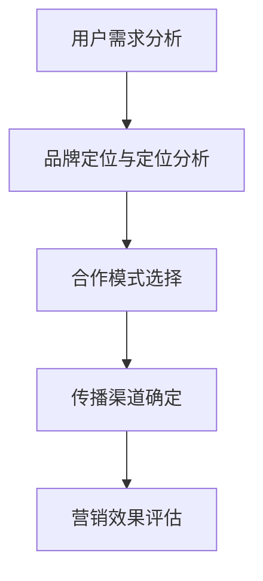
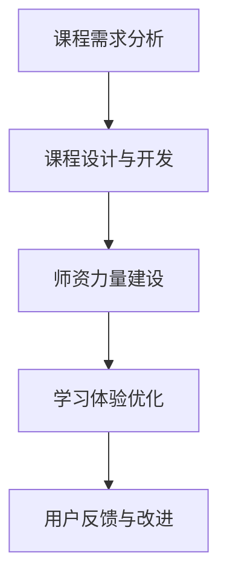

                 

# 知识付费如何实现跨界营销与教育培训跨界？

> **关键词：** 知识付费、跨界营销、教育培训、商业模式、用户需求、数据分析

> **摘要：** 本文将深入探讨知识付费行业如何通过跨界营销和教育培训实现业务增长，分析其核心概念、实现步骤和实际案例，为行业从业者提供有益的参考和思路。

## 1. 背景介绍

### 1.1 知识付费行业概述

知识付费是指用户为获取有价值的信息、知识或技能而付费的一种商业模式。随着互联网技术的发展和用户需求的升级，知识付费行业近年来呈现出高速发展的态势。根据《2021年中国知识付费行业研究报告》，2020年中国知识付费市场规模已达到612亿元，预计未来仍将保持快速增长。

### 1.2 跨界营销概念

跨界营销是指企业或品牌通过与其他行业或品牌的合作，实现资源共享、优势互补，从而拓展市场、提升品牌知名度和用户粘性的一种营销策略。跨界营销在知识付费行业中的应用，可以有效提升产品的吸引力，满足用户多样化的需求。

### 1.3 教育培训跨界

教育培训跨界是指将知识付费与教育培训相结合，通过在线教育、线下课程、讲座、工作坊等形式，为用户提供更丰富、深入的学习体验。教育培训跨界有助于提高用户的付费意愿，增强用户对知识产品的忠诚度。

## 2. 核心概念与联系

### 2.1 跨界营销的核心概念

跨界营销的核心概念包括：用户需求、品牌定位、合作模式、传播渠道等。以下是一个用Mermaid绘制的流程图，展示了跨界营销的关键节点：



### 2.2 教育培训跨界的核心概念

教育培训跨界的核心概念包括：课程设计、师资力量、学习体验、用户反馈等。以下是一个用Mermaid绘制的流程图，展示了教育培训跨界的关键节点：



## 3. 核心算法原理 & 具体操作步骤

### 3.1 跨界营销算法原理

跨界营销的核心算法是用户需求分析。通过大数据分析和用户画像技术，了解用户在知识付费领域的偏好、兴趣和需求，从而为跨界合作提供决策依据。

具体操作步骤如下：

1. 收集用户数据，包括用户行为数据、社交数据、购买记录等。
2. 使用数据挖掘和机器学习算法，对用户数据进行处理和分析。
3. 构建用户画像，识别用户需求、兴趣和偏好。
4. 根据用户画像，确定跨界合作的目标领域和合作伙伴。
5. 设计跨界营销策略，包括产品组合、推广渠道、合作模式等。

### 3.2 教育培训跨界算法原理

教育培训跨界的核心算法是课程设计与开发。通过市场调研、用户反馈和行业专家建议，设计符合用户需求、具有竞争力的课程体系。

具体操作步骤如下：

1. 进行市场调研，了解行业发展趋势和用户需求。
2. 收集用户反馈，了解用户对现有课程的评价和建议。
3. 咨询行业专家，获取课程设计和开发的专业建议。
4. 根据调研和反馈结果，确定课程主题、内容、形式和时长。
5. 开发课程，包括编写教材、录制视频、设计互动环节等。
6. 对课程进行测试和优化，确保课程质量。

## 4. 数学模型和公式 & 详细讲解 & 举例说明

### 4.1 跨界营销数学模型

跨界营销的数学模型主要涉及用户需求分析和合作效益评估。

#### 4.1.1 用户需求分析

用户需求分析可以使用以下数学模型：

$$
需求度 = f(用户行为数据, 社交数据, 购买记录)
$$

其中，需求度表示用户对某一知识领域的需求程度，用户行为数据、社交数据和购买记录分别表示用户在不同维度上的行为和偏好。

#### 4.1.2 合作效益评估

合作效益评估可以使用以下数学模型：

$$
效益度 = f(合作模式, 市场份额, 品牌知名度)
$$

其中，效益度表示跨界合作带来的整体效益，合作模式、市场份额和品牌知名度分别表示跨界合作的具体形式和市场表现。

### 4.2 教育培训跨界数学模型

教育培训跨界的数学模型主要涉及课程设计和开发成本评估。

#### 4.2.1 课程设计成本

课程设计成本可以使用以下数学模型：

$$
设计成本 = f(课程主题, 课程内容, 教学形式)
$$

其中，设计成本表示课程设计所需的人力、物力和财力投入，课程主题、课程内容和教学形式分别表示课程设计的具体内容。

#### 4.2.2 课程开发成本

课程开发成本可以使用以下数学模型：

$$
开发成本 = f(教材编写, 视频录制, 互动环节设计)
$$

其中，开发成本表示课程开发所需的人力、物力和财力投入，教材编写、视频录制和互动环节设计分别表示课程开发的具体工作。

### 4.3 举例说明

#### 4.3.1 跨界营销案例分析

假设某知识付费平台想要与一家心理咨询机构进行跨界合作，开展心理健康教育的课程。根据用户需求分析和合作效益评估模型，可以得出以下结论：

1. 用户需求分析：通过大数据分析，发现平台用户对心理健康教育的需求度较高，且在社交平台上有较高的互动频率。
2. 合作效益评估：合作模式选择为联合推出课程，共同推广，预计市场份额和品牌知名度将得到显著提升。

基于以上分析，可以制定以下跨界营销策略：

1. 确定合作模式：联合推出课程，共同推广。
2. 设定课程内容：包括心理健康知识、心理调适技巧和心理测试等。
3. 推广渠道：利用平台和机构的各自渠道进行推广，如微信公众号、微博、抖音等。

#### 4.3.2 教育培训跨界案例分析

假设某在线教育平台想要开发一门编程课程，通过线上线下结合的方式，为学员提供丰富的学习体验。根据课程设计和开发成本评估模型，可以得出以下结论：

1. 课程设计成本：根据市场需求和用户反馈，确定课程主题为Python编程基础，课程内容涵盖Python语言的基本语法、数据类型、流程控制等。
2. 课程开发成本：教材编写、视频录制和互动环节设计分别需要投入人力、物力和财力，预计总成本为10万元。

基于以上分析，可以制定以下教育培训跨界策略：

1. 课程形式：线上线下结合，提供灵活的学习方式。
2. 教学内容：涵盖Python编程的基础知识和实际应用案例。
3. 教学方式：线上课程为主，线下课程为辅，提供互动环节和实训项目。

## 5. 项目实战：代码实际案例和详细解释说明

### 5.1 开发环境搭建

#### 5.1.1 数据分析环境

1. 安装Python环境，版本要求3.8及以上。
2. 安装数据分析相关库，如pandas、numpy、scikit-learn等。
3. 安装可视化库，如matplotlib、seaborn等。

```bash
pip install pandas numpy scikit-learn matplotlib seaborn
```

#### 5.1.2 教育培训环境

1. 安装在线教育平台相关库，如Django、Flask等。
2. 安装视频处理和直播相关库，如FFmpeg、opencv-python等。

```bash
pip install django flask ffmpeg-python opencv-python
```

### 5.2 源代码详细实现和代码解读

#### 5.2.1 跨界营销代码实现

以下是一个简单的用户需求分析代码示例，用于分析用户在知识付费平台的行为数据，识别用户对某一领域的需求程度。

```python
import pandas as pd

# 加载用户行为数据
user_data = pd.read_csv('user_behavior.csv')

# 计算用户在某一领域的互动频率
interaction_frequency = user_data.groupby('domain')['action'].nunique()

# 计算用户需求度
user_demand = interaction_frequency / user_data['action'].nunique()

# 输出用户需求度排名前五的领域
top_domains = user_demand.nlargest(5)
print(top_domains)
```

代码解读：

1. 导入pandas库，用于数据处理和分析。
2. 加载用户行为数据，包括用户ID、领域、行为类型等。
3. 使用groupby函数按领域分组，计算用户在某一领域的互动频率。
4. 计算用户总互动频率，用于计算用户需求度。
5. 输出用户需求度排名前五的领域。

#### 5.2.2 教育培训代码实现

以下是一个简单的在线教育平台课程设计代码示例，用于设计一门Python编程基础课程。

```python
# 导入相关库
from django.db import models

# 定义课程模型
class Course(models.Model):
    title = models.CharField(max_length=100)
    description = models.TextField()
    duration = models.DurationField()
    price = models.DecimalField(max_digits=6, decimal_places=2)

    def __str__(self):
        return self.title

# 创建课程实例
python_course = Course(
    title='Python编程基础',
    description='本课程将介绍Python语言的基本语法、数据类型、流程控制等知识。',
    duration=models.DurationField(days=30),
    price=200.0
)

# 保存课程实例
python_course.save()
```

代码解读：

1. 导入Django数据库库，用于定义模型和操作数据库。
2. 定义Course模型，包括课程名称、描述、时长和价格等字段。
3. 创建Python编程基础课程实例，并设置相关属性。
4. 保存课程实例，将课程信息存储到数据库。

## 6. 实际应用场景

### 6.1 跨界营销应用场景

在知识付费行业中，跨界营销可以应用于多个领域。以下是一些实际应用场景：

1. **教育与科技**：知识付费平台与科技企业合作，推出人工智能、大数据等领域的在线课程，满足用户在科技领域的需求。
2. **教育与艺术**：知识付费平台与艺术机构合作，推出绘画、音乐、舞蹈等领域的课程，丰富用户的精神文化生活。
3. **教育与生活**：知识付费平台与健康、养生等领域合作，推出健康饮食、运动健身等课程，帮助用户提升生活品质。

### 6.2 教育培训跨界应用场景

在教育培训行业中，跨界可以应用于多个领域。以下是一些实际应用场景：

1. **线上线下结合**：在线教育平台与线下培训机构合作，提供线上线下相结合的课程，满足不同用户的学习需求。
2. **直播与录播**：在线教育平台采用直播与录播相结合的方式，提供丰富的学习资源，提升用户体验。
3. **学习与就业**：在线教育平台与招聘平台合作，推出就业指导课程，帮助学员提升就业竞争力。

## 7. 工具和资源推荐

### 7.1 学习资源推荐

1. **书籍**：《跨界创新》、《数字化营销管理》
2. **论文**：搜索关键词“跨界营销”、“在线教育”获取相关论文
3. **博客**：搜索关键词“知识付费”、“教育培训”获取行业博客和专家观点
4. **网站**：知乎、头条号、微信公众号等平台上的知识付费和教育培训相关内容

### 7.2 开发工具框架推荐

1. **数据分析**：Python、R、Tableau等
2. **在线教育平台**：Django、Flask、Vue.js等
3. **视频处理**：FFmpeg、opencv-python等

### 7.3 相关论文著作推荐

1. **论文**：《跨界营销：策略与实践》、《在线教育跨界发展研究》
2. **著作**：《知识付费时代的商业变革》、《教育培训跨界创新发展报告》

## 8. 总结：未来发展趋势与挑战

### 8.1 发展趋势

1. **跨界合作加深**：知识付费与教育培训、科技、艺术等领域的跨界合作将更加紧密，实现资源共享和优势互补。
2. **技术赋能**：大数据、人工智能、区块链等技术的应用，将推动知识付费和教育培训行业的智能化和个性化发展。
3. **用户需求升级**：随着用户需求的不断升级，知识付费和教育培训行业将更加注重用户体验，提供多样化、个性化的产品和服务。

### 8.2 挑战

1. **市场竞争加剧**：随着知识付费和教育培训行业的快速发展，市场竞争将更加激烈，企业需要不断创新和提升自身竞争力。
2. **内容质量监管**：跨界合作将带来更多优质内容，但同时也需要加强对内容的监管，确保知识质量和用户权益。
3. **知识产权保护**：跨界合作过程中，知识产权保护将成为行业面临的挑战，企业需要建立健全的知识产权保护体系。

## 9. 附录：常见问题与解答

### 9.1 知识付费与教育培训跨界的意义是什么？

知识付费与教育培训跨界意味着通过与其他领域的合作，为用户提供更丰富、更全面的学习资源和体验，从而满足用户多样化的需求，提高用户的付费意愿和忠诚度。

### 9.2 跨界营销的关键成功因素是什么？

跨界营销的关键成功因素包括：深入理解用户需求、选择合适的合作伙伴、制定有效的营销策略和确保良好的传播渠道。

### 9.3 教育培训跨界的主要挑战有哪些？

教育培训跨界的主要挑战包括：课程设计难度大、师资力量要求高、技术支持需求大和知识产权保护难度大。

## 10. 扩展阅读 & 参考资料

1. 《2021年中国知识付费行业研究报告》
2. 《跨界营销：策略与实践》
3. 《在线教育跨界发展研究》
4. 《知识付费时代的商业变革》
5. 《教育培训跨界创新发展报告》

### 作者

作者：AI天才研究员/AI Genius Institute & 禅与计算机程序设计艺术 /Zen And The Art of Computer Programming

