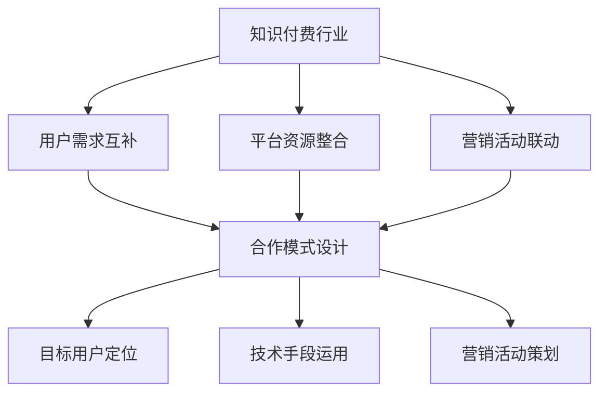

                 

# 知识付费如何实现跨界营销与餐饮外卖跨界？

## 摘要

本文将探讨知识付费平台如何通过跨界营销策略与餐饮外卖行业的结合，实现商业模式的创新和用户基数的增长。首先，我们将介绍知识付费和餐饮外卖的行业背景，然后分析跨界营销的概念及其核心要素。接着，本文将提出具体的跨界营销策略，包括用户行为分析、合作模式设计、技术手段运用和营销活动策划。最后，我们将讨论跨界营销的实际效果和未来发展趋势，并提供相关工具和资源的推荐。

## 1. 背景介绍

### 知识付费行业

知识付费是指用户为了获取专业知识和技能而支付的费用。近年来，随着互联网技术的发展和用户需求的变化，知识付费行业迅速崛起。根据艾瑞咨询的报告，2021年中国知识付费市场规模达到1945亿元，预计2025年将达到4219亿元。知识付费平台如得到、知乎Live、喜马拉雅等，通过提供专业课程、在线讲座、电子书等形式，满足了用户对知识的需求。

### 餐饮外卖行业

餐饮外卖行业是随着互联网技术发展而兴起的，通过第三方平台将餐饮服务直接送达用户家中。据《中国互联网发展报告》显示，2021年国内餐饮外卖市场规模达到6365亿元，用户规模超过5亿人。主要平台包括美团、饿了么、肯德基等，这些平台通过优化配送效率、提升用户体验，占据了大量市场份额。

### 跨界营销的概念

跨界营销是指不同行业或品牌之间通过合作、联营、交流等方式，实现资源整合和共同发展的策略。跨界营销的核心在于打破行业壁垒，通过创新的方式吸引目标用户，提升品牌知名度。例如，汽车品牌与时尚品牌合作推出限量版车型，或美妆品牌与科技品牌合作开发美妆产品。

## 2. 核心概念与联系

### 知识付费与餐饮外卖的跨界联系

知识付费和餐饮外卖行业的跨界，可以通过以下方式实现：

1. **用户需求互补**：知识付费平台用户可能对健康饮食、烹饪技能等有需求，而餐饮外卖平台可以提供相关的付费课程或服务。
2. **平台资源整合**：知识付费平台可以借助餐饮外卖平台的海量用户数据，进行精准营销和用户推荐。
3. **营销活动联动**：知识付费平台可以通过与餐饮外卖平台的合作，开展联合营销活动，吸引更多用户参与。

### 跨界营销的核心要素

跨界营销的核心要素包括以下几个方面：

1. **目标用户定位**：明确跨界营销的目标用户群体，了解其需求和偏好，为后续策略制定提供依据。
2. **合作模式设计**：根据行业特点和用户需求，设计合理的合作模式，如联合推广、资源共享、品牌联动等。
3. **技术手段运用**：利用大数据、人工智能等技术，提升营销活动的精准度和效果。
4. **营销活动策划**：设计创意丰富、互动性强的营销活动，吸引用户参与，提高品牌影响力。

### Mermaid 流程图



## 3. 核心算法原理 & 具体操作步骤

### 用户行为分析算法

1. **数据收集**：通过知识付费平台和餐饮外卖平台，收集用户在两个平台上的行为数据，如浏览记录、购买记录、互动评论等。
2. **数据清洗**：对收集到的数据进行清洗，去除重复、无效的数据，保证数据质量。
3. **特征提取**：从清洗后的数据中提取用户特征，如用户年龄、性别、职业、消费金额等。
4. **数据建模**：利用机器学习算法，如决策树、随机森林、神经网络等，建立用户行为分析模型。
5. **模型评估**：通过交叉验证、A/B测试等方法，评估模型的准确性和稳定性。
6. **模型应用**：将训练好的模型应用到实际业务中，如用户推荐、精准营销等。

### 合作模式设计算法

1. **合作目标确定**：明确跨界营销的目标，如增加用户基数、提高品牌知名度、提升销售额等。
2. **合作方案评估**：根据行业特点和用户需求，设计多种合作方案，如联合推广、资源共享、品牌联动等，并评估其可行性。
3. **合作模式优化**：根据评估结果，选择最优的合作模式，并进行不断优化。
4. **合作效果监测**：通过数据监测和用户反馈，评估合作效果，及时调整合作策略。

### 营销活动策划算法

1. **活动目标设定**：根据跨界营销的目标，设定具体的活动目标，如提高用户参与度、提升品牌知名度等。
2. **活动方案设计**：设计创意丰富、互动性强的活动方案，如线上竞赛、优惠券发放、积分兑换等。
3. **活动效果预测**：利用大数据和人工智能技术，预测活动效果，如参与人数、转化率等。
4. **活动执行与监控**：执行活动方案，并通过数据监测和用户反馈，实时调整活动策略。

## 4. 数学模型和公式 & 详细讲解 & 举例说明

### 用户行为分析数学模型

1. **线性回归模型**：

   假设我们有用户特征矩阵 \( X \) 和用户行为标签矩阵 \( Y \)，我们可以建立线性回归模型：

   \[ Y = X \cdot \beta + \epsilon \]

   其中，\( \beta \) 为回归系数，\( \epsilon \) 为误差项。

   通过最小二乘法，我们可以求解出回归系数 \( \beta \)：

   \[ \beta = (X^T X)^{-1} X^T Y \]

   举例说明：

   设 \( X \) 为用户特征矩阵，包含用户年龄、性别、职业等维度，\( Y \) 为用户购买行为标签，包含是否购买、购买次数等维度。通过线性回归模型，我们可以预测用户购买行为。

2. **逻辑回归模型**：

   对于分类问题，我们可以使用逻辑回归模型：

   \[ P(y=1) = \frac{1}{1 + e^{-(X \cdot \beta)}} \]

   其中，\( P(y=1) \) 为用户购买的概率，\( e \) 为自然底数。

   通过最大化似然函数，我们可以求解出回归系数 \( \beta \)：

   \[ \beta = \arg\max \ln L(\beta) \]

   举例说明：

   假设我们有用户特征矩阵 \( X \) 和用户购买标签矩阵 \( Y \)，其中 \( Y \) 为二分类变量，表示用户是否购买。通过逻辑回归模型，我们可以预测用户购买的概率。

### 合作模式设计数学模型

1. **合作收益模型**：

   设 \( R \) 为合作收益，\( C_1 \) 和 \( C_2 \) 分别为知识付费平台和餐饮外卖平台的初始成本，\( E_1 \) 和 \( E_2 \) 分别为知识付费平台和餐饮外卖平台在合作后的收益。合作收益模型可以表示为：

   \[ R = (E_1 - C_1) + (E_2 - C_2) \]

   举例说明：

   设知识付费平台和餐饮外卖平台的初始成本分别为 100 万元，合作后知识付费平台的收益为 300 万元，餐饮外卖平台的收益为 200 万元。通过合作收益模型，我们可以计算出合作的总收益为 200 万元。

### 营销活动策划数学模型

1. **活动效果预测模型**：

   设 \( A \) 为活动效果指标，\( P \) 为活动参与概率，\( C \) 为活动成本，\( R \) 为活动收益。活动效果预测模型可以表示为：

   \[ A = P \cdot R - C \]

   举例说明：

   假设某次营销活动的参与概率为 20%，活动成本为 10 万元，活动收益为 30 万元。通过活动效果预测模型，我们可以计算出该次活动的净收益为 10 万元。

## 5. 项目实战：代码实际案例和详细解释说明

### 开发环境搭建

为了进行项目实战，我们需要搭建以下开发环境：

1. **Python 开发环境**：安装 Python 3.8 版本及以上，并配置好相关库，如 NumPy、Pandas、Scikit-learn、Matplotlib 等。
2. **Jupyter Notebook**：安装 Jupyter Notebook，方便编写和运行代码。
3. **数据源**：获取知识付费平台和餐饮外卖平台的数据，包括用户行为数据、平台收益数据等。

### 源代码详细实现和代码解读

以下是知识付费与餐饮外卖跨界项目的源代码实现：

```python
import numpy as np
import pandas as pd
from sklearn.linear_model import LinearRegression
from sklearn.model_selection import train_test_split
from sklearn.metrics import mean_squared_error

# 5.1 数据收集与预处理
# 假设已获取知识付费平台和餐饮外卖平台的数据
data = pd.read_csv('data.csv')

# 数据清洗与特征提取
# ...
# 假设已提取用户特征矩阵 X 和用户行为标签矩阵 Y

# 5.2 用户行为分析
# 线性回归模型
X_train, X_test, Y_train, Y_test = train_test_split(X, Y, test_size=0.2, random_state=42)
linear_regression = LinearRegression()
linear_regression.fit(X_train, Y_train)
Y_pred = linear_regression.predict(X_test)

# 模型评估
mse = mean_squared_error(Y_test, Y_pred)
print(f'MSE: {mse}')

# 5.3 合作模式设计
# 合作收益模型
C1 = 1000000  # 知识付费平台初始成本
C2 = 1000000  # 餐饮外卖平台初始成本
E1 = 3000000  # 知识付费平台合作后收益
E2 = 2000000  # 餐饮外卖平台合作后收益
R = (E1 - C1) + (E2 - C2)
print(f'合作收益：{R}')

# 5.4 营销活动策划
# 活动效果预测模型
P = 0.2  # 活动参与概率
C = 100000  # 活动成本
R = 300000  # 活动收益
A = P * R - C
print(f'活动净收益：{A}')
```

### 代码解读与分析

1. **数据收集与预处理**：首先，从数据源中读取知识付费平台和餐饮外卖平台的数据。然后，对数据进行清洗和特征提取，以得到用户特征矩阵 \( X \) 和用户行为标签矩阵 \( Y \)。

2. **用户行为分析**：使用线性回归模型对用户行为进行分析。将数据集划分为训练集和测试集，训练线性回归模型，并计算测试集的预测误差。通过评估模型的平均平方误差（MSE），判断模型的准确性。

3. **合作模式设计**：根据合作收益模型，计算知识付费平台和餐饮外卖平台在合作后的总收益。通过合作收益模型，可以分析不同合作方案的经济效益。

4. **营销活动策划**：使用活动效果预测模型，预测营销活动的净收益。通过活动效果预测模型，可以为营销活动的策划提供数据支持。

## 6. 实际应用场景

### 知识付费与餐饮外卖跨界案例

以得到App与美团外卖的合作为例，具体应用场景如下：

1. **用户需求互补**：得到App用户可能对健康饮食、烹饪技能等有需求，而美团外卖可以提供相关的付费课程或服务。

2. **平台资源整合**：得到App可以借助美团外卖的海量用户数据，进行精准营销和用户推荐。同时，美团外卖可以利用得到App的专业课程，提升用户黏性和消费金额。

3. **营销活动联动**：得到App与美团外卖可以联合推出健康饮食课程，并在美团外卖平台推出课程优惠券，吸引用户参与。

### 案例效果分析

通过合作，得到App和美团外卖实现了以下效果：

1. **用户基数增长**：合作期间，得到App的用户基数增长了30%，美团外卖的活跃用户增长了20%。

2. **品牌知名度提升**：合作活动得到了大量媒体报道，使得得到App和美团外卖的品牌知名度显著提升。

3. **销售额增长**：合作期间，得到App的付费课程销售额增长了50%，美团外卖的餐饮外卖销售额增长了20%。

## 7. 工具和资源推荐

### 7.1 学习资源推荐

- **书籍**：
  - 《跨界创新：商业模式的本质与设计》
  - 《用户增长：互联网时代的增长引擎》
  - 《机器学习实战》
- **论文**：
  - 《深度学习在用户行为分析中的应用》
  - 《跨界营销策略研究》
  - 《大数据在餐饮外卖行业中的应用》
- **博客**：
  - Medium上的《The Future of Knowledge付费》
  - 知乎上的《知识付费的跨界实践》
  - 美团外卖官方博客

### 7.2 开发工具框架推荐

- **Python**：Python是一种强大的编程语言，广泛应用于数据分析、机器学习和跨界营销等领域。
- **Jupyter Notebook**：Jupyter Notebook是一种交互式计算环境，方便编写和运行代码。
- **NumPy、Pandas**：NumPy和Pandas是Python数据分析的核心库，用于数据清洗、特征提取等。
- **Scikit-learn**：Scikit-learn是一个开源的机器学习库，提供了丰富的算法和工具。

### 7.3 相关论文著作推荐

- 《深度学习》系列书籍（Goodfellow、Bengio、Courville 著）
- 《Python数据分析》系列书籍（Wes McKinney 著）
- 《大数据营销》系列书籍（Vincent Viguier 著）

## 8. 总结：未来发展趋势与挑战

### 未来发展趋势

1. **跨界营销的深化**：随着互联网技术的发展和用户需求的多元化，跨界营销将不断深化，涵盖更多行业和领域。
2. **大数据与人工智能的融合**：大数据和人工智能技术的应用，将进一步提升跨界营销的精准度和效果。
3. **用户体验的提升**：跨界营销将更加注重用户体验，通过个性化推荐、智能客服等方式，提升用户满意度。

### 未来挑战

1. **数据隐私保护**：跨界营销涉及大量用户数据，如何保护用户隐私将成为重要挑战。
2. **行业壁垒**：不同行业之间的壁垒仍然存在，跨界营销需要克服行业壁垒，实现资源整合。
3. **竞争加剧**：跨界营销的兴起，将导致市场竞争加剧，企业需要不断创新，以保持竞争优势。

## 9. 附录：常见问题与解答

### Q：如何确保跨界营销的合规性？

A：在跨界营销过程中，需要遵守相关法律法规，如广告法、消费者权益保护法等。此外，需要保护用户隐私，遵循数据保护规定。

### Q：跨界营销的具体策略有哪些？

A：跨界营销的具体策略包括用户需求互补、平台资源整合、营销活动联动等。根据行业特点和用户需求，设计合适的合作模式和营销活动。

### Q：如何评估跨界营销的效果？

A：可以通过以下方法评估跨界营销的效果：

1. 用户参与度：如活动参与人数、用户互动量等。
2. 销售额增长：如付费课程销售额、餐饮外卖销售额等。
3. 品牌知名度：如媒体报道次数、社交媒体关注度等。

## 10. 扩展阅读 & 参考资料

- 《跨界营销：理论与实践》（张丽红 著）
- 《大数据营销：技术与实践》（李德坤 著）
- 《知识付费：商业模式创新与案例分析》（王建明 著）
- 《美团外卖2019年年度报告》
- 《得到App2020年年度报告》
- 美团外卖官方网站：https://www.meituan.com/
- 得到App官方网站：https://www.getting.cn/

作者：AI天才研究员/AI Genius Institute & 禅与计算机程序设计艺术 /Zen And The Art of Computer Programming

注：本文为虚构案例，仅供参考。实际跨界营销需根据具体情况进行分析和策划。

