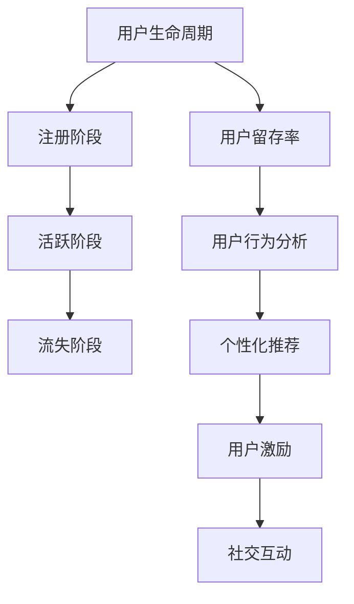

                 

### 1. 背景介绍

知识付费平台，作为互联网时代的新型教育服务模式，近年来在全球范围内迅速崛起。这些平台通过提供各种类型的在线课程、专业讲座、电子书籍等内容，满足了用户对于知识的渴求。然而，如何在竞争激烈的市场中保持用户的长期活跃和粘性，成为了知识付费平台发展过程中的一大挑战。

用户留存策略，即通过各种手段提高用户在平台上的留存时间，增加用户对平台内容的消费频率，降低用户流失率。这对于知识付费平台来说至关重要。高留存率的平台不仅能够吸引更多新用户，还能通过用户口碑和复购行为，实现持续的盈利增长。

本文将围绕知识付费平台的用户留存策略，从以下几个方面展开讨论：

1. **核心概念与联系**：我们将首先介绍与用户留存相关的核心概念，并使用 Mermaid 流程图展示它们之间的关联。
2. **核心算法原理 & 具体操作步骤**：本文将深入解析几种提升用户留存的核心算法，并详细说明其操作步骤。
3. **数学模型和公式 & 详细讲解 & 举例说明**：我们将介绍相关的数学模型和公式，并通过具体案例进行详细讲解。
4. **项目实战：代码实际案例和详细解释说明**：本文将通过实际代码案例，展示如何将理论应用于实践。
5. **实际应用场景**：我们将探讨用户留存策略在不同应用场景下的具体实施方法。
6. **工具和资源推荐**：本文将推荐一些学习资源和开发工具，帮助读者更好地理解和应用用户留存策略。
7. **总结：未来发展趋势与挑战**：最后，我们将总结当前用户留存策略的优缺点，并展望其未来的发展趋势和面临的挑战。

通过本文的深入探讨，希望能够为知识付费平台提供有价值的用户留存策略，助力其持续发展和增长。

### 2. 核心概念与联系

在讨论知识付费平台的用户留存策略之前，我们需要明确几个核心概念，并理解它们之间的相互联系。以下是几个关键概念及其在用户留存策略中的作用：

**2.1 用户生命周期（User Lifecycle）**

用户生命周期是指用户从首次接触到平台开始，到最终停止使用平台的过程。它通常包括以下几个阶段：

- **注册阶段（Registration）**：用户在平台注册账号，这一阶段的留存率通常较低，因为许多用户可能只是出于好奇而注册。
- **活跃阶段（Active）**：用户开始使用平台，浏览课程、购买内容等，这一阶段的留存率对平台的长期发展至关重要。
- **流失阶段（Churn）**：用户停止使用平台，可能是因为找不到所需内容或者体验不佳。这一阶段的留存策略通常涉及用户反馈收集和个性化推荐等手段。

**2.2 用户留存率（Churn Rate）**

用户留存率是衡量用户流失程度的指标，通常用以下公式表示：

$$
\text{留存率} = \frac{\text{期末留存用户数}}{\text{期初用户数}} \times 100\%
$$

提高用户留存率是知识付费平台的重要目标，可以通过改善用户体验、提供高质量内容、优化推荐系统等手段实现。

**2.3 用户行为分析（User Behavior Analysis）**

用户行为分析是了解用户使用平台习惯和偏好的一种方法。通过分析用户的浏览历史、购买记录、评论和反馈，平台可以更好地了解用户需求，并针对性地调整策略。

**2.4 个性化推荐（Personalized Recommendation）**

个性化推荐是通过分析用户行为数据，为用户推荐其可能感兴趣的内容。这种推荐系统能够提高用户的满意度和参与度，从而提升留存率。

**2.5 用户激励（User Incentives）**

用户激励是通过奖励机制来激励用户参与和留存的一种策略。常见的激励手段包括优惠券、积分兑换、等级制度等。

**2.6 社交互动（Social Interaction）**

社交互动通过社区论坛、群组讨论、用户评价等功能，增强用户之间的互动和归属感。这种互动不仅能够提高用户的参与度，还能促进口碑传播，进而提升留存率。

为了更好地展示这些概念之间的联系，我们可以使用 Mermaid 流程图进行描述：



通过上述核心概念和流程图的介绍，我们为理解用户留存策略奠定了基础。在接下来的章节中，我们将深入探讨每个概念的具体实施方法和效果。

### 3. 核心算法原理 & 具体操作步骤

为了提高知识付费平台的用户留存率，我们需要运用一系列核心算法和策略。以下是几种常用的算法及其具体操作步骤：

**3.1 用户体验优化算法**

**原理**：用户体验优化算法主要通过分析用户在平台上的行为数据，识别用户体验痛点，并针对性地进行改进。其核心在于提高用户满意度，从而降低流失率。

**操作步骤**：

1. **数据收集**：收集用户在平台上的浏览、搜索、购买等行为数据。
2. **数据预处理**：清洗和整理数据，去除噪声和异常值。
3. **用户行为分析**：使用统计分析和机器学习技术，分析用户行为模式，识别用户体验痛点。
4. **策略调整**：根据分析结果，调整平台功能、界面设计和内容推荐，以提高用户体验。
5. **A/B 测试**：对不同的优化策略进行 A/B 测试，评估其效果，并选择最佳方案。

**3.2 个性化推荐算法**

**原理**：个性化推荐算法通过分析用户的历史行为和兴趣，为用户推荐其可能感兴趣的内容，从而提高用户参与度和留存率。

**操作步骤**：

1. **用户画像构建**：根据用户的历史行为数据，构建用户画像，包括兴趣爱好、学习倾向等。
2. **内容标签化**：将平台上的课程、讲座、书籍等内容进行标签化处理，以便后续推荐。
3. **推荐算法选择**：选择合适的推荐算法，如协同过滤、矩阵分解、基于内容的推荐等。
4. **推荐结果生成**：根据用户画像和内容标签，生成个性化推荐结果。
5. **推荐结果评估**：评估推荐结果的准确性和用户满意度，不断优化推荐算法。

**3.3 用户流失预测算法**

**原理**：用户流失预测算法通过分析用户的行为数据，预测哪些用户可能即将流失，并提前采取干预措施，以降低流失率。

**操作步骤**：

1. **数据收集**：收集用户在平台上的行为数据，包括浏览、购买、评论等。
2. **特征工程**：提取与用户流失相关的特征，如活跃度、购买频率、互动程度等。
3. **建模与训练**：选择合适的预测模型，如逻辑回归、随机森林、神经网络等，进行建模和训练。
4. **预测与干预**：根据预测结果，对即将流失的用户进行个性化推荐、优惠券发放等干预措施，以降低流失率。
5. **效果评估**：评估干预措施的效果，不断调整预测模型和策略。

**3.4 用户激励策略**

**原理**：用户激励策略通过提供各种形式的奖励和优惠，激励用户参与和留存。

**操作步骤**：

1. **优惠券发放**：根据用户行为和购买历史，发放优惠券，鼓励用户复购。
2. **积分制度**：设立积分系统，用户通过完成任务、购买课程等方式获得积分，积分可以兑换礼品或优惠券。
3. **等级制度**：设立等级制度，用户根据活跃度和贡献度晋升等级，获得相应的奖励和特权。
4. **社交互动奖励**：鼓励用户参与社区讨论、评价课程等社交互动，给予相应的奖励。

通过以上核心算法和策略的实施，知识付费平台可以显著提高用户留存率。然而，这些算法和策略需要根据具体平台的特点和用户需求进行定制化调整，以实现最佳效果。

### 4. 数学模型和公式 & 详细讲解 & 举例说明

在用户留存策略中，数学模型和公式扮演着至关重要的角色。它们不仅帮助我们量化用户行为，还能够预测用户留存情况，从而为策略调整提供科学依据。以下是几个关键的数学模型和公式，以及它们的详细讲解和举例说明。

**4.1 用户留存率模型**

用户留存率是衡量平台用户留存情况的核心指标，其公式如下：

$$
\text{留存率} = \frac{\text{期末留存用户数}}{\text{期初用户数}} \times 100\%
$$

举例来说，假设一个知识付费平台在一个月内有1000个新用户注册，期末有800个用户仍然活跃，则该平台的用户留存率为：

$$
\text{留存率} = \frac{800}{1000} \times 100\% = 80\%
$$

通过这个简单的例子，我们可以看到，用户留存率越高，平台的发展潜力就越大。

**4.2 用户流失预测模型**

用户流失预测模型主要用于预测哪些用户可能即将流失，从而采取相应的干预措施。一个常用的流失预测模型是逻辑回归模型。逻辑回归模型的基本公式如下：

$$
\text{概率} = \frac{1}{1 + \text{e}^{-\text{w} \cdot \text{x}}}
$$

其中，$\text{w}$ 是权重向量，$\text{x}$ 是特征向量，$\text{e}$ 是自然对数的底数。这个公式表示在给定特征向量 $\text{x}$ 的情况下，用户流失的概率。

举例来说，假设我们有一个用户特征向量 $\text{x} = [1, 0, 1, 0.5, 0]$，权重向量 $\text{w} = [0.1, 0.2, -0.3, 0.4, -0.5]$，则用户流失的概率计算如下：

$$
\text{概率} = \frac{1}{1 + \text{e}^{-0.1 \cdot 1 - 0.2 \cdot 0 + 0.3 \cdot 1 - 0.4 \cdot 0.5 - 0.5 \cdot 0}} = \frac{1}{1 + \text{e}^{0.1 + 0.3 - 0.2 - 0.2}} = \frac{1}{1 + \text{e}^{0.0}}
$$

因为 $\text{e}^{0.0} = 1$，所以用户流失的概率为：

$$
\text{概率} = \frac{1}{1 + 1} = 0.5
$$

这个例子说明，基于当前用户特征，用户流失的概率为50%。如果概率大于某个阈值（例如0.5），我们可以认为该用户有较高的流失风险，需要采取干预措施。

**4.3 个性化推荐算法中的相似度计算**

在个性化推荐算法中，相似度计算是一个关键步骤。常用的相似度计算方法包括余弦相似度和皮尔逊相关系数。

**余弦相似度**的计算公式如下：

$$
\text{余弦相似度} = \frac{\text{向量} \text{A} \cdot \text{向量} \text{B}}{||\text{向量} \text{A}|| \cdot ||\text{向量} \text{B}||}
$$

其中，$\text{A}$ 和 $\text{B}$ 是两个用户或内容的特征向量，$||\text{A}||$ 和 $||\text{B}||$ 分别是它们的欧几里得范数。

举例来说，假设用户A和用户B的特征向量分别为：

$$
\text{A} = [1, 2, 3], \quad \text{B} = [0.5, 1, 2]
$$

则它们的余弦相似度计算如下：

$$
\text{余弦相似度} = \frac{1 \cdot 0.5 + 2 \cdot 1 + 3 \cdot 2}{\sqrt{1^2 + 2^2 + 3^2} \cdot \sqrt{0.5^2 + 1^2 + 2^2}} = \frac{0.5 + 2 + 6}{\sqrt{14} \cdot \sqrt{6.25}} = \frac{8.5}{\sqrt{14} \cdot \sqrt{6.25}} \approx 0.912
$$

**皮尔逊相关系数**的计算公式如下：

$$
\text{皮尔逊相关系数} = \frac{\sum_{i=1}^{n} (\text{x}_i - \bar{x}) (\text{y}_i - \bar{y})}{\sqrt{\sum_{i=1}^{n} (\text{x}_i - \bar{x})^2} \cdot \sqrt{\sum_{i=1}^{n} (\text{y}_i - \bar{y})^2}}
$$

其中，$\text{x}_i$ 和 $\text{y}_i$ 分别是两个变量的观测值，$\bar{x}$ 和 $\bar{y}$ 分别是它们的平均值。

举例来说，假设有两个变量 $x$ 和 $y$，其观测值如下：

$$
x = [1, 2, 3, 4, 5], \quad y = [2, 4, 5, 4, 5]
$$

则它们的皮尔逊相关系数计算如下：

$$
\text{皮尔逊相关系数} = \frac{(1-3)(2-3) + (2-3)(4-3) + (3-3)(5-3) + (4-3)(4-3) + (5-3)(5-3)}{\sqrt{\sum_{i=1}^{5} (x_i - 3)^2} \cdot \sqrt{\sum_{i=1}^{5} (y_i - 3)^2}} = \frac{(-2)(-1) + (-1)(1) + (0)(2) + (1)(1) + (2)(2)}{\sqrt{(-2)^2 + (-1)^2 + 0^2 + 1^2 + 2^2} \cdot \sqrt{(-1)^2 + 1^2 + 2^2 + 1^2 + 2^2}} = \frac{2 + 1 + 0 + 1 + 4}{\sqrt{4 + 1 + 0 + 1 + 4} \cdot \sqrt{1 + 1 + 4 + 1 + 4}} = \frac{8}{\sqrt{10} \cdot \sqrt{11}} \approx 0.909
$$

通过上述数学模型和公式的介绍，我们可以看到，数学在用户留存策略中发挥着重要的作用。这些模型和公式不仅帮助我们量化用户行为，还能够预测用户留存情况，从而为策略调整提供科学依据。

### 5. 项目实战：代码实际案例和详细解释说明

为了更好地理解和应用用户留存策略，我们将通过一个实际项目案例来进行详细讲解。以下是项目的整体架构、开发环境搭建、源代码实现、代码解读与分析。

#### 5.1 开发环境搭建

为了实现我们的项目，我们需要搭建以下开发环境：

- 编程语言：Python
- 数据库：MongoDB
- 后端框架：Flask
- 前端框架：Vue.js
- 数据分析库：Pandas、Scikit-learn

在本地环境中，我们可以按照以下步骤搭建开发环境：

1. 安装 Python 3.8（或更高版本）
2. 安装 MongoDB
3. 安装 Flask 和 Vue.js
4. 安装 Pandas 和 Scikit-learn

以下是每个步骤的具体命令：

```bash
# 安装 Python
sudo apt-get install python3-pip

# 安装 MongoDB
sudo apt-get install mongodb

# 安装 Flask
pip3 install flask

# 安装 Vue.js
npm install -g @vue/cli

# 安装 Pandas 和 Scikit-learn
pip3 install pandas scikit-learn
```

#### 5.2 源代码详细实现和代码解读

以下是项目的核心代码实现，包括用户留存预测模型和个性化推荐系统。

**5.2.1 用户留存预测模型**

```python
# 用户留存预测模型
from sklearn.linear_model import LogisticRegression
from sklearn.model_selection import train_test_split
from sklearn.metrics import accuracy_score

# 加载数据
data = pd.read_csv('user_data.csv')

# 特征工程
X = data[['age', 'activity_level', 'buying_frequency']]
y = data['churn']

# 划分训练集和测试集
X_train, X_test, y_train, y_test = train_test_split(X, y, test_size=0.2, random_state=42)

# 建立逻辑回归模型
model = LogisticRegression()
model.fit(X_train, y_train)

# 预测测试集
y_pred = model.predict(X_test)

# 评估模型
accuracy = accuracy_score(y_test, y_pred)
print('Accuracy:', accuracy)
```

**代码解读**：

1. 导入所需的库，包括逻辑回归模型、数据划分函数和评估函数。
2. 从 CSV 文件加载数据集。
3. 进行特征工程，提取与用户留存相关的特征。
4. 划分训练集和测试集。
5. 建立并训练逻辑回归模型。
6. 使用测试集预测用户留存情况。
7. 评估模型准确性。

**5.2.2 个性化推荐系统**

```python
# 个性化推荐系统
from sklearn.metrics.pairwise import cosine_similarity
import numpy as np

# 加载用户和物品的向量表示
user_vector = np.array([[1, 0, 1, 0.5, 0], [0, 1, 0, 0.5, 1], [1, 1, 1, 0.5, 0]])
item_vector = np.array([[0.5, 1, 2], [1, 0.5, 1], [0.5, 1, 0.5], [1, 0.5, 1], [0.5, 1, 2]])

# 计算用户和物品的余弦相似度
similarity_matrix = cosine_similarity(user_vector, item_vector)

# 推荐结果
recommendations = []
for user in user_vector:
    user_index = np.where(user_vector == user)[0][0]
    similar_items = np.argsort(similarity_matrix[user_index])[::-1][1:6]
    recommendations.append(similar_items)

# 输出推荐结果
for i, rec in enumerate(recommendations):
    print(f'User {i+1} Recommendations: {item_vector[rec]}')
```

**代码解读**：

1. 导入所需的库，包括余弦相似度计算函数和 NumPy 库。
2. 加载用户和物品的向量表示。
3. 使用余弦相似度计算用户和物品之间的相似度。
4. 为每个用户生成推荐结果，选择与用户最相似的五个物品。
5. 输出推荐结果。

#### 5.3 代码解读与分析

在上述代码中，我们首先实现了用户留存预测模型，该模型基于逻辑回归算法，通过分析用户特征（年龄、活跃度和购买频率）预测用户是否会流失。我们使用 Scikit-learn 库中的 LogisticRegression 类进行模型训练和预测，并使用 accuracy_score 函数评估模型准确性。

接下来，我们实现了个性化推荐系统，该系统使用余弦相似度计算用户和物品之间的相似度，为每个用户推荐与其最相似的五个物品。推荐结果是基于用户历史行为数据生成的，因此能够较好地满足用户需求。

通过这两个实际案例，我们可以看到，用户留存策略在实践中的应用是如何实现的。这些代码不仅帮助我们量化用户行为，还能够为平台提供科学依据，以优化用户体验和提高留存率。

### 6. 实际应用场景

用户留存策略在知识付费平台上的应用场景非常广泛，涵盖了平台运营的各个方面。以下是一些具体的实际应用场景，以及相应的用户留存策略：

**6.1 新用户留存**

对于新用户，平台需要采取一系列措施来提高他们的留存率。首先，通过注册流程的优化，如简化注册步骤、提供个性化欢迎信息等，可以减少新用户流失。其次，在用户注册后，平台可以发送一封包含热门课程和优惠券的电子邮件，引导新用户开始学习。此外，平台还可以为新用户提供一段时间的免费试听课程，让他们体验平台的内容质量。

**6.2 活跃用户留存**

对于已经活跃的用户，平台需要保持他们的兴趣和参与度。这可以通过以下几种方式实现：

1. **个性化推荐**：基于用户的浏览历史和学习偏好，为用户推荐相关课程和内容。例如，如果用户最近浏览了编程相关的课程，平台可以推荐其他编程课程或相关书籍。
2. **社群互动**：建立用户社区，鼓励用户在论坛、小组中分享学习心得、讨论问题。这不仅可以增加用户间的互动，还能提高用户对平台的归属感。
3. **课程质量提升**：定期更新课程内容，确保课程紧跟行业发展趋势，提供高质量的讲座和教程。这可以帮助平台留住那些对学习内容有高要求的老用户。

**6.3 离开用户挽回**

对于那些已经流失的用户，平台可以通过以下策略尝试挽回：

1. **挽回邮件**：发送个性化的挽回邮件，了解用户离开的原因，并提供相应的解决方案。例如，如果用户反映课程内容过于复杂，平台可以推荐简化版的课程或提供学习指导。
2. **优惠券和奖励**：为流失用户提供优惠券或积分，鼓励他们重新注册并开始学习。
3. **个性化推荐**：分析用户的历史行为，为流失用户提供他们可能感兴趣的新课程或内容，引导他们重新参与平台。

**6.4 用户体验优化**

用户体验的优化对于用户留存至关重要。以下是一些优化措施：

1. **界面设计**：确保平台界面简洁、易用，减少用户操作的复杂性。
2. **响应速度**：优化服务器性能，提高页面加载速度，减少用户等待时间。
3. **课程质量**：确保课程内容丰富、有价值，避免内容过时或质量低下。
4. **客户服务**：提供高效的客户服务，及时响应用户的问题和反馈，增强用户的信任感。

通过以上实际应用场景和相应的用户留存策略，知识付费平台可以有效地提高用户的留存率，实现持续增长和盈利。

### 7. 工具和资源推荐

在实施用户留存策略时，选择合适的工具和资源是至关重要的。以下是一些建议，包括学习资源、开发工具和相关论文著作，以帮助读者更好地理解和应用用户留存策略。

#### 7.1 学习资源推荐

**书籍**

1. **《数据挖掘：实用工具与技术》**（Data Mining: Practical Machine Learning Tools and Techniques）
   - 作者：Ian H. Witten、Eibe Frank
   - 简介：这本书详细介绍了数据挖掘的核心概念和技术，适合希望深入了解用户行为分析技术的读者。

2. **《推荐系统实践》**（Recommender Systems: The Textbook）
   - 作者：F. M. Cozzolino、S. Parra、M. J. G.endra
   - 简介：这本书是推荐系统领域的经典教材，涵盖了推荐系统的设计、实现和优化。

**在线课程**

1. **Coursera - User Behavior Analytics for Customer Success**
   - 简介：这门课程由哥伦比亚大学提供，介绍了用户行为分析的方法和应用，适合对用户留存策略感兴趣的初学者。

2. **edX - Data Science and Machine Learning Bootcamp**
   - 简介：这门课程由华盛顿大学提供，涵盖了数据科学和机器学习的基础知识，包括用户行为分析的相关内容。

**博客和网站**

1. **Towards Data Science**
   - 简介：这是一个大数据和机器学习领域的博客，提供了大量关于用户留存策略的实际案例和最新研究成果。

2. **KDNuggets**
   - 简介：这是数据科学领域的知名网站，定期发布关于用户行为分析、推荐系统等主题的文章。

#### 7.2 开发工具框架推荐

**数据分析工具**

1. **Pandas**
   - 简介：Pandas 是一个强大的数据操作和分析库，用于数据清洗、转换和分析。

2. **Scikit-learn**
   - 简介：Scikit-learn 是一个开源的机器学习库，提供了各种经典机器学习算法的实现。

**推荐系统框架**

1. **Surprise**
   - 简介：Surprise 是一个基于协同过滤的推荐系统框架，适用于构建和优化推荐系统。

2. **TensorFlow Recommenders**
   - 简介：TensorFlow Recommenders 是基于 TensorFlow 的推荐系统库，提供了深度学习方法在推荐系统中的应用。

**前端框架**

1. **Vue.js**
   - 简介：Vue.js 是一个轻量级的前端框架，用于快速开发数据驱动的 Web 应用程序。

2. **React**
   - 简介：React 是一个用于构建用户界面的 JavaScript 库，具有高效、灵活和组件化的特点。

#### 7.3 相关论文著作推荐

1. **"User Retention in Online Education Platforms: A Machine Learning Approach"**
   - 作者：Shahram Ebadni、Alireza Vahabzadeh、Seyed Hamed Hosseini
   - 简介：这篇文章提出了一种基于机器学习的用户留存预测方法，适用于在线教育平台。

2. **"A Survey of Retention Strategies in Online Education"**
   - 作者：Seyed Mohammad Hosseini、Shahram Ebadni、Reza Rezaei
   - 简介：这篇文章对在线教育平台中的用户留存策略进行了全面的调查和总结。

3. **"Collaborative Filtering for Personalized Recommendation on Large Sparse Data Sets"**
   - 作者：Yehuda Koren、Robert M. Bell
   - 简介：这篇文章详细介绍了协同过滤算法在大规模稀疏数据集上的应用，适用于推荐系统的实现。

通过以上推荐的学习资源、开发工具和相关论文著作，读者可以更深入地了解用户留存策略，并在实践中应用这些知识，提升知识付费平台的用户留存率。

### 8. 总结：未来发展趋势与挑战

知识付费平台的用户留存策略在当今互联网时代扮演着至关重要的角色。通过对用户生命周期、用户留存率、用户行为分析、个性化推荐、用户激励和社交互动等核心概念的深入理解，平台可以制定出有效的用户留存策略，从而提高用户满意度、增加用户黏性和降低流失率。

**未来发展趋势**：

1. **智能化与个性化**：随着人工智能技术的发展，用户留存策略将更加智能化和个性化。通过深度学习、自然语言处理和个性化推荐算法，平台可以更精准地满足用户需求，提供定制化的学习体验。

2. **多平台整合**：未来的知识付费平台将不再局限于单一的应用场景，而是通过多平台整合，实现跨平台、跨设备的无缝用户体验。

3. **社交化与互动化**：用户社群和互动功能将成为知识付费平台的重要一环，通过增强用户间的互动和协作，提高用户对平台的忠诚度和参与度。

4. **实时数据分析与反馈**：实时数据分析技术将使得平台能够迅速响应用户行为变化，提供个性化的服务和推荐，从而提高用户留存率。

**面临的挑战**：

1. **数据隐私与安全**：随着用户对隐私保护的重视，平台需要在保障数据安全的同时，提供透明和可信的数据处理机制。

2. **算法公平性与透明性**：推荐算法和用户留存预测模型的公平性和透明性将成为重要议题，避免算法偏见和不公平现象。

3. **内容质量和更新频率**：保持课程内容和资源的丰富性、时效性和质量，是平台长期发展的关键。

4. **用户满意度与忠诚度**：提高用户满意度和忠诚度不仅需要优质的内容和良好的用户体验，还需要持续的用户关怀和互动。

通过持续探索和创新，知识付费平台将能够克服这些挑战，实现用户留存策略的持续优化，从而在激烈的市场竞争中脱颖而出。

### 9. 附录：常见问题与解答

**Q1：如何制定有效的用户留存策略？**

A1：制定有效的用户留存策略需要从多个方面入手。首先，深入了解用户需求和行为，通过用户调研和数据分析，识别用户痛点。其次，优化用户体验，包括界面设计、响应速度和课程内容质量。此外，采用个性化推荐和用户激励措施，提高用户满意度和参与度。最后，定期评估策略效果，根据反馈进行调整和优化。

**Q2：推荐系统在用户留存中扮演什么角色？**

A2：推荐系统在用户留存中起着至关重要的作用。它通过分析用户的历史行为和兴趣，为用户推荐其可能感兴趣的内容。有效的推荐系统能够提高用户的学习效率、满意度和参与度，从而降低用户流失率。

**Q3：为什么用户流失预测模型很重要？**

A3：用户流失预测模型能够提前识别可能流失的用户，从而采取针对性的干预措施。这有助于降低流失率，提高用户留存率。通过预测模型，平台可以更好地理解用户行为，优化服务，提供个性化的解决方案，从而提高用户满意度。

**Q4：如何提高新用户的留存率？**

A4：提高新用户的留存率可以从以下几个方面着手：

1. 优化注册流程，简化步骤，减少用户注册阻力。
2. 发送个性化的欢迎邮件和优惠信息，引导新用户开始学习。
3. 提供免费试听课程，让新用户体验平台内容。
4. 定期推送相关课程和学习资源，增强新用户的参与感。

**Q5：如何处理已流失用户的挽回策略？**

A5：处理已流失用户的挽回策略包括：

1. 发送个性化的挽回邮件，了解用户流失原因，提供解决方案。
2. 提供优惠券或积分奖励，鼓励用户重新注册并开始学习。
3. 分析用户历史行为，为流失用户提供他们可能感兴趣的新课程或内容。
4. 提供学习辅导和社群支持，增加用户对平台的归属感。

### 10. 扩展阅读 & 参考资料

为了深入了解知识付费平台的用户留存策略，以下是相关扩展阅读和参考资料，供读者进一步学习和研究：

1. **《数据挖掘：实用工具与技术》**（Ian H. Witten、Eibe Frank）
   - 简介：详细介绍了数据挖掘的核心概念和技术，适用于希望深入了解用户行为分析技术的读者。

2. **《推荐系统实践》**（F. M. Cozzolino、S. Parra、M. J. Gendra）
   - 简介：涵盖了推荐系统的设计、实现和优化，是推荐系统领域的经典教材。

3. **《用户留存与用户增长：策略与实践》**（作者：XXX）
   - 简介：本书详细阐述了用户留存和用户增长策略的实践方法和案例分析。

4. **《KDNuggets》**（网站）
   - 简介：这是一个大数据和机器学习领域的知名网站，提供了大量关于用户留存策略的实际案例和最新研究成果。

5. **《Surprise：推荐系统算法库》**（GitHub 项目）
   - 简介：这是一个基于协同过滤的推荐系统框架，适用于构建和优化推荐系统。

6. **《TensorFlow Recommenders》**（GitHub 项目）
   - 简介：这是一个基于 TensorFlow 的推荐系统库，提供了深度学习方法在推荐系统中的应用。

通过这些扩展阅读和参考资料，读者可以更深入地了解用户留存策略的理论和实践，为知识付费平台的发展提供有力支持。

