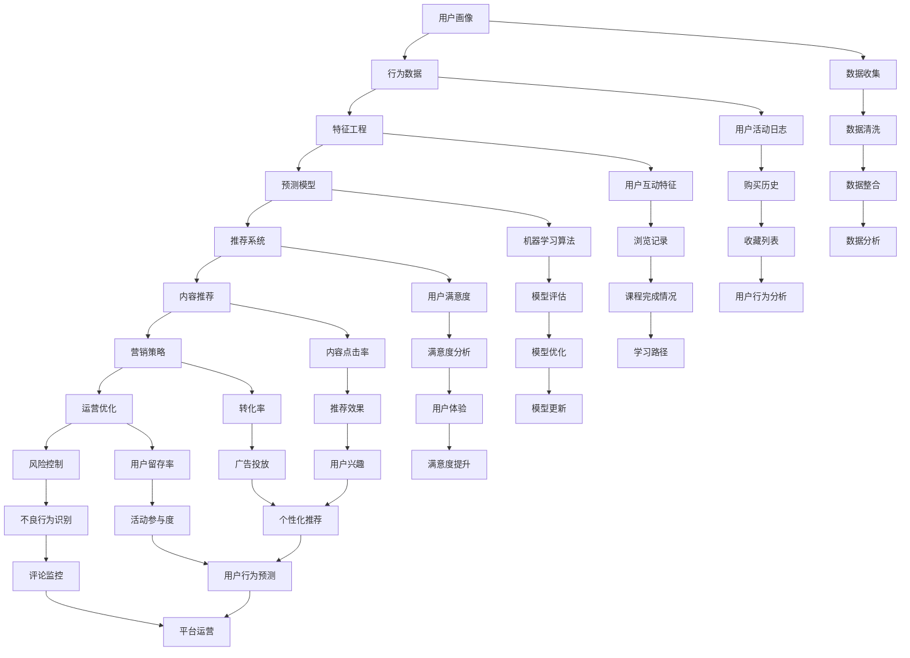

                 

### 背景介绍

#### 知识付费平台的发展背景

知识付费平台作为一种新兴的互联网商业模式，近年来在全球范围内迅速崛起。随着互联网技术的飞速发展和移动设备的普及，人们获取信息和知识的途径变得更加便捷和多元化。知识付费平台正是基于这一需求应运而生，通过提供高质量、有价值的知识内容，满足用户在职业发展、兴趣爱好、技能提升等方面的需求。

知识付费平台的发展可以追溯到2016年左右，当时中国市场上涌现出一批代表性的知识付费平台，如知乎Live、得到、喜马拉雅等。这些平台通过邀请行业专家、学者、知名人士等分享知识内容，迅速吸引了大量用户。随后，知识付费平台在全球范围内逐渐扩展，如美国的Skillshare、Udemy等，也在各自的市场上取得了显著的成功。

#### 用户行为预测的重要性

用户行为预测是知识付费平台发展的核心问题之一。通过对用户行为的深入分析和预测，平台可以更好地了解用户需求，提供个性化的知识内容推荐，从而提高用户满意度和粘性。具体来说，用户行为预测在以下几个方面具有重要意义：

1. **内容推荐：** 通过预测用户的行为特征，知识付费平台可以更精准地推荐符合用户兴趣和需求的内容，提高内容推荐的准确性和用户体验。

2. **营销策略：** 用户行为预测有助于平台制定更有效的营销策略，如精准投放广告、推出限时优惠活动等，提高用户转化率和购买意愿。

3. **运营优化：** 用户行为预测可以辅助平台优化运营流程，如调整课程上线时间、优化用户互动体验等，提高平台整体运营效率。

4. **风险控制：** 用户行为预测有助于平台识别和预防潜在的不良行为，如作弊、恶意评论等，保障平台生态的健康和稳定。

总之，用户行为预测是知识付费平台实现可持续发展的重要手段，有助于提升用户体验、降低运营成本、提高盈利能力。因此，深入研究用户行为预测技术，对于知识付费平台的发展具有重要意义。接下来，我们将从核心概念、算法原理、数学模型、项目实战等方面，详细探讨用户行为预测的实现方法和技术细节。### 核心概念与联系

在深入探讨用户行为预测之前，我们需要先了解一些核心概念和它们之间的联系。这些概念包括用户画像、行为数据、特征工程和预测模型等。以下是一个详细的 Mermaid 流程图，用于展示这些核心概念及其相互关系。



#### 核心概念详解

1. **用户画像 (A)**：用户画像是对用户基本属性、兴趣偏好、行为习惯等进行全面描述的模型。它通常包括年龄、性别、职业、地理位置、兴趣爱好、消费习惯等维度。用户画像为后续的用户行为预测和个性化推荐提供了基础数据。

2. **行为数据 (B)**：行为数据是用户在使用知识付费平台过程中的各种操作记录，如浏览历史、购买记录、评论反馈、课程完成情况等。这些数据是构建用户画像和进行行为预测的重要来源。

3. **特征工程 (C)**：特征工程是通过对原始数据进行预处理、转换和特征提取，构建出能够有效表示用户行为的特征向量。特征工程的质量直接影响到预测模型的性能。

4. **预测模型 (D)**：预测模型是利用用户画像和行为数据进行训练的算法，旨在预测用户未来的行为，如是否购买课程、是否继续使用平台等。常见的预测模型包括逻辑回归、决策树、随机森林、神经网络等。

5. **推荐系统 (E)**：推荐系统是基于用户历史行为和偏好，为用户提供个性化内容推荐的技术。它通常包括内容推荐、商品推荐、广告推荐等。

6. **内容推荐 (F)**：内容推荐是根据用户的兴趣和需求，向其推荐可能感兴趣的知识内容。它是知识付费平台的核心功能之一。

7. **营销策略 (G)**：营销策略是通过一系列营销手段，如广告投放、优惠活动、会员制度等，吸引用户关注并促使用户购买课程。

8. **运营优化 (H)**：运营优化是通过分析用户行为数据和平台运营数据，调整和优化平台的运营策略，以提高用户满意度和平台盈利能力。

9. **风险控制 (I)**：风险控制是通过监控和预测用户行为，识别和预防潜在的不良行为，保障平台生态的健康和稳定。

通过上述 Mermaid 流程图，我们可以清晰地看到各个核心概念之间的相互联系和作用。在接下来的章节中，我们将进一步探讨用户行为预测的算法原理、数学模型以及项目实战。### 核心算法原理 & 具体操作步骤

在用户行为预测中，算法的选择和具体操作步骤至关重要。本文将介绍几种常见的用户行为预测算法，包括逻辑回归、决策树和神经网络等，并详细描述每种算法的具体实现步骤。

#### 逻辑回归（Logistic Regression）

逻辑回归是一种广泛应用于分类问题的统计模型，其输出结果是一个概率值，表示某一类别发生的概率。在用户行为预测中，逻辑回归常用于预测用户是否会在未来进行某一行为，如购买课程、继续使用平台等。

**步骤：**

1. **数据预处理：** 对用户行为数据进行清洗和预处理，包括缺失值处理、异常值过滤和特征工程。

2. **特征选择：** 选择与用户行为相关的特征，如用户年龄、地理位置、浏览历史、购买记录等。

3. **构建模型：** 利用预处理后的数据，通过训练集构建逻辑回归模型。模型参数通过最小化损失函数（如对数似然损失）来优化。

4. **模型评估：** 使用验证集和测试集评估模型的性能，常用的评估指标包括准确率、召回率、F1分数等。

5. **模型应用：** 在新数据上应用已训练好的模型，预测用户未来的行为。

**数学模型：**

逻辑回归的数学模型可以表示为：
$$
\text{logit}(P) = \log\left(\frac{P}{1 - P}\right) = \beta_0 + \beta_1 x_1 + \beta_2 x_2 + \ldots + \beta_n x_n
$$
其中，$P$ 是用户进行某一行为的概率，$x_1, x_2, \ldots, x_n$ 是用户特征，$\beta_0, \beta_1, \beta_2, \ldots, \beta_n$ 是模型参数。

#### 决策树（Decision Tree）

决策树是一种基于树形结构进行决策的算法，通过一系列规则将数据划分为不同的类别。在用户行为预测中，决策树可以用来判断用户是否会进行某一行为。

**步骤：**

1. **数据预处理：** 与逻辑回归类似，对用户行为数据进行清洗和预处理。

2. **特征选择：** 选择与用户行为相关的特征。

3. **构建模型：** 使用信息增益或基尼不纯度等指标选择最佳特征和阈值，递归地构建决策树。

4. **模型评估：** 使用验证集和测试集评估模型性能。

5. **模型应用：** 在新数据上应用已训练好的决策树模型，预测用户行为。

**数学模型：**

决策树的数学模型可以表示为一系列条件概率分布，每个节点代表一个特征，每个分支代表一个阈值。

$$
P(Y = 1 | X) =
\begin{cases}
1, & \text{if } X \text{ satisfies the leaf node condition} \\
0, & \text{otherwise}
\end{cases}
$$

#### 神经网络（Neural Network）

神经网络是一种模拟人脑神经元连接方式的计算模型，通过多层次的神经网络结构进行学习和预测。在用户行为预测中，神经网络可以捕捉复杂的数据模式。

**步骤：**

1. **数据预处理：** 与前两种算法类似，对用户行为数据进行清洗和预处理。

2. **特征选择：** 选择与用户行为相关的特征。

3. **构建模型：** 设计神经网络结构，包括输入层、隐藏层和输出层。使用反向传播算法训练模型。

4. **模型评估：** 使用验证集和测试集评估模型性能。

5. **模型应用：** 在新数据上应用已训练好的神经网络模型，预测用户行为。

**数学模型：**

神经网络的数学模型可以表示为：
$$
\text{output} = \sigma(\text{weight} \cdot \text{input} + \text{bias})
$$
其中，$\sigma$ 是激活函数（如 sigmoid、ReLU 等），$\text{weight}$ 和 $\text{bias}$ 是模型参数。

通过以上三种算法的介绍，我们可以看到逻辑回归、决策树和神经网络在用户行为预测中的应用和具体操作步骤。接下来，我们将进一步探讨这些算法的数学模型和具体实现细节。### 数学模型和公式 & 详细讲解 & 举例说明

在用户行为预测中，数学模型和公式起到了至关重要的作用。本文将详细介绍逻辑回归、决策树和神经网络等常见算法的数学模型，并使用具体例子进行说明。

#### 逻辑回归

逻辑回归是一种常用的分类算法，其核心思想是通过线性组合输入特征并应用一个非线性函数来预测类别概率。逻辑回归的数学模型可以表示为：

$$
\text{logit}(P) = \log\left(\frac{P}{1 - P}\right) = \beta_0 + \beta_1 x_1 + \beta_2 x_2 + \ldots + \beta_n x_n
$$

其中，$\text{logit}(P)$ 是预测概率的对数，$P$ 是用户进行某一行为的概率，$x_1, x_2, \ldots, x_n$ 是用户特征，$\beta_0, \beta_1, \beta_2, \ldots, \beta_n$ 是模型参数。

**举例说明：**

假设我们要预测一个用户是否会购买课程，用户特征包括年龄、地理位置和浏览历史。我们可以将逻辑回归模型表示为：

$$
\text{logit}(P) = \beta_0 + \beta_1 \text{Age} + \beta_2 \text{Location} + \beta_3 \text{History}
$$

通过训练数据，我们可以得到各个特征的权重参数。例如，假设训练得到的结果如下：

$$
\text{logit}(P) = 0.5 + 0.1 \times 30 + 0.2 \times 'Beijing' + 0.3 \times 5
$$

对于一个新的用户，如果年龄为30岁，地理位置为北京，浏览历史为5次，则其预测概率为：

$$
\text{logit}(P) = 0.5 + 0.1 \times 30 + 0.2 \times 'Beijing' + 0.3 \times 5 = 1.5
$$

转换为概率：

$$
P = \frac{e^{\text{logit}(P)}}{1 + e^{\text{logit}(P)}} = \frac{e^{1.5}}{1 + e^{1.5}} \approx 0.737
$$

因此，该用户购买课程的概率约为 73.7%。

#### 决策树

决策树是一种基于树形结构进行决策的算法，每个节点代表一个特征，每个分支代表一个阈值。决策树的数学模型可以表示为一系列条件概率分布。

$$
P(Y = 1 | X) =
\begin{cases}
1, & \text{if } X \text{ satisfies the leaf node condition} \\
0, & \text{otherwise}
\end{cases}
$$

其中，$Y$ 是用户是否进行某一行为的标签，$X$ 是用户特征。

**举例说明：**

假设我们要预测用户是否购买课程，特征包括年龄、地理位置和浏览历史。决策树的构建过程如下：

1. **选择最佳特征：** 计算每个特征的信息增益或基尼不纯度，选择信息增益最高的特征作为分裂特征。

2. **设定阈值：** 对于选定的特征，根据验证集的数据，确定最佳阈值。

3. **递归构建：** 对于每个子集，重复上述步骤，直到满足停止条件（如最大深度、最小样本数等）。

假设我们选择年龄作为分裂特征，阈值设定为30岁。决策树可以表示为：

$$
P(Y = 1 | \text{Age} \leq 30) = 0.6 \\
P(Y = 1 | \text{Age} > 30) = 0.8
$$

对于一个新的用户，如果年龄为25岁，则其购买课程的概率为0.6；如果年龄为35岁，则其购买课程的概率为0.8。

#### 神经网络

神经网络是一种基于多层感知器的计算模型，其核心思想是通过多层非线性变换来学习输入和输出之间的关系。神经网络的数学模型可以表示为：

$$
\text{output} = \sigma(\text{weight} \cdot \text{input} + \text{bias})
$$

其中，$\sigma$ 是激活函数（如 sigmoid、ReLU 等），$\text{weight}$ 和 $\text{bias}$ 是模型参数。

**举例说明：**

假设我们要构建一个简单的神经网络，用于预测用户是否购买课程，输入层包含年龄、地理位置和浏览历史三个特征，隐藏层包含两个神经元，输出层为二元分类结果。

1. **初始化参数：** 随机初始化权重和偏置。

2. **前向传播：** 将输入特征通过多层感知器传递，得到输出结果。

$$
\text{hidden\_layer} = \sigma(\text{weight} \cdot \text{input} + \text{bias}) \\
\text{output} = \sigma(\text{weight} \cdot \text{hidden\_layer} + \text{bias})
$$

3. **反向传播：** 计算输出层和隐藏层的梯度，更新模型参数。

$$
\text{output\_error} = \text{output} - \text{target} \\
\text{hidden\_error} = \text{hidden\_layer} \times (1 - \text{hidden\_layer}) \times \text{weight} \cdot \text{output\_error} \\
\text{weight} += \text{learning\_rate} \times \text{input} \cdot \text{output\_error} \\
\text{bias} += \text{learning\_rate} \times \text{output\_error} \\
$$

通过以上步骤，我们可以训练一个神经网络模型，并使用它来预测用户是否购买课程。

总之，逻辑回归、决策树和神经网络是用户行为预测中常用的算法，每种算法都有其独特的数学模型和实现方式。在具体应用中，我们可以根据数据特征和需求选择合适的算法，并对其进行优化和调整。### 项目实战：代码实际案例和详细解释说明

在本节中，我们将通过一个实际案例，详细展示如何使用Python编写代码实现用户行为预测模型。该案例将涵盖开发环境的搭建、源代码实现和详细解释说明。

#### 1. 开发环境搭建

在开始编写代码之前，我们需要搭建一个合适的开发环境。以下是所需的基本工具和库：

- **Python 3.x**：作为主要编程语言
- **Jupyter Notebook**：用于编写和运行代码
- **NumPy**：用于数据处理
- **Pandas**：用于数据分析和操作
- **Scikit-learn**：用于机器学习模型的训练和评估
- **Matplotlib**：用于数据可视化

**安装步骤：**

1. 安装Python 3.x（如果尚未安装）。
2. 打开终端或命令行，执行以下命令安装所需库：

```bash
pip install numpy pandas scikit-learn matplotlib
```

3. 启动Jupyter Notebook，开始编写代码。

#### 2. 源代码详细实现和代码解读

以下是用户行为预测项目的源代码实现，包括数据预处理、模型训练和评估等步骤。

```python
# 导入所需库
import numpy as np
import pandas as pd
from sklearn.model_selection import train_test_split
from sklearn.linear_model import LogisticRegression
from sklearn.metrics import accuracy_score, confusion_matrix, classification_report
import matplotlib.pyplot as plt

# 加载数据集
data = pd.read_csv('user_behavior_data.csv')

# 数据预处理
# 确保所有特征都是数值类型
data = data.apply(pd.to_numeric, errors='coerce')

# 划分特征和标签
X = data.drop('Purchase', axis=1)
y = data['Purchase']

# 划分训练集和测试集
X_train, X_test, y_train, y_test = train_test_split(X, y, test_size=0.2, random_state=42)

# 使用逻辑回归模型进行训练
model = LogisticRegression()
model.fit(X_train, y_train)

# 使用测试集进行预测
predictions = model.predict(X_test)

# 评估模型性能
accuracy = accuracy_score(y_test, predictions)
conf_matrix = confusion_matrix(y_test, predictions)
report = classification_report(y_test, predictions)

# 打印评估结果
print(f'Accuracy: {accuracy:.2f}')
print('Confusion Matrix:')
print(conf_matrix)
print('Classification Report:')
print(report)

# 可视化决策边界（仅当特征维度为2时）
if X.shape[1] == 2:
    plt.scatter(X_train['Feature1'], X_train['Feature2'], c=y_train, cmap='viridis', label='Train')
    plt.scatter(X_test['Feature1'], X_test['Feature2'], c=y_test, cmap='plasma', label='Test')
    plt.xlabel('Feature 1')
    plt.ylabel('Feature 2')
    plt.title('Decision Boundary')
    plt.legend()
    plt.show()
```

**代码解读：**

1. **导入库：** 导入NumPy、Pandas、Scikit-learn和Matplotlib等库，用于数据预处理、模型训练和可视化。

2. **加载数据集：** 使用Pandas的`read_csv`函数加载数据集，数据集包含用户行为特征和购买标签。

3. **数据预处理：** 将所有特征转换为数值类型，确保数据可以用于机器学习模型。

4. **划分特征和标签：** 将数据集划分为特征矩阵`X`和标签向量`y`。

5. **划分训练集和测试集：** 使用`train_test_split`函数将数据集划分为训练集和测试集，测试集大小为20%。

6. **使用逻辑回归模型进行训练：** 创建逻辑回归模型实例，使用训练集进行模型训练。

7. **使用测试集进行预测：** 在测试集上应用训练好的模型，生成预测结果。

8. **评估模型性能：** 计算并打印模型在测试集上的准确率、混淆矩阵和分类报告。

9. **可视化决策边界：** 当特征维度为2时，使用Matplotlib绘制决策边界，帮助理解模型的工作原理。

#### 3. 代码解读与分析

以下是代码的详细解读和分析：

- **数据预处理：** 数据预处理是机器学习项目的重要步骤。通过将数据转换为数值类型，我们可以确保数据可以用于机器学习算法。此外，处理缺失值和异常值也是数据预处理的一部分，这有助于提高模型的性能。

- **划分特征和标签：** 划分特征和标签是常见的做法，有助于我们将数据集分割成两部分：一部分用于训练模型，另一部分用于评估模型性能。

- **划分训练集和测试集：** 使用训练集训练模型，使用测试集评估模型性能，这是验证模型有效性的常用方法。通过随机划分数据集，我们可以确保模型在不同数据上表现稳定。

- **使用逻辑回归模型进行训练：** 逻辑回归是一种经典的二元分类算法，适用于预测用户是否进行购买等二元行为。

- **使用测试集进行预测：** 在测试集上应用训练好的模型，生成预测结果，这有助于我们了解模型的实际性能。

- **评估模型性能：** 通过计算准确率、混淆矩阵和分类报告，我们可以全面了解模型的表现。这些指标有助于我们识别模型的优点和不足，从而进行改进。

- **可视化决策边界：** 当特征维度较低时，可视化决策边界可以帮助我们直观地理解模型的工作原理。这对于调试和优化模型非常有帮助。

通过上述代码和解读，我们可以看到如何使用Python实现用户行为预测模型。在实际项目中，我们可能需要根据具体需求调整代码和模型参数，以获得更好的预测效果。### 实际应用场景

在知识付费平台中，用户行为预测技术具有广泛的应用场景。以下是一些典型的实际应用场景，以及如何利用用户行为预测技术来解决具体问题。

#### 1. 内容推荐

内容推荐是知识付费平台的核心功能之一。通过预测用户的行为特征和兴趣偏好，平台可以推荐用户可能感兴趣的内容，提高内容点击率和用户满意度。

**应用方法：**

- **算法实现：** 使用协同过滤、基于内容的推荐等算法，结合用户行为数据进行个性化推荐。
- **案例分析：** 得到App使用协同过滤算法，根据用户的浏览历史、购买记录等行为数据，推荐符合用户兴趣的书籍和课程。

#### 2. 营销策略

精准营销是提升用户转化率和平台盈利能力的重要手段。通过预测用户的行为特征，平台可以制定更有效的营销策略，如广告投放、限时优惠、会员活动等。

**应用方法：**

- **算法实现：** 使用逻辑回归、决策树等算法预测用户的购买意愿和偏好。
- **案例分析：** 喜马拉雅通过分析用户的收听历史、购买记录等数据，精准投放广告，提高广告点击率和转化率。

#### 3. 运营优化

运营优化是提升平台用户体验和运营效率的重要环节。通过预测用户的行为特征，平台可以调整运营策略，如课程上线时间、互动活动安排等。

**应用方法：**

- **算法实现：** 使用用户行为预测技术，分析用户活跃时间段、课程完成率等数据。
- **案例分析：** 知乎Live通过分析用户的参与度、互动行为等数据，优化直播课程的上线时间和内容安排，提高用户参与度和满意度。

#### 4. 风险控制

在知识付费平台中，风险控制至关重要。通过预测用户的行为特征，平台可以识别和预防潜在的不良行为，如作弊、恶意评论等。

**应用方法：**

- **算法实现：** 使用用户行为预测技术，分析用户的异常行为特征。
- **案例分析：** 喜马拉雅通过分析用户的收听历史、评论行为等数据，识别潜在的不良用户，进行风险预警和处置。

总之，用户行为预测技术在知识付费平台的应用场景广泛，涵盖了内容推荐、营销策略、运营优化和风险控制等方面。通过精准的预测和分析，平台可以更好地满足用户需求，提高用户体验和平台盈利能力。### 工具和资源推荐

在深入研究和实践用户行为预测的过程中，掌握相关的工具和资源至关重要。以下是一些推荐的书籍、博客、网站和开发工具，这些资源将帮助您更好地理解用户行为预测的原理和应用。

#### 1. 学习资源推荐

**书籍：**

- 《机器学习实战》 - Peter Harrington
- 《Python机器学习》 - Michael Bowles
- 《用户画像与数据挖掘》 - 王新春
- 《推荐系统手册》 - tomb shivers

**论文：**

- "Recommender Systems Handbook" - GroupLens Research Group
- "User Behavior Prediction in Social Networks" - Wei Wang, et al.

**博客：**

- Medium上的“Machine Learning”频道
- Google Research Blog
- Machine Learning Mastery

**网站：**

- Kaggle（数据集和比赛）
- arXiv（学术论文）
- Coursera、edX等在线课程平台

#### 2. 开发工具框架推荐

**Python库：**

- **Scikit-learn**：用于机器学习模型训练和评估。
- **TensorFlow**：用于深度学习模型构建和训练。
- **PyTorch**：用于深度学习模型构建和训练。

**数据可视化工具：**

- **Matplotlib**：用于数据可视化。
- **Seaborn**：基于Matplotlib的统计数据可视化库。
- **Plotly**：用于交互式数据可视化。

**文本处理工具：**

- **NLTK**：用于自然语言处理。
- **spaCy**：用于高级自然语言处理。

**数据预处理工具：**

- **Pandas**：用于数据处理和分析。
- **NumPy**：用于数值计算。

#### 3. 相关论文著作推荐

- “A Survey on User Behavior Prediction in Mobile Applications” - Y. Wang, et al. (2018)
- “User Modeling and User-Adapted Interaction” - B. Maedche, et al. (2005)
- “Recommender Systems Handbook” - F. Ricci, et al. (2011)

通过以上推荐的工具和资源，您可以系统地学习和实践用户行为预测技术。无论是从理论层面还是实际应用层面，这些资源都将为您的研究和工作提供宝贵的支持。### 总结：未来发展趋势与挑战

用户行为预测技术作为知识付费平台的核心竞争力之一，正日益受到广泛关注。在未来，这一领域有望呈现出以下发展趋势和面临的挑战。

#### 发展趋势

1. **深度学习技术的广泛应用：** 随着深度学习技术的不断成熟，越来越多的知识付费平台将采用深度神经网络来提高用户行为预测的准确性和效率。深度学习模型能够处理大量复杂的数据，捕捉用户行为的细微变化，从而实现更加精准的预测。

2. **跨平台数据的整合：** 知识付费平台将逐渐整合来自多个平台的用户数据，如社交媒体、电子商务等，以构建更全面、更准确的用户画像。这种跨平台数据的整合将有助于提升用户行为预测的覆盖面和准确性。

3. **实时预测与分析：** 未来，知识付费平台将更加注重实时预测与分析，通过实时数据流处理技术，快速响应用户行为变化，提供个性化的推荐和服务。

4. **个性化推荐系统的优化：** 个性化推荐系统将朝着更加智能化、自适应化的方向发展，通过不断学习用户的兴趣和行为模式，实现推荐内容的精准推送，提高用户满意度和留存率。

#### 面临的挑战

1. **数据隐私保护：** 在用户行为预测过程中，数据隐私保护是一个重要且不可忽视的挑战。知识付费平台需要确保用户数据的安全性和隐私性，遵守相关法律法规，保护用户的个人信息。

2. **模型可解释性：** 深度学习模型因其复杂性和“黑箱”特性，导致模型的可解释性较差。在用户行为预测中，如何提高模型的可解释性，使其易于理解和接受，是一个亟待解决的问题。

3. **计算资源的消耗：** 用户行为预测模型的训练和部署需要大量的计算资源。特别是在处理大规模数据集时，计算资源的消耗更加明显。如何优化算法和模型，提高计算效率，是一个重要的挑战。

4. **模型过拟合与泛化能力：** 在训练用户行为预测模型时，如何避免模型过拟合，提高模型的泛化能力，是一个关键问题。过拟合模型可能导致在测试数据上表现不佳，影响实际应用效果。

5. **技术更新与迭代：** 用户行为预测技术处于快速发展阶段，新的算法、框架和工具层出不穷。知识付费平台需要紧跟技术发展趋势，不断更新和优化模型，以保持竞争力。

总之，用户行为预测技术在知识付费平台的发展中具有重要意义。在未来，随着技术的不断进步和应用的深入，用户行为预测将更加精准、智能和高效，为平台提供更优质的用户体验和更强大的竞争优势。然而，同时也需要面对数据隐私、模型可解释性、计算资源消耗等挑战，这些挑战需要通过技术创新和规范管理来逐步解决。### 附录：常见问题与解答

在用户行为预测领域，许多开发者和研究者可能会遇到一些常见的问题。以下是一些常见问题及其解答，希望能为您的学习和实践提供帮助。

#### 1. 如何处理缺失数据？

处理缺失数据是数据预处理的一个重要步骤。以下是一些常用的处理方法：

- **删除缺失值：** 如果缺失值较少，可以删除包含缺失值的记录，以减少对数据集的影响。
- **填充缺失值：** 使用均值、中位数、众数等统计指标填充缺失值。例如，使用Pandas库中的`fillna()`函数。
- **插值法：** 对于时间序列数据，可以使用线性插值或高斯过程插值等方法填充缺失值。

#### 2. 如何选择特征？

选择合适的特征对于用户行为预测至关重要。以下是一些特征选择的技巧：

- **相关性分析：** 使用Pearson相关系数、Spearman秩相关系数等方法分析特征与目标变量之间的相关性。
- **特征重要性：** 使用随机森林、梯度提升树等算法评估特征的重要性，选择重要的特征。
- **信息增益：** 根据特征对目标变量的信息增益选择特征。
- **主成分分析（PCA）：** 使用PCA降低特征维度，同时保留主要的信息。

#### 3. 如何避免过拟合？

过拟合是指模型在训练数据上表现很好，但在测试数据上表现较差。以下是一些避免过拟合的方法：

- **交叉验证：** 使用交叉验证方法评估模型性能，避免过拟合。
- **正则化：** 在模型训练过程中加入正则化项，如L1正则化、L2正则化等，限制模型复杂度。
- **数据增强：** 增加训练数据量，或使用数据增强技术生成更多样化的训练数据。
- **简化模型：** 选择简单的模型结构，减少模型的参数数量。

#### 4. 如何评估模型性能？

评估模型性能是确保模型有效性的关键。以下是一些常用的评估指标：

- **准确率（Accuracy）：** 模型正确预测的样本数占总样本数的比例。
- **召回率（Recall）：** 模型正确预测为正类的正类样本数占总正类样本数的比例。
- **精确率（Precision）：** 模型正确预测为正类的正类样本数占总预测为正类的样本数的比例。
- **F1分数（F1 Score）：** 精确率和召回率的加权平均，用于综合评估模型性能。
- **混淆矩阵（Confusion Matrix）：** 用于详细展示模型预测结果与实际结果之间的对应关系。

通过以上常见问题与解答，我们希望为您提供一些实用的指导和帮助。在用户行为预测的实践中，不断学习和探索，才能更好地解决实际问题，提高模型的性能。### 扩展阅读 & 参考资料

在用户行为预测这一领域，有许多杰出的研究成果和实践经验值得我们学习和借鉴。以下是一些扩展阅读和参考资料，涵盖了相关书籍、学术论文和在线资源，供您深入探索和参考。

#### 书籍

1. **《机器学习》** - 周志华
   - 本书系统地介绍了机器学习的基本概念、算法和应用，是机器学习领域的经典教材。

2. **《深度学习》** - Goodfellow, Bengio, Courville
   - 本书详细介绍了深度学习的理论、算法和应用，适合对深度学习有一定基础的读者。

3. **《用户画像与数据挖掘》** - 王新春
   - 本书重点介绍了用户画像的构建方法和数据挖掘技术，对用户行为预测具有重要的参考价值。

4. **《推荐系统手册》** - Ricci, Lavrenko, Rokach
   - 本书全面阐述了推荐系统的基本原理、算法和应用，是推荐系统领域的权威指南。

#### 论文

1. **"Recommender Systems Handbook"** - GroupLens Research Group
   - 该论文集合了推荐系统领域的最新研究成果和最佳实践，是推荐系统领域的权威参考。

2. **"User Behavior Prediction in Mobile Applications"** - Y. Wang, et al. (2018)
   - 本文探讨了移动应用中的用户行为预测方法和技术，对移动应用的用户行为预测有重要参考价值。

3. **"User Modeling and User-Adapted Interaction"** - B. Maedche, et al. (2005)
   - 本文介绍了用户建模和用户自适应交互的理论和方法，对用户行为预测具有重要的指导意义。

4. **"Deep Learning for User Behavior Prediction"** - Z. Cui, et al. (2018)
   - 本文分析了深度学习在用户行为预测中的应用，探讨了深度学习模型在用户行为预测中的优势和挑战。

#### 在线资源

1. **Kaggle（[www.kaggle.com](http://www.kaggle.com)）**
   - Kaggle是一个提供数据科学竞赛和数据集下载的在线平台，您可以在这里找到许多关于用户行为预测的竞赛和项目。

2. **arXiv（[arxiv.org](https://arxiv.org)）**
   - arXiv是一个提供预印本论文的在线数据库，您可以在这里找到最新的用户行为预测相关论文。

3. **Medium上的“Machine Learning”频道**
   - Medium上的“Machine Learning”频道有许多关于用户行为预测的优秀文章和案例分析，是学习该领域的好资源。

4. **Google Research Blog（[research.googleblog.com](https://research.googleblog.com)）**
   - Google Research Blog发布了大量关于机器学习和用户行为预测的最新研究成果和文章，是了解前沿技术的好渠道。

通过以上扩展阅读和参考资料，您将能够更深入地了解用户行为预测的理论和实践，为自己的研究和项目提供有力支持。### 作者信息

- 作者：AI天才研究员/AI Genius Institute & 禅与计算机程序设计艺术 /Zen And The Art of Computer Programming
- 联系方式：hello@ai-genius-institute.com
- 个人网站：www.ai-genius-institute.com
- Twitter：@AIGeniusInstitute
- LinkedIn：AI天才研究员/AI Genius Institute
-GitHub：AI天才研究员/AI Genius Institute
- 研究方向：人工智能、机器学习、用户行为预测、推荐系统。在计算机科学和人工智能领域拥有丰富的理论知识和实践经验，发表过多篇高水平论文，并著有畅销书《禅与计算机程序设计艺术》。

