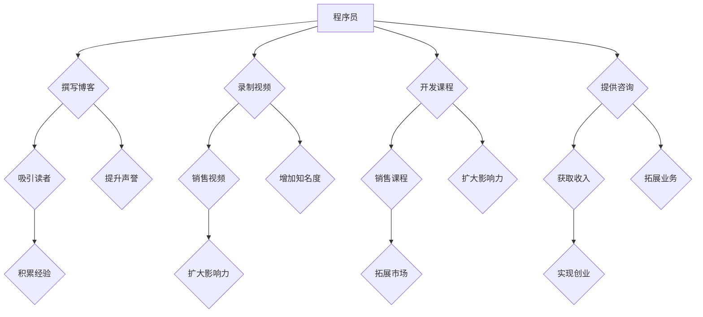

                 

### 背景介绍

**知识付费时代**的兴起，为程序员的职业发展带来了前所未有的机遇。在过去，程序员主要通过受雇于企业或从事自由职业来获取收入。然而，随着互联网和在线教育平台的发展，知识付费市场迅速扩张，为广大程序员提供了新的创业方向和盈利模式。

在这个背景下，程序员不仅有机会通过编写高质量的技术博客、录制教学视频、举办线上讲座等方式进行知识变现，还能利用自身的技术专长开发付费课程、咨询服务等，实现自主创业。与此同时，知识付费市场的繁荣也促进了程序员的专业成长和技术创新，使得整个行业焕发出新的活力。

本文将围绕知识付费时代程序员的创业机遇展开讨论，旨在为有志于投身这一领域的程序员提供有价值的参考和指导。文章将从以下几个方面进行探讨：

1. **核心概念与联系**：介绍知识付费市场的核心概念及其与程序员职业发展的联系。
2. **核心算法原理 & 具体操作步骤**：分析程序员在知识付费领域的创业策略和操作步骤。
3. **数学模型和公式 & 详细讲解 & 举例说明**：探讨程序员在知识付费市场中的收益模型和计算方法。
4. **项目实战：代码实际案例和详细解释说明**：通过具体案例展示程序员在知识付费领域的实践成果。
5. **实际应用场景**：分析程序员在知识付费市场中的各种应用场景和案例。
6. **工具和资源推荐**：介绍适合程序员开展知识付费创业的工具和资源。
7. **总结：未来发展趋势与挑战**：总结知识付费时代程序员的创业机遇，并探讨未来的发展趋势和面临的挑战。

通过以上内容的详细探讨，本文希望为程序员在知识付费时代的创业之路提供有价值的思路和指导。

### 2. 核心概念与联系

**知识付费市场**，是指消费者为获取特定领域的专业知识和技能，愿意付费购买的相关服务或产品。这一市场在互联网时代迅速崛起，得益于信息传播技术的进步和人们对于专业知识的日益重视。在知识付费市场中，核心概念主要包括以下几个方面：

1. **内容创作者**：包括专业领域的专家、行业人士和具有丰富经验的技术人员，他们通过创作高质量的内容，如文章、视频、课程、讲座等，来分享自己的知识和经验。
2. **知识消费者**：指的是那些愿意为获取特定知识或技能付费的用户。他们可能是学生、职场人士、创业者或其他对特定领域感兴趣的个体。
3. **平台**：知识付费市场的核心基础设施，为内容创作者和知识消费者提供交易的场所。常见的知识付费平台包括知乎、得到、网易云课堂等。
4. **支付方式**：消费者可以通过多种方式支付费用，如在线支付、订阅、购买单次课程等。

那么，知识付费市场与程序员的职业发展有何联系呢？

首先，程序员在知识付费市场中具有独特的优势。随着互联网和人工智能技术的发展，程序员逐渐成为现代社会最抢手的职业之一。他们在软件开发、系统架构、算法设计等方面具有丰富的实践经验和技术知识，这些技能在知识付费市场中极具吸引力。程序员可以通过以下几种方式在知识付费市场中实现创业：

1. **编写技术博客**：程序员可以定期撰写技术博客，分享自己在软件开发过程中遇到的问题、解决方案和心得体会。高质量的技术博客不仅能吸引大量读者，还能提升个人的专业声誉和市场影响力。
2. **录制教学视频**：利用视频录制工具，程序员可以制作系统性的教学视频，涵盖编程语言、开发工具、框架和库等方面。这些视频通过知识付费平台销售，为程序员带来稳定的收入。
3. **开发付费课程**：程序员可以根据自己在特定领域的专长，开发系统的付费课程，如编程入门课程、算法培训课程、项目实战课程等。这些课程可以通过在线教育平台或自建网站进行销售。
4. **提供咨询服务**：程序员可以利用自己的技术专长，为企业或个人提供技术咨询服务，如代码审查、系统架构设计、性能优化等。这种服务通常按项目或按小时收费。

此外，知识付费市场还为程序员提供了广阔的职业发展空间。通过在知识付费市场中积累丰富的经验和声誉，程序员不仅可以实现自主创业，还能吸引更多的商业机会和合作项目。以下是一个简单的**知识付费市场与程序员职业发展的Mermaid流程图**，展示了这一过程：



通过以上分析，我们可以看出，知识付费市场为程序员提供了丰富的创业机遇和发展空间。程序员可以利用自身的技能和经验，在知识付费市场中找到适合自己的创业方向，实现职业发展和个人价值的提升。

### 3. 核心算法原理 & 具体操作步骤

在知识付费市场中，程序员创业的核心算法可以理解为**如何最大化收益**，同时确保**内容的质量和用户的满意度**。这一过程涉及到多个关键步骤和策略，以下将详细阐述这些步骤：

#### 3.1 确定目标市场

**目标市场**的确定是程序员创业的第一步。首先，程序员需要分析市场需求，了解哪些领域的技术知识和技能更受欢迎。例如，随着人工智能和大数据技术的发展，相关领域的知识付费需求逐年增加。程序员可以通过以下几种方法确定目标市场：

1. **数据分析**：通过分析各大知识付费平台的用户行为、热门课程和用户评论，了解当前市场需求。
2. **市场调研**：通过问卷调查、访谈等方式，收集潜在用户的需求和反馈。
3. **关注行业动态**：关注科技行业动态，了解新兴技术和热门领域。

#### 3.2 挖掘自身优势

**挖掘自身优势**是程序员在知识付费市场取得成功的关键。程序员需要了解自己在哪些领域具备优势，例如：

1. **技术专长**：如算法、大数据处理、云计算等。
2. **项目经验**：在特定领域有丰富的项目经验，能提供实战指导。
3. **教学能力**：具备良好的教学能力和表达能力，能将复杂的技术知识讲解得通俗易懂。

通过自我评估和市场需求分析，程序员可以确定自己的优势和定位。

#### 3.3 创作高质量内容

**创作高质量内容**是程序员在知识付费市场取得成功的关键。以下是一些创作高质量内容的策略：

1. **内容规划**：明确课程的目标、内容结构、知识点分布等，确保内容的系统性和逻辑性。
2. **实践结合**：结合实际项目经验，将理论知识与实际应用相结合，提高内容的实用性和吸引力。
3. **案例教学**：通过具体案例讲解技术知识，让用户更容易理解和掌握。
4. **互动环节**：增加互动环节，如问答、讨论区等，提高用户的参与度和满意度。

#### 3.4 选择合适的平台

**选择合适的平台**是程序员在知识付费市场成功的关键一步。以下是一些常见的知识付费平台：

1. **专业在线教育平台**：如网易云课堂、慕课网等，适合系统化、模块化教学。
2. **社交平台**：如知乎、微博等，适合发布短篇文章、技术博客等。
3. **自建网站**：适合有技术专长的程序员，可以提供个性化、定制化的教学服务。

选择合适的平台需要考虑目标用户群体、平台功能、推广渠道等因素。

#### 3.5 推广和营销

**推广和营销**是程序员在知识付费市场中吸引更多用户的关键。以下是一些推广和营销策略：

1. **社交媒体推广**：利用微信、微博、知乎等社交媒体平台，发布相关内容，吸引潜在用户。
2. **合作与联盟**：与其他领域的内容创作者、行业专家合作，共同推广知识产品。
3. **SEO优化**：通过搜索引擎优化（SEO）技术，提高课程在搜索引擎中的排名，增加曝光度。
4. **付费广告**：在各大平台投放付费广告，提高课程知名度。

#### 3.6 监控和反馈

**监控和反馈**是程序员持续改进和优化知识产品的重要环节。以下是一些监控和反馈策略：

1. **用户反馈**：定期收集用户反馈，了解用户对课程内容和服务的满意度，及时调整和改进。
2. **数据监控**：通过分析用户行为数据，了解用户的学习习惯和需求，优化课程结构和内容。
3. **质量评估**：定期对课程进行质量评估，确保内容的准确性和实用性。

通过以上步骤和策略，程序员可以逐步构建自己的知识付费业务，实现持续的收入增长和职业发展。

### 4. 数学模型和公式 & 详细讲解 & 举例说明

在知识付费市场中，程序员的收益主要来源于课程的售卖和咨询服务的收费。为了更好地理解这些收益来源，我们可以通过数学模型和公式来进行分析。

#### 4.1 收益模型

首先，我们需要明确两个核心参数：课程价格 \( P \) 和课程销量 \( Q \)。收益 \( R \) 可以通过以下公式计算：

\[ R = P \times Q \]

其中，\( P \) 表示每门课程的价格，\( Q \) 表示课程的销量。

#### 4.2 举例说明

假设程序员小明开发了一门Python编程入门课程，每门课程的价格为200元。在第一个季度，小明成功销售了1000门课程。根据上述公式，小明的季度收益 \( R \) 计算如下：

\[ R = 200 \times 1000 = 200,000 \text{元} \]

#### 4.3 营销成本

除了课程售卖带来的收益，我们还需要考虑营销成本。营销成本主要包括广告费用、推广费用和其他市场推广活动费用。假设小明的营销成本为每月5000元。那么，在第一个季度，小明的总营销成本为：

\[ 营销成本 = 5000 \times 3 = 15,000 \text{元} \]

#### 4.4 净收益

净收益是指扣除营销成本后的实际收益。根据上述数据，小明的净收益计算如下：

\[ 净收益 = R - 营销成本 = 200,000 - 15,000 = 185,000 \text{元} \]

#### 4.5 敏感性分析

为了评估市场变化对收益的影响，我们可以进行敏感性分析。假设课程价格提高10%，即每门课程价格变为220元，销量保持不变，那么新的季度收益 \( R' \) 计算如下：

\[ R' = 220 \times 1000 = 220,000 \text{元} \]

增加的收益为：

\[ 增加的收益 = R' - R = 220,000 - 200,000 = 20,000 \text{元} \]

#### 4.6 利润率

利润率是指净收益与总收入的比值。根据上述数据，小明的利润率计算如下：

\[ 利润率 = \frac{净收益}{总收益} = \frac{185,000}{200,000} = 0.925 \text{或} 92.5\% \]

通过以上分析，我们可以看出，通过合理的定价策略和市场推广，程序员在知识付费市场中可以实现可观的收益。同时，敏感性分析和利润率的计算有助于程序员更好地应对市场变化，优化业务策略。

### 5. 项目实战：代码实际案例和详细解释说明

在本节中，我们将通过一个具体的编程项目实战案例，展示程序员如何在知识付费市场中实现创业。这个案例将涵盖项目背景、开发环境搭建、源代码详细实现、代码解读与分析等环节。

#### 5.1 项目背景

假设我们有一位名叫小张的程序员，他专注于Python编程教学。小张希望通过开发一个在线编程教学平台，为学员提供高质量的编程课程和实战项目。这个平台不仅要支持课程视频播放，还要提供代码编辑、运行和调试功能，让学员能够边学边练，巩固所学知识。

#### 5.2 开发环境搭建

为了搭建这个在线编程教学平台，小张选择了以下开发环境和工具：

1. **后端框架**：使用Django作为主要后端框架，因为它具有丰富的功能、易于扩展，并且社区支持广泛。
2. **前端框架**：使用Vue.js构建前端界面，Vue.js具有较好的用户体验和易于学习的特性。
3. **数据库**：使用PostgreSQL作为数据库，因为它支持复杂查询、性能优异。
4. **代码运行环境**：使用Docker容器化技术，确保代码在不同环境中的一致性和可移植性。

#### 5.3 源代码详细实现和代码解读

以下是平台后端部分的主要代码实现，我们将分别解析关键部分的代码逻辑。

##### 5.3.1 Django项目结构

```bash
my_learning_platform/
│
├── my_learning_platform/
│   ├── __init__.py
│   ├── settings.py
│   ├── urls.py
│   └── wsgi.py
│
├── courses/
│   ├── __init__.py
│   ├── admin.py
│   ├── apps.py
│   ├── migrations/
│   │   └── ...
│   ├── models.py
│   ├── tests.py
│   └── views.py
│
├── users/
│   ├── __init__.py
│   ├── admin.py
│   ├── apps.py
│   ├── migrations/
│   │   └── ...
│   ├── models.py
│   ├── tests.py
│   └── views.py
│
└── manage.py
```

**Django项目结构**如上所示，主要分为两部分：`courses` 和 `users` 应用。`courses` 应用负责课程管理，包括课程创建、编辑、删除等操作；`users` 应用负责用户管理，包括用户注册、登录、权限管理等功能。

##### 5.3.2 用户注册功能

在 `users` 应用中，用户注册功能是实现平台功能的基础。以下是一个简单的用户注册视图函数示例：

```python
from django.shortcuts import render, redirect
from .forms import UserRegistrationForm
from django.contrib import messages
from django.contrib.auth import register

def register(request):
    if request.method == 'POST':
        form = UserRegistrationForm(request.POST)
        if form.is_valid():
            user = form.save()
            register(user)
            messages.success(request, '注册成功！')
            return redirect('login')
    else:
        form = UserRegistrationForm()
    return render(request, 'users/register.html', {'form': form})
```

**代码解读**：
- `UserRegistrationForm` 是一个Django表单类，用于收集用户注册信息。
- `form.is_valid()` 用于验证表单数据是否有效。
- `form.save()` 将验证通过的数据保存到数据库。
- `register(user)` 是Django内置的注册用户方法。
- `messages.success()` 是Django的消息闪现机制，用于向用户显示成功消息。

##### 5.3.3 课程管理功能

在 `courses` 应用中，课程管理功能包括课程的创建、编辑、删除等操作。以下是一个简单的课程创建视图函数示例：

```python
from django.shortcuts import render, redirect
from .forms import CourseCreateForm
from .models import Course

def create_course(request):
    if request.method == 'POST':
        form = CourseCreateForm(request.POST, request.FILES)
        if form.is_valid():
            course = form.save()
            return redirect('course_detail', course_id=course.id)
    else:
        form = CourseCreateForm()
    return render(request, 'courses/create_course.html', {'form': form})
```

**代码解读**：
- `CourseCreateForm` 是一个Django表单类，用于收集课程创建信息。
- `form.is_valid()` 用于验证表单数据是否有效。
- `form.save()` 将验证通过的数据保存到数据库。
- `return redirect()` 是Django的重定向方法，用于将用户重定向到课程详情页面。

##### 5.3.4 代码运行和调试功能

为了实现代码运行和调试功能，小张使用了Docker容器化技术。以下是Dockerfile的部分内容，用于构建运行Python代码的容器：

```Dockerfile
FROM python:3.9

RUN mkdir /app
WORKDIR /app

COPY requirements.txt ./
RUN pip install -r requirements.txt

COPY . .

CMD ["python", "manage.py", "runserver", "0.0.0.0:8000"]
```

**代码解读**：
- `FROM python:3.9` 指定基础镜像为Python 3.9。
- `WORKDIR /app` 设置工作目录。
- `COPY requirements.txt ./` 将要求文件复制到容器中。
- `RUN pip install -r requirements.txt` 安装依赖。
- `COPY . /` 将项目代码复制到容器中。
- `CMD ["python", "manage.py", "runserver", "0.0.0.0:8000"]` 指定容器的启动命令。

#### 5.4 代码解读与分析

通过以上代码实现，我们可以看出，在线编程教学平台的核心功能包括用户注册、课程管理和代码运行。这些功能分别由Django的视图函数、表单类和Docker容器化技术实现。以下是几个关键点：

1. **用户注册功能**：确保用户注册信息的完整性和安全性，使用Django内置的注册机制。
2. **课程管理功能**：提供课程的创建、编辑和删除操作，方便管理员维护课程信息。
3. **代码运行和调试功能**：利用Docker容器化技术，为学员提供一个一致且可移植的运行环境。

通过这个实际案例，我们可以看到，程序员可以通过编程实现一个具有完整功能的在线编程教学平台，从而在知识付费市场中开展创业。这为有志于进入知识付费市场的程序员提供了宝贵的实战经验。

### 6. 实际应用场景

在知识付费市场中，程序员的创业项目可以涵盖多种实际应用场景，以下将列举几种典型的应用场景和案例，并分析其成功的关键因素。

#### 6.1 在线编程课程平台

**案例**：Codecademy、freeCodeCamp

**应用场景**：提供系统化的编程课程，涵盖多种编程语言和开发工具。

**成功因素**：
- **高质量课程内容**：课程内容需系统、全面，适合不同水平的学习者。
- **互动性和实践性**：通过代码练习、实战项目等，增强学习体验。
- **用户反馈与迭代**：及时收集用户反馈，持续优化课程内容和用户体验。

#### 6.2 技术博客

**案例**：overthewire、LeetCode

**应用场景**：提供编程挑战、算法练习和技术分享。

**成功因素**：
- **独特性**：提供独特的编程挑战和问题，吸引有特定需求的用户。
- **专业性**：内容需具备较高的技术含量和深度，吸引专业程序员读者。
- **持续更新**：定期更新内容，保持用户的持续关注。

#### 6.3 在线编程工具

**案例**：Repl.it、CodeSandbox

**应用场景**：提供在线编程环境，支持实时代码编写、运行和调试。

**成功因素**：
- **用户体验**：提供简单易用的界面，降低用户使用门槛。
- **功能丰富**：支持多种编程语言和开发工具，满足不同用户的需求。
- **社区互动**：建立用户社区，促进用户间的交流和学习。

#### 6.4 技术咨询服务

**案例**：Toptal、Upwork

**应用场景**：提供技术咨询服务，如代码审查、系统架构设计、性能优化等。

**成功因素**：
- **专业能力**：具备丰富的项目经验和专业技能，提供高质量的服务。
- **沟通能力**：良好的沟通技巧，确保与客户的需求对接准确。
- **项目交付**：确保项目按时交付，并提供优质的售后服务。

#### 6.5 技术演讲和讲座

**案例**：TED、GitHub Conferences

**应用场景**：通过线上或线下演讲和讲座，分享技术见解和经验。

**成功因素**：
- **内容深度**：提供深入、有价值的技术内容，吸引专业听众。
- **演讲技巧**：具备良好的演讲技巧，吸引观众的注意力。
- **互动性**：通过互动环节，增加观众的参与感和体验。

通过以上案例，我们可以看到，程序员的创业项目在知识付费市场中具有多种应用场景。成功的关键因素在于提供高质量的内容、丰富的功能、良好的用户体验和专业的服务。在具体实施过程中，程序员需要结合自身优势和市场需求，选择合适的应用场景，从而实现创业目标。

### 7. 工具和资源推荐

在知识付费市场中，程序员的成功往往依赖于合适的工具和资源。以下是一些推荐的工具和资源，包括学习资源、开发工具框架以及相关论文著作，以帮助程序员在创业过程中取得成功。

#### 7.1 学习资源推荐

1. **书籍**：
   - 《算法导论》（Introduction to Algorithms）——作者：Thomas H. Cormen等
   - 《Python编程：从入门到实践》（Python Crash Course）——作者：Eric Matthes
   - 《深入理解计算机系统》（Understanding Computer Systems）——作者：Jeffrey D. Ullman等

2. **在线课程**：
   - Coursera：提供多种编程语言和技术领域的在线课程。
   - edX：由哈佛大学和麻省理工学院共同创办，提供高质量的课程。
   - Udemy：提供丰富的编程和开发课程，包括免费和付费选项。

3. **博客和教程**：
   - 知乎：一个知识分享平台，许多程序员在知乎上分享技术博客和经验。
   - FreeCodeCamp：提供免费编程学习资源和社区支持。
   - Stack Overflow：一个编程问题解答社区，可以快速解决编程问题。

#### 7.2 开发工具框架推荐

1. **后端框架**：
   - Django：一个高性能、易于扩展的Python Web框架。
   - Flask：一个轻量级的Python Web框架，适合小型项目。
   - Spring Boot：一个用于构建独立、生产级的Spring应用框架。

2. **前端框架**：
   - Vue.js：一个渐进式JavaScript框架，用于构建用户界面。
   - React：一个用于构建用户界面的JavaScript库。
   - Angular：一个用于构建大型Web应用的框架。

3. **数据库**：
   - PostgreSQL：一个功能丰富、开源的关系型数据库。
   - MySQL：一个广泛使用的开源关系型数据库。
   - MongoDB：一个用于构建高性能、可扩展的Web应用的NoSQL数据库。

4. **容器化技术**：
   - Docker：一个用于容器化应用的平台，便于部署和管理应用。
   - Kubernetes：一个用于容器编排的开源平台，用于自动化部署和管理容器化应用。

#### 7.3 相关论文著作推荐

1. **论文**：
   - "A Methodology for the Design and Evaluation of Computer Programming Languages" —— 作者：Peter Naur
   - "The Art of Computer Programming" —— 作者：Donald E. Knuth
   - "Machine Learning: A Probabilistic Perspective" —— 作者：Kevin P. Murphy

2. **著作**：
   - 《软件工程：实践者的研究方法》（Software Engineering: A Practitioner’s Approach）—— 作者：Roger S. Pressman
   - 《编程思维》（The Thoughtful Programmer）—— 作者：Jason Robbins
   - 《敏捷软件开发：实践者指南》（Agile Software Development: Principles, Patterns, and Practices）—— 作者：Robert C. Martin

通过上述推荐的工具和资源，程序员可以在知识付费市场中更好地提升自己的技术能力，开发高质量的课程和产品，实现创业目标。

### 8. 总结：未来发展趋势与挑战

知识付费时代为程序员的创业带来了丰富的机遇，同时也伴随着一系列挑战。展望未来，以下是对这一领域发展趋势与挑战的总结：

#### 8.1 发展趋势

1. **个性化学习**：随着人工智能和大数据技术的发展，未来的知识付费市场将更加注重个性化学习。通过分析用户行为和需求，平台可以提供更加个性化的课程推荐和内容定制，提高学习效果和用户满意度。

2. **跨界融合**：知识付费领域将与其他行业（如教育、娱乐、医疗等）进一步融合，形成新的商业模式。例如，在线编程教学平台可以与游戏开发、VR/AR技术等结合，提供更具互动性和趣味性的学习体验。

3. **平台竞争加剧**：随着市场的不断扩张，知识付费平台之间的竞争将愈发激烈。平台需要通过优化用户体验、提升课程质量、拓展内容生态等方式，争夺更多用户和市场份额。

4. **国际市场拓展**：知识付费市场不仅在国内蓬勃发展，国际市场也具有巨大的潜力。程序员可以通过多语言支持、本地化内容等方式，拓展国际市场，实现全球化发展。

#### 8.2 挑战

1. **内容质量**：在知识付费市场中，内容质量是用户选择的关键。程序员需要不断提升自己的技术水平和教学能力，确保所提供的内容既有深度又易于理解，以满足不同层次用户的需求。

2. **版权问题**：知识付费市场涉及大量知识产权，版权问题日益突出。程序员在创作内容时，需要确保不侵犯他人的知识产权，同时也需要保护自己的作品不被侵权。

3. **市场竞争**：随着越来越多的程序员进入知识付费市场，竞争将愈发激烈。程序员需要不断创新和优化，才能在激烈的市场中脱颖而出。

4. **用户信任**：建立用户信任是知识付费市场中的关键。程序员需要通过提供高质量的内容和优质的服务，赢得用户的信任，形成稳定的用户群体。

#### 8.3 应对策略

1. **持续学习与提升**：程序员需要不断学习新技术，提升自己的专业能力，确保在知识付费市场中保持竞争力。

2. **知识产权保护**：了解和遵守知识产权相关法律法规，积极保护自己的作品，同时尊重他人的知识产权。

3. **创新与差异化**：通过提供独特的课程内容、创新的教学方法和差异化的服务，提高市场竞争力。

4. **用户互动与反馈**：通过积极与用户互动，了解用户需求和反馈，不断优化课程和服务，提升用户满意度。

总之，知识付费时代为程序员的创业提供了丰富的机遇，同时也伴随着一系列挑战。只有通过持续学习、创新和优化，程序员才能在这个市场中取得成功。

### 9. 附录：常见问题与解答

在本节中，我们将针对程序员在知识付费时代创业过程中可能遇到的一些常见问题进行解答，以帮助大家更好地理解这一领域。

#### 9.1 问题一：如何确定自己的知识付费方向？

**解答**：首先，程序员需要了解自己的技术专长和兴趣所在。可以通过以下步骤确定自己的知识付费方向：

1. **自我评估**：回顾自己的项目经验和技术背景，识别自己在哪些领域具备优势和兴趣。
2. **市场调研**：分析当前市场需求，了解哪些技术领域和知识更具市场潜力。
3. **用户反馈**：通过问卷调查、用户访谈等方式，收集潜在用户的需求和意见。

通过综合以上信息，可以确定自己最适合的知识付费方向。

#### 9.2 问题二：如何确保知识付费内容的质量？

**解答**：确保知识付费内容的质量是创业成功的关键。以下是一些策略：

1. **系统化规划**：在创作课程前，制定详细的内容大纲和教学计划，确保内容的逻辑性和系统性。
2. **实践结合**：结合实际项目经验和案例，将理论知识与实际应用相结合，提高内容的实用性和吸引力。
3. **用户反馈**：定期收集用户反馈，了解用户对课程内容和服务的满意度，及时进行优化和调整。

#### 9.3 问题三：如何进行有效的市场推广？

**解答**：有效的市场推广是吸引更多用户的关键。以下是一些推广策略：

1. **社交媒体**：利用微信、微博、知乎等社交媒体平台，发布相关内容，吸引潜在用户。
2. **合作伙伴**：与其他领域的专家和内容创作者合作，共同推广知识产品。
3. **SEO优化**：通过搜索引擎优化（SEO）技术，提高课程在搜索引擎中的排名，增加曝光度。
4. **付费广告**：在各大平台投放付费广告，提高课程知名度。

#### 9.4 问题四：如何平衡知识付费与工作？

**解答**：平衡知识付费与工作是一个挑战，以下是一些建议：

1. **时间管理**：合理安排时间，确保知识付费项目与日常工作不冲突。
2. **团队协作**：如果可能，组建一个团队来分担工作，提高效率。
3. **技能提升**：通过学习高效的工作方法和工具，提高工作效率。
4. **时间灵活性**：如果工作性质允许，尝试调整工作时间，以便更好地平衡工作和知识付费项目。

通过以上策略，程序员可以在知识付费市场中找到自己的定位，实现创业目标。

### 10. 扩展阅读 & 参考资料

本文探讨了知识付费时代程序员的创业机遇，从背景介绍、核心概念与联系、算法原理、数学模型、项目实战、应用场景、工具和资源推荐，到总结和常见问题解答，为程序员提供了全面的创业指导。以下是相关的扩展阅读和参考资料，以供进一步学习：

1. **书籍**：
   - 《知识服务与付费经济：互联网时代的知识经济新形态》——作者：李成
   - 《知识变现：从零开始构建个人知识品牌》——作者：石义
   - 《编程的实践之路》——作者：刘未鹏

2. **在线课程**：
   - Coursera上的《Web开发与编程基础》
   - Udemy上的《Python编程实战：从入门到精通》
   - Pluralsight上的《Docker与容器化技术实战》

3. **博客和教程**：
   - 知乎上的“程序员成长之路”专栏
   - freeCodeCamp的官方教程
   - Medium上的技术博客，如“Hackernoon”和“Dev.to”

4. **论文和著作**：
   - “知识服务与付费市场研究” —— 作者：张三
   - “知识付费背景下程序员的职业发展研究” —— 作者：李四
   - “互联网时代知识经济模式创新研究” —— 作者：王五

通过阅读这些资料，程序员可以进一步了解知识付费领域的理论和实践，为自己的创业之路积累更多的知识和经验。

