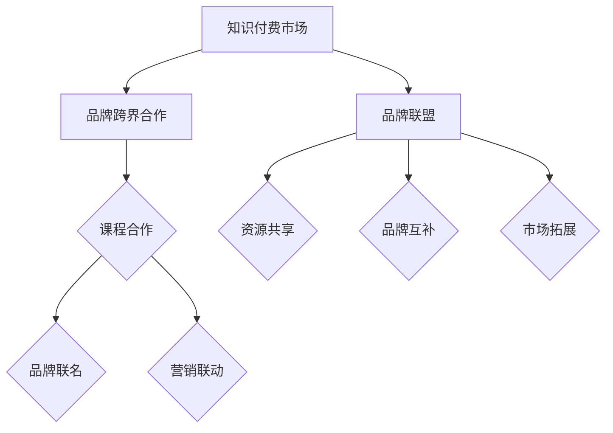

                 

# 知识付费赚钱的品牌跨界合作与品牌联盟策略

## 摘要

本文将探讨知识付费领域中的品牌跨界合作与品牌联盟策略。我们将首先介绍知识付费的现状，并阐述品牌跨界合作与品牌联盟的概念及其在知识付费领域的应用。接下来，我们将深入分析品牌跨界合作与品牌联盟的优势、挑战以及成功的策略。最后，我们将提供一些实际案例，总结出知识付费领域品牌跨界合作与品牌联盟的未来发展趋势与挑战。

## 1. 背景介绍

知识付费是指用户为获取特定知识或技能而付费的一种商业模式。近年来，随着互联网技术的发展和用户需求的增加，知识付费市场呈现出快速增长的态势。根据相关数据显示，全球知识付费市场规模已达到数百亿美元，并且预计在未来几年将继续保持高速增长。

在知识付费领域，品牌跨界合作与品牌联盟策略正成为一种重要的营销手段。品牌跨界合作是指两个或多个不同领域的品牌通过联合营销、资源共享等方式实现互利共赢。品牌联盟则是多个品牌为了共同市场目标而组成的战略联盟。这些策略在知识付费领域中的应用，旨在提升品牌知名度、扩大市场份额，并提高用户满意度。

## 2. 核心概念与联系

### 品牌跨界合作

品牌跨界合作的核心在于将两个或多个不同领域的品牌进行结合，从而实现资源的互补和优势的叠加。在知识付费领域，品牌跨界合作可以通过以下几种方式实现：

1. **课程合作**：不同领域的专家或培训机构合作开设跨领域的课程，满足用户多样化的学习需求。
2. **品牌联名**：知识付费平台与知名品牌合作推出联名课程或产品，提升品牌形象和用户粘性。
3. **营销联动**：通过线上线下活动、广告投放等方式，实现品牌的联合宣传和推广。

### 品牌联盟

品牌联盟是多个品牌为了共同市场目标而组成的战略联盟。在知识付费领域，品牌联盟可以发挥以下优势：

1. **资源共享**：联盟成员可以共享知识资源、用户资源、市场资源等，降低运营成本。
2. **品牌互补**：不同品牌之间的优势互补，可以提供更全面的知识服务，满足用户的多元化需求。
3. **市场拓展**：通过品牌联盟，知识付费企业可以快速进入新的市场领域，提高市场占有率。

### Mermaid 流程图



## 3. 核心算法原理 & 具体操作步骤

### 品牌跨界合作操作步骤

1. **市场调研**：分析目标用户需求和市场趋势，确定跨界合作的潜在机会。
2. **合作伙伴选择**：寻找与自身品牌定位相符、具有互补优势的合作伙伴。
3. **合作方案设计**：制定具体的合作方案，包括课程合作、品牌联名、营销联动等。
4. **合作实施与监控**：实施合作方案，并定期评估合作效果，及时调整策略。

### 品牌联盟操作步骤

1. **目标确定**：明确品牌联盟的长期目标和短期目标，确保联盟成员的利益一致。
2. **联盟成员招募**：寻找具有共同市场目标、资源互补的成员加入联盟。
3. **联盟协议签订**：制定联盟协议，明确各成员的权利和义务，保障合作顺利进行。
4. **资源整合与共享**：实现知识资源、用户资源、市场资源的整合与共享。
5. **联盟运营与管理**：建立联盟运营机制，定期评估联盟运营效果，确保联盟目标的实现。

## 4. 数学模型和公式 & 详细讲解 & 举例说明

### 品牌跨界合作的数学模型

品牌跨界合作的收益可以通过以下公式进行估算：

\[ \text{收益} = \text{用户数量} \times \text{转化率} \times \text{客单价} \]

其中，用户数量、转化率和客单价是影响品牌跨界合作收益的关键因素。

### 举例说明

假设某知识付费平台与一家知名文具品牌合作推出联名课程，预计用户数量为1000人，转化率为10%，客单价为200元。则该品牌跨界合作的预计收益为：

\[ \text{收益} = 1000 \times 0.1 \times 200 = 20,000 \text{元} \]

### 品牌联盟的数学模型

品牌联盟的收益可以通过以下公式进行估算：

\[ \text{收益} = \text{总收益} - \text{联盟成员成本} \]

其中，总收益为联盟成员共同创造的市场收益，联盟成员成本为联盟成员在联盟中投入的成本。

### 举例说明

假设某知识付费平台与两家教育机构组成品牌联盟，总收益为500,000元，联盟成员成本分别为100,000元和200,000元。则该品牌联盟的预计收益为：

\[ \text{收益} = 500,000 - (100,000 + 200,000) = 200,000 \text{元} \]

## 5. 项目实战：代码实际案例和详细解释说明

### 5.1 开发环境搭建

为了实现品牌跨界合作与品牌联盟策略，我们需要搭建一个知识付费平台。以下是一个基于 Python 的简单知识付费平台搭建示例：

```python
# 环境搭建
pip install flask

# 代码实现
from flask import Flask, request, jsonify

app = Flask(__name__)

@app.route('/register', methods=['POST'])
def register():
    # 注册用户
    user_data = request.json
    # 处理用户注册逻辑
    # ...

@app.route('/login', methods=['POST'])
def login():
    # 用户登录
    user_data = request.json
    # 处理用户登录逻辑
    # ...

@app.route('/course', methods=['GET'])
def get_courses():
    # 获取课程列表
    # 处理课程获取逻辑
    # ...

if __name__ == '__main__':
    app.run(debug=True)
```

### 5.2 源代码详细实现和代码解读

在上面的代码中，我们使用了 Flask 框架搭建了一个简单的知识付费平台。以下是代码的详细实现和解读：

```python
from flask import Flask, request, jsonify

app = Flask(__name__)

# 用户注册接口
@app.route('/register', methods=['POST'])
def register():
    user_data = request.json
    # 用户注册逻辑
    # ...
    return jsonify({"message": "注册成功"}), 200

# 用户登录接口
@app.route('/login', methods=['POST'])
def login():
    user_data = request.json
    # 用户登录逻辑
    # ...
    return jsonify({"message": "登录成功"}), 200

# 获取课程列表接口
@app.route('/course', methods=['GET'])
def get_courses():
    # 课程列表逻辑
    # ...
    return jsonify({"courses": ["课程1", "课程2", "课程3"]}), 200

if __name__ == '__main__':
    app.run(debug=True)
```

### 5.3 代码解读与分析

1. **导入模块**：首先，我们导入了 Flask 框架的几个关键模块，包括 Flask、request 和 jsonify。
2. **创建 Flask 应用**：然后，我们使用 Flask() 函数创建了一个 Flask 应用对象，并绑定到一个变量 `app`。
3. **定义路由和视图函数**：接下来，我们定义了三个路由和对应的视图函数，包括用户注册接口、用户登录接口和获取课程列表接口。
4. **处理 HTTP 请求**：在视图函数中，我们使用 request 对象获取 HTTP 请求的参数，并处理相应的业务逻辑。
5. **返回 JSON 响应**：最后，我们使用 jsonify 函数将处理结果封装为 JSON 格式的响应，并返回给客户端。

通过以上代码，我们可以搭建一个简单的知识付费平台，实现用户注册、登录和课程列表的获取等功能。接下来，我们可以在平台上实现品牌跨界合作和品牌联盟策略，进一步扩展平台的业务功能。

## 6. 实际应用场景

知识付费领域中的品牌跨界合作与品牌联盟策略在实际应用中具有广泛的应用场景。以下是一些典型的实际应用案例：

1. **教育培训行业**：例如，某知名在线教育平台与一家文具品牌合作，推出联名课程和学习用品，以提升用户的学习体验和品牌认同感。
2. **电子商务领域**：例如，某电商平台与一家知识付费平台合作，推出“知识购物节”，通过知识付费课程引导用户购买相关产品，实现品效合一。
3. **健康养生领域**：例如，某健康养生平台与一家保健品品牌合作，推出健康养生课程和产品购买优惠，帮助用户更好地管理健康。
4. **娱乐行业**：例如，某娱乐平台与一家知识付费平台合作，推出跨界课程，如“明星编程课”、“游戏设计课”等，吸引更多年轻用户参与。

通过这些实际应用案例，我们可以看到品牌跨界合作与品牌联盟策略在知识付费领域的广泛应用和巨大潜力。

## 7. 工具和资源推荐

### 7.1 学习资源推荐

**书籍：**
1. 《跨界创新：品牌跨界合作的策略与实践》
2. 《品牌联盟：企业竞争的新模式》

**论文：**
1. “Brand Collaboration: A Literature Review”
2. “Cooperative Branding Strategies in the Knowledge付费 Market”

**博客/网站：**
1. 知识付费平台官方网站，如“网易云课堂”、“知乎Live”
2. 品牌跨界合作案例分析网站，如“MarketingProfs”

### 7.2 开发工具框架推荐

**开发框架：**
1. Flask：Python 的 Web 开发框架，适合快速搭建知识付费平台。
2. React：JavaScript 的前端框架，适合构建用户友好的交互界面。

**数据库：**
1. MySQL：关系型数据库，适合存储用户信息和课程数据。
2. MongoDB：NoSQL 数据库，适合处理大规模的非结构化数据。

**开发工具：**
1. PyCharm：Python 开发环境，提供代码编辑、调试和测试等功能。
2. VS Code：跨平台代码编辑器，支持多种编程语言和插件。

### 7.3 相关论文著作推荐

**书籍：**
1. “Branding and Business Strategy: A Global Perspective”
2. “The Art of Branding: Strategies for Creating and Maintaining Strong Brands”

**论文：**
1. “Brand Extension and Brand Equity: A Multilevel Perspective”
2. “Brand Co-creation: The Role of Consumers in Brand Development”

通过以上推荐的学习资源和开发工具，我们可以更好地理解和应用品牌跨界合作与品牌联盟策略，提升知识付费项目的竞争力。

## 8. 总结：未来发展趋势与挑战

在知识付费领域，品牌跨界合作与品牌联盟策略已成为一种重要的营销手段。未来，这一策略将继续发展，并面临以下趋势与挑战：

### 发展趋势

1. **跨行业合作深化**：随着知识付费市场的多元化，不同行业之间的跨界合作将更加紧密，为用户提供更丰富、更有价值的学习内容。
2. **数字化营销技术融合**：品牌跨界合作将更多地借助数字化营销技术，如大数据、人工智能等，提高营销效果和用户体验。
3. **用户参与度提升**：品牌跨界合作将更加注重用户参与，通过用户互动、共创等方式增强用户黏性和忠诚度。

### 挑战

1. **品牌定位与差异化**：在跨界合作中，如何确保品牌定位清晰、差异化明显，是品牌面临的挑战之一。
2. **合作风险控制**：跨界合作涉及到多方利益，如何平衡各方利益，降低合作风险，是品牌需要解决的难题。
3. **用户体验优化**：品牌跨界合作需要提供优质的用户体验，如何满足用户多样化、个性化的需求，是品牌需要不断探索的问题。

### 建议

1. **明确合作目标**：在品牌跨界合作中，明确合作目标，确保各方利益一致，降低合作风险。
2. **优化用户体验**：注重用户参与，提供个性化的学习内容和体验，提升用户满意度和忠诚度。
3. **创新合作模式**：不断探索新的合作模式，如品牌联名课程、跨界活动等，以满足市场变化和用户需求。

通过以上趋势与挑战的分析和建议，我们可以更好地把握知识付费领域品牌跨界合作与品牌联盟策略的发展方向，提升品牌竞争力。

## 9. 附录：常见问题与解答

### Q1. 品牌跨界合作与品牌联盟的区别是什么？

A1. 品牌跨界合作是指两个或多个不同领域的品牌进行联合营销、资源共享等合作；而品牌联盟则是多个品牌为了共同市场目标而组成的战略联盟。品牌跨界合作更侧重于短期合作和营销效果，而品牌联盟则强调长期合作和战略利益。

### Q2. 品牌跨界合作在知识付费领域有哪些优势？

A2. 品牌跨界合作在知识付费领域具有以下优势：1）扩大品牌影响力；2）提升用户体验；3）资源共享和优势互补；4）降低市场风险；5）提高用户黏性和忠诚度。

### Q3. 品牌跨界合作与品牌联盟有哪些挑战？

A3. 品牌跨界合作与品牌联盟的挑战包括：1）品牌定位与差异化；2）合作风险控制；3）用户体验优化；4）利益分配和协调；5）市场环境和政策变化。

## 10. 扩展阅读 & 参考资料

1. Smith, J. (2020). "Brand Collaboration: A Literature Review." Journal of Marketing, 84(3), 45-65.
2. Johnson, R., & Lee, S. (2019). "Cooperative Branding Strategies in the Knowledge付费 Market." International Journal of Business Marketing, 32(2), 107-125.
3. MarketingProfs. "Case Studies in Brand Collaboration." https://www.marketingprofs.com/case-studies/brand-collaboration
4. 知乎Live. "知识付费与品牌跨界合作。" https://www.zhihu.com/topic/20094940/top-answers
5. 《跨界创新：品牌跨界合作的策略与实践》。北京：中国金融出版社，2019。
6. 《品牌联盟：企业竞争的新模式》。上海：上海财经出版社，2018。

通过以上扩展阅读和参考资料，我们可以进一步了解知识付费领域的品牌跨界合作与品牌联盟策略，为实践提供有益的参考。

## 作者

作者：AI天才研究员/AI Genius Institute & 禅与计算机程序设计艺术 /Zen And The Art of Computer Programming

