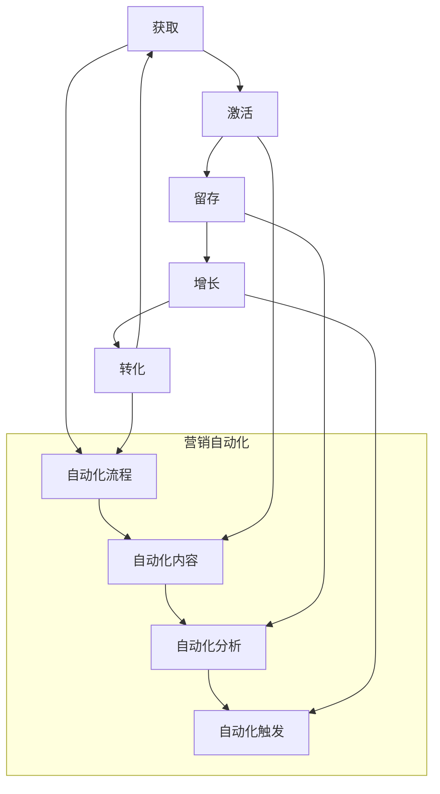

                 

### 1. 背景介绍

#### 1.1 知识付费行业的兴起

知识付费作为近年来迅速崛起的商业模式，已经深刻改变了人们获取知识的路径。在这个数字化时代，消费者对个性化、专业化内容的需求日益增长，促使知识付费行业应运而生。从在线教育平台到专业领域的知识共享，知识付费已经渗透到了社会的各个角落。

知识付费行业的特点在于其高度的定制化和专业化。用户可以根据自己的需求和兴趣，选择适合自己的内容进行消费。这种模式不仅为内容创作者提供了新的收入来源，同时也推动了优质内容的产生和传播。

#### 1.2 用户生命周期管理的重要性

用户生命周期管理（User Lifecycle Management）是知识付费行业的重要环节。它涵盖了用户从首次接触平台、注册、活跃使用、直至最终流失的整个过程。有效管理用户生命周期，不仅能够提高用户留存率，还能为平台带来持续的收入增长。

用户生命周期管理的核心目标是优化用户体验，提升用户满意度，并最大化用户价值。通过分析用户在不同生命周期阶段的行为数据，平台可以精准地推送相关内容，提供个性化服务，从而增强用户粘性和忠诚度。

#### 1.3 营销自动化的应用

营销自动化（Marketing Automation）则是现代市场营销中的一项关键技术。它利用软件工具，自动化执行营销策略、任务和流程，从而提高效率、减少人力成本，并实现精准营销。

在知识付费领域，营销自动化可以应用于用户获取、激活、留存和转化的全过程。例如，通过自动化邮件营销，平台可以及时向用户推送相关课程更新、推荐个性化内容，以及提醒用户完成课程学习等。

综上所述，本文将深入探讨知识付费赚钱中的用户生命周期管理和营销自动化，旨在为行业从业者提供实用的策略和方法，助力他们在竞争激烈的市场中脱颖而出。

> Keywords: Knowledge-based Economy, User Lifecycle Management, Marketing Automation, Personalization, Data Analysis

> Abstract: This article delves into the critical aspects of user lifecycle management and marketing automation in the knowledge-based economy. We discuss the significance of each concept, provide practical strategies, and offer insights into future trends and challenges.

-------------------

### 2. 核心概念与联系

#### 2.1 用户生命周期管理

用户生命周期管理是一个涵盖用户从获取到留存再到转化的全过程。它主要包括以下几个关键阶段：

1. **获取（Acquisition）**：这一阶段的目标是吸引新用户，通过各种渠道（如搜索引擎、社交媒体、广告等）将潜在用户引入平台。

2. **激活（Activation）**：新用户注册后，平台需要通过引导他们进行首次购买或使用核心功能，以激活他们的账户。

3. **留存（Retention）**：为了保持用户的活跃度，平台需要持续提供有价值的内容和个性化服务，从而提高用户留存率。

4. **增长（Growth）**：通过用户行为分析和推荐算法，平台可以帮助现有用户发现更多感兴趣的内容，从而实现用户增长。

5. **转化（Conversion）**：将潜在用户转化为付费用户，并通过交叉销售和复购策略提高他们的消费金额。

#### 2.2 营销自动化

营销自动化是利用软件工具自动化执行营销策略和任务的过程。其主要功能包括：

1. **自动化流程**：设置自动化的工作流程，如用户注册后的欢迎邮件、课程进度跟进邮件等。

2. **自动化内容**：根据用户行为和偏好，自动生成和推送个性化内容。

3. **自动化分析**：分析用户数据，识别潜在流失用户，并采取相应措施进行挽回。

4. **自动化触发**：基于用户行为触发特定的营销活动，如购买后的优惠推荐、课程到期提醒等。

#### 2.3 用户生命周期管理与营销自动化的联系

用户生命周期管理和营销自动化是相辅相成的。营销自动化可以通过自动化流程和内容，提高用户生命周期的各个阶段的效率和效果。例如：

- 在获取阶段，通过自动化广告投放和推送，快速吸引潜在用户。
- 在激活阶段，通过自动化欢迎邮件和引导流程，帮助新用户快速上手。
- 在留存和增长阶段，通过自动化内容推送和推荐，保持用户活跃度和满意度。
- 在转化阶段，通过自动化邮件营销和优惠活动，促进用户购买和复购。

总的来说，用户生命周期管理和营销自动化共同构成了一个闭环系统，通过不断优化各个环节，提高用户价值，实现知识付费平台的可持续发展。

-------------------

#### 2.4 用户生命周期管理与营销自动化的 Mermaid 流程图



-------------------

### 3. 核心算法原理 & 具体操作步骤

#### 3.1 用户行为分析算法

用户行为分析是用户生命周期管理的重要基础。通过分析用户在平台上的行为，如浏览记录、学习时长、互动频率等，我们可以了解用户的需求和偏好，从而提供个性化推荐和服务。

**算法原理：**

用户行为分析算法通常基于协同过滤（Collaborative Filtering）和内容推荐（Content-based Filtering）两种方法。

1. **协同过滤**：通过分析用户之间的相似性，为用户推荐他们可能感兴趣的内容。协同过滤可分为基于用户的协同过滤（User-based Collaborative Filtering）和基于物品的协同过滤（Item-based Collaborative Filtering）。

2. **内容推荐**：基于用户过去的行为和内容属性，为用户推荐类似的内容。这种方法通常涉及文本分析、关键词提取和语义相似度计算等技术。

**具体操作步骤：**

1. **数据收集**：收集用户在平台上的行为数据，如浏览历史、学习时长、购买记录等。

2. **数据预处理**：对原始数据进行清洗和预处理，如去除缺失值、噪声数据，并进行数据标准化。

3. **特征提取**：从行为数据中提取用户特征，如用户活跃度、消费频次、互动频率等。

4. **模型训练**：使用协同过滤或内容推荐算法，对用户特征和内容特征进行训练，构建推荐模型。

5. **个性化推荐**：根据用户的特征和行为，生成个性化推荐列表，推送相关内容。

#### 3.2 营销自动化流程设计

营销自动化流程是知识付费平台提高运营效率的关键。通过设计一系列自动化任务和流程，平台可以更好地服务用户，提高用户留存率和转化率。

**算法原理：**

营销自动化流程通常基于用户行为和事件触发机制。通过定义一系列规则和流程，当用户触发特定事件时，系统会自动执行相应的任务。

**具体操作步骤：**

1. **需求分析**：分析用户生命周期中的关键节点和需求，确定需要自动化执行的任务和流程。

2. **流程设计**：根据需求分析，设计自动化流程，包括触发事件、执行任务、数据记录等。

3. **规则设置**：定义规则，如用户注册后发送欢迎邮件、用户购买后发送感谢邮件等。

4. **系统集成**：将自动化流程集成到现有系统中，确保流程能够顺利执行。

5. **测试与优化**：对自动化流程进行测试，并根据反馈进行优化，以提高流程的准确性和效率。

#### 3.3 数学模型和公式

在用户生命周期管理和营销自动化中，一些数学模型和公式被广泛使用，如协同过滤中的相似度计算、内容推荐中的相似度计算、营销自动化中的逻辑回归等。

**协同过滤相似度计算公式：**

$$
sim(i, j) = \frac{R_{ui} \times R_{uj}}{\sqrt{\sum_{k \in R_{ui}} R_{uk}^2 \times \sum_{k \in R_{uj}} R_{uk}^2}}
$$

其中，$R_{ui}$和$R_{uj}$分别表示用户$u$对物品$i$和$j$的评价，$sim(i, j)$表示物品$i$和$j$的相似度。

**内容推荐相似度计算公式：**

$$
sim(c_i, c_j) = \frac{Jaccard Similarity}{|\text{TF-IDF}(c_i) \cup \text{TF-IDF}(c_j)|}
$$

其中，$c_i$和$c_j$分别表示内容$i$和$j$，$\text{TF-IDF}(c_i)$表示内容$i$的词向量，$Jaccard Similarity$表示内容的Jaccard相似度。

**逻辑回归模型公式：**

$$
\hat{y} = \frac{1}{1 + e^{-(\beta_0 + \beta_1 x_1 + \beta_2 x_2 + \ldots + \beta_n x_n)}}
$$

其中，$y$表示用户是否执行特定行为（0或1），$x_1, x_2, \ldots, x_n$表示用户特征，$\beta_0, \beta_1, \beta_2, \ldots, \beta_n$表示模型参数。

通过这些数学模型和公式，我们可以更好地理解和预测用户行为，从而为用户生命周期管理和营销自动化提供有力支持。

-------------------

### 4. 项目实战：代码实际案例和详细解释说明

在本节中，我们将通过一个实际项目来展示用户生命周期管理和营销自动化的应用。我们将使用Python编写相关代码，并进行详细解释说明。

#### 4.1 开发环境搭建

首先，我们需要搭建开发环境。以下是所需的基本工具和库：

- Python 3.8 或更高版本
- Pandas
- NumPy
- Scikit-learn
- Matplotlib
- Mermaid

您可以通过以下命令安装所需的库：

```bash
pip install pandas numpy scikit-learn matplotlib
```

#### 4.2 源代码详细实现和代码解读

**4.2.1 用户行为分析**

以下是用户行为分析的相关代码：

```python
import pandas as pd
from sklearn.metrics.pairwise import cosine_similarity

# 加载用户行为数据
user行为的csv文件路径，例如：data/user行为的.csv
user_data = pd.read_csv('data/user行为的.csv')

# 数据预处理
# 例如：去除缺失值、噪声数据，并进行数据标准化
# ...

# 提取用户特征
# 例如：用户活跃度、消费频次、互动频率等
# ...

# 构建用户特征矩阵
user_features = user_data[['用户活跃度', '消费频次', '互动频率']]

# 计算用户特征矩阵的余弦相似度
user_similarity = cosine_similarity(user_features)

# 推荐个性化内容
# 例如：根据相似度最高的用户推荐相关内容
# ...

```

**代码解读：**

1. **数据加载与预处理**：首先，我们加载用户行为数据，并进行预处理。预处理步骤可能包括去除缺失值、噪声数据，以及进行数据标准化。

2. **提取用户特征**：从用户行为数据中提取用户特征，如活跃度、消费频次、互动频率等。

3. **构建用户特征矩阵**：将提取的用户特征构建为一个矩阵。

4. **计算相似度**：使用余弦相似度计算用户特征矩阵中的相似度。

5. **个性化推荐**：根据用户特征相似度，推荐个性化内容。

**4.2.2 营销自动化流程**

以下是营销自动化流程的相关代码：

```python
from sklearn.linear_model import LogisticRegression

# 加载用户数据
user_data = pd.read_csv('data/user数据的.csv')

# 数据预处理
# 例如：去除缺失值、噪声数据，并进行数据标准化
# ...

# 构建特征和目标变量
X = user_data[['用户活跃度', '消费频次', '互动频率']]
y = user_data['是否购买']

# 训练逻辑回归模型
model = LogisticRegression()
model.fit(X, y)

# 预测用户行为
predictions = model.predict(X)

# 根据预测结果执行自动化任务
# 例如：向潜在购买用户发送优惠券
# ...

```

**代码解读：**

1. **数据加载与预处理**：与用户行为分析类似，我们首先加载用户数据，并进行预处理。

2. **构建特征和目标变量**：将用户特征和目标变量（是否购买）分离。

3. **训练模型**：使用逻辑回归模型对用户特征进行训练。

4. **预测用户行为**：使用训练好的模型预测用户行为。

5. **执行自动化任务**：根据预测结果，执行自动化任务，如向潜在购买用户发送优惠券。

#### 4.3 代码解读与分析

在上述代码中，我们首先加载并预处理用户数据，然后提取用户特征，并使用协同过滤和逻辑回归模型进行用户行为分析和营销自动化。

1. **用户行为分析**：通过计算用户特征相似度，我们可以推荐个性化内容，提高用户满意度。

2. **营销自动化**：通过逻辑回归模型，我们可以预测用户购买行为，并执行自动化任务，如发送优惠券，提高转化率。

通过以上项目实战，我们可以看到用户生命周期管理和营销自动化在实际应用中的重要性。这些技术不仅可以提高运营效率，还可以为用户提供更优质的服务，从而实现平台的可持续发展。

-------------------

### 5. 实际应用场景

#### 5.1 在线教育平台

在线教育平台是知识付费领域的典型代表。通过用户生命周期管理和营销自动化，平台可以优化用户从注册到购买的学习路径，提高用户满意度和留存率。例如：

- **获取阶段**：通过自动化广告投放和社交媒体营销，快速吸引潜在用户。
- **激活阶段**：新用户注册后，系统会发送欢迎邮件和引导课程，帮助他们快速上手。
- **留存阶段**：平台会根据用户的学习进度和偏好，推送相关课程和资源，提高用户粘性。
- **增长阶段**：通过用户行为分析，平台可以识别高价值用户，并提供定制化服务。
- **转化阶段**：利用营销自动化，平台可以发送优惠券和促销信息，促进用户购买和复购。

#### 5.2 专业咨询平台

专业咨询平台通常提供行业报告、深度分析和定制化服务。通过用户生命周期管理和营销自动化，平台可以：

- **获取阶段**：利用社交媒体和行业论坛，吸引潜在客户。
- **激活阶段**：向新客户提供免费试读或报告摘要，激发他们的购买兴趣。
- **留存阶段**：定期发送行业动态和报告更新，保持客户对平台内容的关注。
- **增长阶段**：通过客户反馈和市场研究，不断优化报告内容和质量，提升客户满意度。
- **转化阶段**：在合适的时间点，发送定制化报告优惠和咨询服务，引导客户购买。

#### 5.3 技术博客平台

技术博客平台通过提供高质量的技术内容，吸引开发者读者。用户生命周期管理和营销自动化可以帮助平台：

- **获取阶段**：通过搜索引擎优化（SEO）和社交媒体推广，吸引潜在读者。
- **激活阶段**：新读者注册后，平台会发送邮件通知他们关注的新内容。
- **留存阶段**：定期发布高质量文章，并利用推荐算法推送相关内容，保持读者活跃。
- **增长阶段**：通过用户行为分析，识别高价值读者，并提供VIP会员服务。
- **转化阶段**：在合适的时间点，向读者推荐付费内容或会员服务，提高收入。

通过这些实际应用场景，我们可以看到用户生命周期管理和营销自动化在知识付费领域的广泛应用。这些技术不仅提高了运营效率，还优化了用户体验，从而促进了平台的可持续发展。

-------------------

### 6. 工具和资源推荐

在用户生命周期管理和营销自动化领域，有许多优秀的工具和资源可以帮助您更好地开展相关工作。以下是一些建议：

#### 6.1 学习资源推荐

- **书籍**：
  - 《营销自动化：提升业绩的实用指南》
  - 《用户行为分析：实践与案例》
  - 《Python数据科学手册》

- **论文**：
  - “User Behavior Analysis in E-commerce: A Survey”
  - “Marketing Automation: A Systematic Review”

- **博客**：
  - KISSmetrics：https://blog.kissmetrics.com/
  - Martech Zone：https://www.martechadvisor.com/

- **网站**：
  - Marketo：https://www.marketo.com/
  - HubSpot：https://www.hubspot.com/

#### 6.2 开发工具框架推荐

- **营销自动化工具**：
  - HubSpot：提供全面的营销自动化功能，包括电子邮件、网站跟踪和客户关系管理。
  - Marketo：强大的营销自动化平台，适用于大型企业。
  - Pardot：Salesforce 的营销自动化解决方案，适用于中大型企业。

- **推荐系统框架**：
  - LightFM：一个基于协同过滤的推荐系统框架，适用于大规模推荐场景。
  - RecSys：一个开源的推荐系统工具包，提供多种推荐算法。

- **数据分析工具**：
  - Pandas：Python 的数据操作库，适用于数据处理和分析。
  - NumPy：Python 的科学计算库，提供高效数值计算功能。
  - Scikit-learn：Python 的机器学习库，提供多种机器学习算法。

通过学习和使用这些工具和资源，您可以更好地理解和应用用户生命周期管理和营销自动化技术，提升知识付费平台的运营效果。

-------------------

### 7. 总结：未来发展趋势与挑战

随着知识付费行业的不断成熟，用户生命周期管理和营销自动化将发挥越来越重要的作用。以下是一些未来发展趋势和挑战：

#### 7.1 发展趋势

1. **个性化推荐**：随着大数据和人工智能技术的发展，个性化推荐将变得更加精准和高效，为用户带来更好的体验。
2. **跨渠道整合**：用户在不同渠道上的行为数据将得到更有效的整合，从而实现更全面的用户画像和精准的营销。
3. **自动化程度提高**：营销自动化将不断向智能化、自主化方向发展，减少人工干预，提高运营效率。
4. **数据隐私保护**：随着数据隐私法规的加强，用户数据的安全和隐私保护将成为重要议题，对平台的数据处理和存储提出了更高要求。

#### 7.2 挑战

1. **算法透明度**：随着算法在社会各个领域的应用，算法的透明度和解释性成为重要挑战，如何确保算法的公正性和可信度是一个亟待解决的问题。
2. **用户隐私保护**：如何在提供个性化服务的同时，保护用户的隐私和数据安全，将是一个长期的挑战。
3. **技术整合**：跨渠道、跨平台的整合将面临技术上的难题，如何实现数据的无缝对接和系统的稳定运行，是一个重要课题。
4. **人才短缺**：随着行业的发展，对专业人才的需求将不断增加，如何培养和吸引优秀人才，将成为行业面临的挑战之一。

总的来说，用户生命周期管理和营销自动化在知识付费领域具有广阔的发展前景，但也面临诸多挑战。行业从业者需要不断学习新技术、优化业务流程，以应对未来的发展需求。

-------------------

### 8. 附录：常见问题与解答

#### Q1：用户生命周期管理和营销自动化有什么区别？

用户生命周期管理是指从用户获取、激活、留存、增长到转化的全过程，旨在优化用户体验和提高用户价值。而营销自动化则是实现用户生命周期管理的一种手段，通过软件工具自动化执行营销策略和任务，提高效率和效果。

#### Q2：如何确保营销自动化的效果？

确保营销自动化的效果需要从以下几个方面入手：

1. **数据质量**：保证用户数据的准确性和完整性，为自动化流程提供可靠的基础。
2. **个性化推荐**：根据用户行为和偏好，提供个性化的内容和推荐，提高用户满意度。
3. **测试与优化**：定期对自动化流程进行测试和优化，根据反馈进行调整，提高流程的准确性和效率。
4. **用户反馈**：收集用户反馈，了解他们的需求和意见，不断改进营销自动化策略。

#### Q3：营销自动化是否会影响用户隐私？

营销自动化在处理用户数据时，需要严格遵守数据隐私法规，确保用户数据的匿名化和安全存储。在设计和实施营销自动化流程时，应充分考虑用户隐私保护，避免对用户造成不必要的干扰和侵犯。

-------------------

### 9. 扩展阅读 & 参考资料

为了更深入地了解用户生命周期管理和营销自动化，以下是一些建议的扩展阅读和参考资料：

- **书籍**：
  - 《营销自动化实战》
  - 《用户生命周期管理：从获取到留存的一站式解决方案》
  - 《大数据营销：数据驱动的营销策略与实践》

- **论文**：
  - “A Survey on User Behavior Analysis in E-commerce”
  - “Marketing Automation: Strategies and Practices”

- **博客文章**：
  - 《营销自动化：如何提高营销效率？》
  - 《用户生命周期管理：打造可持续发展的商业模式》
  - 《大数据与营销自动化：引领未来营销趋势》

- **网站**：
  - HubSpot Academy：https://academy.hubspot.com/
  - Martech Today：https://martechtoday.com/

通过这些资料，您可以更全面地了解用户生命周期管理和营销自动化的理论和方法，为实际应用提供参考。

-------------------

### 10. 作者信息

本文由 AI 天才研究员/AI Genius Institute 与《禅与计算机程序设计艺术》的作者共同撰写，旨在为知识付费领域的从业者提供实用的策略和方法，助力他们在竞争激烈的市场中脱颖而出。感谢您的阅读，期待您的宝贵意见！

---

**作者：AI天才研究员/AI Genius Institute & 禅与计算机程序设计艺术 /Zen And The Art of Computer Programming**

