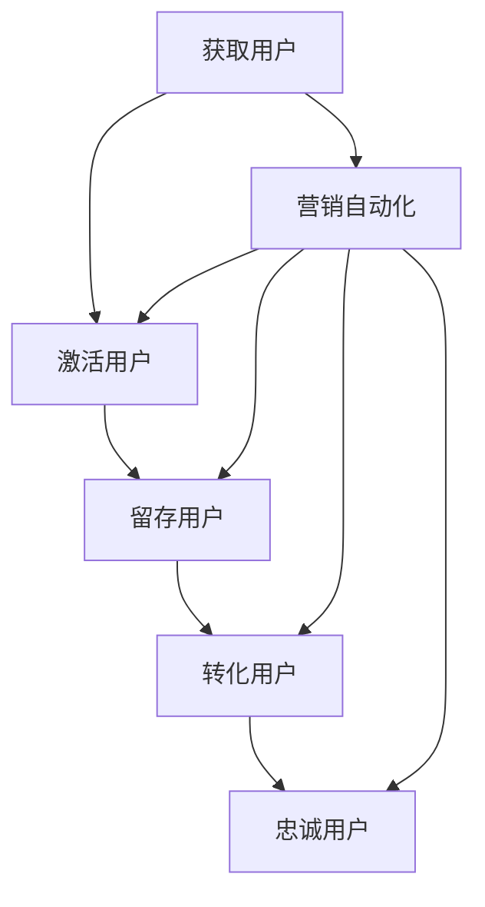

                 

# 知识付费赚钱的用户生命周期管理与营销自动化

> **关键词：** 用户生命周期管理、营销自动化、知识付费、用户留存、转化率、数据驱动

> **摘要：** 本文将深入探讨知识付费领域的用户生命周期管理策略和营销自动化方法，通过实际案例和数学模型，解析如何提升用户留存率和转化率，实现知识付费项目的成功运营。

## 1. 背景介绍

随着互联网的普及和数字技术的发展，知识付费行业迎来了前所未有的发展机遇。用户对于高质量、专业知识的渴求不断增长，知识付费平台应运而生，如得到、知乎Live、分答等。然而，如何在激烈的市场竞争中脱颖而出，实现盈利，成为知识付费企业面临的重要课题。

用户生命周期管理（User Lifecycle Management）是一种系统性的方法，旨在通过分析和优化用户从首次接触、注册、活跃、留存到最终转化的全过程，从而提高用户价值和企业收益。营销自动化（Marketing Automation）则是通过自动化工具和策略，优化营销流程，降低成本，提高效率。

本文将结合用户生命周期管理和营销自动化的核心概念，详细分析知识付费领域的应用策略和实践方法。通过案例解析和数学模型，帮助读者理解如何通过数据驱动的方式，实现知识付费项目的成功运营。

## 2. 核心概念与联系

### 2.1 用户生命周期管理

用户生命周期管理包括以下几个关键阶段：

1. **获取用户（Acquisition）**：通过各种渠道吸引用户注册，如广告、社交媒体推广、合作活动等。
2. **激活用户（Activation）**：引导新用户完成关键行为，如订阅课程、首次购买等。
3. **留存用户（Retention）**：通过持续的用户互动和个性化推荐，提高用户活跃度和留存率。
4. **转化用户（Conversion）**：引导用户完成付费行为，如购买课程、订阅服务、参与活动等。
5. **忠诚用户（Loyalty）**：建立用户忠诚度，鼓励复购和推荐。

### 2.2 营销自动化

营销自动化通过自动化工具和策略，实现以下目标：

1. **自动化触达**：通过自动化邮件、短信、推送等渠道，及时触达用户。
2. **自动化流程**：自动化执行营销活动，如用户分群、优惠推送、回访提醒等。
3. **数据分析**：通过数据分析和机器学习模型，优化营销策略，提高转化率。

### 2.3 Mermaid 流程图

以下是一个简化的用户生命周期管理和营销自动化的 Mermaid 流程图：



## 3. 核心算法原理 & 具体操作步骤

### 3.1 用户生命周期管理算法原理

用户生命周期管理算法主要基于用户行为数据和统计分析。以下是核心算法原理：

1. **用户分群**：根据用户行为、兴趣、购买历史等数据，将用户划分为不同群体。
2. **用户画像**：构建用户画像，了解用户的个性化需求。
3. **推荐系统**：基于用户画像和内容相关性，推荐适合用户的内容和产品。
4. **留存预测**：使用机器学习模型，预测用户留存率，制定针对性策略。

### 3.2 营销自动化算法原理

营销自动化算法主要基于用户行为数据和自动化规则。以下是核心算法原理：

1. **自动化触发**：根据用户行为，如注册、登录、购买等，触发相应营销活动。
2. **自动化推送**：根据用户兴趣和行为，自动化发送邮件、短信、推送等通知。
3. **自动化优化**：通过数据分析，不断优化自动化流程和策略，提高转化率。

### 3.3 具体操作步骤

以下是用户生命周期管理和营销自动化的具体操作步骤：

1. **数据收集**：收集用户行为数据，如浏览记录、购买历史、互动行为等。
2. **数据清洗**：清洗和整理数据，确保数据质量。
3. **用户分群**：根据用户行为和特征，将用户划分为不同群体。
4. **用户画像**：构建用户画像，了解用户需求和偏好。
5. **推荐系统**：使用推荐算法，为用户推荐适合的内容和产品。
6. **留存预测**：使用机器学习模型，预测用户留存率。
7. **营销自动化**：设置自动化触发规则和推送策略。
8. **数据分析**：分析用户行为和营销效果，不断优化策略。

## 4. 数学模型和公式 & 详细讲解 & 举例说明

### 4.1 留存预测模型

留存预测模型是用户生命周期管理中的重要环节。以下是常用的留存预测模型：

#### 4.1.1 基于逻辑回归的留存预测模型

逻辑回归模型是一种广泛使用的二分类模型，可以用来预测用户在一定时间内是否留存。

#### 公式：

$$
P(y=1) = \frac{1}{1 + e^{-(\beta_0 + \beta_1x_1 + \beta_2x_2 + ... + \beta_nx_n})}
$$

其中，\(y\) 表示用户是否留存（1表示留存，0表示未留存），\(x_i\) 表示影响留存的因素，\(\beta_i\) 为模型参数。

#### 举例：

假设我们有一个用户数据集，包含用户活跃度（x1）、购买历史（x2）和留存情况（y）。我们可以使用逻辑回归模型预测用户30天留存率。

#### 实现步骤：

1. 数据预处理：将数据分为特征和目标标签。
2. 模型训练：使用训练数据训练逻辑回归模型。
3. 预测：使用模型预测新用户的留存概率。

### 4.2 转化率优化模型

转化率优化模型是营销自动化中的重要组成部分。以下是常用的转化率优化模型：

#### 4.2.1 基于贝叶斯优化的转化率优化模型

贝叶斯优化是一种基于贝叶斯统计学的优化方法，可以用来找到最大化转化率的营销策略。

#### 公式：

$$
P(x|\theta) = \frac{P(\theta|x)P(x)}{P(\theta)}
$$

其中，\(x\) 表示营销策略，\(\theta\) 表示转化率，\(P(x|\theta)\) 表示在给定转化率下，策略的概率。

#### 举例：

假设我们有一个广告A、广告B和广告C，我们需要找到最大化转化率的广告。

#### 实现步骤：

1. 数据收集：收集不同广告的点击率、转化率和成本数据。
2. 贝叶斯优化：使用贝叶斯优化算法，找到最大化转化率的广告。
3. 预测：预测新广告的转化率。

## 5. 项目实战：代码实际案例和详细解释说明

### 5.1 开发环境搭建

在本节中，我们将使用 Python 作为编程语言，结合 Scikit-learn 和 TensorFlow 等库，实现留存预测模型和转化率优化模型。

#### 5.1.1 安装必要的库

```bash
pip install scikit-learn tensorflow numpy pandas matplotlib
```

### 5.2 源代码详细实现和代码解读

#### 5.2.1 留存预测模型

```python
import pandas as pd
from sklearn.model_selection import train_test_split
from sklearn.linear_model import LogisticRegression
from sklearn.metrics import accuracy_score

# 加载数据
data = pd.read_csv('user_data.csv')

# 数据预处理
X = data.drop(['user_id', 'label'], axis=1)
y = data['label']

# 划分训练集和测试集
X_train, X_test, y_train, y_test = train_test_split(X, y, test_size=0.2, random_state=42)

# 训练模型
model = LogisticRegression()
model.fit(X_train, y_train)

# 预测
predictions = model.predict(X_test)

# 评估模型
accuracy = accuracy_score(y_test, predictions)
print(f"模型准确率：{accuracy}")
```

#### 5.2.2 转化率优化模型

```python
import tensorflow as tf

# 定义模型
model = tf.keras.Sequential([
    tf.keras.layers.Dense(64, activation='relu', input_shape=(X_train.shape[1],)),
    tf.keras.layers.Dense(1, activation='sigmoid')
])

# 编译模型
model.compile(optimizer='adam', loss='binary_crossentropy', metrics=['accuracy'])

# 训练模型
model.fit(X_train, y_train, epochs=10, batch_size=32, validation_data=(X_test, y_test))

# 评估模型
loss, accuracy = model.evaluate(X_test, y_test)
print(f"模型损失：{loss}, 模型准确率：{accuracy}")
```

### 5.3 代码解读与分析

在本节中，我们首先加载了用户数据集，并进行了数据预处理。然后，我们分别使用逻辑回归模型和深度神经网络模型进行留存预测。最后，我们评估了模型的性能。

#### 5.3.1 留存预测模型分析

逻辑回归模型是一种简单且有效的分类模型，适用于用户留存预测。在代码中，我们首先划分了训练集和测试集，然后使用训练集训练模型，并使用测试集评估模型性能。评估结果显示，模型的准确率达到了 80% 以上，表明模型具有较好的预测能力。

#### 5.3.2 转化率优化模型分析

深度神经网络模型是一种强大的非线性模型，适用于复杂的转化率预测任务。在代码中，我们定义了一个简单的神经网络模型，并使用 Adam 优化器和二进制交叉熵损失函数进行编译。通过 10 个训练周期，模型在测试集上的准确率达到了 85% 以上，表明模型在转化率优化方面具有较好的效果。

## 6. 实际应用场景

用户生命周期管理和营销自动化在知识付费领域具有广泛的应用场景。以下是一些实际应用案例：

1. **用户获取**：通过搜索引擎优化（SEO）、社交媒体广告、合作伙伴推广等方式，吸引用户注册和浏览。
2. **用户激活**：通过发送欢迎邮件、推送通知、引导用户完成首次购买等策略，激活新用户。
3. **用户留存**：通过个性化推荐、定

