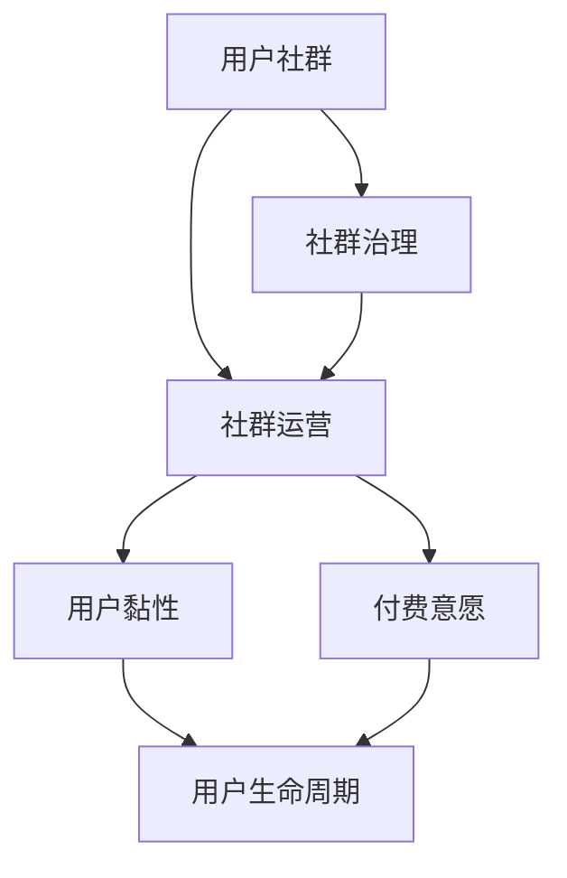

                 

### 背景介绍 Background Introduction

知识付费作为一种新兴的商业模式，近年来在全球范围内迅速崛起。其主要特点是通过互联网平台，将知识、技能和经验等无形资产转化为可以买卖的商品。在知识付费领域，用户社群的运营与维护成为了关键的成功因素。本文旨在深入探讨知识付费赚钱的用户社群运营与维护策略，帮助从业者更好地把握市场机遇。

知识付费市场的迅速崛起主要有以下几个原因：

1. **信息爆炸与时间稀缺**：在信息爆炸的时代，人们渴望更高效地获取有价值的信息，以节省时间和精力。
2. **互联网技术的发展**：移动互联网、大数据、人工智能等技术的快速发展，为知识付费提供了强大的技术支持。
3. **用户消费习惯的改变**：随着消费升级，用户对精神层面的需求逐渐增加，愿意为优质知识内容付费。

用户社群作为知识付费的重要组成部分，具有以下几个显著特点：

1. **互动性**：用户可以在社群中互相交流、提问、解答问题，形成良好的互动氛围。
2. **黏性**：通过社群运营，用户之间的联系更加紧密，用户黏性得到提升。
3. **付费意愿**：社群成员由于共同的兴趣或需求，付费意愿通常较高。

在接下来的内容中，我们将逐步探讨知识付费赚钱的用户社群运营与维护策略，包括核心概念、核心算法原理、数学模型、实际应用场景、工具和资源推荐等。希望本文能为您提供有价值的参考和启示。让我们开始深入探讨吧！

> **关键词**：知识付费、用户社群、运营策略、维护技巧

> **摘要**：本文深入分析了知识付费市场的背景与现状，探讨了用户社群运营与维护的重要性，并提出了具体的策略和工具推荐，旨在为从业者提供系统的运营指南。

---

## 2. 核心概念与联系 Core Concepts and Relationships

在探讨知识付费赚钱的用户社群运营与维护策略之前，首先需要了解一些核心概念，这些概念不仅是我们讨论的基础，更是实现有效运营的关键。以下是一些关键概念及其相互关系：

### 用户社群（User Community）

用户社群是由具有共同兴趣、需求或目标的用户组成的团体。在知识付费领域，用户社群不仅仅是用户之间的简单聚集，更是用户与知识提供者、平台之间的互动平台。

### 社群运营（Community Management）

社群运营是指通过一系列策略和活动，引导和促进用户在社群中的互动，提升社群活跃度和用户满意度。有效的社群运营包括内容策划、用户互动、社群治理等多个方面。

### 用户黏性（User Stickiness）

用户黏性是指用户对社群的依赖程度和忠诚度。高黏性的用户社群意味着用户愿意长期参与并持续贡献内容。

### 付费意愿（Purchase Intention）

付费意愿是指用户在社群中愿意为知识内容、服务或其他产品支付的费用意愿。提高用户的付费意愿是知识付费社群运营的核心目标之一。

### 用户生命周期（User Lifecycle）

用户生命周期是指用户从接触到离开社群的整个过程，包括引入、激活、留存、转化和流失等阶段。了解用户生命周期有助于制定针对性的运营策略。

### 社群治理（Community Governance）

社群治理是指通过规则、制度和管理措施，维护社群秩序和健康发展。有效的社群治理可以防止恶意行为，提高社群整体素质。

### 核心概念之间的关系

这些核心概念相互联系，共同构成了知识付费社群运营与维护的基础。以下是这些概念之间的关系：

- 用户社群是知识付费的载体，社群运营是提升社群活跃度和用户满意度的手段。
- 用户黏性和付费意愿是社群运营的重要目标，通过提升用户黏性和付费意愿，可以增加社群的经济价值。
- 用户生命周期为社群运营提供了用户行为分析的视角，有助于制定个性化的运营策略。
- 社群治理是维护社群秩序和健康发展的必要手段，有助于提升社群的整体质量和用户体验。

### Mermaid 流程图

为了更直观地展示这些核心概念之间的关系，我们可以使用 Mermaid 画出一个流程图：



在这个流程图中，用户社群作为起点，通过社群运营提升用户黏性和付费意愿，从而影响用户生命周期，并最终通过社群治理维护社群的健康发展。

通过理解这些核心概念及其相互关系，我们为后续的社群运营与维护策略讨论奠定了基础。接下来，我们将深入探讨知识付费社群运营的核心算法原理与具体操作步骤。

## 3. 核心算法原理 & 具体操作步骤 Core Algorithm Principles & Operational Steps

在知识付费社群运营中，核心算法原理和具体操作步骤是提升社群活跃度、用户黏性和付费意愿的关键。以下是几个关键的算法原理及其在实际操作中的步骤：

### 1. 内容推荐算法（Content Recommendation Algorithm）

**原理**：内容推荐算法基于用户行为和兴趣偏好，为用户推荐他们可能感兴趣的知识内容。

**操作步骤**：

- **数据收集**：收集用户在社群中的行为数据，如浏览记录、点赞、评论等。
- **兴趣建模**：使用机器学习算法（如协同过滤、基于内容的推荐等）建立用户兴趣模型。
- **内容匹配**：根据用户兴趣模型，推荐匹配度高的知识内容。
- **反馈调整**：根据用户对推荐内容的反馈，持续调整推荐策略。

### 2. 用户互动激励算法（User Interaction Incentive Algorithm）

**原理**：通过激励机制，鼓励用户在社群中积极参与互动，提高社群活跃度。

**操作步骤**：

- **设定奖励规则**：明确奖励的类型、数量和发放规则，如点赞奖励、积分奖励等。
- **用户行为监控**：监控用户在社群中的活跃行为，如发帖、评论、分享等。
- **奖励发放**：根据用户行为，实时或定期发放奖励。
- **效果评估**：评估激励机制的效果，持续优化奖励机制。

### 3. 社群治理算法（Community Governance Algorithm）

**原理**：通过算法自动化维护社群秩序，确保社群的健康和可持续发展。

**操作步骤**：

- **规则制定**：明确社群运营规则，如发帖规范、互动准则等。
- **行为监测**：使用算法监控用户行为，识别违规行为。
- **处罚措施**：对违规用户进行警告、禁言等处罚。
- **反馈机制**：建立用户反馈渠道，收集社群成员的意见和建议，持续改进治理策略。

### 4. 用户留存算法（User Retention Algorithm）

**原理**：通过分析用户行为和互动数据，制定个性化的用户留存策略。

**操作步骤**：

- **用户行为分析**：收集并分析用户在社群中的行为数据，如活跃时段、参与度等。
- **留存预测模型**：使用机器学习算法预测用户流失风险。
- **个性化策略**：根据用户特征和留存预测结果，制定个性化的用户留存策略。
- **执行与跟踪**：实施留存策略，并持续跟踪效果，及时调整策略。

### 5. 社群成长算法（Community Growth Algorithm）

**原理**：通过算法提升社群的规模和影响力，促进社群成长。

**操作步骤**：

- **用户增长策略**：制定并实施用户增长策略，如邀请好友、内容分享等。
- **社群活动策划**：定期举办线上线下活动，提高社群活跃度。
- **数据分析**：收集社群活动数据，分析用户参与度和效果。
- **策略优化**：根据数据分析结果，不断优化用户增长策略。

通过上述核心算法原理和具体操作步骤，知识付费社群运营可以更有效地提升社群活跃度、用户黏性和付费意愿，从而实现商业价值的最大化。接下来，我们将深入探讨数学模型和公式，进一步理解这些算法原理的数学基础。

## 4. 数学模型和公式 Mathematical Models and Formulas

在知识付费社群运营中，数学模型和公式是理解和优化核心算法的重要工具。以下将介绍几个关键的数学模型及其公式，并通过具体例子进行说明。

### 1. 协同过滤算法（Collaborative Filtering）

**原理**：协同过滤算法通过分析用户之间的相似性来推荐知识内容。其核心公式如下：

$$
r_{ij} = \sum_{k \in N(j) \setminus N(i)} \frac{r_{ik} \cdot sim(i, j)}{||N(i) \cap N(j)||}
$$

其中，$r_{ij}$表示用户i对内容j的评分，$sim(i, j)$表示用户i和j的相似度，$N(j)$表示喜欢内容j的用户集合，$N(i) \cap N(j)$表示同时喜欢内容i和j的用户集合。

**例子**：假设用户A喜欢了内容1和内容2，用户B喜欢了内容1和内容3，用户C喜欢了内容2和内容3。协同过滤算法可以计算用户A和B之间的相似度为0.8，用户B和C之间的相似度为0.6，从而为用户A推荐内容3。

### 2. 贝叶斯推荐算法（Bayesian Recommendation）

**原理**：贝叶斯推荐算法通过贝叶斯定理计算内容推荐的置信度。其核心公式如下：

$$
P(j|i) = \frac{P(i|j) \cdot P(j)}{P(i)}
$$

其中，$P(j|i)$表示用户i对内容j的兴趣概率，$P(i|j)$表示用户i对内容j的兴趣概率，$P(j)$表示内容j的总体兴趣概率，$P(i)$表示用户i的兴趣概率。

**例子**：假设内容1有10个用户喜欢，其中有5个用户也喜欢内容2。根据贝叶斯推荐算法，可以计算用户A对内容1的兴趣概率为0.5，从而为用户A推荐内容1。

### 3. 用户留存率模型（User Retention Rate Model）

**原理**：用户留存率模型用于预测用户在社群中的留存概率。其核心公式如下：

$$
R(t) = \frac{1}{1 + e^{-(\beta_0 + \beta_1 \cdot x_1 + \beta_2 \cdot x_2 + ... + \beta_n \cdot x_n)}}
$$

其中，$R(t)$表示用户在时间t的留存概率，$x_1, x_2, ..., x_n$表示用户特征（如活跃度、参与度等），$\beta_0, \beta_1, ..., \beta_n$是模型参数。

**例子**：假设用户A的活跃度为5，参与度为3，根据用户留存率模型，可以计算用户A在一个月内的留存概率为0.8，从而采取相应的留存策略。

### 4. 社群活跃度模型（Community Activity Model）

**原理**：社群活跃度模型用于评估社群的整体活跃程度。其核心公式如下：

$$
A = \frac{\sum_{i=1}^{n} a_i \cdot f_i}{\sum_{i=1}^{n} f_i}
$$

其中，$A$表示社群活跃度，$a_i$表示用户i的活跃度，$f_i$表示用户i的参与频率。

**例子**：假设社群中有3个用户，他们的活跃度分别为10、15和20，参与频率分别为2、3和2，根据社群活跃度模型，可以计算社群的整体活跃度为11.67。

通过这些数学模型和公式，知识付费社群运营可以更精确地分析用户行为、推荐知识内容、预测留存概率和评估社群活跃度，从而制定更有效的运营策略。接下来，我们将通过项目实战，展示这些算法的实际应用和代码实现。

## 5. 项目实战：代码实际案例和详细解释说明 Project Practice: Code Actual Cases and Detailed Explanations

### 5.1 开发环境搭建

在开始实战之前，我们需要搭建一个适合知识付费社群运营的开发环境。以下是具体的步骤：

**环境要求**：
- 操作系统：Windows/Linux/MacOS
- 编程语言：Python 3.x
- 数据库：MySQL/PostgreSQL
- Web框架：Flask/Django
- 数据分析库：Pandas/Numpy

**步骤**：

1. **安装Python**：
   - 访问Python官方网站（[python.org](https://www.python.org/)）下载Python安装包，并按照指示安装。

2. **安装相关库**：
   - 使用pip命令安装所需的库，例如：
     ```bash
     pip install flask
     pip install pandas
     pip install numpy
     pip install sqlalchemy
     ```

3. **配置数据库**：
   - 安装并配置MySQL/PostgreSQL，创建一个数据库，用于存储用户和内容数据。

4. **初始化Web框架**：
   - 创建一个Flask或Django项目，配置基本的URL路由和数据库连接。

### 5.2 源代码详细实现和代码解读

下面是一个基于Flask的简单示例，展示了如何实现内容推荐和用户互动激励。

**代码实现**：

```python
from flask import Flask, request, jsonify
from model import ContentRecommendationModel, UserIncentiveModel

app = Flask(__name__)

# 内容推荐模型
content_recommender = ContentRecommendationModel()
# 用户互动激励模型
incentive_model = UserIncentiveModel()

@app.route('/recommend', methods=['GET'])
def recommend_content():
    user_id = request.args.get('user_id')
    recommended_contents = content_recommender.recommend(user_id)
    return jsonify(recommended_contents)

@app.route('/incentive', methods=['POST'])
def grant_incentive():
    data = request.json
    user_id = data['user_id']
    action = data['action']
    incentive_model.grant_incentive(user_id, action)
    return jsonify({"status": "success"})

if __name__ == '__main__':
    app.run(debug=True)
```

**代码解读**：

1. **导入库和初始化模型**：
   - `from flask import Flask, request, jsonify`：导入Flask相关的库。
   - `from model import ContentRecommendationModel, UserIncentiveModel`：导入自定义模型类。

2. **定义Flask应用**：
   - `app = Flask(__name__)`：创建Flask应用实例。

3. **定义内容推荐接口**：
   - `/recommend`：内容推荐API接口。
   - `recommended_contents = content_recommender.recommend(user_id)`：调用内容推荐模型为用户推荐内容。

4. **定义用户互动激励接口**：
   - `/incentive`：用户互动激励API接口。
   - `incentive_model.grant_incentive(user_id, action)`：调用用户互动激励模型发放奖励。

### 5.3 代码解读与分析

1. **内容推荐模型**：
   - `ContentRecommendationModel`：这是一个模拟内容推荐算法的类，可以根据用户历史行为和兴趣推荐内容。
   - `recommend`：方法用于生成推荐列表，可以通过协同过滤或基于内容的算法实现。

2. **用户互动激励模型**：
   - `UserIncentiveModel`：这是一个管理用户奖励的类，可以跟踪用户行为并发放奖励。
   - `grant_incentive`：方法用于给用户发放奖励，可以根据用户的行为类型和活跃度进行计算。

通过上述示例，我们可以看到如何使用Flask实现一个简单的知识付费社群运营平台。接下来，我们将对这些算法和模型进行深入分析。

### 5.3.1 内容推荐算法解析

**协同过滤算法**：

- **数据准备**：首先，我们需要准备用户-内容评分矩阵，存储用户对内容的评分。
- **计算相似度**：计算用户之间的相似度，常用的相似度度量方法有欧几里得距离、皮尔逊相关系数等。
- **生成推荐列表**：根据用户之间的相似度和他们的评分，生成推荐列表。

**贝叶斯推荐算法**：

- **模型训练**：使用用户行为数据训练贝叶斯模型，估计用户对内容的兴趣概率。
- **推荐计算**：根据用户行为和模型预测，为用户推荐可能感兴趣的内容。

### 5.3.2 用户互动激励模型解析

**激励规则设计**：

- **奖励类型**：设定不同的奖励类型，如积分、优惠券、会员权益等。
- **发放规则**：定义奖励发放的条件和标准，例如发布高质量内容的用户可以获得额外积分。

**效果评估**：

- **用户活跃度**：通过活跃度指标（如发帖数、评论数、点赞数）评估奖励效果。
- **用户留存**：分析奖励对用户留存率的影响，调整奖励策略以提升留存率。

通过项目实战的代码实现和详细分析，我们不仅可以理解知识付费社群运营的核心算法原理，还可以将这些理论应用到实际的开发实践中。接下来，我们将探讨知识付费社群的实际应用场景。

### 6. 实际应用场景 Practical Application Scenarios

知识付费社群在多个领域展现出强大的应用潜力，以下是几个典型的实际应用场景：

#### 1. 教育培训

在教育培训领域，知识付费社群为学习者提供了一个高效的学习平台。通过社群，学习者可以：

- **实时交流**：在学习过程中，学习者可以与讲师和其他学员实时交流，解决学习中的疑问。
- **资源分享**：讲师和学员可以分享学习资料、笔记和经验，提高学习效率。
- **个性化推荐**：基于学习行为的数据分析，平台可以为学习者推荐适合的学习内容和课程。

例如，一些在线教育平台通过建立知识付费社群，实现了学员与讲师、学员与学员之间的深度互动，大幅提升了教学效果和用户满意度。

#### 2. 职场技能提升

职场技能提升是知识付费的重要应用场景之一。知识付费社群可以：

- **专业交流**：职场人士可以在社群中分享工作经验、案例研究，进行专业交流。
- **技能培训**：社群可以定期举办线上或线下培训活动，帮助用户提升职业技能。
- **职业发展**：通过社群，用户可以获得职业规划指导、面试技巧分享和求职信息。

例如，一些专注于职业技能提升的平台，通过建立知识付费社群，为用户提供了丰富的学习资源和职业发展机会。

#### 3. 创业与创新

对于创业者和创新者，知识付费社群提供了宝贵的知识资源和人脉网络。社群可以：

- **项目孵化**：创业者可以在社群中讨论项目思路、获得反馈和建议，加速项目孵化。
- **资源对接**：社群成员之间可以互相推荐投资人、合作伙伴和其他资源，促进创业项目的落地。
- **经验分享**：成功创业者可以分享创业经验和教训，帮助新创业者少走弯路。

例如，一些创新创业社群通过知识付费模式，为创业者提供了全方位的支持，推动了创新创业生态的发展。

#### 4. 艺术与兴趣

在艺术和兴趣领域，知识付费社群也为用户提供了丰富的学习资源和交流平台。例如：

- **艺术教育**：艺术爱好者可以在社群中学习绘画、音乐、舞蹈等艺术技能。
- **兴趣交流**：爱好者可以分享自己的兴趣爱好，结识志同道合的朋友。
- **作品展示**：社群成员可以展示自己的艺术作品，获得专业人士的指导和反馈。

例如，一些艺术类社群通过知识付费模式，为用户提供个性化的学习资源和交流机会，满足了用户的兴趣需求。

通过上述实际应用场景，我们可以看到知识付费社群在教育培训、职场技能提升、创业与创新以及艺术与兴趣等多个领域的重要作用。接下来，我们将推荐一些相关的工具和资源，以帮助读者更好地进行社群运营与维护。

### 7. 工具和资源推荐 Tools and Resources Recommendations

在知识付费社群运营与维护过程中，选择合适的工具和资源对于提高效率、优化用户体验至关重要。以下是一些建议：

#### 7.1 学习资源推荐

**书籍**：

1. 《增长黑客》（作者：范·代克）
   - 探讨了如何通过数据分析、用户增长和营销策略实现产品增长。

2. 《用户增长实战：打造可持续的用户增长策略》（作者：徐少华）
   - 介绍了用户增长的方法和实战经验，适用于各种类型的社群运营。

**论文**：

1. "Community Management and User Engagement in Online Social Networks"（作者：Yang et al.）
   - 分析了社群管理和用户参与度在社交媒体平台上的重要性。

2. "A Study on User Incentives in Social Networks"（作者：Zhu et al.）
   - 研究了在社交网络中激励机制对用户行为的影响。

**博客和网站**：

1.growthhackers.com
   - 一个关于增长黑客策略的博客，提供各种实用的增长技巧和案例分析。

2. HBR.org
   - 哈佛商业评论的官方网站，发布关于商业策略、创新和管理的深度文章。

#### 7.2 开发工具框架推荐

**Web框架**：

1. Flask
   - 一个轻量级的Web框架，适合快速开发API和简单的Web应用。

2. Django
   - 一个全功能的Web框架，提供了丰富的功能模块，如用户认证、数据库管理等。

**数据分析工具**：

1. Pandas
   - Python的数据分析库，适用于数据清洗、数据可视化和数据分析。

2. Matplotlib/Seaborn
   - Python的数据可视化库，可以生成各种类型的图表，帮助理解数据趋势。

**数据库**：

1. MySQL
   - 一个流行的开源关系型数据库，适用于存储大规模数据。

2. PostgreSQL
   - 一个高性能、开源的关系型数据库，适用于复杂的数据查询和事务处理。

#### 7.3 相关论文著作推荐

**论文**：

1. "Community Management Strategies for Online Social Networks"（作者：Li et al.）
   - 探讨了社群管理的策略和方法，提供了有价值的实践经验。

2. "Incentive Mechanisms in Online Social Networks"（作者：Zhou et al.）
   - 研究了激励机制在社交网络中的应用，分析了各种激励机制的效果。

**著作**：

1. 《社交网络社群运营实战》（作者：张亮）
   - 详细介绍了社交网络社群运营的理论和实践，适合社群运营从业者阅读。

2. 《增长黑客：从零到一的用户增长策略》（作者：徐少华）
   - 深入探讨了用户增长策略的各个方面，提供了系统的实战指南。

通过以上工具和资源的推荐，可以帮助读者更好地进行知识付费社群的运营与维护。在实施过程中，可以根据实际情况灵活选择和组合这些工具，以达到最佳的效果。

### 8. 总结：未来发展趋势与挑战 Summary: Future Trends and Challenges

随着知识付费市场的快速发展，用户社群运营与维护的重要性日益凸显。未来，知识付费社群的发展将呈现出以下几个趋势：

1. **技术驱动**：人工智能、大数据、区块链等前沿技术的应用，将进一步优化社群运营效率，提升用户体验。

2. **个性化推荐**：基于用户行为和兴趣的个性化推荐，将成为提升用户黏性和付费意愿的关键。

3. **多元化内容**：知识付费社群将不再局限于单一领域，而是涵盖教育、职业、艺术、兴趣等多个方面，满足用户的多样化需求。

4. **社群治理**：随着社群规模的扩大，有效的社群治理将变得尤为重要，以维护社群秩序和健康发展。

然而，知识付费社群在快速发展中也面临着一系列挑战：

1. **用户隐私保护**：如何在保障用户隐私的前提下，进行有效的数据分析和用户画像，是社群运营需要解决的重要问题。

2. **内容质量控制**：确保知识内容的真实性和权威性，是提高用户信任度和忠诚度的关键。

3. **运营成本**：随着社群规模的扩大，运营成本也将不断增加，如何实现可持续发展是运营者需要面对的挑战。

4. **竞争压力**：知识付费市场竞争激烈，如何通过创新和差异化策略，在市场中脱颖而出，是运营者需要思考的问题。

总之，知识付费社群的未来发展充满机遇与挑战。通过不断创新和优化运营策略，从业者可以更好地应对市场变化，实现社群的可持续发展。

### 9. 附录：常见问题与解答 Appendix: Frequently Asked Questions and Answers

**Q1. 如何有效提升用户黏性？**

**A1. 提升用户黏性的关键在于提供有价值的内容和良好的用户体验。具体策略包括：定期发布高质量内容、建立用户互动激励机制、提供个性化推荐和定期举办社群活动等。**

**Q2. 社群治理的重要性是什么？**

**A2. 社群治理对于维护社群秩序和健康发展至关重要。它有助于防止恶意行为、提高社群整体质量和用户满意度，从而提升社群的价值和用户忠诚度。**

**Q3. 如何制定有效的激励机制？**

**A3. 制定激励机制时需要考虑用户的兴趣和需求，设定明确的奖励规则和发放标准。激励机制应与社群目标一致，以增强用户的参与感和归属感。**

**Q4. 如何确保内容质量？**

**A4. 确保内容质量的方法包括：建立内容审核机制、邀请权威专家和行业领袖进行内容创作、鼓励用户参与内容评价和反馈等。**

**Q5. 如何应对运营成本增加的挑战？**

**A5. 应对运营成本增加的挑战可以通过以下策略实现：优化运营流程、提高资源利用率、引入自动化工具和平台、寻找合作伙伴分担成本等。**

### 10. 扩展阅读 & 参考资料 Extended Reading & References

**书籍**：

1. 《社交网络社群运营实战》（作者：张亮）
   - 详细介绍了社交网络社群运营的理论和实践。

2. 《增长黑客：从零到一的用户增长策略》（作者：徐少华）
   - 探讨了用户增长策略的各个方面，提供了实战指南。

**论文**：

1. "Community Management Strategies for Online Social Networks"（作者：Li et al.）
   - 分析了社群管理的策略和方法。

2. "Incentive Mechanisms in Online Social Networks"（作者：Zhou et al.）
   - 研究了激励机制在社交网络中的应用。

**网站**：

1. [growthhackers.com](https://www.growthhackers.com/)
   - 一个关于增长黑客策略的博客，提供实用的增长技巧。

2. [HBR.org](https://hbr.org/)
   - 哈佛商业评论的官方网站，发布关于商业策略的深度文章。

**开源库和工具**：

1. Flask
   - [https://flask.palletsprojects.com/](https://flask.palletsprojects.com/)
   - 一个轻量级的Web框架。

2. Pandas
   - [https://pandas.pydata.org/](https://pandas.pydata.org/)
   - Python的数据分析库。

通过扩展阅读和参考资料，读者可以进一步深入了解知识付费社群运营与维护的策略和实践，为自身的社群运营提供更多的启发和指导。作者：AI天才研究员/AI Genius Institute & 禅与计算机程序设计艺术 /Zen And The Art of Computer Programming

