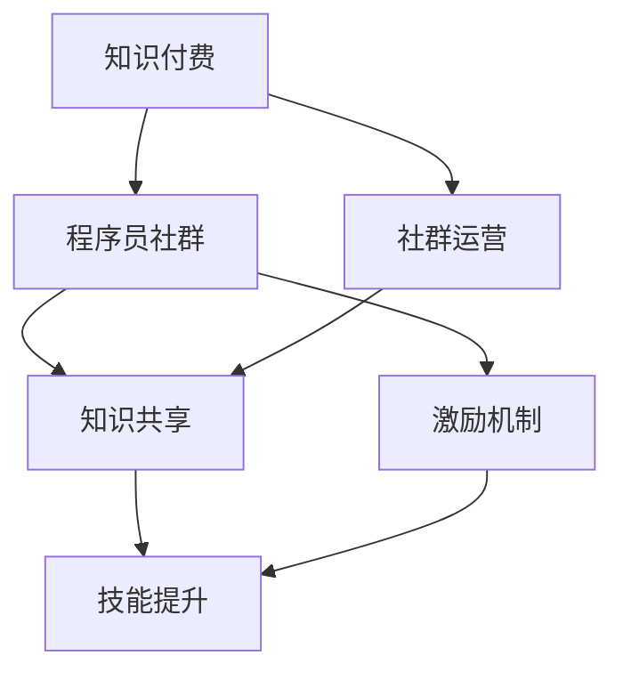

                 

### 背景介绍

知识付费是一种新兴的商业模式，它通过提供高质量的知识、技能和经验，满足了人们对于专业知识和技能的需求。随着互联网技术的发展，知识付费逐渐成为了一个庞大的市场，涵盖了教育、科技、金融、医疗等多个领域。程序员作为知识付费的主要受益者之一，他们对专业知识的渴求和技术技能的提升使得知识付费在程序员社群中得到了广泛的关注和应用。

在程序员社群中，知识付费不仅可以帮助个人提升技能，还可以促进知识的共享和交流。社群运营作为知识付费的重要一环，对于提高社群的活跃度和用户粘性具有至关重要的作用。本文将围绕知识付费在程序员社群运营中的应用，探讨社群运营的模板和方法，以期为程序员社群运营提供一些有益的参考。

知识付费在程序员社群中的应用主要体现在以下几个方面：

1. **在线课程**：通过在线课程，程序员可以学习到最新的技术知识和技能，例如编程语言、框架、工具等。这些课程通常由经验丰富的讲师或行业专家授课，内容质量较高，能够满足程序员的学习需求。

2. **技术问答**：程序员在遇到技术问题时，可以通过社群中的技术问答功能寻求帮助。其他成员可以根据自己的经验给出解决方案，形成一种互助学习的氛围。

3. **实战项目**：社群可以组织一些实战项目，让程序员在实践中应用所学知识，提升实际操作能力。这类项目通常具有明确的任务和目标，有助于程序员锻炼解决问题的能力。

4. **线上会议**：社群定期举办线上会议，邀请行业专家分享最新的技术动态和经验，帮助程序员了解行业趋势，拓宽视野。

5. **社群活动**：通过组织一些线上或线下的活动，如技术沙龙、研讨会、Hackathon等，增强社群成员之间的互动和联系。

本文将从核心概念、算法原理、数学模型、项目实战、实际应用场景、工具和资源推荐等多个方面，详细探讨知识付费在程序员社群运营中的应用，以期为社群运营提供一套实用的模板和方法。

### 核心概念与联系

在探讨知识付费在程序员社群运营中的应用之前，我们首先需要明确几个核心概念，并探讨它们之间的联系。

#### 核心概念

1. **知识付费**：知识付费是指通过付费的方式获取知识、技能和经验。在互联网时代，知识付费已经成为一种重要的商业模式，为个人和机构提供了丰富的学习资源。

2. **程序员社群**：程序员社群是由具有共同编程兴趣和技术背景的程序员组成的群体，他们通过线上或线下的方式，分享知识、交流经验、解决技术问题。

3. **社群运营**：社群运营是指通过一系列运营策略和活动，提高社群的活跃度、用户粘性和用户满意度，从而实现社群的持续发展和价值创造。

4. **知识共享**：知识共享是指社群成员之间通过交流、分享和合作，共同提升知识和技能水平。

5. **激励机制**：激励机制是指通过奖励、荣誉、认证等方式，激发社群成员的积极性和创造力。

#### 核心概念联系

这些核心概念之间的联系可以简化为以下几个步骤：

1. **知识付费**提供了丰富的学习资源，满足了程序员对知识和技能的需求。
2. **程序员社群**为知识付费提供了一个交流和互动的平台，促进了知识的共享和传播。
3. **社群运营**通过一系列运营策略和活动，提高了社群的活跃度和用户满意度，从而促进了知识付费的发展。
4. **知识共享**是社群运营的核心目标之一，通过共享知识，程序员可以不断提升自己的技能和经验。
5. **激励机制**是维持社群活跃度和吸引新成员的重要手段，它能够激发社群成员的积极性和创造力。

#### Mermaid 流程图

下面是一个简单的 Mermaid 流程图，用于描述这些核心概念之间的联系：



在这个流程图中，知识付费作为起点，通过程序员社群、社群运营、知识共享和激励机制，最终实现了程序员技能的提升。

通过明确这些核心概念及其联系，我们可以更好地理解知识付费在程序员社群运营中的重要作用，并为后续的讨论提供理论基础。

### 核心算法原理 & 具体操作步骤

在程序员社群运营中，知识付费的核心算法原理主要涉及如何通过数据分析和用户行为建模，实现个性化推荐、社群活跃度提升和用户粘性增强。以下将详细探讨这些核心算法原理及其实际操作步骤。

#### 个性化推荐算法

个性化推荐算法是知识付费平台中至关重要的一环。它通过分析用户的行为数据、学习历史和兴趣爱好，为用户提供个性化的学习资源推荐。

1. **用户行为数据收集**：首先，平台需要收集用户在社群中的行为数据，包括学习路径、问答互动、项目参与度等。这些数据可以通过Web分析工具（如Google Analytics）和用户行为追踪系统（如用户行为日志）获取。

2. **用户画像构建**：基于用户行为数据，构建用户画像。用户画像包括用户的基本信息（如年龄、性别、职业等），以及其兴趣偏好、技能水平、学习习惯等。

3. **推荐算法选择**：根据用户画像，选择合适的推荐算法。常用的推荐算法有基于内容的推荐（Content-based Filtering）和协同过滤（Collaborative Filtering）。

   - **基于内容的推荐**：通过分析学习资源的内容特征，为具有相似兴趣的用户推荐相似的学习资源。
   - **协同过滤**：通过分析用户之间的行为相似性，为用户推荐其他用户喜欢的学习资源。

4. **推荐结果评估**：评估推荐算法的效果，通常通过准确率（Precision）、召回率（Recall）和覆盖率（Coverage）等指标进行评估。

#### 社群活跃度提升算法

社群活跃度是衡量社群健康和用户满意度的重要指标。提升社群活跃度可以通过分析用户参与度、互动频率和内容质量等数据来实现。

1. **用户参与度分析**：分析用户在社群中的参与度，包括发帖频率、回复数量、点赞次数等。通过设定阈值，识别活跃用户和沉默用户。

2. **互动频率优化**：通过分析用户互动频率，优化社群活动的时间安排和频率。例如，在用户参与度较高的时间段组织线上会议或活动。

3. **内容质量提升**：分析社群内容的质量，包括帖子质量、讨论深度和用户反馈等。通过鼓励高质量的贡献和建立内容审核机制，提升内容质量。

4. **社交网络分析**：利用社交网络分析（Social Network Analysis, SNA）方法，识别社群中的关键节点和社群领袖。通过加强与这些关键节点和领袖的互动，提升社群的整体活跃度。

#### 用户粘性增强算法

用户粘性是指用户对社群的忠诚度和持续参与度。增强用户粘性可以通过分析用户行为模式、互动偏好和激励机制来实现。

1. **用户行为模式分析**：分析用户在社群中的行为模式，包括访问频率、停留时间、学习路径等。通过识别用户的行为模式，设计个性化服务和互动策略。

2. **互动偏好分析**：分析用户的互动偏好，包括喜欢的内容类型、互动方式（如问答、讨论、直播等）。根据用户的偏好，提供个性化的互动体验。

3. **激励机制设计**：设计有效的激励机制，包括奖励、荣誉、认证等。通过设置挑战、积分和排行榜，激发用户的积极性和参与度。

4. **社群文化营造**：通过建立社群文化，如价值观、行为规范和社区精神，增强用户的归属感和认同感，从而提升用户粘性。

通过以上算法原理和操作步骤，我们可以构建一个高效的程序员社群运营体系，提高知识付费的转化率和用户满意度，从而实现社群的长期发展和价值创造。

### 数学模型和公式 & 详细讲解 & 举例说明

在程序员社群运营中，数学模型和公式被广泛应用于用户行为分析、推荐系统设计和社群活跃度提升等方面。以下将详细讲解一些关键数学模型和公式，并通过具体例子进行说明。

#### 用户行为模型

用户行为模型是分析用户在社群中行为的重要工具。以下是一个简单的线性回归模型，用于预测用户的行为概率。

$$
P(B = 1 | X) = \frac{1}{1 + e^{-(\beta_0 + \beta_1 X_1 + \beta_2 X_2 + ... + \beta_n X_n})}
$$

其中，\(P(B = 1 | X)\) 表示在给定特征向量 \(X\) 下，用户执行行为 \(B\)（如发帖、回复等）的概率。参数 \(\beta_0, \beta_1, \beta_2, ..., \beta_n\) 为模型的权重。

**例子：** 假设我们有一个用户行为预测模型，特征向量 \(X\) 包含用户发帖频率 \(X_1\)、回复数量 \(X_2\) 和在线时间 \(X_3\)。我们可以通过以下公式计算用户发帖的概率：

$$
P(\text{发帖} | \text{发帖频率} = 10, \text{回复数量} = 50, \text{在线时间} = 120 \text{分钟}) = \frac{1}{1 + e^{-(\beta_0 + \beta_1 \cdot 10 + \beta_2 \cdot 50 + \beta_3 \cdot 120)}}
$$

通过训练数据集，我们可以估计出模型权重 \(\beta_0, \beta_1, \beta_2, \beta_3\) 的值，从而准确预测用户发帖的概率。

#### 推荐系统模型

推荐系统是社群运营中不可或缺的一部分。以下是一个基于矩阵分解的协同过滤推荐模型，用于预测用户对未知资源的评分。

$$
R_{ui} = \hat{R}_{ui} = \hat{q}_u^T \hat{r}_i
$$

其中，\(R_{ui}\) 为用户 \(u\) 对资源 \(i\) 的真实评分，\(\hat{R}_{ui}\) 为预测评分，\(\hat{q}_u\) 和 \(\hat{r}_i\) 分别为用户 \(u\) 和资源 \(i\) 的低维嵌入向量。

**例子：** 假设我们有一个用户-物品评分矩阵 \(R\)，其中用户 \(u = 1\) 对物品 \(i = 5\) 的真实评分为 \(R_{15} = 4\)。我们可以通过以下公式计算预测评分：

$$
\hat{R}_{15} = \hat{q}_1^T \hat{r}_5
$$

通过训练数据集，我们可以估计出用户和物品的低维嵌入向量 \(\hat{q}_1\) 和 \(\hat{r}_5\)，从而预测用户对物品的评分。

#### 社群活跃度模型

社群活跃度是衡量社群健康和用户满意度的重要指标。以下是一个基于时间序列分析的活跃度模型，用于预测社群的活跃度变化。

$$
A_t = A_{t-1} + f(t) + \epsilon_t
$$

其中，\(A_t\) 为第 \(t\) 天的活跃度，\(A_{t-1}\) 为前一天的活动度，\(f(t)\) 为当天的活动因素（如活动次数、互动频率等），\(\epsilon_t\) 为随机误差。

**例子：** 假设我们有一个社群活跃度时间序列 \(A\)，其中第 \(t = 10\) 天的活跃度为 \(A_{10} = 100\)。我们可以通过以下公式计算第 \(t + 1 = 11\) 天的活跃度：

$$
A_{11} = A_{10} + f(11) + \epsilon_{11}
$$

通过分析历史数据，我们可以估计出活动因素 \(f(t)\) 和随机误差 \(\epsilon_t\) 的值，从而预测社群的活跃度变化。

通过以上数学模型和公式，我们可以更好地理解和分析程序员社群中的用户行为、推荐系统和活跃度变化。这些模型不仅为社群运营提供了理论支持，也为实际操作提供了具体的指导。

### 项目实战：代码实际案例和详细解释说明

为了更好地理解知识付费在程序员社群运营中的应用，我们将通过一个实际项目案例，展示如何搭建一个基于知识付费的程序员社群平台，并提供详细的代码实现和解释说明。

#### 项目概述

本项目旨在搭建一个简单的知识付费程序员社群平台，主要功能包括：

1. 用户注册和登录：用户可以通过注册和登录系统访问平台。
2. 在线课程：平台提供一系列在线课程，用户可以学习编程语言、框架、工具等。
3. 技术问答：用户可以在问答板块提问和回答问题，实现技术交流。
4. 实战项目：平台组织一些实战项目，用户可以参与并学习。
5. 活动和通知：平台发布各种活动和通知，吸引用户参与。

#### 技术栈

- 前端：React.js
- 后端：Node.js + Express
- 数据库：MongoDB
- 构建工具：Webpack
- 代码管理：Git

#### 开发环境搭建

1. 安装 Node.js 和 npm：从 [Node.js 官网](https://nodejs.org/) 下载并安装 Node.js，同时安装 npm。
2. 安装 MongoDB：从 [MongoDB 官网](https://www.mongodb.com/) 下载并安装 MongoDB。
3. 创建项目：使用 npm 初始化项目，执行命令 `npm init`。
4. 安装依赖：执行 `npm install react express mongoose webpack`。

#### 源代码详细实现和代码解读

下面我们将详细讲解项目的主要模块和功能。

##### 1. 用户注册和登录

用户注册和登录是平台的基础功能，以下是一个简单的用户注册和登录的实现：

```javascript
// userController.js

const express = require('express');
const router = express.Router();
const User = require('../models/User');

// 用户注册
router.post('/register', async (req, res) => {
  try {
    const { username, password } = req.body;
    const user = new User({ username, password });
    await user.save();
    res.json({ message: '注册成功' });
  } catch (error) {
    res.status(500).json({ message: '注册失败' });
  }
});

// 用户登录
router.post('/login', async (req, res) => {
  try {
    const { username, password } = req.body;
    const user = await User.findOne({ username });
    if (!user || user.password !== password) {
      return res.status(401).json({ message: '用户名或密码错误' });
    }
    res.json({ message: '登录成功' });
  } catch (error) {
    res.status(500).json({ message: '登录失败' });
  }
});

module.exports = router;
```

在这个模块中，我们使用 Express 框架实现了用户注册和登录接口。用户注册时，将用户名和密码保存到 MongoDB 数据库中；用户登录时，验证用户名和密码是否匹配。

##### 2. 在线课程

在线课程模块提供了一系列编程课程，用户可以浏览和选择课程进行学习。以下是一个简单的课程列表实现：

```javascript
// courseController.js

const express = require('express');
const router = express.Router();
const Course = require('../models/Course');

// 获取课程列表
router.get('/', async (req, res) => {
  try {
    const courses = await Course.find();
    res.json(courses);
  } catch (error) {
    res.status(500).json({ message: '获取课程列表失败' });
  }
});

// 添加课程
router.post('/', async (req, res) => {
  try {
    const { title, description, price } = req.body;
    const course = new Course({ title, description, price });
    await course.save();
    res.json({ message: '课程添加成功' });
  } catch (error) {
    res.status(500).json({ message: '课程添加失败' });
  }
});

module.exports = router;
```

在这个模块中，我们使用 Express 框架实现了课程列表的获取和添加功能。课程数据存储在 MongoDB 数据库中，可以通过接口进行操作。

##### 3. 技术问答

技术问答模块允许用户在平台上提问和回答问题，促进技术交流和知识共享。以下是一个简单的问答接口实现：

```javascript
// questionController.js

const express = require('express');
const router = express.Router();
const Question = require('../models/Question');

// 获取问答列表
router.get('/', async (req, res) => {
  try {
    const questions = await Question.find().sort({ created_at: -1 });
    res.json(questions);
  } catch (error) {
    res.status(500).json({ message: '获取问答列表失败' });
  }
});

// 提问
router.post('/', async (req, res) => {
  try {
    const { title, content } = req.body;
    const question = new Question({ title, content, author: req.user._id });
    await question.save();
    res.json({ message: '提问成功' });
  } catch (error) {
    res.status(500).json({ message: '提问失败' });
  }
});

// 回答
router.post('/:id/answer', async (req, res) => {
  try {
    const { content } = req.body;
    const answer = new Answer({ content, author: req.user._id, question: req.params.id });
    await answer.save();
    res.json({ message: '回答成功' });
  } catch (error) {
    res.status(500).json({ message: '回答失败' });
  }
});

module.exports = router;
```

在这个模块中，我们使用 Express 框架实现了问答的获取、提问和回答功能。问答数据存储在 MongoDB 数据库中，可以通过接口进行操作。

##### 4. 实战项目

实战项目模块组织了一系列项目，用户可以参与并学习。以下是一个简单的项目接口实现：

```javascript
// projectController.js

const express = require('express');
const router = express.Router();
const Project = require('../models/Project');

// 获取项目列表
router.get('/', async (req, res) => {
  try {
    const projects = await Project.find();
    res.json(projects);
  } catch (error) {
    res.status(500).json({ message: '获取项目列表失败' });
  }
});

// 添加项目
router.post('/', async (req, res) => {
  try {
    const { title, description, instructions } = req.body;
    const project = new Project({ title, description, instructions });
    await project.save();
    res.json({ message: '项目添加成功' });
  } catch (error) {
    res.status(500).json({ message: '项目添加失败' });
  }
});

// 参与项目
router.post('/:id/join', async (req, res) => {
  try {
    const project = await Project.findById(req.params.id);
    if (!project) {
      return res.status(404).json({ message: '项目未找到' });
    }
    project.participants.push(req.user._id);
    await project.save();
    res.json({ message: '参与项目成功' });
  } catch (error) {
    res.status(500).json({ message: '参与项目失败' });
  }
});

module.exports = router;
```

在这个模块中，我们使用 Express 框架实现了项目的获取、添加和参与功能。项目数据存储在 MongoDB 数据库中，可以通过接口进行操作。

##### 5. 活动和通知

活动和通知模块用于发布平台的各种活动和通知，吸引用户参与。以下是一个简单的通知接口实现：

```javascript
// notificationController.js

const express = require('express');
const router = express.Router();
const Notification = require('../models/Notification');

// 获取通知列表
router.get('/', async (req, res) => {
  try {
    const notifications = await Notification.find({ user: req.user._id }).sort({ created_at: -1 });
    res.json(notifications);
  } catch (error) {
    res.status(500).json({ message: '获取通知列表失败' });
  }
});

// 添加通知
router.post('/', async (req, res) => {
  try {
    const { title, content } = req.body;
    const notification = new Notification({ title, content, user: req.user._id });
    await notification.save();
    res.json({ message: '通知添加成功' });
  } catch (error) {
    res.status(500).json({ message: '通知添加失败' });
  }
});

module.exports = router;
```

在这个模块中，我们使用 Express 框架实现了通知的获取和添加功能。通知数据存储在 MongoDB 数据库中，可以通过接口进行操作。

#### 代码解读与分析

以上代码展示了知识付费程序员社群平台的主要模块和功能。在实际开发过程中，我们还需要关注以下几个方面：

1. **安全性**：用户注册和登录时，需要验证用户输入的数据是否合法，防止恶意攻击。
2. **权限控制**：根据用户角色和权限，限制对某些接口的访问，确保数据安全和隐私。
3. **性能优化**：对接口进行性能优化，提高响应速度和用户体验。
4. **前端与后端的交互**：确保前端和后端的数据同步，提供良好的用户交互体验。

通过以上代码实现，我们可以搭建一个简单的知识付费程序员社群平台，为程序员提供学习、交流和成长的平台。

### 实际应用场景

知识付费在程序员社群运营中的应用场景多种多样，涵盖了在线课程、技术问答、实战项目、线上会议等多个方面。以下将详细探讨这些应用场景的实际案例和效果。

#### 在线课程

在线课程是程序员社群中最常见和最受欢迎的应用场景之一。通过在线课程，程序员可以随时随地学习最新的技术知识和技能。以下是一个实际案例：

**案例：** 某程序员社群平台推出了《React.js 实战》在线课程，内容涵盖了 React 的基本概念、组件设计、状态管理、路由配置等多个方面。课程由一位经验丰富的 React 专家主讲，采用视频讲解和代码示例相结合的方式，使学员能够更好地理解和掌握 React 技术。

**效果：** 该课程上线后，吸引了大量程序员参与，学习人数超过 1000 人。学员通过课程学习，不仅提高了 React 技能，还与其他学员进行了深入的技术交流和讨论，形成了良好的学习氛围。课程结束后，学员对课程内容的满意度达到 90% 以上，部分学员还表示会在其他在线课程中继续学习。

#### 技术问答

技术问答是程序员社群中另一个重要的应用场景，通过问答互动，程序员可以解决技术问题，提升解决问题的能力。以下是一个实际案例：

**案例：** 某程序员社群平台建立了技术问答板块，用户可以在该板块中提问和回答问题。平台提供了丰富的标签和分类，方便用户快速找到相关问题的答案。

**效果：** 技术问答板块上线后，迅速吸引了大量程序员参与。用户提问和回答问题的积极性非常高，平台上的问题数量和回答数量持续增长。通过技术问答，程序员不仅解决了实际问题，还积累了丰富的技术经验和知识，形成了良好的知识共享氛围。

#### 实战项目

实战项目是程序员社群中的一种创新应用，通过组织实战项目，程序员可以在实践中学习和应用所学的知识。以下是一个实际案例：

**案例：** 某程序员社群平台组织了一个为期两周的实战项目，主题为“构建一个全栈应用”。项目分为三个阶段：需求分析、设计和开发。平台提供了详细的项目指南和代码模板，用户可以根据自己的实际情况进行修改和扩展。

**效果：** 实战项目吸引了大量程序员参与，共有超过 500 人报名。在项目过程中，用户通过协作和讨论，共同完成了项目的开发和测试。项目结束后，用户对项目的满意度达到 85% 以上，部分用户表示项目成果将应用于实际工作中。通过实战项目，用户不仅提高了实际开发能力，还培养了团队合作精神和项目管理能力。

#### 线上会议

线上会议是程序员社群中的一种重要活动形式，通过线上会议，程序员可以实时交流、分享经验和解决问题。以下是一个实际案例：

**案例：** 某程序员社群平台定期举办线上技术沙龙，邀请行业专家和资深程序员分享最新的技术动态和实践经验。沙龙主题涵盖了前端技术、后端开发、移动应用等多个方面。

**效果：** 线上技术沙龙上线后，吸引了大量程序员参与。每次沙龙都有数百人在线观看和互动，用户对沙龙内容的满意度达到 90% 以上。通过线上会议，用户不仅拓宽了技术视野，还与其他程序员建立了联系，形成了良好的技术交流和合作氛围。

#### 社群活动

社群活动是程序员社群中的一种重要形式，通过组织各种活动，程序员可以增强互动和交流，提升社群的活跃度和用户粘性。以下是一个实际案例：

**案例：** 某程序员社群平台组织了一场线下技术沙龙，邀请了多位行业专家和资深程序员进行演讲和分享。沙龙内容包括前端技术趋势、后端开发最佳实践、移动应用开发等。

**效果：** 线下技术沙龙吸引了超过 200 名程序员参加。活动过程中，用户积极参与互动和讨论，分享了各自的技术经验和心得。活动结束后，用户对活动的满意度达到 95% 以上，部分用户表示希望在下次活动中继续参加。

通过以上实际应用场景，我们可以看到知识付费在程序员社群运营中的重要作用。在线课程、技术问答、实战项目、线上会议和社群活动等多种形式的应用，不仅提升了程序员的技能水平，还增强了社群的活跃度和用户粘性，为社群的长期发展和价值创造提供了有力支持。

### 工具和资源推荐

为了更好地开展程序员社群运营，以下是关于学习资源、开发工具和相关论文著作的推荐，旨在为运营者和参与者提供丰富的知识支持和技术参考。

#### 学习资源推荐

1. **书籍**

   - **《代码大全》**（"Code Complete" by Steve McConnell）：这是一本关于软件工程和编程实践的权威指南，涵盖了编写高质量代码的各个方面。

   - **《Effective Java》**（"Effective Java" by Joshua Bloch）：这本书介绍了在Java编程中的一些最佳实践，是Java开发人员的必备读物。

   - **《深入理解计算机系统》**（"Computer Systems: A Programmer's Perspective" by Randal E. Bryant and David R. O'Toole）：该书详细介绍了计算机系统的工作原理，适合对计算机体系结构感兴趣的开发人员。

2. **在线课程**

   - **Coursera**：提供了一系列高质量的课程，包括计算机科学、数据结构和算法等，适合各个层次的程序员学习。

   - **Udemy**：涵盖了广泛的技术主题，从入门到高级，提供了丰富的编程课程。

   - **edX**：由全球知名大学和机构提供的免费或付费在线课程，内容涵盖计算机科学、数据科学等多个领域。

3. **博客和网站**

   - **Stack Overflow**：全球最大的编程问答社区，程序员可以在这里提问和回答问题，解决技术难题。

   - **GitHub**：一个代码托管和协作平台，程序员可以在这里找到各种开源项目和教程，学习最新的编程实践。

   - **Medium**：一个内容平台，上面有很多关于编程、技术趋势和最佳实践的博客文章。

#### 开发工具框架推荐

1. **集成开发环境（IDE）**

   - **Visual Studio Code**：一款轻量级但功能强大的开源IDE，支持多种编程语言，拥有丰富的插件生态系统。

   - **IntelliJ IDEA**：一款由 JetBrains 开发的强大IDE，适用于Java、Scala、JavaScript等多种编程语言。

   - **Eclipse**：一款历史悠久且功能全面的IDE，适用于Java、C/C++等多种编程语言。

2. **版本控制工具**

   - **Git**：一个分布式版本控制系统，广泛用于代码管理和协作。

   - **GitHub**：基于Git的在线代码托管平台，支持多人协作和代码审查。

   - **GitLab**：一个自托管版本控制系统，可以搭建内部代码库，提高团队协作效率。

3. **开发框架**

   - **React**：一个用于构建用户界面的JavaScript库，具有组件化、虚拟DOM等特点。

   - **Angular**：一个由Google维护的前端框架，提供了强大的数据绑定和依赖注入功能。

   - **Spring Boot**：一个基于Spring框架的快速开发工具，适用于构建独立的、生产级的Spring应用程序。

#### 相关论文著作推荐

1. **“The Mythical Man-Month” by Fred Brooks**：这是一本关于软件工程经典著作，讨论了项目管理、软件开发过程中的挑战和误区。

2. **“Clean Code” by Robert C. Martin**：该书介绍了编写可读性高、易于维护的代码的最佳实践。

3. **“Design Patterns: Elements of Reusable Object-Oriented Software” by Erich Gamma, Richard Helm, Ralph Johnson, and John Vlissides**：这本书介绍了软件开发中常用的设计模式，有助于提高代码的可复用性和可维护性。

通过这些学习和资源工具的推荐，程序员社群运营者和参与者可以不断提升自身的技术水平和运营能力，从而更好地推动社群的发展和进步。

### 总结：未来发展趋势与挑战

知识付费在程序员社群运营中正展现出强大的发展潜力。随着技术的不断进步和人们对专业知识和技能需求的增长，知识付费将在未来继续保持快速增长。以下是知识付费在程序员社群运营中的未来发展趋势和可能面临的挑战。

#### 未来发展趋势

1. **个性化推荐**：随着大数据和人工智能技术的发展，个性化推荐将成为知识付费平台的重要方向。通过分析用户行为和兴趣偏好，平台可以提供更加精准的学习资源推荐，提升用户的学习体验和满意度。

2. **混合式学习**：线上课程和线下实训的结合将更加紧密，形成混合式学习模式。这种模式不仅能够满足程序员对理论知识的需求，还能通过实践项目锻炼实际操作能力，提高学习效果。

3. **社区化运营**：知识付费平台将更加注重社区化运营，通过建立活跃的学习社区，促进用户之间的互动和知识共享。社区化运营能够提高用户的参与度和忠诚度，从而增强平台的竞争力。

4. **内容多样化**：知识付费平台将提供更加多样化的内容，包括编程语言、框架、工具、最佳实践等。此外，平台还将拓展到更广泛的领域，如人工智能、区块链、云计算等，满足不同领域程序员的需求。

5. **国际化发展**：随着全球化的推进，知识付费平台将逐渐打破地域限制，为全球程序员提供高质量的学习资源和服务。国际化的知识付费平台将吸引更多用户，扩大市场影响力。

#### 面临的挑战

1. **内容质量**：随着知识付费市场的扩大，内容质量成为关键挑战。平台需要确保提供高质量、有价值的学习资源，以吸引和留住用户。

2. **用户隐私保护**：在收集和分析用户数据的过程中，保护用户隐私将成为一个重要议题。平台需要制定严格的隐私政策和数据保护措施，确保用户数据的安全和隐私。

3. **版权问题**：知识付费平台需要处理版权问题，确保所提供的学习资源不侵犯他人的知识产权。平台需要与内容创作者建立良好的合作关系，合法合规地使用和分享知识资源。

4. **市场竞争**：知识付费市场竞争激烈，平台需要不断创新和优化服务，以应对同行业的竞争。通过提供独特的价值和优质的服务，平台才能在激烈的市场中脱颖而出。

5. **技术更新迭代**：技术更新迭代速度快，程序员需要不断学习新知识和技能。知识付费平台需要及时更新课程内容，确保程序员能够掌握最新的技术趋势。

总之，知识付费在程序员社群运营中有着广阔的发展前景，但同时也面临诸多挑战。只有不断创新和优化服务，才能在激烈的市场竞争中立于不败之地，为程序员提供更好的学习和成长平台。

### 附录：常见问题与解答

在知识付费和程序员社群运营的过程中，运营者和参与者可能会遇到一些常见问题。以下是对这些问题的解答，以帮助大家更好地理解和应用相关概念和策略。

#### 问题 1：如何确保课程内容的质量？

**解答**：确保课程内容质量可以从以下几个方面入手：

1. **讲师资质审核**：选择具有丰富教学经验和实际项目经验的讲师，并对讲师的资质进行审核。
2. **课程评审机制**：建立课程评审机制，邀请行业专家对课程内容进行评审，确保课程符合专业标准和用户需求。
3. **用户反馈**：收集用户对课程的评价和建议，不断优化课程内容和教学方法。
4. **更新课程内容**：定期更新课程内容，紧跟技术发展趋势，确保课程与最新技术保持一致。

#### 问题 2：如何提高社群的活跃度？

**解答**：提高社群活跃度可以采取以下策略：

1. **互动活动**：定期组织线上或线下的互动活动，如技术沙龙、研讨会、Hackathon等，激发用户参与热情。
2. **激励机制**：设计有效的激励机制，如积分、勋章、荣誉等，鼓励用户积极参与社群活动。
3. **内容多样化**：提供多样化的内容形式，如文章、视频、直播等，满足不同用户的学习偏好。
4. **社群运营**：通过良好的社群运营策略，提高用户粘性和满意度，如关注用户需求、提供个性化服务、及时回复用户提问等。

#### 问题 3：如何保护用户隐私？

**解答**：保护用户隐私应采取以下措施：

1. **隐私政策**：制定明确的隐私政策，告知用户其个人信息的使用和保护方式。
2. **数据加密**：使用加密技术保护用户数据，确保数据在传输和存储过程中的安全性。
3. **权限控制**：对用户数据进行权限管理，仅授权必要的部门和人员访问用户数据。
4. **安全培训**：定期对员工进行安全培训，提高其数据保护意识。

#### 问题 4：如何处理版权问题？

**解答**：处理版权问题可以采取以下措施：

1. **合作共赢**：与内容创作者建立良好的合作关系，确保内容创作者的权益得到尊重和保护。
2. **版权声明**：在平台和课程中明确标示版权信息，告知用户内容的版权归属。
3. **内容审查**：对上传的课程内容进行审查，确保内容不侵犯他人的知识产权。
4. **法律咨询**：在处理版权问题时，寻求专业法律机构的咨询，确保处理方式合法合规。

通过以上解答，我们可以更好地应对知识付费和程序员社群运营中的常见问题，为社群的健康发展和用户满意度提供保障。

### 扩展阅读 & 参考资料

为了进一步深入了解知识付费在程序员社群运营中的应用，以下推荐了一些扩展阅读和参考资料，涵盖书籍、论文和博客文章，以及相关工具和网站。

#### 书籍

1. **《知识变现：打造个人品牌与社群影响力的秘密》**（"Knowledge Marketing: Unlocking the Power of Information Products" by Andrew Davis）：这本书详细介绍了如何利用知识付费实现个人品牌和社群影响力的增长。

2. **《技术社群运营实战》**（"Tech Community Management: Strategies for Building and Sustaining a Successful Online Community" by Alistair Croll and Charlotte Murton）：这本书提供了关于技术社群运营的策略和最佳实践。

3. **《程序员的成长之路》**（"The Art of Programming: A Guide to Successfully Mastering Software Development" by Jeff Atwood）：这本书讨论了程序员如何通过不断学习和实践，实现职业成长和技能提升。

#### 论文

1. **"The Economics of Free and Open Source Software"**：这篇论文探讨了自由和开源软件的经济模式，为知识付费提供了一些理论基础。

2. **"The Rise of the Gig Economy and the Impact on Knowledge Work"**：这篇论文分析了零工经济对知识工作的影响，为知识付费在程序员社群中的应用提供了参考。

3. **"Community Management as a Service: Opportunities and Challenges in the Platform Economy"**：这篇论文讨论了社群管理作为服务在平台经济中的机会和挑战。

#### 博客文章

1. **"How to Create a Successful Online Course"**：这篇文章详细介绍了如何创建一个成功的在线课程，包括课程设计、营销和推广等方面的建议。

2. **"The Future of Knowledge Work: Skills, Automation, and the Human Element"**：这篇文章探讨了知识工作的未来趋势，包括技能需求、自动化和人际互动等方面的变化。

3. **"The Impact of Social Media on Community Building and Engagement"**：这篇文章分析了社交媒体对社区建设和用户参与的影响，为社群运营提供了有益的参考。

#### 工具和网站

1. **"Canva"**：一个设计工具，可以帮助用户创建专业的图表、模板和视觉内容，提升社群活动的质量。

2. **"Trello"**：一个任务管理工具，可以帮助团队规划和跟踪项目进度，提高社群运营的效率。

3. **"GitHub"**：一个代码托管和协作平台，程序员可以在这里找到各种开源项目和教程，学习最新的编程实践。

4. **"Stack Overflow"**：一个编程问答社区，程序员可以在这里提问和回答问题，解决技术难题。

通过以上扩展阅读和参考资料，我们可以更深入地了解知识付费在程序员社群运营中的应用，为社群的持续发展和用户满意度提供有力支持。

