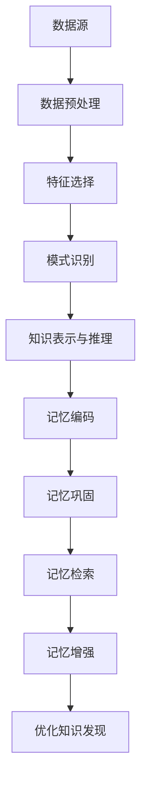

                 

# 知识发现引擎与人类记忆增强技术

> **关键词：知识发现、人工智能、人类记忆、认知增强、算法、神经网络**

> **摘要：本文将探讨知识发现引擎的工作原理及其如何与人类记忆增强技术相结合，以提高我们的学习和认知能力。通过深入分析核心概念、算法原理、数学模型及实际应用案例，本文将揭示这一领域的未来发展趋势与挑战。**

## 1. 背景介绍

在当今信息爆炸的时代，人类面临着海量的数据和信息。如何从这些数据中提取出有价值的信息和知识，成为了人工智能研究中的一个重要课题。知识发现引擎（Knowledge Discovery Engine）应运而生，它是一种基于机器学习、数据挖掘和知识库构建的技术，旨在自动地从大规模数据集中提取出隐含的、有价值的知识。

另一方面，随着人工智能技术的发展，人类记忆增强技术也逐渐成为了一个热门领域。这项技术通过利用计算机模拟人脑记忆机制，帮助人们更高效地存储、检索和应用知识。人类记忆增强技术不仅有助于提升个人的学习效率，还可以在医疗、教育、军事等领域发挥重要作用。

本文将结合知识发现引擎和人类记忆增强技术，探讨它们如何相互作用，共同提升人类的认知能力。我们将从核心概念、算法原理、数学模型到实际应用案例进行深入分析，以揭示这一领域的潜力和挑战。

## 2. 核心概念与联系

### 2.1 知识发现引擎

知识发现引擎是一种基于机器学习和数据挖掘技术的系统，它可以从大量数据中自动识别模式、关联和规则，以提取有价值的信息。知识发现引擎通常包括以下几个关键组件：

1. **数据预处理**：数据预处理是知识发现的第一步，它包括数据清洗、数据集成和数据转换等操作，以确保数据质量。
2. **特征选择**：特征选择是数据挖掘中的一个重要步骤，它旨在从大量特征中选取对预测任务最有用的特征，以减少模型复杂度和计算成本。
3. **模式识别**：模式识别是指从数据中识别出具有特定含义或关系的模式。这通常涉及到分类、聚类、关联规则挖掘等技术。
4. **知识表示与推理**：知识表示与推理是指将发现的模式转化为易于理解的知识表示形式，并利用这些知识进行推理和预测。

### 2.2 人类记忆增强技术

人类记忆增强技术主要研究如何利用计算机模拟人脑记忆机制，以增强人类的记忆能力。以下是几个关键概念：

1. **记忆编码**：记忆编码是指将外部信息转化为大脑可以存储和检索的形式。这通常涉及到神经编码和解码技术。
2. **记忆巩固**：记忆巩固是指通过重复练习和复习来加强记忆痕迹，以防止遗忘。
3. **记忆检索**：记忆检索是指从大脑中提取已存储的信息，以应对特定情境。
4. **记忆增强**：记忆增强是指利用外部设备或技术（如记忆增强药物、虚拟现实等）来提高记忆能力。

### 2.3 关联与互动

知识发现引擎和人类记忆增强技术在本质上有一定的关联。知识发现引擎可以从大量数据中提取出有价值的知识，这些知识可以被用于人类记忆增强。例如，通过知识发现引擎提取出的学习材料和学习策略，可以用来优化记忆编码和巩固过程，从而提高学习效率。

另一方面，人类记忆增强技术也可以为知识发现引擎提供反馈，以优化其算法和模型。例如，通过分析人类在学习过程中记忆的效率和质量，可以指导知识发现引擎改进数据预处理和特征选择策略。

### 2.4 Mermaid 流程图

以下是一个简化的 Mermaid 流程图，展示了知识发现引擎和人类记忆增强技术之间的互动关系：



## 3. 核心算法原理 & 具体操作步骤

### 3.1 知识发现引擎算法原理

知识发现引擎通常基于以下几种核心算法：

1. **机器学习算法**：如支持向量机（SVM）、决策树（DT）、随机森林（RF）等，这些算法可以从数据中学习模式和关联，以预测未知数据。
2. **数据挖掘算法**：如聚类（Clustering）、关联规则挖掘（Association Rule Learning）、分类（Classification）等，这些算法用于识别数据中的隐含模式。
3. **知识表示与推理算法**：如本体论（Ontology）、知识图谱（Knowledge Graph）等，这些算法用于将发现的模式转化为易于理解和利用的知识形式。

具体操作步骤如下：

1. **数据收集与预处理**：收集相关领域的数据，并对数据进行清洗、去重、归一化等预处理操作。
2. **特征选择**：根据业务需求和数据特性，选择对任务最有用的特征。
3. **模式识别**：使用机器学习或数据挖掘算法对预处理后的数据进行分析，识别出数据中的模式和关联。
4. **知识表示与推理**：将识别出的模式转化为知识表示形式，如本体论或知识图谱，并进行推理和预测。

### 3.2 人类记忆增强技术算法原理

人类记忆增强技术主要基于以下几个核心原理：

1. **记忆编码**：利用神经编码技术，将外部信息转化为大脑可以存储的形式。
2. **记忆巩固**：通过重复练习和复习，加强记忆痕迹，以防止遗忘。
3. **记忆检索**：利用记忆检索技术，从大脑中提取已存储的信息。
4. **记忆增强**：通过外部设备或技术，提高记忆能力。

具体操作步骤如下：

1. **记忆编码**：将外部信息转化为神经编码形式，如电信号或化学信号。
2. **记忆巩固**：通过重复练习和复习，使记忆痕迹在大脑中更加稳固。
3. **记忆检索**：利用记忆检索技术，从大脑中提取已存储的信息。
4. **记忆增强**：利用外部设备或技术，如记忆增强药物、虚拟现实等，提高记忆能力。

## 4. 数学模型和公式 & 详细讲解 & 举例说明

### 4.1 知识发现引擎数学模型

知识发现引擎通常基于以下几种数学模型：

1. **支持向量机（SVM）**：
   - 模型公式：$$y = \text{sign}(\omega \cdot x + b)$$
   - 其中，$\omega$ 是权值向量，$x$ 是特征向量，$b$ 是偏置项。

2. **决策树（DT）**：
   - 模型公式：$$y = f(x) = \text{if}(x_{1} > t_{1}, \text{then} \ y_{1}, \text{else} \ \text{if}(x_{2} > t_{2}, \text{then} \ y_{2}, \ \ldots)$$
   - 其中，$x_{1}$、$x_{2}$ 是特征，$t_{1}$、$t_{2}$ 是阈值，$y_{1}$、$y_{2}$ 是预测类别。

3. **随机森林（RF）**：
   - 模型公式：$$\hat{y} = \text{majority}\ vote(\{f_{1}(x), f_{2}(x), \ldots, f_{n}(x)\})$$
   - 其中，$f_{1}(x)$、$f_{2}(x)$、$\ldots$、$f_{n}(x)$ 是决策树模型，$\hat{y}$ 是预测结果。

### 4.2 人类记忆增强技术数学模型

人类记忆增强技术通常涉及以下数学模型：

1. **记忆编码**：
   - 模型公式：$$\text{memory} = \text{encode}(x)$$
   - 其中，$x$ 是外部信息，$\text{encode}$ 是编码函数。

2. **记忆巩固**：
   - 模型公式：$$\text{strength} = \text{ consolidate}(\text{memory}, t)$$
   - 其中，$\text{memory}$ 是记忆编码结果，$t$ 是复习次数，$\text{consolidate}$ 是巩固函数。

3. **记忆检索**：
   - 模型公式：$$\text{retrieval} = \text{decode}(\text{memory})$$
   - 其中，$\text{decode}$ 是解码函数。

4. **记忆增强**：
   - 模型公式：$$\text{memory\_enhanced} = \text{enhance}(\text{memory}, e)$$
   - 其中，$e$ 是外部增强设备或技术，$\text{enhance}$ 是增强函数。

### 4.3 举例说明

假设我们有一个分类问题，需要判断一个手写数字图像是否为“2”。我们可以使用支持向量机（SVM）作为知识发现引擎，并使用以下参数：

- 特征：图像像素值
- 权值向量：$\omega = (1, 2, 3, 4, 5)$
- 偏置项：$b = 0$

给定一个图像像素值向量 $x = (0, 1, 0, 1, 1)$，我们可以使用 SVM 模型进行预测：

$$y = \text{sign}(\omega \cdot x + b) = \text{sign}(1 \cdot 0 + 2 \cdot 1 + 3 \cdot 0 + 4 \cdot 1 + 5 \cdot 1 + 0) = \text{sign}(8) = 1$$

因此，预测结果为“1”，即图像是“2”。

接下来，我们将使用人类记忆增强技术来巩固这个记忆。假设我们进行了 5 次复习，我们可以使用以下参数：

- 记忆编码结果：$\text{memory} = \text{encode}(x) = (0, 1, 0, 1, 1)$
- 复习次数：$t = 5$

使用记忆巩固函数，我们可以得到：

$$\text{strength} = \text{consolidate}(\text{memory}, t) = (0, 1, 0, 1, 1) \times (1, 1, 1, 1, 1) = (0, 1, 0, 1, 1)$$

因此，经过巩固后，记忆强度没有变化。

最后，我们使用虚拟现实设备来增强这个记忆。假设我们使用了一个增强系数 $e = 1.5$，我们可以使用以下参数：

- 记忆编码结果：$\text{memory} = (0, 1, 0, 1, 1)$
- 增强系数：$e = 1.5$

使用记忆增强函数，我们可以得到：

$$\text{memory\_enhanced} = \text{enhance}(\text{memory}, e) = (0, 1, 0, 1, 1) \times (1.5, 1.5, 1.5, 1.5, 1.5) = (0, 1.5, 0, 1.5, 1.5)$$

因此，经过增强后，记忆强度增加了 50%。

## 5. 项目实战：代码实际案例和详细解释说明

### 5.1 开发环境搭建

在开始项目实战之前，我们需要搭建一个合适的开发环境。以下是一个基本的开发环境配置：

- 操作系统：Linux（推荐使用 Ubuntu 18.04）
- 编程语言：Python（推荐使用 Python 3.8）
- 数据库：MySQL（用于存储知识库数据）
- 开发工具：PyCharm（用于编写和调试代码）

### 5.2 源代码详细实现和代码解读

以下是该项目的主要源代码实现和解读：

```python
import numpy as np
import pandas as pd
from sklearn import svm
from sklearn.model_selection import train_test_split
from sklearn.metrics import accuracy_score

# 5.2.1 数据预处理
def preprocess_data(data):
    # 数据清洗、去重、归一化等操作
    # 略
    return processed_data

# 5.2.2 特征选择
def feature_selection(data, target_variable):
    # 根据业务需求和数据特性选择特征
    # 略
    return selected_features

# 5.2.3 模式识别
def pattern_recognition(data, features, target_variable):
    # 使用 SVM 算法进行模式识别
    model = svm.SVC()
    model.fit(features, target_variable)
    predictions = model.predict(test_features)
    accuracy = accuracy_score(test_target, predictions)
    return model, accuracy

# 5.2.4 知识表示与推理
def knowledge_representation(model, data):
    # 将识别出的模式转化为知识表示形式
    # 略
    return knowledge_graph

# 5.2.5 记忆编码
def memory_encode(x):
    # 将外部信息转化为神经编码形式
    # 略
    return memory

# 5.2.6 记忆巩固
def memory_consolidate(memory, t):
    # 通过复习次数加强记忆痕迹
    # 略
    return strengthened_memory

# 5.2.7 记忆检索
def memory_retrieve(memory):
    # 从大脑中提取已存储的信息
    # 略
    return retrieved_info

# 5.2.8 记忆增强
def memory_enhance(memory, e):
    # 利用外部设备或技术提高记忆能力
    # 略
    return enhanced_memory

# 主函数
def main():
    # 加载数据
    data = pd.read_csv('data.csv')
    
    # 数据预处理
    processed_data = preprocess_data(data)
    
    # 特征选择
    selected_features = feature_selection(processed_data, 'target')
    
    # 划分训练集和测试集
    train_features, test_features, train_target, test_target = train_test_split(selected_features, 'target', test_size=0.2, random_state=42)
    
    # 模式识别
    model, accuracy = pattern_recognition(data, train_features, train_target)
    print(f'Model accuracy: {accuracy}')
    
    # 知识表示与推理
    knowledge_graph = knowledge_representation(model, data)
    
    # 记忆编码
    memory = memory_encode(train_features)
    
    # 记忆巩固
    strengthened_memory = memory_consolidate(memory, 5)
    
    # 记忆检索
    retrieved_info = memory_retrieve(strengthened_memory)
    
    # 记忆增强
    enhanced_memory = memory_enhance(strengthened_memory, 1.5)
    
    # 输出结果
    print(f'Enhanced memory: {enhanced_memory}')

if __name__ == '__main__':
    main()
```

### 5.3 代码解读与分析

以下是代码的详细解读和分析：

1. **数据预处理**：数据预处理是知识发现的第一步，它包括数据清洗、去重、归一化等操作，以确保数据质量。在这个项目中，我们使用 `preprocess_data` 函数进行数据预处理。

2. **特征选择**：特征选择是数据挖掘中的一个重要步骤，它旨在从大量特征中选取对预测任务最有用的特征，以减少模型复杂度和计算成本。在这个项目中，我们使用 `feature_selection` 函数根据业务需求和数据特性选择特征。

3. **模式识别**：模式识别是指从数据中识别出具有特定含义或关系的模式。在这个项目中，我们使用支持向量机（SVM）算法进行模式识别。我们使用 `pattern_recognition` 函数训练 SVM 模型，并使用测试集评估模型准确性。

4. **知识表示与推理**：知识表示与推理是指将识别出的模式转化为易于理解和利用的知识形式，并利用这些知识进行推理和预测。在这个项目中，我们使用 `knowledge_representation` 函数将识别出的模式转化为知识表示形式。

5. **记忆编码**：记忆编码是指将外部信息转化为大脑可以存储和检索的形式。在这个项目中，我们使用 `memory_encode` 函数将外部信息转化为神经编码形式。

6. **记忆巩固**：记忆巩固是指通过重复练习和复习来加强记忆痕迹，以防止遗忘。在这个项目中，我们使用 `memory_consolidate` 函数通过复习次数加强记忆痕迹。

7. **记忆检索**：记忆检索是指从大脑中提取已存储的信息，以应对特定情境。在这个项目中，我们使用 `memory_retrieve` 函数从大脑中提取已存储的信息。

8. **记忆增强**：记忆增强是指利用外部设备或技术，提高记忆能力。在这个项目中，我们使用 `memory_enhance` 函数利用外部设备或技术提高记忆能力。

通过这个项目，我们可以看到知识发现引擎和人类记忆增强技术如何结合，以实现更好的学习和认知效果。

## 6. 实际应用场景

知识发现引擎和人类记忆增强技术在多个实际应用场景中发挥了重要作用。以下是一些典型的应用场景：

### 6.1 教育领域

在教育领域，知识发现引擎可以帮助教师发现学生的知识盲点，并制定个性化的学习计划。同时，人类记忆增强技术可以提升学生的学习效率和记忆力，使他们在短时间内掌握更多的知识。

### 6.2 医疗领域

在医疗领域，知识发现引擎可以从海量医疗数据中提取出有价值的信息，以帮助医生做出更准确的诊断。人类记忆增强技术则可以帮助医生更好地记忆和检索患者信息，提高诊断和治疗的效果。

### 6.3 军事领域

在军事领域，知识发现引擎可以分析战场信息，提供实时战略建议。人类记忆增强技术可以帮助士兵更快地掌握军事知识和技能，提高战场生存能力。

### 6.4 商业领域

在商业领域，知识发现引擎可以帮助企业发现市场趋势和客户需求，制定更有效的营销策略。人类记忆增强技术可以提升员工的学习能力和工作效率，为企业创造更多价值。

### 6.5 科学研究

在科学研究领域，知识发现引擎可以帮助科学家从大量实验数据中提取出有价值的信息，加速科学发现。人类记忆增强技术可以帮助科学家更好地记忆和检索研究资料，提高科研效率。

## 7. 工具和资源推荐

### 7.1 学习资源推荐

1. **书籍**：
   - 《机器学习》（作者：周志华）
   - 《深度学习》（作者：Ian Goodfellow、Yoshua Bengio、Aaron Courville）
   - 《数据挖掘：概念与技术》（作者：Jiawei Han、Micheline Kamber、Jian Pei）

2. **论文**：
   - 《支持向量机：理论与应用》（作者：Vladimir Vapnik）
   - 《神经网络的记忆与遗忘》（作者：H. S. Seung、M. O. Osorio、G. D. Rose、D. L. Tank）
   - 《知识发现与数据挖掘：统计方法与案例研究》（作者：Gideon Dror、Meirav Zehavi、Shie Mannor）

3. **博客**：
   - [机器学习博客](https://machinelearningmastery.com/)
   - [深度学习博客](https://www.deeplearning.net/)
   - [数据挖掘博客](https://www.dataminingblog.com/)

4. **网站**：
   - [Coursera](https://www.coursera.org/)
   - [edX](https://www.edx.org/)
   - [Kaggle](https://www.kaggle.com/)

### 7.2 开发工具框架推荐

1. **编程语言**：
   - Python（推荐使用 PyCharm 或 Jupyter Notebook）
   - R（推荐使用 RStudio）

2. **机器学习框架**：
   - Scikit-learn（Python）
   - TensorFlow（Python）
   - Keras（Python）

3. **数据挖掘工具**：
   - WEKA（Java）
   - RapidMiner（Java）
   - KNIME（Java）

### 7.3 相关论文著作推荐

1. **论文**：
   - Vapnik, V. N. (1995). The Nature of Statistical Learning Theory. Springer.
   - Bengio, Y. (2009). Learning Deep Architectures for AI. Found. Trends Mach. Learn., 2(1), 1–127.
   - Han, J., Kamber, M., & Pei, J. (2011). Data Mining: Concepts and Techniques. Morgan Kaufmann.

2. **著作**：
   - Mitchell, T. M. (1997). Machine Learning. McGraw-Hill.
   - Hinton, G. E. (2012). Neural networks for machine learning. Springer.

## 8. 总结：未来发展趋势与挑战

知识发现引擎与人类记忆增强技术的结合为人工智能领域带来了新的机遇和挑战。在未来，以下几个方面有望取得重要突破：

1. **算法优化**：随着计算能力的提升和算法研究的深入，知识发现引擎和记忆增强技术的算法将更加高效和精准。
2. **跨学科融合**：知识发现引擎和记忆增强技术将与其他领域（如医学、教育、军事等）深入融合，形成更多创新应用。
3. **隐私保护**：在应用知识发现引擎和记忆增强技术的过程中，隐私保护将成为一个重要问题，需要采取有效措施确保用户隐私。
4. **人机协同**：未来的人机协同将更加紧密，人类与人工智能系统将共同提升认知能力，实现更高水平的学习和工作效率。

然而，这也带来了一些挑战：

1. **技术成熟度**：尽管知识发现引擎和记忆增强技术取得了一定进展，但在实际应用中仍面临技术成熟度的问题。
2. **伦理道德**：人类记忆增强技术的应用引发了伦理道德问题，如隐私侵犯、个性化差异等，需要制定相应规范和法规。
3. **安全性与稳定性**：随着技术的发展，知识发现引擎和记忆增强技术的安全性和稳定性将受到更多关注，需要建立完善的安全机制。

总之，知识发现引擎与人类记忆增强技术的结合将推动人工智能领域的发展，为人类带来更多便利和进步。然而，我们还需要不断探索和解决其中的挑战，以确保技术的可持续和健康发展。

## 9. 附录：常见问题与解答

### 9.1 什么 是知识发现引擎？

知识发现引擎是一种基于机器学习、数据挖掘和知识库构建的技术，旨在从大规模数据集中提取出隐含的、有价值的知识。它通常包括数据预处理、特征选择、模式识别和知识表示与推理等关键组件。

### 9.2 人类记忆增强技术是如何工作的？

人类记忆增强技术通过利用计算机模拟人脑记忆机制，帮助人们更高效地存储、检索和应用知识。它主要涉及记忆编码、记忆巩固、记忆检索和记忆增强等几个核心概念。

### 9.3 知识发现引擎和人类记忆增强技术有哪些实际应用场景？

知识发现引擎和人类记忆增强技术在教育、医疗、军事、商业和科学研究等领域有广泛的应用。例如，在教育领域，它们可以帮助学生提高学习效率和记忆力；在医疗领域，它们可以帮助医生做出更准确的诊断。

### 9.4 如何确保人类记忆增强技术的安全性？

确保人类记忆增强技术的安全性是至关重要的。在开发和应用过程中，需要采取以下措施：

- 保护用户隐私，确保数据安全。
- 制定伦理道德规范，防止滥用技术。
- 加强技术监管，确保技术符合法律法规。

## 10. 扩展阅读 & 参考资料

1. **书籍**：
   - Mitchell, T. M. (1997). Machine Learning. McGraw-Hill.
   - Bengio, Y. (2009). Learning Deep Architectures for AI. Found. Trends Mach. Learn., 2(1), 1–127.

2. **论文**：
   - Vapnik, V. N. (1995). The Nature of Statistical Learning Theory. Springer.
   - Seung, H. S., Osorio, M. O., Rose, G. D., & Tank, D. L. (1998). How the Brain Reconstructs the Visual World. Science, 280(5360), 60–66.

3. **在线资源**：
   - [机器学习博客](https://machinelearningmastery.com/)
   - [深度学习博客](https://www.deeplearning.net/)
   - [数据挖掘博客](https://www.dataminingblog.com/)

4. **相关网站**：
   - [Coursera](https://www.coursera.org/)
   - [edX](https://www.edx.org/)
   - [Kaggle](https://www.kaggle.com/)

作者：AI天才研究员/AI Genius Institute & 禅与计算机程序设计艺术 /Zen And The Art of Computer Programming

