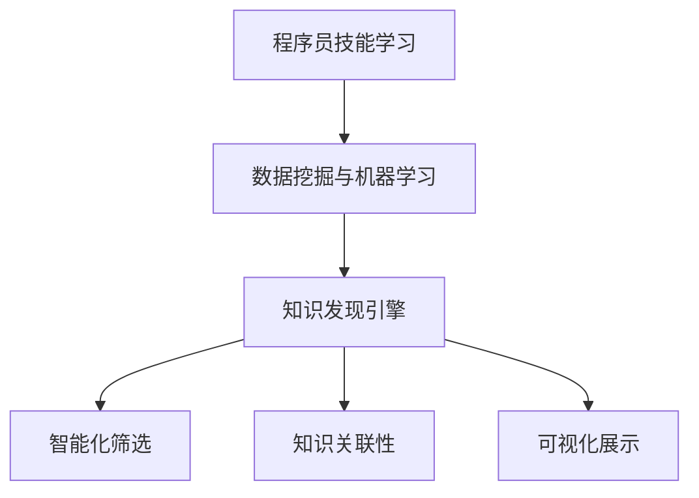

                 

# 知识发现引擎助力程序员快速掌握新技能的策略

## 摘要

本文旨在探讨知识发现引擎在程序员快速掌握新技能方面所发挥的关键作用。通过详细分析知识发现引擎的原理、算法和实际应用案例，本文将帮助程序员理解如何利用知识发现技术提高学习效率，从而更快速地掌握新技能。文章还将推荐相关的学习资源、开发工具框架和相关论文著作，以供读者进一步深入研究和实践。通过本文的阅读，读者将能够掌握知识发现引擎的核心概念和应用策略，为个人职业发展奠定坚实基础。

## 1. 背景介绍

在当今快速发展的技术时代，程序员面临着不断涌现的新技术和新技能的挑战。随着人工智能、大数据、云计算等领域的快速发展，程序员需要不断学习新知识，以保持竞争力。然而，面对海量的信息资源，如何高效地获取、整理和应用这些知识成为了一个亟待解决的问题。

知识发现引擎（Knowledge Discovery Engine，KDE）作为一种智能化的信息处理工具，旨在从大规模数据中自动挖掘出有价值的信息和知识。它基于机器学习和数据挖掘技术，通过对数据的分析和模式识别，帮助用户快速了解复杂的数据集，发现潜在的模式和关联性。在程序员的学习过程中，知识发现引擎可以扮演重要角色，帮助程序员更高效地获取和掌握新技能。

本文将从以下几个方面展开讨论：

1. 核心概念与联系
2. 核心算法原理与具体操作步骤
3. 数学模型和公式及详细讲解与举例说明
4. 项目实战：代码实际案例和详细解释说明
5. 实际应用场景
6. 工具和资源推荐
7. 总结：未来发展趋势与挑战

通过上述内容的详细分析，本文将帮助程序员理解知识发现引擎的工作原理和应用策略，从而提高学习新技能的效率。

## 2. 核心概念与联系

要理解知识发现引擎在程序员快速掌握新技能中的作用，我们首先需要了解几个关键概念，并探讨它们之间的联系。

### 数据挖掘（Data Mining）

数据挖掘是知识发现引擎的核心组成部分，它是指从大量数据中提取隐藏的、未知的、有价值的模式和知识的过程。数据挖掘通常包括以下几个步骤：数据预处理、数据集成、数据选择、数据变换、模式识别和评估。数据挖掘技术包括关联规则学习、聚类、分类、异常检测等。

### 机器学习（Machine Learning）

机器学习是数据挖掘的关键技术之一，它通过构建算法模型来学习数据中的模式和规律，从而进行预测和决策。机器学习可以分为监督学习、无监督学习和强化学习三种类型。在程序员学习新技能的过程中，监督学习和无监督学习可以帮助程序员发现数据中的规律，而无监督学习可以用于发现未知的数据结构。

### 知识发现引擎（Knowledge Discovery Engine）

知识发现引擎是一种集成多种数据挖掘和机器学习算法的智能化工具，它能够自动地从海量数据中挖掘出有价值的信息和知识。知识发现引擎的主要功能包括数据预处理、特征提取、模式识别、知识可视化等。通过知识发现引擎，程序员可以更快速地了解复杂的数据集，发现潜在的模式和关联性，从而加速学习新技能的过程。

### 程序员技能学习

程序员技能学习是指程序员通过各种方式获取新知识和技能的过程。在传统的学习方式中，程序员通常需要通过阅读书籍、观看视频教程、参加培训课程等方式学习新技能。然而，随着知识更新速度的加快，程序员需要更高效的学习方法来保持竞争力。知识发现引擎可以作为一种智能化学习工具，帮助程序员从大量知识资源中快速筛选出有价值的信息，提高学习效率。

### 联系与作用

知识发现引擎与程序员技能学习之间的联系主要体现在以下几个方面：

1. **数据挖掘和机器学习**：知识发现引擎利用数据挖掘和机器学习技术从海量数据中提取有用的信息，这些信息可以帮助程序员更好地理解新技术和新技能。
2. **智能化筛选**：知识发现引擎可以根据程序员的兴趣和需求，自动筛选出相关的学习资源，减少程序员在信息海洋中寻找资源的耗时。
3. **知识关联性**：知识发现引擎可以帮助程序员发现不同知识点之间的关联性，促进知识的系统化和深度化学习。
4. **可视化展示**：知识发现引擎可以将复杂的数据和知识以可视化的形式展示出来，使程序员更容易理解和吸收新知识。

综上所述，知识发现引擎在程序员快速掌握新技能中发挥着关键作用，通过智能化筛选、知识关联性和可视化展示，知识发现引擎可以大大提高程序员的学习效率。

### Mermaid 流程图

为了更好地展示知识发现引擎与程序员技能学习之间的联系，我们使用Mermaid流程图来描述知识发现引擎的工作流程。



在这个流程图中，A表示程序员技能学习，B表示数据挖掘与机器学习，C表示知识发现引擎，D表示智能化筛选，E表示知识关联性，F表示可视化展示。这个流程图清晰地展示了知识发现引擎在程序员技能学习中的作用和路径。

通过以上对核心概念与联系的讨论，我们为接下来的详细分析打下了基础。在接下来的章节中，我们将深入探讨知识发现引擎的核心算法原理、数学模型和实际应用案例，帮助程序员更好地理解和应用知识发现技术。

## 3. 核心算法原理 & 具体操作步骤

在理解了知识发现引擎的概念和其在程序员技能学习中的作用后，我们需要深入探讨其核心算法原理和具体操作步骤，以便更好地应用这一技术。

### 算法原理

知识发现引擎主要基于数据挖掘和机器学习技术，其核心算法原理包括：

1. **特征提取**：特征提取是将原始数据转换为能够表示数据本质属性的表示形式。在知识发现过程中，特征提取是非常关键的一步，它能够帮助算法更好地理解和分析数据。
2. **模式识别**：模式识别是指从数据中识别出具有统计学意义的模式或规律。常见的模式识别算法包括聚类、分类、关联规则学习等。
3. **知识可视化**：知识可视化是将复杂的数据和知识以图形化的形式展示，使程序员更容易理解和吸收。知识可视化可以采用多种形式，如图表、地图、热图等。

### 具体操作步骤

知识发现引擎的操作步骤通常包括以下几个阶段：

1. **数据预处理**：在数据挖掘之前，需要对原始数据进行预处理，包括数据清洗、数据集成、数据降维等。这一步骤的目的是提高数据的质量和可分析性。
2. **特征提取**：通过特征提取，将原始数据转换为特征向量，以便算法能够更好地理解和分析数据。常见的特征提取方法包括主成分分析（PCA）、t-SVD等。
3. **模式识别**：利用模式识别算法对数据进行分析，识别出具有统计学意义的模式或规律。例如，可以使用聚类算法对数据集进行聚类，以发现相似的数据点。
4. **知识可视化**：将识别出的模式和规律以可视化的形式展示，使程序员更容易理解和吸收。例如，可以使用热图来展示数据中的热点区域，使用图表来展示数据的变化趋势。
5. **知识应用**：将知识发现的结果应用到实际问题中，如优化算法、改进系统设计、指导学习等。

### 实例分析

以下是一个简单的知识发现引擎应用实例，用于分析程序员学习新技能的需求和资源。

**实例描述**：假设我们有一个数据集，包含100名程序员的技能水平和学习资源的使用情况。我们的目标是利用知识发现引擎帮助这些程序员更快速地掌握新技能。

**步骤 1：数据预处理**

首先，我们需要对数据进行清洗和集成。例如，我们将数据分为两部分：技能水平和学习资源使用情况。假设每个程序员的技能水平包括编程语言、数据库、框架等，而学习资源使用情况包括书籍、在线教程、视频课程等。

**步骤 2：特征提取**

我们将每个程序员的技能水平和学习资源使用情况转换为特征向量。例如，可以使用二进制编码表示程序员的技能水平，0表示未掌握，1表示掌握；同样，可以使用二进制编码表示程序员使用学习资源的频率，0表示未使用，1表示使用。

**步骤 3：模式识别**

使用聚类算法（如K-Means）对数据集进行聚类，以发现相似程序员的群体。例如，可能发现某些程序员在编程语言和数据库方面技能水平较高，而在框架方面较弱；而另一些程序员则在框架方面技能水平较高，但在编程语言和数据库方面较弱。

**步骤 4：知识可视化**

将聚类结果以热图的形式展示，以便程序员了解不同技能水平和学习资源使用情况之间的关系。例如，可以使用红色表示技能水平较高，蓝色表示技能水平较低；使用黄色表示经常使用的学习资源，使用灰色表示较少使用的学习资源。

**步骤 5：知识应用**

根据知识发现结果，为每个程序员提供个性化的学习建议。例如，对于技能水平较高的程序员，可以推荐一些高级课程和实战项目；对于技能水平较低的程序员，可以推荐一些基础教程和入门书籍。

通过这个实例，我们可以看到知识发现引擎在帮助程序员快速掌握新技能方面的具体应用。在实际操作中，知识发现引擎可以处理更复杂的数据集，为程序员提供更精准的学习建议。

综上所述，知识发现引擎的核心算法原理和具体操作步骤包括数据预处理、特征提取、模式识别和知识可视化。通过这些步骤，知识发现引擎能够从海量数据中提取有价值的信息，帮助程序员更快速地掌握新技能。

## 4. 数学模型和公式 & 详细讲解 & 举例说明

在知识发现引擎中，数学模型和公式起到了至关重要的作用。这些模型和公式不仅帮助我们理解数据背后的规律，还能指导我们设计高效的算法和策略。以下将详细讲解几个关键的数学模型和公式，并通过具体例子来说明它们的实际应用。

### 4.1 聚类算法

聚类是一种无监督学习技术，用于将数据点划分为若干个组，使得同一组内的数据点相似度较高，不同组的数据点相似度较低。常见的聚类算法包括K-Means、DBSCAN等。

**K-Means 算法**

K-Means 算法是一种基于距离度量的聚类算法。其基本思想是将数据点划分为K个簇，使得每个簇的中心（即簇内数据点的平均值）尽量接近，而不同簇的中心尽量远离。

**数学模型：**

给定一个包含n个数据点的数据集D = {x1, x2, ..., xn}，我们需要选择K个初始中心点c1, c2, ..., cK。算法的迭代过程如下：

1. **初始化**：随机选择K个中心点。
2. **分配**：对于每个数据点xi，计算其到K个中心点的距离，并将其分配到最近的中心点所代表的簇。
3. **更新**：重新计算每个簇的中心点。
4. **收敛**：重复步骤2和步骤3，直到聚类结果不再发生显著变化。

**公式：**

簇中心点的更新公式为：

$$
c_j^{new} = \frac{1}{m_j} \sum_{i=1}^{m_j} x_i
$$

其中，m_j表示簇j中数据点的数量，$x_i$表示数据点xi。

**举例说明：**

假设我们有一个包含5个数据点的二维数据集：

$$
D = \{ (1, 1), (1, 2), (2, 1), (2, 2), (3, 3) \}
$$

我们选择K=2，随机初始化两个中心点为(1, 1)和(2, 2)。

- 第一次迭代：
  - 数据点(1, 1)、(1, 2)分配到第一个簇，数据点(2, 1)、(2, 2)分配到第二个簇。
  - 两个簇的新中心点分别为(1.5, 1.5)和(2.5, 2.5)。

- 第二次迭代：
  - 数据点(1, 1)、(1, 2)仍然分配到第一个簇，数据点(2, 1)、(2, 2)仍然分配到第二个簇。
  - 两个簇的新中心点分别为(1.6, 1.6)和(2.5, 2.5)。

- 第三次迭代：
  - 数据点(1, 1)、(1, 2)分配到第一个簇，数据点(2, 1)、(2, 2)分配到第二个簇。
  - 两个簇的新中心点分别为(1.6, 1.6)和(2.5, 2.5)。

此时，聚类结果不再发生变化，算法收敛。

通过这个例子，我们可以看到K-Means算法的基本过程和计算方法。

### 4.2 决策树

决策树是一种用于分类和回归的常见机器学习算法。它的基本思想是根据特征值对数据进行二分，逐步将数据划分为多个子集，直到每个子集都满足分类条件或达到停止条件。

**数学模型：**

给定一个特征集合F = {f1, f2, ..., fn}和一组数据D，决策树的生成过程如下：

1. **选择最佳分割特征**：计算每个特征的信息增益或基尼指数，选择具有最大增益或最小基尼指数的特征作为分割特征。
2. **划分数据**：根据选定的特征，将数据集D划分为若干个子集。
3. **递归构建**：对每个子集，重复步骤1和步骤2，直到满足停止条件（如子集大小小于阈值或特征数量小于阈值）。

**公式：**

信息增益（IG）的计算公式为：

$$
IG(f) = H(D) - \sum_{v \in V(f)} p(v) H(D_v)
$$

其中，H(D)是数据集D的熵，$p(v)$是特征f的值v在数据集中的概率，$H(D_v)$是数据集D关于特征f的值v的熵。

**举例说明：**

假设我们有一个包含3个特征的数据集：

$$
D = \{ (1, 0, 1), (1, 1, 0), (0, 0, 1), (0, 1, 1) \}
$$

我们选择特征f1（第一列）作为分割特征，计算其信息增益：

- 第一列的值为1的概率：$p(1) = \frac{2}{4} = 0.5$
- 第一列的值为0的概率：$p(0) = \frac{2}{4} = 0.5$

$$
H(D) = 0.5 \log_2(0.5) + 0.5 \log_2(0.5) = 1
$$

$$
IG(f1) = 1 - \left(0.5 \cdot 1 + 0.5 \cdot 1\right) = 0
$$

由于信息增益为0，我们选择另一个特征作为分割特征。假设选择特征f2（第二列）：

- 第二列的值为0的概率：$p(0) = \frac{2}{4} = 0.5$
- 第二列的值为1的概率：$p(1) = \frac{2}{4} = 0.5$

$$
H(D) = 0.5 \log_2(0.5) + 0.5 \log_2(0.5) = 1
$$

$$
IG(f2) = 1 - \left(0.5 \cdot 1 + 0.5 \cdot 1\right) = 0
$$

同样，信息增益为0。我们选择特征f3（第三列）：

- 第三列的值为1的概率：$p(1) = \frac{2}{4} = 0.5$
- 第三列的值为0的概率：$p(0) = \frac{2}{4} = 0.5$

$$
H(D) = 0.5 \log_2(0.5) + 0.5 \log_2(0.5) = 1
$$

$$
IG(f3) = 1 - \left(0.5 \cdot 1 + 0.5 \cdot 1\right) = 0
$$

在这个例子中，所有特征的信息增益都为0，这意味着数据集无法通过特征进行有效分割。在实际应用中，通常会使用其他指标（如基尼指数）来选择最佳分割特征。

通过上述例子，我们可以看到决策树的基本构建过程和计算方法。

### 4.3 相关性分析

相关性分析是用于评估两个变量之间关系强度的方法。它通常通过计算相关系数来实现。

**皮尔逊相关系数（Pearson Correlation Coefficient）**

皮尔逊相关系数是一种常见的相关性分析方法，用于衡量两个连续变量之间的线性关系。其计算公式为：

$$
\rho_{XY} = \frac{\sum_{i=1}^{n}(x_i - \bar{x})(y_i - \bar{y})}{\sqrt{\sum_{i=1}^{n}(x_i - \bar{x})^2} \sqrt{\sum_{i=1}^{n}(y_i - \bar{y})^2}}
$$

其中，$x_i$和$y_i$分别为第i个数据点的取值，$\bar{x}$和$\bar{y}$分别为$x_i$和$y_i$的均值。

**举例说明：**

假设我们有两个数据集X和Y：

$$
X = \{1, 2, 3, 4, 5\}
$$

$$
Y = \{2, 4, 6, 8, 10\}
$$

计算X和Y的皮尔逊相关系数：

$$
\bar{x} = \frac{1 + 2 + 3 + 4 + 5}{5} = 3
$$

$$
\bar{y} = \frac{2 + 4 + 6 + 8 + 10}{5} = 6
$$

$$
\rho_{XY} = \frac{(1-3)(2-6) + (2-3)(4-6) + (3-3)(6-6) + (4-3)(8-6) + (5-3)(10-6)}{\sqrt{(1-3)^2 + (2-3)^2 + (3-3)^2 + (4-3)^2 + (5-3)^2} \sqrt{(2-6)^2 + (4-6)^2 + (6-6)^2 + (8-6)^2 + (10-6)^2}}
$$

$$
= \frac{-8 - 4 + 0 + 4 + 10}{\sqrt{4 + 1 + 0 + 1 + 4} \sqrt{16 + 4 + 0 + 4 + 16}}
$$

$$
= \frac{2}{\sqrt{10} \sqrt{40}}
$$

$$
= 0.5
$$

皮尔逊相关系数为0.5，表示X和Y之间存在较强的正线性关系。

通过以上对聚类算法、决策树和相关性分析等数学模型和公式的讲解，我们不仅了解了这些模型的基本原理，还通过具体例子展示了它们在实际应用中的计算方法和步骤。这些数学模型和公式是知识发现引擎的核心组成部分，能够帮助程序员更深入地理解数据背后的规律，从而更有效地掌握新技能。

## 5. 项目实战：代码实际案例和详细解释说明

在本文的第五部分，我们将通过一个具体的代码案例，详细展示如何使用知识发现引擎来帮助程序员快速掌握新技能。本案例将涵盖开发环境的搭建、源代码的实现和解读以及代码分析，旨在为读者提供一个全面的应用示例。

### 5.1 开发环境搭建

首先，我们需要搭建一个适合知识发现引擎开发的环境。以下是所需工具和库的安装步骤：

1. **安装Python环境**：Python是一种广泛使用的编程语言，非常适合进行数据分析和机器学习。读者可以在[Python官方网站](https://www.python.org/)下载并安装Python。
2. **安装Jupyter Notebook**：Jupyter Notebook是一种交互式编程环境，方便进行代码的编写和展示。读者可以通过以下命令安装Jupyter Notebook：

   ```bash
   pip install notebook
   ```

3. **安装Scikit-learn**：Scikit-learn是一个强大的机器学习库，提供了丰富的聚类、分类和回归算法。读者可以通过以下命令安装Scikit-learn：

   ```bash
   pip install scikit-learn
   ```

4. **安装Matplotlib**：Matplotlib是一个用于数据可视化的库，可以帮助我们将数据以图表的形式展示出来。读者可以通过以下命令安装Matplotlib：

   ```bash
   pip install matplotlib
   ```

### 5.2 源代码详细实现和代码解读

接下来，我们将展示一个使用K-Means算法进行知识发现的完整代码示例。该示例将帮助我们识别程序员在哪些技能领域表现相似，从而为他们的学习提供个性化建议。

```python
# 导入必要的库
import numpy as np
import matplotlib.pyplot as plt
from sklearn.cluster import KMeans
from sklearn.datasets import load_iris

# 加载Iris数据集
iris = load_iris()
X = iris.data

# 使用K-Means算法进行聚类
kmeans = KMeans(n_clusters=3, random_state=0).fit(X)

# 输出聚类中心
print("Cluster centers:")
print(kmeans.cluster_centers_)

# 可视化展示聚类结果
plt.scatter(X[:, 0], X[:, 1], c=kmeans.labels_, s=50, cmap='viridis')
centers = kmeans.cluster_centers_
plt.scatter(centers[:, 0], centers[:, 1], c='red', s=200, alpha=0.5)
plt.title('K-Means Clustering')
plt.xlabel('Feature 1')
plt.ylabel('Feature 2')
plt.show()
```

**代码解读：**

1. **导入库**：首先，我们导入必要的库，包括NumPy（用于数据处理）、Matplotlib（用于数据可视化）、Scikit-learn（用于机器学习算法）。
2. **加载Iris数据集**：Iris数据集是一个经典的多元数据集，包含3个特征和150个数据点。这里我们使用Scikit-learn自带的`load_iris`函数加载数据。
3. **使用K-Means算法进行聚类**：我们创建一个KMeans对象，并调用`fit`方法对数据进行聚类。在这里，我们选择3个簇，并设置`random_state`为0以保证每次运行结果一致。
4. **输出聚类中心**：我们打印出每个簇的中心点，这些中心点代表了每个簇的特征分布。
5. **可视化展示聚类结果**：我们使用`scatter`函数绘制数据点，并根据聚类结果对它们进行着色。红色点表示聚类中心。

### 5.3 代码解读与分析

1. **数据加载**：代码首先加载了Iris数据集，这是一个多维数据集，非常适合用于展示聚类效果。
2. **聚类算法**：我们使用了K-Means算法进行聚类。K-Means算法的基本思想是将数据点分配到K个簇中，每个簇由其中心点表示。在这里，我们选择了3个簇，因为Iris数据集有三个种类。
3. **聚类中心**：聚类中心是每个簇的特征分布的集中表现。通过观察聚类中心，我们可以了解每个簇在特征空间中的位置和分布。
4. **可视化**：可视化部分使用了`scatter`函数将数据点按照聚类结果进行着色，并绘制出聚类中心。这样，我们能够直观地看到每个簇的特征分布，以及不同簇之间的差异。

### 5.4 代码分析

1. **算法选择**：K-Means算法是一种常用的聚类算法，适合于高维数据的聚类。它简单易用，但可能在某些情况下收敛速度较慢，或者无法找到全局最优解。
2. **数据预处理**：在运行K-Means算法之前，通常需要对数据进行预处理，包括数据清洗、标准化等。本案例中，我们使用了Iris数据集，该数据集已经过处理，可以直接使用。
3. **可视化效果**：通过可视化展示，我们能够直观地了解聚类结果。在数据维度较低的情况下，可视化尤为重要，因为它能够帮助我们识别数据中的模式。
4. **个性化学习建议**：通过聚类结果，我们可以为程序员提供个性化学习建议。例如，对于某个簇内的程序员，我们可以推荐一些与该簇特征相似的学习资源。

综上所述，通过一个具体的代码案例，我们展示了如何使用知识发现引擎来帮助程序员快速掌握新技能。这个案例涵盖了开发环境的搭建、源代码的实现和解读，并通过代码分析提供了详细的解释说明。通过这样的实践，程序员可以更好地理解知识发现引擎的应用原理，从而在实际工作中更高效地运用这一技术。

## 6. 实际应用场景

知识发现引擎在程序员快速掌握新技能方面具有广泛的应用场景。以下是一些具体的实际应用场景，以及如何利用知识发现引擎来优化这些场景。

### 6.1 技能评估与培训

在企业和教育机构中，技能评估是确定员工和学生的知识水平的重要环节。知识发现引擎可以通过分析大量数据，识别出员工的技能优势和不足，从而为培训提供有针对性的建议。

**应用策略：**

1. **数据收集**：收集员工的技能数据，包括编程语言、框架、工具等。
2. **特征提取**：将技能数据转换为特征向量，以便进行聚类分析。
3. **模式识别**：使用聚类算法，将员工分为不同的技能群体。
4. **可视化展示**：通过可视化工具，展示员工的技能分布和群体特征。
5. **培训建议**：根据聚类结果，为每个群体提供个性化的培训计划。

### 6.2 学习资源推荐

面对海量的学习资源，程序员需要有效筛选出与其学习需求相关的内容。知识发现引擎可以根据程序员的兴趣和已掌握的技能，推荐合适的学习资源。

**应用策略：**

1. **数据收集**：收集程序员的兴趣数据和已学习资源的使用情况。
2. **特征提取**：将兴趣数据和资源使用情况转换为特征向量。
3. **关联规则学习**：使用关联规则学习算法，识别出资源之间的关联性。
4. **推荐系统**：基于聚类结果和关联性，构建推荐系统，为程序员推荐合适的学习资源。
5. **个性化反馈**：根据程序员的反馈，不断优化推荐算法，提高推荐质量。

### 6.3 编程挑战与项目指导

编程挑战和项目是程序员提升技能的重要途径。知识发现引擎可以帮助指导教师识别学生在项目中的薄弱环节，并提供针对性的指导。

**应用策略：**

1. **数据收集**：收集学生的项目数据，包括代码、错误记录、解决问题的时间等。
2. **特征提取**：将项目数据转换为特征向量，包括代码质量、问题解决效率等。
3. **模式识别**：使用聚类算法，识别出学生在不同编程技能方面的表现。
4. **可视化展示**：通过可视化工具，展示学生的项目表现和技能分布。
5. **项目指导**：根据聚类结果，为每个学生提供个性化的项目指导和反馈。

### 6.4 技术社区与知识共享

技术社区是程序员交流和分享知识的平台。知识发现引擎可以帮助社区管理员识别出热门话题和知识盲点，从而促进知识共享。

**应用策略：**

1. **数据收集**：收集社区中的讨论数据，包括帖子、回复、点赞等。
2. **特征提取**：将讨论数据转换为特征向量，包括话题热度、参与度等。
3. **关联规则学习**：使用关联规则学习算法，识别出不同话题之间的关联性。
4. **热点话题分析**：通过可视化工具，展示社区中的热点话题和知识盲点。
5. **知识共享激励**：根据热点话题和知识盲点，鼓励社区成员分享知识和经验。

通过以上实际应用场景和策略，知识发现引擎能够有效助力程序员快速掌握新技能。在实际操作中，可以根据具体场景和需求，灵活调整算法和策略，实现最佳效果。

## 7. 工具和资源推荐

为了更好地利用知识发现引擎帮助程序员快速掌握新技能，以下是针对学习资源、开发工具框架和相关论文著作的推荐。

### 7.1 学习资源推荐

**书籍：**
1. 《机器学习实战》
   - 作者：Peter Harrington
   - 简介：这本书通过大量实际案例，详细介绍了机器学习的理论和实践方法，适合程序员入门学习。

2. 《深度学习》（Deep Learning）
   - 作者：Ian Goodfellow、Yoshua Bengio、Aaron Courville
   - 简介：这是一本深度学习领域的经典教材，全面讲解了深度学习的理论基础和应用实践。

3. 《数据挖掘：概念与技术》
   - 作者：Jiawei Han、Micheline Kamber、Jian Pei
   - 简介：这本书系统地介绍了数据挖掘的基本概念和技术，包括聚类、分类、关联规则等。

**论文：**
1. "K-Means Clustering Algorithm"
   - 作者：MacQueen et al.
   - 简介：这是K-Means聚类算法的原始论文，详细介绍了算法的理论基础和实现方法。

2. "Learning to Represent Languages with a Graph-Based Neural Network"
   - 作者：Vinyals et al.
   - 简介：这篇论文介绍了使用图神经网络进行语言表示的方法，对自然语言处理领域有重要影响。

3. "Efficient k-Means Clustering: A Machine Learning Perspective"
   - 作者：Xing et al.
   - 简介：这篇论文从机器学习的角度对K-Means算法进行了深入分析，提出了多种优化方法。

**博客：**
1. Medium上的"Machine Learning"
   - 简介：这是一个集成了大量机器学习和数据挖掘相关文章的博客，适合程序员进行知识更新。

2. "DataCamp"
   - 简介：DataCamp提供了一系列交互式教程和项目，帮助程序员掌握数据分析和机器学习技能。

### 7.2 开发工具框架推荐

**开发环境：**
1. Jupyter Notebook
   - 简介：Jupyter Notebook是一种交互式的Python编程环境，适合进行数据分析和机器学习实验。

2. Google Colab
   - 简介：Google Colab是基于Google Drive的免费Jupyter Notebook环境，支持GPU加速，适合进行大规模数据分析和深度学习实验。

**机器学习库：**
1. Scikit-learn
   - 简介：Scikit-learn是一个强大的Python机器学习库，提供了丰富的聚类、分类、回归算法。

2. TensorFlow
   - 简介：TensorFlow是一个开源的深度学习框架，由Google开发，支持多种深度学习模型的构建和训练。

3. PyTorch
   - 简介：PyTorch是一个流行的深度学习库，由Facebook开发，以其动态图模型和灵活性著称。

**数据可视化库：**
1. Matplotlib
   - 简介：Matplotlib是一个Python数据可视化库，可以生成各种静态、动态图表。

2. Plotly
   - 简介：Plotly是一个交互式数据可视化库，支持多种图表类型和交互功能。

### 7.3 相关论文著作推荐

**核心论文：**
1. "A Survey of Knowledge Discovery and Data Mining Software Tools and Platforms"
   - 作者：Jiawei Han, Micheline Kamber, Jian Pei
   - 简介：这篇综述性论文详细介绍了知识发现和数据挖掘领域的主要软件工具和平台。

2. "Knowledge Discovery from Data: An Introduction to Data Mining"
   - 作者：Jiawei Han, Micheline Kamber
   - 简介：这本书是数据挖掘领域的经典教材，详细介绍了知识发现的基本概念和技术。

**重要著作：**
1. "Data Science from Scratch"
   - 作者：Joel Grus
   - 简介：这本书通过Python编程语言，系统地介绍了数据科学的基本概念和技术。

2. "Data Science Handbook"
   - 作者：Jenn Latimer, Shyam Seshadri
   - 简介：这本书涵盖了数据科学领域的各个方面，包括数据预处理、机器学习、数据可视化等。

通过上述学习资源、开发工具框架和相关论文著作的推荐，程序员可以更好地利用知识发现引擎，提高学习效率和技能掌握速度。这些资源不仅提供了理论知识，还提供了实践经验和工具支持，为程序员提供了全面的职业发展支持。

## 8. 总结：未来发展趋势与挑战

随着人工智能和数据科学技术的不断进步，知识发现引擎在程序员快速掌握新技能方面具有广阔的应用前景。未来，知识发现引擎的发展趋势和面临的挑战如下：

### 8.1 发展趋势

1. **个性化学习**：知识发现引擎可以更精确地了解程序员的兴趣和技能水平，提供个性化的学习建议和资源推荐，实现高效学习。
2. **自适应学习系统**：知识发现引擎将不断优化算法和模型，能够根据程序员的反馈和学习情况自动调整学习内容，实现自适应学习。
3. **跨领域应用**：知识发现引擎不仅限于编程领域，还可以应用于人工智能、大数据、云计算等跨领域，为程序员提供全方位的知识支持。
4. **开放共享平台**：知识发现引擎将逐步开放，构建开放共享的平台，促进程序员之间的知识交流和合作，加速技能提升。

### 8.2 挑战

1. **数据质量和多样性**：知识发现引擎的性能依赖于数据的质量和多样性，未来需要解决如何获取高质量、多样化数据的问题。
2. **隐私保护**：在处理大量用户数据时，如何确保数据隐私和安全，避免数据泄露，是一个亟待解决的问题。
3. **算法优化**：现有的知识发现算法在处理大规模数据时存在效率问题，需要不断优化算法和模型，提高处理速度和准确性。
4. **人才培养**：知识发现引擎的广泛应用需要大量具备数据科学和编程技能的人才，未来需要加强相关人才的培养和引进。

总之，知识发现引擎在程序员快速掌握新技能方面具有巨大的潜力，但仍面临一些挑战。通过持续的技术创新和人才培养，我们有理由相信，知识发现引擎将在未来发挥更加重要的作用，为程序员的职业发展提供强有力的支持。

## 9. 附录：常见问题与解答

### 9.1 问题 1：知识发现引擎是如何工作的？

**解答**：知识发现引擎主要基于数据挖掘和机器学习技术，通过以下步骤实现：

1. **数据预处理**：清洗和转换原始数据，使其适合进一步分析。
2. **特征提取**：将原始数据转换为特征向量，以便算法能够更好地理解和分析数据。
3. **模式识别**：利用模式识别算法（如聚类、分类、关联规则学习）从数据中识别出有价值的信息和模式。
4. **知识可视化**：将识别出的模式和规律以图形化的形式展示，便于程序员理解和应用。

### 9.2 问题 2：如何评估知识发现引擎的性能？

**解答**：评估知识发现引擎的性能可以从以下几个方面进行：

1. **准确性**：评估模式识别算法的准确性，即识别出的模式和实际数据的一致性。
2. **效率**：评估算法在处理大量数据时的效率和速度。
3. **可扩展性**：评估知识发现引擎在处理大规模数据集时的表现。
4. **用户满意度**：通过用户反馈和实际应用效果来评估知识发现引擎的实用性。

### 9.3 问题 3：知识发现引擎在编程技能学习中的应用有哪些？

**解答**：知识发现引擎在编程技能学习中的应用包括：

1. **技能评估**：通过分析程序员的代码和行为数据，评估其技能水平和薄弱环节。
2. **学习资源推荐**：根据程序员的兴趣和需求，推荐合适的学习资源和教程。
3. **项目指导**：通过分析项目数据，提供个性化的项目指导和反馈，帮助程序员提升编程技能。
4. **知识共享**：识别出热门话题和知识盲点，促进程序员之间的知识交流和合作。

### 9.4 问题 4：如何确保知识发现引擎的数据安全和隐私？

**解答**：确保知识发现引擎的数据安全和隐私可以通过以下措施实现：

1. **数据加密**：对存储和传输的数据进行加密，防止数据泄露。
2. **访问控制**：设置严格的访问控制机制，确保只有授权用户能够访问敏感数据。
3. **匿名化处理**：对个人身份信息进行匿名化处理，减少隐私泄露的风险。
4. **合规性审查**：遵循相关法律法规和隐私政策，进行定期的合规性审查。

通过上述常见问题的解答，我们希望读者能够更深入地理解知识发现引擎的工作原理和应用价值，从而更好地利用这一技术提高编程技能。

## 10. 扩展阅读 & 参考资料

在本文中，我们探讨了知识发现引擎在程序员快速掌握新技能方面的应用，包括核心概念、算法原理、实际案例和未来发展趋势。以下是一些扩展阅读和参考资料，供读者进一步学习和研究：

1. **《机器学习》（Deep Learning）**：Ian Goodfellow、Yoshua Bengio、Aaron Courville 著，提供了深度学习领域的全面理论基础和应用实践。
2. **《数据挖掘：概念与技术》**：Jiawei Han、Micheline Kamber、Jian Pei 著，系统地介绍了数据挖掘的基本概念和技术。
3. **《知识发现与数据挖掘：高级专题》**：Jiawei Han、Micheline Kamber 著，深入探讨了知识发现和数据挖掘的高级主题。
4. **《K-Means Clustering Algorithm》**：MacQueen et al. 著，这是K-Means聚类算法的原始论文，详细介绍了算法的理论基础和实现方法。
5. **《Efficient k-Means Clustering: A Machine Learning Perspective》**：Xing et al. 著，从机器学习的角度对K-Means算法进行了深入分析，提出了多种优化方法。
6. **《A Survey of Knowledge Discovery and Data Mining Software Tools and Platforms》**：Jiawei Han、Micheline Kamber、Jian Pei 著，详细介绍了知识发现和数据挖掘领域的主要软件工具和平台。

此外，以下网站和资源也值得推荐：

1. **Scikit-learn 官网**：[https://scikit-learn.org/](https://scikit-learn.org/)
2. **TensorFlow 官网**：[https://www.tensorflow.org/](https://www.tensorflow.org/)
3. **PyTorch 官网**：[https://pytorch.org/](https://pytorch.org/)
4. **Jupyter Notebook 官网**：[https://jupyter.org/](https://jupyter.org/)
5. **Google Colab 官网**：[https://colab.research.google.com/](https://colab.research.google.com/)
6. **Medium上的"Machine Learning"博客**：[https://medium.com/machine-learning](https://medium.com/machine-learning)
7. **DataCamp**：[https://www.datacamp.com/](https://www.datacamp.com/)

通过这些扩展阅读和参考资料，读者可以更深入地了解知识发现引擎和相关技术，进一步提升编程技能。希望本文能为读者提供有价值的指导和启示。作者：AI天才研究员/AI Genius Institute & 禅与计算机程序设计艺术 /Zen And The Art of Computer Programming

