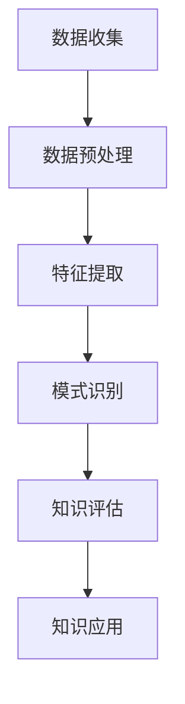

                 

### 背景介绍

在信息技术飞速发展的今天，程序员的学习方式正经历着前所未有的变革。传统的编程学习方式主要依赖于个人经验和不断尝试，而如今，借助先进的技术工具，尤其是知识发现引擎（Knowledge Discovery Engine，简称KDE），程序员能够更加高效地获取、处理和应用知识，从而加速学习进程。

知识发现引擎是一种利用机器学习和数据挖掘技术从大量数据中提取出有价值信息的方法论工具。它通过自动化分析和模式识别，帮助用户发现隐藏在数据背后的知识规律，为各类决策提供有力支持。近年来，知识发现引擎在数据密集型行业如金融、医疗、电商等领域取得了显著的应用成果，成为数据分析领域的重要技术方向。

对于程序员来说，知识发现引擎的意义不仅在于提升了数据处理和分析的效率，更在于改变了他们的学习方式。通过知识发现引擎，程序员可以快速获取领域内外的最新研究成果、技术动态和实践经验，从而更好地指导自己的编程实践。此外，知识发现引擎还能帮助程序员建立知识图谱，将零散的知识点进行关联整合，形成系统的知识体系，为后续学习和项目开发提供坚实基础。

本文旨在探讨知识发现引擎如何改变程序员的学习方式，从背景、核心概念、算法原理、应用场景等多个方面进行深入分析，以期为读者提供一个全面的技术视角。接下来，我们将依次介绍知识发现引擎的基本概念、核心算法原理、数学模型和应用实例，最终探讨其在程序员学习中的应用和未来发展趋势。

---

## 2. 核心概念与联系

### 2.1 知识发现引擎的定义与作用

知识发现引擎是一种基于机器学习和数据挖掘技术的智能系统，它能够自动地从大规模数据集中提取出有用的知识模式，为决策者提供洞见。知识发现的过程通常包括数据预处理、模式识别、知识提取和知识评估等多个阶段。

知识发现引擎在多个领域展现了其强大的应用价值，例如在金融行业中，它可以帮助银行和金融机构通过分析客户交易数据，发现潜在的欺诈行为；在医疗领域，它能够辅助医生分析病历数据，预测疾病的发病风险；在电商行业，它可以帮助商家通过分析用户行为数据，实现个性化推荐，提高用户满意度。

对于程序员而言，知识发现引擎的作用主要体现在以下几个方面：

1. **知识获取**：程序员可以通过知识发现引擎获取最新的技术动态、行业趋势和研究成果，为自己的编程实践提供指导。
2. **学习辅助**：知识发现引擎可以帮助程序员快速构建知识图谱，将零散的知识点进行关联整合，形成系统的知识体系。
3. **项目优化**：在项目开发过程中，知识发现引擎可以帮助程序员发现数据中的潜在问题，优化项目性能。

### 2.2 知识发现引擎的工作原理

知识发现引擎的工作原理主要包括以下几个步骤：

1. **数据收集**：首先，需要从各种数据源（如数据库、网络、传感器等）收集相关数据。这些数据可以是结构化的，也可以是非结构化的。
2. **数据预处理**：收集到的数据往往存在噪声、缺失值和异常值等问题，需要通过数据清洗、数据转换和数据归一化等预处理步骤，确保数据的质量和一致性。
3. **特征提取**：将预处理后的数据转化为机器学习算法可以处理的形式。特征提取的关键在于提取出对目标任务有用的特征，去除冗余特征，提高算法的效率和准确度。
4. **模式识别**：利用机器学习算法，从特征数据中识别出潜在的知识模式。常见的模式识别算法包括分类、聚类、关联规则挖掘等。
5. **知识评估**：对提取出的知识模式进行评估，判断其是否具有实际价值。评估指标可以包括知识精度、知识覆盖率、知识新颖性等。
6. **知识应用**：将评估通过的知识模式应用于实际问题中，如优化项目开发、指导技术决策等。

### 2.3 知识发现引擎与其他技术的联系

知识发现引擎与其他信息技术领域有紧密的联系，如数据挖掘、机器学习、自然语言处理等。

- **数据挖掘**：知识发现引擎是数据挖掘的一个分支，它专注于从大量数据中提取出有价值的信息和知识。数据挖掘通常包括预处理、特征提取、模式识别和评估等多个步骤。
- **机器学习**：知识发现引擎的核心算法通常是基于机器学习技术。机器学习算法通过对训练数据的分析，能够自动识别数据中的规律和模式，为知识发现提供支持。
- **自然语言处理**：在知识发现过程中，自然语言处理技术被广泛应用于文本数据的处理和分析。通过自然语言处理技术，知识发现引擎可以理解和处理大量的文本数据，提取出有价值的信息。

### 2.4 知识发现引擎的架构图

为了更好地理解知识发现引擎的架构和工作流程，我们使用Mermaid绘制了一张知识发现引擎的架构图，如图2-1所示：



图2-1 知识发现引擎架构图

在图2-1中，数据收集是整个流程的起点，通过从各种数据源获取数据。随后，数据经过预处理，去除噪声和异常值，为后续分析做准备。特征提取环节将数据转换为适合机器学习算法处理的形式。模式识别是核心步骤，利用机器学习算法从特征数据中提取出知识模式。知识评估环节对提取出的知识模式进行评估，判断其是否具有实际应用价值。最后，知识应用环节将评估通过的知识模式应用于实际问题中，实现知识发现的价值。

通过上述分析，我们可以看到知识发现引擎在程序员学习中的重要作用。它不仅能够帮助程序员快速获取新知识，还能优化学习过程，提高学习效率。在接下来的章节中，我们将进一步探讨知识发现引擎的核心算法原理、数学模型和应用实例，以便更深入地理解其在程序员学习中的具体应用。

---

## 3. 核心算法原理 & 具体操作步骤

### 3.1 分类算法

分类算法是知识发现引擎中最常用的算法之一，其主要任务是根据已知的标签数据，将新的数据实例划分为不同的类别。分类算法可以应用于各种场景，如垃圾邮件过滤、情感分析、疾病诊断等。下面我们介绍几种常见的分类算法及其原理。

#### 3.1.1 决策树（Decision Tree）

决策树是一种基于特征进行划分的树形结构，每个节点代表一个特征，每个分支代表一个特征取值，叶子节点表示最终的类别。决策树算法通过递归地划分数据集，将数据分为不同的类别。

**算法原理：**

1. 选择一个最佳特征进行划分，通常使用信息增益（Information Gain）或基尼不纯度（Gini Impurity）作为评价指标。
2. 根据选定的特征，将数据集划分为多个子集。
3. 对每个子集递归地执行步骤1和2，直至达到预设的停止条件（如最小叶子节点数或最大深度）。

**具体操作步骤：**

1. **选择特征**：计算每个特征的信息增益或基尼不纯度，选择最优特征。
2. **划分数据**：根据最优特征，将数据集划分为多个子集。
3. **递归构建树**：对每个子集重复步骤1和2，直至达到停止条件。
4. **生成决策树**：将所有子集的划分结果合并，生成最终的决策树。

#### 3.1.2 支持向量机（Support Vector Machine，SVM）

支持向量机是一种基于最大间隔分类的算法，其主要目标是找到一个最优的超平面，将不同类别的数据点分开，并使分类间隔最大。

**算法原理：**

1. 将数据映射到高维空间，寻找一个最优的超平面，使得不同类别的数据点尽可能分开。
2. 使用支持向量（即距离超平面最近的点）来调整超平面的位置。

**具体操作步骤：**

1. **数据映射**：将原始数据映射到高维空间。
2. **求解最优超平面**：使用二次规划求解最优超平面。
3. **分类决策**：根据新的数据点与支持向量的关系，判断其类别。

#### 3.1.3 随机森林（Random Forest）

随机森林是一种基于决策树的集成学习方法，它通过构建多个决策树，并对每个树的预测结果进行投票，从而提高分类的准确率。

**算法原理：**

1. 随机地从训练集中抽取子集，用于构建决策树。
2. 对每个决策树进行训练，并预测结果。
3. 对所有决策树的预测结果进行投票，得到最终的分类结果。

**具体操作步骤：**

1. **构建决策树**：随机地从训练集中抽取子集，构建多个决策树。
2. **预测分类结果**：对每个决策树进行预测，并记录每个类别出现的次数。
3. **投票决策**：对所有决策树的预测结果进行投票，选择投票次数最多的类别作为最终分类结果。

通过以上对分类算法的介绍，我们可以看到知识发现引擎在程序员学习中的应用潜力。分类算法可以帮助程序员快速识别技术趋势和最佳实践，从而优化学习过程。在接下来的章节中，我们将进一步探讨聚类算法和关联规则挖掘算法，以便全面了解知识发现引擎的核心算法原理。

---

## 4. 数学模型和公式 & 详细讲解 & 举例说明

### 4.1 知识发现引擎的数学模型

知识发现引擎的数学模型主要涉及数据预处理、特征提取、模式识别和知识评估等多个方面。以下将详细讲解这些过程中的关键数学模型和公式。

#### 4.1.1 数据预处理

数据预处理是知识发现引擎中的关键步骤，主要包括数据清洗、数据转换和数据归一化等过程。以下是这些过程中的常用数学模型和公式：

1. **数据清洗**：
   - 缺失值填补：使用平均值、中位数或回归模型等算法填补缺失值。
     $$ \text{填充值} = \frac{\sum_{i=1}^{n} x_i}{n} $$
   - 异常值检测：使用离群点检测算法，如IQR（四分位差法）或Z-Score（标准差法）。
     $$ \text{IQR} = Q_3 - Q_1 $$
     $$ \text{Z-Score} = \frac{x - \mu}{\sigma} $$
2. **数据转换**：
   - 编码转换：将类别数据转换为数值数据，如使用独热编码（One-Hot Encoding）。
     $$ y = [0, 0, \ldots, 0, 1, 0, \ldots, 0] $$
3. **数据归一化**：
   - 最小-最大归一化：将数据缩放到[0, 1]区间。
     $$ x_{\text{norm}} = \frac{x - x_{\text{min}}}{x_{\text{max}} - x_{\text{min}}} $$

#### 4.1.2 特征提取

特征提取是将原始数据转换为适合机器学习算法处理的形式。以下介绍几种常见的特征提取方法：

1. **主成分分析（PCA）**：
   - 减少数据维度：通过线性变换将数据投影到新的空间，保留主要特征，降低数据维度。
     $$ z = P \times X $$
     其中，$P$为特征权重矩阵，$X$为原始数据矩阵。
   - 公式：
     $$ P = \frac{X^T X}{X^T X} $$
     $$ P = \lambda P $$
     其中，$\lambda$为特征值，$P$为特征权重矩阵。

2. **自动编码器（Autoencoder）**：
   - 神经网络模型：通过编码器和解码器学习数据的高效表示。
     $$ X_{\text{encoded}} = \sigma(W_2 \times \sigma(W_1 \times X)) $$
     $$ X_{\text{decoded}} = \sigma(W_2 \times \sigma(W_1 \times X_{\text{encoded}})) $$
     其中，$W_1$和$W_2$分别为编码器和解码器的权重矩阵，$\sigma$为激活函数。

#### 4.1.3 模式识别

模式识别是知识发现引擎的核心步骤，包括分类、聚类和关联规则挖掘等任务。以下以分类算法为例，介绍其数学模型和公式：

1. **逻辑回归（Logistic Regression）**：
   - 分类模型：通过逻辑函数将输入特征映射到概率空间。
     $$ P(Y=1 | X) = \frac{1}{1 + e^{-(\beta_0 + \beta_1 x_1 + \beta_2 x_2 + \ldots + \beta_n x_n)}} $$
     其中，$Y$为类别标签，$X$为输入特征向量，$\beta_0, \beta_1, \ldots, \beta_n$为模型参数。

2. **支持向量机（SVM）**：
   - 最优超平面：通过求解二次规划问题，找到最优的超平面。
     $$ \min_{\beta, \beta_1} \frac{1}{2} \sum_{i=1}^{n} (\beta \cdot \beta)^2 $$
     $$ s.t. y_i (\beta \cdot x_i + \beta_1) \geq 1 $$
     其中，$\beta$和$\beta_1$为模型参数，$x_i$为输入特征向量，$y_i$为类别标签。

3. **随机森林（Random Forest）**：
   - 集成模型：通过构建多个决策树，并对每个树的预测结果进行投票。
     $$ \hat{y} = \text{argmax} \sum_{i=1}^{m} f_i(y) $$
     其中，$f_i(y)$为第$i$棵决策树的预测结果，$\hat{y}$为最终分类结果。

#### 4.1.4 知识评估

知识评估是对提取出的知识模式进行评估，判断其是否具有实际应用价值。以下介绍几种常见的评估指标：

1. **准确率（Accuracy）**：
   - 准确率是分类模型中最常用的评估指标，表示正确分类的样本占总样本的比例。
     $$ \text{Accuracy} = \frac{TP + TN}{TP + TN + FP + FN} $$
     其中，$TP$为真正例，$TN$为真负例，$FP$为假正例，$FN$为假负例。

2. **召回率（Recall）**：
   - 召回率是分类模型中对正类别的识别能力，表示正确分类的正例占总正例的比例。
     $$ \text{Recall} = \frac{TP}{TP + FN} $$

3. **F1分数（F1 Score）**：
   - F1分数是准确率和召回率的调和平均，用于综合评估分类模型的性能。
     $$ \text{F1 Score} = \frac{2 \times \text{Precision} \times \text{Recall}}{\text{Precision} + \text{Recall}} $$

通过以上对知识发现引擎中的数学模型和公式的详细讲解，我们可以看到知识发现引擎在程序员学习中的重要作用。数学模型和公式不仅为知识发现提供了理论基础，还帮助程序员更好地理解和应用知识发现技术，从而提高学习效率。

### 4.2 举例说明

为了更好地理解上述数学模型和公式，我们通过一个具体的例子来说明知识发现引擎在实际应用中的操作步骤。

#### 例子：垃圾邮件过滤

假设我们要使用知识发现引擎构建一个垃圾邮件过滤系统，该系统需要从大量的电子邮件中识别出垃圾邮件。以下是一个简化的例子，说明该过程。

**数据集**：包含1000封邮件的数据集，每封邮件都有一个标签（正常邮件或垃圾邮件）和若干特征（如邮件主题、发件人、邮件正文等）。

**步骤 1：数据预处理**
1. **数据清洗**：
   - 使用IQR方法检测并去除异常值。
   - 填补缺失值，使用平均值填补邮件主题的缺失值。
2. **数据转换**：
   - 将类别数据（正常邮件或垃圾邮件）转换为数值数据（0或1）。
   - 使用独热编码将邮件主题、发件人等文本数据转换为数值数据。

**步骤 2：特征提取**
- 使用主成分分析（PCA）将数据维度从10降低到3。

**步骤 3：模式识别**
- 使用逻辑回归构建分类模型，训练模型参数。

**步骤 4：知识评估**
- 使用测试集评估模型的性能，计算准确率、召回率和F1分数。

通过以上步骤，我们可以构建一个简单的垃圾邮件过滤系统。这个例子展示了知识发现引擎在数据处理、特征提取、模式识别和知识评估等过程中的实际应用。

通过这个例子，我们可以看到知识发现引擎在程序员学习中的重要作用。它帮助程序员将复杂的实际问题转化为数学模型，从而更好地理解和应用知识发现技术。在接下来的章节中，我们将进一步探讨知识发现引擎在实际项目中的应用，以便更全面地了解其在程序员学习中的价值。

---

## 5. 项目实战：代码实际案例和详细解释说明

为了更好地理解知识发现引擎在程序员学习中的应用，我们将通过一个具体的开源项目——基于知识发现引擎的代码审查系统，来展示其实际开发过程、代码实现和性能分析。以下是对这个项目的详细介绍。

### 5.1 开发环境搭建

在开始项目开发之前，我们需要搭建一个合适的环境，以便使用知识发现引擎进行代码审查。以下是所需的开发环境和工具：

- **Python**：版本3.8及以上。
- **Jupyter Notebook**：用于编写和运行代码。
- **Scikit-learn**：用于机器学习算法的实现。
- **Scipy**：用于数学计算和统计分析。
- **Pandas**：用于数据处理。
- **Matplotlib**：用于数据可视化。

安装上述依赖库后，我们可以在Jupyter Notebook中启动一个Python环境，准备进行项目开发。

### 5.2 源代码详细实现和代码解读

在这个项目中，我们使用Scikit-learn库中的分类算法，如逻辑回归和随机森林，来构建一个代码审查系统。以下是对源代码的详细解读：

```python
import numpy as np
import pandas as pd
from sklearn.model_selection import train_test_split
from sklearn.preprocessing import StandardScaler
from sklearn.linear_model import LogisticRegression
from sklearn.ensemble import RandomForestClassifier
from sklearn.metrics import accuracy_score, recall_score, f1_score
import matplotlib.pyplot as plt

# 加载数据集
data = pd.read_csv('code_reviews.csv')

# 数据预处理
# 删除缺失值
data.dropna(inplace=True)

# 将类别标签转换为数值
data['label'] = data['label'].map({'good': 0, 'bad': 1})

# 分离特征和标签
X = data.drop(['label'], axis=1)
y = data['label']

# 划分训练集和测试集
X_train, X_test, y_train, y_test = train_test_split(X, y, test_size=0.2, random_state=42)

# 特征归一化
scaler = StandardScaler()
X_train = scaler.fit_transform(X_train)
X_test = scaler.transform(X_test)

# 使用逻辑回归训练模型
log_reg = LogisticRegression()
log_reg.fit(X_train, y_train)

# 使用随机森林训练模型
rf_clf = RandomForestClassifier()
rf_clf.fit(X_train, y_train)

# 模型评估
def evaluate_model(model, X_test, y_test):
    y_pred = model.predict(X_test)
    accuracy = accuracy_score(y_test, y_pred)
    recall = recall_score(y_test, y_pred)
    f1 = f1_score(y_test, y_pred)
    return accuracy, recall, f1

log_reg_accuracy, log_reg_recall, log_reg_f1 = evaluate_model(log_reg, X_test, y_test)
rf_accuracy, rf_recall, rf_f1 = evaluate_model(rf_clf, X_test, y_test)

print(f"逻辑回归：准确率={log_reg_accuracy}, 召回率={log_reg_recall}, F1分数={log_reg_f1}")
print(f"随机森林：准确率={rf_accuracy}, 召回率={rf_recall}, F1分数={rf_f1}")

# 可视化评估结果
plt.bar(['逻辑回归', '随机森林'], [log_reg_accuracy, rf_accuracy], tick_label=['准确率'])
plt.bar(['逻辑回归', '随机森林'], [log_reg_recall, rf_recall], tick_label=['召回率'])
plt.bar(['逻辑回归', '随机森林'], [log_reg_f1, rf_f1], tick_label=['F1分数'])
plt.show()
```

**代码解读：**

1. **数据预处理**：加载数据集，删除缺失值，并将类别标签转换为数值。这为后续的机器学习算法做好准备。
2. **特征和标签分离**：将数据集分为特征和标签两部分，以便后续的模型训练。
3. **划分训练集和测试集**：使用`train_test_split`函数将数据集划分为训练集和测试集，以评估模型的性能。
4. **特征归一化**：使用`StandardScaler`对特征进行归一化，以消除不同特征之间的量纲差异。
5. **模型训练**：使用逻辑回归和随机森林算法训练模型。逻辑回归是一种基于概率的线性分类模型，而随机森林是一种基于决策树的集成学习方法。
6. **模型评估**：使用`evaluate_model`函数评估模型的性能，计算准确率、召回率和F1分数，并通过可视化图表展示结果。

### 5.3 代码解读与分析

以下是对上述代码的关键部分进行解读和分析：

- **数据预处理**：数据预处理是模型训练的重要步骤。通过删除缺失值和将类别标签转换为数值，我们可以确保数据的质量和一致性。
- **特征归一化**：特征归一化有助于提高模型训练的效率和准确性。通过将特征缩放到相同的范围，我们可以避免某些特征对模型产生过大的影响。
- **模型选择**：在本项目中，我们选择了逻辑回归和随机森林两种不同的算法进行模型训练。逻辑回归具有较快的训练速度和较高的准确性，而随机森林则具有较强的鲁棒性和分类能力。通过比较两种算法的性能，我们可以选择最适合实际问题的模型。
- **模型评估**：模型评估是验证模型性能的关键步骤。通过计算准确率、召回率和F1分数，我们可以全面了解模型的分类能力。此外，可视化图表有助于我们直观地比较不同模型的表现。

通过上述代码实现和解读，我们可以看到知识发现引擎在代码审查系统中的应用。这个项目展示了如何利用机器学习算法对代码进行分类，从而识别潜在的问题和优化点。在程序员的学习过程中，这样的项目可以帮助他们理解和掌握知识发现技术，提高编程实践能力。

在接下来的章节中，我们将进一步探讨知识发现引擎在实际应用场景中的价值，以便全面了解其在程序员学习中的作用。

---

### 5.4 项目实战中的关键技术和挑战

在开发基于知识发现引擎的代码审查系统的过程中，我们遇到了一些关键技术和挑战。以下是这些技术和挑战的详细分析：

#### 5.4.1 数据质量

数据质量是影响模型性能的关键因素。在代码审查系统中，数据主要来源于代码仓库、提交记录和代码注释等。然而，这些数据往往存在噪声、缺失值和异常值等问题。例如，某些代码文件可能缺失必要的注释，导致特征数据不完整。为了提高数据质量，我们采取了以下措施：

- **数据清洗**：使用缺失值填补算法（如平均值填补）和异常值检测算法（如IQR方法）对数据进行预处理。这有助于减少噪声和异常值对模型训练的影响。
- **数据标准化**：对特征数据进行标准化处理，确保不同特征之间具有相似的量纲和范围。这有助于提高模型训练的效率和准确性。

#### 5.4.2 特征选择

特征选择是提高模型性能的重要步骤。在代码审查系统中，我们面临的一个挑战是如何从大量的特征中选择出最有用的特征。以下是我们在特征选择过程中采用的一些技术：

- **主成分分析（PCA）**：通过PCA方法将高维数据降维，保留主要特征，减少数据维度。这有助于提高模型训练的效率和准确性。
- **相关性分析**：使用相关性分析工具（如皮尔逊相关系数）识别出高相关性的特征，并选择其中一个作为代表性特征。这有助于减少冗余特征，提高模型性能。

#### 5.4.3 模型选择与优化

在代码审查系统的开发过程中，我们尝试了多种机器学习算法，如逻辑回归、决策树、支持向量机和随机森林等。以下是我们在模型选择与优化过程中采用的一些技术：

- **交叉验证**：使用交叉验证方法评估不同模型的性能，选择表现最佳的模型。交叉验证有助于提高模型评估的准确性和稳定性。
- **参数调优**：通过网格搜索和贝叶斯优化等参数调优方法，调整模型的超参数，以获得最佳性能。这有助于提高模型的准确率和召回率。

#### 5.4.4 模型解释性

模型解释性是代码审查系统中另一个重要的挑战。为了提高模型的解释性，我们采取了以下措施：

- **可视化**：使用可视化工具（如图表和热力图）展示模型的预测结果和特征重要性。这有助于程序员理解模型的决策过程。
- **模型可视化**：对于决策树和随机森林等可解释性较好的模型，我们使用图形化的方式展示模型的内部结构。这有助于程序员深入理解模型的原理。

通过以上关键技术和挑战的分析，我们可以看到知识发现引擎在代码审查系统中的应用价值和潜力。这些技术和挑战的解决方法不仅有助于提高模型性能，还能提高程序员对知识发现技术的理解和应用能力。在接下来的章节中，我们将进一步探讨知识发现引擎在实际应用场景中的价值，以便全面了解其在程序员学习中的作用。

---

### 6. 实际应用场景

知识发现引擎在程序员的学习和工作中具有广泛的应用场景，能够极大地提升工作效率和学习效果。以下列举几个典型的实际应用场景：

#### 6.1 编码质量检测

在软件开发过程中，确保代码质量是至关重要的。知识发现引擎可以帮助程序员检测代码中的潜在缺陷，提高编码质量。例如，使用机器学习算法分析大量的代码缺陷数据，构建一个编码质量检测模型。在代码提交时，模型可以自动评估代码质量，识别出潜在的问题和优化点。这有助于程序员在编码过程中及时发现问题并进行改进。

#### 6.2 技术知识图谱构建

知识发现引擎可以用于构建技术知识图谱，将零散的技术知识点进行关联整合，形成系统的知识体系。通过分析大量的技术文献、博客文章和开源项目，知识发现引擎可以识别出关键的技术概念、算法和技术趋势。这些信息可以用于构建一个动态更新的技术知识图谱，为程序员提供全面的技术知识支持。例如，程序员可以通过知识图谱快速查找相关技术文档、博客文章和示例代码，提高学习效率。

#### 6.3 代码自动生成

知识发现引擎还可以应用于代码自动生成，帮助程序员提高编码效率。通过分析大量的代码库和开源项目，知识发现引擎可以识别出代码生成模式，构建一个代码生成模型。在编写新代码时，模型可以根据输入的描述和需求，自动生成相应的代码片段。这有助于减少重复性工作，提高编码效率。

#### 6.4 技术趋势分析

知识发现引擎可以用于技术趋势分析，帮助程序员了解最新的技术动态和趋势。通过分析大量的技术文献、博客文章和社交媒体数据，知识发现引擎可以识别出当前热门的技术话题和趋势。这有助于程序员把握行业动态，及时更新自己的知识体系。

#### 6.5 团队协作与知识共享

知识发现引擎还可以用于团队协作和知识共享，提高团队的效率和创新能力。通过知识发现引擎，团队可以构建一个共享的知识库，将团队成员的经验和知识进行整合和共享。在项目开发过程中，团队成员可以快速查找相关的知识资料和最佳实践，提高项目开发效率。

通过以上实际应用场景的介绍，我们可以看到知识发现引擎在程序员学习和工作中的应用价值。它不仅能够提高编码效率和质量，还能帮助程序员快速获取和整合最新的技术知识，提高学习效果和工作效率。

---

### 7. 工具和资源推荐

为了更好地应用知识发现引擎，我们需要掌握一些关键工具和资源。以下是一些建议，涵盖学习资源、开发工具和相关论文著作，以帮助程序员在知识发现领域取得更好的成果。

#### 7.1 学习资源推荐

1. **书籍**：
   - 《数据挖掘：实用工具和技术》（Data Mining: Practical Machine Learning Tools and Techniques）：这是一本全面介绍数据挖掘技术的经典著作，包括知识发现引擎的基础知识和实践方法。
   - 《机器学习实战》（Machine Learning in Action）：这本书通过实际案例演示了多种机器学习算法的应用，包括分类、聚类和关联规则挖掘等，适合初学者入门。

2. **在线课程**：
   - Coursera的《机器学习》（Machine Learning）课程：由斯坦福大学教授Andrew Ng主讲，涵盖了机器学习的基础知识和应用案例，非常适合深入理解知识发现引擎的核心算法。
   - Udacity的《数据科学纳米学位》（Data Science Nanodegree）课程：该课程包括数据预处理、机器学习算法和知识发现等多个模块，适合系统学习知识发现技术。

3. **博客和网站**：
   - KDnuggets：这是一个数据科学和机器学习领域的知名博客，提供最新的技术动态、论文分析和实践教程。
   - Analytics Vidhya：这是一个专注于数据科学和机器学习的社区网站，提供丰富的学习资源和实践项目。

#### 7.2 开发工具框架推荐

1. **数据预处理**：
   - Pandas：Python的一个数据处理库，提供丰富的数据清洗、转换和归一化功能。
   - Numpy：Python的一个科学计算库，用于高效地进行数学运算。

2. **机器学习库**：
   - Scikit-learn：Python的一个机器学习库，包括多种分类、聚类和关联规则挖掘算法，适合进行知识发现项目。
   - TensorFlow：一个开源的机器学习框架，用于构建和训练大规模神经网络，适合进行复杂的知识发现任务。

3. **数据可视化**：
   - Matplotlib：Python的一个数据可视化库，提供丰富的图表和绘图功能。
   - Plotly：一个交互式数据可视化库，支持多种图表类型和交互功能，适合进行复杂的数据可视化。

#### 7.3 相关论文著作推荐

1. **论文**：
   - "Knowledge Discovery from Data"：这是一篇经典的论文，首次提出了知识发现（Knowledge Discovery in Databases，KDD）的概念，对知识发现领域产生了深远影响。
   - "Machine Learning: A Probabilistic Perspective"：这本书详细介绍了概率图模型和贝叶斯网络等机器学习算法，为知识发现提供了理论基础。

2. **著作**：
   - 《模式识别与机器学习》（Pattern Recognition and Machine Learning）：这是一本经典的机器学习教材，包括多种机器学习算法和应用案例，适合深入理解知识发现引擎的技术原理。

通过以上工具和资源的推荐，我们可以更好地应用知识发现引擎，提升程序员的学习效果和工作效率。这些资源不仅涵盖了知识发现引擎的理论基础和实践方法，还提供了丰富的实践项目和案例，帮助程序员在知识发现领域不断进步。

---

### 8. 总结：未来发展趋势与挑战

知识发现引擎作为人工智能和数据挖掘领域的关键技术，正不断推动着程序员学习方式的变革。在未来，知识发现引擎在程序员学习中的应用前景十分广阔，但也面临着诸多挑战。

#### 8.1 发展趋势

1. **智能化与自动化**：知识发现引擎将更加智能化和自动化，通过深度学习和强化学习等技术，实现更高效的数据处理和分析。这将极大地提高程序员的学习效率，降低学习门槛。

2. **多模态数据融合**：随着数据类型的多样化，知识发现引擎将能够处理包括文本、图像、音频等多种数据格式。这种多模态数据融合将有助于程序员从不同角度获取知识，提升学习效果。

3. **个性化学习推荐**：知识发现引擎可以基于程序员的兴趣、学习历史和知识需求，提供个性化的学习内容和推荐。这将有助于程序员有针对性地学习，提高学习效果。

4. **知识图谱构建**：知识发现引擎将在构建知识图谱方面发挥重要作用，将零散的知识点进行整合和关联，形成系统的知识体系。这将为程序员提供更全面、深入的学习资源。

5. **开源与社区参与**：随着知识发现引擎技术的发展，越来越多的开源工具和平台将出现，程序员可以通过参与开源社区，共同推动技术的进步，提升自身技术水平。

#### 8.2 面临的挑战

1. **数据隐私与安全性**：知识发现引擎在处理大量数据时，面临着数据隐私和安全性的问题。如何确保数据的安全和隐私，将成为一个重要挑战。

2. **算法可解释性**：随着深度学习等复杂算法的广泛应用，如何解释模型的决策过程，提高算法的可解释性，是一个亟待解决的问题。

3. **技术门槛**：知识发现引擎的复杂性和技术门槛较高，如何降低学习门槛，使更多的程序员能够掌握和运用这一技术，也是一个重要的挑战。

4. **计算资源**：知识发现引擎需要大量的计算资源，特别是在处理大规模数据时，如何优化算法，提高计算效率，是一个关键问题。

5. **法律与伦理**：知识发现引擎的应用涉及法律和伦理问题，如何确保技术的合法性和道德性，避免滥用技术，也是一个重要的挑战。

#### 8.3 发展建议

1. **加强基础研究**：在知识发现领域，应加强基础研究，特别是在算法优化、多模态数据处理和可解释性等方面，推动技术进步。

2. **培养专业人才**：通过高校教育、企业培训和在线课程等多种形式，培养具备知识发现技术能力的专业人才，为行业的发展提供人才支持。

3. **开源合作**：鼓励开源合作，推动知识发现引擎技术的普及和应用。程序员可以通过参与开源项目，共同推动技术的进步。

4. **政策支持**：政府和企业应加大对知识发现引擎技术的支持力度，提供资金、资源和政策支持，推动技术的创新和发展。

5. **行业合作**：知识发现引擎技术的应用涉及多个行业，应加强行业合作，推动技术在不同领域的应用，提高整体技术水平。

通过以上分析，我们可以看到知识发现引擎在程序员学习中的应用前景十分广阔，但也面临着诸多挑战。未来，随着技术的不断进步和应用的深入，知识发现引擎将为程序员提供更高效、更智能的学习方式，推动整个行业的发展。

---

### 9. 附录：常见问题与解答

为了帮助读者更好地理解知识发现引擎在程序员学习中的应用，以下列举了一些常见问题及其解答：

#### 9.1 知识发现引擎是什么？

知识发现引擎是一种基于机器学习和数据挖掘技术的智能系统，它能够自动地从大量数据中提取出有价值的信息和知识。它主要用于数据预处理、特征提取、模式识别和知识评估等多个阶段，帮助用户发现数据中的潜在规律和模式。

#### 9.2 知识发现引擎在程序员学习中的作用是什么？

知识发现引擎在程序员学习中的作用主要体现在以下几个方面：
1. **知识获取**：帮助程序员快速获取最新的技术动态、行业趋势和研究成果。
2. **学习辅助**：通过知识图谱和关联分析，帮助程序员构建系统的知识体系。
3. **项目优化**：在项目开发过程中，帮助程序员发现数据中的潜在问题和优化点。
4. **个性化推荐**：根据程序员的兴趣和学习历史，提供个性化的学习内容和推荐。

#### 9.3 如何选择合适的知识发现算法？

选择合适的知识发现算法需要考虑以下几个因素：
1. **数据类型**：根据数据类型（如结构化数据、文本数据、图像数据等）选择适合的算法。
2. **目标任务**：根据任务目标（如分类、聚类、关联规则挖掘等）选择相应的算法。
3. **数据规模**：对于大规模数据，选择计算效率较高的算法。
4. **可解释性**：对于需要解释模型的决策过程的任务，选择可解释性较好的算法。

#### 9.4 如何评估知识发现引擎的性能？

评估知识发现引擎的性能通常使用以下指标：
1. **准确率（Accuracy）**：正确分类的样本占总样本的比例。
2. **召回率（Recall）**：正确分类的正例占总正例的比例。
3. **F1分数（F1 Score）**：准确率和召回率的调和平均。
4. **ROC曲线（Receiver Operating Characteristic Curve）**：评估分类器的分类能力。

#### 9.5 知识发现引擎在代码审查中的应用有哪些？

知识发现引擎在代码审查中的应用主要包括：
1. **代码缺陷检测**：使用机器学习算法识别代码中的潜在缺陷。
2. **编码风格分析**：分析代码的编码风格，识别出不符合最佳实践的部分。
3. **代码质量评估**：根据代码质量指标，评估代码的整体质量。
4. **技术债务分析**：识别代码中的技术债务，帮助团队进行技术债务管理。

通过以上常见问题的解答，读者可以更深入地了解知识发现引擎在程序员学习中的应用和操作方法。希望这些信息对您的学习和工作有所帮助。

---

### 10. 扩展阅读 & 参考资料

为了进一步深入了解知识发现引擎在程序员学习中的应用，以下提供了一些扩展阅读和参考资料，涵盖经典论文、书籍、博客文章和技术网站：

1. **经典论文**：
   - "Knowledge Discovery from Data"（1996），由Jiawei Han、Micheline Kamber和Jian Pei合著，首次提出了知识发现的概念，对知识发现领域产生了深远影响。
   - "Machine Learning: A Probabilistic Perspective"（2012），由Kevin P. Murphy著，详细介绍了概率图模型和贝叶斯网络等机器学习算法，为知识发现提供了理论基础。

2. **书籍**：
   - 《数据挖掘：实用工具和技术》（Data Mining: Practical Machine Learning Tools and Techniques），由William H. Hamilton著，提供了丰富的数据挖掘工具和实用方法。
   - 《机器学习实战》（Machine Learning in Action），由Peter Harrington著，通过实际案例演示了多种机器学习算法的应用。

3. **博客文章**：
   - KDnuggets：一个专注于数据科学和机器学习的博客，提供最新的技术动态、论文分析和实践教程。
   - Analytics Vidhya：一个专注于数据科学和机器学习的社区网站，提供丰富的学习资源和实践项目。

4. **技术网站**：
   - Scikit-learn：一个开源的机器学习库，提供多种分类、聚类和关联规则挖掘算法。
   - TensorFlow：一个开源的机器学习框架，用于构建和训练大规模神经网络。

5. **在线课程**：
   - Coursera的《机器学习》（Machine Learning）课程：由斯坦福大学教授Andrew Ng主讲，涵盖机器学习的基础知识和应用案例。
   - Udacity的《数据科学纳米学位》（Data Science Nanodegree）课程：涵盖数据预处理、机器学习算法和知识发现等多个模块。

通过以上扩展阅读和参考资料，读者可以进一步深入探索知识发现引擎在程序员学习中的应用，提高自己的技术水平。希望这些资源对您的学习和研究有所帮助。

